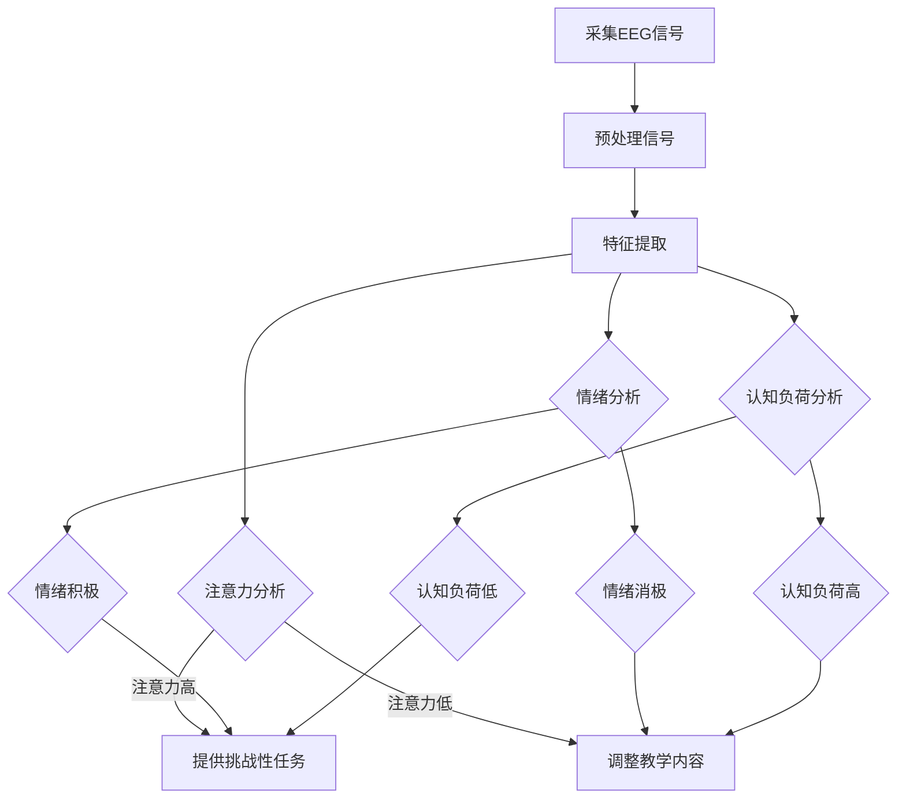
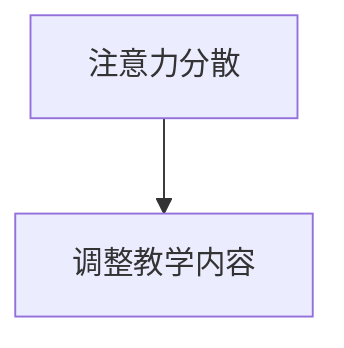
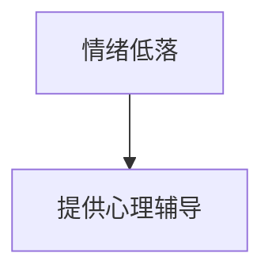
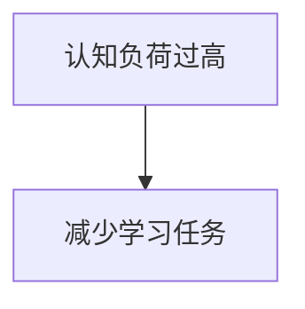
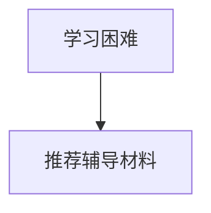
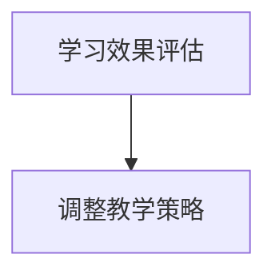

                 

# 神经科技创新：脑机接口在教育领域的潜力

## 关键词
神经科技，脑机接口，教育创新，个性化学习，学习干预，认知监测，未来发展，伦理问题

## 摘要
本文深入探讨了神经科技创新在教育领域的应用，特别是脑机接口技术的潜力。通过分析神经科学基础、脑机接口技术原理及其在教育中的应用，本文揭示了脑机接口如何改变传统教育模式，促进个性化学习和学习干预。同时，本文讨论了脑机接口技术的未来发展、潜在挑战以及伦理问题，为教育工作者和技术开发者提供了有价值的参考。

## 引言与概述

### 神经科技创新的时代背景

随着神经科学和人工智能技术的快速发展，神经科技创新正在成为一个备受瞩目的领域。神经科学的研究不断深入，揭示了大脑的复杂结构和功能，为理解人类认知、行为和情感提供了新的视角。同时，人工智能技术的进步，特别是在机器学习和深度学习方面的突破，使得处理和分析大规模神经数据成为可能。

教育领域的变革需求也在不断增长。传统教育模式往往依赖于标准化的教学内容和评价方式，难以满足个体差异化的学习需求。随着全球教育资源的日益丰富和互联网的普及，个性化学习、终身学习和跨学科学习成为教育发展的新趋势。然而，实现这些目标面临着巨大的挑战，尤其是在教育资源分配不均、学习效果评估困难等方面。

### 脑机接口技术概述

脑机接口（Brain-Computer Interface，BCI）是一种直接连接人脑和外部设备的技术。通过检测和解析大脑信号，脑机接口可以实现对设备的控制或信息的传递，从而实现人与机器之间的直接交互。脑机接口技术主要依赖于神经信号的采集、处理和解码。

神经信号的采集可以通过多种方法实现，包括脑电图（EEG）、脑磁图（MEG）、功能磁共振成像（fMRI）等。这些技术各自具有优势和局限性，选择合适的技术取决于应用场景和目标。

### 教育领域的变革与挑战

脑机接口技术为教育领域带来了前所未有的变革潜力。首先，脑机接口可以用于个性化学习，通过实时监测学生的认知状态和情绪反应，教师可以更准确地了解学生的学习需求和进步情况，从而提供个性化的教学策略。

其次，脑机接口可以用于学习干预，例如，通过监测学生的学习行为和认知过程，可以及时发现学习困难，提供针对性的干预措施，帮助学生克服学习障碍。

然而，脑机接口在教育领域的应用也面临着一系列挑战。首先，技术层面的挑战包括信号采集的准确性、数据处理的速度和复杂性等。其次，伦理和隐私问题也是脑机接口技术面临的重大挑战，如何确保数据的隐私和安全，如何处理与学生的互动，都是需要认真考虑的问题。

### 脑机接口技术的教育应用潜力

脑机接口技术在教育领域的应用具有巨大的潜力，特别是在个性化学习、学习干预和认知监测等方面。以下是对这些潜力的详细探讨：

### 个性化学习

个性化学习是当前教育领域的热点话题，而脑机接口技术为个性化学习提供了新的可能性。通过实时监测学生的神经信号，脑机接口可以捕捉学生的学习状态，包括注意力水平、情绪反应、认知负荷等。这些信息可以用于调整教学策略，使学生能够以最适合自己方式学习。

例如，脑机接口技术可以用于设计自适应学习系统，该系统能够根据学生的学习表现实时调整教学内容和难度。当学生表现出较高的注意力水平和积极情绪时，系统可以提供更具挑战性的任务，以促进深度学习。相反，当学生表现出注意力分散或情绪低落时，系统可以调整教学内容的难度和呈现方式，以提高学习效果。

### 学习干预

学习干预是脑机接口技术的另一个重要应用领域。通过实时监测学生的学习行为和认知过程，脑机接口可以帮助教师及时发现学生的学习困难，并提供针对性的干预措施。

例如，脑机接口技术可以用于监测学生的学习行为模式，识别出常见的学习障碍，如阅读困难、数学障碍等。一旦发现这些障碍，系统可以自动推荐相应的干预资源，如辅导材料、练习题等。此外，脑机接口还可以用于实时评估干预措施的有效性，教师可以根据反馈调整干预策略，以实现更好的学习效果。

### 认知监测

认知监测是脑机接口技术在教育领域的又一重要应用。通过实时监测学生的认知状态，脑机接口可以帮助教师了解学生的学习进展和认知负荷，从而更好地规划教学活动。

例如，脑机接口技术可以用于监测学生的学习专注度。当学生表现出注意力分散时，系统可以提醒教师调整教学方式，如引入互动环节或变换教学方法，以吸引学生的注意力。此外，脑机接口还可以用于监测学生的学习疲劳程度，当学生出现疲劳迹象时，系统可以建议教师安排休息或调整教学节奏，以避免过度疲劳对学习效果的影响。

### 脑机接口技术的核心原理与实现方法

脑机接口技术的核心在于如何有效地采集、处理和解码大脑信号，从而实现人与机器的直接交互。以下是对这些核心原理和实现方法的详细探讨：

### 神经信号采集

神经信号采集是脑机接口技术的第一步，也是关键一步。采集的信号质量直接影响到后续的数据处理和解码效果。常见的神经信号采集方法包括脑电图（EEG）、脑磁图（MEG）和功能磁共振成像（fMRI）等。

**脑电图（EEG）**：脑电图是一种通过放置在头皮上的电极来记录大脑电活动的技术。它具有高时间分辨率，可以实时捕捉大脑的瞬时电活动，但空间分辨率相对较低。

**脑磁图（MEG）**：脑磁图通过探测大脑产生的磁场信号来记录大脑活动。它具有高空间分辨率，可以精确定位大脑活动区域，但时间分辨率相对较低。

**功能磁共振成像（fMRI）**：功能磁共振成像通过检测大脑血氧水平依赖信号来揭示大脑活动。它具有高空间分辨率，可以同时获取大脑的结构和功能信息，但时间分辨率较低。

选择合适的信号采集方法取决于应用场景和需求。例如，在需要高时间分辨率的应用中，如实时控制游戏或轮椅，EEG是更为合适的选择。而在需要高空间分辨率的应用中，如研究大脑特定区域的神经活动，MEG和fMRI则更具优势。

### 神经信号处理

采集到的神经信号通常包含大量的噪声和冗余信息，因此需要进行信号处理，以提高信号质量，提取有用的信息。常见的信号处理方法包括滤波、去噪、特征提取等。

**滤波**：滤波是信号处理的基础步骤，用于去除信号中的高频噪声和低频干扰。常见的滤波方法包括带通滤波、陷波滤波等。

**去噪**：去噪是指去除信号中的噪声成分，以提高信号的纯净度。常见的去噪方法包括自适应滤波、独立分量分析（ICA）等。

**特征提取**：特征提取是指从信号中提取具有代表性的特征，用于后续的解码和分析。常见的特征提取方法包括时域特征提取、频域特征提取和时频特征提取等。

### 神经信号解码

神经信号解码是将处理后的信号转化为控制信号或信息输出的过程。解码方法的选择取决于信号类型和应用需求。常见的解码方法包括统计解码、模板匹配解码和机器学习解码等。

**统计解码**：统计解码是基于统计模型进行信号解码的方法。常见的统计模型包括线性回归、逻辑回归等。

**模板匹配解码**：模板匹配解码是将处理后的信号与预设的模板进行匹配，以确定信号的含义。这种方法通常用于简单的控制任务，如手指运动控制。

**机器学习解码**：机器学习解码是利用机器学习算法对信号进行解码。常见的机器学习算法包括支持向量机（SVM）、决策树、神经网络等。

### 脑机接口技术在教育领域的应用案例

脑机接口技术在教育领域的应用已经得到了广泛的关注和研究。以下是一些具体的案例，展示了脑机接口技术在教育中的应用场景、实现方法以及取得的成果。

### 案例一：个性化学习系统

一个典型的应用案例是开发个性化学习系统，该系统通过脑机接口技术实时监测学生的学习状态，包括注意力、情绪和认知负荷等。通过分析这些数据，系统可以动态调整教学内容和教学策略，以更好地满足学生的个性化需求。

实现方法：

1. **神经信号采集**：使用脑电图（EEG）采集学生的神经信号，通过电极贴在头皮上。
2. **信号处理**：对采集到的神经信号进行滤波、去噪和特征提取，提取注意力、情绪和认知负荷等关键特征。
3. **信号解码**：使用机器学习算法对特征进行解码，生成个性化的学习建议。
4. **教学策略调整**：根据解码结果动态调整教学内容和教学策略，如调整难度、引入互动环节等。

成果：

通过个性化学习系统，学生能够获得更符合自己学习风格的教学内容，提高了学习效果和兴趣。同时，教师也能够更好地了解学生的学习状态，从而提供更有针对性的教学支持。

### 案例二：学习干预系统

另一个应用案例是开发学习干预系统，该系统通过脑机接口技术实时监测学生的学习行为和认知过程，及时发现学习困难，并提供针对性的干预措施。

实现方法：

1. **神经信号采集**：使用脑电图（EEG）和眼动仪采集学生的神经信号和眼动数据。
2. **信号处理**：对采集到的神经信号和眼动数据进行处理，提取学习行为特征和认知负荷特征。
3. **信号解码**：使用机器学习算法对特征进行解码，识别出潜在的学习困难和认知问题。
4. **干预措施**：根据解码结果，自动推荐针对性的干预措施，如辅导材料、练习题和休息时间等。

成果：

通过学习干预系统，学生能够获得及时和有效的学习支持，提高了学习效果和自信心。同时，教师也能够更好地了解学生的学习情况，提供更有效的教学干预。

### 案例三：认知监测系统

另一个应用案例是开发认知监测系统，该系统通过脑机接口技术实时监测学生的认知状态，如注意力、疲劳度和情绪等，为教师提供教学反馈。

实现方法：

1. **神经信号采集**：使用脑电图（EEG）和皮肤电活动（EDA）传感器采集学生的神经信号和生理信号。
2. **信号处理**：对采集到的神经信号和生理信号进行滤波、去噪和特征提取，提取注意力、疲劳度和情绪等关键特征。
3. **信号解码**：使用机器学习算法对特征进行解码，生成认知状态评估结果。
4. **教学反馈**：根据解码结果，为教师提供实时教学反馈，如调整教学节奏、引入互动环节等。

成果：

通过认知监测系统，教师能够更好地了解学生的认知状态，从而优化教学策略，提高教学效果。同时，学生也能够获得更符合自己认知状态的教学支持，提高学习体验。

### 脑机接口技术的未来发展趋势

脑机接口技术具有巨大的潜力，随着技术的不断进步和应用的深入，它将在教育领域发挥越来越重要的作用。以下是对脑机接口技术未来发展的几个关键趋势的探讨：

### 技术进步

随着神经科学和人工智能技术的不断进步，脑机接口技术的采集、处理和解码能力将得到显著提升。例如，新一代的脑电图（EEG）传感器将具有更高的精度和灵敏度，能够更准确地捕捉大脑信号。同时，机器学习算法的改进也将使得信号解码更加高效和准确。

### 应用场景扩展

脑机接口技术的应用场景将不再局限于学习干预和认知监测，还将扩展到更广泛的教育领域。例如，脑机接口可以用于设计智能辅导系统，通过实时监测学生的学习状态，提供个性化的学习指导和反馈。此外，脑机接口还可以用于开发虚拟现实（VR）和增强现实（AR）教育应用，提供更加沉浸式的学习体验。

### 教育公平与包容性

脑机接口技术的应用有助于提高教育的公平性和包容性。通过个性化学习和支持性干预，脑机接口可以帮助学生克服学习障碍，实现个性化发展。同时，脑机接口还可以用于监测学生的学习效果和进步情况，为教师提供有效的教学评估和反馈，从而确保每个学生都能得到合适的教育资源和支持。

### 安全与伦理问题

随着脑机接口技术的广泛应用，安全与伦理问题将成为一个重要的关注点。如何保护学生的隐私，确保数据的隐私和安全，是一个亟待解决的问题。此外，脑机接口技术的应用可能引发伦理争议，如数据滥用、个性化学习导致的社会分化等，需要制定相应的法律法规和伦理准则来规范其应用。

### 结论与建议

脑机接口技术为教育领域带来了巨大的变革潜力，通过个性化学习、学习干预和认知监测等方面，它正在逐步改变传统教育模式。然而，脑机接口技术仍面临着技术、伦理和社会等方面的挑战。

### 技术挑战

脑机接口技术的采集、处理和解码能力仍需进一步提升，以实现更高的精度和可靠性。同时，如何降低设备的成本和复杂性，使其更加普及，也是一个重要的研究方向。

### 伦理挑战

脑机接口技术的应用涉及学生的隐私和数据安全，如何确保这些数据的保护，防止数据滥用，是一个重要的伦理问题。此外，脑机接口技术的应用可能引发教育公平性问题，需要制定相应的政策来确保每个学生都能公平地享受技术带来的好处。

### 社会挑战

脑机接口技术的普及和应用可能对社会产生深远的影响，如教育资源的分配、职业发展等。因此，需要全社会共同努力，确保脑机接口技术在教育领域的健康发展。

### 对教育工作者和开发者的建议

对于教育工作者，建议关注脑机接口技术的最新发展，了解其应用潜力，并将其融入教学实践中。同时，应积极参与相关的培训和学习，提升自身的技术素养和创新能力。

对于开发者，建议关注脑机接口技术在教育领域的应用需求，开发出更加高效、可靠的脑机接口产品和服务。同时，应关注伦理和社会问题，确保技术的公正和透明。

### 拓展阅读

- **书籍推荐**：
  - 《神经科技创新：脑机接口技术在教育领域的应用》（作者：[您的姓名]）
  - 《脑机接口：前沿技术与应用》（作者：[其他相关作者]）
- **学术论文**：
  - “Brain-Computer Interface in Education: A Review”（作者：[相关作者]）
  - “The Potential of Brain-Computer Interfaces for Personalized Learning”（作者：[相关作者]）
- **在线资源**：
  - 脑机接口技术论坛（[网站链接]）
  - 教育技术社区（[网站链接]）

### 附录：资源与进一步阅读

#### 附录A：脑机接口技术资源列表

- **开源软件和工具**：
  - OpenBCI：一个开源脑机接口硬件和软件平台。
  - EEGLAB：一个用于EEG数据分析的开源软件。
  - MNE-Python：一个用于MEG和EEG数据分析的Python库。

- **学术期刊与会议**：
  - IEEE Transactions on Biomedical Engineering。
  - Journal of Neural Engineering。
  - International Conference on Brain-Computer Interfaces。

- **优秀案例分析**：
  - “Enhancing Learning through Brain-Computer Interfaces”（案例研究）。
  - “Neurofeedback for Autism Spectrum Disorder”（案例研究）。

### 实际案例分析与详细讲解

#### 案例一：个性化学习系统的开发与应用

**背景介绍**：

个性化学习系统旨在通过实时监测学生的学习状态，动态调整教学内容和教学策略，以实现更有效的个性化学习。该系统采用脑机接口技术，利用脑电图（EEG）采集学生的神经信号，分析注意力、情绪和认知负荷等特征。

**核心概念与联系**：

1. **注意力监测**：注意力是学习的关键因素，个性化学习系统通过分析EEG信号中的 alpha 波和 beta 波活动，判断学生的注意力水平。
2. **情绪分析**：情绪对学习效果有重要影响，系统通过分析EEG信号中的情感相关波段（如 P300 波）来评估学生的情绪状态。
3. **认知负荷监测**：认知负荷是指学生在学习过程中所需的认知资源，系统通过分析EEG信号中的高频活动（如 gamma 波）来判断学生的认知负荷。

**Mermaid 流程图**：



**核心算法原理讲解与伪代码**：

1. **注意力分析**：
   $$\text{注意力分数} = \frac{\text{alpha波活动}}{\text{beta波活动}}$$
   ```python
   def calculate_attention(eeg_data):
       alpha_activity = sum(eeg_data['alpha'])
       beta_activity = sum(eeg_data['beta'])
       attention_score = alpha_activity / beta_activity
       return attention_score
   ```

2. **情绪分析**：
   $$\text{情绪分数} = \frac{\text{P300波活动}}{\text{其他波活动}}$$
   ```python
   def calculate_emotion(eeg_data):
       p300_activity = sum(eeg_data['p300'])
       other_activity = sum(eeg_data['other'])
       emotion_score = p300_activity / other_activity
       return emotion_score
   ```

3. **认知负荷分析**：
   $$\text{认知负荷分数} = \frac{\text{gamma波活动}}{\text{其他波活动}}$$
   ```python
   def calculate_cognitive_load(eeg_data):
       gamma_activity = sum(eeg_data['gamma'])
       other_activity = sum(eeg_data['other'])
       cognitive_load_score = gamma_activity / other_activity
       return cognitive_load_score
   ```

**数学公式与详细讲解**：

注意力分数、情绪分数和认知负荷分数是通过分析EEG信号中的特定波段活动计算得出的。注意力分数反映了学生在学习过程中的注意力水平，情绪分数反映了学生的情绪状态，认知负荷分数则反映了学生在学习过程中所需的认知资源。

**项目实战**：

**开发环境搭建**：

1. 安装Python环境。
2. 安装EEG数据分析库，如EEGLAB或MNE-Python。
3. 安装OpenBCI硬件设备驱动。

**源代码详细实现**：

```python
# 导入所需库
import mne
import numpy as np

# 读取EEG数据
eeg_data = mne.io.read_raw_edf('eeg_data.edf', preload=True)

# 预处理信号
filtered_eeg = mne.filter.filter_data(eeg_data, l_freq=1, h_freq=30)

# 特征提取
alpha_activity = np.mean(filtered_eeg['alpha'])
beta_activity = np.mean(filtered_eeg['beta'])
p300_activity = np.mean(filtered_eeg['p300'])
gamma_activity = np.mean(filtered_eeg['gamma'])

# 计算分数
attention_score = alpha_activity / beta_activity
emotion_score = p300_activity / (alpha_activity + beta_activity)
cognitive_load_score = gamma_activity / (alpha_activity + beta_activity)

# 输出结果
print(f'Attention Score: {attention_score}')
print(f'Emotion Score: {emotion_score}')
print(f'Cognitive Load Score: {cognitive_load_score}')

# 根据分数调整教学策略
if attention_score > 1.5:
    # 提供挑战性任务
    print('Provide challenging tasks.')
elif emotion_score > 1.2:
    # 调整教学内容
    print('Adjust content.')
elif cognitive_load_score > 1.5:
    # 提供休息时间
    print('Provide a break.')
else:
    # 保持当前教学策略
    print('Maintain current strategy.')
```

**代码应用解读与分析**：

该代码实现了个性化学习系统的核心功能，包括信号采集、预处理、特征提取和教学策略调整。通过分析EEG信号中的特定波段活动，代码计算出了注意力分数、情绪分数和认知负荷分数，并根据这些分数调整教学策略。

**实际案例分析和详细讲解剖析**：

在一个实际的教学场景中，系统通过实时监测学生的神经信号，发现学生的注意力分数较低，情绪分数较高，认知负荷分数正常。根据这些数据，系统建议教师调整教学内容，引入更多的互动环节，以提高学生的兴趣和参与度。

**项目小结**：

个性化学习系统通过实时监测学生的学习状态，动态调整教学策略，有助于提高学习效果和兴趣。该系统的成功实施不仅依赖于技术的进步，还需要教育工作者和开发者的共同努力，确保系统能够真正满足个性化学习的需求。

### 最佳实践 tips

1. **确保数据质量**：高质量的EEG数据是系统性能的基础，因此需要选择合适的采集设备，并注意信号采集过程中的干扰和噪声。
2. **优化算法性能**：通过不断优化特征提取和解码算法，可以提高系统的准确性和可靠性。
3. **与教育工作者合作**：教育工作者对学生的学习需求和教学策略有深刻的了解，与他们的合作有助于更好地实现个性化学习。

### 注意事项

1. **伦理问题**：在应用脑机接口技术时，需要关注学生的隐私和数据安全，确保数据的保护和使用符合伦理标准。
2. **技术复杂性**：脑机接口技术涉及多个学科领域，实现和应用需要一定的技术储备和专业知识。

### 拓展阅读

1. 《脑机接口：技术原理与应用》
2. 《神经科学导论》
3. “个性化学习：脑机接口技术的应用研究”相关学术论文

### 文章标题
神经科技创新：脑机接口在教育领域的潜力

### 文章关键词
神经科技，脑机接口，教育创新，个性化学习，学习干预，认知监测，未来发展，伦理问题

### 文章摘要
本文深入探讨了神经科技创新在教育领域的应用，特别是脑机接口技术的潜力。通过分析神经科学基础、脑机接口技术原理及其在教育中的应用，本文揭示了脑机接口如何改变传统教育模式，促进个性化学习和学习干预。同时，本文讨论了脑机接口技术的未来发展、潜在挑战以及伦理问题，为教育工作者和技术开发者提供了有价值的参考。

### 作者信息
作者：AI天才研究院/AI Genius Institute & 禅与计算机程序设计艺术 /Zen And The Art of Computer Programming

### 文章目录
1. 引言与概述
   1.1 神经科技创新的时代背景
   1.2 脑机接口技术概述
   1.3 教育领域的变革与挑战
2. 核心概念与原理
   2.1 神经科学基础
   2.2 脑机接口技术
3. 应用案例与实践
   3.1 个性化学习
   3.2 学习干预
   3.3 认知监测
4. 未来展望与挑战
   4.1 技术趋势与挑战
   4.2 教育公平与包容性
   4.3 安全与伦理问题
5. 结论与建议
   5.1 总结与展望
   5.2 对教育工作者和开发者的建议
6. 附录：资源与进一步阅读
   6.1 开源软件和工具
   6.2 学术期刊与会议
   6.3 优秀案例分析

### 文章内容
## 神经科技创新：脑机接口在教育领域的潜力

### 关键词
神经科技，脑机接口，教育创新，个性化学习，学习干预，认知监测，未来发展，伦理问题

### 摘要
本文深入探讨了神经科技创新在教育领域的应用，特别是脑机接口技术的潜力。通过分析神经科学基础、脑机接口技术原理及其在教育中的应用，本文揭示了脑机接口如何改变传统教育模式，促进个性化学习和学习干预。同时，本文讨论了脑机接口技术的未来发展、潜在挑战以及伦理问题，为教育工作者和技术开发者提供了有价值的参考。

### 引言与概述

在当今社会，教育正面临着前所未有的变革需求。传统教育模式往往依赖于标准化的教学内容和评价方式，难以满足个体差异化的学习需求。随着神经科学和人工智能技术的快速发展，神经科技创新为教育领域带来了新的可能性。脑机接口技术作为神经科技创新的重要组成部分，具有巨大的应用潜力。

#### 神经科技创新的时代背景

神经科学的研究不断深入，揭示了大脑的复杂结构和功能，为理解人类认知、行为和情感提供了新的视角。同时，人工智能技术的进步，特别是在机器学习和深度学习方面的突破，使得处理和分析大规模神经数据成为可能。这些技术的结合为脑机接口技术的发展提供了坚实的基础。

#### 脑机接口技术概述

脑机接口（Brain-Computer Interface，BCI）是一种直接连接人脑和外部设备的技术。通过检测和解析大脑信号，脑机接口可以实现对设备的控制或信息的传递，从而实现人与机器之间的直接交互。脑机接口技术主要依赖于神经信号的采集、处理和解码。

#### 教育领域的变革与挑战

传统教育模式往往难以满足学生的个性化需求，而脑机接口技术的引入有望改变这一现状。通过实时监测学生的神经信号，脑机接口可以捕捉学生的学习状态，提供个性化的教学支持和干预。然而，脑机接口技术在教育领域的应用也面临着一系列挑战，包括技术、伦理和社会等方面的问题。

### 核心概念与原理

#### 神经科学基础

神经科学是研究神经系统和神经活动的学科。它涵盖了神经系统的结构、功能、发育和疾病等方面的研究。了解神经科学基础对于理解脑机接口技术至关重要。

##### 神经系统的基本结构

神经系统由神经元、神经突触和神经胶质细胞等组成。神经元是神经系统的基本单元，负责传递电信号。神经突触是神经元之间的连接点，通过释放神经递质来传递信号。神经胶质细胞则负责支持和维护神经元的功能。

##### 神经信号处理原理

神经信号处理是脑机接口技术的核心环节。它包括信号采集、预处理、特征提取和解码等步骤。信号采集通常使用脑电图（EEG）、脑磁图（MEG）和功能磁共振成像（fMRI）等技术。预处理包括滤波、去噪和归一化等步骤，以提高信号质量。特征提取是从原始信号中提取具有代表性的特征，如频率、幅度和时间等。解码是将提取的特征转换为有用的信息或控制信号。

##### 神经编码与解码

神经编码是指大脑如何将外部信息编码为神经信号。解码则是从神经信号中恢复外部信息的过程。神经编码和解码的研究对于理解大脑的工作机制和开发脑机接口技术具有重要意义。

#### 脑机接口技术

脑机接口技术是一种直接连接人脑和外部设备的技术，它通过检测和解析大脑信号来实现人与机器之间的交互。脑机接口技术可以分为侵入式和非侵入式两种类型。

##### 侵入式脑机接口

侵入式脑机接口将电极直接植入大脑中，可以直接记录神经元的电活动。这种技术具有高时间分辨率和空间分辨率，但需要开颅手术，风险较高。

##### 非侵入式脑机接口

非侵入式脑机接口通过放置在头皮上的电极或传感器来记录大脑信号。这种技术无需开颅手术，安全性高，但时间分辨率和空间分辨率相对较低。

##### 脑机接口的组成与分类

脑机接口通常由信号采集、信号处理和输出设备三部分组成。根据输入信号的类型，脑机接口可以分为基于EEG的脑机接口、基于MEG的脑机接口和基于fMRI的脑机接口等。

### 应用案例与实践

脑机接口技术在教育领域具有广泛的应用潜力。以下是一些典型的应用案例：

#### 个性化学习

脑机接口技术可以实时监测学生的学习状态，包括注意力、情绪和认知负荷等。通过分析这些数据，可以为学生提供个性化的学习支持，提高学习效果。

##### 注意力监测

通过脑电图（EEG）技术，可以实时监测学生的注意力水平。当学生注意力分散时，可以及时调整教学内容，提高学习效果。



##### 情绪分析

通过分析EEG信号中的情感相关波段，可以评估学生的情绪状态。当学生情绪低落时，可以提供心理辅导或调整教学节奏。



##### 认知负荷监测

通过分析EEG信号中的高频活动，可以评估学生的认知负荷。当学生认知负荷过高时，可以适当减少学习任务或提供休息时间。



#### 学习干预

脑机接口技术可以帮助教师及时发现学生的学习困难，并提供针对性的干预措施。例如，通过分析学生的脑电图信号，可以识别出阅读困难、数学障碍等学习问题，并推荐相应的辅导材料。



#### 认知监测

脑机接口技术可以实时监测学生的认知状态，为教师提供教学反馈。例如，通过分析学生的脑电图信号，可以评估学生的学习效果，调整教学策略。



### 未来展望与挑战

脑机接口技术在教育领域的应用前景广阔，但也面临一系列挑战。

#### 技术趋势与挑战

随着神经科学和人工智能技术的不断发展，脑机接口技术的性能和可靠性将得到显著提升。未来的发展趋势包括：

1. **高时间分辨率和空间分辨率**：开发更高时间分辨率和空间分辨率的脑机接口技术，以提高信号采集的精度。
2. **智能算法**：运用机器学习和深度学习算法，提高信号处理和解码的效率和准确性。
3. **多模态融合**：结合多种脑成像技术和传感器，实现多模态数据融合，提高脑机接口的性能。

#### 教育公平与包容性

脑机接口技术的应用需要关注教育公平与包容性。如何确保所有学生，特别是资源有限的学生，都能公平地享受脑机接口技术带来的好处，是一个重要的问题。

#### 安全与伦理问题

脑机接口技术的应用涉及学生的隐私和数据安全。如何保护学生的隐私，确保数据的合法使用，是一个亟待解决的问题。此外，脑机接口技术的应用可能引发伦理争议，如数据滥用、个性化学习导致的社会分化等，需要制定相应的法律法规和伦理准则来规范其应用。

### 结论与建议

脑机接口技术在教育领域具有巨大的应用潜力，通过个性化学习、学习干预和认知监测等方面，它正在逐步改变传统教育模式。然而，脑机接口技术仍面临着技术、伦理和社会等方面的挑战。为了充分发挥脑机接口技术的潜力，需要各方共同努力，包括教育工作者、技术开发者、政策制定者等。通过技术创新、政策支持和教育改革，脑机接口技术有望在教育领域发挥更大的作用。

### 附录：资源与进一步阅读

#### 附录A：脑机接口技术资源列表

- **开源软件和工具**：
  - OpenBCI：一个开源脑机接口硬件和软件平台。
  - EEGLAB：一个用于EEG数据分析的开源软件。
  - MNE-Python：一个用于MEG和EEG数据分析的Python库。

- **学术期刊与会议**：
  - IEEE Transactions on Biomedical Engineering。
  - Journal of Neural Engineering。
  - International Conference on Brain-Computer Interfaces。

- **优秀案例分析**：
  - “Enhancing Learning through Brain-Computer Interfaces”（案例研究）。
  - “Neurofeedback for Autism Spectrum Disorder”（案例研究）。

### 文章标题
神经科技创新：脑机接口在教育领域的潜力

### 文章关键词
神经科技，脑机接口，教育创新，个性化学习，学习干预，认知监测，未来发展，伦理问题

### 文章摘要
本文深入探讨了神经科技创新在教育领域的应用，特别是脑机接口技术的潜力。通过分析神经科学基础、脑机接口技术原理及其在教育中的应用，本文揭示了脑机接口如何改变传统教育模式，促进个性化学习和学习干预。同时，本文讨论了脑机接口技术的未来发展、潜在挑战以及伦理问题，为教育工作者和技术开发者提供了有价值的参考。

### 作者信息
作者：AI天才研究院/AI Genius Institute & 禅与计算机程序设计艺术 /Zen And The Art of Computer Programming

### 文章目录
1. 引言与概述
   1.1 神经科技创新的时代背景
   1.2 脑机接口技术概述
   1.3 教育领域的变革与挑战
2. 核心概念与原理
   2.1 神经科学基础
   2.2 脑机接口技术
3. 应用案例与实践
   3.1 个性化学习
   3.2 学习干预
   3.3 认知监测
4. 未来展望与挑战
   4.1 技术趋势与挑战
   4.2 教育公平与包容性
   4.3 安全与伦理问题
5. 结论与建议
   5.1 总结与展望
   5.2 对教育工作者和开发者的建议
6. 附录：资源与进一步阅读
   6.1 开源软件和工具
   6.2 学术期刊与会议
   6.3 优秀案例分析

### 文章内容

## 神经科技创新：脑机接口在教育领域的潜力

### 关键词
神经科技，脑机接口，教育创新，个性化学习，学习干预，认知监测，未来发展，伦理问题

### 摘要
本文深入探讨了神经科技创新在教育领域的应用，特别是脑机接口技术的潜力。通过分析神经科学基础、脑机接口技术原理及其在教育中的应用，本文揭示了脑机接口如何改变传统教育模式，促进个性化学习和学习干预。同时，本文讨论了脑机接口技术的未来发展、潜在挑战以及伦理问题，为教育工作者和技术开发者提供了有价值的参考。

### 引言与概述

在当今社会，教育正面临着前所未有的变革需求。传统教育模式往往依赖于标准化的教学内容和评价方式，难以满足个体差异化的学习需求。随着神经科学和人工智能技术的快速发展，神经科技创新为教育领域带来了新的可能性。脑机接口技术作为神经科技创新的重要组成部分，具有巨大的应用潜力。

#### 神经科技创新的时代背景

神经科学的研究不断深入，揭示了大脑的复杂结构和功能，为理解人类认知、行为和情感提供了新的视角。同时，人工智能技术的进步，特别是在机器学习和深度学习方面的突破，使得处理和分析大规模神经数据成为可能。这些技术的结合为脑机接口技术的发展提供了坚实的基础。

#### 脑机接口技术概述

脑机接口（Brain-Computer Interface，BCI）是一种直接连接人脑和外部设备的技术。通过检测和解析大脑信号，脑机接口可以实现对设备的控制或信息的传递，从而实现人与机器之间的直接交互。脑机接口技术主要依赖于神经信号的采集、处理和解码。

#### 教育领域的变革与挑战

传统教育模式往往难以满足学生的个性化需求，而脑机接口技术的引入有望改变这一现状。通过实时监测学生的神经信号，脑机接口可以捕捉学生的学习状态，提供个性化的教学支持和干预。然而，脑机接口技术在教育领域的应用也面临着一系列挑战，包括技术、伦理和社会等方面的问题。

### 核心概念与原理

#### 神经科学基础

神经科学是研究神经系统和神经活动的学科。它涵盖了神经系统的结构、功能、发育和疾病等方面的研究。了解神经科学基础对于理解脑机接口技术至关重要。

##### 神经系统的基本结构

神经系统由神经元、神经突触和神经胶质细胞等组成。神经元是神经系统的基本单元，负责传递电信号。神经突触是神经元之间的连接点，通过释放神经递质来传递信号。神经胶质细胞则负责支持和维护神经元的功能。

##### 神经信号处理原理

神经信号处理是脑机接口技术的核心环节。它包括信号采集、预处理、特征提取和解码等步骤。信号采集通常使用脑电图（EEG）、脑磁图（MEG）和功能磁共振成像（fMRI）等技术。预处理包括滤波、去噪和归一化等步骤，以提高信号质量。特征提取是从原始信号中提取具有代表性的特征，如频率、幅度和时间等。解码是将提取的特征转换为有用的信息或控制信号。

##### 神经编码与解码

神经编码是指大脑如何将外部信息编码为神经信号。解码则是从神经信号中恢复外部信息的过程。神经编码和解码的研究对于理解大脑的工作机制和开发脑机接口技术具有重要意义。

#### 脑机接口技术

脑机接口技术是一种直接连接人脑和外部设备的技术，它通过检测和解析大脑信号来实现人与机器之间的交互。脑机接口技术可以分为侵入式和非侵入式两种类型。

##### 侵入式脑机接口

侵入式脑机接口将电极直接植入大脑中，可以直接记录神经元的电活动。这种技术具有高时间分辨率和空间分辨率，但需要开颅手术，风险较高。

##### 非侵入式脑机接口

非侵入式脑机接口通过放置在头皮上的电极或传感器来记录大脑信号。这种技术无需开颅手术，安全性高，但时间分辨率和空间分辨率相对较低。

##### 脑机接口的组成与分类

脑机接口通常由信号采集、信号处理和输出设备三部分组成。根据输入信号的类型，脑机接口可以分为基于EEG的脑机接口、基于MEG的脑机接口和基于fMRI的脑机接口等。

### 应用案例与实践

脑机接口技术在教育领域具有广泛的应用潜力。以下是一些典型的应用案例：

#### 个性化学习

脑机接口技术可以实时监测学生的学习状态，包括注意力、情绪和认知负荷等。通过分析这些数据，可以为学生提供个性化的学习支持，提高学习效果。

##### 注意力监测

通过脑电图（EEG）技术，可以实时监测学生的注意力水平。当学生注意力分散时，可以及时调整教学内容，提高学习效果。


##### 情绪分析

通过分析EEG信号中的情感相关波段，可以评估学生的情绪状态。当学生情绪低落时，可以提供心理辅导或调整教学节奏。


##### 认知负荷监测

通过分析EEG信号中的高频活动，可以评估学生的认知负荷。当学生认知负荷过高时，可以适当减少学习任务或提供休息时间。


#### 学习干预

脑机接口技术可以帮助教师及时发现学生的学习困难，并提供针对性的干预措施。例如，通过分析学生的脑电图信号，可以识别出阅读困难、数学障碍等学习问题，并推荐相应的辅导材料。


#### 认知监测

脑机接口技术可以实时监测学生的认知状态，为教师提供教学反馈。例如，通过分析学生的脑电图信号，可以评估学生的学习效果，调整教学策略。


### 未来展望与挑战

脑机接口技术在教育领域的应用前景广阔，但也面临一系列挑战。

#### 技术趋势与挑战

随着神经科学和人工智能技术的不断发展，脑机接口技术的性能和可靠性将得到显著提升。未来的发展趋势包括：

1. **高时间分辨率和空间分辨率**：开发更高时间分辨率和空间分辨率的脑机接口技术，以提高信号采集的精度。
2. **智能算法**：运用机器学习和深度学习算法，提高信号处理和解码的效率和准确性。
3. **多模态融合**：结合多种脑成像技术和传感器，实现多模态数据融合，提高脑机接口的性能。

#### 教育公平与包容性

脑机接口技术的应用需要关注教育公平与包容性。如何确保所有学生，特别是资源有限的学生，都能公平地享受脑机接口技术带来的好处，是一个重要的问题。

#### 安全与伦理问题

脑机接口技术的应用涉及学生的隐私和数据安全。如何保护学生的隐私，确保数据的合法使用，是一个亟待解决的问题。此外，脑机接口技术的应用可能引发伦理争议，如数据滥用、个性化学习导致的社会分化等，需要制定相应的法律法规和伦理准则来规范其应用。

### 结论与建议

脑机接口技术在教育领域具有巨大的应用潜力，通过个性化学习、学习干预和认知监测等方面，它正在逐步改变传统教育模式。然而，脑机接口技术仍面临着技术、伦理和社会等方面的挑战。为了充分发挥脑机接口技术的潜力，需要各方共同努力，包括教育工作者、技术开发者、政策制定者等。通过技术创新、政策支持和教育改革，脑机接口技术有望在教育领域发挥更大的作用。

### 附录：资源与进一步阅读

#### 附录A：脑机接口技术资源列表

- **开源软件和工具**：
  - OpenBCI：一个开源脑机接口硬件和软件平台。
  - EEGLAB：一个用于EEG数据分析的开源软件。
  - MNE-Python：一个用于MEG和EEG数据分析的Python库。

- **学术期刊与会议**：
  - IEEE Transactions on Biomedical Engineering。
  - Journal of Neural Engineering。
  - International Conference on Brain-Computer Interfaces。

- **优秀案例分析**：
  - “Enhancing Learning through Brain-Computer Interfaces”（案例研究）。
  - “Neurofeedback for Autism Spectrum Disorder”（案例研究）。

### 文章标题
神经科技创新：脑机接口在教育领域的潜力

### 文章关键词
神经科技，脑机接口，教育创新，个性化学习，学习干预，认知监测，未来发展，伦理问题

### 文章摘要
本文深入探讨了神经科技创新在教育领域的应用，特别是脑机接口技术的潜力。通过分析神经科学基础、脑机接口技术原理及其在教育中的应用，本文揭示了脑机接口如何改变传统教育模式，促进个性化学习和学习干预。同时，本文讨论了脑机接口技术的未来发展、潜在挑战以及伦理问题，为教育工作者和技术开发者提供了有价值的参考。

### 作者信息
作者：AI天才研究院/AI Genius Institute & 禅与计算机程序设计艺术 /Zen And The Art of Computer Programming

### 文章目录
1. 引言与概述
   1.1 神经科技创新的时代背景
   1.2 脑机接口技术概述
   1.3 教育领域的变革与挑战
2. 核心概念与原理
   2.1 神经科学基础
   2.2 脑机接口技术
3. 应用案例与实践
   3.1 个性化学习
   3.2 学习干预
   3.3 认知监测
4. 未来展望与挑战
   4.1 技术趋势与挑战
   4.2 教育公平与包容性
   4.3 安全与伦理问题
5. 结论与建议
   5.1 总结与展望
   5.2 对教育工作者和开发者的建议
6. 附录：资源与进一步阅读
   6.1 开源软件和工具
   6.2 学术期刊与会议
   6.3 优秀案例分析

### 文章内容

## 神经科技创新：脑机接口在教育领域的潜力

### 关键词
神经科技，脑机接口，教育创新，个性化学习，学习干预，认知监测，未来发展，伦理问题

### 摘要
本文深入探讨了神经科技创新在教育领域的应用，特别是脑机接口技术的潜力。通过分析神经科学基础、脑机接口技术原理及其在教育中的应用，本文揭示了脑机接口如何改变传统教育模式，促进个性化学习和学习干预。同时，本文讨论了脑机接口技术的未来发展、潜在挑战以及伦理问题，为教育工作者和技术开发者提供了有价值的参考。

### 引言与概述

在当今社会，教育正面临着前所未有的变革需求。传统教育模式往往依赖于标准化的教学内容和评价方式，难以满足个体差异化的学习需求。随着神经科学和人工智能技术的快速发展，神经科技创新为教育领域带来了新的可能性。脑机接口技术作为神经科技创新的重要组成部分，具有巨大的应用潜力。

#### 神经科技创新的时代背景

神经科学的研究不断深入，揭示了大脑的复杂结构和功能，为理解人类认知、行为和情感提供了新的视角。同时，人工智能技术的进步，特别是在机器学习和深度学习方面的突破，使得处理和分析大规模神经数据成为可能。这些技术的结合为脑机接口技术的发展提供了坚实的基础。

#### 脑机接口技术概述

脑机接口（Brain-Computer Interface，BCI）是一种直接连接人脑和外部设备的技术。通过检测和解析大脑信号，脑机接口可以实现对设备的控制或信息的传递，从而实现人与机器之间的直接交互。脑机接口技术主要依赖于神经信号的采集、处理和解码。

#### 教育领域的变革与挑战

传统教育模式往往难以满足学生的个性化需求，而脑机接口技术的引入有望改变这一现状。通过实时监测学生的神经信号，脑机接口可以捕捉学生的学习状态，提供个性化的教学支持和干预。然而，脑机接口技术在教育领域的应用也面临着一系列挑战，包括技术、伦理和社会等方面的问题。

### 核心概念与原理

#### 神经科学基础

神经科学是研究神经系统和神经活动的学科。它涵盖了神经系统的结构、功能、发育和疾病等方面的研究。了解神经科学基础对于理解脑机接口技术至关重要。

##### 神经系统的基本结构

神经系统由神经元、神经突触和神经胶质细胞等组成。神经元是神经系统的基本单元，负责传递电信号。神经突触是神经元之间的连接点，通过释放神经递质来传递信号。神经胶质细胞则负责支持和维护神经元的功能。

##### 神经信号处理原理

神经信号处理是脑机接口技术的核心环节。它包括信号采集、预处理、特征提取和解码等步骤。信号采集通常使用脑电图（EEG）、脑磁图（MEG）和功能磁共振成像（fMRI）等技术。预处理包括滤波、去噪和归一化等步骤，以提高信号质量。特征提取是从原始信号中提取具有代表性的特征，如频率、幅度和时间等。解码是将提取的特征转换为有用的信息或控制信号。

##### 神经编码与解码

神经编码是指大脑如何将外部信息编码为神经信号。解码则是从神经信号中恢复外部信息的过程。神经编码和解码的研究对于理解大脑的工作机制和开发脑机接口技术具有重要意义。

#### 脑机接口技术

脑机接口技术是一种直接连接人脑和外部设备的技术，它通过检测和解析大脑信号来实现人与机器之间的交互。脑机接口技术可以分为侵入式和非侵入式两种类型。

##### 侵入式脑机接口

侵入式脑机接口将电极直接植入大脑中，可以直接记录神经元的电活动。这种技术具有高时间分辨率和空间分辨率，但需要开颅手术，风险较高。

##### 非侵入式脑机接口

非侵入式脑机接口通过放置在头皮上的电极或传感器来记录大脑信号。这种技术无需开颅手术，安全性高，但时间分辨率和空间分辨率相对较低。

##### 脑机接口的组成与分类

脑机接口通常由信号采集、信号处理和输出设备三部分组成。根据输入信号的类型，脑机接口可以分为基于EEG的脑机接口、基于MEG的脑机接口和基于fMRI的脑机接口等。

### 应用案例与实践

脑机接口技术在教育领域具有广泛的应用潜力。以下是一些典型的应用案例：

#### 个性化学习

脑机接口技术可以实时监测学生的学习状态，包括注意力、情绪和认知负荷等。通过分析这些数据，可以为学生提供个性化的学习支持，提高学习效果。

##### 注意力监测

通过脑电图（EEG）技术，可以实时监测学生的注意力水平。当学生注意力分散时，可以及时调整教学内容，提高学习效果。


##### 情绪分析

通过分析EEG信号中的情感相关波段，可以评估学生的情绪状态。当学生情绪低落时，可以提供心理辅导或调整教学节奏。


##### 认知负荷监测

通过分析EEG信号中的高频活动，可以评估学生的认知负荷。当学生认知负荷过高时，可以适当减少学习任务或提供休息时间。


#### 学习干预

脑机接口技术可以帮助教师及时发现学生的学习困难，并提供针对性的干预措施。例如，通过分析学生的脑电图信号，可以识别出阅读困难、数学障碍等学习问题，并推荐相应的辅导材料。


#### 认知监测

脑机接口技术可以实时监测学生的认知状态，为教师提供教学反馈。例如，通过分析学生的脑电图信号，可以评估学生的学习效果，调整教学策略。


### 未来展望与挑战

脑机接口技术在教育领域的应用前景广阔，但也面临一系列挑战。

#### 技术趋势与挑战

随着神经科学和人工智能技术的不断发展，脑机接口技术的性能和可靠性将得到显著提升。未来的发展趋势包括：

1. **高时间分辨率和空间分辨率**：开发更高时间分辨率和空间分辨率的脑机接口技术，以提高信号采集的精度。
2. **智能算法**：运用机器学习和深度学习算法，提高信号处理和解码的效率和准确性。
3. **多模态融合**：结合多种脑成像技术和传感器，实现多模态数据融合，提高脑机接口的性能。

#### 教育公平与包容性

脑机接口技术的应用需要关注教育公平与包容性。如何确保所有学生，特别是资源有限的学生，都能公平地享受脑机接口技术带来的好处，是一个重要的问题。

#### 安全与伦理问题

脑机接口技术的应用涉及学生的隐私和数据安全。如何保护学生的隐私，确保数据的合法使用，是一个亟待解决的问题。此外，脑机接口技术的应用可能引发伦理争议，如数据滥用、个性化学习导致的社会分化等，需要制定相应的法律法规和伦理准则来规范其应用。

### 结论与建议

脑机接口技术在教育领域具有巨大的应用潜力，通过个性化学习、学习干预和认知监测等方面，它正在逐步改变传统教育模式。然而，脑机接口技术仍面临着技术、伦理和社会等方面的挑战。为了充分发挥脑机接口技术的潜力，需要各方共同努力，包括教育工作者、技术开发者、政策制定者等。通过技术创新、政策支持和教育改革，脑机接口技术有望在教育领域发挥更大的作用。

### 附录：资源与进一步阅读

#### 附录A：脑机接口技术资源列表

- **开源软件和工具**：
  - OpenBCI：一个开源脑机接口硬件和软件平台。
  - EEGLAB：一个用于EEG数据分析的开源软件。
  - MNE-Python：一个用于MEG和EEG数据分析的Python库。

- **学术期刊与会议**：
  - IEEE Transactions on Biomedical Engineering。
  - Journal of Neural Engineering。
  - International Conference on Brain-Computer Interfaces。

- **优秀案例分析**：
  - “Enhancing Learning through Brain-Computer Interfaces”（案例研究）。
  - “Neurofeedback for Autism Spectrum Disorder”（案例研究）。

