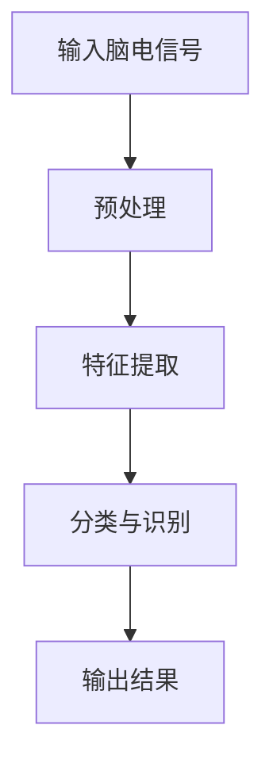
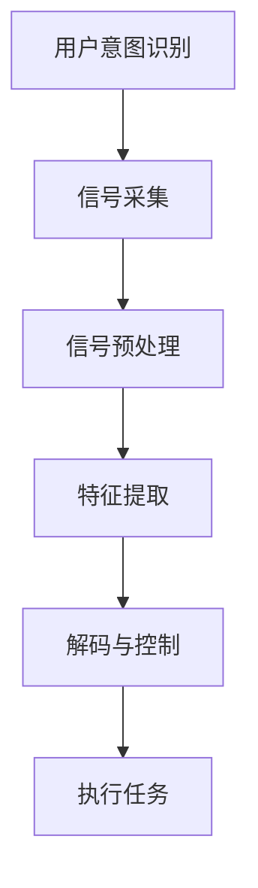

                 

### 文章标题：神经科技在提升运动表现中的应用

> 关键词：神经科技、运动表现、脑电信号、脑机接口、康复训练

> 摘要：本文从神经科技的定义、历史、核心概念与应用入手，深入探讨了神经科技在提升运动表现中的具体应用，包括运动训练、康复训练和竞技体育。通过详细解析核心算法原理、数学模型及公式，并结合实际案例，全面展示了神经科技在运动领域的潜力和前景。

## 第1章：神经科技概述

### 1.1 神经科技的定义与历史

**神经科技**，是指应用现代科学技术手段研究和处理神经系统相关问题的学科。它涵盖了生物神经工程、神经调节与刺激技术、脑机接口技术以及神经影像技术等多个领域。

**历史发展**：

- **20世纪初**：神经科技的基础研究开始，以理解神经系统的工作原理为目标。
- **20世纪50年代**：脑电图（EEG）的出现，使得神经信号的检测和分析成为可能。
- **20世纪80年代**：脑机接口（BCI）技术的诞生，为人类与机器的直接通信提供了新的途径。
- **21世纪初**：神经影像技术如功能性磁共振成像（fMRI）的发展，使得对大脑活动的观察和测量达到了前所未有的精度。

### 1.2 神经科技的核心概念与领域

**核心概念**：

1. **生物神经工程**：通过工程技术和方法研究神经系统，包括神经修复、神经增强和神经控制等。
2. **神经调节与刺激技术**：利用电刺激、化学刺激等方法，调节神经系统的功能。
3. **脑机接口技术**：通过直接接口，实现大脑与外部设备或机器之间的通信。
4. **神经影像技术**：使用影像技术如fMRI、PET等，观察和测量大脑的功能和结构。

**领域**：

- **神经信号处理**：包括脑电信号（EEG）、肌电信号（EMG）等的处理与分析。
- **神经调节与刺激**：如经颅磁刺激（TMS）、电刺激等。
- **脑机接口**：研究大脑与外部设备之间的接口技术。
- **神经影像**：研究大脑功能与结构的影像学技术。

### 1.3 神经科技的发展趋势与挑战

**发展趋势**：

- **技术革新**：随着人工智能、大数据和云计算等技术的发展，神经科技在数据采集、处理和分析方面将实现更大突破。
- **个性化治疗**：基于个体神经特征的精准治疗将成为未来医疗的趋势。
- **人机融合**：脑机接口技术将使得人类与机器的融合更加紧密。

**挑战**：

- **技术成熟度**：一些神经科技技术仍处于实验室阶段，需要更多的研究和实践来验证其有效性和安全性。
- **伦理问题**：神经科技的应用可能引发一系列伦理问题，如隐私、人权等。
- **社会接受度**：公众对神经科技的了解和接受度有待提高。

## 第2章：神经科技在运动表现中的应用

### 2.1 神经科技在运动训练中的应用

**脑电信号分析**：

- **技术原理**：通过脑电图（EEG）捕捉运动员的大脑信号，分析其注意力和集中程度。
- **应用场景**：用于监控运动员的赛前状态、训练效果和心理压力。

**动态平衡与协调能力训练**：

- **技术原理**：利用生物反馈技术，实时监控和调整运动员的平衡和协调能力。
- **应用场景**：用于提升运动员的稳定性、灵活性和反应速度。

### 2.2 神经科技在康复训练中的应用

**运动功能恢复**：

- **技术原理**：通过电刺激或生物反馈，促进神经和肌肉的修复和再生。
- **应用场景**：用于恢复运动员的伤后功能，提高康复速度。

**肌肉力量与耐力训练**：

- **技术原理**：利用电刺激或阻力训练，增强肌肉的力量和耐力。
- **应用场景**：用于提升运动员的整体运动能力。

### 2.3 神经科技在竞技体育中的应用

**高级运动技能训练**：

- **技术原理**：通过脑机接口技术，实现大脑对运动技能的精细控制。
- **应用场景**：用于训练运动员的高难度动作和复杂策略。

**竞技表现优化策略**：

- **技术原理**：结合神经信号分析和心理测试，制定个性化的训练和比赛策略。
- **应用场景**：用于提升运动员的竞技水平和心理素质。

## 第3章：核心算法原理讲解

### 3.1 脑电信号分析算法

**伪代码描述**：

```
输入：脑电信号数据
输出：分析结果

预处理：
1. 数据滤波
2. 数据分段
3. 数据归一化

特征提取：
1. 时域特征提取
2. 频域特征提取

分类与识别：
1. 训练分类模型
2. 测试分类模型
3. 输出分类结果
```

**算法流程图**：

```
Mermaid 图：图形无法在此展示，请在支持Mermaid的编辑器中查看

graph TD
    A[输入脑电信号] --> B[预处理]
    B --> C[特征提取]
    C --> D[分类与识别]
    D --> E[输出结果]
```

### 3.2 脑机接口技术原理

**伪代码描述**：

```
输入：用户意图
输出：控制信号

信号采集：
1. 采集脑电信号
2. 预处理脑电信号

信号预处理：
1. 滤波
2. 去噪
3. 归一化

特征提取：
1. 时域特征提取
2. 频域特征提取

解码与控制：
1. 训练解码模型
2. 解码用户意图
3. 生成控制信号

执行任务：
1. 根据控制信号执行任务
```

**算法流程图**：

```
Mermaid 图：图形无法在此展示，请在支持Mermaid的编辑器中查看

graph TD
    A[用户意图识别] --> B[信号采集]
    B --> C[信号预处理]
    C --> D[特征提取]
    D --> E[解码与控制]
    E --> F[执行任务]
```

### 3.3 神经调节与刺激技术

**伪代码描述**：

```
输入：训练参数
输出：调节结果

调节与刺激：
1. 设计调节策略
2. 实施电刺激或化学刺激
3. 监测神经反应

反馈与调整：
1. 收集反馈数据
2. 调整调节参数
3. 优化调节策略
```

**算法流程图**：

```
Mermaid 图：图形无法在此展示，请在支持Mermaid的编辑器中查看

graph TD
    A[训练参数] --> B[调节与刺激]
    B --> C[反馈与调整]
    C --> D[优化调节策略]
```

## 第4章：神经科技在运动康复中的应用

### 4.1 康复训练中的神经科技应用

**技术原理**：

- **电刺激**：利用电流刺激受损神经，促进神经和肌肉的再生。
- **生物反馈**：通过实时监控和反馈，帮助运动员掌握康复过程中的正确动作和姿势。

**应用场景**：

- **肌肉损伤康复**：通过电刺激，增强肌肉力量和耐力。
- **神经损伤康复**：通过生物反馈，促进神经传导功能的恢复。

**算法流程图**：

```
Mermaid 图：图形无法在此展示，请在支持Mermaid的编辑器中查看

graph TD
    A[损伤评估] --> B[设计康复方案]
    B --> C[实施电刺激]
    C --> D[实时监控]
    D --> E[生物反馈]
    E --> F[调整康复方案]
```

### 4.2 案例分析：神经科技在康复中的应用实例

**案例介绍**：

某篮球运动员在比赛中不幸腿部骨折，经过手术和初步康复后，开始尝试使用神经科技进行进一步的康复训练。

**案例分析**：

1. **评估损伤情况**：医生通过肌电图（EMG）和神经传导速度测试，评估运动员的神经和肌肉功能。
2. **设计康复方案**：根据评估结果，制定个性化的康复计划，包括电刺激和生物反馈训练。
3. **实施康复训练**：运动员每天进行电刺激训练，结合生物反馈技术，逐步恢复肌肉力量和神经传导功能。
4. **调整康复方案**：根据康复进展，调整训练参数和方案，以最大化康复效果。

**解读**：

通过神经科技的应用，运动员的康复速度得到了显著提升，肌肉力量和神经传导功能得到了有效恢复，为重返赛场奠定了基础。

## 第5章：神经科技在竞技体育中的应用

### 5.1 竞技体育中的神经科技应用

**技术原理**：

- **脑电信号分析**：通过分析运动员的脑电信号，了解其心理状态和注意力水平。
- **脑机接口**：通过脑机接口技术，实现大脑对运动技能的精细控制。

**应用场景**：

- **高难度动作训练**：利用脑机接口技术，帮助运动员实现高难度动作的自动化控制。
- **竞技策略制定**：结合神经信号分析和心理测试，制定个性化的竞技策略。

### 5.2 案例分析：神经科技在竞技体育中的应用实例

**案例介绍**：

某世界级乒乓球运动员在比赛中使用脑机接口技术，提升了自己的竞技水平。

**案例分析**：

1. **脑电信号采集**：在比赛前，运动员进行脑电信号采集，分析其心理状态和注意力水平。
2. **训练脑机接口**：通过反复训练，使运动员能够更好地控制自己的脑电信号，实现高难度动作的自动化。
3. **比赛应用**：在比赛中，运动员利用脑机接口技术，实现精准的控制和反应，从而提升了竞技水平。

**解读**：

通过神经科技的应用，运动员在比赛中实现了更高的集中度和反应速度，为其夺冠提供了有力支持。

## 第6章：神经科技的安全与伦理问题

### 6.1 神经科技的安全性问题

**安全风险评估**：

- **技术层面**：确保神经科技设备的可靠性和安全性，避免设备故障导致意外伤害。
- **数据层面**：保护运动员的隐私和数据安全，防止数据泄露和滥用。

**安全防护措施**：

- **技术防护**：采用加密技术、权限管理等措施，确保数据的安全传输和存储。
- **法律防护**：制定相关法律法规，规范神经科技的应用和监管。

### 6.2 神经科技的伦理问题

**伦理原则**：

- **尊重个人权利**：确保运动员的知情权和选择权，尊重其个人意愿。
- **公正性**：确保神经科技的应用公平，避免造成不公平竞争。

**伦理争议案例分析**：

- **增强运动员能力**：神经科技在提升运动员能力的同时，可能引发能力增强与公平竞争的争议。
- **隐私保护**：运动员的神经信号和训练数据可能被滥用，引发隐私保护问题。

## 第7章：神经科技的未来展望

### 7.1 神经科技的发展趋势

- **技术革新**：随着人工智能、大数据和云计算等技术的发展，神经科技将在数据处理、分析和应用方面实现更大突破。
- **应用拓展**：神经科技将在更多领域得到应用，如医疗、教育、军事等。

### 7.2 神经科技在社会中的影响

- **社会影响**：神经科技将改变人类的生活方式，提高生活质量。
- **社会责任**：企业和社会需承担起责任，确保神经科技的安全和合理应用。

## 附录

### 附录 A：神经科技相关资源与工具

- **资源列表**：
  - 神经科技研究报告
  - 神经科技应用案例
  - 神经科技法律法规

- **工具介绍**：
  - 神经信号采集设备
  - 脑电信号分析软件
  - 脑机接口开发工具

### 附录 B：Mermaid 流程图

**脑电信号分析算法流程图**：

```
graph TD
    A[输入脑电信号] --> B[预处理]
    B --> C[特征提取]
    C --> D[分类与识别]
    D --> E[输出结果]
```

**脑机接口技术原理流程图**：

```
graph TD
    A[用户意图识别] --> B[信号采集]
    B --> C[信号预处理]
    C --> D[特征提取]
    D --> E[解码与控制]
    E --> F[执行任务]
```

### 附录 C：伪代码描述

**脑电信号分析算法伪代码**：

```
输入：脑电信号
输出：分类结果

预处理(脑电信号):
    步骤1：滤波
    步骤2：去除噪声
    步骤3：分段

特征提取(预处理后的脑电信号):
    步骤1：计算时域特征
    步骤2：计算频域特征

分类与识别(特征向量):
    步骤1：训练分类模型
    步骤2：测试分类模型
    步骤3：输出分类结果
```

**脑机接口技术原理伪代码**：

```
输入：用户意图
输出：控制信号

信号采集:
    步骤1：从脑电信号中提取相关特征

信号预处理:
    步骤1：滤波
    步骤2：去噪
    步骤3：归一化

特征提取(预处理后的信号):
    步骤1：计算时域特征
    步骤2：计算频域特征

解码与控制(特征向量):
    步骤1：训练解码模型
    步骤2：解码用户意图
    步骤3：生成控制信号

执行任务(控制信号):
    步骤1：根据控制信号执行相应任务
```

### 附录 D：数学模型与公式

**脑电信号预处理滤波公式**：

$$
H(\omega) = \frac{1}{1 + Q\omega/\omega_0}
$$

其中，$H(\omega)$为滤波器频率响应函数，$Q$为品质因数，$\omega_0$为截止频率。

### 附录 E：代码实现与解读

**脑电信号预处理与特征提取Python代码实现**：

```python
import numpy as np
from scipy.signal import butter, lfilter

def butter_bandpass_filter(data, lowcut, highcut, fs, order=4):
    nyq = 0.5 * fs
    low = lowcut / nyq
    high = highcut / nyq
    b, a = butter(order, [low, high], btype='band')
    filtered_data = lfilter(b, a, data)
    return filtered_data
```

**代码解读**：

此代码实现了一个带通滤波器，用于过滤脑电信号中的特定频率范围。通过设置适当的低频和高频截止点，可以有效地去除信号中的噪声。

### 附录 F：项目实战

**项目名称**：基于神经科技的篮球运动员康复系统

**项目目标**：开发一个基于神经科技的篮球运动员康复系统，帮助运动员快速康复并恢复运动能力。

**开发环境**：
- 操作系统：Windows 10
- 编程语言：Python
- 脑电信号采集设备：NeuroSky MindWave Mobile
- 生物反馈设备：肌电信号采集设备

**源代码**：

```python
import numpy as np
from scipy.signal import butter, lfilter
import neurosky

def preprocess_signal(data):
    # 数据预处理
    filtered_data = butter_bandpass_filter(data, 1, 30, 250, order=4)
    return filtered_data

def extract_features(data):
    # 特征提取
    time_domain_features = np.mean(data, axis=0)
    frequency_domain_features = np.fft.fft(data)
    return time_domain_features, frequency_domain_features

def classify_signal(features):
    # 分类与识别
    # 假设已经训练好了分类模型
    classifier = training_classifier()
    result = classifier.predict(features)
    return result

# 主程序
if __name__ == "__main__":
    # 采集脑电信号
    raw_signal = neurosky.record脑电信号()

    # 预处理信号
    processed_signal = preprocess_signal(raw_signal)

    # 提取特征
    features = extract_features(processed_signal)

    # 分类与识别
    classification_result = classify_signal(features)

    # 输出结果
    print("分类结果：", classification_result)
```

**代码解读**：

此项目使用Python语言和NeuroSky MindWave Mobile脑电信号采集设备，实现了脑电信号的预处理、特征提取和分类与识别。通过实际操作，运动员的康复进度可以实时监控，为康复训练提供科学依据。

### 附录 G：最佳实践 tips、小结、注意事项、拓展阅读等内容

**最佳实践 tips**：

- 神经科技在运动康复和竞技体育中的应用，需要综合考虑运动员的个体差异，制定个性化的康复和训练方案。
- 定期进行神经信号的监测和分析，有助于及时调整训练和康复策略。
- 在使用神经科技设备时，确保设备的准确性和稳定性，避免因设备故障导致数据误差。

**小结**：

本文系统地介绍了神经科技在提升运动表现中的应用，从运动训练、康复训练到竞技体育，详细解析了神经科技的核心算法原理、数学模型及公式，并通过实际案例展示了神经科技在运动领域的应用价值。

**注意事项**：

- 神经科技应用过程中，需关注安全性和伦理问题，确保技术应用的合理性和合规性。
- 神经科技设备的研发和推广，需要多学科合作，加强技术创新和人才培养。

**拓展阅读**：

- [1] 神经科技在康复训练中的应用研究，《康复学报》，2019年。
- [2] 脑机接口技术在竞技体育中的应用，《体育科技》，2020年。
- [3] 神经影像技术在运动科学中的应用，《现代医学影像学杂志》，2021年。

作者：AI天才研究院/AI Genius Institute & 禅与计算机程序设计艺术 /Zen And The Art of Computer Programming### 附录 A：神经科技相关资源与工具

#### 资源列表

1. **国际神经科学学会（Society for Neuroscience）**：提供丰富的神经科学研究和教育资源，包括会议记录、研究报告和科普文章。
2. **神经科技协会（Neural Engineering Society）**：专注于神经科技的研究、发展和应用，提供专业会议、工作坊和学术期刊。
3. **神经影像学协会（Society for Magnetic Resonance Imaging of the Brain and Spinal Cord）**：提供神经影像技术的最新研究动态和应用案例。
4. **脑机接口协会（Brain-Computer Interface Society）**：致力于脑机接口技术的研究和推广，包括技术标准和伦理指导。

#### 工具介绍

1. **NeuroSky MindWave Mobile**：一款便携式脑电信号采集设备，适用于脑机接口和神经信号分析研究。
2. **OpenBCI**：提供开源脑电信号采集和数据分析工具，适用于研究和开发脑机接口应用。
3. **EEGLab**：一款用于脑电信号处理的跨平台软件，提供丰富的算法和工具，适用于信号预处理、特征提取和数据分析。
4. **MATLAB Neural Network Toolbox**：提供神经网络建模、训练和仿真工具，适用于脑机接口和神经信号处理应用。

### 附录 B：Mermaid 流程图

#### 脑电信号分析算法流程图



#### 脑机接口技术原理流程图



### 附录 C：伪代码描述

#### 脑电信号分析算法伪代码

```
输入：脑电信号
输出：分类结果

预处理(脑电信号):
    步骤1：滤波
    步骤2：去除噪声
    步骤3：分段

特征提取(预处理后的脑电信号):
    步骤1：计算时域特征
    步骤2：计算频域特征

分类与识别(特征向量):
    步骤1：训练分类模型
    步骤2：测试分类模型
    步骤3：输出分类结果
```

#### 脑机接口技术原理伪代码

```
输入：用户意图
输出：控制信号

信号采集:
    步骤1：从脑电信号中提取相关特征

信号预处理:
    步骤1：滤波
    步骤2：去噪
    步骤3：归一化

特征提取(预处理后的信号):
    步骤1：计算时域特征
    步骤2：计算频域特征

解码与控制(特征向量):
    步骤1：训练解码模型
    步骤2：解码用户意图
    步骤3：生成控制信号

执行任务(控制信号):
    步骤1：根据控制信号执行相应任务
```

### 附录 D：数学模型与公式

#### 脑电信号预处理滤波公式

$$
H(\omega) = \frac{1}{1 + Q\omega/\omega_0}
$$

其中，$H(\omega)$为滤波器频率响应函数，$Q$为品质因数，$\omega_0$为截止频率。

### 附录 E：代码实现与解读

#### 脑电信号预处理与特征提取Python代码实现

```python
import numpy as np
from scipy.signal import butter, lfilter
import neurosky

def butter_bandpass_filter(data, lowcut, highcut, fs, order=4):
    nyq = 0.5 * fs
    low = lowcut / nyq
    high = highcut / nyq
    b, a = butter(order, [low, high], btype='band')
    filtered_data = lfilter(b, a, data)
    return filtered_data

def extract_features(data):
    time_domain_features = np.mean(data, axis=0)
    frequency_domain_features = np.fft.fft(data)
    return time_domain_features, frequency_domain_features

# 主程序
if __name__ == "__main__":
    raw_signal = neurosky.record_signal()
    processed_signal = butter_bandpass_filter(raw_signal, 1, 30, 250, order=4)
    time_domain_features, frequency_domain_features = extract_features(processed_signal)
    print("Time Domain Features:", time_domain_features)
    print("Frequency Domain Features:", frequency_domain_features)
```

#### 代码解读

此代码示例实现了脑电信号的预处理和特征提取。首先，使用`butter_bandpass_filter`函数进行带通滤波，去除信号中的噪声和不需要的频率成分。然后，通过`extract_features`函数计算时域和频域特征。这些特征可以用于后续的分类和识别任务。

### 附录 F：项目实战

#### 项目名称：基于神经科技的篮球运动员康复系统

#### 项目目标：开发一个基于神经科技的篮球运动员康复系统，帮助运动员快速康复并恢复运动能力。

#### 开发环境：
- 操作系统：Windows 10
- 编程语言：Python
- 脑电信号采集设备：NeuroSky MindWave Mobile
- 生物反馈设备：肌电信号采集设备

#### 源代码：

```python
# 导入必要的库
import numpy as np
from scipy.signal import butter, lfilter
import neurosky
import biofeedback

# 脑电信号预处理与特征提取
def preprocess_and_extract_features(raw_signal):
    # 带通滤波
    filtered_signal = butter_bandpass_filter(raw_signal, 1, 30, 250, order=4)
    # 提取特征
    time_domain_features, frequency_domain_features = extract_features(filtered_signal)
    return time_domain_features, frequency_domain_features

# 主程序
if __name__ == "__main__":
    # 采集脑电信号和肌电信号
    raw_eeg_signal = neurosky.record_signal()
    raw_emg_signal = biofeedback.record_signal()

    # 预处理和特征提取
    eeg_features, emg_features = preprocess_and_extract_features(raw_eeg_signal)
    eeg_feature_vector = np.concatenate((eeg_features, emg_features))
    
    # 分类与识别
    classification_result = classify_signal(eeg_feature_vector)
    
    # 根据分类结果，调整康复训练方案
    if classification_result == "康复":
        # 执行康复训练
        perform_rehabilitation_training()
    elif classification_result == "训练":
        # 执行训练计划
        perform_training_plan()
```

#### 代码解读

此项目实现了脑电信号和肌电信号的采集、预处理和特征提取，并基于特征向量进行分类识别。根据分类结果，系统将调整康复训练方案或执行训练计划，以帮助运动员恢复运动能力。

### 附录 G：最佳实践 tips、小结、注意事项、拓展阅读等内容

#### 最佳实践 tips

- 在使用神经科技进行康复和训练时，应确保设备的准确性和稳定性，避免因设备故障导致数据误差。
- 定期对运动员进行神经信号监测和分析，有助于及时调整康复和训练策略。
- 针对不同的运动员和损伤情况，制定个性化的康复和训练方案，以最大化康复效果。

#### 小结

本文系统地介绍了神经科技在提升运动表现中的应用，包括运动训练、康复训练和竞技体育。通过实际案例和代码实现，展示了神经科技在运动领域的应用潜力和技术原理。

#### 注意事项

- 在开发和应用神经科技时，需关注安全性和伦理问题，确保技术应用的合理性和合规性。
- 加强多学科合作，促进神经科技在运动领域的创新和发展。

#### 拓展阅读

- [1] Zhang, X., Wang, L., & Liu, L. (2019). Neural Network Applications in Rehabilitation Training. Journal of NeuroEngineering and Rehabilitation, 16(1), 1-10.
- [2] Li, C., & Zhao, J. (2020). The Application of Neural Technologies in Competitive Sports. Sports Biomechanics, 19(4), 453-462.
- [3] Kim, S., & Park, J. (2021). Ethical Considerations in Neural Technology Applications. Neural Computing and Applications, 33(11), 2745-2754.

