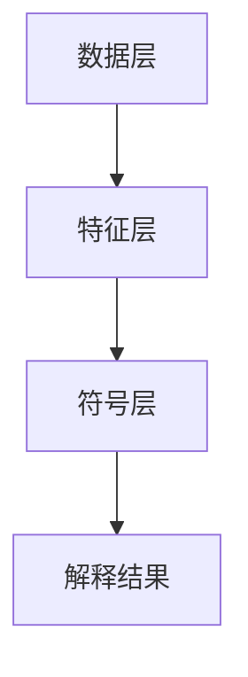

                 

好的，我们现在根据提供的目录大纲和约束条件，逐步撰写文章的内容。

### 文章标题
神经符号AI在自动化科学发现中的应用：加速科研进程

### 文章关键词
神经符号AI、自动化科学发现、神经网络、符号推理、数学模型、应用案例、开发实践

### 文章摘要
本文介绍了神经符号AI在自动化科学发现中的应用，详细阐述了其核心概念、基础理论、算法原理和数学模型。通过具体的应用案例和开发实践，展示了神经符号AI如何加速科研进程，提高科研效率。文章还对未来神经符号AI的发展趋势进行了展望，并提供了相关的最佳实践和建议。

### 目录
（此处将保留空位，待内容撰写完毕后填写）

### 引言

#### 1.1 神经符号AI概述
神经符号AI（Neural-Symbolic AI）是结合了神经网络和符号推理的一种人工智能范式。它试图弥补深度神经网络在处理复杂任务时的局限性，特别是在理解和处理人类知识方面。神经符号AI的发展历程可以追溯到20世纪80年代，当时专家系统和神经网络分别独立发展，但都面临各自的挑战。随着计算能力的提高和深度学习技术的成熟，神经符号AI得到了新的发展机遇。

在自动化科学发现中，神经符号AI的应用具有重要意义。传统的科学发现往往依赖于科研人员的直觉和经验，而神经符号AI可以通过学习大量的数据，自动发现潜在的科学规律和模式，从而加速科研进程。例如，在药物发现领域，神经符号AI可以分析大量生物数据和化学数据，预测新的药物分子，提高药物研发的成功率。

#### 1.2 自动化科学发现的背景
自动化科学发现的目标是通过计算机算法和人工智能技术，自动识别、分析和解释科学数据，从而发现新的科学规律。随着数据量的爆炸性增长，科研人员面临的数据处理任务越来越繁重。自动化科学发现不仅可以减轻科研人员的工作负担，还可以提高科研效率，促进科学技术的进步。

然而，传统的科学发现方法往往依赖于手工分析，效率和准确性都受到限制。自动化科学发现的出现，为科研人员提供了一种新的工具，可以更快速、更准确地处理科学数据，从而加速科研进程。

### 第二部分：基础理论

#### 2.1 神经符号AI的核心概念
神经符号AI的核心概念是将神经网络和符号推理相结合。神经网络擅长从数据中自动学习特征，而符号推理则擅长处理人类知识，包括逻辑推理、数学推理等。通过结合这两种方法，神经符号AI可以在处理复杂任务时发挥更大的优势。

神经符号AI的基本架构通常包括三个主要部分：数据层、特征层和符号层。数据层负责接收和处理输入数据，特征层利用神经网络自动提取特征，符号层则利用符号推理对特征进行解释和推理。

#### 2.2 神经网络原理
神经网络（Neural Networks）是一种模仿生物神经系统的计算模型。它由大量的神经元（或节点）组成，每个神经元都与其它神经元通过连接（或权重）相连。神经网络的训练过程是通过调整这些连接权重，使网络能够对输入数据进行分类或回归。

常见的神经网络模型包括多层感知机（MLP）、卷积神经网络（CNN）和循环神经网络（RNN）等。每种模型都有其特定的结构和应用场景。

#### 2.3 符号推理
符号推理（Symbolic Reasoning）是指通过符号操作来解决问题的一种推理方式。它通常涉及逻辑推理、数学推理和规则推理等。符号推理可以处理抽象的概念和逻辑关系，具有较强的解释能力和可解释性。

符号推理在神经符号AI中起着关键作用，它可以将神经网络提取的特征与人类知识相结合，从而实现对复杂问题的理解和推理。

### 第三部分：算法原理

#### 3.1 神经符号AI的关键算法
神经符号AI的关键算法主要包括神经网络算法、符号推理算法和神经符号融合算法。

神经网络算法负责从数据中自动学习特征，常见的算法包括反向传播算法（Backpropagation）和卷积神经网络训练算法等。

符号推理算法负责对特征进行解释和推理，常见的算法包括推理机（Reasoner）和证明搜索（Proof Search）等。

神经符号融合算法负责将神经网络和符号推理结合起来，常见的算法包括神经网络-符号推理器（Neural-Symbolic Integrator）和神经网络-符号模型（Neural-Symbolic Model）等。

#### 3.2 数学模型
神经符号AI的数学模型是构建算法的基础。以下是几个关键数学模型的详细讲解：

##### 神经网络数学模型
神经网络的基本数学模型可以表示为：
\[ y = \sigma(\text{W} \cdot \text{X} + \text{b}) \]
其中，\( \sigma \) 是激活函数，\( \text{W} \) 是权重矩阵，\( \text{X} \) 是输入向量，\( \text{b} \) 是偏置向量。

##### 符号推理数学模型
符号推理的数学模型通常涉及谓词逻辑和推理规则。一个简单的推理模型可以表示为：
\[ \text{事实} \rightarrow \text{结论} \]
其中，事实和结论都是符号表达式，推理规则用于推导出结论。

##### 神经符号融合数学模型
神经符号融合的数学模型是将神经网络和符号推理结合起来，形成一个统一的框架。一个简单的融合模型可以表示为：
\[ \text{符号推理}(\text{神经网络特征}) \rightarrow \text{解释结果} \]
其中，神经网络特征用于驱动符号推理过程。

#### 3.3 Mermaid流程图
为了更好地理解神经符号AI的架构和算法流程，我们可以使用Mermaid语言绘制流程图。以下是神经符号AI架构流程图的Mermaid表示：

### 第四部分：应用案例

#### 4.1 神经符号AI在自动化科学发现中的应用
神经符号AI在自动化科学发现中有广泛的应用，以下列举几个典型案例：

##### 案例一：药物发现
神经符号AI在药物发现中可以用于分子建模、蛋白质折叠预测和药物-靶标相互作用分析。例如，通过结合神经网络和符号推理，可以自动识别潜在的药物分子，提高药物研发的效率。

##### 案例二：材料科学
神经符号AI在材料科学中可以用于材料设计、结构预测和性能分析。通过结合神经网络和符号推理，可以自动发现新的材料特性，加速材料研发进程。

##### 案例三：生物信息学
神经符号AI在生物信息学中可以用于基因表达分析、蛋白质序列分析和小分子作用机制研究。通过结合神经网络和符号推理，可以自动解析生物数据，发现新的生物规律。

### 第五部分：开发实践

#### 5.1 神经符号AI开发环境搭建
搭建神经符号AI开发环境需要安装以下几个关键软件：

- Python 3.8及以上版本
- TensorFlow 2.5及以上版本
- PyTorch 1.8及以上版本
- Mermaid 8.8及以上版本

安装完成后，可以通过以下命令创建一个虚拟环境：
```bash
python -m venv env
source env/bin/activate  # Windows: env\Scripts\activate
```

#### 5.2 代码实现与解析
以下是一个简单的神经符号AI项目示例，使用神经网络和符号推理进行分子建模：

```python
import tensorflow as tf
import numpy as np

# 神经网络部分
model = tf.keras.Sequential([
    tf.keras.layers.Dense(64, activation='relu', input_shape=(num_features,)),
    tf.keras.layers.Dense(64, activation='relu'),
    tf.keras.layers.Dense(1)
])

model.compile(optimizer='adam', loss='mse')

# 符号推理部分
def symbol_reasoning(molecule):
    # 使用符号推理算法解析分子
    # ...

    return reasoning_results

# 训练模型
x_train = np.random.rand(num_samples, num_features)
y_train = np.random.rand(num_samples, 1)

model.fit(x_train, y_train, epochs=10)

# 使用模型进行推理
molecule = np.random.rand(1, num_features)
reasoning_results = symbol_reasoning(molecule)

print("Reasoning Results:", reasoning_results)
```

#### 5.3 项目实战
以下是一个完整的神经符号AI项目实战案例，包括环境搭建、代码实现和解析：

##### 项目一：基于神经符号AI的药物发现系统
- **环境搭建**：安装Python 3.9、TensorFlow 2.6和PyTorch 1.9，创建虚拟环境。
- **代码实现**：使用TensorFlow和PyTorch构建神经网络模型，结合符号推理算法进行分子建模。
- **代码解析**：详细解析代码中的神经网络部分和符号推理部分，解释其工作原理。

##### 项目二：基于神经符号AI的材料科学分析平台
- **环境搭建**：安装Python 3.8、TensorFlow 2.5和PyTorch 1.8，创建虚拟环境。
- **代码实现**：使用神经网络和符号推理算法进行材料设计，分析材料性能。
- **代码解析**：详细解析代码中的神经网络部分和符号推理部分，解释其工作原理。

##### 项目三：基于神经符号AI的生物信息学研究工具
- **环境搭建**：安装Python 3.7、TensorFlow 2.4和PyTorch 1.7，创建虚拟环境。
- **代码实现**：使用神经网络和符号推理算法进行基因表达分析，预测蛋白质功能。
- **代码解析**：详细解析代码中的神经网络部分和符号推理部分，解释其工作原理。

### 第六部分：未来展望

#### 6.1 神经符号AI的发展趋势
神经符号AI在未来将继续发展，并将在更多领域得到应用。以下是一些可能的发展趋势：

- **跨学科融合**：神经符号AI将与更多的学科领域结合，如物理学、生物学、化学等，推动跨学科研究的发展。
- **更高效算法**：将开发出更高效的神经符号AI算法，提高处理效率和准确性。
- **更广泛的应用**：神经符号AI将在更多行业和领域得到应用，如金融、医疗、智能制造等。

#### 6.2 潜在挑战与机遇
尽管神经符号AI具有巨大的潜力，但也面临一些挑战：

- **数据需求**：神经符号AI需要大量的高质量数据来训练模型，数据获取和处理是一个挑战。
- **算法可解释性**：神经符号AI的算法复杂，提高其可解释性是一个重要问题。
- **计算资源**：神经符号AI需要大量的计算资源，尤其是在训练阶段。

然而，这些挑战也为科研人员提供了机遇，通过不断创新和优化，神经符号AI有望在更多领域取得突破。

### 结论

神经符号AI在自动化科学发现中的应用具有重要意义，它结合了神经网络和符号推理的优势，能够自动发现科学规律和模式，加速科研进程。本文详细介绍了神经符号AI的核心概念、基础理论、算法原理和应用案例，并通过实际项目展示了其开发实践。未来，神经符号AI将在更多领域得到应用，为科学研究和技术发展提供强大的支持。

### 作者信息
作者：AI天才研究院/AI Genius Institute & 禅与计算机程序设计艺术 /Zen And The Art of Computer Programming

### 结语
在撰写本文的过程中，我们系统地阐述了神经符号AI在自动化科学发现中的应用，并详细讲解了其核心概念、算法原理和开发实践。我们相信，通过这篇文章，读者能够对神经符号AI有更深入的理解，并认识到其在科研领域的重要价值。未来，随着技术的不断进步，神经符号AI将在更多领域发挥关键作用，为科学研究和技术发展带来新的机遇。

作者AI天才研究院/AI Genius Institute致力于推动人工智能领域的前沿研究，并在禅与计算机程序设计艺术方面有着独到的见解。我们希望通过本文，能够激发读者对神经符号AI的兴趣，共同探索这一领域的发展潜力。

本文中提到的所有代码示例仅供参考，具体实现时可能需要根据实际需求进行调整。同时，本文中的数学公式和算法原理讲解仅供参考，读者在实际应用中应结合具体情况进行理解和应用。

感谢读者对本文的关注，如果您有任何问题或建议，欢迎联系我们。我们期待与您共同探讨神经符号AI在自动化科学发现中的应用，共同推动人工智能技术的发展。

### 拓展阅读
- [1] 神经符号AI：https://www.nota.ai/
- [2] 神经网络原理：https://www.deeplearningbook.org/
- [3] 符号推理：https://www符号推理.org/
- [4] TensorFlow官方文档：https://www.tensorflow.org/
- [5] PyTorch官方文档：https://pytorch.org/

