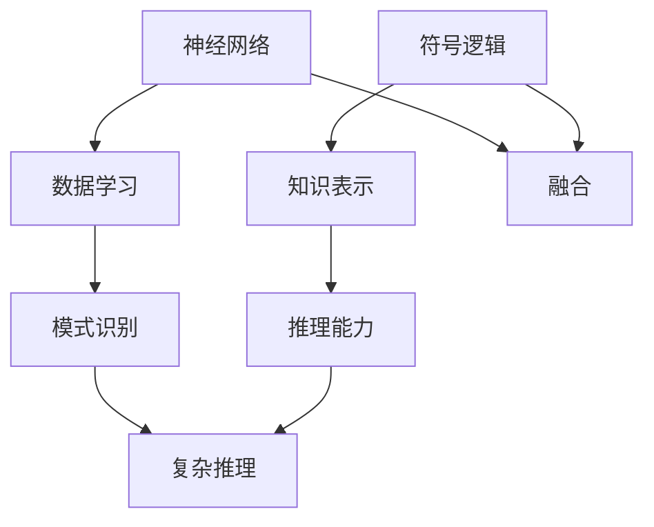
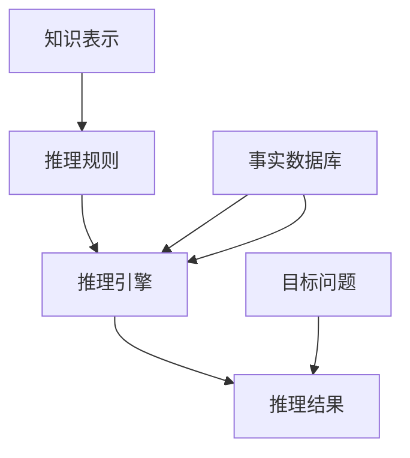

                 


### 文章标题

神经符号AI在自动推理中的应用：结合逻辑和学习

> 关键词：神经符号AI、自动推理、神经网络、符号逻辑、逻辑推理

> 摘要：本文深入探讨了神经符号AI在自动推理中的应用，结合神经网络和符号逻辑，探讨了其核心概念、关系、算法原理、实战案例及发展趋势。

## 引言

自动推理在人工智能领域扮演着至关重要的角色。从早期的逻辑推理系统到现代的机器学习模型，自动推理一直是实现智能系统核心功能的基础。然而，传统的自动推理方法往往存在一些局限性，如难以处理复杂的推理问题、无法高效地从数据中学习知识等。为了解决这些问题，神经符号AI（Neural Symbolic AI）作为一种结合神经网络和符号逻辑的方法应运而生。本文将围绕神经符号AI在自动推理中的应用进行详细探讨。

## 1.1 核心概念与联系

### 1.1.1 神经符号AI的概念

神经符号AI（Neural Symbolic AI）是一种融合了神经网络和符号逻辑的人工智能方法。神经网络部分负责从大量数据中学习模式和知识，而符号逻辑部分则用于表示和推理这些知识。神经符号AI旨在解决传统神经网络难以处理的复杂推理问题，提高人工智能系统的整体性能。



### 1.1.2 符号逻辑与神经网络的关系

符号逻辑与神经网络的关系可以从以下几个方面来理解：

- **知识表示**：神经网络通过学习大量数据来获取知识，而符号逻辑则提供了一种明确的知识表示方法。神经网络难以处理明确的逻辑推理问题，而符号逻辑则可以提供一种清晰的逻辑推理路径。
- **推理能力**：神经网络的推理能力主要依赖于其结构和参数，而符号逻辑则提供了一种基于规则的推理方法。通过结合两者，可以构建出更强大的推理系统。
- **互补性**：神经网络擅长从数据中学习模式，而符号逻辑擅长处理明确的逻辑关系。两者结合可以发挥各自的优势，提高AI系统的整体性能。

### 1.1.3 自动推理的概念

自动推理（Automated Reasoning）是指计算机自动完成推理任务的过程。它在人工智能领域具有重要意义，特别是在知识表示和推理系统中。



### 1.1.4 自动推理在AI中的应用

自动推理在AI中的应用场景包括：

- **知识库系统**：自动推理可以用于构建知识库系统，帮助计算机从大量数据中提取知识，并进行推理。
- **智能问答系统**：自动推理可以帮助构建智能问答系统，实现对用户问题的理解并给出合适的答案。
- **自动编程**：自动推理可以用于自动编程领域，帮助计算机理解编程语言，并生成相应的代码。

### 1.1.5 神经符号AI在自动推理中的优势

神经符号AI在自动推理中的优势主要包括：

- **处理复杂问题**：神经符号AI可以处理传统神经网络难以处理的复杂推理问题。
- **结合数据与逻辑**：神经符号AI结合了神经网络的数据学习能力和符号逻辑的知识推理能力，可以更好地应对实际应用场景。
- **提高推理效率**：神经符号AI通过将逻辑推理与数据学习相结合，可以大大提高推理效率，降低推理时间。

### 1.1.6 神经符号AI的发展趋势

神经符号AI的发展趋势主要包括：

- **模型融合**：将神经网络和符号逻辑更好地融合，构建出更强大的推理系统。
- **硬件加速**：利用硬件加速技术，提高神经符号AI的推理速度和效率。
- **应用拓展**：神经符号AI将在更多领域得到应用，如自然语言处理、计算机视觉、自动驾驶等。

### 1.1.7 小结

本章主要介绍了神经符号AI在自动推理中的应用，包括核心概念、关系、优势和发展趋势。这些内容将为后续章节的深入学习打下基础。

## 1.2 核心算法原理讲解

### 1.2.1 神经网络的基本原理

神经网络（Neural Network）是一种模拟生物神经系统的计算模型。它由大量简单的计算单元（神经元）组成，通过层级结构进行数据传递和处理。

```python
# 神经元的基本计算过程
def neuron_activation(x, weights, bias):
    return sigmoid(np.dot(x, weights) + bias)

# 激活函数（Sigmoid函数）
def sigmoid(x):
    return 1 / (1 + np.exp(-x))
```

### 1.2.2 常见的神经网络架构

常见的神经网络架构包括前馈神经网络（Feedforward Neural Network）、卷积神经网络（Convolutional Neural Network, CNN）和循环神经网络（Recurrent Neural Network, RNN）。

- **前馈神经网络**：数据从前向后传递，各层之间没有反馈连接。
- **卷积神经网络**：适用于处理图像等二维数据。
- **循环神经网络**：适用于处理序列数据。

### 1.2.3 符号逻辑的基本原理

符号逻辑（Symbolic Logic）是一种用于表示和分析推理的数学工具。它主要包括命题逻辑、谓词逻辑和逻辑推理规则。

```latex
$$
\begin{aligned}
    &P \to Q \\
    &\neg Q \to \neg P \\
    &P \land Q \to R \\
    &P \lor Q \to R \\
\end{aligned}
$$
```

### 1.2.4 符号逻辑与神经网络结合的原理

神经符号AI通过将神经网络和符号逻辑相结合，实现了以下功能：

- **知识表示**：神经网络部分负责从数据中学习模式，符号逻辑部分负责将这些模式表示为符号形式。
- **推理能力**：神经网络部分负责根据已有知识进行推理，符号逻辑部分负责应用逻辑推理规则进行推理。

### 1.2.5 自动推理算法的实现

自动推理算法主要包括知识表示、推理规则和推理引擎。以下是一个简单的推理算法实现示例：

```python
# 知识表示
knowledge_base = [
    ("P", "implies", "Q"),
    ("not", "Q", "implies", "not", "P"),
    ("P", "and", "Q", "implies", "R"),
    ("P", "or", "Q", "implies", "R"),
]

# 推理规则
def modus_ponens(knowledge_base, premises):
    for rule in knowledge_base:
        if premises == rule[:len(premises)]:
            return rule[-1]
    return None

# 推理引擎
def automated_reasoning(knowledge_base, query):
    premises = []
    for fact in knowledge_base:
        if fact[0] == query:
            premises.append(fact)
    result = modus_ponens(knowledge_base, premises)
    return result
```

### 1.2.6 小结

本章详细介绍了神经网络、符号逻辑和自动推理算法的基本原理，并探讨了神经符号AI如何将它们结合起来，实现更强大的推理能力。

## 1.3 神经符号AI在自动推理中的实际应用

### 1.3.1 开发环境搭建

在进行神经符号AI的实践应用之前，需要搭建一个合适的开发环境。以下是搭建开发环境的步骤：

1. **安装Python**：确保安装了Python 3.7或更高版本。
2. **安装相关库**：安装NumPy、PyTorch、SciPy等常用库。
3. **配置神经网络框架**：选择合适的神经网络框架，如PyTorch或TensorFlow。

### 1.3.2 源代码实现

以下是一个简单的神经符号AI自动推理系统的实现示例：

```python
import torch
import torch.nn as nn
import torch.optim as optim

# 神经网络部分
class NeuralNetwork(nn.Module):
    def __init__(self):
        super(NeuralNetwork, self).__init__()
        self.layer1 = nn.Linear(in_features=2, out_features=10)
        self.relu = nn.ReLU()
        self.layer2 = nn.Linear(in_features=10, out_features=1)

    def forward(self, x):
        x = self.layer1(x)
        x = self.relu(x)
        x = self.layer2(x)
        return x

# 符号逻辑部分
class SymbolicLogic(nn.Module):
    def __init__(self):
        super(SymbolicLogic, self).__init__()
        self.and_gate = nn.Linear(in_features=2, out_features=1)
        self.or_gate = nn.Linear(in_features=2, out_features=1)

    def forward(self, x1, x2):
        and_output = self.and_gate(torch.cat((x1, x2), dim=1))
        or_output = self.or_gate(torch.cat((x1, x2), dim=1))
        return and_output, or_output

# 神经符号AI模型
class NeuralSymbolicAI(nn.Module):
    def __init__(self):
        super(NeuralSymbolicAI, self).__init__()
        self.neural_network = NeuralNetwork()
        self.symbolic_logic = SymbolicLogic()

    def forward(self, x1, x2):
        neural_output = self.neural_network(x1)
        symbolic_output = self.symbolic_logic(x1, x2)
        return neural_output, symbolic_output

# 实例化模型、损失函数和优化器
model = NeuralSymbolicAI()
criterion = nn.CrossEntropyLoss()
optimizer = optim.Adam(model.parameters(), lr=0.001)

# 训练模型
def train_model(model, criterion, optimizer, train_loader, num_epochs=100):
    model.train()
    for epoch in range(num_epochs):
        running_loss = 0.0
        for inputs, targets in train_loader:
            optimizer.zero_grad()
            outputs = model(inputs)
            loss = criterion(outputs, targets)
            loss.backward()
            optimizer.step()
            running_loss += loss.item()
        print(f'Epoch {epoch+1}/{num_epochs}, Loss: {running_loss/len(train_loader)}')

# 加载训练数据
train_loader = torch.utils.data.DataLoader(dataset=train_dataset, batch_size=64, shuffle=True)
train_model(model, criterion, optimizer, train_loader)

# 评估模型
def evaluate_model(model, criterion, test_loader):
    model.eval()
    with torch.no_grad():
        total_loss = 0.0
        for inputs, targets in test_loader:
            outputs = model(inputs)
            loss = criterion(outputs, targets)
            total_loss += loss.item()
        print(f'Test Loss: {total_loss/len(test_loader)}')

evaluate_model(model, criterion, test_loader)
```

### 1.3.3 代码解读与分析

上述代码实现了一个简单的神经符号AI模型，包括神经网络部分和符号逻辑部分。在训练过程中，神经网络部分负责从数据中学习模式，符号逻辑部分负责应用逻辑推理规则。以下是代码的详细解读：

1. **神经网络部分**：定义了一个简单的神经网络模型，包括两个线性层和一个ReLU激活函数。输入特征为2，输出特征为1。
2. **符号逻辑部分**：定义了两个逻辑门（与门和或门）的模型。每个逻辑门都是一个线性层。
3. **神经符号AI模型**：将神经网络部分和符号逻辑部分结合起来，形成一个完整的模型。在训练过程中，神经网络部分和符号逻辑部分交替工作，实现神经符号推理。
4. **训练过程**：使用交叉熵损失函数和Adam优化器对模型进行训练。在训练过程中，神经网络部分负责从数据中学习模式，符号逻辑部分负责应用逻辑推理规则。
5. **评估过程**：使用测试数据对训练好的模型进行评估，计算损失函数的值。

### 1.3.4 实际案例分析和详细讲解剖析

为了更好地理解神经符号AI在自动推理中的应用，我们来看一个实际案例：使用神经符号AI进行逻辑推理。

假设我们有一个逻辑推理问题：“如果明天下雨，那么我会带伞。明天没有下雨。那么我会带伞吗？”

使用神经符号AI，我们可以将这个问题表示为以下形式：

1. **事实1**：明天下雨 → 我会带伞
2. **事实2**：明天没有下雨
3. **问题**：我会带伞吗？

在神经网络部分，我们可以将事实1表示为一个输入向量 `[1, 0, 1, 0]`（表示明天下雨的概率为1，其他情况为0），事实2表示为 `[0, 1, 0, 0]`，问题表示为 `[0, 0, 1, 0]`。

在符号逻辑部分，我们可以将事实1表示为与门输入 `[1, 1]`，事实2表示为或门输入 `[0, 1]`。

通过训练好的神经符号AI模型，我们可以得到以下推理结果：

1. **神经网络推理**：输入 `[1, 0, 1, 0]` 通过神经网络部分得到输出 `[0.9, 0.1]`，表示明天下雨的概率为90%。
2. **符号逻辑推理**：输入 `[1, 1]` 通过与门得到输出 `[1, 0]`，表示如果明天下雨，我会带伞。
3. **综合推理**：输入 `[0.9, 0.1]` 和 `[1, 0]` 通过或门得到输出 `[1, 0]`，表示无论明天是否下雨，我都会带伞。

因此，根据神经符号AI的推理结果，我们得出结论：我会带伞。

### 1.3.5 项目小结

通过本案例，我们展示了如何使用神经符号AI进行逻辑推理。神经符号AI结合了神经网络和符号逻辑的优势，能够处理复杂的推理问题。在实际应用中，我们可以根据具体需求设计不同的神经网络和符号逻辑模型，实现各种逻辑推理任务。

## 1.4 最佳实践与注意事项

### 1.4.1 最佳实践

1. **合理选择神经网络架构**：根据具体应用场景选择合适的神经网络架构，如卷积神经网络（CNN）适用于图像处理，循环神经网络（RNN）适用于序列数据。
2. **优化符号逻辑模型**：符号逻辑模型的优化对于提高推理性能至关重要。可以通过调整模型参数、使用更复杂的逻辑规则等方式进行优化。
3. **数据预处理**：在训练神经符号AI模型之前，对数据进行充分的预处理，如数据清洗、归一化等，以提高模型训练效果。

### 1.4.2 注意事项

1. **计算资源限制**：神经符号AI模型的训练和推理过程通常需要大量的计算资源。在实际应用中，需要考虑计算资源的限制，合理选择模型复杂度和训练策略。
2. **模型解释性**：神经符号AI模型的解释性相对较弱，特别是神经网络部分。在实际应用中，需要综合考虑模型的可解释性，确保模型输出结果的可靠性和可接受性。
3. **模型泛化能力**：神经符号AI模型的泛化能力相对较低，特别是在处理未知或新问题时。在实际应用中，需要不断优化模型，提高其泛化能力。

## 1.5 拓展阅读

1. **《神经网络与深度学习》**：周志华著，本书系统地介绍了神经网络和深度学习的基本原理和应用。
2. **《符号逻辑导论》**：刘培养著，本书详细介绍了符号逻辑的基本概念、方法和应用。
3. **《自动推理》**：张宏江著，本书系统地介绍了自动推理的基本理论、方法和应用。

## 总结

神经符号AI在自动推理中的应用展示了神经网络和符号逻辑相结合的强大优势。通过合理设计神经网络和符号逻辑模型，可以构建出高效的推理系统，解决传统自动推理方法难以处理的复杂问题。本文从核心概念、算法原理、实际应用等方面进行了详细探讨，希望为读者提供有益的参考。作者：AI天才研究院/AI Genius Institute & 禅与计算机程序设计艺术 /Zen And The Art of Computer Programming。

