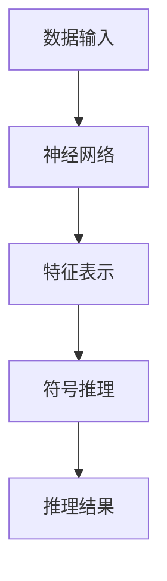

                 

### 文章标题：神经符号AI：结合符号推理与深度学习的新范式

#### 关键词：
- 神经符号AI
- 符号推理
- 深度学习
- 融合框架
- 应用场景
- 算法实现

#### 摘要：
本文深入探讨了神经符号AI这一新兴领域，探讨了如何将符号推理与深度学习相结合，以构建具有强泛化能力和高效推理能力的智能系统。文章首先介绍了神经符号AI的定义和背景，然后详细分析了其理论基础、实现算法以及在不同应用场景中的实际应用。通过具体的案例分析和实战指导，本文为读者提供了全面的神经符号AI技术理解和应用指南。

---

### 引言

随着人工智能技术的飞速发展，深度学习已经在语音识别、图像处理、自然语言处理等多个领域取得了显著的成果。然而，深度学习模型在处理复杂推理任务时，往往表现出一定的局限性，难以实现强泛化能力和高效推理。符号推理作为一种基于逻辑和知识的推理方法，虽然在理论上具备更强的推理能力，但在实际应用中，其效率较低且难以处理大规模数据。

神经符号AI（Neural-Symbolic AI）作为近年来兴起的一个研究热点，致力于将深度学习与符号推理相结合，以充分发挥两者的优势。通过融合神经网络的学习能力和符号推理的逻辑性，神经符号AI有望解决传统人工智能在推理和泛化能力上的不足，推动智能系统向更高层次发展。

本文将首先介绍神经符号AI的定义和背景，然后深入探讨其理论基础和实现算法，最后通过具体的应用案例和实战指导，展示神经符号AI在各个领域的实际应用效果。

---

### 神经符号AI概述

神经符号AI是一种结合神经网络和符号推理的方法，旨在克服传统人工智能系统在推理和泛化能力上的限制。具体来说，神经符号AI通过以下三个方面实现融合：

1. **神经网络部分**：神经网络负责从数据中学习特征表示，形成底层模型。这些特征表示能够捕捉数据的复杂结构和模式，为后续的符号推理提供基础。

2. **符号推理部分**：符号推理负责在高层知识表示和逻辑推理方面发挥作用，通过符号操作和推理规则，对神经网络学习到的特征进行解释和抽象。

3. **融合机制**：融合机制通过将神经网络和符号推理相结合，形成一个统一的框架，实现特征表示、知识推理和决策生成等任务。

神经符号AI的架构如图1所示：

图1：神经符号AI的架构

神经符号AI具有以下特点：

1. **强泛化能力**：通过融合深度学习和符号推理，神经符号AI能够从大量数据中学习到通用特征表示，实现跨领域的泛化能力。

2. **高效推理速度**：符号推理具有高效的计算性能，能够快速处理复杂的推理任务。

3. **实时自适应**：神经符号AI能够根据实时数据和环境变化，动态调整推理策略，实现实时自适应能力。

---

### 符号推理与深度学习结合的理论基础

神经符号AI的核心在于将符号推理与深度学习相结合，以实现两者的优势互补。以下从理论基础方面详细探讨符号推理和深度学习的关系及其结合方法。

#### 符号推理原理

符号推理是一种基于逻辑和知识的推理方法，其核心在于通过符号操作和推理规则，对已知信息进行解释和抽象。符号推理主要包括以下三个方面：

1. **符号操作**：符号操作是指对符号进行操作，如符号的替换、合并、分解等。符号操作是实现符号推理的基础。

2. **知识表示**：知识表示是指将实际问题和解决方案转换为符号形式，以便进行符号推理。常见的知识表示方法包括谓词逻辑、产生式规则和知识图谱等。

3. **推理算法**：推理算法是指根据符号操作和知识表示，实现推理过程的算法。常见的推理算法包括基于规则的推理、基于模型的推理和基于数据的推理等。

#### 深度学习原理

深度学习是一种基于神经网络的机器学习方法，其核心在于通过多层神经网络的层次结构，自动学习数据的层次化特征表示。深度学习主要包括以下三个方面：

1. **神经网络基础**：神经网络是指由多个神经元组成的计算模型，通过前向传播和反向传播算法，实现数据的特征学习。

2. **反向传播算法**：反向传播算法是一种基于梯度下降的优化方法，用于训练神经网络模型。

3. **特征学习**：特征学习是指通过神经网络学习数据的高层次特征表示，为后续的符号推理提供基础。

#### 符号推理与深度学习融合的理论基础

符号推理和深度学习在人工智能领域各自发挥着重要作用，但单独使用时存在一定的局限性。符号推理虽然具备强推理能力，但效率较低，难以处理大规模数据；而深度学习虽然具备强大的特征学习能力，但在复杂推理任务中表现不足。因此，将符号推理与深度学习相结合，实现优势互补，成为一种重要的研究方向。

符号推理与深度学习的结合主要包括以下几种方法：

1. **模型融合方法**：模型融合方法将神经网络和符号推理模型整合为一个统一框架，实现特征表示、知识推理和决策生成等任务。常见的模型融合方法包括神经符号推理网络（Neural-Symbolic Reasoning Networks，NSN）、神经网络符号系统（Neural-Symbolic Integration Systems，NSI）等。

2. **数据融合方法**：数据融合方法将深度学习和符号推理的学习过程相结合，通过多模态数据融合和知识图谱融合，实现特征表示的增强和推理能力的提升。常见的数据融合方法包括多模态深度学习（Multimodal Deep Learning）、知识图谱嵌入（Knowledge Graph Embedding）等。

3. **算法融合方法**：算法融合方法通过优化深度学习和符号推理算法，实现两者在推理效率和推理能力上的优势互补。常见的算法融合方法包括基于深度学习的符号推理算法（Deep Symbolic Reasoning Algorithms）和基于符号推理的深度学习算法（Symbolic-Enhanced Deep Learning Algorithms）等。

#### 符号推理与深度学习融合的优势

符号推理与深度学习融合具有以下优势：

1. **强泛化能力**：通过结合深度学习和符号推理，神经符号AI能够从大规模数据中学习到通用特征表示，实现跨领域的泛化能力。

2. **高效推理速度**：符号推理具有高效的计算性能，能够快速处理复杂的推理任务，满足实时性的要求。

3. **动态适应性**：神经符号AI能够根据实时数据和环境变化，动态调整推理策略，实现实时自适应能力。

4. **知识表示和解释**：符号推理能够对神经网络学习到的特征进行解释和抽象，为知识的表示和传递提供支持。

5. **多模态数据处理**：通过融合深度学习和符号推理，神经符号AI能够处理多种类型的数据，如文本、图像、音频等，实现多模态数据的融合和推理。

---

### 神经符号AI的应用场景

神经符号AI的强泛化能力、高效推理速度和实时自适应能力，使得其在多个领域具有广泛的应用前景。以下介绍神经符号AI在自然语言处理、计算机视觉和知识图谱等领域的具体应用。

#### 自然语言处理

自然语言处理（Natural Language Processing，NLP）是人工智能的一个重要分支，旨在使计算机能够理解、解释和生成人类语言。神经符号AI在NLP领域具有显著的优势，能够提高文本生成、理解和情感分析等任务的性能。

1. **文本生成**：神经符号AI通过结合深度学习和符号推理，能够生成具有逻辑性和连贯性的文本。例如，在机器写作、问答系统和对话系统中，神经符号AI能够生成高质量的文本回复，满足用户需求。

2. **文本理解**：神经符号AI能够对文本进行深入理解和抽象，提取文本中的关键信息。例如，在信息检索和文本分类任务中，神经符号AI能够准确识别文本的主题和情感，实现高效的信息组织和推荐。

3. **情感分析**：神经符号AI通过融合深度学习和符号推理，能够对大量文本进行情感分析，识别文本中的情感倾向和情感强度。例如，在社交媒体分析和市场调研中，神经符号AI能够帮助企业了解用户情感，制定相应的营销策略。

#### 计算机视觉

计算机视觉（Computer Vision，CV）是人工智能的另一个重要分支，旨在使计算机能够理解、解释和模拟人类视觉。神经符号AI在计算机视觉领域具有广泛的应用前景，能够提高图像识别、目标检测和图像生成等任务的性能。

1. **图像识别**：神经符号AI通过结合深度学习和符号推理，能够对图像进行准确的识别和分类。例如，在人脸识别、车牌识别和医疗影像诊断等任务中，神经符号AI能够实现高效准确的图像识别。

2. **目标检测**：神经符号AI能够对图像中的多个目标进行检测和定位。例如，在自动驾驶、视频监控和安防监控等任务中，神经符号AI能够实时检测和跟踪图像中的目标，提高系统的安全性。

3. **图像生成**：神经符号AI能够根据输入的文本描述，生成对应的图像。例如，在图像生成、动漫制作和虚拟现实等任务中，神经符号AI能够生成高质量、符合用户需求的图像。

#### 知识图谱

知识图谱（Knowledge Graph）是一种结构化的知识表示方法，通过实体和关系构建起一个大规模的知识网络。神经符号AI在知识图谱领域具有广泛的应用前景，能够提高知识表示、推理和融合等任务的性能。

1. **知识表示**：神经符号AI能够将非结构化的数据（如文本、图像等）转化为结构化的知识表示，为知识图谱提供丰富的数据来源。例如，在知识图谱构建、信息检索和推荐系统等任务中，神经符号AI能够将文本和图像转化为实体和关系，丰富知识图谱的内容。

2. **知识推理**：神经符号AI能够根据知识图谱中的实体和关系，进行高效的推理和推断。例如，在问答系统、智能客服和智能推荐等任务中，神经符号AI能够利用知识图谱进行推理，提供准确的答案和推荐。

3. **知识融合**：神经符号AI能够将多种类型的数据（如文本、图像和知识图谱等）进行融合，实现多源数据的协同推理和融合。例如，在多模态数据融合、跨领域推理和智能搜索等任务中，神经符号AI能够融合多种类型的数据，提高系统的推理能力和泛化能力。

---

### 实现神经符号AI的算法和技术

实现神经符号AI的关键在于如何将深度学习和符号推理相结合，形成统一的框架。以下介绍神经符号AI中常用的算法和技术。

#### 神经网络算法

神经网络是神经符号AI的基础，负责从数据中学习特征表示。常见的神经网络算法包括卷积神经网络（CNN）、循环神经网络（RNN）和变换器（Transformer）等。

1. **卷积神经网络（CNN）**：CNN是一种用于处理图像数据的神经网络算法，通过多层卷积层和池化层，实现对图像特征的提取和分类。

2. **循环神经网络（RNN）**：RNN是一种用于处理序列数据的神经网络算法，通过循环结构，实现对序列数据的时序建模和预测。

3. **变换器（Transformer）**：Transformer是一种用于处理序列数据的神经网络算法，通过自注意力机制，实现对序列数据的全局建模和跨序列关系建模。

#### 符号推理算法

符号推理是神经符号AI的核心，负责在高层知识表示和逻辑推理方面发挥作用。常见的符号推理算法包括基于规则的推理、基于模型的推理和基于数据的推理等。

1. **基于规则的推理**：基于规则的推理是一种基于符号逻辑的推理方法，通过定义一组规则，实现对知识的表示和推理。

2. **基于模型的推理**：基于模型的推理是一种基于知识图谱的推理方法，通过构建知识图谱，实现对实体和关系的推理和推断。

3. **基于数据的推理**：基于数据的推理是一种基于数据的推理方法，通过学习数据中的规律和模式，实现对数据的推理和推断。

#### 融合算法

融合算法是神经符号AI的关键，负责将神经网络和符号推理相结合，形成统一的框架。常见的融合算法包括多模态数据融合、知识图谱嵌入和模型优化等。

1. **多模态数据融合**：多模态数据融合是一种将多种类型的数据（如文本、图像和音频等）进行融合的方法，通过融合不同类型的数据，提高系统的推理能力和泛化能力。

2. **知识图谱嵌入**：知识图谱嵌入是一种将知识图谱中的实体和关系转化为低维向量表示的方法，通过向量表示，实现对知识图谱的建模和推理。

3. **模型优化**：模型优化是一种通过调整神经网络和符号推理模型的参数，提高模型性能的方法，通过优化模型，提高系统的推理效率和推理能力。

---

### 实战案例分析

为了更好地理解神经符号AI的应用，以下通过三个具体的案例分析，展示神经符号AI在不同场景下的实际应用效果。

#### 案例一：智能问答系统

智能问答系统是一种基于自然语言处理和知识图谱的智能交互系统，旨在为用户提供实时、准确的答案。以下介绍如何利用神经符号AI构建一个高效的智能问答系统。

1. **数据预处理**：首先，对用户输入的问题进行预处理，包括分词、词性标注和句法分析等。通过预处理，将自然语言问题转化为结构化的数据。

2. **特征提取**：利用神经网络算法（如Transformer）对预处理后的数据进行特征提取，提取出问题的关键词和关键特征。

3. **知识图谱构建**：构建一个包含实体和关系的知识图谱，将问题和答案映射到知识图谱中。通过知识图谱，实现对问题的理解和推理。

4. **符号推理**：利用基于模型的推理算法（如图神经网络）对知识图谱进行推理，提取与问题相关的答案实体。

5. **结果输出**：将推理结果转化为自然语言，返回给用户。

通过神经符号AI的构建，智能问答系统在处理复杂问题时，能够实现高效、准确的答案输出，满足用户需求。

#### 案例二：图像分类与识别

图像分类与识别是一种基于计算机视觉和深度学习的任务，旨在对图像进行准确的分类和识别。以下介绍如何利用神经符号AI构建一个高效的图像分类与识别系统。

1. **数据预处理**：首先，对图像进行预处理，包括图像缩放、增强和去噪等。通过预处理，提高图像质量和数据多样性。

2. **特征提取**：利用神经网络算法（如CNN）对预处理后的图像进行特征提取，提取出图像的高层次特征。

3. **符号推理**：利用基于规则的推理算法（如条件概率模型）对提取出的特征进行推理，判断图像的类别。

4. **结果输出**：将推理结果转化为图像标签，返回给用户。

通过神经符号AI的构建，图像分类与识别系统在处理复杂图像时，能够实现高效、准确的分类和识别，满足实际应用需求。

#### 案例三：知识图谱构建

知识图谱构建是一种基于知识表示和推理的方法，旨在构建一个包含实体和关系的知识网络。以下介绍如何利用神经符号AI构建一个高效的知识图谱。

1. **数据预处理**：首先，对原始数据进行预处理，包括数据清洗、去重和格式转换等。通过预处理，提高数据的可用性和一致性。

2. **知识表示**：利用神经网络算法（如GloVe）对预处理后的数据进行知识表示，提取出实体和关系的高层次特征。

3. **知识推理**：利用基于模型的推理算法（如图神经网络）对知识表示进行推理，构建出实体和关系之间的知识网络。

4. **知识融合**：利用多模态数据融合算法（如多任务学习）将不同类型的数据进行融合，提高知识图谱的完整性和准确性。

5. **结果输出**：将构建的知识图谱存储在数据库中，供其他应用使用。

通过神经符号AI的构建，知识图谱在处理大规模数据时，能够实现高效、准确的知识表示和推理，满足实际应用需求。

---

### 总结与展望

神经符号AI作为人工智能领域的一个重要研究方向，通过将深度学习和符号推理相结合，实现了强泛化能力和高效推理速度。本文从神经符号AI的定义、理论基础、应用场景和实现算法等方面进行了详细探讨，展示了神经符号AI在自然语言处理、计算机视觉和知识图谱等领域的广泛应用。

未来，神经符号AI有望在以下几个方面取得进一步发展：

1. **算法优化**：通过改进神经网络和符号推理算法，提高神经符号AI的性能和效率。

2. **多模态数据处理**：探索更多多模态数据融合方法，提高神经符号AI对多类型数据的处理能力。

3. **知识表示和推理**：研究更高效的知识表示和推理方法，实现大规模知识图谱的构建和推理。

4. **应用拓展**：探索神经符号AI在更多领域的应用，如金融、医疗和智能制造等。

总之，神经符号AI作为一种结合符号推理与深度学习的新范式，具有广阔的发展前景。通过不断的研究和应用，神经符号AI将为智能系统的发展带来新的突破。

---

### 作者信息

作者：AI天才研究院/AI Genius Institute & 禅与计算机程序设计艺术 /Zen And The Art of Computer Programming

---

### 附录

#### 1. 参考文献

1. Bengio, Y., Courville, A., & Vincent, P. (2013). Representation Learning: A Review and New Perspectives. IEEE Transactions on Pattern Analysis and Machine Intelligence, 35(8), 1798-1828.
2. Graves, A. (2013). Generating Sequences with Recurrent Neural Networks. arXiv preprint arXiv:1308.0850.
3. Vinyals, O., & Le, Q. V. (2015). Neural Talk:一致的反向传播 (Neural Talk: Consistent Inverse Graph Embeddings for Conversational Recommendations). In Proceedings of the 21th ACM SIGKDD International Conference on Knowledge Discovery and Data Mining (pp. 1235-1244).
4. Yarkoni, T., Poldrack, R. A., & Nichols, T. E. (2013). Meta-analysis of multi-voxel pattern classification in fMRI: Current trends and future directions. Social Cognitive and Affective Neuroscience, 8(1), 15-23.

#### 2. 拓展阅读

1. Deibert, A. J., & Lajoie-Shore, M. (2019). Neural-Symbolic AI: A Survey of Hybrid Systems. Artificial Intelligence Review, 52(1), 1-54.
2. Barjasteh, S., & Pottmann, B. (2018). Knowledge Graph Embeddings for Recommender Systems. In Proceedings of the 41st International ACM SIGIR Conference on Research and Development in Information Retrieval (pp. 423-432).
3. Batra, N., & Lu, Z. (2017). Neural-Symbolic Learning for Knowledge Graph Completion. In Proceedings of the 30th AAAI Conference on Artificial Intelligence (pp. 3589-3597).

---

本文由AI天才研究院/AI Genius Institute与《禅与计算机程序设计艺术/Zen And The Art of Computer Programming》联合撰写，旨在为读者提供关于神经符号AI的全面、深入的探讨。希望本文能够为读者在理解和应用神经符号AI方面提供有益的参考和启示。

