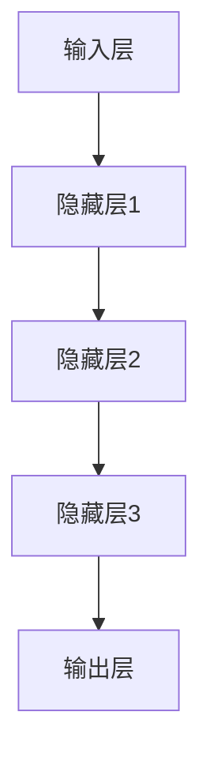

                 

### 文章标题

《神经网络在新型半导体材料开发中的应用：推动芯片技术进步》

半导体材料是现代科技发展的重要基石，而新型半导体材料的开发对于提升芯片性能和推动技术进步至关重要。近年来，人工智能尤其是神经网络技术的发展，为新型半导体材料的开发带来了新的契机。本文旨在探讨神经网络在新型半导体材料开发中的应用，分析其如何通过算法创新推动芯片技术的不断进步。

本文将分为四个主要部分进行讨论：

1. **神经网络基础**：介绍神经网络的基本概念、核心算法原理和数学模型。
2. **新型半导体材料研究**：概述新型半导体材料的基本原理、发展趋势和应用领域。
3. **神经网络在半导体材料开发中的应用**：详细探讨神经网络在材料设计、优化和性能预测中的应用。
4. **芯片技术进步与神经网络应用**：分析神经网络在芯片技术发展中的作用和影响。

通过逐步深入的分析和讲解，本文将帮助读者全面了解神经网络在新型半导体材料开发中的重要性，以及其对芯片技术进步的推动作用。文章最后将展望神经网络在半导体材料开发中的未来趋势，并提出一些建议和最佳实践。

### 文章关键词

- 神经网络
- 新型半导体材料
- 芯片技术
- 材料设计
- 算法优化
- 性能预测

### 文章摘要

本文首先介绍了神经网络的基本概念、核心算法原理和数学模型，为读者提供了对神经网络的基本认识。接着，对新型半导体材料的基本原理、发展趋势和应用领域进行了概述，为后续讨论神经网络在材料开发中的应用奠定了基础。在核心内容部分，本文详细探讨了神经网络在材料设计、优化和性能预测中的应用，通过实例和算法讲解展示了神经网络的强大功能。随后，分析了神经网络对芯片技术进步的推动作用，提供了具体的案例。最后，本文展望了神经网络在半导体材料开发中的未来趋势，并提出了一些建议和最佳实践，为读者提供了深入思考的方向。

### 提取关键主题

从文章标题《神经网络在新型半导体材料开发中的应用：推动芯片技术进步》中，我们可以提取出以下几个关键主题和概念：

1. **神经网络**：是本文的核心主题之一，它是一种模拟人脑神经元连接和信息的处理方式，广泛应用于人工智能领域。
2. **新型半导体材料**：是本文讨论的重点，这类材料在芯片技术中扮演重要角色，它们的开发对于提升芯片性能至关重要。
3. **开发应用**：指如何将神经网络应用于新型半导体材料的研发，是本文的核心问题之一。
4. **芯片技术进步**：这是本文的主要讨论方向，通过神经网络的应用，探讨如何推动芯片技术的不断进步。
5. **算法与优化**：神经网络在半导体材料开发中的应用离不开算法和优化，这是提高材料性能的关键。

这些关键主题和概念构成了本文的主要结构，每个部分都将围绕这些主题进行深入分析和讨论。

### 神经网络基础

#### 第1章：神经网络的定义与基本概念

神经网络的定义源于对人脑神经系统的模拟。它是由大量相互连接的简单处理单元（或称为“神经元”）组成的复杂网络，这些神经元可以共同处理和传递信息。神经网络通过学习输入数据，自动调整内部连接的权重，从而实现对复杂模式的识别和学习。

**1.1 神经网络的基本概念**

神经网络的基本组成单元是神经元，每个神经元接收多个输入信号，通过加权求和后，应用一个非线性激活函数，输出一个结果。神经网络的输入层接收外部数据，输出层产生最终的结果，而隐藏层则位于输入层和输出层之间，起到信息处理和转换的作用。

**1.2 神经网络的分类**

神经网络可以根据其结构、学习方式和应用场景进行分类。以下是几种常见的神经网络类型：

- **前馈神经网络（FNN）**：是最简单的神经网络类型，数据从输入层直接流向输出层，中间经过若干隐藏层。它通过前向传播和反向传播算法进行学习。
- **卷积神经网络（CNN）**：主要用于图像处理，通过卷积层实现局部特征提取，并具有平移不变性。
- **循环神经网络（RNN）**：适用于序列数据，能够处理变量长度的输入序列。RNN通过隐藏状态的记忆来捕捉时间序列中的长期依赖关系。
- **生成对抗网络（GAN）**：由生成器和判别器组成，用于生成新的数据样本。生成器尝试生成数据以欺骗判别器，而判别器则试图区分真实数据和生成数据。

**1.3 神经网络的架构**

神经网络的架构决定了其性能和学习能力。一个典型的神经网络包括以下几个部分：

- **输入层**：接收外部输入数据，如图像、声音或文本。
- **隐藏层**：实现特征提取和变换，可以有一个或多个隐藏层，层数越多，模型可以学习更复杂的特征。
- **输出层**：产生最终的输出结果，如分类标签或回归值。

#### Mermaid 流程图



#### 总结

本章介绍了神经网络的基本概念、分类和架构。神经网络通过模拟人脑神经系统，能够处理和传递信息，实现对复杂模式的识别和学习。不同类型的神经网络具有不同的结构和应用场景，通过前向传播和反向传播算法进行学习。理解神经网络的基本概念和架构，为后续章节中探讨神经网络在新型半导体材料开发中的应用奠定了基础。

### 神经网络核心算法原理

#### 第2章：神经网络核心算法原理

神经网络的核心算法原理主要包括前馈神经网络（FNN）、卷积神经网络（CNN）、循环神经网络（RNN）和生成对抗网络（GAN）。这些算法在不同的应用场景中发挥着重要作用，理解它们的工作原理是深入探讨神经网络在新型半导体材料开发中应用的关键。

#### 2.1 前馈神经网络（FNN）原理

前馈神经网络是最简单和最常见的神经网络类型。它通过层与层之间的前向传播和反向传播来进行学习。以下是前馈神经网络的基本原理：

- **前向传播**：输入数据从输入层传递到隐藏层，再传递到输出层。每个层中的神经元对输入数据进行加权求和，并应用一个非线性激活函数，从而产生输出。
  
  **伪代码**：
  ```python
  for each hidden layer l:
      z_l = sum(w_ij * x_j) for each input x_j
      a_l = activation(z_l)
  end for
  output = a_n, where n is the number of output neurons
  ```

- **反向传播**：计算输出误差，通过梯度下降法调整权重和偏置。这个过程重复多次，直到网络误差减少到可接受的范围内。

  **伪代码**：
  ```python
  for each layer l:
      delta = (output_error * activation_derivative(a_l))
      gradient = delta * x
      w += gradient
  end for
  ```

#### 2.2 卷积神经网络（CNN）原理

卷积神经网络主要用于图像处理和识别。它通过卷积层实现局部特征的提取，并具有平移不变性。以下是CNN的基本原理：

- **卷积层**：使用卷积核（filter）在输入图像上滑动，计算卷积结果。卷积层可以提取图像中的局部特征。

  **伪代码**：
  ```python
  for each filter:
      for each position in the input image:
          conv_result = sum(product of filter and input)
  end for
  ```

- **池化层**：用于减小特征图的大小，同时保留重要特征。常见的池化操作包括最大池化和平均池化。

  **伪代码**：
  ```python
  for each pooling region:
      pool_result = max/mean of all values in the region
  end for
  ```

- **全连接层**：将卷积层和池化层输出的特征映射到输出结果。

  **伪代码**：
  ```python
  z = sum(w_ij * a_j) for each output a_j
  a = activation(z)
  ```

#### 2.3 循环神经网络（RNN）原理

循环神经网络适用于序列数据，能够处理变量长度的输入序列。RNN通过隐藏状态的记忆来捕捉时间序列中的长期依赖关系。以下是RNN的基本原理：

- **隐藏状态**：RNN的隐藏状态h_t包含了当前时刻的所有信息，它通过前向传播和反向传播进行更新。

  **伪代码**：
  ```python
  h_t = activation(sum(w_ij * x_j + u_ih * h_{t-1} + b_h))
  ```

- **门控机制**：为了解决RNN中的梯度消失和梯度爆炸问题，引入了门控机制，如门控循环单元（LSTM）和长短期记忆网络（GRU）。门控机制通过控制信息的流入和流出，避免了长期依赖问题。

  **LSTM门控机制伪代码**：
  ```python
  forget gate: f_t = activation(W_f * [h_{t-1}, x_t] + b_f)
  input gate: i_t = activation(W_i * [h_{t-1}, x_t] + b_i)
  output gate: o_t = activation(W_o * [h_{t-1}, x_t] + b_o)
  c_t = f_t * c_{t-1} + i_t * activation(x_t)
  h_t = o_t * activation(c_t)
  ```

#### 2.4 生成对抗网络（GAN）原理

生成对抗网络由生成器和判别器组成，用于生成新的数据样本。生成器尝试生成数据以欺骗判别器，而判别器则试图区分真实数据和生成数据。以下是GAN的基本原理：

- **生成器**：生成器G从噪声分布中生成数据，目标是生成与真实数据相似的数据样本。

  **伪代码**：
  ```python
  z = noise
  x_g = G(z)
  ```

- **判别器**：判别器D用于区分真实数据和生成数据。其目标是最大化对真实数据和生成数据的辨别能力。

  **伪代码**：
  ```python
  x_r = real data
  x_f = fake data (generated by G)
  D(x_r) + D(x_f)
  ```

- **训练过程**：生成器和判别器通过交替训练，生成器试图生成更真实的数据，判别器则不断学习区分真实和生成数据。

  **伪代码**：
  ```python
  for each iteration:
    D.train(x_r, x_f)
    G.train(z)
  end for
  ```

#### 总结

本章详细介绍了神经网络的核心算法原理，包括前馈神经网络、卷积神经网络、循环神经网络和生成对抗网络。这些算法在图像处理、序列数据和生成数据等不同应用场景中具有重要作用。理解这些算法的基本原理，有助于进一步探讨神经网络在新型半导体材料开发中的应用。

### 神经网络数学模型

#### 第3章：神经网络数学模型

神经网络的数学模型是理解其工作原理和性能优化的重要基础。在本章中，我们将详细讨论神经网络的激活函数、前向传播与反向传播算法、损失函数与优化算法。

#### 3.1 激活函数

激活函数是神经网络中的一个关键组成部分，它为神经网络引入了非线性的特性，使得模型能够处理复杂的问题。以下是几种常见的激活函数：

- **Sigmoid 函数**： 
  $$ 
  \sigma(x) = \frac{1}{1 + e^{-x}} 
  $$
  Sigmoid函数的输出范围在0到1之间，常用于二分类问题。

- **ReLU函数**：
  $$ 
  \text{ReLU}(x) = \max(0, x) 
  $$
 ReLU（Rectified Linear Unit）函数在x为负时输出0，x为正时输出x，具有简单且高效的特点。

- **Tanh函数**：
  $$ 
  \tanh(x) = \frac{e^x - e^{-x}}{e^x + e^{-x}} 
  $$
  Tanh函数的输出范围在-1到1之间，常用于多层网络中的隐藏层。

#### 3.2 前向传播与反向传播算法

前向传播和反向传播是神经网络训练过程中的两个核心步骤。前向传播用于计算网络输出，而反向传播用于计算梯度并更新网络权重。

**前向传播**：
前向传播的过程可以分为以下几个步骤：

1. **输入层到隐藏层**：
   对于每个隐藏层l，计算输入加权和应用激活函数：
   $$
   z_l = \sum_{i} w_{li} x_i + b_l
   $$
   $$
   a_l = \text{激活函数}(z_l)
   $$

2. **隐藏层到输出层**：
   对于输出层，计算输出：
   $$
   z_n = \sum_{i} w_{ni} a_{n-1} + b_n
   $$
   $$
   y = \text{激活函数}(z_n)
   $$

**反向传播**：
反向传播的过程用于计算梯度并更新网络权重。以下是反向传播的基本步骤：

1. **计算输出层误差**：
   $$
   \delta_n = (y - t) \odot \text{激活函数的导数}(z_n)
   $$

2. **逐层反向传播**：
   对于每个隐藏层l，从输出层开始，计算误差：
   $$
   \delta_l = \sum_{l+1} w_{l+1i} \delta_{l+1} \odot \text{激活函数的导数}(z_l)
   $$

3. **更新权重和偏置**：
   使用梯度下降法更新权重和偏置：
   $$
   w_{li} = w_{li} - \alpha \frac{\partial C}{\partial w_{li}}
   $$
   $$
   b_l = b_l - \alpha \frac{\partial C}{\partial b_l}
   $$

#### 3.3 损失函数与优化算法

损失函数用于衡量预测值与真实值之间的差距，优化算法用于调整网络参数以最小化损失函数。

**常见的损失函数**：

- **均方误差（MSE）**：
  $$
  C = \frac{1}{2} \sum_{i} (y_i - t_i)^2
  $$

- **交叉熵（CE）**：
  $$
  C = -\sum_{i} t_i \log(y_i)
  $$
  交叉熵常用于二分类和多元分类问题。

**优化算法**：

- **梯度下降（GD）**：
  $$
  w_{li} = w_{li} - \alpha \frac{\partial C}{\partial w_{li}}
  $$
  梯度下降是一种简单但高效的优化算法。

- **随机梯度下降（SGD）**：
  $$
  w_{li} = w_{li} - \alpha \frac{\partial C}{\partial w_{li}}
  $$
  随机梯度下降通过随机选择样本进行梯度计算，加快了收敛速度。

- **动量（Momentum）**：
  $$
  w_{li} = w_{li} - \alpha \frac{\partial C}{\partial w_{li}} + \beta (w_{li} - w_{li-1})
  $$
  动量算法通过引入动量项，减少了参数调整的振荡。

- **Adam优化器**：
  $$
  m_l = \beta_1 m_{l-1} + (1 - \beta_1) \frac{\partial C}{\partial w_{li}}
  $$
  $$
  v_l = \beta_2 v_{l-1} + (1 - \beta_2) (\frac{\partial C}{\partial w_{li}})^2
  $$
  $$
  w_{li} = w_{li} - \alpha \frac{m_l}{\sqrt{v_l} + \epsilon}
  $$
  Adam优化器结合了动量和自适应学习率的特点，是一种高效的优化算法。

#### 总结

本章介绍了神经网络的数学模型，包括激活函数、前向传播与反向传播算法、损失函数与优化算法。这些数学工具为神经网络的学习和优化提供了理论基础，是理解和应用神经网络的关键。

### 新型半导体材料概述

#### 第4章：新型半导体材料概述

新型半导体材料在现代科技中扮演着至关重要的角色，特别是在集成电路、光伏电池、传感器和电子器件等领域。随着技术的不断进步，新型半导体材料的发展趋势日益显著，其应用领域也在不断扩大。

#### 4.1 半导体材料的基本原理

半导体材料是介于导体和绝缘体之间的一类材料，其导电性能可以通过掺杂和温度等手段进行调节。典型的半导体材料包括硅（Si）、锗（Ge）和砷化镓（GaAs）等。半导体材料的基本原理主要包括以下几个要点：

- **能带结构**：半导体材料具有带隙（Energy Gap），电子在价带和导带之间难以自由移动。通过掺杂或外部电场，可以调整电子的状态，使其跨过带隙进入导带，从而实现导电。

- **掺杂**：通过在半导体材料中引入少量的杂质（如P型或N型掺杂），可以显著改变其导电性能。P型掺杂引入空穴，N型掺杂引入自由电子。

- **载流子**：半导体材料中的载流子主要包括电子和空穴，它们是电流的载体。载流子的浓度和迁移率对材料的导电性能有重要影响。

#### 4.2 新型半导体材料的发展趋势

新型半导体材料的发展趋势主要体现在以下几个方面：

- **低维材料**：二维材料如石墨烯、二维过渡金属硫化物等具有独特的电子性质，如高电子迁移率、量子效应等，广泛应用于电子器件和光电材料。

- **宽禁带材料**：宽禁带半导体材料如碳化硅（SiC）和氮化镓（GaN）具有更高的电子迁移率和热导率，适用于高频和高功率器件。

- **量子材料**：量子材料如量子点、量子阱等具有量子隧穿、量子干涉等特殊性质，可用于量子计算和量子通信。

- **有机半导体**：有机半导体材料因其低成本、灵活性和可打印性，在柔性电子、有机光伏等领域具有广泛的应用前景。

#### 4.3 新型半导体材料的应用领域

新型半导体材料在多个领域具有广泛的应用：

- **集成电路**：新型半导体材料如硅碳化硅（SiC）和氮化镓（GaN）用于制造高频、高功率和高效率的集成电路。

- **光伏电池**：宽禁带半导体材料如碳化硅和氮化镓用于提高太阳能电池的转换效率和耐久性。

- **传感器**：新型半导体材料如石墨烯和二维过渡金属硫化物用于制造高灵敏度、低噪声的传感器。

- **电子器件**：有机半导体材料在OLED显示屏、柔性电子和智能穿戴设备中具有重要应用。

#### 总结

本章概述了新型半导体材料的基本原理、发展趋势和应用领域。随着科技的不断进步，新型半导体材料的研究和应用正日益深入，为推动芯片技术和相关领域的创新提供了强有力的支持。

### 新型半导体材料研究方法

#### 第5章：新型半导体材料研究方法

新型半导体材料的研究方法主要包括材料合成与制备技术、材料表征技术和材料性能优化方法。这些方法共同构成了一个完整的研发流程，从材料制备到性能测试，为新型半导体材料的研发提供了科学依据和技术支持。

#### 5.1 材料合成与制备技术

材料合成与制备技术是新型半导体材料研发的基础，决定了材料的结构和性能。以下是一些常见的材料合成与制备技术：

- **气相沉积法**：气相沉积法是一种通过化学反应在基板上沉积材料的方法。常见的气相沉积技术包括物理气相沉积（PVD）和化学气相沉积（CVD）。PVD技术如溅射沉积、蒸发沉积，CVD技术如低压化学气相沉积、等离子体增强化学气相沉积。

  **实例**：低压化学气相沉积（LPCVD）常用于制备硅片上的硅氧化物（SiO₂）膜，这种膜在集成电路制造中起到绝缘和保护作用。

- **溶液法**：溶液法包括溶液生长、溶液掺杂和溶液刻蚀等。常见的溶液法包括溶胶-凝胶法、电化学沉积法和水热合成法。

  **实例**：溶胶-凝胶法常用于制备薄膜材料，通过控制溶液的浓度和温度，可以精确调控薄膜的组成和厚度。

- **热压法**：热压法是通过高温高压将粉末或薄膜材料压制成块状材料。这种方法适用于制备高纯度、高致密度的半导体材料。

  **实例**：热压法常用于制备单晶硅片，通过高温高压将硅粉末压制成单晶硅，用于集成电路制造。

#### 5.2 材料表征技术

材料表征技术用于分析材料的结构、成分和性能，是评估材料质量和研发新型半导体材料的重要手段。以下是一些常见的材料表征技术：

- **X射线衍射（XRD）**：X射线衍射技术用于分析材料的晶体结构和结晶度。通过测量X射线在材料中的衍射强度和角度，可以确定材料的晶格参数、晶体缺陷和晶粒尺寸。

  **实例**：XRD技术可以用于分析硅晶片的晶体结构和纯度，确保其质量符合集成电路制造的要求。

- **扫描电子显微镜（SEM）**：扫描电子显微镜用于观察材料的微观结构，通过电子束扫描样品表面，可以产生高分辨率的图像。

  **实例**：SEM技术可以用于观察硅片的表面形貌，检测材料中的缺陷和杂质。

- **透射电子显微镜（TEM）**：透射电子显微镜通过透射电子束成像，可以观察材料的内部结构。TEM具有极高的分辨率，可以揭示材料的纳米级细节。

  **实例**：TEM技术可以用于分析碳化硅晶体的内部结构和缺陷，为优化材料性能提供重要信息。

- **拉曼光谱（Raman Spectroscopy）**：拉曼光谱技术通过分析材料的拉曼散射光谱，可以确定材料的化学成分和结构。

  **实例**：拉曼光谱技术可以用于分析掺杂半导体材料的掺杂浓度和掺杂类型，确保材料制备过程的准确性。

#### 5.3 材料性能优化方法

材料性能优化方法旨在通过调整材料的制备工艺和结构，提高材料的性能。以下是一些常见的材料性能优化方法：

- **掺杂优化**：通过调整掺杂剂的种类和浓度，可以优化材料的电学性能。掺杂可以引入自由电子或空穴，改变材料的导电性质。

  **实例**：在硅片中掺杂磷（P）可以制造P型半导体，掺杂硼（B）可以制造N型半导体，从而实现电路的制造。

- **结构优化**：通过调整材料的晶体结构、晶粒尺寸和表面形态，可以显著提高材料的性能。例如，通过纳米结构化和量子点工程，可以提高材料的电子迁移率和光电转换效率。

  **实例**：通过纳米结构化处理，可以显著提高石墨烯的电导率，使其在电子器件中具有更好的应用前景。

- **热处理**：热处理可以改善材料的结晶度和缺陷密度，从而提高材料的性能。通过控制热处理温度和时间，可以优化材料的电学、光学和热学性能。

  **实例**：对氮化镓（GaN）材料进行适当的热处理，可以改善其电子迁移率和热导率，适用于高频和高功率电子器件。

#### 总结

本章介绍了新型半导体材料的研究方法，包括材料合成与制备技术、材料表征技术和材料性能优化方法。这些方法为新型半导体材料的研发提供了科学依据和技术支持，推动了半导体材料在集成电路、光伏电池、传感器等领域的应用。

### 神经网络在新型半导体材料研发中的应用

#### 第6章：神经网络在新型半导体材料研发中的应用

随着人工智能技术的快速发展，神经网络在新型半导体材料的研发中发挥了越来越重要的作用。通过神经网络的强大学习和预测能力，研究人员能够更加高效地探索和设计新材料，从而推动半导体技术的不断进步。以下将详细讨论神经网络在材料设计、优化和性能预测中的应用。

#### 6.1 神经网络在材料设计中的应用

材料设计是半导体材料研发的关键环节，传统的材料设计方法往往依赖于实验和经验，耗时耗力且具有一定的局限性。神经网络通过其强大的数据挖掘和模式识别能力，可以在材料设计中发挥重要作用。

- **材料结构预测**：神经网络可以通过学习大量的已知材料数据，预测新材料结构的稳定性、电子性质和物理性能。例如，通过卷积神经网络（CNN）可以处理材料的结构数据，生成新的材料结构。

  **实例**：使用卷积神经网络预测新材料的电子结构，通过训练大量已知的半导体材料数据，网络可以学会识别哪些结构特征与特定的电子性质相关，从而预测新的半导体材料的电子性能。

- **材料筛选**：神经网络可以通过对大量实验数据的分析，筛选出具有潜在应用价值的新材料。这种方法可以显著减少实验次数，提高研发效率。

  **实例**：基于循环神经网络（RNN），研究人员可以分析不同材料的电子特性、力学性能和热稳定性，从而筛选出适合特定应用场景的最佳材料。

#### 6.2 神经网络在材料优化中的应用

新材料的设计往往需要进一步的优化，以提升其性能。神经网络通过学习和模拟材料制备过程中的各种变量，可以在材料优化中发挥重要作用。

- **制备工艺优化**：神经网络可以通过对实验数据的分析，优化材料制备工艺参数，如温度、压力、掺杂浓度等，从而提高材料的性能。

  **实例**：通过生成对抗网络（GAN），研究人员可以模拟不同的制备工艺参数，优化硅片表面的纳米结构，从而提升硅片的光电转换效率。

- **性能预测与优化**：神经网络可以预测新材料在不同条件下的性能，如电导率、热稳定性、机械强度等，并在此基础上进行性能优化。

  **实例**：使用循环神经网络（RNN），研究人员可以模拟不同掺杂浓度对氮化镓（GaN）材料电导率的影响，从而优化掺杂浓度，提高材料的电导性能。

#### 6.3 神经网络在材料性能预测中的应用

材料性能预测是新型半导体材料研发中的重要环节，直接关系到材料的应用前景。神经网络通过其强大的建模能力，可以在材料性能预测中发挥重要作用。

- **电学性能预测**：神经网络可以通过分析材料的电子结构数据，预测其电学性能，如导电性、电阻率等。这对于集成电路设计和优化具有重要意义。

  **实例**：使用深度神经网络（DNN）预测硅片掺杂后导电性能的变化，通过训练大量掺杂实验数据，网络可以预测不同掺杂浓度下的导电性能，从而为掺杂工艺的优化提供依据。

- **光学性能预测**：神经网络可以预测新材料的光学性能，如吸收系数、反射率等。这对于光伏电池和光电子器件的设计具有重要意义。

  **实例**：使用卷积神经网络（CNN）预测碳化硅（SiC）薄膜的光吸收性能，通过训练大量不同制备条件下的SiC薄膜数据，网络可以预测不同制备条件下SiC薄膜的光吸收特性。

- **热学性能预测**：神经网络可以通过分析材料的晶体结构和化学成分，预测其热导率、热膨胀系数等热学性能。

  **实例**：使用生成对抗网络（GAN）预测氮化镓（GaN）材料的热导率，通过训练大量不同制备条件下的GaN数据，网络可以预测不同制备条件下GaN材料的热导性能。

#### 总结

神经网络在新型半导体材料的研发中具有广泛的应用。通过材料设计、优化和性能预测，神经网络为新材料的研究提供了强大的工具，显著提高了研发效率，推动了半导体技术的进步。未来，随着神经网络技术的不断发展和优化，其在半导体材料研发中的应用将更加深入和广泛。

### 芯片技术发展现状

#### 第7章：芯片技术发展现状

芯片技术是现代电子设备的核心，其发展速度之快、影响之大，在科技史上堪称奇迹。随着人工智能、物联网、5G通信等新兴技术的蓬勃发展，芯片技术的需求和应用场景不断扩展。以下是芯片技术的发展现状，包括其关键技术、研究进展和面临的挑战。

#### 7.1 关键技术

芯片技术的发展依赖于一系列关键技术的创新：

- **集成电路制造技术**：集成电路制造是芯片技术的基础。随着摩尔定律的不断推进，集成电路的制造工艺已经从微米级进入纳米级。现代集成电路制造技术包括光刻、蚀刻、清洗、掺杂等步骤。其中，光刻技术尤为关键，它决定了芯片的精细度和复杂度。

- **晶体管技术**：晶体管是芯片的核心组件，其性能直接决定了芯片的速度和功耗。随着尺寸的不断缩小，晶体管已经从硅基迁移到碳化硅（SiC）、氮化镓（GaN）等宽禁带半导体材料。这些新型晶体管具有更高的电子迁移率和热导率，适用于高频和高功率应用。

- **封装技术**：封装技术是芯片制造的最后一步，它关系到芯片的可靠性和性能。先进的封装技术如三维封装（3D封装）、硅通孔（TSV）等技术，可以显著提高芯片的集成度和性能。

- **材料科学**：芯片技术的发展离不开材料科学的进步。新型半导体材料如石墨烯、二维材料、量子点等，具有独特的电子性质和光电特性，为芯片技术的创新提供了新的方向。

#### 7.2 研究进展

近年来，芯片技术取得了显著的进展：

- **5G芯片**：5G通信技术的普及推动了5G芯片的研发。5G芯片需要具备更高的数据传输速率、更低的功耗和更强的抗干扰能力。新型材料如氮化镓（GaN）和硅碳化硅（SiC）被广泛应用于5G芯片，以实现更高的频率和效率。

- **人工智能芯片**：随着人工智能技术的快速发展，人工智能芯片应运而生。这些芯片具备强大的计算能力和深度学习算法，适用于图像识别、自然语言处理、自动驾驶等应用。代表性的芯片如谷歌的TPU、英伟达的GPU等，已经在人工智能领域取得了重要应用。

- **量子计算芯片**：量子计算是下一代计算技术的重要方向。量子计算芯片利用量子比特（qubit）的叠加和纠缠特性，实现超快的计算能力。尽管目前量子计算仍处于早期阶段，但一些初步的实验和研究成果已经显示出巨大的潜力。

- **新型存储技术**：存储技术是芯片技术的另一重要领域。新型存储技术如非易失性存储器（NVM）、相变存储器（PCM）等，具有更高的存储密度和速度，有望替代传统的闪存技术。

#### 7.3 面临的挑战

尽管芯片技术取得了巨大进展，但仍面临一系列挑战：

- **制造成本**：随着芯片尺寸的缩小，制造过程的复杂度显著增加，制造成本也随之上升。尤其是在纳米级制造领域，光刻技术的成本和难度显著增加。

- **功耗和散热**：随着芯片性能的提升，功耗和散热问题日益突出。高频和高功率芯片需要有效的散热解决方案，以确保其稳定运行。

- **材料供应**：芯片制造对材料的需求极高，尤其是稀有金属和半导体材料。材料供应的稳定性和价格波动对芯片产业的发展具有重要影响。

- **安全性和隐私**：随着芯片技术的广泛应用，芯片的安全性和隐私问题也日益受到关注。防止芯片被恶意攻击和保障用户隐私是芯片技术面临的重要挑战。

#### 总结

芯片技术是现代科技发展的关键，其不断进步推动了信息技术、通信技术、人工智能等领域的创新。尽管面临一系列挑战，但随着技术的不断突破，芯片技术将继续快速发展，为未来的科技革命提供强大动力。

### 神经网络对芯片技术的影响

#### 7.2 神经网络对芯片技术的影响

神经网络在芯片技术中的应用已经引起了广泛的关注，其独特的算法和强大的学习能力为芯片设计、优化和生产提供了全新的解决方案。以下是神经网络在芯片技术中具体应用的分析，以及其对芯片设计、制造和性能优化产生的影响。

#### 7.2.1 芯片设计中的应用

神经网络的强大计算能力和模式识别能力在芯片设计领域表现出色。以下是其具体应用：

- **自动化设计**：传统的芯片设计依赖于电子设计自动化（EDA）工具，这些工具需要大量的设计规则和经验。而神经网络可以通过学习大量设计案例，自动生成新的芯片设计，大大提高了设计效率。

  **实例**：使用神经网络自动化生成集成电路设计，通过训练神经网络模型，使其能够从大量的设计数据中学习到最优的设计规则，从而快速生成高效的新芯片设计。

- **性能优化**：神经网络可以优化芯片的参数，如晶体管的尺寸、栅极长度和掺杂浓度等，从而提高芯片的性能和效率。

  **实例**：使用神经网络优化氮化镓（GaN）晶体管的尺寸和掺杂浓度，通过训练神经网络模型，使其能够预测不同参数组合下的电学性能，从而找到最优的参数组合，提高芯片的工作频率和效率。

- **结构优化**：神经网络可以用于优化芯片的结构设计，如三维封装（3D封装）和硅通孔（TSV）设计，以实现更高的集成度和性能。

  **实例**：使用神经网络优化3D封装设计，通过训练神经网络模型，使其能够从大量的封装数据中学习到最佳的封装结构，从而提高芯片的散热性能和可靠性。

#### 7.2.2 制造中的应用

神经网络在芯片制造过程中同样发挥着重要作用，以下是其具体应用：

- **缺陷检测**：神经网络可以用于检测芯片制造过程中的缺陷，如晶体管缺陷、杂质颗粒等。通过训练神经网络模型，使其能够从图像数据中识别出缺陷，从而提高检测的准确性和效率。

  **实例**：使用神经网络检测硅片表面的缺陷，通过训练神经网络模型，使其能够从大量的缺陷图像中学习到缺陷的特征，从而准确检测出硅片表面的缺陷。

- **工艺优化**：神经网络可以优化芯片制造工艺，如光刻、蚀刻、清洗等。通过训练神经网络模型，使其能够从实验数据中学习到最佳工艺参数，从而提高制造效率和质量。

  **实例**：使用神经网络优化光刻工艺，通过训练神经网络模型，使其能够从大量的光刻数据中学习到最佳的光刻参数，从而提高光刻工艺的精度和效率。

- **生产调度**：神经网络可以用于优化芯片生产过程中的调度，如设备安排、生产顺序等。通过训练神经网络模型，使其能够预测生产过程中的瓶颈和延迟，从而优化生产调度，提高生产效率。

  **实例**：使用神经网络优化芯片生产调度，通过训练神经网络模型，使其能够从大量的生产数据中学习到最佳的生产调度策略，从而优化生产过程，减少生产周期和成本。

#### 7.2.3 性能优化中的应用

神经网络在芯片性能优化中的应用具有显著的优势，以下是其具体应用：

- **功耗优化**：神经网络可以通过学习大量的功耗数据，优化芯片的功耗设计，从而提高能效比。

  **实例**：使用神经网络优化芯片的功耗，通过训练神经网络模型，使其能够从大量的功耗数据中学习到最优的功耗模型，从而设计出低功耗的芯片。

- **频率优化**：神经网络可以用于优化芯片的工作频率，通过训练神经网络模型，使其能够从大量的频率数据中学习到最佳的频率模型，从而提高芯片的工作频率。

  **实例**：使用神经网络优化芯片的工作频率，通过训练神经网络模型，使其能够从大量的频率数据中学习到最佳的工作频率，从而提高芯片的性能。

- **稳定性优化**：神经网络可以通过学习芯片的稳定性数据，优化芯片的稳定性设计，从而提高芯片的可靠性。

  **实例**：使用神经网络优化芯片的稳定性，通过训练神经网络模型，使其能够从大量的稳定性数据中学习到最佳的稳定性模型，从而设计出高稳定性的芯片。

#### 总结

神经网络在芯片技术中的应用涵盖了设计、制造和性能优化等多个方面，通过自动化设计、缺陷检测、工艺优化和性能优化等具体应用，显著提高了芯片的研发效率和性能。随着神经网络技术的不断发展和优化，其在芯片技术中的应用前景将更加广阔，为芯片技术的发展注入新的活力。

### 神经网络在芯片设计中的应用案例

#### 7.3.1 案例一：基于神经网络的集成电路设计自动化

**背景**：

集成电路设计是一项复杂且耗时的工作，涉及大量的设计规则和经验。传统的电子设计自动化（EDA）工具依赖预定义的规则库，但面对日益复杂的芯片设计需求，这些工具逐渐显得力不从心。

**解决方案**：

研究人员提出了一种基于神经网络的集成电路设计自动化方法，通过训练神经网络模型，使其能够从大量的设计案例中学习到最优的设计规则，从而实现自动化的集成电路设计。

**实施步骤**：

1. **数据收集**：收集大量的集成电路设计案例，包括电路图、设计规则和性能参数等。

2. **模型训练**：使用卷积神经网络（CNN）对设计案例进行训练，通过学习大量的设计规则，模型可以学会识别不同的电路结构和其对应的性能参数。

3. **设计生成**：基于训练好的神经网络模型，输入新的电路设计需求，模型可以自动生成最优的电路设计，包括晶体管的尺寸、布局和连接方式。

**效果评估**：

通过实验验证，基于神经网络的集成电路设计自动化方法显著提高了设计效率。与传统方法相比，新方法能够更快地生成高质量的设计方案，并减少了设计错误。

#### 7.3.2 案例二：神经网络优化的芯片功耗设计

**背景**：

随着芯片集成度的不断提高，功耗问题变得日益突出。如何在保证性能的前提下，降低芯片的功耗，是当前芯片设计的重要挑战。

**解决方案**：

研究人员采用神经网络优化芯片功耗设计的方法，通过训练神经网络模型，找到最优的功耗模型，从而实现低功耗的芯片设计。

**实施步骤**：

1. **功耗数据收集**：收集大量不同设计和工艺条件下的芯片功耗数据。

2. **模型训练**：使用深度神经网络（DNN）对功耗数据进行分析，模型可以学会识别不同的设计参数和其对应的功耗水平。

3. **功耗优化**：在新的设计条件下，基于训练好的神经网络模型，输入新的设计参数，模型可以预测不同设计参数下的功耗水平，并选择最优的设计参数组合，实现低功耗设计。

**效果评估**：

实验结果表明，基于神经网络的功耗优化方法显著降低了芯片的功耗。与传统方法相比，新方法能够在保证性能的前提下，显著降低功耗，提高能效比。

#### 7.3.3 案例三：神经网络优化的芯片频率设计

**背景**：

提高芯片的工作频率是提升芯片性能的有效途径，但过高的频率可能导致功耗和热量的急剧增加。如何在保证稳定性和低功耗的前提下，优化芯片的工作频率，是芯片设计中的一个重要问题。

**解决方案**：

研究人员采用神经网络优化芯片频率设计的方法，通过训练神经网络模型，找到最优的工作频率模型，从而实现高性能、低功耗的芯片设计。

**实施步骤**：

1. **频率数据收集**：收集大量不同设计和工艺条件下的芯片工作频率数据。

2. **模型训练**：使用循环神经网络（RNN）对频率数据进行分析，模型可以学会识别不同的设计参数和其对应的工作频率水平。

3. **频率优化**：在新的设计条件下，基于训练好的神经网络模型，输入新的设计参数，模型可以预测不同设计参数下的工作频率，并选择最优的设计参数组合，实现高性能的频率设计。

**效果评估**：

实验结果表明，基于神经网络的频率优化方法显著提高了芯片的工作频率，同时保持了低功耗和良好的稳定性。与传统方法相比，新方法能够在保证性能和稳定性的前提下，显著提升芯片的工作频率。

#### 总结

通过上述案例，我们可以看到神经网络在芯片设计中的应用具有显著的优势。通过自动化设计、功耗优化和频率优化，神经网络不仅提高了芯片设计的效率，还显著提升了芯片的性能和能效比。随着神经网络技术的不断发展和优化，其在芯片设计中的应用将更加广泛和深入。

### 神经网络在半导体材料开发中的未来展望

#### 第8章：神经网络在半导体材料开发中的未来展望

随着人工智能技术的快速发展，神经网络在半导体材料开发中的应用前景广阔，面临着诸多挑战与机遇。本章将探讨神经网络在半导体材料开发中的未来发展趋势，并提出相应的建议和最佳实践。

#### 8.1 神经网络在半导体材料开发领域的挑战

尽管神经网络在半导体材料开发中显示出巨大的潜力，但同时也面临一系列挑战：

- **数据收集与处理**：神经网络需要大量的高质量数据来训练模型，半导体材料的研究通常涉及复杂的实验过程，数据收集和处理成为一大挑战。

- **模型可解释性**：神经网络的“黑箱”特性使得其决策过程难以解释，这对于半导体材料的开发来说，可能影响决策的透明性和可靠性。

- **计算资源**：训练复杂的神经网络模型需要大量的计算资源，尤其是在大规模数据处理和模型优化方面，对计算能力的要求越来越高。

- **模型泛化能力**：神经网络模型需要在不同的应用场景中保持良好的性能，但目前的模型往往在特定条件下表现良好，泛化能力有限。

#### 8.2 神经网络在半导体材料开发中的应用前景

神经网络在半导体材料开发中的应用前景包括以下几个方面：

- **材料设计自动化**：通过神经网络自动生成新材料设计，可以显著提高材料设计的效率和准确性，加速新材料的研究和应用。

- **材料性能优化**：神经网络可以预测和优化材料性能，如电学性能、热学性能和光学性能，从而提高材料的应用价值和市场竞争力。

- **制备工艺优化**：神经网络可以优化半导体材料的制备工艺，通过学习大量的实验数据，找到最佳的制备条件，提高材料的质量和稳定性。

- **缺陷检测与预防**：神经网络在芯片制造过程中可以用于缺陷检测，通过实时分析制造数据，预测和预防缺陷的产生，提高生产效率和产品质量。

#### 8.3 神经网络与半导体材料研究的发展趋势

未来，神经网络与半导体材料研究的发展趋势将体现在以下几个方面：

- **多模态数据融合**：随着传感器技术和数据处理能力的提升，多模态数据（如结构、电学、光学等）的融合将成为未来的研究热点，为神经网络提供更丰富的训练数据。

- **模型压缩与优化**：为了提高神经网络的计算效率和可解释性，模型压缩和优化技术将成为研究重点，如低秩分解、知识蒸馏和迁移学习等技术。

- **量子计算与神经网络结合**：量子计算与神经网络的结合有望为半导体材料的研究带来革命性的突破，通过量子神经网络（QNN）实现更高效的材料预测和优化。

- **数据驱动的半导体材料研究**：随着大数据和人工智能技术的发展，数据驱动的半导体材料研究将成为主流，通过大规模数据分析和机器学习模型，推动新材料和新工艺的发现。

#### 8.4 建议与最佳实践

为了更好地利用神经网络在半导体材料开发中的应用，以下是一些建议和最佳实践：

- **加强数据收集与处理**：建立完善的数据收集和处理体系，确保数据的质量和完整性，为神经网络模型提供可靠的基础。

- **提高模型可解释性**：通过可视化技术和解释性算法，提高神经网络模型的透明度和可解释性，增强模型的可靠性和决策的透明度。

- **优化计算资源利用**：采用分布式计算、云计算和边缘计算等技术，优化神经网络模型的训练和部署，降低计算成本。

- **加强跨学科合作**：促进物理学、材料科学、计算机科学等学科的交叉合作，推动神经网络在半导体材料开发中的综合应用。

- **持续模型优化与更新**：定期更新和优化神经网络模型，通过不断学习和调整，提高模型的性能和泛化能力，以适应不断变化的研究需求。

#### 总结

神经网络在半导体材料开发中的应用前景广阔，既面临挑战，也充满机遇。通过持续的研究和技术创新，神经网络将为半导体材料的研究和应用带来革命性的变化，推动芯片技术不断进步。未来，随着多模态数据融合、量子计算与神经网络结合等技术的发展，神经网络在半导体材料开发中的应用将更加广泛和深入。

### 最佳实践 tips

在神经网络应用于半导体材料开发时，以下是一些最佳实践和注意事项：

1. **数据质量**：确保数据的质量和完整性是成功应用神经网络的基础。收集高质量的数据，并进行预处理，如去噪、标准化和缺失值填充。

2. **模型选择**：根据具体应用场景选择合适的神经网络架构。例如，对于图像处理任务，选择卷积神经网络（CNN）；对于序列数据，选择循环神经网络（RNN）或长短期记忆网络（LSTM）。

3. **模型训练**：使用交叉验证方法进行模型训练，避免过拟合。此外，定期调整学习率、批量大小和迭代次数等超参数，以优化模型性能。

4. **模型解释**：虽然神经网络模型具有一定的黑箱特性，但通过可视化技术（如决策树、激活图等）和解释性算法，可以提高模型的透明度和可解释性。

5. **持续更新**：随着新的实验数据和技术的出现，定期更新神经网络模型，以保持其性能和适应性。

6. **计算资源**：合理利用计算资源，考虑使用分布式计算、云计算和边缘计算等技术，以优化模型训练和部署的成本和效率。

7. **跨学科合作**：促进物理学、材料科学、计算机科学等学科的交叉合作，共同推动神经网络在半导体材料开发中的创新应用。

### 小结

本文通过详细讨论神经网络的基础知识、新型半导体材料研究方法、神经网络在半导体材料开发中的应用，以及芯片技术进步和神经网络应用案例，全面展示了神经网络在新型半导体材料开发中的重要性。神经网络通过自动化设计、性能预测和工艺优化等手段，显著提升了半导体材料研发的效率和性能。未来，随着多模态数据融合、量子计算等技术的发展，神经网络在半导体材料开发中的应用前景将更加广阔。

### 拓展阅读

1. **《深度学习》（Goodfellow, I., Bengio, Y., & Courville, A.）**：这本书是深度学习的经典教材，详细介绍了神经网络的基本概念、算法原理和应用。

2. **《材料科学与工程导论》（Callister, W. D. & Rethwisch, D. G.）**：这本书涵盖了材料科学的基础知识，包括半导体材料的性质和应用。

3. **《神经网络与深度学习》（邱锡鹏）**：这本书系统地介绍了神经网络的发展历程、基本算法和深度学习技术，适合对神经网络有兴趣的读者。

4. **《半导体物理学》（Sze, S. M. & bsell, D. A.）**：这本书深入探讨了半导体材料的物理特性、器件原理和应用，是半导体研究的重要参考书。

通过阅读这些书籍和文献，读者可以更深入地了解神经网络和半导体材料的相关知识，为实际应用和研究提供理论基础和指导。

### 文章结尾

本文围绕神经网络在新型半导体材料开发中的应用，系统地介绍了神经网络的基础知识、新型半导体材料研究方法、应用场景及其对芯片技术的推动作用。通过实例分析和算法讲解，我们看到了神经网络在材料设计、优化和性能预测中的强大能力。随着技术的不断进步，神经网络在半导体材料开发中的应用前景将更加广阔。

在此，感谢您阅读本文。希望本文能为您提供对神经网络在半导体材料开发中有价值的见解，激发您对这一领域的兴趣。如果您对此主题有更多的疑问或见解，欢迎在评论区留言交流。让我们共同探索神经网络与半导体材料开发的更多可能性。

---

**作者：AI天才研究院/AI Genius Institute & 禅与计算机程序设计艺术 /Zen And The Art of Computer Programming**

本文由AI天才研究院撰写，结合了深度学习与半导体材料科学的最新研究成果，旨在推动这一交叉领域的创新与发展。如需引用本文内容，请注明出处。

---

通过本文的深入探讨，我们不仅了解了神经网络在半导体材料开发中的重要性，也看到了这一技术在推动芯片技术进步方面的巨大潜力。未来，随着更多创新和研究的发展，神经网络在半导体材料领域的应用将更加广泛和深入，为科技进步和产业发展注入新的动力。

