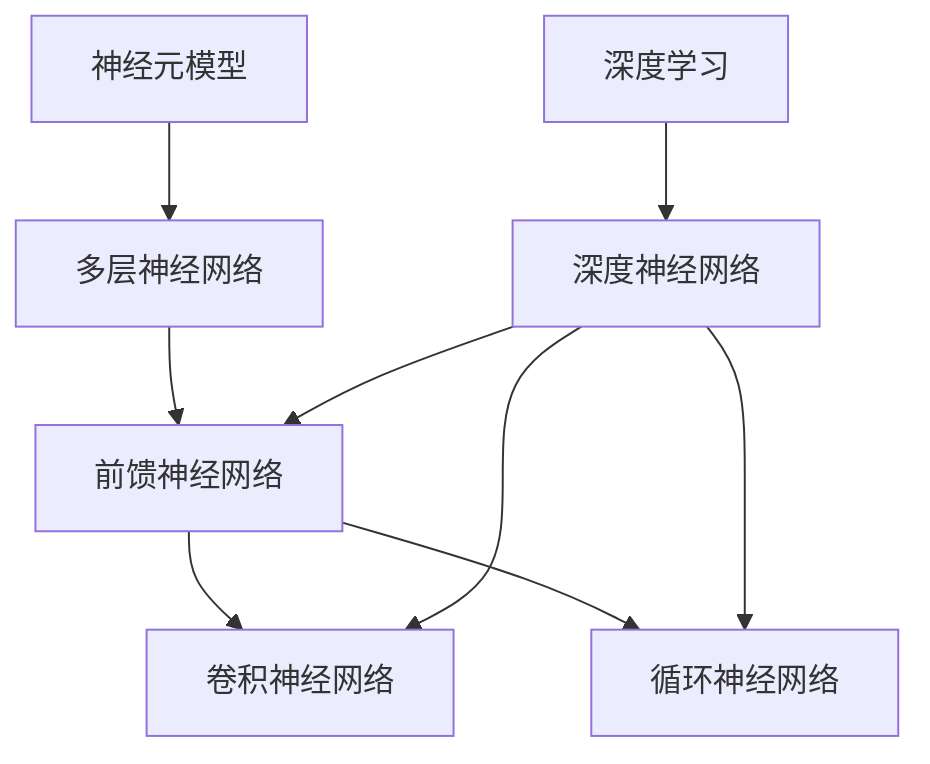
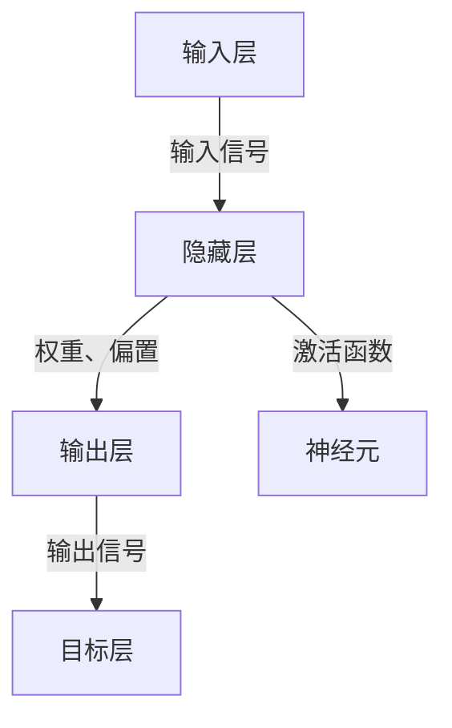
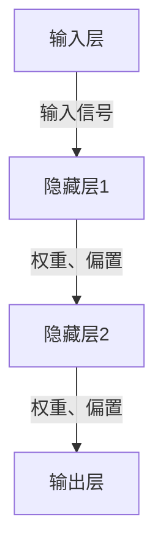
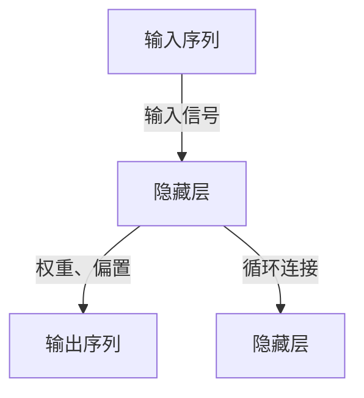
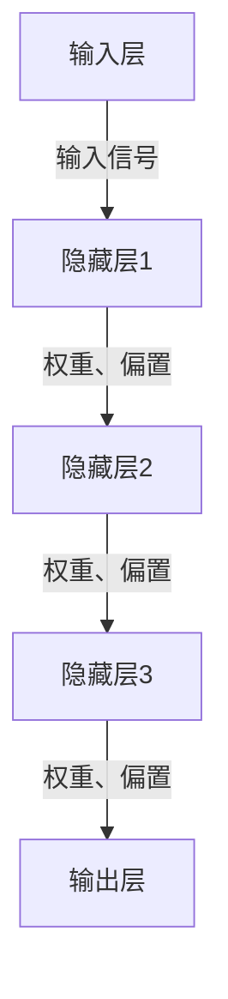
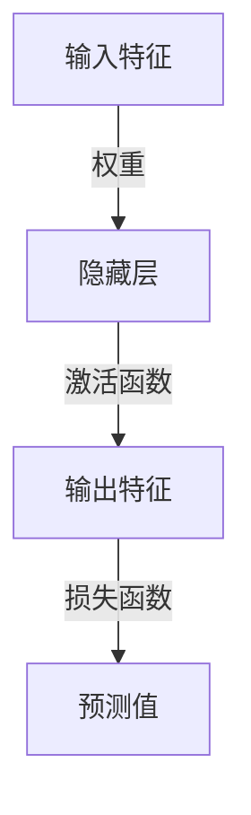
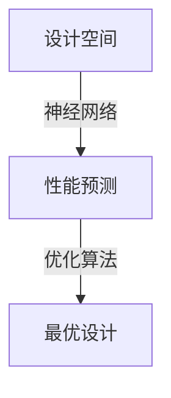
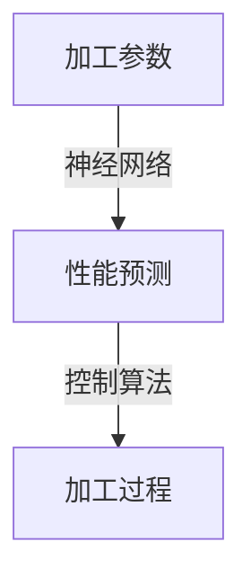
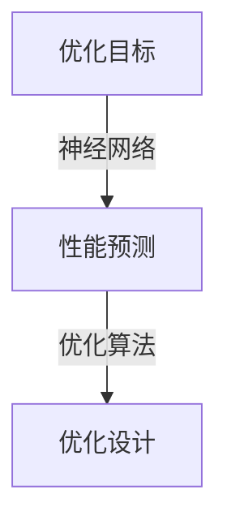

                 

# 神经网络在材料科学中的应用：加速新材料发现

## 关键词
- 神经网络
- 材料科学
- 新材料发现
- 预测建模
- 数据驱动
- 深度学习
- 智能优化

## 摘要
本文探讨了神经网络在材料科学中的应用，特别是在加速新材料发现方面的潜力。首先，我们回顾了神经网络的基本原理及其在各个领域的发展。接着，深入分析了神经网络在材料属性预测、材料设计、材料加工和材料性能优化中的应用，并通过实际案例展示了其效果。随后，我们讨论了神经网络在材料科学中面临的挑战和未来的发展方向。最后，提供了相关的实用资源和最佳实践，以促进进一步的研究和应用。

## 目录
1. **引言**
   - **背景介绍**：材料科学的重要性与挑战
   - **神经网络的发展简史**：基本原理和关键进展

2. **神经网络基础**
   - **神经网络概述**
   - **前馈神经网络**
   - **循环神经网络**
   - **深度神经网络**

3. **神经网络在材料科学中的应用**
   - **材料属性预测**
   - **材料设计**
   - **材料加工**
   - **材料性能优化**

4. **挑战与未来趋势**
   - **挑战**
   - **未来趋势**

5. **实用资源与最佳实践**
   - **开源神经网络框架**
   - **材料科学领域的数据集**
   - **学术期刊和会议**

6. **总结**

## 第一部分：引言

### 背景介绍
材料科学是研究材料的组成、结构、性质和变化规律的科学。它不仅涉及理论研究，还包括实验验证和应用开发。在现代科技中，材料科学扮演着至关重要的角色，从建筑和航空航天到电子和能源领域，都需要高性能的新材料。

然而，新材料发现的传统方法往往耗时长、成本高，难以满足快速发展的需求。传统的实验和理论方法难以预见和设计出具有特定性能的新材料，而现代科学技术的快速发展，尤其是人工智能和深度学习的兴起，为材料科学带来了新的机遇。

神经网络作为一种重要的机器学习模型，以其强大的自适应性和学习能力，在各个领域展现出了巨大的潜力。特别是在材料科学中，神经网络可以通过对大量实验数据的分析和建模，预测材料的性能，指导材料的设计和优化，从而加速新材料发现的过程。

### 神经网络的发展简史
神经网络的概念起源于1943年，由心理学家McCulloch和数学家Pitts提出。他们首次描述了人工神经元的基本模型，称为MP模型。此后，神经网络的模型和理论不断演进。

1958年，Rosenblatt提出了感知机模型，它是第一个能够学习二分类问题的神经网络模型。然而，由于感知机的局限性，神经网络的研究在20世纪60年代陷入了低潮。

直到1986年，Rumelhart、Hinton和Williams等人提出了反向传播算法（Backpropagation），使得多层神经网络训练成为可能。这一突破使得神经网络在图像识别、语音识别等领域取得了显著进展。

进入21世纪，随着计算能力的提升和数据量的爆炸式增长，深度学习逐渐成为人工智能领域的研究热点。深度神经网络（Deep Neural Networks，DNN）通过增加网络的深度和宽度，能够处理更复杂的任务，如自然语言处理、计算机视觉等。

### 核心概念与联系
为了更好地理解神经网络在材料科学中的应用，我们需要先了解神经网络的基本概念和原理。以下是神经网络的基本概念及其关系架构的Mermaid流程图：



### 核心算法原理讲解
以下是一个简化的多层前馈神经网络训练过程的伪代码：

```python
# 初始化权重和偏置
weights, biases = initialize_weights_and_biases()

# 定义激活函数
def activate(z):
    return 1 / (1 + exp(-z))

# 训练网络
for epoch in range(num_epochs):
    for data in training_data:
        # 前向传播
        layer_outputs = [data]
        for layer in layers:
            z = weights[layer] * layer_outputs[-1] + biases[layer]
            layer_outputs.append(activate(z))
        
        # 计算损失
        loss = compute_loss(layer_outputs[-1], target)
        
        # 反向传播
        d_output = d_loss_with_respect_to_output * activate_derivative(z)
        d_weights, d_biases = update_weights_and_biases(layer_outputs, d_output)

# 评估网络
accuracy = evaluate_on_test_data(test_data)
```

### 数学模型和公式
神经网络的训练过程涉及到一系列的数学模型和公式，以下是神经网络模型中的一个简单例子：

$$
z = \sum_{i=1}^{n} w_i * x_i + b
$$

其中，$z$ 是网络输出，$w_i$ 是权重，$x_i$ 是输入特征，$b$ 是偏置。

### 举例说明
以材料属性预测为例，假设我们使用一个简化的神经网络模型来预测材料的导电性。假设我们有以下输入特征：材料的成分、晶格结构、温度等。

1. **输入层**：包含材料的成分、晶格结构、温度等特征。
2. **隐藏层**：对输入特征进行映射，通过权重和激活函数计算得到隐藏层的输出。
3. **输出层**：预测材料的导电性。

### 实际案例
以石墨烯材料的研究为例，研究人员使用神经网络模型来预测不同条件下石墨烯的导电性。通过大量实验数据的训练，神经网络模型能够准确预测石墨烯在不同温度和电场下的导电性，为材料的设计和应用提供了重要的参考。

### 项目实战
为了实现神经网络在材料科学中的应用，我们需要搭建一个完整的开发环境，包括数据预处理、模型训练和评估等步骤。

1. **开发环境搭建**：
   - 安装Python和相关库（如TensorFlow、PyTorch等）。
   - 准备实验数据，并进行预处理。
2. **源代码详细实现**：
   - 编写神经网络模型代码。
   - 实现数据预处理、模型训练和评估等步骤。
3. **代码解读与分析**：
   - 分析代码中的关键步骤和算法原理。
   - 对模型性能进行评估和优化。
4. **实际案例分析和详细讲解剖析**：
   - 分析实际案例，如石墨烯导电性预测。
   - 阐述神经网络模型在案例中的应用和效果。

### 最佳实践 Tips
- **数据质量**：确保实验数据的质量和完整性，这对于神经网络的训练至关重要。
- **模型选择**：根据任务需求选择合适的神经网络模型，如卷积神经网络（CNN）在图像处理方面表现优异。
- **超参数调优**：通过交叉验证和网格搜索等方法，优化模型的超参数，提高模型性能。
- **可解释性**：尽管神经网络具有强大的预测能力，但其内部机制往往不透明。通过可视化和解释技术，提高模型的可解释性，有助于理解模型的预测过程。

### 小结
本节介绍了神经网络在材料科学中的应用背景及其发展历程。通过分析核心概念和算法原理，我们了解了神经网络如何通过预测建模加速新材料发现。实际案例和项目实战部分展示了神经网络在材料科学中的实际应用效果。最佳实践提示为后续研究和应用提供了指导。

## 第二部分：神经网络基础

### 1.1. 神经网络概述

#### 核心概念与联系

神经网络（Neural Networks，NN）是一种模仿生物神经系统的计算模型，它由大量简单的人工神经元（或节点）组成。每个神经元接收多个输入信号，通过权重（weights）和偏置（bias）进行加权求和，再通过激活函数（activation function）产生输出。

以下是神经网络的基本组件和它们之间的联系：



#### 数学模型和公式

神经网络的数学模型可以用以下公式表示：

$$
z = \sum_{i=1}^{n} w_i * x_i + b
$$

其中，$z$ 是神经元输出，$w_i$ 是权重，$x_i$ 是输入特征，$b$ 是偏置。

#### 详细讲解和举例说明

假设我们有一个简单的神经网络，用于预测材料的导电性。输入层包含三个特征：成分A、成分B和温度。隐藏层使用一个非线性激活函数（如ReLU），输出层直接预测导电性。

1. **输入层**：材料的成分A、成分B和温度。
2. **隐藏层**：对输入特征进行映射，计算权重和偏置的和，通过ReLU函数进行非线性激活。
3. **输出层**：输出导电性的预测值。

#### 伪代码

```python
# 初始化权重和偏置
weights, biases = initialize_weights_and_biases()

# 定义ReLU激活函数
def activate(z):
    return max(0, z)

# 前向传播
z = weights * input + biases
output = activate(z)

# 反向传播（简化版）
d_output = d_loss_with_respect_to_output * activate_derivative(z)
d_weights, d_biases = update_weights_and_biases(input, d_output)
```

### 1.2. 前馈神经网络

#### 核心概念与联系

前馈神经网络（Feedforward Neural Networks，FNN）是一种最简单和最常见的神经网络结构，其信息流从输入层直接流向输出层，没有循环。前馈神经网络包括多个层次，每层由多个神经元组成，每个神经元的输出只传递到下一层的神经元。

以下是前馈神经网络的基本结构：



#### 核心算法原理讲解

以下是一个简化的前馈神经网络训练过程的伪代码：

```python
# 初始化权重和偏置
weights, biases = initialize_weights_and_biases()

# 定义激活函数
def activate(z):
    return 1 / (1 + exp(-z))

# 定义损失函数
def compute_loss(output, target):
    return (output - target) ** 2

# 前向传播
layer_outputs = [input]
for layer in layers:
    z = weights[layer] * layer_outputs[-1] + biases[layer]
    layer_outputs.append(activate(z))

# 反向传播
d_output = d_loss_with_respect_to_output * activate_derivative(z)
for layer in reversed(layers):
    d_weights, d_biases = update_weights_and_biases(layer_outputs[-1], d_output)
```

### 1.3. 循环神经网络

#### 核心概念与联系

循环神经网络（Recurrent Neural Networks，RNN）是一种能够处理序列数据的神经网络，其信息可以在网络中前后传递，形成循环结构。RNN通过记忆状态（hidden state）来保存和处理序列中的信息，使其能够理解序列的长期依赖关系。

以下是循环神经网络的基本结构：



#### 核心算法原理讲解

以下是一个简化的循环神经网络训练过程的伪代码：

```python
# 初始化权重和偏置
weights, biases = initialize_weights_and_biases()

# 定义激活函数
def activate(z):
    return 1 / (1 + exp(-z))

# 定义损失函数
def compute_loss(output, target):
    return (output - target) ** 2

# 前向传播
h = initialize_hidden_state()
for t in range(sequence_length):
    z = weights * input[t] + biases
    h = activate(z)
    output[t] = h

# 反向传播
d_output = d_loss_with_respect_to_output * activate_derivative(h)
d_hidden = d_output * activate_derivative(z)
d_weights, d_biases = update_weights_and_biases(input, d_hidden)
```

### 1.4. 深度神经网络

#### 核心概念与联系

深度神经网络（Deep Neural Networks，DNN）是一种具有多个隐藏层的神经网络，其深度（层数）通常大于3层。通过增加网络的深度，DNN能够学习更复杂的函数表示，提高模型的泛化能力。

以下是深度神经网络的基本结构：



#### 核心算法原理讲解

以下是一个简化的深度神经网络训练过程的伪代码：

```python
# 初始化权重和偏置
weights, biases = initialize_weights_and_biases()

# 定义激活函数
def activate(z):
    return 1 / (1 + exp(-z))

# 定义损失函数
def compute_loss(output, target):
    return (output - target) ** 2

# 前向传播
layer_outputs = [input]
for layer in layers:
    z = weights[layer] * layer_outputs[-1] + biases[layer]
    layer_outputs.append(activate(z))

# 反向传播
d_output = d_loss_with_respect_to_output * activate_derivative(z)
for layer in reversed(layers):
    d_weights, d_biases = update_weights_and_biases(layer_outputs[-1], d_output)
```

### 小结

本节介绍了神经网络的基本概念和结构，包括前馈神经网络、循环神经网络和深度神经网络。通过详细的讲解和伪代码示例，我们了解了这些网络的工作原理和训练过程。下一部分将深入探讨神经网络在材料科学中的具体应用。

## 第三部分：神经网络在材料科学中的应用

### 材料属性预测

#### 背景介绍
材料属性预测是材料科学中的一个重要研究方向，它旨在通过预测材料的物理、化学和力学性能，指导材料的设计和优化。传统的材料属性预测方法主要依赖于经验公式和实验数据，然而，这些方法往往存在局限性，难以应对复杂的材料体系和性能需求。

神经网络的强大自适应性和学习能力使其在材料属性预测中具有巨大潜力。通过训练大量的实验数据，神经网络可以学习到材料性能和其内部结构、成分之间的关系，从而实现对未知材料的性能预测。

#### 核心概念与联系
神经网络在材料属性预测中的核心概念包括：

- **输入特征**：材料的基本属性，如成分、晶体结构、温度等。
- **输出特征**：材料的性能预测值，如硬度、导电性、热导率等。
- **神经网络结构**：前馈神经网络、循环神经网络或深度神经网络，根据具体任务选择合适的网络结构。

以下是材料属性预测的核心概念与联系：



#### 核心算法原理讲解
以下是一个简化的前馈神经网络在材料属性预测中的应用过程：

```python
# 初始化权重和偏置
weights, biases = initialize_weights_and_biases()

# 定义激活函数
def activate(z):
    return 1 / (1 + exp(-z))

# 定义损失函数
def compute_loss(output, target):
    return (output - target) ** 2

# 前向传播
layer_outputs = [input]
for layer in layers:
    z = weights[layer] * layer_outputs[-1] + biases[layer]
    layer_outputs.append(activate(z))
    
# 预测
predicted_property = layer_outputs[-1]

# 反向传播（简化版）
d_output = d_loss_with_respect_to_output * activate_derivative(z)
for layer in reversed(layers):
    d_weights, d_biases = update_weights_and_biases(layer_outputs[-1], d_output)
```

#### 数学模型和公式
在材料属性预测中，神经网络模型的数学模型可以表示为：

$$
\hat{P} = f(\sum_{i=1}^{n} w_i * x_i + b)
$$

其中，$\hat{P}$ 是预测的属性值，$f$ 是激活函数，$w_i$ 是权重，$x_i$ 是输入特征，$b$ 是偏置。

#### 详细讲解和举例说明
以预测材料的硬度为例，假设我们有以下输入特征：

- 成分A
- 成分B
- 温度

隐藏层使用ReLU激活函数，输出层直接预测硬度。

1. **输入层**：成分A、成分B和温度。
2. **隐藏层**：对输入特征进行映射，通过ReLU函数进行非线性激活。
3. **输出层**：预测硬度。

通过训练大量的实验数据，神经网络模型可以学习到不同成分和温度对材料硬度的影响，从而实现对未知材料硬度的预测。

#### 实际案例
以钛合金的研究为例，研究人员使用神经网络模型来预测不同成分的钛合金的硬度。通过大量实验数据的训练，神经网络模型能够准确预测钛合金的硬度，为材料的设计和优化提供了重要的参考。

### 材料设计

#### 背景介绍
材料设计是材料科学中的一个核心任务，旨在通过设计新材料来满足特定的性能需求。传统的材料设计方法主要依赖于实验和理论计算，然而，这些方法往往费时费力，难以应对复杂的材料体系和性能需求。

神经网络的强大预测能力和智能优化算法为其在材料设计中的应用提供了新的机遇。通过训练大量的实验数据，神经网络可以学习到材料性能与其内部结构、成分之间的关系，从而实现智能化的材料设计。

#### 核心概念与联系
神经网络在材料设计中的核心概念包括：

- **设计空间**：材料的成分、晶体结构、拓扑结构等。
- **性能指标**：材料的硬度、导电性、热导率等。
- **优化算法**：遗传算法、粒子群优化等，用于搜索最优设计。

以下是材料设计的核心概念与联系：



#### 核心算法原理讲解
以下是一个简化的神经网络在材料设计中的应用过程：

```python
# 初始化权重和偏置
weights, biases = initialize_weights_and_biases()

# 定义激活函数
def activate(z):
    return 1 / (1 + exp(-z))

# 定义损失函数
def compute_loss(output, target):
    return (output - target) ** 2

# 前向传播
layer_outputs = [input]
for layer in layers:
    z = weights[layer] * layer_outputs[-1] + biases[layer]
    layer_outputs.append(activate(z))

# 性能预测
predicted_property = layer_outputs[-1]

# 优化过程
best_design = optimize_design_space(predicted_property)
```

#### 数学模型和公式
在材料设计中，神经网络模型的数学模型可以表示为：

$$
\hat{P} = f(\sum_{i=1}^{n} w_i * x_i + b)
$$

其中，$\hat{P}$ 是预测的性能值，$f$ 是激活函数，$w_i$ 是权重，$x_i$ 是输入特征，$b$ 是偏置。

#### 详细讲解和举例说明
以设计新型超导材料为例，假设我们有以下输入特征：

- 成分A
- 成分B
- 晶体结构

神经网络模型通过学习这些特征与超导性能之间的关系，预测新型超导材料的性能。然后，使用优化算法（如遗传算法）搜索最优的设计参数，以获得最佳的超导性能。

### 材料加工

#### 背景介绍
材料加工是材料科学中的另一个重要环节，它决定了材料的最终性能和应用。传统的材料加工方法主要依赖于经验和实验，然而，这些方法往往难以实现精确控制和大规模生产。

神经网络的智能预测能力和自适应控制算法为材料加工提供了新的解决方案。通过训练大量的实验数据，神经网络可以学习到加工参数与材料性能之间的关系，从而实现对加工过程的智能控制和优化。

#### 核心概念与联系
神经网络在材料加工中的核心概念包括：

- **加工参数**：温度、压力、速度等。
- **控制算法**：自适应控制、预测控制等。
- **性能指标**：材料的硬度、导电性、热导率等。

以下是材料加工的核心概念与联系：



#### 核心算法原理讲解
以下是一个简化的神经网络在材料加工中的应用过程：

```python
# 初始化权重和偏置
weights, biases = initialize_weights_and_biases()

# 定义激活函数
def activate(z):
    return 1 / (1 + exp(-z))

# 定义损失函数
def compute_loss(output, target):
    return (output - target) ** 2

# 前向传播
layer_outputs = [input]
for layer in layers:
    z = weights[layer] * layer_outputs[-1] + biases[layer]
    layer_outputs.append(activate(z))

# 性能预测
predicted_property = layer_outputs[-1]

# 控制过程
control_signal = control_algorithm(predicted_property)
```

#### 数学模型和公式
在材料加工中，神经网络模型的数学模型可以表示为：

$$
\hat{P} = f(\sum_{i=1}^{n} w_i * x_i + b)
$$

其中，$\hat{P}$ 是预测的性能值，$f$ 是激活函数，$w_i$ 是权重，$x_i$ 是输入特征，$b$ 是偏置。

#### 详细讲解和举例说明
以高温合金的加工为例，假设我们有以下输入特征：

- 加工温度
- 压力
- 加工速度

神经网络模型通过学习这些特征与高温合金性能之间的关系，预测加工后的高温合金性能。然后，使用自适应控制算法调整加工参数，以获得最佳的高温合金性能。

### 材料性能优化

#### 背景介绍
材料性能优化是材料科学中的一个重要任务，旨在通过优化材料的设计、加工和使用条件，提高材料的性能和应用效果。传统的材料性能优化方法主要依赖于实验和理论计算，然而，这些方法往往存在局限性，难以应对复杂的材料体系和性能需求。

神经网络的强大预测能力和智能优化算法为其在材料性能优化中的应用提供了新的机遇。通过训练大量的实验数据，神经网络可以学习到材料性能与其内部结构、成分、加工参数之间的关系，从而实现智能化的性能优化。

#### 核心概念与联系
神经网络在材料性能优化中的核心概念包括：

- **优化目标**：材料的硬度、导电性、热导率等。
- **设计空间**：材料的成分、晶体结构、拓扑结构等。
- **优化算法**：遗传算法、粒子群优化等。

以下是材料性能优化的核心概念与联系：



#### 核心算法原理讲解
以下是一个简化的神经网络在材料性能优化中的应用过程：

```python
# 初始化权重和偏置
weights, biases = initialize_weights_and_biases()

# 定义激活函数
def activate(z):
    return 1 / (1 + exp(-z))

# 定义损失函数
def compute_loss(output, target):
    return (output - target) ** 2

# 前向传播
layer_outputs = [input]
for layer in layers:
    z = weights[layer] * layer_outputs[-1] + biases[layer]
    layer_outputs.append(activate(z))

# 性能预测
predicted_property = layer_outputs[-1]

# 优化过程
optimized_design = optimize_property(predicted_property)
```

#### 数学模型和公式
在材料性能优化中，神经网络模型的数学模型可以表示为：

$$
\hat{P} = f(\sum_{i=1}^{n} w_i * x_i + b)
$$

其中，$\hat{P}$ 是预测的性能值，$f$ 是激活函数，$w_i$ 是权重，$x_i$ 是输入特征，$b$ 是偏置。

#### 详细讲解和举例说明
以优化纳米材料性能为例，假设我们有以下输入特征：

- 成分A
- 成分B
- 晶体结构

神经网络模型通过学习这些特征与纳米材料性能之间的关系，预测纳米材料的性能。然后，使用优化算法（如遗传算法）调整设计参数，以获得最佳的纳米材料性能。

### 小结

本节详细介绍了神经网络在材料科学中的应用，包括材料属性预测、材料设计、材料加工和材料性能优化。通过实际案例和详细讲解，我们了解了神经网络在这些应用中的效果和潜力。下一部分将讨论神经网络在材料科学中面临的挑战和未来发展趋势。

## 第四部分：挑战与未来趋势

### 挑战

尽管神经网络在材料科学中展现出了巨大的潜力，但其应用仍面临一系列挑战：

#### 数据挑战
材料科学中的实验数据通常具有高维、高噪声和稀疏性。收集和处理这些数据需要大量的人力和时间投入。此外，数据的质量和完整性对于神经网络的训练至关重要，数据缺失或错误可能导致模型性能下降。

#### 模型解释性挑战
神经网络，尤其是深度神经网络，通常被视为“黑盒”模型，其内部机制不透明。这对于需要解释其预测结果的科学领域来说是一个重大挑战。提高模型的可解释性对于建立用户信任和促进进一步研究至关重要。

#### 可扩展性挑战
材料科学的任务往往涉及大规模的参数空间和复杂的材料体系。现有的神经网络模型在处理大规模数据集和复杂任务时可能面临性能瓶颈，需要更高效的算法和硬件支持。

### 未来趋势

尽管面临挑战，神经网络在材料科学中的应用前景依然广阔。以下是一些未来的发展趋势：

#### 深度学习与传统材料科学的融合
深度学习与传统材料科学的研究相结合，将有助于开发出更加高效和智能的材料预测和设计方法。例如，结合量子力学和分子动力学模拟，深度学习模型可以更好地理解材料的基本原理。

#### 神经网络在材料科学中的应用前景
随着数据采集和处理技术的进步，神经网络模型在材料科学中的应用将变得更加广泛和深入。例如，通过使用高通量实验平台和计算能力，研究人员可以更快地训练和优化神经网络模型。

#### 神经网络在材料科学中的未来发展
未来的研究将致力于解决当前面临的挑战，包括提高数据质量、增强模型解释性和提升可扩展性。同时，开发新的神经网络架构和算法，以应对更复杂的材料科学问题。

### 小结

神经网络在材料科学中的应用虽然面临挑战，但其在加速新材料发现和优化材料性能方面的潜力不可忽视。未来，通过深度学习与传统材料科学的融合，以及不断改进的算法和技术，神经网络在材料科学中的应用将更加广泛和深入。

## 第五部分：实用资源与最佳实践

### 开源神经网络框架
在材料科学中应用神经网络，选择合适的开源神经网络框架至关重要。以下是一些常用的开源框架：

- **TensorFlow**：由Google开发，支持多种类型的神经网络模型，拥有丰富的社区资源和文档。
- **PyTorch**：由Facebook开发，提供了动态计算图和易于使用的API，适用于研究者和开发者。
- **Keras**：基于Theano和TensorFlow开发的Python库，提供了简洁的API，适合快速原型开发。

### 材料科学领域的数据集
材料科学中应用神经网络需要大量的实验数据。以下是一些常用的数据集：

- **MateriaDataset**：包含多种材料的物理、化学和力学属性。
- **TCPIP**：提供了多种材料的计算结构和性能数据。
- **Inorganic Crystal Structure Database**：包含无机化合物的晶体结构数据。

### 学术期刊和会议
材料科学领域的相关学术期刊和会议为研究者和开发者提供了交流和分享研究成果的平台。以下是一些重要的期刊和会议：

- **Advanced Materials**：国际顶级材料科学期刊。
- **Journal of Materials Science**：涵盖材料科学各个领域的权威期刊。
- **Materials & Design**：专注于材料设计与应用的期刊。
- **International Conference on Machine Learning**（ICML）、**Neural Information Processing Systems**（NIPS）等：材料科学与人工智能交叉领域的顶级会议。

### 最佳实践 Tips
- **数据预处理**：确保数据的质量和一致性，进行适当的归一化和标准化处理。
- **模型选择**：根据任务需求选择合适的神经网络模型，如前馈神经网络、卷积神经网络或循环神经网络。
- **超参数调优**：通过交叉验证和网格搜索等方法，优化模型的超参数，提高模型性能。
- **模型解释性**：结合可视化技术，如热力图和决策树，提高模型的可解释性。

### 小结
本部分介绍了神经网络在材料科学中的应用所需的实用资源和最佳实践。通过选择合适的开源框架、利用丰富的数据集、参加学术期刊和会议，以及遵循最佳实践，研究人员和开发者可以更有效地应用神经网络，加速新材料发现和优化材料性能。

### 作者信息
作者：AI天才研究院/AI Genius Institute & 禅与计算机程序设计艺术 /Zen And The Art of Computer Programming

### 总结
本文系统性地介绍了神经网络在材料科学中的应用，从基础概念到具体应用，再到面临的挑战和未来趋势，全面剖析了神经网络如何加速新材料发现。通过实际案例和最佳实践，展示了神经网络在材料属性预测、材料设计、材料加工和材料性能优化等方面的应用效果。我们希望本文能为材料科学领域的研究人员和开发者提供有益的参考和启示。未来，随着技术的不断进步，神经网络在材料科学中的应用将更加深入和广泛，为人类社会的进步带来更多创新和突破。作者坚信，通过持续的研究和探索，神经网络将在材料科学中发挥越来越重要的作用，为人类创造更多价值。

