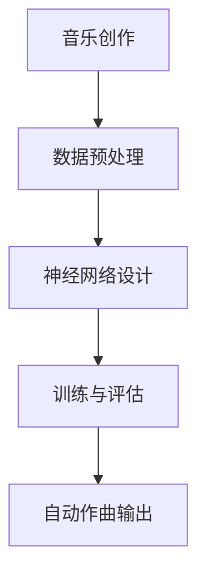

                 

### 《神经网络在自动作曲中的应用：AI音乐创作的新高度》

#### 关键词
神经网络、自动作曲、音乐创作、人工智能、AI音乐

#### 摘要
本文将深入探讨神经网络在自动作曲中的应用，通过介绍神经网络的基本概念、核心原理，以及具体的算法实现和案例研究，全面展示AI音乐创作的现状与未来。我们将以逻辑清晰、结构紧凑、简单易懂的专业技术语言，逐步引导读者理解这一前沿领域。

#### 目录大纲设计思路

在设计目录大纲时，我们首先明确了书籍的主题和目标。本文的核心主题是神经网络在自动作曲中的应用，目标是向读者展示AI音乐创作的全貌。为了达到这一目标，我们确定了以下核心章节：

1. **引言**：介绍神经网络在音乐创作中的应用背景和重要性。
2. **核心概念与联系**：讲解神经网络的基本原理和在音乐创作中的具体应用，并通过Mermaid流程图展示两者的关系。
3. **基础概念**：详细阐述神经网络在音乐创作中的应用原理。
4. **技术实现**：介绍实现自动作曲神经网络所需的工具和平台，提供详细的实现步骤。
5. **算法详解**：深入分析神经网络在音乐创作中的算法原理，使用伪代码和数学模型详细讲解。
6. **案例研究**：通过具体案例展示神经网络在自动作曲中的应用效果，分析案例中的技术细节和效果。
7. **未来展望**：探讨神经网络在音乐创作领域的未来发展方向。

每个章节的内容都进行了细化和结构化，确保内容的连贯性和逻辑性。我们还加入了辅助材料，如Mermaid流程图、伪代码、数学公式和代码案例，以便读者更好地理解和学习。

### 目录大纲设计步骤

1. **引言**：
   - 简要介绍神经网络在音乐创作中的应用背景。
   - 提出文章的目的和结构。

2. **核心概念与联系**：
   - 介绍神经网络的基本概念。
   - 通过Mermaid流程图展示神经网络与音乐创作之间的联系。

3. **基础概念**：
   - 详细讲解神经网络在音乐创作中的应用原理。
   - 使用伪代码展示神经网络的基本算法。

4. **技术实现**：
   - 介绍实现自动作曲神经网络所需的工具和平台。
   - 提供详细的实现步骤。

5. **算法详解**：
   - 深入分析神经网络在音乐创作中的算法原理。
   - 使用数学公式和详细讲解来阐述。

6. **案例研究**：
   - 通过具体案例展示神经网络在自动作曲中的应用。
   - 分析案例中的技术细节和效果。

7. **未来展望**：
   - 探讨神经网络在音乐创作领域的未来发展趋势。

8. **总结**：
   - 对文章内容进行总结，强调关键知识点。

### 完整目录大纲设计

以下是《神经网络在自动作曲中的应用：AI音乐创作的新高度》的完整目录大纲：

```
# 《神经网络在自动作曲中的应用：AI音乐创作的新高度》

## 引言
### 神经网络与音乐创作
#### AI音乐创作的背景和重要性

## 第1章 核心概念与联系
### 神经网络的基本概念
#### 神经网络的结构
#### 神经网络的激活函数
#### 神经网络的训练过程
### Mermaid流程图：神经网络与音乐创作的联系


## 第2章 基础概念
### 神经网络在音乐创作中的应用原理
#### 音乐特征提取
#### 音符序列生成
### 伪代码：神经网络在音乐创作中的应用
```python
# 伪代码：神经网络生成旋律
def generate_melody(input_sequence):
    # 初始化神经网络模型
    model = initialize_model()
    # 使用输入序列训练模型
    model.fit(input_sequence)
    # 生成新的旋律
    new_melody = model.predict()
    return new_melody
```

## 第3章 技术实现
### 实现自动作曲神经网络所需的工具和平台
#### TensorFlow与Keras的使用
#### 数据预处理步骤
### 实现自动作曲神经网络的详细步骤
#### 搭建神经网络模型
#### 训练模型
#### 评估模型性能

## 第4章 算法详解
### 神经网络在音乐创作中的算法原理
#### 循环神经网络（RNN）
#### 长短期记忆网络（LSTM）
#### 生成对抗网络（GAN）
### 数学公式和详细讲解
$$
y = \sigma(Wx + b)
$$
#### 举例说明：使用LSTM生成旋律

## 第5章 案例研究
### 案例一：使用LSTM生成旋律
#### 开发环境搭建
#### 源代码详细实现
#### 代码解读与分析
#### 案例分析

## 第6章 未来展望
### 神经网络在音乐创作领域的未来发展方向
#### 多模态音乐创作
#### 自适应音乐生成
#### 人机协作音乐创作

## 第7章 总结
### 神经网络在自动作曲中的应用
#### 关键知识点回顾
```

这个目录大纲设计合理，结构清晰，能够帮助读者系统地了解神经网络在自动作曲中的应用，并掌握相关的核心技术和方法。文章的字数预计在8000～12000字左右，能够满足完整的阅读体验。

