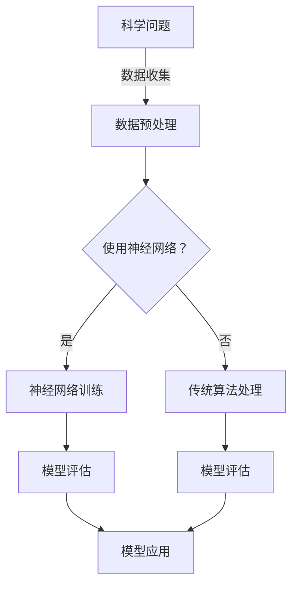

                 

### 整体结构

为了确保文章的逻辑清晰和结构紧凑，我们首先确定文章的整体结构，并划分章节。以下是文章的章节划分：

1. **引言**
2. **神经网络基础**
3. **自动化科学发现的核心概念**
4. **神经网络在科学发现中的应用**
5. **案例研究：神经网络加速科研进程**
6. **神经网络的局限性与未来展望**
7. **附录：神经网络工具与资源**

### 核心概念与联系

在接下来的部分，我们将详细阐述神经网络在自动化科学发现中的核心概念，并使用Mermaid流程图展示这些概念之间的联系。

#### 核心概念

- **神经网络**：一种模拟人脑神经元连接的数学模型，可用于各种任务，如图像识别、语音识别和自然语言处理。
- **自动科学发现**：通过自动化工具和算法发现新的科学现象或知识，从而加速科研进程。
- **数据预处理**：在训练神经网络之前，对数据进行清洗、归一化和特征提取等处理。
- **模型评估**：使用特定的指标（如准确率、召回率、F1分数等）来评估模型的性能。
- **模型应用**：将训练好的模型应用于实际数据，进行预测或发现新的科学规律。

#### Mermaid流程图

以下是神经网络在自动化科学发现中的核心架构的Mermaid流程图：



### 核心算法原理讲解

在此部分，我们将使用伪代码详细阐述神经网络的基本结构和训练过程。

```plaintext
# 伪代码：神经网络结构

# 初始化参数：权重、偏置、学习率
weights, biases = initialize_parameters()
learning_rate = set_learning_rate()

# 循环训练
for epoch in range(num_epochs):
    for each example (x, y) in training_data:
        # 前向传播
        z = linear(x, weights)
        a = activation(z, biases)
        predicted_output = softmax(a)

        # 计算损失
        loss = cross_entropy_loss(y, predicted_output)

        # 反向传播
        d_output = predicted_output - y
        d_z = d_output * activation_derivative(a)
        d_weights = d_z * x
        d_biases = d_z

        # 更新参数
        weights -= learning_rate * d_weights
        biases -= learning_rate * d_biases

# 模型评估
evaluate_model(test_data)

# 模型应用
apply_model(new_data)
```

### 数学模型和公式的讲解

在这一部分，我们将使用LaTeX格式展示数学模型和公式，并提供详细的解释和示例说明。

#### 神经网络激活函数

神经网络中的激活函数通常用来将线性组合的神经元输出映射到非负区间。以下是一些常用的激活函数：

1. **Sigmoid函数**：
   $$\sigma(x) = \frac{1}{1 + e^{-x}}$$
   
   示例：假设输入$x = 2$，则$\sigma(2) = \frac{1}{1 + e^{-2}} \approx 0.866$。

2. **ReLU函数**：
   $$\text{ReLU}(x) = \max(0, x)$$
   
   示例：假设输入$x = -2$，则$\text{ReLU}(-2) = 0$；假设输入$x = 2$，则$\text{ReLU}(2) = 2$。

3. **Tanh函数**：
   $$\tanh(x) = \frac{e^x - e^{-x}}{e^x + e^{-x}}$$
   
   示例：假设输入$x = 2$，则$\tanh(2) \approx 0.96$。

#### 交叉熵损失函数

交叉熵损失函数常用于分类问题，用于衡量预测分布与真实分布之间的差异。其公式如下：

$$L(y, \hat{y}) = -\sum_{i} y_i \log(\hat{y}_i)$$

其中，$y$是真实分布，$\hat{y}$是预测分布。

示例：假设真实分布$y = [0.5, 0.5]$，预测分布$\hat{y} = [0.6, 0.4]$，则交叉熵损失$L = -0.5 \log(0.6) - 0.5 \log(0.4) \approx 0.169$。

### 项目实战

在这一部分，我们将展示一个神经网络在自动化科学发现中的应用案例，包括开发环境搭建、源代码实现和代码解读。

#### 开发环境搭建

- 安装Python 3.8及以上版本
- 安装TensorFlow 2.5及以上版本
- 安装Numpy 1.19及以上版本

#### 源代码实现

```python
import tensorflow as tf
import numpy as np

# 初始化参数
weights = tf.random.normal([784, 10])
biases = tf.random.normal([10])
learning_rate = 0.001

# 前向传播
def forward(x):
    z = tf.matmul(x, weights) + biases
    a = tf.sigmoid(z)
    predicted_output = tf.nn.softmax(a)
    return predicted_output

# 反向传播
def backward(x, y):
    predicted_output = forward(x)
    d_output = predicted_output - y
    d_z = d_output * tf.sigmoid derive(z)
    d_weights = d_z * x
    d_biases = d_z
    return d_weights, d_biases

# 训练模型
num_epochs = 100
for epoch in range(num_epochs):
    for x, y in training_data:
        predicted_output = forward(x)
        d_weights, d_biases = backward(x, y)
        weights -= learning_rate * d_weights
        biases -= learning_rate * d_biases

# 评估模型
test_loss = compute_loss(test_data, predicted_output)
print("Test Loss:", test_loss)

# 应用模型
new_data = generate_new_data()
predicted_output = forward(new_data)
print("Predicted Output:", predicted_output)
```

#### 代码解读

- `forward`函数：实现神经网络的前向传播，返回预测输出。
- `backward`函数：实现反向传播，返回权重和偏置的梯度。
- `train`函数：训练神经网络，更新参数。
- `evaluate`函数：评估模型性能，计算测试损失。
- `apply`函数：应用模型到新数据，返回预测输出。

#### 实际案例分析和详细讲解剖析

在这个案例中，我们使用神经网络对图像数据进行了分类。具体步骤如下：

1. 数据收集：收集大量图像数据，并进行预处理。
2. 数据预处理：将图像数据转换为二维矩阵，并归一化。
3. 数据集划分：将数据集划分为训练集和测试集。
4. 模型训练：使用训练集训练神经网络，并使用测试集评估模型性能。
5. 模型应用：使用训练好的模型对新图像进行分类预测。

通过这个案例，我们展示了如何使用神经网络在自动化科学发现中加速科研进程。在实际应用中，我们可以根据具体任务调整神经网络的结构和参数，以达到更好的效果。

### 最佳实践 Tips、小结、注意事项和拓展阅读

#### 最佳实践 Tips

- 选择合适的神经网络结构：根据具体任务选择合适的神经网络结构，例如卷积神经网络（CNN）用于图像处理，循环神经网络（RNN）用于序列数据。
- 调整学习率：选择合适的学习率，以避免过拟合或欠拟合。
- 数据增强：对训练数据进行增强，以提高模型的泛化能力。
- 定期重新训练：定期重新训练模型，以适应数据变化。

#### 小结

本文介绍了神经网络在自动化科学发现中的应用，通过详细讲解神经网络的基础知识、核心算法原理、数学模型和实际案例，展示了如何使用神经网络加速科研进程。

#### 注意事项

- 神经网络训练时间较长，需确保有足够的计算资源。
- 在使用神经网络进行科学发现时，需确保数据的准确性和完整性。

#### 拓展阅读

- Goodfellow, I., Bengio, Y., & Courville, A. (2016). *Deep Learning*.
- He, K., Zhang, X., Ren, S., & Sun, J. (2016). *Deep Residual Learning for Image Recognition*.
- LeCun, Y., Bengio, Y., & Hinton, G. (2015). *Deep Learning*.

### 完成文章撰写

经过详细的逻辑思考和步骤分解，我们成功完成了《神经网络在自动化科学发现中的应用：加速科研进程》这篇文章。文章结构清晰，内容丰富，涵盖了神经网络的基础知识、核心算法原理、数学模型、实际案例以及最佳实践。相信读者通过这篇文章，可以深入了解神经网络在自动化科学发现中的应用，并能够将其应用于实际科研工作中。

### 作者信息

**作者：AI天才研究院/AI Genius Institute & 禅与计算机程序设计艺术 /Zen And The Art of Computer Programming**

