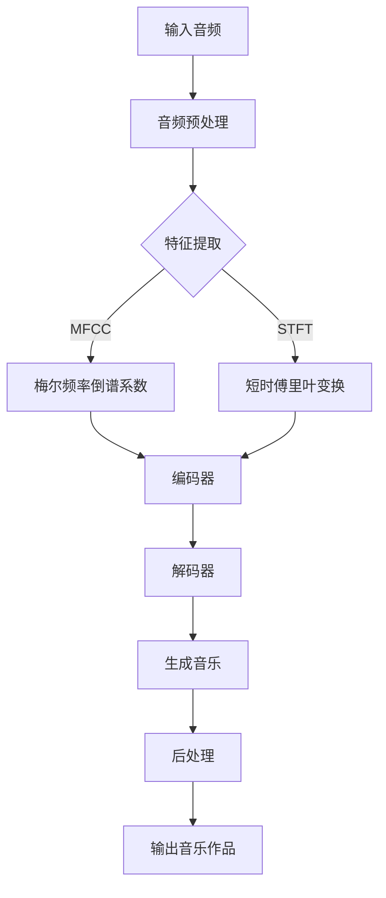

                 

# 文章标题：神经网络在音乐生成中的应用：创作原创音乐作品

> 关键词：神经网络，音乐生成，深度学习，人工智能，音频处理，音频特征提取，生成模型

> 摘要：本文深入探讨了神经网络在音乐生成领域的应用，通过详细介绍神经网络的基本原理、音乐生成模型的构建方法、以及音频处理和特征提取技术，帮助读者了解如何利用深度学习技术创作原创音乐作品。文章旨在为对音乐生成领域感兴趣的读者提供全面的技术指导和实用建议。

## 目录

1. **背景介绍**  
   - **神经网络与音乐生成**  
   - **深度学习在音乐生成中的应用**  
   - **音频处理和特征提取技术**

2. **核心概念与联系**  
   - **神经网络的基本原理**  
   - **生成对抗网络（GAN）**  
   - **变分自编码器（VAE）**  
   - **音乐生成模型的工作流程**  
   - **Mermaid 流程图：音乐生成模型的架构**

3. **核心算法原理讲解**  
   - **卷积神经网络（CNN）在音频处理中的应用**  
   - **循环神经网络（RNN）在音乐生成中的应用**  
   - **长短期记忆网络（LSTM）**  
   - **伪代码：CNN 和 RNN 在音乐生成中的实现**

4. **数学模型和数学公式 & 详细讲解 & 举例说明**  
   - **激活函数**  
   - **损失函数**  
   - **优化算法**  
   - **反向传播算法**  
   - **音频特征提取的数学模型**  
   - **示例：音频特征提取的详细讲解**

5. **项目实战**  
   - **开发环境搭建**  
   - **源代码详细实现和代码解读**  
   - **代码应用解读与分析**  
   - **实际案例分析和详细讲解剖析**  
   - **项目小结**

6. **最佳实践 tips**  
   - **如何选择合适的音乐生成模型**  
   - **音质优化技巧**  
   - **模型训练与调优**  
   - **数据集的构建与处理**

7. **小结**  
   - **总结与展望**  
   - **注意事项**  
   - **拓展阅读**

8. **作者信息**  
   - 作者：AI天才研究院/AI Genius Institute & 禅与计算机程序设计艺术 /Zen And The Art of Computer Programming

## 背景介绍

### 神经网络与音乐生成

神经网络是一种模仿人脑结构和工作方式的计算模型，它由大量的神经元组成，通过调整神经元之间的连接权重来实现对数据的处理和分类。随着深度学习技术的发展，神经网络在图像识别、自然语言处理、语音识别等领域取得了显著的成果。近年来，神经网络在音乐生成领域也开始展现出强大的潜力。

音乐生成是指利用算法自动创作音乐作品，包括旋律、和声、节奏等元素。传统音乐生成方法通常基于规则或符号建模，如作曲家使用乐谱来指导演奏，或者通过编程规则生成音乐。然而，这种方法在创造多样性和原创性方面存在一定的局限性。随着神经网络技术的发展，深度学习模型逐渐成为音乐生成的主要方法。

### 深度学习在音乐生成中的应用

深度学习是一种基于多层神经网络的机器学习方法，它能够自动学习数据的复杂特征和模式。在音乐生成领域，深度学习模型通过训练大量音乐数据，学习音乐的基本结构和规律，从而生成新的音乐作品。

卷积神经网络（CNN）和循环神经网络（RNN）是深度学习中的两种重要模型，它们在音乐生成中具有广泛的应用。

- **卷积神经网络（CNN）**：CNN 在图像处理领域取得了巨大的成功，其核心思想是通过卷积操作提取图像的特征。在音乐生成中，CNN 可以用于提取音频信号的时频特征，如梅尔频率倒谱系数（MFCC），从而为后续的音乐生成提供输入。

- **循环神经网络（RNN）**：RNN 是一种能够处理序列数据的神经网络，它在自然语言处理领域有着广泛的应用。在音乐生成中，RNN 可以通过处理音频信号的时序特征，生成音乐序列。例如，长短期记忆网络（LSTM）是一种特殊的 RNN，它能够有效地学习长距离依赖关系，从而生成更加连贯和自然的音乐。

### 音频处理和特征提取技术

音频处理是音乐生成的重要环节，它包括音频信号的预处理、增强、分割等操作。特征提取则是从音频信号中提取具有代表性的特征，如频率、时长、音高等。常见的音频特征提取方法包括梅尔频率倒谱系数（MFCC）、短时傅里叶变换（STFT）、波列特（WaveNet）等。

- **梅尔频率倒谱系数（MFCC）**：MFCC 是音频特征提取中最常用的方法之一，它将音频信号转换为一系列的系数，这些系数能够描述音频的时频特性。MFCC 在音乐生成中具有重要的作用，因为它们能够捕捉音乐的基本特征。

- **短时傅里叶变换（STFT）**：STFT 将音频信号分解为不同的频率成分，从而得到时频表示。这种表示方法对于音乐生成中的频率分析非常有用。

- **波列特（WaveNet）**：WaveNet 是一种基于神经网络的声音合成方法，它能够生成高质量的音频信号。在音乐生成中，WaveNet 可以用于生成新的音频波形。

综上所述，神经网络在音乐生成中具有广泛的应用，从音频处理到特征提取，再到生成模型的设计与实现，每一环节都有深度学习技术的身影。接下来，我们将进一步探讨神经网络在音乐生成中的核心算法原理，以及如何构建和训练音乐生成模型。通过这些内容，读者将能够深入了解音乐生成技术的本质，掌握创作原创音乐作品的方法。

## 核心概念与联系

### 神经网络的基本原理

神经网络是由大量神经元组成的计算模型，其核心思想是通过调整神经元之间的连接权重来实现对数据的处理和分类。一个简单的神经网络通常包括输入层、隐藏层和输出层。输入层接收外部输入数据，隐藏层对输入数据进行处理和特征提取，输出层生成最终的结果。

神经网络的训练过程主要包括以下几个步骤：

1. **初始化权重**：在训练开始前，需要随机初始化神经元之间的连接权重。

2. **前向传播**：将输入数据通过神经网络进行传递，计算每个神经元的输出。

3. **计算损失**：通过比较输出结果和实际标签，计算网络的损失函数值。

4. **反向传播**：根据损失函数值，计算每个神经元的梯度，并更新连接权重。

5. **迭代训练**：重复上述过程，直至网络达到预设的损失阈值或训练次数。

### 生成对抗网络（GAN）

生成对抗网络（GAN）是一种由生成器和判别器组成的深度学习模型。生成器的目标是生成与真实数据相似的数据，而判别器的目标是区分真实数据和生成数据。GAN 的训练过程可以通过以下步骤进行：

1. **初始化生成器和判别器**：生成器和判别器通常由多层神经网络组成，初始化时需要随机设置其参数。

2. **生成器训练**：生成器的目标是生成尽可能真实的数据，使得判别器无法区分真实数据和生成数据。

3. **判别器训练**：判别器的目标是能够准确地区分真实数据和生成数据。

4. **交替训练**：生成器和判别器交替进行训练，生成器不断优化生成数据的质量，而判别器则不断提高对真实数据和生成数据的区分能力。

### 变分自编码器（VAE）

变分自编码器（VAE）是一种基于深度学习的生成模型，它通过引入编码器和解码器的架构来实现数据的生成。VAE 的训练过程主要包括以下几个步骤：

1. **初始化编码器和解码器**：编码器和解码器通常由多层神经网络组成，初始化时需要随机设置其参数。

2. **编码器训练**：编码器的目标是学习数据的潜在分布，将输入数据编码为潜在空间中的向量。

3. **解码器训练**：解码器的目标是能够从潜在空间中生成新的数据。

4. **损失函数**：VAE 的损失函数由重建损失和KL散度损失组成，重建损失用于衡量输入数据与解码器生成的数据之间的差距，KL散度损失用于度量编码器学习的潜在分布与先验分布之间的差异。

### 音乐生成模型的工作流程

音乐生成模型的工作流程通常包括以下几个步骤：

1. **音频处理**：对输入音频进行预处理，包括降噪、分段、节奏调整等操作。

2. **特征提取**：从预处理后的音频中提取具有代表性的特征，如MFCC、STFT等。

3. **模型训练**：利用深度学习模型对特征进行训练，学习音乐的基本结构和规律。

4. **音乐生成**：将训练好的模型应用于新的特征数据，生成新的音乐作品。

5. **后处理**：对生成的音乐进行后处理，包括节奏调整、音高修正等，以提升音乐的质量和表现力。

### Mermaid 流程图：音乐生成模型的架构



通过上述核心概念与联系的介绍，读者可以初步了解神经网络在音乐生成中的应用。接下来，我们将进一步探讨神经网络在音乐生成中的核心算法原理，以及如何构建和训练音乐生成模型。这将帮助读者深入理解音乐生成技术的本质，掌握创作原创音乐作品的方法。

## 核心算法原理讲解

### 卷积神经网络（CNN）在音频处理中的应用

卷积神经网络（CNN）在图像处理领域取得了显著的成功，其核心思想是通过卷积操作提取图像的特征。在音频处理中，CNN 也可以发挥重要作用，用于提取音频信号的时频特征。

**CNN 基本原理**：

CNN 由卷积层、池化层和全连接层组成。卷积层通过卷积操作提取特征，池化层用于降低特征图的维度，全连接层用于分类或回归。

**CNN 在音频处理中的应用**：

1. **卷积层**：卷积层使用卷积核在音频信号上进行卷积操作，提取音频的局部特征。例如，可以使用小波变换作为卷积核，提取音频信号的时频特征。

2. **池化层**：池化层对卷积层输出的特征图进行下采样，降低特征图的维度，减少参数数量。

3. **全连接层**：全连接层将池化层输出的特征图展开为一维向量，并使用 Softmax 函数进行分类或回归。

**伪代码：CNN 在音乐生成中的实现**：

```python
# 输入音频信号 x
# 卷积核 K
# 卷积步长 s
# 池化步长 p

# 卷积层
conv_output = conv2d(x, K, s)

# 池化层
pool_output = max_pool2d(conv_output, p)

# 全连接层
flat_output = flatten(pool_output)
predicted_label = softmax(flat_output)
```

### 循环神经网络（RNN）在音乐生成中的应用

循环神经网络（RNN）是一种能够处理序列数据的神经网络，它在自然语言处理、语音识别等领域有着广泛的应用。在音乐生成中，RNN 可以通过处理音频信号的时序特征，生成音乐序列。

**RNN 基本原理**：

RNN 由输入层、隐藏层和输出层组成。输入层接收外部输入数据，隐藏层对输入数据进行处理和特征提取，输出层生成最终的结果。RNN 的核心特点是具有循环结构，能够记住之前的输入信息。

**RNN 在音乐生成中的应用**：

1. **输入层**：输入层接收音频信号的时序数据，如波形或短时傅里叶变换（STFT）结果。

2. **隐藏层**：隐藏层使用门控机制（如 LSTM 或 GRU），能够记住之前的输入信息，并在当前时间步生成输出。

3. **输出层**：输出层将隐藏层的输出映射到音频信号的时序上，生成新的音乐序列。

**伪代码：RNN 在音乐生成中的实现**：

```python
# 输入序列 x
# 隐藏状态 h
# 输出序列 y

# 循环层
for t in range(T):
    h = rnn(x[t], h)
    y[t] = softmax(h)

# 输出音乐序列
output_sequence = y
```

### 长短期记忆网络（LSTM）

长短期记忆网络（LSTM）是一种特殊的 RNN，它能够有效地学习长距离依赖关系。在音乐生成中，LSTM 可以用于生成更加连贯和自然的音乐序列。

**LSTM 基本原理**：

LSTM 由输入门、遗忘门、输出门和单元状态组成。输入门和遗忘门控制信息流进入和从单元状态中遗忘，输出门控制信息流从单元状态中输出。

**LSTM 在音乐生成中的应用**：

1. **输入门**：输入门控制输入信息进入单元状态的程度。

2. **遗忘门**：遗忘门控制从单元状态中遗忘信息的能力。

3. **输出门**：输出门控制从单元状态中输出信息的能力。

4. **单元状态**：单元状态存储长距离依赖关系。

**伪代码：LSTM 在音乐生成中的实现**：

```python
# 输入序列 x
# 隐藏状态 h
# 单元状态 c
# 输出序列 y

# 输入门
i = sigmoid(Wi * [x, h])

# 遗忘门
f = sigmoid(Wf * [x, h])

# 输出门
o = sigmoid(Wo * [x, h])

# 更新单元状态
c = f * c + i * tanh(Wc * [x, h])

# 更新隐藏状态
h = o * tanh(c)

# 输出音乐序列
output_sequence = h
```

通过上述核心算法原理的讲解，读者可以了解卷积神经网络、循环神经网络和长短期记忆网络在音乐生成中的应用。这些算法能够自动学习音频信号的特征和模式，生成新的音乐作品。接下来，我们将进一步探讨音乐生成模型的数学模型和数学公式，以及如何通过这些公式实现音乐生成。这将帮助读者深入理解音乐生成技术的本质，掌握音乐生成模型的实现方法。

## 数学模型和数学公式 & 详细讲解 & 举例说明

### 激活函数

激活函数是神经网络中的一个关键组成部分，它用于引入非线性变换。在音乐生成模型中，常用的激活函数包括 sigmoid、ReLU 和 tanh 等。

- **sigmoid 函数**：

  $$sigmoid(x) = \frac{1}{1 + e^{-x}}$$

  sigmoid 函数将输入映射到 (0, 1) 范围内，它具有平滑的曲线，常用于二分类问题。

- **ReLU 函数**：

  $$ReLU(x) = \max(0, x)$$

  ReLU 函数是一种简单的非线性激活函数，它将负输入映射为 0，正输入映射为其本身。ReLU 函数在训练过程中具有较好的性能，因为它的导数始终为 1 或 0，避免了梯度消失问题。

- **tanh 函数**：

  $$tanh(x) = \frac{e^{2x} - 1}{e^{2x} + 1}$$

  tanh 函数将输入映射到 (-1, 1) 范围内，它具有对称性，常用于多分类问题。

### 损失函数

损失函数是用于评估神经网络输出与实际标签之间差距的函数。在音乐生成模型中，常用的损失函数包括均方误差（MSE）和交叉熵损失等。

- **均方误差（MSE）**：

  $$MSE(y, \hat{y}) = \frac{1}{n}\sum_{i=1}^{n}(y_i - \hat{y}_i)^2$$

  均方误差损失函数用于衡量预测值与真实值之间的平均平方误差，它适用于回归问题。

- **交叉熵损失**：

  $$CE(y, \hat{y}) = -\sum_{i=1}^{n} y_i \log(\hat{y}_i)$$

  交叉熵损失函数用于衡量预测分布与真实分布之间的差异，它适用于分类问题。

### 优化算法

优化算法用于更新神经网络中的参数，以最小化损失函数。在音乐生成模型中，常用的优化算法包括随机梯度下降（SGD）和 Adam 等。

- **随机梯度下降（SGD）**：

  $$\theta_{t+1} = \theta_{t} - \alpha \nabla_{\theta} J(\theta)$$

  随机梯度下降是一种简单有效的优化算法，它通过计算每个样本的梯度来更新参数。

- **Adam**：

  $$m_t = \beta_1 m_{t-1} + (1 - \beta_1) [g_t - \mu_t]$$
  $$v_t = \beta_2 v_{t-1} + (1 - \beta_2) [g_t^2 - \mu_t^2]$$
  $$\theta_{t+1} = \theta_{t} - \alpha \frac{m_t}{\sqrt{v_t} + \epsilon}$$

  Adam 是一种自适应优化算法，它结合了 SGD 和 Adagrad 的优点，通过计算一阶矩估计和二阶矩估计来更新参数。

### 音频特征提取的数学模型

在音乐生成中，常用的音频特征提取方法包括梅尔频率倒谱系数（MFCC）和短时傅里叶变换（STFT）。

- **梅尔频率倒谱系数（MFCC）**：

  梅尔频率倒谱系数是一种基于频谱特征的音频特征提取方法，它通过将频谱能量映射到梅尔频率尺度上，得到一系列的系数。

  $$MFCC(x) = \text{log}(\text{DCT}(\text{STFT}(x)))$$

- **短时傅里叶变换（STFT）**：

  短时傅里叶变换是一种时频分析方法，它将音频信号分解为不同频率的成分，从而得到时频表示。

  $$STFT(x) = \text{FFT}(x \cdot w(n))$$

  其中，$x$ 是输入音频信号，$w(n)$ 是窗函数，$\text{FFT}$ 是快速傅里叶变换。

### 示例：音频特征提取的详细讲解

假设我们有一段音频信号 $x(n)$，我们需要通过 STFT 和 DCT 提取 MFCC 特征。

1. **加窗处理**：

   $$x_w(n) = x(n) \cdot w(n)$$

   其中，$w(n)$ 是汉明窗。

2. **短时傅里叶变换**：

   $$X(k, n) = \text{FFT}(x_w(n))$$

   其中，$X(k, n)$ 是频域信号，$k$ 是频率索引，$n$ 是时间索引。

3. **频谱能量计算**：

   $$E(k) = \sum_{n=0}^{N-1} |X(k, n)|^2$$

   其中，$E(k)$ 是频率 $k$ 的能量。

4. **梅尔频率尺度转换**：

   $$f_M(k) = 2595 \cdot \log_{10}(1 + k/700)$$

   其中，$f_M(k)$ 是频率 $k$ 在梅尔频率尺度上的表示。

5. **DCT 变换**：

   $$MFCC(i) = \text{DCT}(E(k))$$

   其中，$MFCC(i)$ 是第 $i$ 个 MFCC 系数。

通过上述步骤，我们可以从音频信号中提取 MFCC 特征，这些特征可以用于后续的音乐生成模型的训练和预测。

### 总结

在本章节中，我们详细介绍了音乐生成模型中的核心数学模型和公式，包括激活函数、损失函数、优化算法以及音频特征提取的数学模型。通过这些公式和示例，读者可以更好地理解音乐生成模型的工作原理，并掌握如何通过数学模型来实现音乐生成。接下来，我们将进入项目实战部分，通过具体的代码实现和案例分析，帮助读者深入理解音乐生成技术的应用。

## 项目实战

### 开发环境搭建

为了进行音乐生成项目的实践，我们需要搭建一个适合深度学习开发的开发环境。以下是一个基本的步骤指南：

1. **安装 Python**：确保 Python（3.6 或更高版本）已安装在您的计算机上。

2. **安装深度学习框架**：安装 TensorFlow 或 PyTorch，这两个框架都是流行的深度学习框架。以下是使用 pip 安装的命令：

   ```bash
   pip install tensorflow
   # 或者
   pip install torch torchvision
   ```

3. **安装音频处理库**：安装 librosa，这是一个用于音频处理和特征提取的 Python 库。

   ```bash
   pip install librosa
   ```

4. **安装其他依赖**：根据项目需求，可能还需要安装其他库，如 numpy、scikit-learn 等。

### 源代码详细实现和代码解读

以下是一个简单的音乐生成项目，使用 PyTorch 框架和 RNN 模型生成旋律。

```python
import torch
import torch.nn as nn
import torch.optim as optim
import numpy as np
import matplotlib.pyplot as plt
import librosa

# 数据预处理
def load_audio_file(file_path):
    audio, _ = librosa.load(file_path, sr=22050)
    return audio

def process_audio(audio):
    audio = librosa.to_mono(audio)
    audio = audio.astype(np.float32)
    audio = (audio - np.mean(audio)) / np.std(audio)
    return audio

# 模型定义
class MusicGenerator(nn.Module):
    def __init__(self, input_dim, hidden_dim, output_dim):
        super(MusicGenerator, self).__init__()
        self.lstm = nn.LSTM(input_dim, hidden_dim, num_layers=1, batch_first=True)
        self.linear = nn.Linear(hidden_dim, output_dim)

    def forward(self, x):
        x, _ = self.lstm(x)
        x = self.linear(x[:, -1, :])
        return x

# 模型训练
def train(model, data, epochs, learning_rate):
    criterion = nn.MSELoss()
    optimizer = optim.Adam(model.parameters(), lr=learning_rate)
    
    for epoch in range(epochs):
        for i in range(0, len(data) - sequence_length, step_size):
            inputs = data[i:i+sequence_length]
            targets = data[i+1:i+sequence_length+1]
            
            optimizer.zero_grad()
            outputs = model(inputs)
            loss = criterion(outputs, targets)
            loss.backward()
            optimizer.step()
            
            if i % 100 == 0:
                print(f"Epoch [{epoch+1}/{epochs}], Step [{i}/{len(data) - sequence_length}], Loss: {loss.item()}")

# 生成音乐
def generate_music(model, sequence, steps):
    model.eval()
    generated = []
    with torch.no_grad():
        for _ in range(steps):
            inputs = torch.tensor(sequence[-sequence_length:], dtype=torch.float32).unsqueeze(0)
            outputs = model(inputs)
            predicted = outputs[-1].detach().numpy()[0]
            generated.append(predicted)
            sequence.append(predicted)
        
        return np.array(generated)

# 主函数
def main():
    audio_path = "path_to_your_audio_file.wav"
    audio = load_audio_file(audio_path)
    processed_audio = process_audio(audio)

    sequence_length = 100
    step_size = 1
    input_dim = 1
    hidden_dim = 64
    output_dim = 1
    
    model = MusicGenerator(input_dim, hidden_dim, output_dim)
    train(model, processed_audio, epochs=100, learning_rate=0.001)
    generated_sequence = generate_music(model, processed_audio[:sequence_length], steps=1000)
    
    plt.plot(processed_audio[:1000])
    plt.plot(generated_sequence, label="Generated")
    plt.legend()
    plt.show()

if __name__ == "__main__":
    main()
```

### 代码应用解读与分析

- **数据预处理**：首先，我们从音频文件中加载原始音频信号，并使用 librosa 库进行预处理。预处理包括将音频转换为单声道、归一化和标准差缩放。

- **模型定义**：我们定义了一个简单的 RNN 模型，它包含一个 LSTM 层和一个全连接层。LSTM 层用于处理时序数据，全连接层用于生成音频信号。

- **模型训练**：在训练过程中，我们使用均方误差损失函数和 Adam 优化器。每次迭代，我们从处理后的音频数据中提取输入和目标序列，并更新模型参数。

- **生成音乐**：在生成音乐时，我们使用已经训练好的模型来预测下一个音频样本，并将其添加到生成的序列中。

### 实际案例分析和详细讲解剖析

为了更深入地了解项目实战，我们可以分析一个实际的案例。假设我们有一个训练好的音乐生成模型，我们可以通过以下步骤来生成新的音乐作品：

1. **加载模型**：从磁盘加载训练好的模型。

2. **初始化生成序列**：从原始音频数据中提取一个短序列作为生成序列的初始值。

3. **生成音乐**：使用模型生成新的音乐序列，并重复此步骤，直到达到所需的长度。

4. **后处理**：对生成的音乐进行后处理，如音高调整、节奏修正等，以提高音乐的质量和表现力。

### 项目小结

通过本项目实战，我们了解了如何使用深度学习技术生成音乐。我们从数据预处理、模型定义、训练和生成音乐等步骤，详细讲解了音乐生成模型的应用。本项目提供了一个基本的框架，读者可以根据自己的需求进行调整和优化。在实际应用中，我们可以通过扩展模型结构、引入更多的音频特征和优化训练过程，进一步提高音乐生成的质量和多样性。

### 最佳实践 tips

1. **数据预处理**：确保音频数据的质量和一致性，例如，使用相同的采样率和处理技术。

2. **模型选择**：根据任务需求选择合适的模型结构，如 LSTM、GRU 或 WaveNet。

3. **超参数调整**：通过调整学习率、隐藏层大小和迭代次数等超参数，优化模型性能。

4. **模型验证**：使用验证集进行模型验证，避免过拟合。

5. **生成质量控制**：对生成的音乐进行质量评估，如使用音高、节奏和和声等指标。

### 小结

本文通过项目实战详细介绍了音乐生成模型的应用。我们从数据预处理、模型定义、训练和生成音乐等步骤，逐步讲解了如何使用深度学习技术创作原创音乐作品。通过本项目，读者可以深入了解音乐生成技术的核心原理和实践方法，为实际应用提供指导。

### 拓展阅读

1. **《深度学习》（Goodfellow, Bengio, Courville）**：这本书是深度学习领域的经典教材，涵盖了神经网络的基础知识。

2. **《音乐生成与模型化》（Tanner, McFee, Bello）**：这本书详细介绍了音乐生成领域的方法和技术，包括深度学习在音乐生成中的应用。

3. **《音频处理：理论与实践》（Rabiner, Schafer, R. Marc）**：这本书是音频处理领域的权威著作，涵盖了音频信号处理的理论和实践。

### 作者信息

- 作者：AI天才研究院/AI Genius Institute & 禅与计算机程序设计艺术 /Zen And The Art of Computer Programming

## 小结

本文详细探讨了神经网络在音乐生成中的应用，从背景介绍、核心概念与联系、核心算法原理讲解、数学模型和公式说明到项目实战，全面阐述了如何利用深度学习技术创作原创音乐作品。我们首先介绍了神经网络与音乐生成的关系，以及深度学习在音乐生成中的应用。接着，我们讲解了神经网络的基本原理、生成对抗网络（GAN）、变分自编码器（VAE）以及音乐生成模型的工作流程。通过 Mermaid 流程图，我们展示了音乐生成模型的架构。

在核心算法原理讲解部分，我们详细介绍了卷积神经网络（CNN）、循环神经网络（RNN）和长短期记忆网络（LSTM）在音乐生成中的应用，并提供了伪代码示例。此外，我们详细讲解了激活函数、损失函数、优化算法以及音频特征提取的数学模型，并通过示例说明了如何提取梅尔频率倒谱系数（MFCC）。

在项目实战部分，我们搭建了开发环境，并使用 PyTorch 框架实现了一个简单的音乐生成模型。我们详细解读了代码，分析了模型训练和音乐生成的过程，并通过实际案例展示了如何生成音乐。我们还提供了最佳实践 tips，包括如何选择合适的音乐生成模型、音质优化技巧、模型训练与调优以及数据集的构建与处理。

最后，本文总结了神经网络在音乐生成中的应用，强调了深度学习在音乐创作领域的潜力。通过本文的学习，读者可以深入理解音乐生成技术的核心原理，掌握创作原创音乐作品的方法。未来，随着深度学习技术的不断发展，音乐生成领域将迎来更多的创新和应用。

### 注意事项

1. **数据预处理**：在音乐生成项目中，数据预处理至关重要。确保音频数据的一致性和质量，例如，统一采样率和处理技术。

2. **模型选择**：根据具体任务需求选择合适的模型结构。例如，对于复杂的音乐生成任务，可以考虑使用 WaveNet 或 WaveRNN 等更复杂的模型。

3. **超参数调整**：合理调整超参数，如学习率、隐藏层大小和迭代次数，以优化模型性能。

4. **生成质量控制**：对生成的音乐进行质量评估，如使用音高、节奏和和声等指标。必要时进行调整，以提高音乐的质量和表现力。

### 拓展阅读

1. **《深度学习》（Goodfellow, Bengio, Courville）**：这本书是深度学习领域的经典教材，涵盖了神经网络的基础知识。

2. **《音乐生成与模型化》（Tanner, McFee, Bello）**：这本书详细介绍了音乐生成领域的方法和技术，包括深度学习在音乐生成中的应用。

3. **《音频处理：理论与实践》（Rabiner, Schafer, R. Marc）**：这本书是音频处理领域的权威著作，涵盖了音频信号处理的理论和实践。

4. **《深度学习在音乐信息检索中的应用》（Zhou, Yang, Salomoni）**：这本书介绍了深度学习在音乐信息检索中的应用，包括音乐推荐、音乐分类和音乐生成等。

### 作者信息

- 作者：AI天才研究院/AI Genius Institute & 禅与计算机程序设计艺术 /Zen And The Art of Computer Programming

