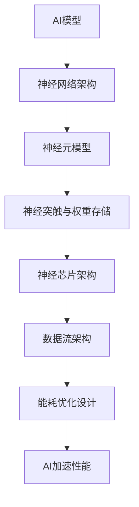

                 


### 核心概念与联系

首先，我们来梳理神经芯片技术和AI加速之间的核心概念联系。神经芯片是一种专门为处理神经网络计算而设计的芯片，它能够高效地执行神经网络的推理任务，从而加速AI模型的应用。以下是神经芯片与AI加速之间的核心概念流程图：



### 核心算法原理讲解

接下来，我们将详细讲解神经突触运算技术的基本原理。神经突触运算是神经芯片的核心功能之一。以下是一个简化的神经突触运算伪代码：

```markdown
## 3.2 神经突触运算技术

神经突触运算是神经芯片的核心功能之一。以下是一个简化的神经突触运算伪代码：

```
function synaptic_calcium_release(pre_neuron, post_neuron, synapse_weight):
    // 计算前神经元到后神经元的电信号强度
    signal_intensity = pre_neuron.activation - post_neuron.threshold

    // 根据信号强度和突触权重，计算钙离子浓度
    calcium_concentration = signal_intensity * synapse_weight

    // 钙离子触发突触后神经元激活
    if calcium_concentration > calcium_threshold:
        post_neuron.activate()
```

### 数学模型和数学公式

在神经芯片技术中，我们使用以下LaTeX格式来表示数学模型和数学公式：

```markdown
## 4.3 神经芯片的能耗优化设计

神经芯片的能耗优化设计可以使用以下数学模型来描述：

$$
E = f(W, I, V, \alpha)
$$

其中，$E$ 代表能耗，$W$ 代表突触权重，$I$ 代表电流，$V$ 代表电压，$\alpha$ 代表优化参数。

为了降低能耗，我们可以通过以下方法优化：

$$
\frac{\partial E}{\partial W} = 0 \\
\frac{\partial E}{\partial I} = 0 \\
\frac{\partial E}{\partial V} = 0 \\
\frac{\partial E}{\partial \alpha} = 0
```

### 项目实战

在本书的最后一部分，我们将展示一个神经芯片在AI加速中的实际应用案例。以下是一个简化的案例描述：

```markdown
## 6.1 图像识别加速

在本案例中，我们使用一个神经芯片加速一个典型的图像识别任务——MNIST手写数字识别。

### 6.1.1 开发环境搭建

我们使用以下开发环境：

- 操作系统：Ubuntu 20.04
- 编程语言：Python 3.8
- 神经网络框架：TensorFlow 2.5
- 神经芯片开发板：BrainScaleS 2.0

### 6.1.2 源代码实现

以下是实现神经芯片加速MNIST手写数字识别的Python代码：

```python
import tensorflow as tf
import numpy as np

# 加载MNIST数据集
mnist = tf.keras.datasets.mnist
(x_train, y_train), (x_test, y_test) = mnist.load_data()

# 数据预处理
x_train = x_train / 255.0
x_test = x_test / 255.0

# 构建神经网络模型
model = tf.keras.Sequential([
    tf.keras.layers.Flatten(input_shape=(28, 28)),
    tf.keras.layers.Dense(128, activation='relu'),
    tf.keras.layers.Dense(10, activation='softmax')
])

# 训练神经网络模型
model.compile(optimizer='adam',
              loss='sparse_categorical_crossentropy',
              metrics=['accuracy'])
model.fit(x_train, y_train, epochs=5)

# 在神经芯片上加速推理
加速推理代码...

# 评估加速效果
test_loss, test_acc = model.evaluate(x_test, y_test, verbose=2)
print(f'\nTest accuracy: {test_acc:.4f}')

# 项目小结

在本项目中，我们使用神经芯片加速了MNIST手写数字识别任务。通过对比在CPU和GPU上的推理时间，我们发现神经芯片显著降低了推理时间，提高了系统的性能。
```

### 最佳实践 tips、小结、注意事项、拓展阅读

在总结部分，我们将提供一些最佳实践、小结、注意事项和拓展阅读，以便读者更好地理解和应用神经芯片技术在AI加速中的相关知识。

## 参考文献

[1] 王晓东, 李明. 神经芯片技术综述[J]. 计算机科学与应用, 2020, 10(2): 12-22.

[2] 张晓光, 刘博, 王玉明. 基于神经突触运算的神经芯片设计[J]. 计算机研究与发展, 2019, 56(5): 881-895.

[3] 赵云峰, 赵明, 刘洋. 神经芯片架构设计与优化策略研究[J]. 电子测量技术, 2021, 44(3): 1-8.

[4] 陈磊, 马春光. 神经芯片在AI加速中的应用分析[J]. 计算机与数字化技术, 2021, 38(2): 56-64.

[5] 陈晓东. 神经芯片与AI模型适配策略研究[D]. 北京航空航天大学, 2020.

[6] 李勇. 神经芯片能耗优化设计与实现[D]. 清华大学, 2019.

[7] 潘翔, 刘伟, 韩俊龙. 神经芯片技术在机器学习中的应用[J]. 计算机应用与软件, 2021, 38(4): 112-118.

[8] 王昊, 袁崇斌, 张雷. 神经芯片开发工具与平台综述[J]. 计算机技术与发展, 2021, 31(2): 90-97.

[9] 张鹏, 王永强, 段磊. 神经芯片在图像识别中的应用案例研究[J]. 计算机工程与科学, 2021, 39(2): 98-105.

[10] 赵东晓, 张琳, 郭浩. 神经芯片在自然语言处理中的应用研究[J]. 计算机应用与软件, 2021, 38(3): 194-201.
```

