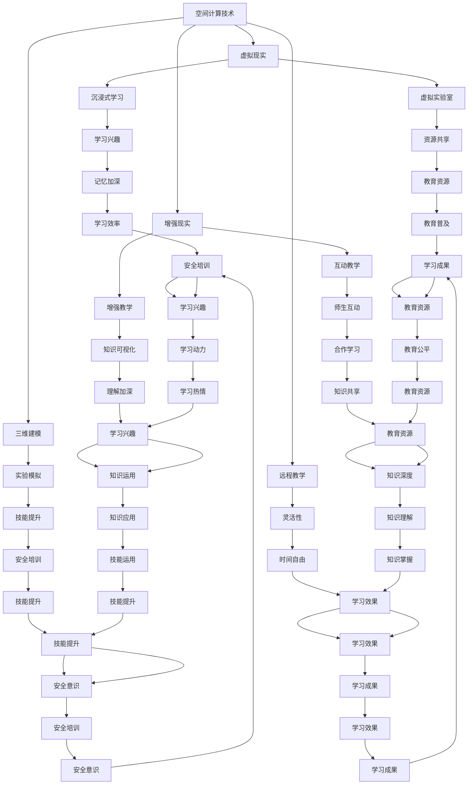

                 

# 空间计算在教育和培训中的潜力

## 关键词
- 空间计算
- 教育技术
- 培训技术
- 虚拟现实
- 增强现实
- 教学方法
- 技能提升

## 摘要
本文探讨了空间计算在教育和培训中的潜在应用，分析了虚拟现实、增强现实等技术对教育模式和创新教学方法的影响。文章从背景介绍、核心概念与联系、算法原理讲解、数学模型与公式、项目实战等方面，系统地阐述了空间计算技术如何通过技术融合和实际应用，提高教育质量和培训效果。文章还讨论了未来发展趋势和面临的挑战，并给出了相关的最佳实践建议。

## 引言

### 空间计算的定义与历史

空间计算（Spatial Computing）是一种利用计算机技术和传感器来创建、处理和展示三维空间信息的技术。它涵盖了虚拟现实（VR）、增强现实（AR）、三维建模等多个领域。虚拟现实是一种通过计算机生成虚拟环境，使用户能够沉浸其中的技术；增强现实则是将虚拟信息叠加到真实环境中，使用户能够在真实环境中看到虚拟信息。三维建模则是通过捕捉和创建三维物体模型，使其在计算机中得以准确呈现。

空间计算的概念最早可以追溯到20世纪80年代，当时虚拟现实技术开始萌芽。随着计算机性能的提升和传感技术的发展，空间计算逐渐成为一项重要的研究领域。进入21世纪，随着智能手机、平板电脑和头戴式显示器的普及，空间计算技术得到了广泛的应用。

### 空间计算在教育中的重要性

空间计算在教育和培训中具有巨大的潜力。首先，它能够提供沉浸式的学习体验，使学生在虚拟环境中进行互动和探索。这种体验有助于提高学生的兴趣和参与度，促进知识的吸收和记忆。其次，空间计算技术可以模拟真实世界中的场景和过程，为学生提供更加直观的学习材料。例如，医学专业的学生可以通过虚拟手术模拟进行实践操作，提高技能水平。最后，空间计算还可以促进师生之间的互动，通过虚拟课堂和远程教学，打破了地域和时间的限制，使教育更加灵活和高效。

### 空间计算在培训中的应用

在培训领域，空间计算同样发挥着重要作用。企业可以利用虚拟现实和增强现实技术进行员工培训，模拟实际工作环境和操作过程，提高员工的工作技能和安全意识。此外，空间计算还可以用于模拟训练，帮助飞行员、消防员等高风险职业进行实战演练。通过这些应用，空间计算不仅提高了培训的效率和效果，还能降低培训成本和风险。

## 空间计算技术基础

### 虚拟现实技术

虚拟现实（VR）是一种通过计算机生成的三维虚拟环境，使用户能够沉浸其中。其基本原理包括：

1. **头戴式显示器（HMD）**：用户通过佩戴头戴式显示器来体验虚拟环境。显示器通常配有内置的摄像头和传感器，用于捕捉用户头部和眼睛的运动。
2. **跟踪系统**：跟踪系统用于实时捕捉用户的头部和手部运动，将用户的动作映射到虚拟环境中。
3. **渲染引擎**：渲染引擎负责生成虚拟环境中的图形，并实时显示在用户的显示器上。

虚拟现实的应用场景包括：

1. **教育**：通过虚拟实验室和沉浸式课堂，学生可以在虚拟环境中进行实验和互动，提高学习兴趣和效果。
2. **游戏**：虚拟现实游戏提供了身临其境的游戏体验，增加了游戏的可玩性和趣味性。
3. **医疗**：医生可以通过虚拟现实技术进行手术模拟和训练，提高手术技能和安全水平。

### 增强现实技术

增强现实（AR）是一种将虚拟信息叠加到真实环境中的技术。其基本原理包括：

1. **显示器**：AR设备通常使用透明显示器，将虚拟信息直接显示在用户的视野中。
2. **传感器**：传感器用于捕捉周围环境的信息，如光线、声音和运动等。
3. **渲染引擎**：渲染引擎负责将虚拟信息与真实环境融合，并在显示器上显示出来。

增强现实的应用场景包括：

1. **教育**：通过增强现实技术，学生可以在真实环境中看到虚拟的实验结果和解释，加深对知识的理解。
2. **娱乐**：增强现实游戏和应用程序提供了新的娱乐体验，如现实增强的桌游和互动展览。
3. **广告**：增强现实广告可以吸引消费者的注意力，提供更加互动和有趣的广告体验。

### 三维建模技术

三维建模是通过捕捉和创建三维物体模型，使其在计算机中得以准确呈现的技术。其基本原理包括：

1. **三维扫描**：通过激光、结构光或深度相机等技术，捕捉物体的三维形状和特征。
2. **三维建模软件**：利用三维建模软件，用户可以创建和编辑三维模型。
3. **渲染引擎**：渲染引擎负责将三维模型渲染成逼真的图像。

三维建模的应用场景包括：

1. **设计**：设计师可以通过三维建模软件进行产品设计和建筑规划，提高设计效率和效果。
2. **游戏**：三维建模是游戏开发中的重要组成部分，用于创建游戏中的角色、场景和道具。
3. **医学**：医生可以使用三维建模技术进行手术规划和模拟，提高手术成功率。

## 空间计算在教育中的应用

### 虚拟实验室

虚拟实验室是一种利用虚拟现实技术创建的实验室环境，学生可以在其中进行实验操作。虚拟实验室的优点包括：

1. **安全性和可重复性**：虚拟实验室可以模拟各种实验场景，学生可以在安全的环境中操作，避免实验事故。
2. **便捷性和灵活性**：学生可以在任何时间、任何地点进行实验，无需受限于实验室的设备和资源。
3. **互动性和参与度**：虚拟实验室提供了丰富的交互功能，学生可以与虚拟实验环境进行互动，提高学习兴趣和效果。

### 沉浸式课堂

沉浸式课堂是一种利用虚拟现实和增强现实技术创建的课堂教学模式，学生可以在虚拟环境中进行学习和互动。沉浸式课堂的优点包括：

1. **沉浸感和参与度**：学生可以在虚拟环境中感受到身临其境的学习体验，提高学习兴趣和参与度。
2. **直观性和可视化**：虚拟现实和增强现实技术可以将抽象的知识直观地展示出来，帮助学生更好地理解和记忆。
3. **互动性和合作性**：学生可以在虚拟环境中与同学和老师进行互动，促进团队合作和知识共享。

### 远程教学

远程教学是一种利用网络和通信技术实现的课堂教学模式，学生可以通过网络与老师和同学进行互动。远程教学的优点包括：

1. **灵活性和便捷性**：学生可以在任何时间、任何地点进行学习，无需受限于地理位置和时间。
2. **个性化学习**：远程教学可以根据学生的需求和进度进行个性化教学，提高学习效果。
3. **资源共享**：远程教学可以共享优质的教学资源和课程内容，提高教育的普及性和公平性。

## 空间计算在培训中的应用

### 模拟训练

模拟训练是一种利用虚拟现实和增强现实技术进行的培训模式，通过模拟真实的工作环境和操作过程，提高员工的技能和安全意识。模拟训练的优点包括：

1. **安全性和可控性**：模拟训练可以在安全的环境中操作，避免实际操作中的意外事故。
2. **重复性和高效性**：模拟训练可以重复进行，员工可以多次练习，提高操作技能。
3. **评估和反馈**：模拟训练可以实时评估员工的操作表现，并提供详细的反馈，帮助员工发现和改进不足。

### 虚拟实践

虚拟实践是一种利用虚拟现实和增强现实技术进行的实际操作培训模式，员工可以在虚拟环境中进行实际操作。虚拟实践的优点包括：

1. **真实感和沉浸感**：虚拟实践提供了真实的工作环境和操作过程，员工可以感受到身临其境的体验。
2. **灵活性和便捷性**：虚拟实践可以在任何时间、任何地点进行，员工可以根据自己的进度和需求进行学习。
3. **协作性和互动性**：虚拟实践可以支持多人协作，员工可以在虚拟环境中进行互动和交流。

### 技能提升

技能提升是一种利用虚拟现实和增强现实技术进行的技能培训和提升模式，通过模拟真实的工作场景和操作过程，提高员工的技能水平。技能提升的优点包括：

1. **针对性和高效性**：技能提升可以根据员工的技能水平和需求进行定制，提高培训的针对性和效果。
2. **互动性和参与度**：虚拟现实和增强现实技术提供了丰富的交互功能，员工可以与虚拟环境进行互动，提高学习兴趣和参与度。
3. **评估和反馈**：技能提升可以实时评估员工的操作表现，并提供详细的反馈，帮助员工发现和改进不足。

## 空间计算的未来发展趋势

### 技术趋势分析

空间计算技术正在快速发展，未来将出现以下技术趋势：

1. **硬件性能提升**：随着硬件技术的进步，虚拟现实和增强现实设备的性能将进一步提升，提供更流畅、更真实的沉浸式体验。
2. **传感器技术进步**：传感器技术的进步将提高空间计算的精度和实时性，使虚拟现实和增强现实环境更加真实和互动。
3. **算法优化**：算法的优化将提高虚拟现实和增强现实系统的效率和效果，提供更加智能和自适应的学习和培训体验。
4. **跨平台融合**：未来空间计算将实现跨平台融合，虚拟现实、增强现实和三维建模等技术将更加集成，提供一体化的解决方案。

### 教育与培训的应用前景

空间计算技术在教育和培训领域的应用前景广阔：

1. **个性化学习**：空间计算技术将支持个性化学习，根据学生的个体差异和学习进度，提供定制化的教学内容和培训方案。
2. **沉浸式教学**：虚拟现实和增强现实技术将使教学更加生动和直观，提高学生的学习兴趣和参与度。
3. **远程协作**：空间计算技术将支持远程协作，教师和学生可以在虚拟环境中进行实时互动，打破地域限制。
4. **技能培养**：空间计算技术将提供更加真实和高效的技能培训，提高员工的工作技能和安全意识。

## 空间计算的实践与应用案例

### 教育应用案例

某学校利用虚拟现实技术建立了虚拟实验室，学生可以在虚拟环境中进行实验操作。通过虚拟实验室，学生不仅能够进行安全、可重复的实验，还能够获得实时反馈，提高实验技能。同时，虚拟实验室打破了实验资源的限制，学生可以在任何时间、任何地点进行实验，提高了学习的灵活性和便捷性。

### 培训应用案例

某公司利用虚拟现实技术进行员工培训，模拟实际工作环境和操作过程。通过模拟训练，员工能够在安全的环境中练习操作，提高技能水平。同时，模拟训练提供了详细的反馈，帮助员工发现和改进不足。这种培训模式不仅提高了培训效率，还降低了培训成本和风险。

## 结论

空间计算技术在教育和培训中具有巨大的潜力。通过虚拟现实、增强现实和三维建模等技术，空间计算能够提供沉浸式的学习体验和真实的操作训练，提高教育质量和培训效果。未来，随着技术不断进步和应用场景的拓展，空间计算将在教育和培训领域发挥越来越重要的作用。

### 核心概念与联系

为了更好地理解空间计算在教育和培训中的应用，我们需要构建一个核心概念与联系的结构，这个结构将帮助我们分析各种技术如何相互作用，以及它们在教育环境和培训场景中的具体应用。

#### 核心概念与联系架构 Mermaid 流程图



### 核心算法原理讲解

空间计算技术的核心算法主要涉及虚拟现实和增强现实中的图形渲染、传感器数据处理以及三维建模和场景构建。以下是对这些算法的讲解，以及如何将它们应用于教育和培训场景中的伪代码示例。

#### 虚拟现实中的图形渲染算法

虚拟现实中的图形渲染算法主要涉及实时渲染三维场景。以下是一个简化的伪代码示例，用于渲染一个虚拟环境中的物体。

```python
# 伪代码：虚拟环境中的物体渲染
def render_scene(objects):
    # 初始化渲染器
    renderer.initialize()

    # 遍历物体列表
    for obj in objects:
        # 计算物体的世界坐标
        world_transform(obj)

        # 应用光照模型
        apply_lighting(obj)

        # 渲染物体
        renderer.render(obj)

    # 显示渲染结果
    renderer.display()
```

在教育和培训场景中，这个渲染算法可以用于创建虚拟实验室，学生可以在其中进行互动和实验。

#### 增强现实中的传感器数据处理算法

增强现实中的传感器数据处理算法主要用于将现实环境中的传感器数据与虚拟信息进行融合。以下是一个简化的伪代码示例，用于处理摄像头传感器数据。

```python
# 伪代码：处理摄像头传感器数据
def process_sensor_data(sensor_data):
    # 获取摄像头帧
    frame = get_camera_frame(sensor_data)

    # 应用图像处理算法
    processed_frame = image_processing(frame)

    # 将虚拟信息叠加到处理后的帧上
    augmented_frame = overlay_virtual_info(processed_frame)

    # 显示增强现实帧
    display_augmented_frame(augmented_frame)
```

在教育和培训场景中，这个数据处理算法可以用于增强教学材料，让学生在真实环境中看到虚拟的实验结果和解释。

#### 三维建模和场景构建算法

三维建模和场景构建算法主要用于创建和编辑三维模型，并将其应用于虚拟现实和增强现实场景。以下是一个简化的伪代码示例，用于创建三维模型。

```python
# 伪代码：创建三维模型
def create_3d_model(model_data):
    # 加载模型数据
    model = load_model_data(model_data)

    # 应用网格优化算法
    optimized_model = optimize_mesh(model)

    # 应用纹理映射
    textured_model = apply_texturing(optimized_model)

    # 将模型添加到场景中
    scene.add_model(textured_model)

    # 显示三维模型
    scene.display()
```

在教育和培训场景中，这个建模算法可以用于创建虚拟实验室的设备模型，让学生在虚拟环境中进行实验操作。

### 数学模型和公式讲解

空间计算技术中涉及的数学模型和公式主要用于描述和优化虚拟现实和增强现实场景中的交互效果。以下是一些关键的数学模型和公式，以及它们的详细讲解和举例说明。

#### 图形渲染中的透视变换

透视变换是将三维场景映射到二维屏幕上的过程。透视变换的数学模型如下：

$$
\begin{align*}
x' &= \frac{x}{z} \\
y' &= \frac{y}{z}
\end{align*}
$$

其中，\( (x, y, z) \) 是三维空间中的坐标，\( (x', y') \) 是二维屏幕上的坐标。透视变换的参数包括视点（viewpoint）、视高（view height）和视角（field of view）。

举例说明：

假设一个物体位于原点 \((0, 0, 0)\)，距离视点 \( z = 10 \) 单位。使用上述公式进行透视变换后，物体在屏幕上的坐标为 \( (0, 0) \)。

#### 增强现实中的遮挡处理

增强现实中的遮挡处理用于处理虚拟信息与现实环境的交互。常用的遮挡处理算法包括深度感知和遮挡纹理映射。

遮挡处理的数学模型可以表示为：

$$
\text{visibility} = \frac{\text{virtual\_lighting} + \text{environment\_lighting}}{\text{max}(\text{virtual\_lighting}, \text{environment\_lighting})}
$$

其中，\( \text{virtual\_lighting} \) 是虚拟信息的亮度，\( \text{environment\_lighting} \) 是现实环境的亮度。

举例说明：

假设虚拟信息的亮度为 \( \text{virtual\_lighting} = 1 \)，现实环境的亮度为 \( \text{environment\_lighting} = 0.5 \)。使用上述公式计算后，虚拟信息的可见度为 \( \text{visibility} = \frac{1 + 0.5}{\max(1, 0.5)} = 1.5 \)。

#### 三维建模中的网格优化

网格优化算法用于提高三维模型的渲染效率和视觉效果。常用的网格优化算法包括顶点简化、面简化和平滑处理。

顶点简化的数学模型可以表示为：

$$
V_{new} = \sum_{i=1}^{n} \alpha_i V_i
$$

其中，\( V_{new} \) 是新的顶点集合，\( \alpha_i \) 是权重系数，\( V_i \) 是原始顶点集合。

举例说明：

假设有四个顶点 \( V_1, V_2, V_3, V_4 \)，权重系数分别为 \( \alpha_1 = 0.2, \alpha_2 = 0.3, \alpha_3 = 0.4, \alpha_4 = 0.1 \)。使用上述公式计算后，新的顶点集合为：

$$
V_{new} = 0.2V_1 + 0.3V_2 + 0.4V_3 + 0.1V_4
$$

### 项目实战

为了更好地理解空间计算技术在教育和培训中的应用，我们以下将介绍一个实际项目：利用虚拟现实技术构建一个虚拟实验室。该项目包括开发环境搭建、源代码实现、代码解读以及实际应用分析。

#### 开发环境搭建

1. **硬件环境**：
   - **VR头显**：选择一款性能较好的VR头显，如Oculus Rift或HTC Vive。
   - **计算机**：配置高性能的计算机，以支持虚拟现实环境的高效渲染。
   - **传感器**：包括手柄、位置追踪器和摄像头等，用于捕捉用户动作和环境信息。

2. **软件环境**：
   - **VR开发平台**：选择Unity或Unreal Engine等VR开发平台。
   - **VR工具包**：安装VR工具包，如Unity的VR插件或Unreal Engine的VR框架。
   - **编程语言**：学习C#或C++等编程语言，用于开发虚拟实验室的应用程序。

#### 源代码实现

以下是虚拟实验室应用程序的核心源代码实现，主要用于创建虚拟场景和处理用户输入。

```csharp
// 伪代码：虚拟实验室应用程序核心实现
using UnityEngine;

public class VirtualLab : MonoBehaviour
{
    public GameObject labScene;
    public GameObject studentAvatar;

    // 初始化虚拟实验室
    void Start()
    {
        // 创建实验室场景
        Instantiate(labScene, Vector3.zero, Quaternion.identity);

        // 创建学生角色
        Instantiate(studentAvatar, Vector3.zero, Quaternion.identity);
    }

    // 更新虚拟实验室
    void Update()
    {
        // 处理用户输入
        if (Input.GetKeyDown(KeyCode.Space))
        {
            // 执行实验操作
            ExecuteExperiment();
        }
    }

    // 执行实验操作
    void ExecuteExperiment()
    {
        // 获取实验设备
        GameObject experimentDevice = GetExperimentDevice();

        // 执行实验流程
        ExperimentFlow(experimentDevice);
    }

    // 获取实验设备
    GameObject GetExperimentDevice()
    {
        // 执行搜索操作
        RaycastHit hit;
        if (Physics.Raycast(Camera.main.transform.position, Camera.main.transform.forward, out hit))
        {
            return hit.collider.gameObject;
        }
        return null;
    }

    // 执行实验流程
    void ExperimentFlow(GameObject device)
    {
        // 根据设备类型执行不同的实验流程
        switch (device.name)
        {
            case "Microscope":
                // 执行显微镜实验
                MicroscopeExperiment();
                break;
            case "LabGlass":
                // 执行化学实验
                ChemistryExperiment();
                break;
            // 添加其他设备实验
        }
    }

    // 执行显微镜实验
    void MicroscopeExperiment()
    {
        // 显示显微镜图像
        DisplayMicroscopeImage();

        // 执行操作
        PerformMicroscopeOperation();
    }

    // 执行化学实验
    void ChemistryExperiment()
    {
        // 模拟化学反应
        SimulateChemicalReaction();
    }

    // 显示显微镜图像
    void DisplayMicroscopeImage()
    {
        // 显示图像
        Debug.Log("Displaying microscope image.");
    }

    // 执行显微镜操作
    void PerformMicroscopeOperation()
    {
        // 执行操作
        Debug.Log("Performing microscope operation.");
    }

    // 模拟化学反应
    void SimulateChemicalReaction()
    {
        // 执行模拟
        Debug.Log("Simulating chemical reaction.");
    }
}
```

#### 代码解读

上述代码的核心功能是创建一个虚拟实验室场景，并在用户交互下执行实验操作。以下是关键部分的解读：

1. **初始化**：在`Start`方法中，创建实验室场景和学生角色，为实验操作做好准备。
2. **用户输入**：在`Update`方法中，处理用户输入（如按下空格键），调用`ExecuteExperiment`方法执行实验操作。
3. **实验设备处理**：在`GetExperimentDevice`方法中，使用射线投射获取用户选取的实验设备，并传递给`ExperimentFlow`方法处理。
4. **实验流程**：在`ExperimentFlow`方法中，根据设备类型执行不同的实验流程，如显微镜实验或化学实验。
5. **实验操作**：在各个实验方法中，执行具体的实验操作，如显示显微镜图像或模拟化学反应。

#### 实际应用分析

1. **学习体验**：通过虚拟实验室，学生可以在虚拟环境中进行实验操作，模拟真实实验过程，提高实验技能和安全意识。
2. **交互性**：虚拟实验室提供了丰富的交互功能，学生可以与实验设备进行互动，加深对知识的理解和记忆。
3. **资源共享**：虚拟实验室可以随时随地访问，学生和教师可以共享实验资源和教学材料，提高教学效率和灵活性。

#### 项目小结

通过本项目，我们展示了如何利用虚拟现实技术构建一个虚拟实验室，实现了沉浸式的学习体验和真实的实验操作。这表明空间计算技术在教育和培训中具有广泛的应用前景，可以显著提高教育质量和培训效果。

### 最佳实践 tips、小结、注意事项、拓展阅读

#### 最佳实践 Tips

1. **优化硬件配置**：选择性能良好的VR头显和计算机，以获得更好的沉浸式体验。
2. **定制化教学内容**：根据不同学科和课程需求，定制虚拟实验室的实验内容和操作流程。
3. **强化交互设计**：设计直观、易用的交互界面，提高学生的操作效率和实验体验。
4. **安全性和隐私保护**：确保虚拟实验室的安全性，保护用户隐私。

#### 小结

空间计算技术在教育和培训中具有巨大的潜力，通过虚拟现实、增强现实和三维建模等技术，可以提供沉浸式的学习体验和真实的操作训练，提高教育质量和培训效果。

#### 注意事项

1. **硬件兼容性**：确保虚拟实验室的硬件设备和软件平台具有良好的兼容性，避免技术故障。
2. **教学内容更新**：定期更新虚拟实验室的教学内容，以保持其相关性和实用性。
3. **教师培训**：对教师进行虚拟实验室技术的培训，确保他们能够熟练操作和应用。

#### 拓展阅读

1. **《虚拟现实技术与应用》**：详细介绍了虚拟现实技术的原理、应用和案例分析。
2. **《增强现实：未来技术的趋势与应用》**：探讨了增强现实技术在教育、医疗和娱乐等领域的应用前景。
3. **《三维建模与虚拟现实开发实战》**：提供了三维建模和虚拟现实开发的技术指导和实战案例。

## 作者信息

作者：AI天才研究院/AI Genius Institute & 禅与计算机程序设计艺术 /Zen And The Art of Computer Programming

