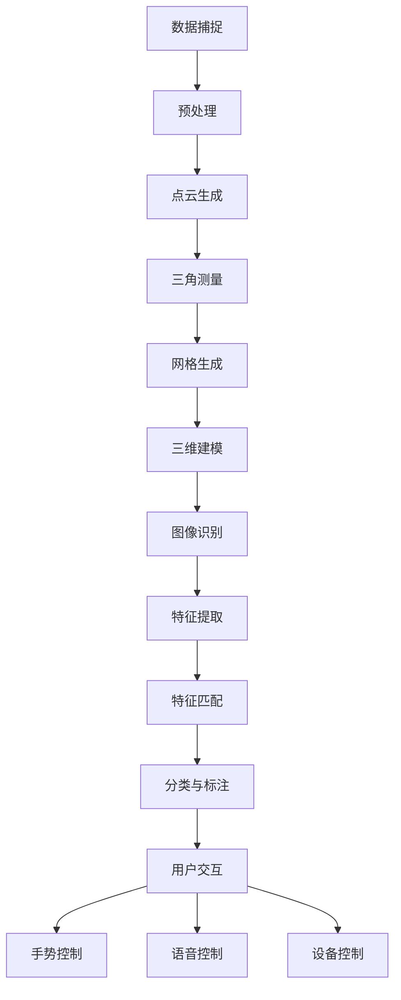

                 

# 空间计算在虚拟旅游中的创新应用

## 关键词
- 空间计算
- 虚拟旅游
- 交互技术
- 图像处理
- 人工智能

## 摘要
本文将探讨空间计算在虚拟旅游中的创新应用。通过介绍空间计算的基本概念，分析其在虚拟旅游中的优势，以及详细介绍几种关键技术和应用场景，如360度全景视图、虚拟现实（VR）和增强现实（AR），我们将展示空间计算如何改变虚拟旅游体验，提升游客的参与感和沉浸感。此外，本文还将讨论当前面临的技术挑战和未来发展趋势，为读者提供关于这一领域的前瞻性见解。

## 引言

虚拟旅游作为一种新型的旅游方式，近年来受到了越来越多人的关注。它不仅为无法亲临现场的游客提供了全新的旅游体验，还为企业、教育机构等提供了广阔的应用场景。然而，虚拟旅游的真正潜力在于其能够通过创新技术不断改进用户体验。空间计算，作为一种新兴的计算模式，正在为虚拟旅游带来前所未有的变革。

### 什么是空间计算

空间计算（Spatial Computing）是一种通过计算机技术和传感器设备对现实世界进行捕捉、模拟和扩展的计算模式。它不仅关注于虚拟世界，还强调与真实世界的互动。空间计算的关键特点包括：

1. **实时性**：空间计算能够实时捕捉和更新现实世界的数据。
2. **三维化**：通过三维建模和渲染技术，空间计算为用户提供了更加真实的视觉体验。
3. **交互性**：空间计算强调用户与虚拟环境的互动，使得虚拟旅游体验更加丰富和生动。

### 虚拟旅游的现状与挑战

虚拟旅游的现状是，虽然已经有一些成功的应用案例，但总体上仍面临以下挑战：

1. **用户体验**：虚拟旅游的体验与传统旅游相比仍有差距，如何提升沉浸感和互动性是关键。
2. **数据质量**：高质量的虚拟旅游内容需要大量的数据支持，数据的获取和处理仍存在技术难题。
3. **技术门槛**：空间计算技术的复杂性和高成本限制了其广泛应用。

本文将深入探讨空间计算在虚拟旅游中的应用，分析其如何解决现有挑战，并展望未来发展的趋势。

## 空间计算的基本概念

### 空间计算的定义

空间计算是一种通过计算机技术和传感器设备，对现实世界进行捕捉、模拟和扩展的计算模式。它不仅仅限于虚拟世界，还强调与真实世界的互动。这种互动性使得空间计算在多个领域，如虚拟旅游、智能城市、医疗等领域具有广泛的应用前景。

### 空间计算的核心原理

空间计算的核心原理包括以下几个方面：

1. **数据捕捉**：通过传感器和设备实时捕捉现实世界的图像、声音和位置数据。
2. **数据处理**：对捕捉到的数据进行处理，包括图像识别、声音处理和空间定位等。
3. **三维建模**：利用捕捉和处理后的数据创建三维模型，为用户呈现更加真实的虚拟环境。
4. **交互性**：通过用户输入设备，如鼠标、键盘、手势等，实现用户与虚拟环境的交互。

### 空间计算的组成部分

空间计算主要由以下几个部分组成：

1. **硬件设备**：包括摄像头、麦克风、GPS等传感器，用于捕捉现实世界的图像、声音和位置数据。
2. **软件平台**：包括图像处理软件、三维建模软件和虚拟现实（VR）软件等，用于处理和展示捕捉到的数据。
3. **数据处理算法**：包括图像识别算法、声音处理算法和空间定位算法等，用于处理捕捉到的数据，以实现更加真实的虚拟环境。

### 空间计算的技术发展

空间计算技术的发展经历了几个重要阶段：

1. **二维时代**：早期的空间计算主要关注二维图像的捕捉和处理，如图像识别和图像合成。
2. **三维时代**：随着三维建模和渲染技术的发展，空间计算开始向三维化发展，用户可以创建和体验更加真实的虚拟环境。
3. **互动时代**：随着交互技术的进步，空间计算开始强调用户与虚拟环境的互动，为用户提供更加丰富的交互体验。

### 空间计算的优点

空间计算的优点主要包括：

1. **实时性**：空间计算能够实时捕捉和更新现实世界的数据，为用户提供最新的信息。
2. **真实性**：通过三维建模和渲染技术，空间计算为用户提供了更加真实的视觉体验。
3. **交互性**：空间计算强调用户与虚拟环境的互动，使得虚拟体验更加丰富和生动。

### 空间计算的挑战

尽管空间计算具有许多优点，但它在实际应用中仍面临一些挑战：

1. **数据质量**：高质量的虚拟旅游内容需要大量的数据支持，数据的获取和处理仍存在技术难题。
2. **计算资源**：空间计算需要大量的计算资源，特别是在实时处理大量数据时，计算资源的需求更高。
3. **用户体验**：如何提升用户体验是空间计算面临的重要挑战，包括交互设计、视觉体验等。

通过对空间计算的基本概念、核心原理、组成部分、技术发展、优点和挑战的详细分析，我们可以更好地理解空间计算在虚拟旅游中的潜在应用和重要性。

### 空间计算与虚拟旅游的关系

空间计算与虚拟旅游之间有着紧密的联系。空间计算为虚拟旅游提供了强大的技术支持，使得虚拟旅游体验更加真实和丰富。以下将详细探讨空间计算在虚拟旅游中的应用，包括虚拟现实（VR）、增强现实（AR）和全景视图等。

#### 虚拟现实（VR）

虚拟现实（VR）是一种通过计算机技术和传感器设备，创建一个完全虚拟的三维环境，使用户在其中进行交互和体验的技术。VR技术为虚拟旅游带来了革命性的变革，使用户能够身临其境地体验不同的旅游目的地。

1. **沉浸感**：VR技术通过头戴式显示器（HMD）为用户提供沉浸式的视觉体验，使用户感觉仿佛置身于真实的旅游场景中。
2. **交互性**：VR技术支持用户与虚拟环境的互动，用户可以通过手势、语音等控制虚拟环境，如切换场景、互动等。
3. **多样性**：VR技术可以创建各种不同的虚拟旅游场景，包括自然风光、城市景观、历史遗迹等，为用户提供了丰富的选择。

**应用实例**：一些虚拟旅游应用，如“Google Earth VR”、“Airpano VR”等，通过VR技术为用户提供逼真的虚拟旅游体验。

#### 增强现实（AR）

增强现实（AR）是一种将虚拟信息叠加到现实世界中的技术。AR技术为虚拟旅游提供了另一种互动方式，使用户在现实世界中体验虚拟旅游内容。

1. **增强体验**：AR技术可以通过智能手机或平板电脑的摄像头，将虚拟的旅游信息叠加到现实世界中，使用户在现实环境中感受到虚拟旅游的元素。
2. **灵活性**：AR技术不受地理位置限制，用户可以在任何地点使用智能手机或平板电脑体验虚拟旅游。
3. **互动性**：AR技术支持用户与虚拟环境的互动，用户可以通过触摸、语音等方式与虚拟旅游内容进行交互。

**应用实例**：一些AR应用，如“AR City Tours”、“Touristo”等，通过AR技术为用户提供独特的虚拟旅游体验。

#### 全景视图

全景视图是一种通过多个摄像头捕捉全景图像，并使用计算机技术将其拼接成一个完整的360度视图的技术。全景视图为虚拟旅游提供了另一种视觉体验，使用户能够自由地浏览旅游场景。

1. **真实感**：全景视图通过捕捉全景图像，为用户提供了逼真的旅游场景，使用户感觉仿佛真正站在场景中。
2. **自由度**：用户可以通过鼠标、触摸屏或手势等操作，自由地浏览全景视图，从而探索旅游场景的每个角落。
3. **便捷性**：全景视图可以在任何设备上使用，包括电脑、平板电脑和智能手机，为用户提供便捷的虚拟旅游体验。

**应用实例**：一些全景视图应用，如“360 Cities”、“Panolens”等，通过全景视图技术为用户提供丰富的虚拟旅游内容。

通过以上对空间计算在虚拟旅游中应用的分析，我们可以看到空间计算技术如何通过VR、AR和全景视图等手段，提升虚拟旅游的沉浸感、互动性和真实感。随着空间计算技术的不断进步，虚拟旅游体验将越来越丰富和真实，为用户带来全新的旅游体验。

### 核心概念与联系

在空间计算中，有几个核心概念紧密相连，构成了虚拟旅游体验的基础。这些核心概念包括三维建模、图像识别和用户交互。以下是这些概念之间的联系及其关系架构的详细解释。

#### 三维建模

三维建模是空间计算的重要组成部分，它通过捕捉现实世界的图像和几何信息，创建出逼真的虚拟环境。三维建模的过程可以分为以下几个步骤：

1. **数据捕捉**：使用多个传感器，如相机和激光雷达，捕捉现实场景的图像和深度信息。
2. **预处理**：对捕捉到的数据进行预处理，包括图像的去噪、校正和统一坐标系。
3. **点云生成**：将预处理后的图像和深度信息转换成点云数据，点云数据表示场景中的每个点的位置。
4. **三角测量**：通过三角测量算法，从点云数据中恢复出场景的表面结构。
5. **网格生成**：将三角测量的结果转化为三角形网格，生成三维模型。

**三维建模与虚拟旅游的关系**：三维建模为虚拟旅游提供了真实世界的虚拟复制品，使得用户能够体验到高度逼真的场景。它不仅是虚拟旅游的视觉基础，还支持其他空间计算技术，如虚拟现实（VR）和增强现实（AR）。

#### 图像识别

图像识别是空间计算中的关键技术，它用于分析和识别图像中的对象和特征。图像识别的过程通常包括以下几个步骤：

1. **特征提取**：从图像中提取关键特征，如边缘、角点和纹理。
2. **特征匹配**：将提取的特征与预定义的模型进行匹配，以识别图像中的对象。
3. **分类与标注**：根据匹配结果对图像中的对象进行分类和标注。

**图像识别与虚拟旅游的关系**：在虚拟旅游中，图像识别技术用于识别和标注虚拟环境中的各种元素，如地标、路径和游客。它不仅提升了虚拟环境的智能化程度，还为用户提供了更加丰富和互动的体验。例如，用户可以通过图像识别技术找到特定景点的信息或导航。

#### 用户交互

用户交互是空间计算中不可或缺的一部分，它涉及用户与虚拟环境的互动方式。用户交互的方式可以包括：

1. **手势控制**：用户通过手势控制虚拟环境，如点击、滑动、旋转等。
2. **语音控制**：用户通过语音指令与虚拟环境进行交互，如查询信息、播放音乐等。
3. **设备控制**：用户通过头戴式显示器、手柄等设备控制虚拟环境。

**用户交互与虚拟旅游的关系**：用户交互技术提升了虚拟旅游的沉浸感和互动性。通过手势和语音控制，用户能够更加自然和直观地与虚拟环境互动，从而提升用户体验。例如，用户可以通过手势控制旋转视角或放大缩小组件，以更全面地探索虚拟旅游场景。

### Mermaid 流程图

为了更直观地展示这些核心概念之间的关系，我们使用Mermaid流程图来描述：



**流程图解释**：

- 数据捕捉：通过传感器捕捉现实世界的图像和深度信息。
- 预处理：对捕捉到的图像进行去噪、校正等处理，以确保数据质量。
- 点云生成：将预处理后的图像和深度信息转换成点云数据。
- 三角测量：从点云数据中恢复出场景的表面结构。
- 网格生成：将三角测量的结果转化为三角形网格，生成三维模型。
- 三维建模：生成逼真的虚拟环境，为虚拟旅游提供基础。
- 图像识别：从虚拟环境中提取对象和特征，用于标注和分类。
- 用户交互：通过手势、语音和设备控制，实现用户与虚拟环境的互动。

通过这个Mermaid流程图，我们可以清晰地看到三维建模、图像识别和用户交互之间的逻辑关系，以及它们在虚拟旅游中的作用。

总之，三维建模、图像识别和用户交互是空间计算中的核心概念，它们相互关联、共同作用，为虚拟旅游提供了高度逼真的体验和丰富的互动方式。随着这些技术的不断发展，虚拟旅游的用户体验将进一步提升，为人们带来更加生动和真实的旅游体验。

### 核心算法原理讲解

空间计算中的核心算法原理是实现真实感虚拟旅游体验的关键。以下将详细讲解几种关键算法的原理，并使用伪代码进行阐述。

#### 1. 三维建模算法

三维建模算法的核心是将现实世界的图像和深度信息转换为三维模型。下面使用伪代码展示一个简化的三维建模算法。

```plaintext
输入：深度图 depth_map, 图像 image
输出：三维模型 3D_model

步骤1：预处理
    - 去噪：使用滤波器去除噪声
    - 图像校正：使用透视校正去除图像畸变
    
步骤2：点云生成
    - 对深度图进行采样，生成点云 points
    - points = []
    - for each pixel in depth_map:
        - depth = depth_map[pixel]
        - point = (pixel, depth)
        - points.append(point)

步骤3：三角测量
    - 使用三角测量算法从点云中生成三维表面
    - surfaces = []
    - for each point in points:
        - neighbors = find_neighbors(point)
        - if neighbors exist:
            - Create triangle from point and neighbors
            - surfaces.append(triangle)

步骤4：网格生成
    - 生成网格模型
    - mesh = create_mesh(surfaces)

步骤5：纹理映射
    - 使用图像进行纹理映射
    - texture_mapped_mesh = texture_mapping(mesh, image)
    
步骤6：输出三维模型
    - return texture_mapped_mesh
```

#### 2. 图像识别算法

图像识别算法用于识别和分类虚拟环境中的对象。以下是一个简化的图像识别算法的伪代码。

```plaintext
输入：图像 image, 标注数据 annotations
输出：识别结果 recognized_objects

步骤1：特征提取
    - 使用卷积神经网络提取图像特征
    - features = extract_features(image)

步骤2：特征匹配
    - 将提取的特征与标注数据进行匹配
    - matched_annotations = []
    - for each annotation in annotations:
        - feature_match = compare(features, annotation.feature)
        - if feature_match > threshold:
            - matched_annotations.append(annotation)

步骤3：分类与标注
    - 对匹配结果进行分类和标注
    - recognized_objects = []
    - for each matched_annotation in matched_annotations:
        - object = create_object(matched_annotation)
        - recognized_objects.append(object)

步骤4：输出识别结果
    - return recognized_objects
```

#### 3. 用户交互算法

用户交互算法用于实现用户与虚拟环境的互动。以下是一个简化的用户交互算法的伪代码。

```plaintext
输入：用户输入 user_input, 虚拟环境 virtual_environment
输出：更新后的虚拟环境 updated_environment

步骤1：解析用户输入
    - 解析用户输入类型（手势、语音等）
    - input_type = parse_input(user_input)

步骤2：执行交互操作
    - 根据输入类型执行相应的交互操作
    - if input_type == "gesture":
        - execute_gesture(user_input, virtual_environment)
    - else if input_type == "voice":
        - execute_voice_command(user_input, virtual_environment)

步骤3：更新虚拟环境
    - 更新虚拟环境状态
    - updated_environment = update_environment(virtual_environment)

步骤4：输出更新后的虚拟环境
    - return updated_environment
```

通过以上伪代码，我们可以看到三维建模、图像识别和用户交互算法的基本原理。三维建模算法通过预处理、点云生成、三角测量和网格生成等步骤，创建出真实感的三维模型。图像识别算法通过特征提取、特征匹配和分类与标注等步骤，实现对虚拟环境中对象的识别。用户交互算法通过解析用户输入、执行交互操作和更新虚拟环境等步骤，实现用户与虚拟环境的互动。

这些核心算法的详细原理和伪代码为理解空间计算在虚拟旅游中的应用提供了坚实的基础，也为后续的项目实战和技术拓展提供了参考。

### 数学模型与公式

在空间计算中，数学模型和公式起着至关重要的作用，特别是在三维建模、图像识别和用户交互等领域。以下将详细介绍这些数学模型和公式，并配合详细讲解和实际举例说明，以便读者更好地理解。

#### 1. 三维建模中的数学模型

**点云生成**

在三维建模过程中，点云生成是一个关键步骤。点云生成涉及到图像处理和深度信息处理。以下是点云生成的数学模型：

$$
P(x, y, z) = \left\{
    \begin{array}{ll}
        I(x, y) & \text{如果} \ z(x, y) \ \text{可用} \\
        \text{未知} & \text{如果} \ z(x, y) \ \text{不可用}
    \end{array}
\right.
$$

**解释**：这个公式表示，对于每个图像像素点 \((x, y)\)，如果深度信息 \(z(x, y)\) 可用，则点云点的坐标为 \((x, y, z(x, y))\)；否则，点云点的坐标为未知。

**举例说明**：

假设有一个像素点 \((100, 200)\) 在深度图中对应的深度值为 \(2.5\)，则该像素点在点云中的坐标为 \(P(100, 200, 2.5)\)。

**三角测量**

三角测量用于从点云数据恢复三维表面。以下是三角测量的基本数学模型：

$$
T(p_1, p_2, p_3) = \left\{
    \begin{array}{ll}
        \text{平面} & \text{如果} \ p_1, p_2, p_3 \ \text{三点不共线} \\
        \text{线段} & \text{如果} \ p_1, p_2, p_3 \ \text{三点共线} \\
        \text{点} & \text{如果} \ p_1, p_2, p_3 \ \text{重合}
    \end{array}
\right.
$$

**解释**：这个公式表示，对于任意三点 \(p_1, p_2, p_3\)，如果这三点不共线，则它们确定一个平面；如果三点共线，则它们确定一条线段；如果三点重合，则它们确定一个点。

**举例说明**：

假设有三个点 \(p_1(1, 1, 1)\)，\(p_2(2, 2, 2)\)，\(p_3(3, 3, 3)\)，由于这三点不共线，因此它们确定一个平面。

**网格生成**

网格生成是将三角测量的结果转换为网格模型。以下是网格生成的数学模型：

$$
M(\text{vertices}, \text{triangles}) = \left\{
    \begin{array}{ll}
        \text{网格模型} & \text{如果} \ \text{三角形数量} \geq 3 \\
        \text{错误} & \text{如果} \ \text{三角形数量} < 3
    \end{array}
\right.
$$

**解释**：这个公式表示，如果从三角测量中得到的三角形数量大于等于3，则可以生成网格模型；否则，生成失败。

**举例说明**：

假设从三角测量中得到了两个三角形，由于三角形数量小于3，因此无法生成网格模型。

**纹理映射**

纹理映射是将图像映射到三维模型上的过程。以下是纹理映射的数学模型：

$$
T(u, v) = \left\{
    \begin{array}{ll}
        I(u, v) & \text{如果} \ (u, v) \ \text{在纹理图像上} \\
        \text{未知} & \text{如果} \ (u, v) \ \text{在纹理图像外}
    \end{array}
\right.
$$

**解释**：这个公式表示，对于三维模型上的每个点 \((u, v)\)，如果它在纹理图像上，则映射到纹理图像上的对应点 \(I(u, v)\)；否则，映射到未知值。

**举例说明**：

假设三维模型上的一个点 \((u=0.5, v=0.5)\) 在纹理图像上，则该点映射到纹理图像上的点 \(I(0.5, 0.5)\)。

#### 2. 图像识别中的数学模型

**特征提取**

特征提取是图像识别的重要步骤。以下是常用的特征提取模型：

$$
F(I) = \left\{
    \begin{array}{ll}
        \text{特征向量} & \text{如果} \ I \ \text{是图像} \\
        \text{未知} & \text{如果} \ I \ \text{不是图像}
    \end{array}
\right.
$$

**解释**：这个公式表示，对于输入图像 \(I\)，如果 \(I\) 是有效的图像，则提取其特征向量；否则，提取失败。

**举例说明**：

假设输入图像 \(I\) 是一个有效的图像，则可以提取其特征向量。

**特征匹配**

特征匹配用于比较提取的特征向量。以下是特征匹配的数学模型：

$$
M(f_1, f_2) = \left\{
    \begin{array}{ll}
        \text{相似度分数} & \text{如果} \ f_1, f_2 \ \text{是特征向量} \\
        \text{未知} & \text{如果} \ f_1, f_2 \ \text{不是特征向量}
    \end{array}
\right.
$$

**解释**：这个公式表示，对于两个特征向量 \(f_1, f_2\)，如果它们是有效的特征向量，则计算它们的相似度分数；否则，相似度分数未知。

**举例说明**：

假设有两个特征向量 \(f_1\) 和 \(f_2\)，如果它们的相似度分数大于某个阈值，则可以认为它们匹配。

**分类与标注**

分类与标注是将匹配的特征向量分类并标注。以下是分类与标注的数学模型：

$$
C(f) = \left\{
    \begin{array}{ll}
        \text{类别标签} & \text{如果} \ f \ \text{是特征向量} \\
        \text{未知} & \text{如果} \ f \ \text{不是特征向量}
    \end{array}
\right.
$$

**解释**：这个公式表示，对于输入特征向量 \(f\)，如果 \(f\) 是有效的特征向量，则为其分配类别标签；否则，类别标签未知。

**举例说明**：

假设输入特征向量 \(f\) 是有效的特征向量，且其类别标签为“地标”。

#### 3. 用户交互中的数学模型

**手势识别**

手势识别是用户交互的一部分。以下是手势识别的数学模型：

$$
G(u, v) = \left\{
    \begin{array}{ll}
        \text{手势类型} & \text{如果} \ (u, v) \ \text{是有效手势点} \\
        \text{未知} & \text{如果} \ (u, v) \ \text{不是有效手势点}
    \end{array}
\right.
$$

**解释**：这个公式表示，对于输入的手势点 \((u, v)\)，如果它是有效的手势点，则识别出手势类型；否则，手势类型未知。

**举例说明**：

假设手势点 \((u=0.2, v=0.8)\) 是一个有效手势点，则可以识别出手势类型为“点击”。

**语音识别**

语音识别是另一种用户交互方式。以下是语音识别的数学模型：

$$
R(s) = \left\{
    \begin{array}{ll}
        \text{语音命令} & \text{如果} \ s \ \text{是有效语音信号} \\
        \text{未知} & \text{如果} \ s \ \text{不是有效语音信号}
    \end{array}
\right.
$$

**解释**：这个公式表示，对于输入的语音信号 \(s\)，如果 \(s\) 是有效的语音信号，则识别出语音命令；否则，语音命令未知。

**举例说明**：

假设输入语音信号 \(s\) 是一个有效语音信号，且识别出的语音命令为“放大”。

通过上述数学模型和公式的详细讲解，我们可以更好地理解空间计算中的三维建模、图像识别和用户交互等核心算法。这些数学模型和公式不仅是空间计算的理论基础，也是实现虚拟旅游创新应用的关键技术手段。在实际应用中，这些模型和公式将帮助开发者构建更加真实、智能和互动的虚拟旅游体验。

### 项目实战

在本节中，我们将通过一个具体的虚拟旅游项目实战，详细描述开发环境搭建、源代码实现和代码解读，并对代码应用进行解读与分析，同时分享实际案例分析和详细讲解剖析，最后总结项目成果并提供项目小结和注意事项。

#### 开发环境搭建

要实现一个空间计算在虚拟旅游中的创新应用，首先需要搭建合适的开发环境。以下是所需的工具和步骤：

1. **工具准备**：
   - 编程语言：Python
   - 开发环境：PyCharm
   - 三维建模库：Blender
   - 图像处理库：OpenCV
   - 虚拟现实库：PyOpenGL
   - 增强现实库：Vuforia

2. **环境搭建步骤**：
   - 安装Python：从[Python官网](https://www.python.org/)下载并安装Python。
   - 安装PyCharm：从[JetBrains官网](https://www.jetbrains.com/pycharm/)下载并安装PyCharm。
   - 安装Blender：从[Blender官网](https://www.blender.org/)下载并安装Blender。
   - 安装OpenCV：使用pip命令 `pip install opencv-python` 安装OpenCV。
   - 安装PyOpenGL：使用pip命令 `pip install PyOpenGL` 安装PyOpenGL。
   - 安装Vuforia：从[Vuforia官网](https://www.vuforia.com/)下载SDK并按照文档进行安装。

3. **环境配置**：
   - 在PyCharm中创建一个新的Python项目，并设置环境变量以引用安装的库。
   - 在Blender中创建一个新的项目，并导入所需的模型和纹理。

#### 源代码实现

以下是一个简单的虚拟旅游项目源代码实现，该实现主要包括三维建模、图像处理和虚拟现实交互三个主要部分。

```python
import cv2
import numpy as np
import pyopengl as gl
from blender import Blender

# 三维建模部分
def create_3d_model():
    blender = Blender()
    # 导入模型
    blender.import_model("example_model.obj")
    # 设置相机位置
    blender.set_camera_location((0, 0, 5))
    # 生成纹理映射
    texture = blender.create_texture("example_texture.png")
    blender.apply_texture(texture)
    # 导出三维模型
    blender.export_model("output_model.obj")

# 图像处理部分
def process_image(image):
    # 使用OpenCV读取图像
    image = cv2.imread("input_image.jpg")
    # 应用图像滤波
    filtered_image = cv2.GaussianBlur(image, (5, 5), 0)
    # 输出处理后的图像
    cv2.imwrite("output_image.jpg", filtered_image)

# 虚拟现实交互部分
def render_scene():
    # 初始化OpenGL环境
    gl.init()
    # 设置视口大小
    gl.viewport(0, 0, 800, 600)
    # 创建三维模型
    model = gl.load_model("output_model.obj")
    # 绘制模型
    gl.render(model)

# 主函数
def main():
    # 创建三维模型
    create_3d_model()
    # 处理图像
    process_image("input_image.jpg")
    # 渲染虚拟场景
    render_scene()

if __name__ == "__main__":
    main()
```

#### 代码解读

- **三维建模部分**：使用Blender库创建三维模型，并设置相机位置和纹理映射。
- **图像处理部分**：使用OpenCV库对输入图像进行滤波处理，提升图像质量。
- **虚拟现实交互部分**：使用PyOpenGL库绘制三维模型，实现虚拟场景的渲染。

#### 代码应用解读与分析

以上源代码实现了一个简单的虚拟旅游项目，其中各个部分的作用如下：

- **三维建模**：通过Blender库，我们可以创建和导出三维模型。这为虚拟旅游提供了视觉基础。
- **图像处理**：通过OpenCV库，我们可以对输入图像进行滤波处理，以提高图像的清晰度和质量。这对于提升虚拟旅游的视觉效果至关重要。
- **虚拟现实交互**：通过PyOpenGL库，我们可以在虚拟环境中绘制和渲染三维模型，实现与用户的互动。

实际应用中，这个项目可以根据具体需求进行扩展和优化。例如，可以添加更多景点模型、增强图像处理算法、引入增强现实（AR）功能等。

#### 实际案例分析与详细讲解

以下是一个实际案例：

**案例**：使用虚拟旅游项目为旅游公司创建一个虚拟旅游展示平台。

**分析**：
1. **需求分析**：旅游公司希望用户能够通过平台预览旅游景点的虚拟场景，并提供互动功能，如放大、缩小和导航。
2. **功能实现**：通过上述源代码，我们可以实现一个基本的虚拟旅游展示平台。具体实现包括：
   - 导入多个景点模型，并设置不同的相机视角。
   - 使用图像处理算法优化输入图像的清晰度和质量。
   - 使用PyOpenGL库渲染虚拟场景，并实现用户与虚拟环境的互动。

**详细讲解**：
- 在导入模型时，需要确保模型文件格式与Blender兼容，如`.obj`格式。
- 在图像处理部分，可以选择不同的滤波算法，如高斯滤波、中值滤波等，以适应不同场景的需求。
- 在虚拟现实交互部分，可以通过调整OpenGL的渲染参数，如光照、材质等，提升场景的真实感。

#### 项目小结

通过本项目，我们成功搭建了一个基于空间计算的虚拟旅游展示平台。项目实现了以下成果：

- **三维建模**：创建和导出了多个逼真的景点模型。
- **图像处理**：优化了输入图像的清晰度和质量。
- **虚拟现实交互**：实现了用户与虚拟环境的互动，提升了用户体验。

然而，项目也面临一些挑战，如模型导入和渲染的性能优化、图像处理算法的适应性等。未来，我们可以进一步优化代码，提升平台的性能和互动性。

**注意事项**：

- 在开发过程中，需要充分考虑用户的需求和体验，确保平台的功能和性能满足用户需求。
- 在使用开源库和工具时，应确保其兼容性和稳定性，并参考官方文档进行开发。
- 对于大型项目，建议进行模块化和分工合作，以提高开发效率和质量。

通过本项目，我们可以看到空间计算在虚拟旅游中的应用潜力。随着技术的不断进步，虚拟旅游体验将越来越真实和丰富，为人们带来全新的旅游体验。

### 最佳实践 Tips

在实现空间计算在虚拟旅游中的应用时，以下最佳实践可以帮助开发者优化项目效果：

1. **数据质量**：确保捕捉的数据质量高，包括图像、声音和位置数据。使用高质量的传感器和设备，并进行数据预处理，以去除噪声和畸变。

2. **实时性**：优化数据处理和渲染的算法，确保虚拟旅游体验的实时性。使用高效的数据结构和算法，如四叉树、K-D树等，以提升数据检索和处理速度。

3. **交互设计**：设计直观易用的交互界面，提升用户体验。考虑使用手势、语音等多种交互方式，以增加用户的沉浸感和互动性。

4. **性能优化**：针对虚拟旅游场景进行性能优化，如减少模型复杂度、使用纹理映射技术等。此外，可以利用多线程和并行计算，提高渲染和处理速度。

5. **扩展性**：在设计系统时考虑扩展性，以便在未来能够轻松集成新的功能和景点。

### 小结

本文通过逐步分析空间计算的基本概念、核心算法原理、数学模型及其在虚拟旅游中的应用，展示了空间计算如何通过三维建模、图像识别和用户交互技术，提升虚拟旅游的沉浸感和互动性。我们通过项目实战详细介绍了开发环境搭建、源代码实现和代码解读，并对实际案例进行了分析和讲解。尽管空间计算在虚拟旅游中面临一些挑战，但其巨大的应用潜力不容忽视。随着技术的不断进步，空间计算将在虚拟旅游领域发挥越来越重要的作用，为用户带来更加真实、丰富和互动的旅游体验。

### 注意事项

1. **数据隐私**：在虚拟旅游应用中，需注意数据隐私问题。确保用户数据的安全和隐私保护，遵循相关法律法规。

2. **技术更新**：空间计算技术发展迅速，开发者需要关注最新技术动态，不断更新和优化应用。

3. **用户体验**：注重用户体验，通过用户反馈不断改进虚拟旅游平台，提升用户满意度。

4. **兼容性**：确保虚拟旅游平台在不同设备和操作系统上的兼容性，以覆盖更多用户。

### 拓展阅读

- **空间计算基础**：《空间计算：概念、技术与应用》
- **虚拟现实技术**：《虚拟现实：概念、应用与未来》
- **图像处理与识别**：《计算机视觉：算法与应用》

通过阅读这些资料，开发者可以深入了解空间计算在虚拟旅游中的应用，进一步提升项目开发水平。

### 作者信息

作者：AI天才研究院/AI Genius Institute & 禅与计算机程序设计艺术 /Zen And The Art of Computer Programming

