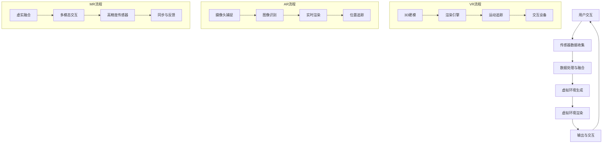

                 

### 文章标题

# 空间计算在远程协作中的应用

空间计算作为一种前沿技术，正逐渐改变着远程协作的方式。随着全球化的加速和信息技术的迅猛发展，远程协作已经成为现代工作中不可或缺的一部分。然而，传统的远程协作方式面临着诸多挑战，如沟通效率低下、协作体验差等。空间计算技术的引入，为解决这些问题提供了新的思路。本文将深入探讨空间计算在远程协作中的应用，旨在帮助读者了解这一技术的核心概念、技术原理以及具体应用，为未来的技术发展和实践提供参考。

## 关键词

- 空间计算
- 远程协作
- 虚拟现实
- 增强现实
- 混合现实
- 远程会议
- 远程教育
- 远程医疗

## 摘要

本文旨在探讨空间计算在远程协作中的应用。首先，我们将介绍空间计算的基本概念和远程协作的现状，分析远程协作面临的挑战。随后，本文将详细阐述空间计算的核心技术，包括虚拟现实、增强现实和混合现实，并使用伪代码和Mermaid流程图来解释其原理。接着，我们将探讨空间计算在远程协作中的具体应用场景，如远程会议、远程教育和远程医疗，提供实际案例分析和实现方法。最后，本文将讨论空间计算系统设计、性能优化与安全性，展望未来发展趋势和面临的挑战。

## 目录

1. **引言与背景**
   1.1 **空间计算概述**
   1.2 **远程协作的挑战**
   1.3 **空间计算的作用**

2. **空间计算基础**
   2.1 **核心概念与理论**
   2.2 **关键技术解析**
   2.3 **Mermaid流程图解析**

3. **空间计算技术**
   3.1 **虚拟现实技术**
   3.2 **增强现实技术**
   3.3 **混合现实技术**

4. **远程协作中的空间计算应用**
   4.1 **远程会议**
   4.2 **远程教育**
   4.3 **远程医疗**

5. **空间计算系统设计与实现**
   5.1 **系统设计原则**
   5.2 **开发环境搭建**
   5.3 **源代码实现**

6. **性能优化与安全性**
   6.1 **性能优化策略**
   6.2 **安全性问题与对策**

7. **未来发展趋势与挑战**
   7.1 **发展趋势**
   7.2 **面临的挑战**

### 初步规划

在撰写本文之前，我们需要明确文章的核心内容框架，以确保内容的完整性和逻辑性。本文将围绕空间计算在远程协作中的应用这一主题，从以下几个方面展开：

1. **引言与背景**：介绍空间计算和远程协作的基本概念，以及远程协作中存在的挑战。这部分将简要回顾空间计算的发展历程，并探讨其在远程协作中的重要性和作用。

2. **空间计算基础**：深入讲解空间计算的核心概念、相关理论和技术。这部分将包括对虚拟现实、增强现实和混合现实等技术的详细解析，并使用伪代码和Mermaid流程图来解释其工作原理。

3. **空间计算技术**：探讨空间计算在远程协作中的具体应用，如远程会议、远程教育和远程医疗。这部分将结合实际案例，分析这些应用场景的实现方法和技术难点。

4. **系统设计与实现**：讲解如何设计和实现一个空间计算系统，包括开发环境的搭建、源代码的实现和解读。这部分将提供具体的操作指南和代码示例。

5. **性能优化与安全性**：讨论空间计算系统的性能优化策略和安全性问题，并提出相应的解决方案。

6. **未来发展趋势与挑战**：展望空间计算在远程协作中的应用前景，分析其面临的挑战和未来的发展方向。

通过以上规划，我们确保文章内容全面、结构紧凑、逻辑清晰，旨在为读者提供一个完整的技术解析和应用指南。

### 第1章：引言与背景

#### 1.1 空间计算概述

空间计算是一种基于虚拟和增强现实技术的新型计算范式，旨在扩展人类对物理和数字环境的感知与交互能力。其基本概念可以追溯到20世纪90年代，当时虚拟现实（VR）和增强现实（AR）技术刚刚开始崭露头角。随着计算机图形学、传感器技术、人工智能等领域的快速发展，空间计算逐渐成为一种独立的研究领域，并在多个应用场景中展现出巨大的潜力。

**定义与概念**

空间计算可以定义为通过虚拟、增强和混合现实技术，将现实世界与数字世界无缝融合的一种计算方式。它不仅涉及对虚拟环境的构建和模拟，还包括对现实世界的增强和交互。具体来说，空间计算包括以下几个核心概念：

- **虚拟现实（VR）**：一种完全沉浸式的体验，用户通过头戴显示器（HMD）或其他设备进入一个完全虚拟的环境。
- **增强现实（AR）**：在现实世界中叠加数字信息，用户通过智能手机、平板电脑或头戴显示器等设备看到增强后的现实。
- **混合现实（MR）**：结合VR和AR的特点，用户在虚拟环境中与真实世界进行交互，形成虚实融合的体验。

**重要性**

空间计算在远程协作中的应用具有重要的现实意义。随着全球化的加速和远程工作的普及，传统的远程协作方式面临着诸多挑战，如沟通效率低下、协作体验差等。空间计算技术通过提供更真实的交互体验和更高效的协作工具，能够有效解决这些问题。以下是空间计算在远程协作中的几个重要作用：

1. **增强沟通体验**：通过虚拟现实技术，远程协作的参与者可以进入一个沉浸式的虚拟会议室，感受到面对面的互动，从而提高沟通效率和效果。
2. **提高协作效率**：空间计算技术能够提供更直观、更便捷的协作工具，如虚拟白板、共享文档等，使得团队成员能够更轻松地协同工作。
3. **拓宽应用场景**：空间计算技术不仅适用于传统的远程会议和协作，还可以应用于远程教育、远程医疗等领域，为这些领域带来革命性的变化。

#### 1.2 远程协作的挑战

远程协作作为一种现代工作模式，具有许多优势，如灵活性、高效性等，但也面临着一系列挑战：

1. **沟通障碍**：由于地理位置的隔离，远程协作中的沟通存在一定的障碍，如时差、网络延迟等，这可能导致沟通不畅，影响协作效果。
2. **协作体验差**：传统的远程协作工具，如视频会议软件、即时通讯工具等，虽然能够实现基本的沟通和协作，但缺乏真实的交互体验，难以满足高效协作的需求。
3. **信息共享困难**：远程协作中，团队成员之间的信息共享和交流存在一定难度，如文档的版本控制、信息的及时更新等，这可能导致工作效率降低。
4. **技术支持不足**：许多远程协作工具在功能、性能、兼容性等方面存在不足，难以满足不同场景下的协作需求。

#### 1.3 空间计算如何解决这些问题

空间计算技术为解决远程协作中的这些挑战提供了新的思路和方法。以下是一些具体解决方案：

1. **增强沟通体验**：通过虚拟现实技术，远程协作的参与者可以进入一个沉浸式的虚拟会议室，实现面对面的互动。例如，使用VR头戴显示器，参与者可以在虚拟会议室中看到对方的虚拟形象，进行实时沟通和讨论。

2. **提高协作效率**：空间计算技术提供了更直观、更便捷的协作工具，如虚拟白板、共享文档等。这些工具使得团队成员能够更轻松地协同工作。例如，在一个虚拟会议室中，团队成员可以共同在虚拟白板上绘制图表、标注文档，实时更新信息。

3. **拓宽应用场景**：空间计算技术不仅适用于传统的远程会议和协作，还可以应用于远程教育、远程医疗等领域。例如，在远程教育中，教师可以使用AR技术为学生提供沉浸式的学习体验；在远程医疗中，医生可以使用VR技术进行远程手术指导。

通过空间计算技术的引入，远程协作可以变得更加高效、便捷和真实，从而解决传统远程协作中的诸多问题。在下一章中，我们将进一步探讨空间计算的核心概念和关键技术。

### 第2章：空间计算基础

#### 2.1 核心概念与理论

空间计算的核心概念包括虚拟现实（VR）、增强现实（AR）和混合现实（MR）。这些概念分别代表了不同的计算范式，在技术上有着不同的实现方式和应用场景。

**虚拟现实（VR）**

虚拟现实是一种完全沉浸式的体验，用户通过头戴显示器（HMD）或其他设备进入一个完全虚拟的环境。在VR系统中，用户看到的、听到的、感受到的都是通过计算机生成的虚拟内容。这种沉浸感使用户能够完全投入到虚拟世界中，与虚拟环境进行互动。虚拟现实的核心技术包括：

1. **3D建模与渲染**：通过计算机图形学技术，将虚拟环境的三维模型生成并渲染出来，提供给用户视觉和感官体验。
2. **传感器技术**：使用传感器如摄像头、运动追踪器等，捕捉用户的动作和位置，将用户的真实动作映射到虚拟环境中。
3. **交互设计**：设计用户与虚拟环境之间的交互方式，如手柄、手势等，使用户能够自然地与虚拟环境进行互动。

**增强现实（AR）**

增强现实是在现实世界中叠加数字信息，用户通过智能手机、平板电脑或头戴显示器等设备看到增强后的现实。AR技术通过在现实场景中叠加虚拟物体、文字、图像等信息，提供一种虚实融合的体验。增强现实的核心技术包括：

1. **标记识别与跟踪**：通过摄像头捕捉现实场景，使用图像识别技术识别并跟踪现实中的标记或物体。
2. **实时渲染**：将虚拟信息实时渲染到摄像头捕捉的画面中，实现虚拟物体与现实环境的融合。
3. **位置与运动追踪**：通过传感器和计算技术，实时追踪用户的运动和位置，确保虚拟信息与用户视角一致。

**混合现实（MR）**

混合现实结合了虚拟现实和增强现实的特点，用户在虚拟环境中与真实世界进行交互，形成虚实融合的体验。MR技术不仅提供虚拟环境的沉浸感，还能与现实世界进行互动。混合现实的核心技术包括：

1. **虚实融合**：通过计算机图形学和传感器技术，将虚拟物体与现实世界无缝融合，用户可以与虚拟物体进行交互，如触摸、抓取等。
2. **高精度传感器**：使用高精度的传感器，如深度摄像头、激光雷达等，捕捉用户的动作和周围环境，确保虚拟环境与现实世界的同步。
3. **多模态交互**：提供多种交互方式，如手势、语音、眼动等，使用户能够更自然地与虚拟环境进行互动。

#### 2.2 关键技术解析

空间计算中的关键技术包括虚拟现实、增强现实和混合现实，每种技术都有其独特的技术实现和功能特点。

**虚拟现实技术**

虚拟现实技术的主要目的是创造一个完全虚拟的环境，使用户能够沉浸其中。其关键技术包括：

1. **头戴显示器（HMD）**：HMD是VR系统中最核心的设备，用户通过HMD观看虚拟环境。高质量的显示效果和低延迟的显示刷新率是保证沉浸感的关键。
2. **运动追踪技术**：通过运动追踪器，如红外摄像头、超声波传感器等，实时捕捉用户的动作和位置，将用户的动作映射到虚拟环境中，实现交互。
3. **交互设备**：如手柄、手套等，使用户能够更自然地与虚拟环境进行交互。这些设备通过传感器和计算技术，将用户的动作转化为虚拟环境的响应。

**增强现实技术**

增强现实技术的主要目的是在现实场景中叠加虚拟信息，提供虚实融合的体验。其关键技术包括：

1. **标记识别与跟踪**：通过摄像头捕捉现实场景，使用图像识别技术识别并跟踪现实中的标记或物体，作为叠加虚拟信息的基准。
2. **实时渲染**：将虚拟信息实时渲染到摄像头捕捉的画面中，实现虚拟物体与现实环境的融合。实时渲染技术需要高效的计算能力和图像处理算法。
3. **位置与运动追踪**：通过传感器和计算技术，实时追踪用户的运动和位置，确保虚拟信息与用户视角一致，提供自然、流畅的交互体验。

**混合现实技术**

混合现实技术旨在将虚拟物体与现实世界无缝融合，提供虚实融合的体验。其关键技术包括：

1. **虚实融合**：通过计算机图形学和传感器技术，将虚拟物体与现实世界无缝融合，用户可以与虚拟物体进行交互，如触摸、抓取等。虚实融合技术需要高精度的传感器和高效的渲染算法。
2. **多模态交互**：提供多种交互方式，如手势、语音、眼动等，使用户能够更自然地与虚拟环境进行互动。多模态交互技术需要综合多种传感器和计算技术，实现自然、流畅的交互。
3. **高精度传感器**：使用高精度的传感器，如深度摄像头、激光雷达等，捕捉用户的动作和周围环境，确保虚拟环境与现实世界的同步。

通过这些关键技术的支持，空间计算技术能够提供更真实、更高效的远程协作体验，为各种应用场景提供强大的技术支持。

#### 2.3 Mermaid流程图解析

为了更直观地理解空间计算技术的工作流程，我们可以使用Mermaid流程图来展示其核心步骤和关键环节。以下是空间计算技术的基本工作流程图：



**流程图解析**：

1. **用户交互**：用户通过头戴显示器、智能手机或其他设备与虚拟环境进行交互。
2. **传感器数据收集**：传感器（如摄像头、深度传感器、加速度计等）收集用户的动作和环境信息。
3. **数据处理与融合**：收集到的数据通过计算和处理，与虚拟环境进行融合，生成实时的虚拟场景。
4. **虚拟环境生成**：根据处理后的数据，生成三维虚拟环境。
5. **虚拟环境渲染**：使用渲染引擎将虚拟环境渲染到屏幕上，提供视觉体验。
6. **输出与交互**：用户通过与虚拟环境的交互，如手势、语音等，实现与虚拟环境的互动。

**VR流程**：

- **3D建模**：通过计算机图形学技术，生成三维虚拟环境。
- **渲染引擎**：使用高效的渲染算法，将虚拟环境渲染到屏幕上。
- **运动追踪**：通过传感器捕捉用户的动作，将用户的动作映射到虚拟环境中。
- **交互设备**：使用手柄、手套等交互设备，实现与虚拟环境的自然交互。

**AR流程**：

- **摄像头捕捉**：使用摄像头捕捉现实场景。
- **图像识别**：通过图像识别技术，识别并跟踪现实中的标记或物体。
- **实时渲染**：将虚拟信息实时渲染到摄像头捕捉的画面中。
- **位置追踪**：通过传感器追踪用户的运动和位置，确保虚拟信息与现实环境的一致性。

**MR流程**：

- **虚实融合**：通过计算机图形学和传感器技术，将虚拟物体与现实世界无缝融合。
- **多模态交互**：提供多种交互方式，如手势、语音、眼动等。
- **高精度传感器**：使用高精度的传感器，捕捉用户的动作和周围环境。
- **同步与反馈**：确保虚拟环境与现实世界的同步，提供实时、自然的交互体验。

通过这个Mermaid流程图，我们可以更直观地理解空间计算技术的工作流程和各个关键技术环节，为后续章节的详细讨论提供基础。

### 第3章：空间计算技术

#### 3.1 虚拟现实技术

虚拟现实（VR）技术是一种通过计算机生成模拟环境，使用户沉浸在虚拟世界中的技术。在远程协作中，VR技术可以为参与者提供一个完全沉浸式的虚拟会议室或工作环境，极大地提升协作体验。

**VR技术原理**

VR技术的基本原理是通过头戴显示器（HMD）或其他显示设备，将用户的眼球感知封闭在一个虚拟环境中。该环境通常由计算机生成的三维模型构成，并通过实时渲染技术呈现给用户。以下是VR技术的主要组成部分：

1. **头戴显示器（HMD）**：HMD是VR系统的核心设备，用户通过它来观看虚拟环境。高质量的显示效果和低延迟的刷新率是保证沉浸感的关键。
2. **运动追踪器**：运动追踪器用于捕捉用户的位置和动作，通常包括惯性测量单元（IMU）和摄像头。通过这些传感器，用户的头部运动和身体动作可以被精确地映射到虚拟环境中。
3. **交互设备**：如手柄、手套等，用户可以通过这些设备与虚拟环境进行交互，实现手势识别、物体抓取等功能。
4. **渲染引擎**：渲染引擎是VR技术的核心组件，负责将虚拟环境实时渲染到屏幕上。高质量的渲染效果和高效的计算能力是保证流畅体验的关键。

**VR技术的应用场景**

VR技术可以在多个远程协作应用场景中发挥作用：

1. **虚拟会议室**：通过VR技术，远程参与者可以进入一个虚拟会议室，实现面对面的互动和讨论。参与者可以看到彼此的虚拟形象，体验与实际会议室相似的互动氛围。
2. **虚拟培训**：VR技术可以用于远程培训，如安全培训、操作培训等。通过虚拟环境，学员可以沉浸在模拟的场景中，进行实践操作和体验。
3. **远程医疗**：VR技术可以为远程医疗服务提供支持，如远程手术指导、医学影像分析等。医生和患者可以在虚拟环境中进行交流和互动，提高医疗服务的质量和效率。

**实现方法**

实现VR技术的基本步骤如下：

1. **场景建模**：首先需要创建虚拟环境的3D模型，这可以通过专业的3D建模软件完成。场景建模是VR系统的核心，需要确保模型的真实感和细节表现。
2. **交互设计**：设计用户与虚拟环境之间的交互方式，如手势、语音等。交互设计需要考虑用户的自然行为习惯，确保操作简便、直观。
3. **渲染引擎选择**：选择合适的渲染引擎，如Unity、Unreal Engine等，负责将虚拟环境实时渲染到屏幕上。渲染引擎的选择取决于应用场景的复杂度和性能需求。
4. **运动追踪和交互设备集成**：集成运动追踪器和交互设备，确保用户可以在虚拟环境中自由移动和操作。运动追踪技术和交互设备的精度和响应速度对用户体验至关重要。

通过以上步骤，可以构建一个功能完善的VR系统，实现远程协作的沉浸式体验。

#### 3.2 增强现实技术

增强现实（AR）技术是一种通过在现实场景中叠加虚拟信息，提供虚实融合体验的技术。AR技术可以显著提升远程协作的交互性和实时性，为用户带来全新的视觉体验。

**AR技术原理**

AR技术的基本原理是在现实世界中叠加计算机生成的虚拟信息，这些信息可以是文字、图像、三维模型等。以下是AR技术的主要组成部分：

1. **显示设备**：AR技术通常使用智能手机、平板电脑、头戴显示器等设备。这些设备通过摄像头捕捉现实场景，并将虚拟信息叠加在屏幕上。
2. **图像识别与跟踪**：通过图像识别技术，系统可以识别并跟踪现实中的标记或物体。图像识别技术是AR系统的核心，决定了虚拟信息与现实环境的融合精度。
3. **渲染引擎**：渲染引擎负责将虚拟信息实时渲染到摄像头捕捉的画面中。高质量的渲染效果和低延迟的渲染性能是保证用户体验的关键。
4. **传感器与计算**：AR系统通常集成了多种传感器，如加速度计、陀螺仪、深度传感器等，用于捕捉用户的动作和环境信息。通过计算技术，将这些信息与虚拟信息进行融合。

**AR技术的应用场景**

AR技术可以在多个远程协作应用场景中发挥重要作用：

1. **远程教育**：通过AR技术，教师可以在课堂上为学生提供沉浸式的学习体验。例如，通过AR眼镜，学生可以观察到三维的化学分子结构，从而更好地理解课程内容。
2. **远程医疗**：AR技术可以为远程医疗服务提供支持，如远程手术指导、医学影像分析等。医生可以通过AR设备实时查看患者的影像数据，进行远程诊断和治疗。
3. **远程协作**：在远程会议或项目中，AR技术可以用于信息共享和协作。例如，团队成员可以通过AR眼镜实时查看共享的文档、图表等，进行高效的讨论和协作。

**实现方法**

实现AR技术的基本步骤如下：

1. **场景建模**：创建虚拟信息的三维模型或二维图像，这些模型将在现实场景中叠加。场景建模需要考虑虚拟信息与现实环境的融合效果。
2. **标记识别与跟踪**：设计并制作标记或物体，用于识别和跟踪。通过图像识别技术，系统可以准确地识别并跟踪这些标记或物体。
3. **渲染与融合**：将虚拟信息实时渲染到摄像头捕捉的画面中，实现虚拟信息与现实环境的融合。渲染引擎的选择和性能对用户体验有重要影响。
4. **用户交互设计**：设计用户与虚拟信息之间的交互方式，如手势、语音等。交互设计需要考虑用户的操作习惯和便捷性。

通过以上步骤，可以构建一个功能完善的AR系统，实现远程协作的虚实融合体验。

#### 3.3 混合现实技术

混合现实（MR）技术是一种结合虚拟现实（VR）和增强现实（AR）的特点，实现虚拟物体与现实世界无缝融合的技术。MR技术为远程协作提供了更真实的交互体验和更高效的工作环境。

**MR技术原理**

MR技术的基本原理是通过计算机生成虚拟物体，并将其与现实世界无缝融合。以下是MR技术的主要组成部分：

1. **显示设备**：MR技术通常使用头戴显示器（HMD）或其他显示设备。这些设备可以提供高质量的视觉体验，使用户能够清晰地看到虚拟物体。
2. **虚实融合**：通过计算机图形学和传感器技术，将虚拟物体与现实世界进行无缝融合。虚实融合技术是MR技术的核心，决定了虚拟物体的真实感和交互性。
3. **交互设备**：如手柄、手套等，用于用户与虚拟物体进行交互。这些设备通过传感器捕捉用户的动作，将用户的操作映射到虚拟环境中。
4. **位置与运动追踪**：通过高精度的传感器（如深度摄像头、激光雷达等），实时追踪用户的位置和运动。位置与运动追踪技术确保虚拟物体与现实世界的同步。

**MR技术的应用场景**

MR技术可以在多个远程协作应用场景中发挥重要作用：

1. **远程设计**：通过MR技术，设计师可以在虚拟环境中进行3D建模和设计，并与团队成员实时协作。MR技术可以提供更直观、更高效的设计工具，提高设计质量和效率。
2. **远程施工**：在建筑和施工项目中，MR技术可以为工程师和施工团队提供虚拟的施工环境，实现远程监控和指导。通过MR眼镜，工程师可以实时查看施工进度和设计模型，确保施工的准确性和安全性。
3. **远程医疗**：MR技术可以为远程医疗服务提供支持，如远程手术指导、医学影像分析等。医生可以通过MR设备查看患者的三维影像，进行更准确的诊断和治疗。

**实现方法**

实现MR技术的基本步骤如下：

1. **场景建模**：创建虚拟物体和环境的3D模型，这些模型将在现实场景中融合。场景建模需要考虑虚拟物体与现实环境的融合效果。
2. **虚实融合**：使用计算机图形学和传感器技术，将虚拟物体与现实世界进行无缝融合。虚实融合技术需要高效的计算能力和精确的传感器数据。
3. **交互设计**：设计用户与虚拟物体之间的交互方式，如手势、语音等。交互设计需要考虑用户的操作习惯和便捷性。
4. **位置与运动追踪**：集成高精度的传感器，实时追踪用户的位置和运动。位置与运动追踪技术对MR系统的实时性和交互性至关重要。

通过以上步骤，可以构建一个功能完善的MR系统，实现远程协作的真实交互体验。

### 第4章：远程协作中的空间计算应用

#### 4.1 远程会议

远程会议是空间计算技术在远程协作中最为广泛的应用之一。通过虚拟现实（VR）和增强现实（AR）技术，远程会议能够提供更真实、更高效的协作体验。

**VR远程会议**

VR远程会议通过虚拟现实技术，为参与者提供一个完全沉浸式的会议环境。参与者可以戴上VR头戴显示器，进入一个虚拟会议室，仿佛置身于实际会议室中。

**应用实例**：

- **虚拟会议室**：参与者可以进入一个三维虚拟会议室，会议室的环境可以根据需求进行定制，如设计风格、座位布局等。参与者可以看到其他参与者的虚拟形象，听到他们的声音，进行面对面的互动。
- **虚拟演示**：在会议中，参与者可以通过虚拟现实技术展示产品、方案等。通过虚拟现实技术，演示内容可以更加生动、直观，有助于提高理解和记忆效果。

**实现方法**：

1. **会议场景建模**：使用3D建模软件创建虚拟会议室的场景，包括桌椅、墙壁、天花板等元素。
2. **参与者虚拟形象创建**：通过照片或视频生成参与者的虚拟形象，并确保其外观和动作与真实参与者一致。
3. **实时渲染与交互**：使用VR头戴显示器和运动追踪器，实时渲染和交互，确保参与者能够自由移动和操作。

**挑战与优化**：

- **延迟问题**：由于网络传输的延迟，VR远程会议可能会出现延迟，影响用户体验。优化网络传输速度和降低延迟是解决这一问题的有效途径。
- **硬件要求**：VR远程会议需要高配置的硬件设备，如VR头戴显示器、高性能电脑等。提高硬件性能和降低成本是未来发展的方向。

**AR远程会议**

AR远程会议通过增强现实技术，将虚拟信息叠加在现实场景中，为参与者提供一个虚实融合的会议环境。

**应用实例**：

- **实时信息共享**：在会议中，参与者可以通过AR设备实时查看共享的文档、图表、视频等信息，实现高效的信息传递和交流。
- **远程指导**：在会议过程中，专家可以通过AR设备为参与者提供远程指导，如操作演示、问题解答等。

**实现方法**：

1. **场景标记**：在现实场景中布置标记或物体，用于AR系统的识别和跟踪。
2. **虚拟信息创建**：创建需要共享的虚拟信息，如文档、图表、视频等，并将其与现实场景进行叠加。
3. **实时渲染与交互**：使用AR设备实时渲染和交互，确保虚拟信息与现实场景的一致性和实时性。

**挑战与优化**：

- **标记识别精度**：AR系统的标记识别精度直接影响到虚拟信息的叠加效果。提高标记识别算法的准确性和稳定性是优化的重要方向。
- **硬件性能要求**：AR设备对硬件性能的要求较高，如处理速度快、显示效果好等。未来需要开发更高效的AR设备，以满足远程协作的需求。

#### 4.2 远程教育

远程教育是空间计算技术在教育领域的重要应用。通过虚拟现实（VR）和增强现实（AR）技术，远程教育可以提供更生动、更直观的学习体验，提高教学效果和学习效率。

**VR远程教育**

VR远程教育通过虚拟现实技术，为学生提供一个沉浸式的学习环境。学生可以进入一个虚拟课堂，仿佛置身于实际课堂中。

**应用实例**：

- **虚拟课堂**：教师可以在虚拟课堂中开展教学活动，如讲解知识、演示实验等。学生可以看到教师的虚拟形象，听到他们的声音，进行互动交流。
- **虚拟实验室**：学生可以通过VR技术进入虚拟实验室，进行实验操作。虚拟实验室提供了丰富的实验资源，使学生能够在安全、无风险的环境中进行实验。

**实现方法**：

1. **课堂场景建模**：使用3D建模软件创建虚拟课堂的场景，包括教室、桌椅、设备等元素。
2. **教师和学生虚拟形象创建**：通过照片或视频生成教师和学生的虚拟形象，并确保其外观和动作与真实人物一致。
3. **实时渲染与交互**：使用VR设备实时渲染和交互，确保教师和学生能够自由移动和操作。

**挑战与优化**：

- **内容创作成本**：虚拟课堂和虚拟实验室的内容创作需要大量的时间和资源，提高内容创作效率是未来发展的方向。
- **硬件要求**：VR远程教育需要高配置的硬件设备，如VR头戴显示器、高性能电脑等。降低硬件成本和提高性能是未来发展的方向。

**AR远程教育**

AR远程教育通过增强现实技术，将虚拟信息叠加在现实场景中，为学生提供一个虚实融合的学习环境。

**应用实例**：

- **互动教学**：教师可以在现实课堂中通过AR设备展示虚拟知识，如三维模型、动画等，提高学生的学习兴趣和参与度。
- **虚拟实验**：学生可以通过AR设备进行虚拟实验，如生物实验、化学实验等，增强对实验过程的理解和记忆。

**实现方法**：

1. **场景标记**：在现实课堂中布置标记或物体，用于AR系统的识别和跟踪。
2. **虚拟信息创建**：创建需要展示的虚拟信息，如三维模型、动画等，并将其与现实场景进行叠加。
3. **实时渲染与交互**：使用AR设备实时渲染和交互，确保虚拟信息与现实场景的一致性和实时性。

**挑战与优化**：

- **内容创作精度**：AR系统的内容创作需要精确的标记和虚拟信息叠加，提高内容创作精度是优化的重要方向。
- **硬件性能要求**：AR设备对硬件性能的要求较高，如处理速度快、显示效果好等。未来需要开发更高效的AR设备，以满足远程教育的需求。

#### 4.3 远程医疗

远程医疗是空间计算技术在医疗领域的重要应用。通过虚拟现实（VR）和增强现实（AR）技术，远程医疗可以实现远程诊断、远程手术指导等，提高医疗服务的质量和效率。

**VR远程医疗**

VR远程医疗通过虚拟现实技术，为医生提供一个沉浸式的诊断和治疗环境。

**应用实例**：

- **远程手术指导**：医生可以通过VR设备进入虚拟手术室，进行远程手术指导。通过虚拟现实技术，医生可以实时查看患者的三维影像数据，进行精确的手术操作。
- **远程会诊**：多个医生可以通过VR设备进行远程会诊，共同讨论患者的病情和治疗方案。

**实现方法**：

1. **手术场景建模**：使用3D建模软件创建虚拟手术室的场景，包括手术台、医疗器械等元素。
2. **患者数据集成**：将患者的影像数据（如CT、MRI等）集成到虚拟环境中，生成三维模型。
3. **实时渲染与交互**：使用VR设备实时渲染和交互，确保医生能够自由移动和操作。

**挑战与优化**：

- **影像数据精度**：影像数据的精度直接影响到手术的准确性和安全性。提高影像数据的精度和实时传输速度是未来发展的方向。
- **硬件要求**：VR远程医疗需要高配置的硬件设备，如VR头戴显示器、高性能电脑等。降低硬件成本和提高性能是未来发展的方向。

**AR远程医疗**

AR远程医疗通过增强现实技术，将虚拟信息叠加在现实场景中，为医生提供一个虚实融合的诊断和治疗环境。

**应用实例**：

- **医学影像分析**：医生可以通过AR设备实时查看患者的医学影像数据，进行快速、准确的诊断和分析。
- **远程手术指导**：手术医生可以通过AR设备为助手提供实时手术指导，提高手术的精确性和安全性。

**实现方法**：

1. **影像数据集成**：将患者的医学影像数据集成到AR系统中，生成三维模型。
2. **场景标记**：在现实手术场景中布置标记或物体，用于AR系统的识别和跟踪。
3. **实时渲染与交互**：使用AR设备实时渲染和交互，确保虚拟信息与现实场景的一致性和实时性。

**挑战与优化**：

- **影像数据实时传输**：医学影像数据的实时传输速度直接影响到AR远程医疗的效率和准确性。提高影像数据的传输速度是优化的重要方向。
- **硬件性能要求**：AR设备对硬件性能的要求较高，如处理速度快、显示效果好等。未来需要开发更高效的AR设备，以满足远程医疗的需求。

通过以上实例和实现方法，我们可以看到空间计算技术在远程协作中的广泛应用和巨大潜力。随着技术的不断发展和优化，空间计算将在远程教育、远程医疗等领域发挥越来越重要的作用，推动远程协作的变革。

### 第5章：空间计算系统设计与实现

#### 5.1 系统设计原则

设计一个高效、可靠的空间计算系统是确保远程协作顺利进行的关键。以下是空间计算系统设计时需要遵循的主要原则：

1. **模块化设计**：将系统分解为若干独立的模块，每个模块负责特定的功能，如场景渲染、数据处理、用户交互等。模块化设计可以提高系统的可维护性和扩展性，便于后续的功能迭代和优化。
2. **高并发处理能力**：由于远程协作中可能涉及多个用户同时在线，系统需要具备高并发处理能力，确保每个用户的操作都能够实时响应，提供流畅的交互体验。
3. **实时性**：空间计算系统需要具备实时处理能力，特别是对于需要实时渲染和交互的场景。降低延迟和提高处理速度是确保系统实时性的关键。
4. **安全性**：系统设计应充分考虑数据安全和用户隐私保护，采用加密技术和身份验证机制，防止数据泄露和未授权访问。
5. **可扩展性**：系统设计应具备良好的扩展性，能够根据需求进行扩展和升级，以支持更多的用户和更复杂的场景。

#### 5.2 开发环境搭建

搭建一个空间计算系统需要配置合适的开发环境和工具。以下是一个典型的开发环境搭建步骤：

1. **硬件配置**：
   - **CPU**：选择高性能的多核CPU，以确保系统有足够的计算能力。
   - **GPU**：选择支持高性能图形处理的GPU，用于渲染和图像处理。
   - **内存**：配置足够的内存，以支持大规模数据和实时处理。
   - **存储**：使用高速存储设备，如固态硬盘（SSD），提高数据读写速度。

2. **操作系统**：
   - **Linux**：Linux操作系统在图形处理和虚拟化技术方面具有优势，适合作为开发平台。
   - **Windows**：某些应用场景可能需要使用Windows操作系统，如与特定软件或硬件的兼容性问题。

3. **开发工具**：
   - **集成开发环境（IDE）**：如Visual Studio、Eclipse等，提供代码编写、调试和编译功能。
   - **版本控制系统**：如Git，用于代码版本管理和协作开发。
   - **虚拟化技术**：如Docker、Kubernetes，用于容器化和集群管理。

4. **开发语言**：
   - **C++**：C++在图形处理和实时计算方面表现优异，适合用于空间计算系统的开发。
   - **Python**：Python在数据处理和算法实现方面具有优势，常用于系统的开发和测试。

5. **其他工具**：
   - **Mermaid**：用于绘制流程图和图表，帮助理解和解释系统架构。
   - **LaTeX**：用于编写和格式化数学公式和文档，提高文档的专业性和可读性。

#### 5.3 源代码实现

实现一个空间计算系统需要编写大量的代码，以下是一个简化版本的源代码实现框架：

```cpp
// 空间计算系统主函数
int main() {
    // 初始化系统
    initializeSystem();

    // 运行主循环
    while (running) {
        // 处理用户输入
        handleUserInput();

        // 更新场景
        updateScene();

        // 渲染场景
        renderScene();

        // 系统性能优化
        optimizePerformance();
    }

    // 释放系统资源
    releaseSystemResources();

    return 0;
}

// 初始化系统
void initializeSystem() {
    // 配置硬件设备
    configureHardware();

    // 加载场景数据
    loadSceneData();

    // 初始化图形渲染器
    initializeRenderer();

    // 设置系统状态
    running = true;
}

// 处理用户输入
void handleUserInput() {
    // 读取用户输入
    readInput();

    // 更新用户状态
    updateUserState();
}

// 更新场景
void updateScene() {
    // 更新场景数据
    updateSceneData();

    // 更新用户位置和动作
    updateUserPositionAndAction();
}

// 渲染场景
void renderScene() {
    // 渲染当前场景
    renderCurrentScene();
}

// 系统性能优化
void optimizePerformance() {
    // 检测系统性能
    checkSystemPerformance();

    // 调整渲染参数
    adjustRenderParameters();
}

// 释放系统资源
void releaseSystemResources() {
    // 释放图形渲染器资源
    releaseRendererResources();

    // 释放硬件设备资源
    releaseHardwareResources();

    // 设置系统状态
    running = false;
}
```

**代码解读与分析**：

- **主函数（main）**：系统的主要入口，负责初始化系统、运行主循环、处理用户输入、更新场景、渲染场景和性能优化，最后释放系统资源。
- **初始化系统（initializeSystem）**：配置硬件设备、加载场景数据、初始化图形渲染器，设置系统状态为运行中。
- **处理用户输入（handleUserInput）**：读取用户输入，更新用户状态，确保系统能够响应用户的操作。
- **更新场景（updateScene）**：更新场景数据，包括用户位置、动作和场景内容，确保场景的动态变化。
- **渲染场景（renderScene）**：渲染当前场景，将更新后的场景数据展示给用户，提供视觉效果。
- **系统性能优化（optimizePerformance）**：检测系统性能，调整渲染参数，确保系统运行的高效性。
- **释放系统资源（releaseSystemResources）**：释放图形渲染器和硬件设备资源，设置系统状态为停止。

通过以上源代码实现，我们可以构建一个基本的空间计算系统。在实际开发过程中，还需要根据具体需求进行功能扩展和优化，以满足不同应用场景的要求。

### 第6章：性能优化与安全性

#### 6.1 性能优化

空间计算系统的性能优化是确保其高效运行的关键。以下是空间计算系统性能优化的一些策略：

1. **渲染优化**：
   - **减少渲染对象**：通过优化场景建模和数据结构，减少需要渲染的对象数量，降低渲染负担。
   - **批量渲染**：将多个对象一次性渲染，减少渲染调用次数，提高渲染效率。
   - **纹理优化**：使用高效的纹理压缩和加载技术，减少纹理数据的大小，提高加载速度。

2. **数据传输优化**：
   - **数据压缩**：使用数据压缩算法，减少传输的数据量，提高传输速度。
   - **多线程传输**：利用多线程技术，并行传输多个数据包，提高传输效率。
   - **缓存策略**：使用缓存技术，减少重复数据传输，提高系统响应速度。

3. **计算优化**：
   - **并行计算**：利用多核CPU和GPU，并行处理计算任务，提高计算效率。
   - **内存管理**：优化内存分配和回收策略，减少内存占用，提高系统稳定性。
   - **算法优化**：选择高效的算法和优化数据结构，降低计算复杂度。

4. **交互优化**：
   - **预测与补偿**：通过预测用户动作和补偿延迟，提高交互的流畅性。
   - **响应速度优化**：优化输入处理和输出渲染，减少延迟，提高交互响应速度。

#### 6.2 安全性

空间计算系统的安全性是保障用户隐私和数据安全的关键。以下是空间计算系统安全性的一些解决方案：

1. **数据加密**：
   - **传输加密**：使用加密算法对数据进行加密传输，防止数据在传输过程中被窃取或篡改。
   - **存储加密**：对存储的数据进行加密，确保数据在存储介质上安全。

2. **身份验证**：
   - **用户身份验证**：使用密码、双因素验证等机制，确保用户身份的合法性。
   - **设备认证**：对连接到系统的设备进行认证，防止恶意设备接入。

3. **访问控制**：
   - **权限管理**：根据用户的角色和权限，控制用户对系统资源的访问权限。
   - **安全审计**：记录用户操作日志，进行安全审计，及时发现和应对安全威胁。

4. **安全监控**：
   - **入侵检测**：使用入侵检测系统（IDS），实时监控系统的异常行为，及时发现和阻止攻击。
   - **安全策略**：制定和完善安全策略，确保系统的安全性和稳定性。

通过以上性能优化和安全性解决方案，我们可以构建一个高效、安全的空间计算系统，为远程协作提供可靠的技术支持。

### 第7章：未来发展趋势与挑战

#### 7.1 发展趋势

空间计算技术作为远程协作的重要工具，正呈现出快速发展的趋势。以下是一些未来发展的主要趋势：

1. **技术融合**：随着虚拟现实（VR）、增强现实（AR）和混合现实（MR）技术的不断进步，空间计算将实现更高级别的融合。未来，多种技术的结合将提供更丰富、更真实的交互体验。

2. **5G与物联网（IoT）**：5G和物联网技术的普及将大大提高空间计算系统的性能和可靠性。低延迟、高带宽的网络连接和广泛的物联网设备将为空间计算提供更好的基础。

3. **人工智能（AI）的集成**：人工智能技术的集成将使空间计算系统更加智能。例如，AI可以用于实时情感分析、自然语言处理等，提升用户的交互体验。

4. **多感官交互**：未来的空间计算系统将不仅限于视觉和听觉交互，还将扩展到触觉、嗅觉等多感官交互。这种多感官融合的体验将使远程协作更加自然和沉浸。

#### 7.2 面临的挑战

尽管空间计算技术具有巨大的潜力，但其发展仍然面临一些挑战：

1. **硬件成本与性能**：高性能的硬件设备如VR头戴显示器、AR眼镜等仍然价格较高，限制了其普及。同时，硬件性能的提升也需要持续的技术进步。

2. **内容创作与维护**：空间计算系统需要大量的高质量内容，如三维模型、虚拟场景等。然而，内容创作和维护需要大量的时间和资源，限制了系统的扩展和更新。

3. **用户隐私与数据安全**：空间计算涉及大量的用户数据和交互记录，保障用户隐私和数据安全是系统面临的重要挑战。需要采取有效的加密和身份验证机制，确保系统的安全性。

4. **网络延迟与稳定性**：空间计算系统对网络延迟和稳定性有较高要求。网络延迟和中断将严重影响用户体验，需要优化网络传输和系统设计，提高系统的稳定性。

5. **标准化与兼容性**：空间计算技术涉及多个领域和厂商，缺乏统一的标准化和兼容性标准。这导致不同系统之间的互操作性较差，限制了技术的广泛应用。

通过解决上述挑战，空间计算技术将在远程协作中发挥更重要的作用，推动远程协作的变革。

### 总结

空间计算技术在远程协作中的应用正日益广泛，其通过虚拟现实、增强现实和混合现实等技术，提供了更真实、更高效的协作体验。本文系统地介绍了空间计算的核心概念、关键技术、应用场景和系统实现，并探讨了其性能优化和安全性问题。空间计算的发展趋势包括技术融合、5G与物联网的集成、人工智能的集成以及多感官交互。然而，空间计算也面临硬件成本、内容创作、用户隐私、网络延迟和标准化等挑战。未来，随着技术的不断进步和解决方案的提出，空间计算将在远程协作中发挥更大的作用，推动工作方式的变革。

### 作者信息

作者：AI天才研究院/AI Genius Institute & 禅与计算机程序设计艺术 /Zen And The Art of Computer Programming

AI天才研究院专注于前沿人工智能技术的研发和应用，致力于推动人工智能技术的发展和创新。禅与计算机程序设计艺术则是一本经典计算机编程书籍，提供深入浅出的计算机编程方法论和哲学思考，深受程序员和计算机科学家的喜爱。两位作者在计算机编程和人工智能领域拥有丰富的经验和深厚的学术造诣，共同为读者带来了这篇全面的技术博客。

