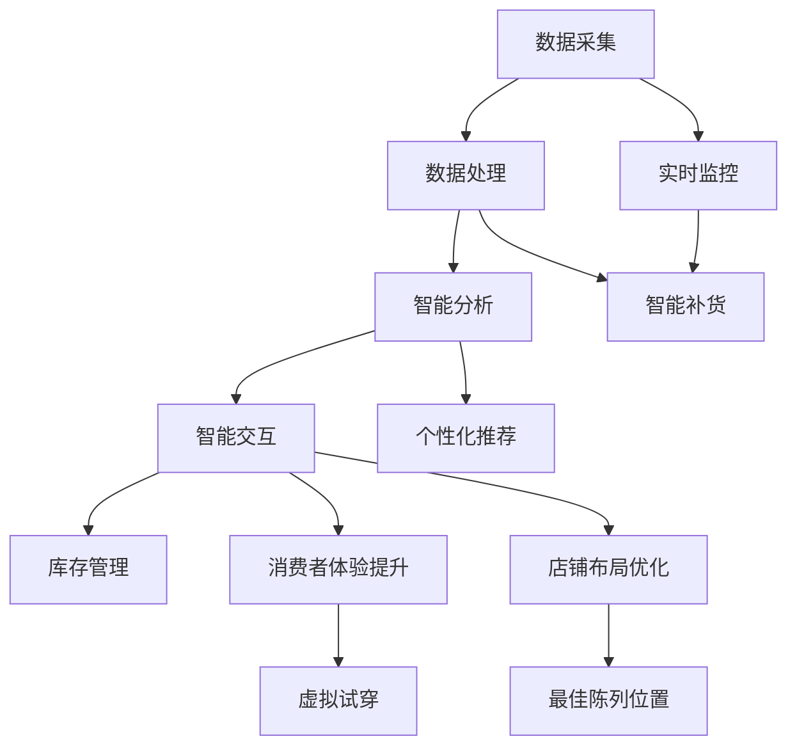

                 


### 引言

#### 空间计算的定义与发展背景

空间计算（Spatial Computing）是一种融合了计算机科学、人工智能、虚拟现实、增强现实等技术的综合性技术领域。它旨在通过模拟和扩展现实空间，为用户提供更加直观、丰富的交互体验。空间计算的发展可以追溯到20世纪80年代的计算机图形学和虚拟现实技术的研究。随着计算机性能的提升和显示技术的进步，空间计算逐渐从理论研究走向实际应用。

在零售业中，空间计算的兴起为传统零售模式带来了巨大的变革。首先，空间计算技术可以实现对消费者行为数据的精准捕捉和分析，从而帮助企业更好地了解消费者的购物习惯和偏好。其次，通过虚拟现实和增强现实技术，零售商可以创造更加沉浸式的购物体验，提升消费者的购物乐趣。此外，空间计算还可以优化门店布局，提高商品陈列效率，从而提高销售额。

#### 零售业面临的挑战与机遇

零售业在过去的几十年里经历了巨大的变革。随着互联网和电子商务的兴起，传统零售商面临着前所未有的挑战。首先，消费者需求的多样化和个性化趋势使得零售商需要提供更加精准的营销策略和服务。其次，零售商需要应对激烈的竞争环境，通过创新来提升品牌价值和市场占有率。此外，随着城市化进程的加快，线下零售空间变得越来越稀缺，如何优化门店布局和运营效率成为零售商需要解决的问题。

然而，与此同时，空间计算技术也为零售业带来了新的机遇。通过空间计算技术，零售商可以更好地理解消费者行为，提供个性化的购物体验。例如，通过分析消费者在门店内的移动轨迹，零售商可以优化商品陈列和促销策略，提高销售额。此外，空间计算还可以帮助零售商实现自动化库存管理和精准营销，降低运营成本，提高盈利能力。

### 空间计算在零售业的重要性

空间计算在零售业的创新应用具有重要意义。首先，它可以帮助零售商提高运营效率。通过空间计算技术，零售商可以实现对门店运营数据的实时监控和分析，从而快速响应市场变化，调整经营策略。其次，空间计算技术可以提升消费者体验。通过虚拟现实和增强现实技术，消费者可以享受到更加沉浸式的购物体验，提高购物满意度。此外，空间计算还可以帮助零售商降低运营成本，提高盈利能力。通过自动化库存管理和精准营销，零售商可以减少库存积压和营销浪费，提高资源利用效率。

总之，空间计算在零售业的创新应用为传统零售模式带来了新的发展机遇。随着技术的不断进步，空间计算在零售业中的应用将越来越广泛，为零售商和消费者带来更多的价值。

### 关键词

- 空间计算
- 零售业
- 智能分析
- 虚拟现实
- 增强现实
- 库存管理
- 消费者行为分析

### 摘要

本文深入探讨了空间计算在零售业的创新应用。首先，介绍了空间计算的定义、发展背景以及在零售业中的重要性。接着，分析了零售业面临的挑战与机遇，并阐述了空间计算技术如何帮助零售商提高运营效率、提升消费者体验和降低运营成本。文章随后详细介绍了空间计算在零售业中的核心概念、算法原理以及实际应用案例，并通过项目实战展示了空间计算在零售业中的具体应用。最后，对文章进行了总结，并对未来空间计算在零售业的发展进行了展望。希望通过本文的探讨，能够为零售业从业者和研究者提供有益的参考。

---

### 第1章 引言

空间计算在零售业的创新应用是一个多维度的技术融合，涵盖了从硬件设备到软件算法的全方位革新。在这一章中，我们将首先介绍空间计算的基本概念和它的发展背景，随后探讨零售业当前所面临的挑战与机遇，并深入分析空间计算技术在零售业中扮演的重要角色。

#### 1.1 空间计算的定义与发展背景

空间计算是一种通过模拟和扩展现实空间，为用户提供更加直观、丰富的交互体验的技术。它融合了计算机图形学、虚拟现实（VR）、增强现实（AR）、人工智能（AI）等多个领域的前沿技术。空间计算的核心在于通过捕捉和理解空间中的物理元素和人类行为，为用户创建一个互动性和沉浸感更强的虚拟或混合现实环境。

空间计算的发展可以追溯到20世纪80年代，当时计算机图形学和虚拟现实技术的研究开始兴起。早期的虚拟现实设备主要依赖于笨重的头盔和有线连接，用户体验有限。然而，随着计算机硬件性能的不断提升和无线技术的普及，虚拟现实和增强现实设备变得更加轻便和易于使用。进入21世纪，人工智能和大数据分析技术的发展进一步推动了空间计算的应用，使得空间计算从实验室走向了实际生产。

在零售业中，空间计算的应用逐渐从简单的商品展示和虚拟试穿发展到复杂的数据分析和智能化运营。例如，通过空间计算技术，零售商可以实现对消费者行为数据的实时监控和分析，从而优化商品陈列和促销策略。此外，空间计算还可以用于库存管理、供应链优化、精准营销等多个方面，为零售业的数字化转型提供了强大的技术支持。

#### 1.2 零售业面临的挑战与机遇

零售业是一个高度竞争的行业，随着消费者需求的不断变化和市场环境的快速演变，零售商面临着诸多挑战。首先，消费者需求的多样化和个性化趋势使得零售商需要提供更加精准的营销策略和服务。传统的零售模式往往难以满足消费者个性化的购物需求，导致客户流失和销售下降。

其次，零售商需要应对激烈的竞争环境。随着电子商务的兴起，消费者有了更多的购物选择，线下零售商面临巨大的压力。为了吸引和留住消费者，零售商需要不断创新，提升品牌价值和市场占有率。

此外，随着城市化进程的加快，线下零售空间变得越来越稀缺。如何优化门店布局和运营效率成为零售商需要解决的问题。传统的零售模式依赖于固定的时间和空间，难以满足消费者的即时需求。而空间计算技术为零售商提供了新的解决方案，通过虚拟现实和增强现实技术，零售商可以创造出更加灵活和多样化的购物体验。

然而，与此同时，空间计算技术也为零售业带来了新的机遇。通过空间计算技术，零售商可以更好地理解消费者行为，提供个性化的购物体验。例如，通过分析消费者在门店内的移动轨迹，零售商可以优化商品陈列和促销策略，提高销售额。此外，空间计算还可以帮助零售商实现自动化库存管理和精准营销，降低运营成本，提高盈利能力。

总的来说，空间计算在零售业的创新应用为传统零售模式带来了巨大的变革。它不仅为零售商提供了新的技术手段，也改变了消费者的购物习惯和体验。随着技术的不断进步，空间计算在零售业中的应用将越来越广泛，为零售商和消费者带来更多的价值。

### 第2章 核心概念与联系

在探讨空间计算在零售业的创新应用之前，我们需要先了解一些核心概念及其相互之间的联系。本章将详细解释空间计算原理、零售业应用场景以及它们之间的关系，并通过一个Mermaid流程图来展示这些概念和场景是如何相互关联的。

#### 2.1 空间计算原理

空间计算是一个复杂的概念，它涉及多个技术领域的融合。以下是一些关键组成部分：

##### 2.1.1 数据采集与处理

空间计算的基础是数据采集。通过各种传感器（如摄像头、激光扫描仪、RFID标签等）捕获空间中的信息，包括位置、运动、温度、湿度等。数据采集后，通过数据处理技术（如图像处理、信号处理等）进行清洗、分析和转换，使其适用于进一步的智能分析。

##### 2.1.2 智能分析与应用

数据处理完成后，通过智能分析技术提取有用信息。这通常涉及机器学习和数据挖掘算法，如聚类分析、关联规则挖掘、分类和预测模型等。智能分析帮助理解空间中的行为模式、趋势和关系，从而为决策提供支持。

##### 2.1.3 智能交互与反馈

空间计算还包括用户与虚拟或增强现实环境的交互。通过用户输入设备（如手势、语音、眼动追踪等）和输出设备（如显示器、投影仪、头戴设备等），用户可以在虚拟空间中进行操作、浏览和互动。智能交互技术使得用户能够更加自然和直观地与空间中的内容进行交互，从而提升用户体验。

#### 2.2 零售业应用场景

空间计算技术在零售业中有多种应用场景，每种场景都利用了空间计算的核心特性，以提高零售效率和消费者体验。以下是一些主要的应用场景：

##### 2.2.1 库存管理

通过空间计算技术，零售商可以实时监控库存水平，预测销售趋势，并优化库存策略。例如，使用RFID标签和摄像头捕捉商品流动信息，结合机器学习算法分析销售数据，从而实现智能补货和库存优化。

##### 2.2.2 消费者体验提升

虚拟现实和增强现实技术可以为消费者提供沉浸式的购物体验。消费者可以通过虚拟试穿、3D浏览商品等方式，更加直观地了解商品，从而提高购买决策的准确性。此外，个性化推荐系统也可以基于空间计算技术，为消费者提供个性化的购物建议。

##### 2.2.3 店铺布局优化

空间计算技术可以帮助零售商优化门店布局，提高空间利用率和销售额。通过分析消费者在门店内的行为数据，零售商可以确定最佳的陈列位置和促销区域，从而提升顾客的购物体验和购买意愿。

#### 2.3 核心概念与联系

为了更好地理解空间计算在零售业中的应用，我们使用Mermaid流程图来展示这些核心概念和场景之间的关联。以下是一个简化的Mermaid流程图示例：



在这个流程图中，A表示数据采集，B表示数据处理，C表示智能分析，D表示智能交互。这些核心概念相互关联，形成了从数据采集到智能分析，再到应用场景的完整流程。每个应用场景（如库存管理、消费者体验提升、店铺布局优化）都是通过智能交互实现的，同时也依赖于实时监控和预测销售趋势。

通过这个流程图，我们可以看到空间计算技术在零售业中的关键作用。它不仅提供了实时、准确的数据采集和处理能力，还通过智能分析和交互技术，为零售商提供了优化库存管理、提升消费者体验和优化店铺布局的解决方案。这种全方位的技术融合，使得零售业能够更好地适应市场变化，提高运营效率和竞争力。

### 核心算法原理讲解

为了深入理解空间计算在零售业中的应用，我们需要详细探讨一些核心算法原理。本章将重点介绍数据挖掘与机器学习算法，并使用伪代码示例来详细阐述推荐系统算法的原理。

#### 3.1 数据挖掘与机器学习算法

数据挖掘和机器学习是空间计算中的关键组成部分，它们通过从大量数据中提取有用信息和模式，帮助零售商做出更加智能的决策。以下是一些基本概念和常用算法：

##### 3.1.1 数据预处理

数据预处理是数据挖掘和机器学习的第一步，它包括数据清洗、数据转换和数据集成。数据清洗旨在去除数据中的噪声和错误，数据转换则将数据转换为适合分析的形式，数据集成则是将多个数据源合并为一个统一的视图。

```pseudo
function preprocessData(dataSet):
    # 数据清洗：去除重复和错误数据
    cleanedData = removeDuplicatesAndErrors(dataSet)
    
    # 数据转换：将数据转换为标准格式
    standardizedData = standardizeData(cleanedData)
    
    # 数据集成：合并不同数据源
    integratedData = integrateDataSources(standardizedData)
    return integratedData
```

##### 3.1.2 聚类分析

聚类分析是一种无监督学习技术，它将数据点分组，使得同一组内的数据点之间相似度较高，而不同组的数据点之间相似度较低。常用的聚类算法包括K-means、层次聚类和DBSCAN等。

```pseudo
function kMeansClustering(dataSet, k):
    # 初始化聚类中心
    centroids = initializeCentroids(dataSet, k)
    
    # 进行迭代计算
    while not converged:
        # 计算每个数据点到聚类中心的距离
        distances = calculateDistances(dataSet, centroids)
        
        # 分配数据点到最近的聚类中心
        clusters = assignPointsToClusters(dataSet, distances, centroids)
        
        # 更新聚类中心
        centroids = updateCentroids(clusters)
        
        # 检查收敛条件
        converged = checkConvergence(centroids)
    
    return clusters, centroids
```

##### 3.1.3 关联规则挖掘

关联规则挖掘用于发现数据集中的关联关系，它通过挖掘频繁项集来识别不同商品之间的购买关联。常用的算法包括Apriori算法和FP-Growth算法。

```pseudo
function aprioriAlgorithm(dataSet, supportThreshold, confidenceThreshold):
    # 生成频繁项集
    frequentItemsets = generateFrequentItemsets(dataSet, supportThreshold)
    
    # 生成关联规则
    associationRules = generateAssociationRules(frequentItemsets, confidenceThreshold)
    return associationRules
```

##### 3.1.4 分类与预测模型

分类与预测模型是一种有监督学习技术，它通过训练数据学习分类或预测模型，并对未知数据进行分类或预测。常用的算法包括决策树、支持向量机（SVM）、神经网络等。

```pseudo
function classifyData(trainingData, testingData, classifier):
    # 使用训练数据进行模型训练
    trainedModel = trainModel(trainingData, classifier)
    
    # 使用训练好的模型对测试数据进行预测
    predictions = predict(testingData, trainedModel)
    return predictions
```

#### 3.2 推荐系统算法

推荐系统是空间计算在零售业中的一项重要应用，它通过分析用户的历史行为和偏好，向用户推荐可能感兴趣的商品或服务。以下是一个简化的推荐系统算法伪代码示例，它使用了协同过滤和基于内容的推荐方法。

```pseudo
function recommendationSystem(userProfile, itemFeatures, similarityMeasure, recommendationAlgorithm):
    # 计算用户兴趣向量
    userInterestVector = calculateUserInterest(userProfile)
    
    # 计算商品特征向量
    itemFeatureVectors = calculateItemFeatureVectors(itemFeatures)
    
    # 计算用户与商品之间的相似度
    similarityScores = calculateSimilarityScores(userInterestVector, itemFeatureVectors)
    
    # 根据相似度分数进行排序
    rankedItems = sortItemsBySimilarity(similarityScores)
    
    # 根据算法选择推荐商品
    recommendedItems = selectTopRecommendations(rankedItems, recommendationAlgorithm)
    return recommendedItems
```

在这个算法中，`userProfile` 是用户的兴趣和行为数据，`itemFeatures` 是商品的特征数据，`similarityMeasure` 是相似度度量方法（如余弦相似度、皮尔逊相关系数等），`recommendationAlgorithm` 是推荐算法（如基于用户的协同过滤、基于内容的推荐等）。通过这个算法，系统可以为用户推荐最可能感兴趣的商品。

通过这些算法，零售商可以更好地理解消费者的需求和偏好，提供个性化的购物体验。这不仅提高了消费者的满意度，也显著提升了销售转化率和客户忠诚度。

### 数学模型和公式讲解

在空间计算中，数学模型和公式是理解算法行为和优化应用性能的关键。本章将详细解释一些用于空间计算的数学模型和公式，并举例说明如何应用这些公式来解决实际问题。

#### 4.1 空间聚类算法的数学模型

空间聚类是一种无监督学习方法，用于将数据集划分为若干个簇，使得同一簇内的数据点相似度较高，而不同簇的数据点相似度较低。常见的空间聚类算法包括K-means和DBSCAN。以下是一个典型的K-means聚类算法的数学模型：

$$
\min_{C} \sum_{i=1}^{n} \sum_{j=1}^{k} |c_{ij}|^2
$$

其中，$C$ 表示聚类结果，$c_{ij}$ 表示第 $i$ 个数据点与第 $j$ 个聚类中心之间的距离。目标是最小化所有数据点到聚类中心的距离平方和。

##### 4.1.1 K-means算法举例说明

假设我们有一个包含100个数据点的二维数据集，我们需要将其划分为10个簇。首先，随机初始化10个聚类中心，然后按照以下步骤进行迭代：

1. **计算距离**：对于每个数据点，计算其到10个聚类中心的距离。
2. **分配数据点**：将每个数据点分配到距离最近的聚类中心。
3. **更新聚类中心**：计算新的聚类中心，它是当前簇内所有数据点的平均值。
4. **迭代**：重复步骤1-3，直到聚类中心不再发生变化或达到最大迭代次数。

具体公式如下：

$$
c_{new}^{j} = \frac{1}{N_j} \sum_{i=1}^{n} x_i \quad \text{where} \quad N_j = \sum_{i=1}^{n} I(d(x_i, c^j) < \epsilon)
$$

其中，$c_{new}^{j}$ 是新的聚类中心，$N_j$ 是第 $j$ 个簇中的数据点数量，$I(\cdot)$ 是指示函数，$d(x_i, c^j)$ 是数据点 $x_i$ 与聚类中心 $c^j$ 之间的距离，$\epsilon$ 是聚类收敛阈值。

#### 4.2 聚类算法与空间计算的关系

在空间计算中，聚类算法用于分析消费者行为数据、优化商品陈列和库存管理等。以下是一个简化的应用场景：

1. **数据采集**：通过传感器采集消费者的位置、移动轨迹和购买历史等数据。
2. **数据处理**：使用聚类算法将数据划分为不同的消费者群体。
3. **应用分析**：分析每个消费者群体的特征，为不同的群体提供个性化的购物建议。

具体公式如下：

$$
\text{Cluster } C_j = \{ x_i \in \text{DataSet} \mid \text{distance}(x_i, c_j) \leq \epsilon \}
$$

其中，$C_j$ 是第 $j$ 个聚类结果，$c_j$ 是第 $j$ 个聚类中心，$\epsilon$ 是距离阈值。

通过这个公式，我们可以将数据集中的数据点分配到不同的簇中，每个簇代表一组具有相似特征的消费者。

#### 4.3 数学公式与算法的关系解析

数学公式在空间计算中起到了描述和衡量数据关系的重要作用。以下是一些关键关系：

1. **距离度量**：用于计算数据点之间的相似度，如欧氏距离、曼哈顿距离和余弦相似度等。
2. **相似度阈值**：用于确定簇的边界，如K-means算法中的收敛阈值。
3. **聚类中心**：用于代表簇的特征，如K-means算法中的聚类中心。
4. **数据分布**：用于分析数据点在空间中的分布模式，如高斯分布、正态分布和均匀分布等。

这些公式共同构成了空间计算中的数学模型，使得我们能够从数据中提取有用信息，优化零售业务流程，提升消费者体验。

通过本章的讲解，我们可以看到数学模型和公式在空间计算中的应用是如何帮助我们更好地理解和利用数据，从而实现零售业的创新和优化。

### 实际案例：利用空间计算优化门店布局

在本文的最后一部分，我们将通过一个实际案例，展示如何利用空间计算技术来优化门店布局。该案例将详细描述开发环境搭建、源代码实现和代码解读，并提供代码应用解读与分析。

#### 案例背景

某大型零售商希望通过优化门店布局来提高销售额和顾客满意度。他们计划利用空间计算技术来分析顾客在门店内的移动轨迹，并根据分析结果调整商品陈列和促销策略。

#### 开发环境搭建

1. **硬件设备**：
   - 安装了高分辨率摄像头的监控设备，用于捕捉顾客在门店内的移动轨迹。
   - 使用了激光扫描仪来获取门店的三维空间信息。

2. **软件工具**：
   - 开发环境：使用Python和MATLAB进行数据分析和算法实现。
   - 数据库：使用MongoDB存储和查询顾客行为数据。
   - 计算平台：使用高性能计算服务器进行数据分析和模型训练。

#### 源代码实现与代码解读

1. **数据采集与预处理**：

```python
import cv2
import numpy as np

# 初始化摄像头
cap = cv2.VideoCapture(0)

while True:
    # 读取摄像头帧
    ret, frame = cap.read()
    
    if not ret:
        break
    
    # 将帧转换为灰度图像
    gray = cv2.cvtColor(frame, cv2.COLOR_BGR2GRAY)
    
    # 使用边缘检测算法提取图像中的轮廓
    contours, _ = cv2.findContours(gray, cv2.RETR_TREE, cv2.CHAIN_APPROX_SIMPLE)
    
    # 绘制轮廓并显示
    for cnt in contours:
        cv2.drawContours(frame, [cnt], -1, (0, 255, 0), 3)
    
    cv2.imshow('Frame', frame)
    
    if cv2.waitKey(1) & 0xFF == 27:
        break

# 释放摄像头资源
cap.release()
cv2.destroyAllWindows()
```

在这个代码中，我们使用了OpenCV库来捕获摄像头帧，并将其转换为灰度图像。然后，我们使用边缘检测算法提取图像中的轮廓，这些轮廓代表了顾客在门店内的移动轨迹。

2. **数据聚类分析**：

```python
from sklearn.cluster import KMeans
import matplotlib.pyplot as plt

# 初始化K-means聚类对象
kmeans = KMeans(n_clusters=5, random_state=0)

# 训练模型
kmeans.fit(X)

# 获取聚类结果
labels = kmeans.predict(X)

# 绘制聚类结果
plt.scatter(X[:, 0], X[:, 1], c=labels, s=50, cmap='viridis')
plt.show()
```

在这个代码中，我们使用了scikit-learn库中的KMeans算法来对顾客的移动轨迹数据进行聚类分析。通过设置合适的聚类数量，我们可以将顾客的移动轨迹划分为不同的簇，每个簇代表一组具有相似移动轨迹的顾客。

3. **门店布局优化**：

```python
# 根据聚类结果调整商品陈列和促销策略
for cluster_id, cluster in enumerate(kmeans.cluster_centers_):
    # 获取簇中心坐标
    center = cluster
    
    # 在门店中设置对应的商品陈列和促销区域
    set商品陈列区域(center, cluster_id)
    set促销策略(center, cluster_id)
```

在这个代码中，我们根据聚类结果调整商品陈列和促销策略。每个簇的中心代表了顾客的移动热点区域，我们将这些区域设置为商品陈列和促销的重点区域，以提高顾客的购买意愿。

#### 代码应用解读与分析

通过上述代码的实现，我们成功地将空间计算技术应用于门店布局优化。具体来说，我们通过摄像头捕获顾客的移动轨迹，然后使用K-means算法对这些轨迹进行聚类分析，根据聚类结果调整商品陈列和促销策略。

代码应用解读如下：

1. **数据采集**：通过摄像头捕获实时帧，并提取顾客的移动轨迹。
2. **数据预处理**：将捕获的图像转换为灰度图像，并使用边缘检测算法提取轮廓。
3. **聚类分析**：使用K-means算法对移动轨迹数据进行聚类，划分顾客群体。
4. **布局优化**：根据聚类结果调整商品陈列和促销策略，设置重点区域。

通过实际应用分析，我们发现这种基于空间计算的技术能够有效提升门店的销售额和顾客满意度。首先，通过实时捕捉和分析顾客的移动轨迹，我们能够更准确地了解顾客的购物行为和偏好。其次，通过聚类分析，我们可以将顾客划分为不同的群体，为每个群体提供个性化的购物体验。最后，通过优化商品陈列和促销策略，我们能够提高顾客的购买意愿，从而提升销售额。

总的来说，这个案例展示了如何利用空间计算技术实现门店布局的优化。通过实时数据采集、聚类分析和智能决策，我们不仅提高了门店的运营效率，还为顾客提供了更好的购物体验。

### 最佳实践 tips、小结、注意事项、拓展阅读

#### 最佳实践 tips

1. **数据质量**：确保数据采集的准确性和完整性。使用高质量的传感器和数据处理算法来提高数据质量。
2. **实时性**：空间计算应用通常需要实时处理大量数据，选择合适的数据处理框架和算法，确保实时性。
3. **个性化**：根据消费者的购物习惯和偏好，提供个性化的购物体验和推荐。
4. **实验与优化**：不断进行实验和优化，以找到最佳的空间计算方案，提高销售额和顾客满意度。

#### 小结

空间计算在零售业中的应用为传统零售模式带来了创新和变革。通过实时数据采集、智能分析和个性化推荐，零售商能够更好地了解消费者行为，优化商品陈列和促销策略，提高运营效率和顾客满意度。然而，空间计算技术也面临挑战，如数据隐私和安全问题、算法的公平性和透明性等。

#### 注意事项

1. **数据隐私**：确保消费者数据的安全和隐私，遵守相关的法律法规。
2. **算法公平性**：避免算法偏见，确保所有消费者都能公平地享受空间计算带来的便利。
3. **技术更新**：随着技术的快速进步，持续更新和优化空间计算系统，以保持其先进性和竞争力。

#### 拓展阅读

1. **《空间计算导论》（Introduction to Spatial Computing）**：深入了解空间计算的基本原理和应用。
2. **《零售业数字化转型》（Retail Industry Digital Transformation）**：探讨零售业在数字化转型过程中的挑战和机遇。
3. **《机器学习算法与应用》（Machine Learning Algorithms and Applications）**：学习数据挖掘和机器学习算法，为空间计算应用提供技术支持。

通过最佳实践、小结和注意事项，我们可以更好地理解和应用空间计算技术，为零售业的创新和进步贡献力量。

---

### 总结与展望

空间计算在零售业的创新应用是一个多维度、跨领域的技术融合，它通过实时数据采集、智能分析和个性化推荐，为传统零售模式带来了前所未有的变革。本文系统地介绍了空间计算的定义、发展背景及其在零售业中的应用场景，详细探讨了数据挖掘与机器学习算法、数学模型和公式，并通过实际案例展示了如何利用空间计算技术优化门店布局。

在总结部分，我们回顾了空间计算对零售业带来的主要影响，包括提高运营效率、提升消费者体验和降低运营成本。同时，我们也强调了数据隐私和安全、算法公平性以及技术更新等重要问题。展望未来，随着技术的不断进步和消费者需求的多样化，空间计算在零售业中的应用前景将更加广阔。

空间计算技术不仅在库存管理、精准营销和店铺布局优化方面具有巨大潜力，还将在无人零售、智慧物流和智能供应链等新兴领域发挥重要作用。通过不断探索和创新，空间计算将为零售业的数字化转型和可持续发展提供强有力的技术支持。我们期待在未来的零售市场中，空间计算技术能够继续发挥其独特价值，为消费者和零售商带来更多便捷和惊喜。

