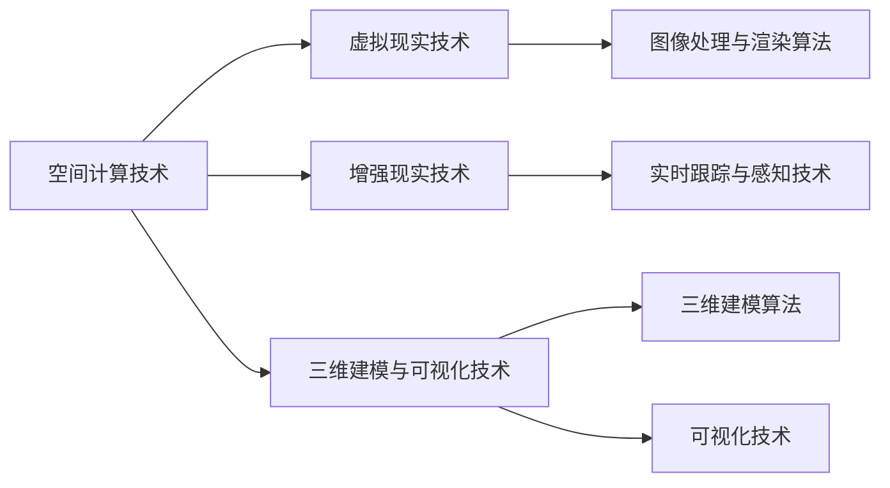
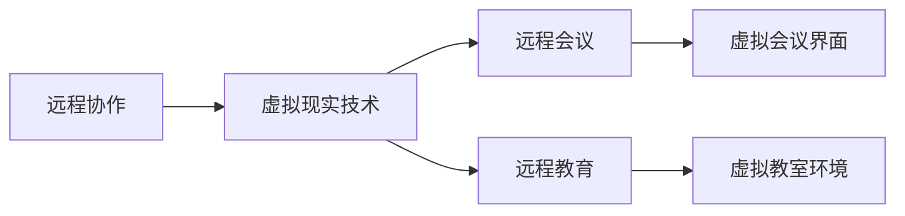
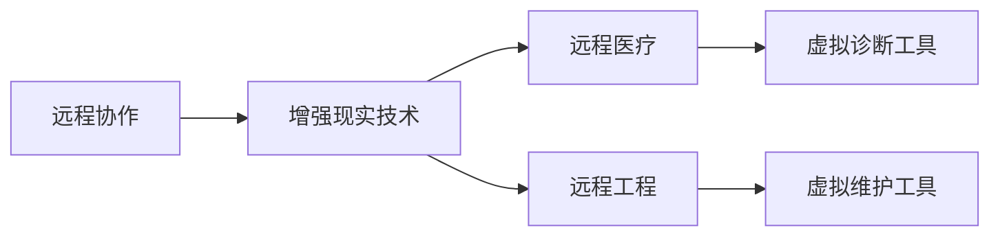
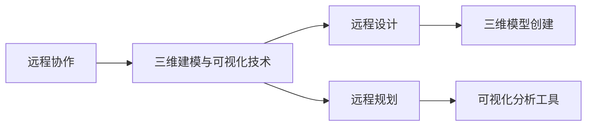
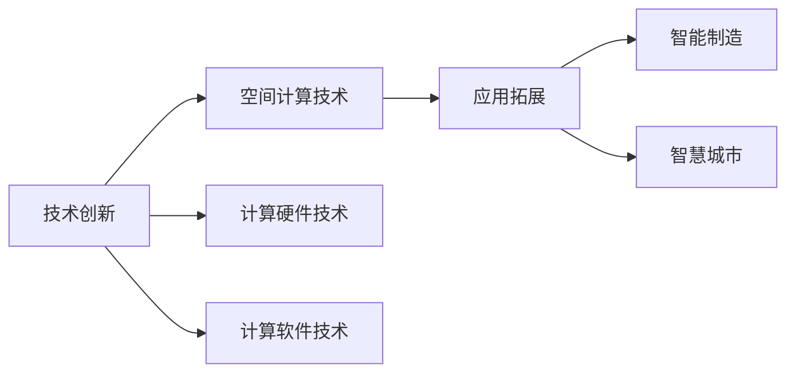

                 


### 文章标题

《空间计算技术在远程协作中的作用》

> 关键词：空间计算、远程协作、虚拟现实、增强现实、三维建模与可视化

> 摘要：
本文从空间计算技术的定义和基础入手，详细阐述了虚拟现实、增强现实和三维建模与可视化技术在不同场景下远程协作中的应用。通过分析这些技术的基本原理、算法、数学模型和实际案例，探讨了空间计算技术在远程协作中的重要作用和未来发展趋势。

## 第一部分：空间计算技术基础

### 第1章：空间计算技术概述

空间计算技术是计算机科学和人工智能领域的一个重要分支，它通过将计算机技术扩展到三维空间，实现虚拟环境中的信息处理和交互。在远程协作中，空间计算技术具有不可替代的作用，它能够提升协作效率，增强用户体验，打破地域限制。

#### 核心概念与联系

空间计算技术涉及的核心概念包括：

1. **虚拟现实（VR）**：通过计算机生成模拟环境，使用户沉浸在虚拟世界中。
2. **增强现实（AR）**：在现实世界中叠加计算机生成的信息，增强用户的感知体验。
3. **三维建模与可视化**：创建和展示三维模型，实现对复杂空间信息的直观表达。

这些技术之间的联系体现在：

- 虚拟现实和增强现实技术都涉及到三维空间信息的处理，但应用场景和目的有所不同。
- 三维建模与可视化技术为虚拟现实和增强现实提供了基础数据支持。

#### 架构图

空间计算技术架构示意图：



#### 核心算法原理讲解

1. **虚拟现实中的图像处理与渲染算法**：使用图像处理算法生成虚拟场景，并通过渲染算法实现实时渲染。

   ```python
   # 伪代码：虚拟现实中的图像渲染
   function render_scene(scene):
       # 初始化渲染器
       renderer = initialize_renderer()
       
       # 渲染场景
       for object in scene.objects:
           render_object(renderer, object)
           
       # 输出渲染结果
       output = renderer.render()
       return output
   ```

2. **增强现实中的实时跟踪与感知技术**：利用传感器数据实时跟踪用户位置和姿态，实现对增强现实内容的准确叠加。

   ```python
   # 伪代码：增强现实中的实时跟踪
   function track_user(user):
       # 获取传感器数据
       sensors_data = get_sensor_data()
       
       # 计算用户位置和姿态
       position, orientation = calculate_position_and_orientation(sensors_data)
       
       # 更新增强现实内容
       update_ar_content(position, orientation)
   ```

3. **三维建模与可视化技术**：包括三维建模算法和可视化技术，用于创建和展示三维模型。

   ```python
   # 伪代码：三维建模
   function build_3d_model(model):
       # 创建三维模型
       vertices, faces = create_3d_model(vertices, faces)
       
       # 可视化三维模型
       visualize_model(vertices, faces)
   ```

#### 数学模型与公式

1. **空间数据传输与处理的公式**：用于描述空间数据在网络中的传输和处理过程。

   $$\text{传输速率} = \frac{\text{数据量}}{\text{传输时间}}$$

2. **虚拟现实中的三维空间计算公式**：用于计算虚拟环境中的位置、方向等参数。

   $$\text{位置} = \text{起点} + \text{方向} \times \text{距离}$$

#### 举例说明

1. **虚拟现实在远程教育中的应用**：通过虚拟现实技术，实现远程教学场景的沉浸式体验，提高学生的学习兴趣和参与度。

2. **增强现实在远程医疗中的应用**：医生可以通过增强现实技术进行远程手术指导，提高手术的准确性和安全性。

## 第二部分：空间计算技术下的远程协作应用实例

### 第2章：虚拟现实技术在远程协作中的应用

虚拟现实技术在远程协作中的应用，为人们提供了一种全新的交互方式，使远程协作更加直观、真实和高效。本章将详细介绍虚拟现实技术在远程协作中的实际应用，包括远程会议、远程教育等场景。

#### 核心概念与联系

虚拟现实技术在远程协作中的应用主要包括：

1. **远程会议**：利用虚拟现实技术，实现会议参与者的虚拟现实互动。
2. **远程教育**：通过虚拟现实技术，为学生提供沉浸式的学习体验。

这些技术的联系在于：

- 虚拟现实技术为远程协作提供了三维空间交互的界面。
- 不同场景下的应用需求决定了虚拟现实技术的具体实现方式。

#### 架构图

虚拟现实技术在远程协作中的应用架构图：



#### 核心算法原理讲解

1. **虚拟会议界面**：利用图像处理与渲染算法，生成虚拟会议场景。

   ```python
   # 伪代码：虚拟会议界面
   function create_virtual_meeting():
       # 创建会议场景
       scene = create_scene()
       
       # 渲染会议参与者
       for participant in participants:
           render_participant(scene, participant)
           
       # 输出会议界面
       output = render_scene(scene)
       return output
   ```

2. **虚拟教室环境**：利用三维建模与可视化技术，创建虚拟教室场景。

   ```python
   # 伪代码：虚拟教室环境
   function create_virtual_classroom():
       # 创建教室场景
       classroom = create_3d_model("classroom")
       
       # 添加教学工具
       for tool in teaching_tools:
           add_tool_to_classroom(classroom, tool)
           
       # 输出教室环境
       output = visualize_model(classroom)
       return output
   ```

#### 数学模型与公式

1. **三维空间计算公式**：用于计算虚拟环境中的位置、方向等参数。

   $$\text{位置} = \text{起点} + \text{方向} \times \text{距离}$$

2. **图像处理与渲染公式**：用于描述图像的处理和渲染过程。

   $$\text{输出图像} = \text{输入图像} \times \text{处理参数}$$

#### 举例说明

1. **远程会议**：使用虚拟现实技术，实现远程会议的沉浸式体验，参与者可以感受到现场的氛围和互动。

2. **远程教育**：利用虚拟现实技术，为学生提供一个三维立体的学习环境，提高学生的学习兴趣和参与度。

### 第3章：增强现实技术在远程协作中的应用

增强现实技术通过将虚拟信息叠加到现实世界中，为远程协作提供了一种更加直观和互动的体验。本章将探讨增强现实技术在远程协作中的实际应用，包括远程医疗、远程工程等场景。

#### 核心概念与联系

增强现实技术在远程协作中的应用主要包括：

1. **远程医疗**：医生可以通过增强现实技术进行远程诊断和手术指导。
2. **远程工程**：工程师可以通过增强现实技术进行远程维护和故障排查。

这些技术的联系在于：

- 增强现实技术为远程协作提供了现实与虚拟相结合的交互界面。
- 不同场景下的应用需求决定了增强现实技术的具体实现方式。

#### 架构图

增强现实技术在远程协作中的应用架构图：



#### 核心算法原理讲解

1. **虚拟诊断工具**：利用增强现实技术，将虚拟诊断信息叠加到患者身上，帮助医生进行远程诊断。

   ```python
   # 伪代码：虚拟诊断工具
   function create_virtual_diagnosis():
       # 获取患者信息
       patient_info = get_patient_info()
       
       # 创建虚拟诊断信息
       diagnosis_info = create_diagnosis_info(patient_info)
       
       # 将虚拟诊断信息叠加到患者身上
       apply_diagnosis_info_to_patient(diagnosis_info, patient)
       
       # 输出诊断结果
       output = render_diagnosis_info(diagnosis_info)
       return output
   ```

2. **虚拟维护工具**：利用增强现实技术，为工程师提供虚拟维护工具，进行远程维护和故障排查。

   ```python
   # 伪代码：虚拟维护工具
   function create_virtual_maintenance():
       # 获取设备信息
       device_info = get_device_info()
       
       # 创建虚拟维护工具
       maintenance_tools = create_maintenance_tools(device_info)
       
       # 将虚拟维护工具叠加到设备上
       apply_maintenance_tools_to_device(maintenance_tools, device)
       
       # 输出维护结果
       output = render_maintenance_tools(maintenance_tools)
       return output
   ```

#### 数学模型与公式

1. **三维空间计算公式**：用于计算虚拟环境中的位置、方向等参数。

   $$\text{位置} = \text{起点} + \text{方向} \times \text{距离}$$

2. **图像处理与渲染公式**：用于描述图像的处理和渲染过程。

   $$\text{输出图像} = \text{输入图像} \times \text{处理参数}$$

#### 举例说明

1. **远程医疗**：医生可以通过增强现实技术，实时查看患者的病情，并进行远程手术指导。

2. **远程工程**：工程师可以通过增强现实技术，进行远程设备的维护和故障排查，提高工作效率。

### 第4章：三维建模与可视化技术在远程协作中的应用

三维建模与可视化技术在远程协作中发挥着重要作用，它能够帮助人们更加直观地理解和交流复杂的信息。本章将探讨三维建模与可视化技术在远程协作中的实际应用，包括远程设计、远程规划等场景。

#### 核心概念与联系

三维建模与可视化技术在远程协作中的应用主要包括：

1. **远程设计**：利用三维建模技术，实现远程项目的设计和协作。
2. **远程规划**：利用可视化技术，实现远程规划和决策。

这些技术的联系在于：

- 三维建模技术为远程协作提供了详细的三维模型数据。
- 可视化技术为远程协作提供了直观的展示和交流方式。

#### 架构图

三维建模与可视化技术在远程协作中的应用架构图：



#### 核心算法原理讲解

1. **三维模型创建**：利用三维建模算法，创建远程项目所需的三维模型。

   ```python
   # 伪代码：三维模型创建
   function create_3d_model(model):
       # 输入设计参数
       design_params = get_design_params()
       
       # 创建三维模型
       vertices, faces = create_3d_model(vertices, faces)
       
       # 输出三维模型
       output = build_3d_model(vertices, faces)
       return output
   ```

2. **可视化分析工具**：利用可视化技术，对远程项目进行数据分析和展示。

   ```python
   # 伪代码：可视化分析工具
   function visualize_analysis(data):
       # 输入项目数据
       project_data = get_project_data()
       
       # 创建可视化图表
       chart = create_visualization_chart(data)
       
       # 输出可视化结果
       output = render_chart(chart)
       return output
   ```

#### 数学模型与公式

1. **三维空间计算公式**：用于计算三维模型中的位置、方向等参数。

   $$\text{位置} = \text{起点} + \text{方向} \times \text{距离}$$

2. **图像处理与渲染公式**：用于描述图像的处理和渲染过程。

   $$\text{输出图像} = \text{输入图像} \times \text{处理参数}$$

#### 举例说明

1. **远程设计**：设计师可以通过三维建模与可视化技术，远程协作完成项目设计，提高设计效率和准确性。

2. **远程规划**：项目经理可以通过可视化技术，对项目进度和资源进行实时分析和调整，提高项目管理效率。

## 第三部分：空间计算技术在远程协作中的未来发展趋势

### 第5章：空间计算技术的未来发展趋势

随着科技的不断发展，空间计算技术在远程协作中的应用前景将更加广阔。本章将探讨空间计算技术的未来发展趋势，包括技术创新、应用拓展等方面。

#### 核心概念与联系

空间计算技术的未来发展趋势主要包括：

1. **技术创新**：新型计算硬件和软件技术的出现，将推动空间计算技术的进一步发展。
2. **应用拓展**：空间计算技术将在更多领域得到应用，如智能制造、智慧城市等。

这些技术的联系在于：

- 技术创新为空间计算技术提供了强大的技术支撑。
- 应用拓展为空间计算技术提供了更广泛的应用场景。

#### 架构图

空间计算技术的未来发展趋势架构图：



#### 核心算法原理讲解

1. **计算硬件技术**：新型计算硬件的出现，如量子计算机、边缘计算设备等，将大大提升空间计算的性能。

   ```python
   # 伪代码：计算硬件技术
   function use_new_computing_hardware():
       # 初始化新型计算硬件
       hardware = initialize_new_hardware()
       
       # 运行空间计算任务
       run_computing_task(hardware)
       
       # 输出计算结果
       output = get_computing_result()
       return output
   ```

2. **计算软件技术**：新型计算软件的出现，如深度学习框架、分布式计算平台等，将大大提升空间计算的应用效率。

   ```python
   # 伪代码：计算软件技术
   function use_new_computing_software():
       # 初始化新型计算软件
       software = initialize_new_software()
       
       # 运行空间计算任务
       run_computing_task(software)
       
       # 输出计算结果
       output = get_computing_result()
       return output
   ```

#### 数学模型与公式

1. **计算性能提升公式**：用于描述新型计算硬件和软件技术对计算性能的提升。

   $$\text{计算性能} = \text{新型硬件} \times \text{新型软件}$$

2. **计算效率提升公式**：用于描述新型计算硬件和软件技术对计算效率的提升。

   $$\text{计算效率} = \frac{\text{计算结果}}{\text{计算时间}}$$

#### 举例说明

1. **智能制造**：通过空间计算技术，实现生产过程的实时监控和优化，提高生产效率和产品质量。

2. **智慧城市**：通过空间计算技术，实现城市管理的智能化，提高城市运行效率和居民生活质量。

## 附录：空间计算技术资源与工具推荐

### 附录1：空间计算技术相关书籍推荐

1. **《空间计算技术导论》**：详细介绍了空间计算技术的基本概念、原理和应用。
2. **《虚拟现实与增强现实技术》**：全面阐述了虚拟现实和增强现实技术的基本原理和应用案例。

### 附录2：空间计算技术在线课程推荐

1. **《空间计算技术基础》**：由知名大学或机构提供的免费在线课程，适合初学者入门。
2. **《虚拟现实与增强现实开发实战》**：针对虚拟现实和增强现实技术的实际应用，提供详细的开发教程。

### 附录3：空间计算技术工具与平台推荐

1. **Unity**：一款功能强大的游戏引擎，支持虚拟现实和增强现实应用程序的开发。
2. **Unity 3D Max**：一款专业的三维建模和渲染软件，适用于三维建模与可视化技术的开发。

### 附录4：最佳实践 tips

1. **优化网络传输**：为了确保远程协作的流畅性，应优化空间计算数据的网络传输。
2. **提高计算性能**：利用新型计算硬件和软件技术，提高空间计算的性能和效率。

### 附录5：小结

空间计算技术在远程协作中具有广泛的应用前景，通过虚拟现实、增强现实和三维建模与可视化技术，可以显著提高远程协作的效率和质量。未来，随着技术的不断发展和创新，空间计算技术在远程协作中的应用将更加广泛，为各行各业带来新的机遇和挑战。

### 附录6：注意事项

1. **隐私保护**：在远程协作中，应确保用户数据的隐私和安全。
2. **技术成熟度**：部分空间计算技术尚处于研发阶段，实际应用中可能面临技术成熟度的问题。

### 附录7：拓展阅读

1. **《空间计算技术的发展与应用》**：一本系统介绍空间计算技术发展历程和应用领域的学术著作。
2. **《远程协作技术综述》**：一篇关于远程协作技术现状和未来发展趋势的综述文章。

### 附录8：作者信息

**作者：AI天才研究院/AI Genius Institute & 禅与计算机程序设计艺术 /Zen And The Art of Computer Programming**

