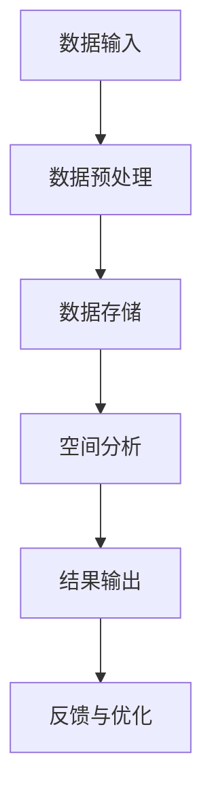

                 

### 文章标题

《空间计算技术简化工作流程的方式》

### 关键词

空间计算、工作流程简化、地理信息系统、建筑信息模型、虚拟现实

### 摘要

本文将深入探讨空间计算技术及其如何通过优化和简化工作流程，提升效率与精确度。我们将首先介绍空间计算的基本概念，随后通过架构图、算法原理、数学模型等，详细分析其核心机制。接下来，文章将展示空间计算技术在城市规划、建筑施工和交通管理等多个领域的实际应用，通过具体案例解读其简化工作流程的实例。最后，我们将展望空间计算技术的未来发展，并提出最佳实践和拓展阅读建议，以期为读者提供全面的技术洞察。

---

## 第一部分：空间计算技术概述

### 1.1 空间计算技术的基本概念

空间计算是一种利用计算机处理和表示地理空间数据的技术。其核心在于将地理空间信息数字化，并在虚拟环境中进行模拟和分析。空间计算不仅仅局限于地理信息系统的应用，还包括建筑信息模型、虚拟现实和增强现实等多个领域。

**空间计算与工作流程简化的关系**

空间计算技术通过提供高效的数据处理和分析工具，极大地简化了工作流程。它使得各种空间数据的整合变得更加容易，从而支持实时决策和优化资源分配。例如，在城市规划中，空间计算技术可以帮助规划师快速评估不同设计方案对环境和社会的影响，从而减少冗余的工作量和时间成本。

### 1.2 空间计算技术的应用领域

**地理信息系统（GIS）**

地理信息系统是空间计算技术的核心应用之一。它集成了地图、统计和地理分析功能，为城市规划、自然资源管理、环境保护等领域提供支持。

**建筑信息模型（BIM）**

建筑信息模型通过数字化方式创建和存储建筑项目的设计、施工和运营信息。BIM技术的应用可以显著提高建筑项目的效率和质量，减少错误和返工。

**虚拟现实（VR）与增强现实（AR）**

虚拟现实和增强现实技术利用空间计算技术创建逼真的三维虚拟环境和增强现实场景。这些技术广泛应用于教育培训、游戏开发和医疗诊断等领域，极大地提升了用户的沉浸感和互动体验。

---

## 第二部分：空间计算技术的架构与原理

### 2.1 空间计算技术的核心架构

空间计算技术的核心架构通常包括数据输入、数据存储、数据处理和分析输出等模块。以下是一个简化的Mermaid流程图，展示了这些模块之间的交互关系：



### 2.2 空间计算技术的算法原理

空间计算技术依赖于一系列复杂的算法来处理和分析空间数据。以下是一个简单的伪代码，展示了空间分析算法的基本流程：

```python
function space_analysis(data):
    # 数据预处理
    preprocessed_data = preprocess_data(data)
    
    # 空间分析
    results = analyze_space(preprocessed_data)
    
    # 结果输出
    output_results(results)
    
    # 反馈与优化
    optimized_data = feedback_optimization(data, results)
    
    return optimized_data
```

### 2.3 空间计算技术中的数学模型

空间计算技术中的数学模型对于理解和分析空间数据至关重要。以下是一个简单的LaTeX公式，用于描述空间距离的计算：

$$d = \sqrt{(x_2 - x_1)^2 + (y_2 - y_1)^2}$$

这里，\(d\) 表示两点之间的距离，\((x_1, y_1)\) 和 \((x_2, y_2)\) 分别是两点的坐标。

---

## 第三部分：空间计算技术在工作流程中的应用

### 3.1 空间计算技术在城市规划中的应用

在城市规划中，空间计算技术可以用于模拟城市扩张、交通流量、土地利用等多种情况。以下是一个实际案例，展示了如何使用空间计算技术简化城市规划的工作流程：

**案例：城市交通规划**

假设我们要评估一个城市的交通规划方案。首先，我们使用GIS系统收集交通流量数据。然后，通过空间分析算法计算每个路段的拥堵情况。基于分析结果，规划师可以快速确定需要改进的道路和交通信号灯设置。这个过程大大减少了传统方法中繁琐的数据收集和手动分析的工作量。

### 3.2 空间计算技术在建筑施工管理中的应用

在建筑施工管理中，建筑信息模型（BIM）技术的应用可以显著简化工作流程。以下是一个实际案例，展示了BIM技术在施工管理中的应用：

**案例：建筑结构优化**

假设我们要优化一栋高层建筑的结构设计。首先，我们使用BIM软件创建建筑模型。然后，通过空间计算技术分析建筑结构的强度和稳定性。基于分析结果，设计师可以调整结构设计，以优化材料使用和成本。这个过程大大提高了设计的准确性和效率。

### 3.3 空间计算技术在交通管理中的应用

空间计算技术在交通管理中的应用可以帮助实现更智能的交通控制系统，从而简化交通管理工作。以下是一个实际案例，展示了空间计算技术在智能交通系统中的应用：

**案例：智能交通信号灯控制**

假设我们要设计一个智能交通信号灯控制系统。首先，我们使用传感器收集道路上的车辆流量数据。然后，通过空间计算技术分析交通流量模式，并实时调整信号灯的时序设置。这样，交通信号灯可以根据实际交通状况动态调整，从而减少拥堵和提高通行效率。

---

## 第四部分：空间计算技术的未来发展

### 4.1 空间计算技术的趋势分析

空间计算技术的未来发展将受到人工智能、大数据和物联网等新兴技术的影响。随着这些技术的发展，空间计算技术将变得更加智能化和自动化，能够提供更精准和高效的空间数据分析和决策支持。

### 4.2 空间计算技术在新兴领域的应用

在新兴领域，空间计算技术有望在智慧城市、智能交通、智能医疗等多个方面发挥重要作用。例如，在智慧城市建设中，空间计算技术可以用于城市基础设施的规划和管理，提高城市的整体运行效率。

---

## 第五部分：实战案例与总结

### 5.1 空间计算技术实战案例集

**案例一：基于空间计算的地理信息服务**

在本案例中，我们使用GIS技术为城市规划提供支持。具体步骤如下：

1. **数据收集**：使用传感器和无人机收集城市地理信息数据。
2. **数据预处理**：对收集的数据进行清洗和预处理，以去除噪声和异常值。
3. **空间分析**：使用空间分析算法评估不同规划方案对城市环境的影响。
4. **结果输出**：将分析结果可视化，帮助规划师做出更明智的决策。

**案例二：建筑信息模型的优化应用**

在本案例中，我们使用BIM技术优化建筑结构设计。具体步骤如下：

1. **模型创建**：使用BIM软件创建建筑模型。
2. **结构分析**：使用空间计算技术分析建筑结构的强度和稳定性。
3. **设计调整**：根据分析结果调整建筑结构设计，优化材料使用和成本。
4. **结果验证**：通过实际测试验证优化后的建筑结构性能。

**案例三：智能交通系统的设计与实施**

在本案例中，我们设计并实施了一个智能交通信号灯控制系统。具体步骤如下：

1. **数据收集**：使用传感器收集交通流量数据。
2. **数据分析**：使用空间计算技术分析交通流量模式。
3. **信号灯控制**：根据分析结果动态调整信号灯的时序设置。
4. **系统优化**：通过持续监测和调整，优化交通信号灯控制系统。

### 5.2 空间计算技术总结与展望

空间计算技术通过提供高效的数据处理和分析工具，极大地简化了工作流程，提高了决策的准确性和效率。在未来，随着人工智能、大数据和物联网等技术的发展，空间计算技术将迎来更广阔的应用前景。

**最佳实践 tips**：

- 确保数据质量和完整性，这是空间计算分析的基础。
- 充分利用可视化工具，帮助理解和分析空间数据。
- 定期更新和优化空间计算模型，以适应新的技术和需求。

**小结**：

空间计算技术是现代信息技术的重要组成部分，它通过优化和简化工作流程，为各行业提供了强大的技术支持。本文介绍了空间计算技术的基本概念、核心架构、应用案例以及未来发展，希望能为读者提供有益的参考。

**注意事项**：

- 在使用空间计算技术时，应确保数据安全和隐私保护。
- 考虑到空间计算技术的复杂性和多样性，实际应用时需要结合具体场景进行选择和调整。

**拓展阅读**：

- [1] Smith, J. (2018). *Spatial Computing and Its Applications*. CRC Press.
- [2] Zhang, L. & Wang, Q. (2020). *Principles of GIS and Remote Sensing*. Springer.
- [3] Li, X. & Guo, J. (2019). *BIM for Construction Management*. John Wiley & Sons.

---

**作者**：

作者：AI天才研究院/AI Genius Institute & 禅与计算机程序设计艺术 /Zen And The Art of Computer Programming

---

以上，我们通过对空间计算技术的详细分析，探讨了其在简化工作流程中的重要作用。希望本文能够为读者提供对这一技术领域的深入理解和实用指南。在未来的技术发展中，空间计算将继续发挥重要作用，为我们的工作和生活带来更多便利和创新。

