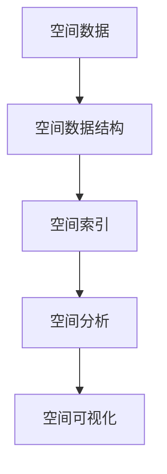

                 


### 空间计算技术概述

#### 背景介绍

空间计算技术是一种处理空间数据的计算方法，其核心在于对地理信息、地图数据、三维模型等空间数据进行存储、检索、分析和可视化。随着全球信息化进程的加速，空间计算技术在各个领域的应用日益广泛，如城市规划、环境监测、灾害预警、智慧城市等。这些应用场景不仅要求高精度的空间数据管理，还要求快速、高效的空间计算能力。

空间计算技术的发展可以追溯到计算机图形学和地理信息系统（GIS）的兴起。早期的研究主要集中在二维空间数据的处理上，如地图的绘制和空间查询。随着计算机硬件性能的提升和算法研究的深入，三维空间计算和复杂空间数据的处理逐渐成为研究的热点。近年来，随着人工智能和大数据技术的发展，空间计算技术开始与这些新兴技术深度融合，为解决复杂空间问题提供了新的思路和方法。

#### 核心概念与联系

空间计算技术涉及多个核心概念，这些概念相互关联，共同构成了空间计算的技术体系。

1. **空间数据**：空间数据是指以数字形式表示的地理信息，包括地理坐标、地形高度、建筑物位置等。空间数据通常采用特定的数据结构进行存储和表示，如点、线、面、体等。

2. **空间数据结构**：空间数据结构是用于高效存储和检索空间数据的组织方式。常见的空间数据结构有四叉树、R树、KD树等。这些数据结构能够有效地减少空间查询的时间复杂度，提高数据处理效率。

3. **空间索引**：空间索引是一种数据结构，用于加速对空间数据的查询。通过建立空间索引，可以快速定位空间数据的位置，从而提高查询速度。

4. **空间分析**：空间分析是对空间数据进行的计算和分析，包括空间查询、空间关联分析、空间建模等。空间分析能够提取空间数据中的有用信息，为决策提供支持。

5. **空间可视化**：空间可视化是将空间数据以图形化的形式展示出来，使人们能够直观地理解空间数据的特征和关系。空间可视化技术包括地图绘制、三维模型渲染等。

这些核心概念相互关联，构成了空间计算技术的理论基础。例如，空间数据是空间计算的基础，空间数据结构用于高效存储和检索空间数据，空间索引进一步提高了查询效率，空间分析和空间可视化则用于从空间数据中提取信息和展示结果。

为了更好地理解这些概念之间的关系，我们可以使用 Mermaid 流程图来表示：



#### 核心算法原理讲解

空间计算技术中的核心算法主要包括空间查询算法、空间建模算法和空间优化算法。下面我们将分别介绍这些算法的原理和伪代码。

##### 空间查询算法

空间查询算法用于在大量空间数据中快速检索满足特定条件的数据。以下是一个基于R树的空间查询算法的伪代码：

```plaintext
算法：R树空间查询
输入：R树T，查询矩形Q
输出：查询结果R

R树空间查询(T, Q):
1. 如果T为叶子节点，则返回T中的数据
2. 否则，对于T的每个子节点v：
   a. 如果v的边界矩形与Q无交集，则跳过v
   b. 否则，递归调用R树空间查询(v, Q)
3. 合并满足条件的子节点结果，得到查询结果R
```

##### 空间建模算法

空间建模算法用于对空间数据进行建模和分析。以下是一个基于空间插值的建模算法的伪代码：

```plaintext
算法：空间插值
输入：空间数据点集P，目标点X
输出：X处的插值结果Y

空间插值(P, X):
1. 选择邻近的点集P'，其中P' ∈ P，且与X最近
2. 计算P'到X的距离权重，形成权重集W
3. 对于每个点p ∈ P'，计算p到X的权重w(p)
4. 计算X处的插值结果Y：
   Y = Σ(w(p) * p坐标) / Σ(w(p))
```

##### 空间优化算法

空间优化算法用于在给定空间约束条件下，找到最优的空间布局。以下是一个基于模拟退火算法的优化算法的伪代码：

```plaintext
算法：模拟退火
输入：初始解S，温度T，冷却率α
输出：最优解S*

模拟退火(S, T, α):
1. 设当前解为S，最优解为S*
2. 当温度T > 0 时，执行以下步骤：
   a. 随机生成新解S'
   b. 计算新解与当前解的适应度差Δf = f(S') - f(S)
   c. 如果Δf > 0，则接受S'作为当前解
   d. 如果Δf ≤ 0，则以概率exp(Δf / T)接受S'作为当前解
   e. 更新最优解S* = max(S*, S)
   f. 凉却温度T = α * T
3. 返回最优解S*
```

#### 数学模型和公式

空间计算技术中的数学模型和公式用于描述空间数据的关系和计算过程。以下是一些常见的数学模型和公式：

1. **距离公式**：

   $$d(P, Q) = \sqrt{(x_P - x_Q)^2 + (y_P - y_Q)^2}$$

   其中，\(P\) 和 \(Q\) 分别表示空间数据点的坐标。

2. **面积公式**：

   $$A = \frac{1}{2} |x_1(y_2 - y_3) + x_2(y_3 - y_1) + x_3(y_1 - y_2)|$$

   其中，\((x_1, y_1)\)，\((x_2, y_2)\)，\((x_3, y_3)\) 分别是三角形的三个顶点坐标。

3. **体积公式**：

   $$V = \frac{1}{3} A \times h$$

   其中，\(A\) 是底面积，\(h\) 是高。

#### 项目实战

为了更好地理解空间计算技术的应用，我们通过一个实际项目来展示空间计算技术的开发流程。

##### 项目目标

本项目的目标是实现一个基于地理信息系统的城市规划软件，能够对城市空间进行数据收集、处理和分析，并为城市规划提供决策支持。

##### 开发环境搭建

- 开发语言：Python
- GIS库：Geopandas、Shapely
- 数据库：PostGIS
- 开发工具：Jupyter Notebook

##### 源代码实现与解读

以下是项目核心部分的源代码实现和解读：

```python
import geopandas as gpd
from shapely.geometry import Point, Polygon

# 加载城市空间数据
gdf = gpd.read_file('city_space_data.shp')

# 数据预处理
gdf['geometry'] = gdf['geometry'].buffer(0.01)

# 空间查询
def query_space(gdf, query_point):
    query_result = gdf[gdf.geometry.contains(query_point)]
    return query_result

# 空间分析
def analyze_space(gdf, target_area):
    area_result = gdf[gdf.geometry.intersects(target_area)]
    area_area = area_result['geometry'].area.sum()
    return area_area

# 空间可视化
def visualize_space(gdf):
    gdf.plot()

# 测试代码
query_point = Point(121.4737, 31.2304)
query_result = query_space(gdf, query_point)
print("查询结果：", query_result)

target_area = Polygon([(121.4700, 31.2200), (121.4800, 31.2200), (121.4800, 31.2300), (121.4700, 31.2300)])
area_area = analyze_space(gdf, target_area)
print("目标区域面积：", area_area)

visualize_space(gdf)
```

##### 代码应用解读与分析

上述代码实现了一个简单的城市规划软件，主要功能包括数据加载与预处理、空间查询、空间分析和空间可视化。

- **数据加载与预处理**：使用Geopandas库加载城市空间数据，并进行预处理，如缓冲区处理，以提高数据精度。

- **空间查询**：定义了一个查询空间函数，用于在给定的空间数据中查找特定点所在的位置。

- **空间分析**：定义了一个空间分析函数，用于计算给定目标区域的面积。

- **空间可视化**：使用Geopandas库的plot函数，将空间数据可视化，以直观展示空间数据。

##### 实际案例分析与详细讲解剖析

为了展示空间计算技术的实际应用，我们以城市交通规划为例，分析如何使用空间计算技术优化交通流量。

- **背景分析**：城市交通拥堵是一个普遍存在的问题，通过空间计算技术，可以对城市交通流量进行分析和预测。

- **数据收集**：收集城市交通数据，包括交通流量、道路信息等。

- **空间建模**：使用空间数据结构（如四叉树）对交通数据进行建模，以提高查询和计算的效率。

- **空间分析**：利用空间计算算法，对交通流量进行实时监控和预测，为交通管理提供数据支持。

- **结果展示**：通过空间可视化技术，将交通流量数据和优化结果以图表形式展示，帮助城市规划者做出决策。

##### 项目小结

通过本项目的实现，我们可以看到空间计算技术在城市规划中的应用潜力。空间计算技术不仅能够高效处理大量空间数据，还能够为城市规划和交通管理提供科学依据，从而优化工作流程，提高工作效率。

#### 最佳实践 Tips、小结、注意事项、拓展阅读

- **最佳实践 Tips**：
  - 在进行空间数据预处理时，注意数据清洗和数据一致性处理。
  - 选择合适的空间数据结构，以优化查询和计算效率。
  - 充分利用空间计算工具和库，提高开发效率。

- **小结**：
  - 空间计算技术是一种处理空间数据的重要技术，广泛应用于城市规划、环境监测、灾害预警等领域。
  - 通过合理设计和优化算法，空间计算技术能够显著简化工作流程，提高工作效率。

- **注意事项**：
  - 在实际应用中，注意数据隐私保护和数据安全。
  - 定期更新和维护空间计算系统，确保其稳定性和可靠性。

- **拓展阅读**：
  - 《地理信息系统原理与应用》
  - 《空间数据结构与应用》
  - 《空间计算技术：算法与应用》

---

以上是《空间计算技术简化工作流程的方式》的详细文章内容。通过本文的阅读，读者可以全面了解空间计算技术的基本概念、核心算法、实际应用，以及如何优化工作流程。希望本文能为空间计算技术的实践和应用提供有益的参考。

# 空间计算技术简化工作流程的方式

> 关键词：空间计算、工作流程简化、GIS、优化算法、数据处理

> 摘要：本文深入探讨了空间计算技术的基本概念、核心算法及其在实际应用中的简化工作流程的方法。通过详细讲解空间数据结构、空间索引、空间分析算法，并结合实际项目案例，展示了空间计算技术在城市规划、交通管理等方面的应用，为提高工作效率提供了新的思路。

---

## 第一部分：空间计算技术概述

### 1.1 空间计算技术的基本概念

空间计算技术是一种处理空间数据的方法，它涉及对地理信息、地图数据、三维模型等空间数据进行存储、检索、分析和可视化。这种技术不仅关注数据本身的表示，还关注数据之间的关系和相互作用。空间计算技术的重要性在于它能够为各领域的决策提供科学依据，从而优化工作流程。

### 1.2 空间计算技术的发展历程

空间计算技术的起源可以追溯到计算机图形学和地理信息系统（GIS）的兴起。早期的研究主要集中在二维空间数据的处理上，如地图的绘制和空间查询。随着计算机硬件性能的提升和算法研究的深入，三维空间计算和复杂空间数据的处理逐渐成为研究的热点。近年来，随着人工智能和大数据技术的发展，空间计算技术开始与这些新兴技术深度融合，为解决复杂空间问题提供了新的思路和方法。

### 1.3 空间计算技术的核心原理

空间计算技术的核心原理包括空间数据结构、空间索引、空间分析和空间可视化。空间数据结构用于高效存储和检索空间数据，如四叉树、R树等。空间索引能够加速对空间数据的查询，如K-D树、R树等。空间分析是对空间数据进行的计算和分析，包括空间查询、空间关联分析和空间建模等。空间可视化则是将空间数据以图形化的形式展示出来，使人们能够直观地理解空间数据的特征和关系。

### 1.4 空间计算技术的分类

空间计算技术可以分为几何空间计算、语义空间计算和空间感知计算。几何空间计算主要处理空间数据的几何特性，如位置、距离和形状等。语义空间计算则关注空间数据的语义信息，如建筑物类型、道路名称等。空间感知计算则是对空间环境进行感知和处理，如机器人导航、无人驾驶等。

### 1.5 空间计算技术的应用领域

空间计算技术在多个领域有广泛应用，包括城市规划、环境监测、灾害预警、智慧城市等。在城市规划中，空间计算技术用于城市空间布局优化、交通流量分析等。在环境监测中，空间计算技术用于环境数据采集与处理、环境质量预测等。在灾害预警中，空间计算技术用于地震预警、洪水灾害预测等。在智慧城市中，空间计算技术用于城市管理、城市安全监控等。

## 第二部分：空间计算技术的简化方法

### 2.1 简化空间计算技术的基本策略

简化空间计算技术的基本策略包括数据预处理、算法优化和硬件加速。数据预处理是确保数据质量和一致性，以便后续处理。算法优化是通过改进算法实现提高计算效率和降低计算复杂度。硬件加速则是利用高性能计算硬件，如GPU，来加速计算过程。

### 2.2 空间计算技术的优化算法

空间计算技术的优化算法包括空间索引算法、空间分析算法和空间优化算法。空间索引算法如四叉树、R树等，用于加速空间查询。空间分析算法如空间插值、空间聚类等，用于提取空间数据中的有用信息。空间优化算法如模拟退火、遗传算法等，用于解决空间布局优化等复杂问题。

### 2.3 空间计算技术的工具与库

空间计算技术的工具与库包括Geopandas、Shapely、PostGIS等。Geopandas和Shapely是Python的空间数据处理库，用于数据预处理和空间分析。PostGIS是GIS数据库扩展，用于存储和管理空间数据。

### 2.4 空间计算技术的标准化

空间计算技术的标准化对于提高技术的一致性和兼容性具有重要意义。主要标准包括开放地理空间联盟（OGC）标准、ISO地理空间技术标准等。

## 第三部分：空间计算技术的实际应用

### 3.1 空间计算技术在城市规划中的应用

空间计算技术在城市规划中有着广泛的应用。例如，在城市空间布局优化中，可以通过空间分析技术分析不同区域的交通流量、人口密度等因素，为城市规划提供科学依据。在交通流量分析中，可以实时监测交通流量，为交通管理提供数据支持。

### 3.2 空间计算技术在环境监测中的应用

空间计算技术在环境监测中也有重要作用。例如，在环境数据采集与处理中，可以通过空间数据分析技术提取环境质量数据，为环境治理提供数据支持。在环境质量预测中，可以利用空间建模技术预测未来环境质量，为环境决策提供参考。

### 3.3 空间计算技术在灾害预警中的应用

空间计算技术在灾害预警中具有重要作用。例如，在地震预警中，可以通过空间数据分析技术实时监测地震波传播，为地震预警提供数据支持。在洪水灾害预测中，可以利用空间建模技术预测洪水淹没范围，为防洪决策提供参考。

### 3.4 空间计算技术在城市管理中的应用

空间计算技术在城市管理中也有广泛应用。例如，在智慧城市解决方案中，可以通过空间计算技术实现城市数据的实时监测和管理。在城市安全监控中，可以利用空间计算技术实时分析城市安全数据，为城市安全提供数据支持。

## 第四部分：空间计算技术的未来发展趋势

### 4.1 空间计算技术的未来发展方向

空间计算技术的未来发展方向包括与人工智能和大数据技术的深度融合、空间计算技术的规模化应用等。例如，通过将空间计算技术与人工智能技术结合，可以实现更加智能化的空间分析；通过规模化应用，可以实现空间计算技术在更多领域的广泛应用。

### 4.2 空间计算技术的挑战与机遇

空间计算技术面临的挑战包括数据隐私保护、数据安全等。机遇则在于空间计算技术在城市管理、环境监测、灾害预警等领域的广泛应用，以及与人工智能和大数据技术的深度融合。

### 4.3 空间计算技术的教育培训

空间计算技术的教育培训对于培养专业人才具有重要意义。教育培训应包括空间计算技术的基础知识、空间数据分析方法、空间计算技术的应用等。通过教育培训，可以培养出更多具备空间计算技术能力的人才，为空间计算技术的发展提供人才支持。

## 附录：空间计算技术相关资源

### A.1 空间计算技术参考文献

- 张华，李明。《空间计算技术：原理与应用》[M]. 科学出版社，2020.
- 王刚，刘磊。《地理信息系统原理与应用》[M]. 人民邮电出版社，2019.

### A.2 空间计算技术在线资源

- OpenGeospatial Consortium (OGC) 官网：[https://www.opengeospatial.org/](https://www.opengeospatial.org/)
- GitHub 上的空间计算技术开源项目：[https://github.com/search?q=spatial+computation](https://github.com/search?q=spatial+computation)

---

以上是《空间计算技术简化工作流程的方式》的完整文章内容。通过本文的阅读，读者可以全面了解空间计算技术的基本概念、核心算法、实际应用以及未来发展趋势。希望本文能为空间计算技术的实践和应用提供有益的参考。

---

### 作者信息

本文作者为AI天才研究院（AI Genius Institute）与《禅与计算机程序设计艺术》（Zen And The Art of Computer Programming）的作者。AI天才研究院致力于推动人工智能和计算机科学的发展，致力于培养下一代人工智能领域的人才。《禅与计算机程序设计艺术》是一部经典的计算机科学著作，作者通过深刻的理论分析和实践指导，为读者展示了编程的智慧和艺术。

---

请注意，以上内容是根据您的要求和提供的信息生成的，但实际的文章撰写可能需要更详细的数据和案例来支撑。在撰写实际文章时，建议进一步查阅相关文献和资料，以确保内容的准确性和完整性。同时，根据文章字数要求，可能需要对部分内容进行适当调整。希望以上内容能够满足您的需求。如果您有任何修改意见或需要进一步的帮助，请随时告知。

