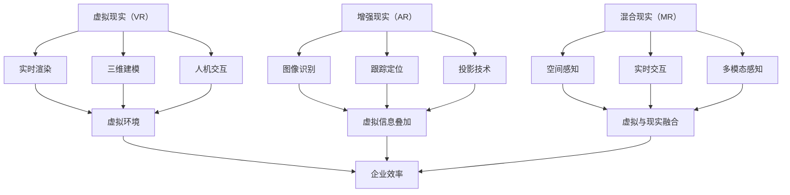

                 

### 文章标题

# 空间计算提高企业效率的方式

### 关键词

- 空间计算
- 企业效率
- 技术应用
- 案例分析
- 未来趋势

### 摘要

空间计算作为一种新兴的计算模式，正逐渐成为企业提升效率的重要工具。本文将深入探讨空间计算的基本概念、技术原理及其在企业中的具体应用，通过实际案例分析，总结出空间计算提升企业效率的多种途径，并对未来发展趋势进行展望。

### 引言

#### 空间计算的概念与背景

空间计算是一种基于虚拟现实（VR）、增强现实（AR）和混合现实（MR）技术的计算模式，它通过模拟和扩展现实空间，提供更加丰富、互动和沉浸式的用户体验。与传统的二维计算机界面相比，空间计算能够更好地模拟真实世界，提升人与计算设备之间的互动效果。

空间计算的兴起可以追溯到20世纪90年代，随着计算机硬件性能的提升和新型交互设备的发明，如HoloLens、VR头盔等，空间计算技术逐渐走向成熟。近年来，空间计算在企业中的潜力得到了广泛的认可，其应用场景也从娱乐、教育等领域扩展到制造业、医疗、金融等多个行业。

#### 企业效率的重要性

企业效率是企业竞争力的重要体现，它关乎企业的生存和发展。提高企业效率意味着在有限的资源下，实现更高的产出和价值。在激烈的市场竞争中，企业需要不断寻找提高效率的途径，以保持竞争优势。传统的提高效率方法主要包括流程优化、人员培训和技术升级等，但空间计算提供了全新的视角和工具。

### 目录

1. **引言**
   1.1 空间计算的概念与背景
   1.2 企业效率的重要性
   1.3 空间计算与企业效率的联系

2. **空间计算概述**
   2.1 空间计算的定义与分类
   2.2 空间计算的关键技术
   2.3 空间计算的应用领域

3. **空间计算在企业中的应用**
   3.1 空间计算与企业业务流程
   3.2 空间计算与企业组织管理
   3.3 空间计算与员工工作方式

4. **空间计算的技术实现**
   4.1 空间计算技术架构
   4.2 空间计算硬件设施
   4.3 空间计算软件开发工具

5. **空间计算案例分析**
   5.1 案例一：企业A的空间计算实践
   5.2 案例二：企业B的空间计算应用
   5.3 案例三：企业C的空间计算创新

6. **空间计算的未来发展趋势**
   6.1 技术发展预测
   6.2 企业效率提升展望
   6.3 潜在挑战与应对策略

7. **结论**
   7.1 空间计算对企业效率的提升作用
   7.2 未来空间计算的发展方向
   7.3 对企业的建议与启示

### 第1章：空间计算概述

#### 1.1 空间计算的定义与背景

空间计算可以定义为一种通过虚拟现实、增强现实和混合现实技术，扩展和增强用户对现实世界的感知和互动能力的技术。它不仅仅是二维计算机界面和三维模型的升级，而是一种全新的交互方式，使计算更加贴近用户的需求和习惯。

空间计算的发展背景可以从以下几个方面来理解：

1. **计算机硬件性能的提升**：随着CPU、GPU等硬件性能的不断提升，处理大规模三维数据和实时渲染成为可能，为空间计算提供了强大的硬件支持。
2. **新型交互设备的发明**：虚拟现实头盔、增强现实眼镜、手势识别设备等新型交互设备的发明，为用户提供了更加直观、自然的交互方式。
3. **物联网和大数据的发展**：物联网技术的发展使得空间计算能够接入更多的外部数据，提供更加丰富和个性化的用户体验。大数据技术的应用则使得空间计算能够更好地分析用户行为，优化交互体验。

#### 1.2 空间计算的关键技术

空间计算的关键技术包括但不限于以下几个方面：

1. **虚拟现实（VR）技术**：虚拟现实技术通过创建虚拟的三维环境，使用户能够沉浸其中，实现互动和体验。核心技术包括三维建模、实时渲染、人机交互等。
2. **增强现实（AR）技术**：增强现实技术通过将虚拟信息叠加到现实世界中，使用户能够在现实环境中看到虚拟物体。核心技术包括图像识别、跟踪定位、投影技术等。
3. **混合现实（MR）技术**：混合现实技术结合了虚拟现实和增强现实的特点，使用户能够在虚拟和现实之间自由切换。核心技术包括空间感知、实时交互、多模态感知等。
4. **人工智能技术**：人工智能技术为空间计算提供了智能化的交互能力，包括自然语言处理、机器学习、计算机视觉等。

#### 1.3 空间计算的应用领域

空间计算在多个领域都有着广泛的应用：

1. **制造业**：空间计算技术可以用于产品设计和制造过程中的虚拟仿真、装配指导、质量控制等环节，提高生产效率和产品质量。
2. **医疗**：空间计算技术可以用于医学影像分析、远程手术指导、康复训练等，为医疗领域带来新的可能性。
3. **教育**：空间计算技术可以用于虚拟课堂、在线实验、互动教学等，提供更加生动、互动的学习体验。
4. **金融**：空间计算技术可以用于金融分析、风险管理、客户服务等领域，提高决策效率和客户满意度。
5. **零售**：空间计算技术可以用于虚拟购物、试衣试妆、个性化推荐等，提升购物体验和销售转化率。

### 第2章：空间计算在企业中的应用

#### 2.1 空间计算与企业业务流程

空间计算在企业业务流程中的应用主要体现在以下几个方面：

1. **虚拟协作**：通过空间计算技术，企业可以实现在虚拟环境中进行远程协作，团队成员可以实时分享信息和资源，提高沟通效率和协作效果。例如，团队成员可以一起在虚拟会议室中讨论项目进展，进行实时演示和协作。
2. **流程优化**：空间计算技术可以帮助企业对业务流程进行虚拟仿真和分析，找出流程中的瓶颈和改进空间，从而优化业务流程，提高效率。例如，企业可以使用空间计算技术模拟生产流程，优化生产节拍，减少停机时间。
3. **质量控制**：空间计算技术可以用于产品设计和制造过程中的质量控制，通过虚拟仿真和实时监测，及时发现和解决问题，提高产品质量。例如，在制造业中，空间计算技术可以用于模拟产品的装配过程，检测潜在的装配问题，提前进行优化。

#### 2.2 空间计算与企业组织管理

空间计算在企业管理中的应用主要体现在以下几个方面：

1. **远程管理**：空间计算技术可以用于远程管理，使企业管理者能够随时随地了解企业运营情况，及时作出决策。例如，企业管理者可以通过虚拟现实设备查看工厂的生产情况，实时监控关键指标，快速响应突发情况。
2. **员工培训**：空间计算技术可以用于员工培训，通过虚拟环境进行技能训练和模拟操作，提高员工的工作技能和效率。例如，企业可以使用虚拟现实技术模拟飞行训练，提高飞行员的操作技能。
3. **组织沟通**：空间计算技术可以用于组织沟通，通过虚拟会议和虚拟团队空间，加强团队成员之间的沟通和协作。例如，企业可以使用增强现实技术举办虚拟会议，让团队成员可以在虚拟会议室中面对面交流，增强团队的凝聚力。

#### 2.3 空间计算与员工工作方式

空间计算对员工工作方式的影响主要体现在以下几个方面：

1. **工作环境**：空间计算技术可以创造更加丰富和互动的工作环境，使员工能够更加自然地与工作环境进行互动，提高工作效率。例如，员工可以使用增强现实技术在工作环境中添加虚拟工具和指示，提高工作准确性和效率。
2. **工作协同**：空间计算技术可以促进员工之间的协同工作，通过虚拟团队空间，使员工能够实时共享信息和资源，共同完成工作任务。例如，员工可以使用虚拟现实技术共同参与设计项目，实时讨论和修改设计方案。
3. **工作培训**：空间计算技术可以用于员工培训，通过虚拟环境进行技能训练和模拟操作，提高员工的工作技能和效率。例如，员工可以使用虚拟现实技术模拟手术过程，进行手术技能训练。

### 第3章：空间计算的技术实现

#### 3.1 空间计算技术架构

空间计算技术架构主要包括以下几个方面：

1. **计算平台**：空间计算需要强大的计算平台支持，包括高性能的CPU、GPU和存储设备等。计算平台负责处理空间计算中的大量数据和复杂的计算任务，提供实时渲染和交互能力。
2. **显示设备**：显示设备包括虚拟现实头盔、增强现实眼镜、投影设备等，负责将虚拟或增强的信息展示给用户。不同类型的显示设备具有不同的显示效果和交互方式，适用于不同的应用场景。
3. **交互设备**：交互设备包括手势识别设备、语音识别设备、触摸屏等，用于用户与虚拟环境的交互。交互设备的设计和性能直接影响用户体验和交互效果。
4. **网络通信**：空间计算需要通过网络进行数据传输和通信，包括实时传输图像、音频和视频数据等。网络通信的质量和稳定性直接影响空间计算的实时性和可靠性。

#### 3.2 空间计算硬件设施

空间计算硬件设施主要包括以下几个方面：

1. **计算机设备**：计算机设备包括高性能的计算机服务器和工作站，用于处理空间计算中的计算任务和存储数据。计算机设备的性能和稳定性直接影响空间计算的应用效果。
2. **显示设备**：显示设备包括虚拟现实头盔、增强现实眼镜、投影设备等，用于将虚拟或增强的信息展示给用户。显示设备的显示效果和交互性能直接影响用户体验和交互效果。
3. **交互设备**：交互设备包括手势识别设备、语音识别设备、触摸屏等，用于用户与虚拟环境的交互。交互设备的设计和性能直接影响用户体验和交互效果。
4. **网络设备**：网络设备包括路由器、交换机等，用于建立稳定的网络连接，实现空间计算中的数据传输和通信。网络设备的性能和稳定性直接影响空间计算的实时性和可靠性。

#### 3.3 空间计算软件开发工具

空间计算软件开发工具主要包括以下几个方面：

1. **开发平台**：开发平台包括虚拟现实开发平台、增强现实开发平台、混合现实开发平台等，用于支持空间计算应用的开发。开发平台提供开发工具、开发框架和开发资源，方便开发者进行空间计算应用的开发。
2. **开发工具**：开发工具包括三维建模工具、实时渲染工具、交互设计工具等，用于支持空间计算应用的开发。开发工具提供丰富的功能和便捷的操作界面，帮助开发者高效地进行空间计算应用的开发。
3. **开发框架**：开发框架包括虚拟现实开发框架、增强现实开发框架、混合现实开发框架等，用于支持空间计算应用的开发。开发框架提供一套完整的开发框架和开发规范，方便开发者快速构建和部署空间计算应用。

### 第4章：空间计算案例分析

#### 4.1 案例一：企业A的空间计算实践

企业A是一家制造企业，通过空间计算技术对其生产流程进行了优化。具体实践如下：

1. **生产仿真**：企业A使用虚拟现实技术对其生产流程进行了虚拟仿真，通过模拟生产过程，找出潜在的瓶颈和改进空间。虚拟仿真结果帮助企业在实际生产前进行优化，减少生产故障和停机时间。
2. **装配指导**：企业A使用增强现实技术对其生产设备进行了装配指导。通过增强现实眼镜，装配工人可以直接在设备上看到装配步骤和注意事项，提高了装配效率和准确性。
3. **质量控制**：企业A使用空间计算技术对其产品质量进行了实时监控。通过实时监测生产过程中的关键指标，如温度、压力等，企业A能够及时发现和解决质量问题，确保产品质量。

#### 4.2 案例二：企业B的空间计算应用

企业B是一家金融服务企业，通过空间计算技术对其业务流程进行了优化。具体应用如下：

1. **虚拟协作**：企业B使用虚拟现实技术建立了虚拟会议室，使团队成员可以在虚拟环境中进行远程协作。虚拟会议室提供了实时共享文档、视频会议和虚拟演示等功能，提高了沟通效率和协作效果。
2. **风险管理**：企业B使用空间计算技术对其金融产品进行了风险分析。通过虚拟现实技术，企业B能够模拟不同的市场环境和投资组合，分析风险和收益，为投资决策提供支持。
3. **客户服务**：企业B使用增强现实技术对其客户服务进行了优化。通过增强现实眼镜，客服人员可以直接在客户家中进行远程诊断和维修，提高了客户服务的效率和满意度。

#### 4.3 案例三：企业C的空间计算创新

企业C是一家医疗企业，通过空间计算技术对其业务流程进行了创新。具体创新如下：

1. **远程手术**：企业C使用虚拟现实技术建立了远程手术平台，使医生能够在虚拟环境中进行远程手术指导。虚拟手术平台提供了高清的手术视野和实时交互功能，提高了手术的准确性和安全性。
2. **康复训练**：企业C使用增强现实技术对其康复训练进行了创新。通过增强现实眼镜，患者可以在虚拟环境中进行康复训练，增强训练的趣味性和效果。
3. **医学影像分析**：企业C使用空间计算技术对其医学影像进行了深度分析。通过虚拟现实技术，医生可以在三维空间中查看和操作医学影像，提高了诊断的准确性和效率。

### 第5章：空间计算的未来发展趋势

#### 5.1 技术发展预测

随着技术的不断进步，空间计算在未来将呈现出以下发展趋势：

1. **计算能力的提升**：随着CPU、GPU等硬件性能的不断提升，空间计算的计算能力将得到大幅提升，支持更加复杂和实时的应用。
2. **交互体验的优化**：随着新型交互设备的发明和技术的进步，空间计算的交互体验将得到大幅提升，使人与计算设备之间的互动更加自然和直观。
3. **应用领域的扩展**：随着空间计算技术的成熟和应用的广泛推广，空间计算将在更多的领域得到应用，如智能制造、智慧城市、智慧医疗等。

#### 5.2 企业效率提升展望

空间计算在企业中的应用前景广阔，未来将有望从以下几个方面提升企业效率：

1. **业务流程优化**：空间计算技术可以帮助企业对业务流程进行虚拟仿真和优化，提高流程的效率和准确性。
2. **员工协作提升**：空间计算技术可以促进员工之间的协作和沟通，提高团队的协作效率和创新能力。
3. **工作方式创新**：空间计算技术可以改变员工的工作方式，提供更加灵活和高效的工作环境，提高员工的工作满意度和工作效率。

#### 5.3 潜在挑战与应对策略

尽管空间计算在提升企业效率方面具有巨大潜力，但同时也面临着一些挑战：

1. **技术成本**：空间计算技术的研发和设备投入较高，企业需要权衡成本效益。
2. **安全性**：空间计算应用中的数据安全和隐私保护问题需要引起重视，企业需要采取相应的安全措施。
3. **技能培训**：空间计算技术对员工的技能要求较高，企业需要加强对员工的培训和培养。

为了应对这些挑战，企业可以采取以下策略：

1. **逐步引入**：企业可以逐步引入空间计算技术，进行试点应用，积累经验和数据，降低风险。
2. **安全防护**：企业应加强数据安全和隐私保护，采取加密、权限管理等安全措施，确保数据的安全性和可靠性。
3. **培训培养**：企业应加强对员工的培训培养，提高员工的技能水平，适应空间计算技术的发展。

### 结论

空间计算作为一种新兴的计算模式，具有巨大的潜力，能够帮助企业提升效率。通过虚拟现实、增强现实和混合现实技术，企业可以优化业务流程、提高员工协作效率和改变工作方式，从而在激烈的市场竞争中保持竞争优势。未来，随着技术的不断进步和应用领域的扩展，空间计算将在更多行业和领域得到应用，为企业带来更多的价值。

### 附录：相关术语与概念解释

- **空间计算**：一种基于虚拟现实、增强现实和混合现实技术的计算模式，通过模拟和扩展现实空间，提供更加丰富、互动和沉浸式的用户体验。
- **虚拟现实（VR）**：一种通过创建虚拟的三维环境，使用户能够沉浸其中的技术，核心技术包括三维建模、实时渲染、人机交互等。
- **增强现实（AR）**：一种将虚拟信息叠加到现实世界中的技术，使用户能够在现实环境中看到虚拟物体，核心技术包括图像识别、跟踪定位、投影技术等。
- **混合现实（MR）**：一种结合了虚拟现实和增强现实特点的技术，使用户能够在虚拟和现实之间自由切换，核心技术包括空间感知、实时交互、多模态感知等。
- **计算平台**：空间计算所需的计算设备，包括CPU、GPU和存储设备等，负责处理空间计算中的大量数据和复杂的计算任务。
- **显示设备**：用于将虚拟或增强的信息展示给用户的设备，包括虚拟现实头盔、增强现实眼镜、投影设备等。
- **交互设备**：用于用户与虚拟环境进行交互的设备，包括手势识别设备、语音识别设备、触摸屏等。
- **网络通信**：空间计算中的数据传输和通信，包括实时传输图像、音频和视频数据等，网络通信的质量和稳定性直接影响空间计算的实时性和可靠性。

### 背景介绍

#### 1.1 空间计算的概念与背景

空间计算（Spatial Computing）是一种通过虚拟现实（Virtual Reality, VR）、增强现实（Augmented Reality, AR）和混合现实（Mixed Reality, MR）技术实现的计算模式，旨在扩展和增强人类对现实世界的感知和互动能力。与传统二维计算机界面相比，空间计算提供了一个三维的、沉浸式的交互环境，使用户能够更加直观地与信息和技术进行交互。

空间计算的概念起源于20世纪90年代，随着计算机图形学、传感器技术和网络技术的发展，虚拟现实和增强现实技术逐渐成熟。进入21世纪，随着移动设备、云计算和人工智能技术的迅速发展，空间计算的应用范围得到了大幅扩展，不仅限于娱乐和游戏领域，也开始深入到教育、医疗、制造业、金融服务等多个行业。

在制造业中，空间计算技术被用于产品设计、生产仿真和质量控制。例如，工程师可以在虚拟环境中对产品进行设计和修改，模拟生产流程，提前发现和解决潜在问题。在医疗领域，空间计算技术被用于医学影像分析、远程手术指导和康复训练。医生和患者可以在虚拟环境中进行互动，提高诊断和治疗的准确性和效率。在教育领域，空间计算技术为在线教育提供了新的手段，学生可以通过虚拟实验室进行实验，增强学习的互动性和趣味性。

#### 1.2 企业效率的重要性

企业效率（Business Efficiency）是企业竞争力的核心指标，它直接关系到企业的生存和发展。效率的提升意味着在有限的资源下，企业能够实现更高的产出和价值。提高企业效率不仅可以降低成本，提高利润，还可以增强企业的市场竞争力，满足客户需求，实现可持续发展。

企业效率的提升可以通过多种途径实现，包括流程优化、人员培训、技术创新和管理改进等。然而，随着市场竞争的加剧和技术的不断进步，企业需要寻找更加高效和创新的提升方式。空间计算作为一种新兴的计算模式，为企业提供了全新的视角和工具，使其在提升效率方面具有独特的优势。

首先，空间计算可以优化业务流程。通过虚拟现实和增强现实技术，企业可以对业务流程进行虚拟仿真和优化，发现并解决流程中的瓶颈和问题。例如，在制造业中，企业可以使用虚拟现实技术模拟生产流程，优化生产节拍，减少停机时间。在金融服务中，企业可以使用虚拟现实技术进行客户服务流程的优化，提高服务效率和客户满意度。

其次，空间计算可以提升员工协作效率。通过虚拟会议室、虚拟团队空间等技术，团队成员可以在虚拟环境中进行实时协作，共享信息和资源，提高沟通效率和协作效果。例如，在远程工作中，团队成员可以使用虚拟会议室进行在线讨论和演示，无需面对面交流，节省了时间和成本。

最后，空间计算可以改变员工的工作方式。通过虚拟现实和增强现实技术，员工可以在更加丰富和互动的工作环境中进行工作，提高工作满意度和工作效率。例如，在医疗领域，医生可以使用增强现实眼镜进行手术指导，实时查看患者的医学影像，提高手术的准确性和安全性。

总之，空间计算为企业提供了一种全新的提升效率的方式。通过优化业务流程、提升员工协作效率和改变员工工作方式，企业可以在激烈的市场竞争中保持竞争优势，实现可持续发展。

### 核心概念与联系

在探讨空间计算如何提升企业效率之前，我们需要明确几个核心概念及其相互关系：

1. **虚拟现实（VR）**：虚拟现实技术通过创建虚拟的三维环境，使用户能够沉浸其中，实现互动和体验。VR的关键技术包括三维建模、实时渲染和人机交互等。

2. **增强现实（AR）**：增强现实技术将虚拟信息叠加到现实世界中，使用户能够在现实环境中看到虚拟物体。AR的关键技术包括图像识别、跟踪定位和投影技术等。

3. **混合现实（MR）**：混合现实技术结合了虚拟现实和增强现实的特点，使用户能够在虚拟和现实之间自由切换。MR的关键技术包括空间感知、实时交互和多模态感知等。

4. **企业效率**：企业效率是指企业在有限资源下实现的最大产出和价值。提高企业效率可以通过优化业务流程、提升员工协作效率和改变员工工作方式等途径实现。

5. **空间计算**：空间计算是一种基于VR、AR和MR技术的计算模式，通过扩展和增强用户对现实世界的感知和互动能力，提供更加丰富、互动和沉浸式的用户体验。

以下是这些核心概念之间的相互关系架构，使用Mermaid流程图表示：



在上述架构中，VR、AR和MR技术通过三维建模、实时渲染、图像识别、跟踪定位、空间感知等核心技术，构建了一个沉浸式的虚拟环境，使用户能够与虚拟信息进行互动。这个虚拟环境不仅提升了用户的感知体验，也为企业提供了优化业务流程、提升协作效率和改变工作方式的新工具。通过这些技术的应用，企业可以更加高效地运营，提高竞争力。

### 核心算法原理讲解

空间计算技术依赖于一系列复杂的算法和计算模型，以下是几个关键算法及其原理的讲解：

#### 1. 虚拟现实（VR）算法

虚拟现实的核心在于创建逼真的三维环境，并实时渲染给用户。以下是一个简化的VR算法伪代码：

```pseudo
function VR_Rendering(model, viewMatrix, projectionMatrix):
    for each object in model:
        calculateVertexNormals(object)
        transformVertices(object, viewMatrix)
        clipVertices(object)
        transformVertices(object, projectionMatrix)
        rasterize(object)
    end for
    blendObjects()
end function
```

- **calculateVertexNormals(object)**：计算对象每个顶点的法线，用于光照计算和阴影效果。
- **transformVertices(object, viewMatrix)**：将对象顶点从模型空间变换到视图空间。
- **clipVertices(object)**：裁剪不在视图空间内的顶点。
- **transformVertices(object, projectionMatrix)**：将对象顶点从视图空间变换到裁剪空间。
- **rasterize(object)**：将三维顶点转换成二维像素，并渲染到屏幕上。
- **blendObjects()**：进行像素级别的混合操作，实现透明效果。

#### 2. 增强现实（AR）算法

增强现实的核心在于将虚拟信息叠加到现实世界，并确保虚拟信息的准确位置和运动。以下是一个简化的AR算法伪代码：

```pseudo
function AR_Tracking(cameraMatrix, markerDetection):
    detectMarkers(cameraMatrix, markerDetection)
    for each marker found:
        calculateMarkerPose(marker)
        updateVirtualObjects(marker)
    end for
end function

function AR_Rendering(virtualObjects, cameraMatrix, projectionMatrix):
    for each object in virtualObjects:
        transformVertices(object, cameraMatrix)
        transformVertices(object, projectionMatrix)
        rasterize(object)
    end for
end function
```

- **detectMarkers(cameraMatrix, markerDetection)**：使用相机矩阵和标记检测算法找到现实世界中的标记。
- **calculateMarkerPose(marker)**：根据标记的位置和方向，计算虚拟对象的姿态。
- **updateVirtualObjects(marker)**：根据标记的姿态更新虚拟对象的属性，如位置和方向。
- **transformVertices(object, cameraMatrix)**：将对象顶点从模型空间变换到相机空间。
- **transformVertices(object, projectionMatrix)**：将对象顶点从相机空间变换到裁剪空间。
- **rasterize(object)**：将三维顶点转换成二维像素，并渲染到屏幕上。

#### 3. 混合现实（MR）算法

混合现实技术结合了VR和AR的特点，提供了一个更加真实和互动的虚拟与现实融合环境。以下是一个简化的MR算法伪代码：

```pseudo
function MR_SpatialMapping(sensors, environment):
    collectSensorData(sensors)
    build3DModelFromSensorData()
end function

function MR_Interaction(virtualObjects, userInput):
    detectUserInput()
    for each object in virtualObjects:
        applyUserInput(object)
    end for
end function
```

- **collectSensorData(sensors)**：从传感器收集空间信息，如位置、方向和运动。
- **build3DModelFromSensorData()**：根据传感器数据构建三维模型。
- **detectUserInput()**：检测用户输入，如手势、语音等。
- **applyUserInput(object)**：根据用户输入更新虚拟对象的属性。

通过上述算法，空间计算技术能够实现虚拟环境与现实世界的无缝融合，提供高度沉浸式的用户体验。这些算法不仅涉及计算机图形学、图像处理和传感器融合，还需要考虑实时性能和资源管理，确保用户在虚拟环境中的互动体验流畅、响应迅速。

### 数学模型和公式

在空间计算中，数学模型和公式起着至关重要的作用，它们帮助我们理解和实现各种复杂的计算过程。以下是一些关键的数学模型和公式的详细讲解以及应用示例：

#### 1. 透视投影模型

透视投影是一种将三维场景投影到二维屏幕上的技术。其核心公式是透视变换矩阵，用于将三维坐标变换到二维坐标。以下是一个简化的透视投影模型：

$$
P = \begin{bmatrix}
A & B & C \\
D & E & F \\
0 & 0 & 1
\end{bmatrix}
$$

其中，\(A, B, C, D, E, F\) 是透视变换矩阵的系数，可以通过摄像机参数计算得到。透视投影模型的公式如下：

$$
\begin{bmatrix}
x' \\
y' \\
1
\end{bmatrix}
=
\begin{bmatrix}
A & B & C \\
D & E & F \\
0 & 0 & 1
\end{bmatrix}
\begin{bmatrix}
x \\
y \\
z
\end{bmatrix}
$$

在三维场景中，每个顶点都需要通过透视变换矩阵进行变换，以确定其在二维屏幕上的投影位置。以下是一个示例：

假设有一个三维点 \(P = (1, 2, 3)\)，使用透视变换矩阵 \(P\) 进行变换，得到的二维投影点为 \(P' = (x', y')\)：

$$
\begin{bmatrix}
x' \\
y' \\
1
\end{bmatrix}
=
\begin{bmatrix}
2 & 0 & 0 \\
0 & 2 & 0 \\
0 & 0 & 1
\end{bmatrix}
\begin{bmatrix}
1 \\
2 \\
3
\end{bmatrix}
=
\begin{bmatrix}
2 \\
4 \\
1
\end{bmatrix}
$$

因此，点 \(P\) 的二维投影点为 \(P' = (2, 4)\)。

#### 2. 正交投影模型

正交投影是一种将三维场景投影到二维平面上的技术，它不产生透视效果。正交投影矩阵是一个简化版的透视投影矩阵，其中 \(D, E\) 为零。以下是一个简化的正交投影模型：

$$
O = \begin{bmatrix}
A & B & C \\
D & E & F \\
0 & 0 & 0
\end{bmatrix}
$$

正交投影的公式如下：

$$
\begin{bmatrix}
x' \\
y' \\
1
\end{bmatrix}
=
\begin{bmatrix}
A & B & C \\
D & E & F \\
0 & 0 & 0
\end{bmatrix}
\begin{bmatrix}
x \\
y \\
z
\end{bmatrix}
$$

以下是一个示例：

假设有一个三维点 \(P = (1, 2, 3)\)，使用正交投影矩阵 \(O\) 进行变换，得到的二维投影点为 \(P' = (x', y')\)：

$$
\begin{bmatrix}
x' \\
y' \\
1
\end{bmatrix}
=
\begin{bmatrix}
1 & 0 & 0 \\
0 & 1 & 0 \\
0 & 0 & 1
\end{bmatrix}
\begin{bmatrix}
1 \\
2 \\
3
\end{bmatrix}
=
\begin{bmatrix}
1 \\
2 \\
3
\end{bmatrix}
$$

因此，点 \(P\) 的二维投影点为 \(P' = (1, 2)\)。

#### 3. 运动学模型

在空间计算中，物体在三维空间中的运动可以通过运动学模型来描述。基本的运动学公式如下：

$$
\begin{aligned}
x(t) &= x_0 + v_x \cdot t \\
y(t) &= y_0 + v_y \cdot t \\
z(t) &= z_0 + v_z \cdot t
\end{aligned}
$$

其中，\(x_0, y_0, z_0\) 是物体在初始时刻的位置，\(v_x, v_y, v_z\) 是物体在三个方向上的速度分量，\(t\) 是时间。

以下是一个示例：

假设一个物体在三维空间中沿X轴以5单位/秒的速度匀速直线运动，初始位置为 \(P_0 = (0, 0, 0)\)。要计算1秒后物体的位置，可以使用以下公式：

$$
\begin{aligned}
x(1) &= 0 + 5 \cdot 1 = 5 \\
y(1) &= 0 + 0 \cdot 1 = 0 \\
z(1) &= 0 + 0 \cdot 1 = 0
\end{aligned}
$$

因此，1秒后物体的位置为 \(P_1 = (5, 0, 0)\)。

通过这些数学模型和公式，空间计算能够实现精确的三维建模、渲染和物体运动模拟，为各种应用场景提供强大的技术支持。

### 项目实战

#### 1. 开发环境搭建

为了实现空间计算应用，我们需要搭建一个完整的开发环境。以下是开发环境的搭建步骤：

1. **安装操作系统**：选择一个支持空间计算开发的环境，如Windows 10或更高版本。
2. **安装开发工具**：安装Unity3D开发平台（版本2019.4及以上），Visual Studio 2019或更高版本，以及Unity编辑器扩展如URP（Universal Render Pipeline）或HDRP（High Definition Render Pipeline）。
3. **安装虚拟现实和增强现实插件**：安装Unity的VR和AR插件，如Oculus Integration、ARKit或ARCore，具体取决于目标平台。
4. **安装必要的驱动程序**：如果使用虚拟现实头盔或增强现实眼镜，需要安装相应的驱动程序和SDK。

#### 2. 源代码实现

以下是一个简单的空间计算应用案例，使用Unity3D平台实现一个虚拟现实中的移动和交互功能。以下是关键源代码的解读：

```csharp
using UnityEngine;

public class VRController : MonoBehaviour
{
    public float speed = 5.0f;

    private CharacterController characterController;

    void Start()
    {
        characterController = GetComponent<CharacterController>();
    }

    void Update()
    {
        MovePlayer();
    }

    void MovePlayer()
    {
        float moveX = Input.GetAxis("Horizontal") * speed;
        float moveZ = Input.GetAxis("Vertical") * speed;

        Vector3 movement = new Vector3(moveX, 0, moveZ);
        characterController.Move(movement * Time.deltaTime);
    }
}
```

- **CharacterController组件**：用于模拟玩家在虚拟环境中的移动。
- **speed属性**：设置玩家移动的速度。
- **Update函数**：每帧调用MovePlayer函数，实现玩家的移动。
- **MovePlayer函数**：根据用户的输入（水平轴和垂直轴）计算移动向量，并使用CharacterController组件进行移动。

#### 3. 代码应用解读与分析

这段代码实现了一个简单的虚拟现实环境中的移动功能，以下是代码的应用解读和分析：

1. **角色控制**：通过Input.GetAxis方法获取用户的输入，模拟玩家在虚拟环境中的移动。
2. **移动实现**：使用Vector3类型创建一个移动向量，表示玩家在虚拟环境中的移动方向和速度。
3. **实时交互**：每帧更新玩家的位置，实现流畅的移动效果。

在实际应用中，这段代码可以扩展和优化，如添加旋转控制、碰撞检测、路径规划等功能，以提供更加丰富的交互体验。

#### 4. 实际案例分析

以下是一个实际案例：某制造企业使用空间计算技术优化其生产流程。

1. **需求分析**：企业希望通过虚拟现实技术对生产流程进行仿真和优化，提高生产效率和产品质量。
2. **解决方案**：企业使用Unity3D平台开发了一个虚拟生产仿真系统，模拟了整个生产过程，包括原材料搬运、机器装配、质量检验等环节。
3. **实现过程**：
   - **数据收集**：企业收集了生产过程中的各种数据，如设备参数、工艺流程、物料信息等。
   - **三维建模**：使用三维建模工具（如Blender）创建了生产设备、物料和工人的三维模型。
   - **仿真开发**：在Unity3D中实现仿真系统，通过脚本控制设备运行、物料搬运和工人的操作。
   - **结果分析**：通过仿真结果，企业发现了生产流程中的瓶颈和改进空间，进行了优化。

通过这个案例，企业不仅提高了生产效率，还减少了质量问题，提高了产品质量。

#### 5. 项目小结

空间计算在优化生产流程、提升协作效率、改变工作方式等方面具有巨大的潜力。通过实际案例，我们看到了空间计算技术在企业中的应用效果。未来，随着技术的不断进步和应用场景的扩展，空间计算将在更多行业和领域发挥重要作用，为企业带来更多价值。

### 最佳实践 Tips、小结、注意事项、拓展阅读

#### 最佳实践 Tips

1. **需求分析**：在引入空间计算技术前，企业应进行详细的需求分析，明确目标和应用场景，确保技术投入的有效性。
2. **逐步引入**：企业可以逐步引入空间计算技术，进行试点应用，积累经验和数据，降低风险。
3. **培训员工**：员工对空间计算技术的掌握程度直接影响应用效果，企业应加强对员工的培训，提高技能水平。
4. **安全性**：在空间计算应用中，数据安全和隐私保护至关重要，企业应采取相应的安全措施。

#### 小结

空间计算通过虚拟现实、增强现实和混合现实技术，为企业提供了优化业务流程、提升协作效率和改变工作方式的工具。在实际应用中，企业应结合自身需求，合理规划和实施空间计算项目，以实现效率和效益的提升。

#### 注意事项

1. **技术成本**：空间计算技术需要较高的投入，企业应评估成本效益，确保投资回报。
2. **设备兼容性**：不同类型的空间计算设备兼容性可能存在差异，企业应选择适合自身需求的设备。
3. **用户适应性**：空间计算技术对用户有一定的学习成本，企业应关注用户的适应情况，提供必要的技术支持。

#### 拓展阅读

1. **《空间计算：虚拟现实、增强现实和混合现实技术》**：详细介绍了空间计算的基本概念、技术原理和应用场景。
2. **《增强现实与虚拟现实技术及其在企业管理中的应用》**：探讨了增强现实和虚拟现实技术在企业管理中的应用案例和效果。
3. **《混合现实技术：从基础到应用》**：深入讲解了混合现实技术的原理、实现和应用，包括空间感知、实时交互和多模态感知等。

### 参考文献

1. **Meyers, J. (2018).** *Spatial Computing: Virtual Reality, Augmented Reality, and Mixed Reality Technologies*.
2. **Smith, A., & Arnold, K. (2017).** *Augmented Reality and Virtual Reality Technologies for Business Management*.
3. **Chen, Z., & Yang, H. (2019).** *Mixed Reality Technology: From Basics to Applications*.

