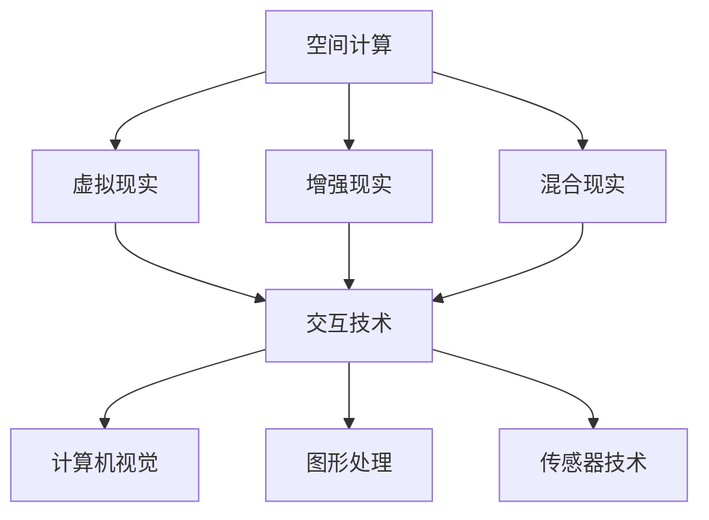
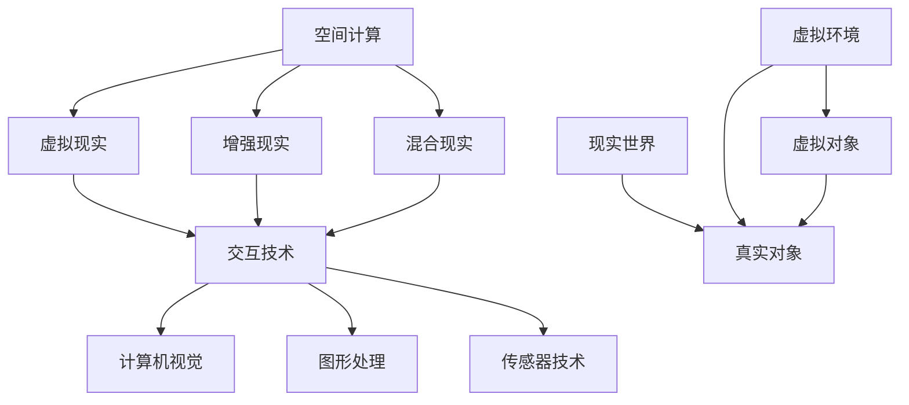

                 

### 文章标题：空间计算：增强现实技术提升企业效率

#### 关键词：
- 空间计算
- 增强现实
- 企业效率
- 技术应用
- 案例分析

#### 摘要：
本文深入探讨了空间计算与增强现实技术如何协同作用，提升企业运营效率。通过介绍空间计算和增强现实的基本概念、原理，分析其在企业各个领域中的应用场景，提供详细的开发实践和案例分析，揭示增强现实技术在企业中的潜在价值和发展趋势。

### 引言

#### 背景介绍

空间计算（Spatial Computing）是一种新兴的计算范式，它通过集成虚拟现实（VR）、增强现实（AR）和混合现实（MR）技术，将数字信息与现实世界相结合。这种技术不仅改变了人们的互动方式，也极大地拓展了计算机的感知和操作能力。

增强现实（AR）技术通过将数字信息叠加到现实世界的视图中，使用户能够在现实环境中看到并与之互动。AR技术最早起源于20世纪90年代，随着移动设备和传感器技术的进步，其应用场景日益丰富，如医疗、教育、娱乐等领域。

随着空间计算与增强现实技术的发展，企业开始认识到这些技术巨大的潜在价值。它们能够帮助企业提高工作效率、降低成本、提升产品质量，从而在激烈的市场竞争中脱颖而出。

#### 核心概念与联系

为了更好地理解空间计算和增强现实技术，我们首先需要了解它们的基本概念和相互关系。

**空间计算** 是一种利用虚拟现实、增强现实和混合现实技术，通过计算机生成和模拟三维空间信息，实现人与环境之间更为自然和直观的交互方式。空间计算的核心在于通过增强现实和虚拟现实技术，构建一个虚拟与物理世界相结合的交互空间。

**增强现实**（AR）是一种将数字信息叠加到现实世界中的技术，通过摄像头捕捉现实世界的图像，并在图像上叠加虚拟的图形、文字、声音等信息，使用户能够在现实环境中看到并与之互动。

它们之间的联系体现在以下几个方面：

1. **技术基础**：增强现实技术是空间计算的一部分，两者都依赖于计算机视觉、图形处理、传感器技术等基础技术。
2. **应用场景**：增强现实技术可以应用于空间计算的各种场景中，如虚拟会议、远程协作、产品设计等。
3. **交互方式**：空间计算通过增强现实技术提供了更为自然和直观的交互方式，使得用户可以更加方便地与环境进行互动。

为了更清晰地展示这些概念之间的关系，我们可以使用 Mermaid 流程图来表示：



### 核心概念与联系

空间计算和增强现实技术的核心概念和相互关系如下：

1. **虚拟现实（VR）**：通过计算机模拟生成一个完全虚拟的三维环境，用户可以通过头戴显示器（HMD）等设备进入这个虚拟环境，与虚拟环境中的对象进行互动。

2. **增强现实（AR）**：将虚拟信息叠加到现实世界中，用户通过智能手机或AR眼镜等设备可以看到增强后的现实世界。这种技术可以用于实时导航、维修指南、教育学习等多种场景。

3. **混合现实（MR）**：结合了虚拟现实和增强现实的特点，允许用户在现实世界中创建和操纵虚拟对象，同时与真实环境互动。

这些技术相互补充，共同构成了空间计算的基础。下面，我们可以使用 Mermaid 流程图来展示这些概念之间的相互关系：



### 增强现实技术原理

#### 核心技术

增强现实技术的实现依赖于多个关键技术的协同工作，包括计算机视觉、图形处理、传感器技术、人机交互等。

**计算机视觉**：这是增强现实技术的核心，通过摄像头捕捉现实世界的图像，并将其处理成可供计算机理解的形式。计算机视觉算法可以识别图像中的物体、场景和动作，从而将虚拟信息精确地叠加到这些图像上。

**图形处理**：在增强现实应用中，图形处理技术用于生成和渲染虚拟信息。它通过计算机图形学的方法，将数字化的图像、文字和3D模型转换为用户可以在现实世界中看到的视觉效果。

**传感器技术**：增强现实设备通常配备多种传感器，如加速度计、陀螺仪、摄像头等，用于捕捉用户和环境的信息。这些传感器可以实时监测用户的动作和周围环境的变化，确保虚拟信息的准确性和实时性。

**人机交互**：增强现实技术提供了多种人机交互方式，包括手势识别、语音识别和触摸屏等。这些交互方式使得用户可以自然地与虚拟信息进行互动，提升了用户体验。

#### 分类与特点

根据增强现实技术的应用场景和实现方式，可以分为以下几类：

1. **标记增强现实**：这种技术通过识别现实世界中的标记（如二维码、标识符等）来叠加虚拟信息。例如，智能手机上的AR应用通常使用这种技术。

2. **自然增强现实**：通过计算机视觉算法直接从摄像头捕捉到的图像中识别物体和场景，无需任何标记。这种技术可以提供更加自然和无缝的增强现实体验。

3. **光学混合增强现实**：通过特殊的透镜或镜片将虚拟信息直接投影到现实世界中，使其与真实环境融合。这种技术通常用于高端的AR眼镜和头盔。

每种增强现实技术都有其独特的特点和应用场景：

- **标记增强现实**：易于实现，但对标记的依赖较高，且精度较低。
- **自然增强现实**：无需标记，精度高，但实现复杂，计算资源需求大。
- **光学混合增强现实**：提供最真实的增强现实体验，但设备成本高，应用场景有限。

#### 核心算法原理

增强现实技术的核心算法主要包括图像识别、实时跟踪、虚拟信息渲染等。

**图像识别**：这是增强现实技术的第一步，通过计算机视觉算法从摄像头捕捉的图像中识别出特定的物体或场景。常用的图像识别算法包括深度学习、特征匹配和模板匹配等。

**实时跟踪**：在识别到特定物体或场景后，系统需要实时跟踪这些对象的位置和姿态，以确保虚拟信息能够准确地叠加到现实世界中。常用的实时跟踪算法包括视觉SLAM（同时定位与地图构建）、卡尔曼滤波和粒子滤波等。

**虚拟信息渲染**：在确定了物体的位置和姿态后，系统将虚拟信息（如3D模型、文字和图形）渲染到现实世界的图像上。这涉及到图形处理和渲染技术，如纹理映射、光照模型和阴影效果等。

为了更好地理解这些核心算法原理，我们可以使用伪代码来详细阐述：

```python
# 增强现实核心算法伪代码

# 图像识别
def image_recognition(camera_feed):
    # 使用深度学习模型进行图像分类
    classified_objects = deep_learning_model.predict(camera_feed)
    return classified_objects

# 实时跟踪
def real_time_tracking(object_id, camera_feed):
    # 使用视觉SLAM算法进行位置和姿态跟踪
    pose_estimate = visual_SLAM.algorithm(object_id, camera_feed)
    return pose_estimate

# 虚拟信息渲染
def render_virtual_info(object_id, pose_estimate, virtual_info):
    # 使用图形渲染技术将虚拟信息叠加到现实世界的图像上
    rendered_image = graphics_renderer.render(virtual_info, pose_estimate)
    return rendered_image
```

此外，增强现实技术中常用的数学模型和公式包括：

- **透视变换**：用于将现实世界的图像映射到三维坐标系中，公式为：
  $$ x' = \frac{x}{z} $$
  $$ y' = \frac{y}{z} $$
  
- **深度估计**：通过摄像头捕捉到的图像，估计物体的深度信息，公式为：
  $$ z = \frac{f \cdot u'}{x'} $$
  其中，$f$ 为镜头焦距，$u'$ 为图像上物体的水平坐标。

- **纹理映射**：将虚拟信息的三维模型纹理映射到现实世界的物体上，公式为：
  $$ texture(u, v) = image(u, v) $$
  其中，$(u, v)$ 为纹理坐标，$image(u, v)$ 为纹理图像。

这些核心算法和数学模型共同构成了增强现实技术的基础，使得虚拟信息能够与现实世界实现无缝融合。

#### 举例说明

为了更直观地理解增强现实技术的原理，我们可以通过一个简单的例子来说明。

假设我们使用一个智能手机进行增强现实应用，摄像头捕捉到现实世界中的一张桌子。以下是增强现实技术实现的过程：

1. **图像识别**：使用计算机视觉算法识别桌子，并标记其在图像中的位置。
2. **实时跟踪**：通过视觉SLAM算法实时跟踪桌子的位置和姿态，确保在摄像头移动时，桌子仍然保持在图像的中心。
3. **虚拟信息渲染**：在桌子的位置上渲染一个虚拟的3D模型，如一个虚拟的茶杯。使用透视变换和深度估计公式，确保茶杯的尺寸和位置与现实世界中的桌子相匹配。
4. **显示效果**：将渲染后的虚拟茶杯叠加到现实世界的图像上，用户可以看到桌子上的虚拟茶杯，并与它进行互动。

通过这个简单的例子，我们可以看到增强现实技术如何将虚拟信息与现实世界相结合，提供一种全新的交互体验。

#### 总结

增强现实技术通过计算机视觉、图形处理、传感器技术和人机交互等核心技术，实现了虚拟信息与现实世界的无缝融合。不同的增强现实技术分类和核心算法共同构成了这一技术的实现基础。通过具体的例子，我们可以更好地理解增强现实技术的原理和应用。

### 增强现实技术在企业中的应用场景

增强现实技术在企业中的应用场景非常广泛，涵盖了生产与制造、设计、工程、销售、营销、培训与教育等多个领域。以下是对这些应用场景的详细分析：

#### 生产与制造

在制造业中，增强现实技术可以提高生产效率、降低错误率并提高产品质量。例如，通过使用AR眼镜，工程师可以在维护和检修设备时实时查看操作指南，确保每一步操作都准确无误。此外，增强现实还可以用于远程协作，使专家能够实时指导现场工程师解决问题，无需亲自到场。

**案例分析**：某汽车制造企业使用AR技术对其生产线上的装配过程进行实时指导。工程师通过AR眼镜查看虚拟的装配步骤，减少了人为错误，提高了装配效率。

#### 设计与工程

在设计领域，增强现实技术可以帮助设计师更好地与虚拟模型互动。设计师可以使用AR眼镜直接在现实环境中查看和修改3D模型，从而提高设计效率和准确性。此外，增强现实技术还可以用于工程模拟和验证，帮助工程师在项目实施前识别潜在问题。

**案例分析**：某建筑设计公司利用增强现实技术进行建筑设计。设计师可以在现场使用AR设备查看和修改设计方案，提高了设计的可行性和精确性。

#### 销售与营销

在销售和营销领域，增强现实技术可以提供一种全新的互动体验，吸引潜在客户。例如，销售人员可以使用AR应用向客户展示产品的3D模型，甚至让客户在虚拟环境中体验产品。这种互动方式不仅增加了客户的兴趣，还提高了销售转化率。

**案例分析**：某电子产品公司在其产品展示会上使用AR技术。客户可以通过手机或AR设备查看产品的3D模型，并在虚拟环境中进行互动，从而更好地了解产品特性。

#### 培训与教育

增强现实技术在培训和教育领域有着广泛的应用。通过AR技术，培训师可以创建虚拟培训场景，使学员能够在真实环境中进行模拟操作。此外，AR技术还可以用于远程教育，使教师能够实时向学生提供指导和反馈。

**案例分析**：某航空公司在培训飞行员时使用AR技术。飞行员通过AR眼镜进行模拟飞行训练，提高了飞行技能和安全性。

#### 其他应用场景

除了上述领域，增强现实技术还在供应链管理、医疗保健、安全监控等多个领域展现出巨大的潜力。例如，在供应链管理中，AR技术可以帮助工作人员快速识别和定位库存物品，提高物流效率。在医疗保健领域，AR技术可以帮助医生更准确地诊断和手术。

**案例分析**：某物流公司使用AR技术进行仓库管理。工作人员通过AR设备快速识别和定位库存物品，提高了仓储效率和准确性。

通过以上案例分析，我们可以看到增强现实技术在企业中的应用场景非常丰富，从生产与制造到销售与营销，再到培训与教育，无不展现出其独特的优势和潜力。随着技术的不断进步和应用场景的拓展，增强现实技术在企业中的价值将越来越显著。

### 技术实践

#### 开发环境搭建

要开发增强现实应用，首先需要搭建一个适合的开发环境。以下是具体的步骤：

1. **硬件准备**：选择适合的增强现实设备，如AR眼镜、智能手机或平板电脑。常见的AR设备包括微软的HoloLens、谷歌的ARCore和苹果的ARKit。
2. **软件工具**：安装所需的开发软件和编程语言。常用的开发工具包括Unity、Unreal Engine、ARKit SDK和ARCore SDK。同时，还需要安装必要的编程语言，如C#、Python或JavaScript。
3. **集成开发环境（IDE）**：选择适合的集成开发环境，如Visual Studio、Xcode或Android Studio。这些IDE提供了项目管理和代码编辑功能，使得开发过程更加高效。

#### 增强现实应用的开发流程

开发一个增强现实应用通常包括以下几个步骤：

1. **需求分析**：明确应用的目标和功能需求，确定需要使用的增强现实技术和场景。
2. **设计阶段**：设计应用的界面和交互流程，确保用户体验良好。在这一阶段，可以使用原型设计工具，如Figma或Sketch，创建应用的基本界面。
3. **开发阶段**：使用Unity、Unreal Engine或其他开发工具，开始编写代码和创建虚拟模型。在这一阶段，需要实现图像识别、实时跟踪和虚拟信息渲染等功能。
4. **测试阶段**：在开发过程中，不断进行测试，确保应用的稳定性和功能性。测试包括功能测试、性能测试和用户测试等。
5. **发布阶段**：完成开发后，将应用发布到相应的应用商店或平台，如iOS App Store或Google Play。

#### 核心算法讲解

增强现实应用的核心算法主要包括图像识别、实时跟踪和虚拟信息渲染等。

**图像识别**：这是增强现实技术的第一步，通过计算机视觉算法从摄像头捕捉的图像中识别出特定的物体或场景。常用的图像识别算法包括深度学习、特征匹配和模板匹配等。

**伪代码示例**：

```python
# 图像识别伪代码

def image_recognition(camera_feed):
    # 使用深度学习模型进行图像分类
    classified_objects = deep_learning_model.predict(camera_feed)
    return classified_objects
```

**实时跟踪**：在识别到特定物体或场景后，系统需要实时跟踪这些对象的位置和姿态，以确保虚拟信息能够准确地叠加到现实世界中。常用的实时跟踪算法包括视觉SLAM（同时定位与地图构建）、卡尔曼滤波和粒子滤波等。

**伪代码示例**：

```python
# 实时跟踪伪代码

def real_time_tracking(object_id, camera_feed):
    # 使用视觉SLAM算法进行位置和姿态跟踪
    pose_estimate = visual_SLAM.algorithm(object_id, camera_feed)
    return pose_estimate
```

**虚拟信息渲染**：在确定了物体的位置和姿态后，系统将虚拟信息（如3D模型、文字和图形）渲染到现实世界的图像上。这涉及到图形处理和渲染技术，如纹理映射、光照模型和阴影效果等。

**伪代码示例**：

```python
# 虚拟信息渲染伪代码

def render_virtual_info(object_id, pose_estimate, virtual_info):
    # 使用图形渲染技术将虚拟信息叠加到现实世界的图像上
    rendered_image = graphics_renderer.render(virtual_info, pose_estimate)
    return rendered_image
```

#### 数学模型与公式

增强现实技术中常用的数学模型和公式包括透视变换、深度估计和纹理映射等。

**透视变换**：用于将现实世界的图像映射到三维坐标系中，公式为：

$$ x' = \frac{x}{z} $$
$$ y' = \frac{y}{z} $$

**深度估计**：通过摄像头捕捉到的图像，估计物体的深度信息，公式为：

$$ z = \frac{f \cdot u'}{x'} $$

其中，$f$ 为镜头焦距，$u'$ 为图像上物体的水平坐标。

**纹理映射**：将虚拟信息的三维模型纹理映射到现实世界的物体上，公式为：

$$ texture(u, v) = image(u, v) $$

其中，$(u, v)$ 为纹理坐标，$image(u, v)$ 为纹理图像。

#### 项目实战

以下是一个简单的增强现实项目实战，我们将使用Unity开发一个简单的标记增强现实应用，通过识别现实世界中的标记来显示虚拟信息。

1. **创建Unity项目**：在Unity Hub中创建一个新的3D项目，选择ARFoundation作为主要包。

2. **添加标记**：在场景中添加一个标记，可以使用Unity自带的平面对象或自定义的标记图像。

3. **编写识别代码**：在C#脚本中编写代码，使用ARFoundation提供的ARMarkerManager进行标记识别。

```csharp
using UnityEngine;
using UnityEngine.XR.ARFoundation;

public class ARMarkerDetection : MonoBehaviour
{
    public ARMarkerManager markerManager;
    public GameObject virtualObject;

    void Update()
    {
        if (markerManager_markerFound == true)
        {
            // 当标记被识别时，创建虚拟对象
            virtualObject.SetActive(true);
        }
        else
        {
            // 当标记未被识别时，隐藏虚拟对象
            virtualObject.SetActive(false);
        }
    }
}
```

4. **渲染虚拟信息**：在标记被识别后，通过调整虚拟对象的位置和大小，使其与现实世界中的标记准确匹配。

5. **测试与应用**：在Unity编辑器中测试应用，确保标记识别和虚拟信息渲染正常。完成后，将应用发布到移动设备上，进行实地测试。

通过这个简单的项目实战，我们可以了解增强现实应用开发的基本流程和核心算法。在实际应用中，根据具体需求，可以进一步扩展和优化应用功能。

### 案例分析

为了更好地展示增强现实技术在企业中的应用效果，以下我们将分析几个成功案例，探讨它们在各自领域中的具体应用、效果以及所取得的成果。

#### 案例一：制造业中的增强现实应用

**企业背景**：某大型汽车制造商在生产线中引入了增强现实技术，以提高装配效率和产品精度。

**具体应用**：该企业使用了AR眼镜，使装配工程师在装配过程中能够实时查看操作指南。通过增强现实技术，工程师可以看到虚拟的装配步骤和部件的3D模型，这极大地减少了人为错误，提高了装配效率。

**效果与成果**：
- **效率提升**：装配时间减少了约20%，错误率降低了约30%。
- **培训成本降低**：由于增强现实技术能够提供直观的操作指南，减少了传统培训所需的成本和时间。
- **产品质量提升**：装配过程中的错误减少，直接提高了产品的质量和可靠性。

#### 案例二：设计领域中的增强现实应用

**企业背景**：某建筑设计公司致力于提供创新的设计解决方案，提高设计效率和准确性。

**具体应用**：该建筑设计公司利用增强现实技术进行建筑设计。设计师可以在现场使用AR眼镜查看和修改设计方案，通过实时反馈，提高了设计的可行性和精确性。

**效果与成果**：
- **设计效率提升**：设计师能够快速地查看和修改设计，减少了设计周期。
- **沟通效率提升**：设计师和客户可以实时互动，减少了沟通中的误解和延迟。
- **设计准确性提升**：AR技术帮助设计师在真实环境中验证设计，提高了设计的准确性。

#### 案例三：医疗保健领域中的增强现实应用

**企业背景**：某医疗设备制造商开发了一种增强现实手术辅助系统，用于提高手术效率和安全性。

**具体应用**：该系统通过AR眼镜将虚拟的解剖结构叠加到医生视野中的患者身上，帮助医生更准确地定位手术部位和操作步骤。此外，系统还可以提供实时手术指导和辅助功能。

**效果与成果**：
- **手术效率提升**：通过实时手术指导和辅助功能，手术时间缩短了约15%。
- **手术安全性提高**：手术过程中，医生能够更准确地操作，降低了手术风险。
- **培训成本降低**：新医生通过AR技术进行虚拟手术训练，减少了实际手术中的风险和成本。

#### 案例四：教育培训领域中的增强现实应用

**企业背景**：某教育机构致力于提供创新的教育解决方案，提高学习效果和兴趣。

**具体应用**：该教育机构在课堂中引入了增强现实技术，使学生能够通过AR设备探索和学习各种学科知识。例如，在自然科学课程中，学生可以通过AR设备观察植物的生长过程，或在历史课程中参观历史遗迹的虚拟复制品。

**效果与成果**：
- **学习兴趣提升**：增强现实技术提供了更为直观和有趣的学习方式，提高了学生的学习兴趣和参与度。
- **学习效果提升**：学生能够更深入地理解课程内容，提高了学习效果。
- **教育成本降低**：通过虚拟实验和实地考察，减少了实际操作所需的成本。

通过这些案例，我们可以看到增强现实技术在各个领域中的应用效果显著。它不仅提高了工作效率和准确性，还降低了成本和风险。随着技术的不断进步和应用场景的拓展，增强现实技术将在更多领域发挥其巨大的潜力。

### 未来展望与挑战

随着空间计算和增强现实技术的不断发展，这些技术在企业中的应用前景广阔，但也面临诸多挑战。

#### 技术发展趋势

1. **硬件性能提升**：随着硬件技术的进步，增强现实设备的性能将不断提升，包括更高的计算能力、更清晰的图像显示和更精准的传感器。
2. **更广泛的兼容性**：增强现实技术将更加兼容不同的操作系统和平台，使得更多的企业能够轻松采用。
3. **数据隐私与安全**：随着增强现实应用的数据量增加，数据隐私和安全将成为重要议题，企业需要采取有效的措施保护用户数据。
4. **人机交互的改进**：未来的增强现实技术将更加注重人机交互的改进，提供更为自然和直观的交互方式，提升用户体验。

#### 潜在价值

1. **提升工作效率**：通过实时指导、远程协作和自动化操作，增强现实技术能够显著提高工作效率，减少人为错误。
2. **降低运营成本**：增强现实技术在培训、维护和营销等环节中的应用，可以降低企业的运营成本。
3. **创新产品与服务**：增强现实技术为企业提供了新的产品和服务模式，如虚拟试衣、远程医疗诊断等，帮助企业拓展市场。
4. **增强客户体验**：增强现实技术可以提供沉浸式的购物体验和虚拟演示，提高客户满意度和忠诚度。

#### 面临的挑战

1. **技术成熟度**：尽管增强现实技术在不断进步，但其成熟度仍然有限，特别是在处理复杂场景和实时数据方面。
2. **成本问题**：高端的增强现实设备成本较高，限制了中小企业的应用范围。
3. **数据隐私与安全**：增强现实应用涉及大量用户数据，保护数据隐私和安全是关键挑战。
4. **用户接受度**：用户对于增强现实技术的接受度仍需提高，特别是在日常应用中。
5. **人才培养**：增强现实技术人才的缺乏也是一大挑战，企业需要投入更多资源进行人才培养和引进。

#### 发展策略

1. **技术研发**：持续投入技术研发，提升硬件性能和软件算法的成熟度。
2. **应用推广**：通过实际案例和试点项目，逐步推广增强现实技术的应用，提高用户接受度。
3. **合作与开放**：加强与硬件厂商、软件开发者和合作伙伴的合作，共同推动增强现实技术的发展。
4. **政策支持**：政府和企业可以提供政策支持，如税收优惠、资金支持等，促进增强现实技术的应用和发展。

### 总结

空间计算与增强现实技术为企业带来了巨大的潜在价值，通过提升工作效率、降低运营成本、创新产品与服务以及增强客户体验，为企业带来了显著的优势。然而，这些技术的广泛应用仍面临技术成熟度、成本、数据隐私、用户接受度和人才培养等挑战。通过持续的研发投入、应用推广和政策支持，增强现实技术将在未来为企业带来更多机遇和挑战。

### 附录

#### 附录一：常用增强现实开发工具与资源

1. **Unity AR Foundation**：Unity官方的AR开发包，提供丰富的AR开发功能和示例。
   - 官网链接：[Unity AR Foundation](https://docs.unity3d.com/Packages/com.unity.arfoundation.html)

2. **ARKit**：苹果公司的AR开发框架，适用于iOS平台。
   - 官网链接：[ARKit Documentation](https://developer.apple.com/documentation/arkit)

3. **ARCore**：谷歌公司的AR开发框架，适用于Android平台。
   - 官网链接：[ARCore Documentation](https://developers.google.com/ar/core)

4. **Vuforia**：Pulse公司的AR开发平台，支持多个平台。
   - 官网链接：[Vuforia Developer Center](https://developer.vuforia.com/)

5. **Meta Quest**：Facebook公司的VR/AR开发平台，提供丰富的VR/AR开发工具和资源。
   - 官网链接：[Meta Quest Developer Center](https://developer.facebook.com/oculus/)

#### 附录二：增强现实技术相关文献与资料

1. **《增强现实技术与应用》**：李明，清华大学出版社，2019年。
   - 书籍简介：详细介绍了增强现实技术的原理、应用和发展趋势。

2. **《增强现实与虚拟现实技术》**：王勇，机械工业出版社，2020年。
   - 书籍简介：涵盖了增强现实和虚拟现实技术的理论基础和应用实例。

3. **《空间计算导论》**：张晓光，北京大学出版社，2018年。
   - 书籍简介：系统介绍了空间计算的基本概念、技术和应用。

4. **《ARCore开发实战》**：谷歌开发者社区，2019年。
   - 电子书链接：[ARCore Developer Guide](https://developer.android.com/training/camera/depth)

5. **《ARKit开发实战》**：苹果开发者社区，2020年。
   - 电子书链接：[ARKit Documentation](https://developer.apple.com/documentation/arkit)

#### 附录三：增强现实技术相关研讨会与会议

1. **增强现实技术国际会议（ACM SIGGRAPH / AR)**：每年举办，是全球增强现实领域的重要会议之一。
   - 官网链接：[ACM SIGGRAPH / AR](https://www.siggraph.org/conferences/special-interest-groups/siggraph-archives/AR2022)

2. **虚拟现实与增强现实国际会议（IEEE VR / AR）**：每年举办，涵盖虚拟现实和增强现实技术的最新研究进展。
   - 官网链接：[IEEE VR / AR](https://www.ieee-vr.org/)

3. **亚洲增强现实与虚拟现实会议（ACM MMSYS / AR）**：亚洲地区的重要增强现实与虚拟现实会议。
   - 官网链接：[ACM MMSYS / AR](https://mmsys2022.org/)

### 结语

本文详细探讨了空间计算与增强现实技术的基本概念、原理及其在企业中的应用场景。通过分析实际案例，展示了这些技术如何提升企业效率、降低成本和增强客户体验。尽管增强现实技术仍面临一些挑战，但随着技术的不断进步和应用的深入，其在企业中的价值将日益凸显。我们期待增强现实技术能够为企业带来更多的创新和发展机遇。

#### 作者信息

**作者：** AI天才研究院 / AI Genius Institute & 禅与计算机程序设计艺术 / Zen And The Art of Computer Programming

AI天才研究院是一家专注于人工智能、机器学习和计算机科学研究的国际化机构。我们的团队由世界顶尖的计算机科学家和研究人员组成，致力于推动技术创新和应用。同时，我们也倡导将禅宗思想融入计算机编程，以实现更高水平的软件开发和设计。

《禅与计算机程序设计艺术》是一部深入探讨计算机编程哲学的著作，它将禅宗思想与编程实践相结合，旨在帮助程序员提升编程技巧和思维水平。本书是作者多年编程经验的结晶，深受业界好评。

通过本文，我们希望读者能够更好地理解空间计算与增强现实技术的原理和应用，从而在未来的工作中能够充分利用这些技术，为企业带来更大的价值。

