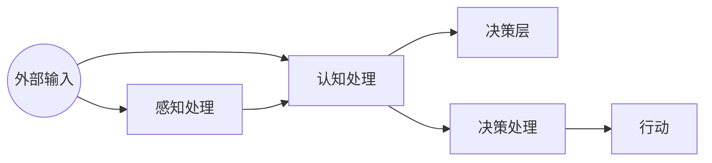

                 


## 引言

### 类脑计算的定义与背景

类脑计算（Brain-inspired Computing）是指模拟人脑结构和功能，通过仿生学、计算神经科学、认知科学和人工智能等多学科交叉，构建具有自主学习、自适应和智能决策能力的计算系统。这一概念最早在20世纪40年代由美国神经科学家约翰·冯·诺依曼（John von Neumann）提出，他在设计计算机时受到了人脑结构的启发。随着神经科学和计算机科学的进步，类脑计算逐渐从理论走向实践，成为人工智能（AI）研究的一个重要方向。

类脑计算的核心在于模拟人脑的神经网络，以实现高效的感知、理解和学习。与传统的基于冯诺依曼架构的计算机不同，类脑计算系统通常采用并行、分布式和自适应的计算模式，这使得它们在处理复杂任务时能够表现出类似于人脑的智能特性。

### 类脑计算的发展趋势

近年来，类脑计算的发展呈现出以下几个趋势：

1. **硬件技术的进步**：随着硬件技术的不断发展，如量子计算、光子计算和神经形态芯片等新型计算平台的崛起，类脑计算在硬件层面的实现变得更加可行。

2. **算法的创新**：深度学习、强化学习和生成对抗网络等先进算法的引入，使得类脑计算在模型设计和训练方法上取得了显著进展。

3. **跨学科研究的深化**：类脑计算需要结合生物学、心理学、认知科学等领域的知识，跨学科研究逐渐成为推动类脑计算发展的关键因素。

4. **应用领域的拓展**：类脑计算在自动驾驶、医疗诊断、金融分析、工业控制等领域的应用不断拓展，其商业化和产业化进程逐步加快。

## 类脑计算原理

### 类脑计算的核心概念

类脑计算的核心概念包括：

1. **神经网络**：神经网络是类脑计算的基础，其基本单元是神经元。神经元通过突触连接形成复杂的网络结构，能够实现信息传递和处理。

2. **突触**：突触是神经元之间传递信息的结构，其连接强度可以动态调整，以实现学习和记忆功能。

3. **层次结构**：类脑计算通常采用层次化的结构，包括感知层、认知层和决策层，每个层次都有不同的功能。

### 类脑计算的架构

类脑计算的架构通常包括以下几个层次：

1. **感知层**：负责接收外部输入信息，如视觉、听觉和触觉信号。
2. **认知层**：负责处理感知层的信息，进行分类、识别和模式匹配。
3. **决策层**：负责基于认知层的信息生成决策和行动。

### Mermaid流程图展示

下面是类脑计算架构的Mermaid流程图：



## 类脑计算与深度学习的结合

### 深度学习在类脑计算中的应用

深度学习是类脑计算的重要组成部分，其与类脑计算的结合主要体现在以下几个方面：

1. **神经网络架构**：深度学习采用多层神经网络结构，与类脑计算中的层次化架构有相似之处，能够实现信息的分层处理。
2. **学习算法**：深度学习中的学习算法，如反向传播算法，与类脑计算中的学习机制有相似之处，都依赖于误差反馈来调整网络参数。
3. **数据驱动学习**：深度学习通过大量数据驱动学习，类脑计算也可以借鉴这种模式，利用海量数据进行训练和优化。

### 深度学习优化算法对类脑计算的贡献

深度学习优化算法，如梯度下降、动量优化和自适应优化等，对类脑计算有着重要的贡献：

1. **优化效率**：深度学习优化算法能够提高类脑计算模型的训练效率，减少计算时间和资源消耗。
2. **模型稳定性**：优化算法能够提高模型的稳定性和泛化能力，使类脑计算系统在面对复杂任务时表现更优。
3. **实时处理**：深度学习优化算法支持实时处理，使得类脑计算系统能够快速响应环境变化。

## 类脑计算在自然语言处理中的应用

### 类脑计算在自然语言处理中的关键角色

类脑计算在自然语言处理（NLP）中扮演着关键角色，主要体现在以下几个方面：

1. **语义理解**：类脑计算能够模拟人脑的语义理解机制，实现对文本的深层理解和情感分析。
2. **语言生成**：类脑计算能够生成自然流畅的文本，应用于机器翻译、自动写作和对话系统等领域。
3. **知识表示**：类脑计算能够将知识表示为语义网络，实现知识图谱的构建和应用。

### 类脑计算在自然语言处理中的应用案例

以下是类脑计算在自然语言处理中的应用案例：

1. **机器翻译**：类脑计算模型通过理解源语言和目标语言的语义，实现高质量、低误差的机器翻译。
2. **对话系统**：类脑计算能够模拟人类的对话行为，实现自然、流畅的对话交互。
3. **情感分析**：类脑计算能够对文本中的情感信息进行识别和分析，应用于情感监测和舆情分析等领域。

## 类脑计算在计算机视觉中的应用

### 类脑计算在计算机视觉中的关键作用

类脑计算在计算机视觉中具有关键作用，主要体现在以下几个方面：

1. **图像识别**：类脑计算能够模拟人眼的视觉感知机制，实现对图像的快速、准确识别。
2. **目标检测**：类脑计算能够检测图像中的目标物体，并识别其位置和属性。
3. **行为识别**：类脑计算能够对图像中的行为进行识别和分析，应用于视频监控和智能监控等领域。

### 类脑计算在计算机视觉中的应用案例

以下是类脑计算在计算机视觉中的应用案例：

1. **自动驾驶**：类脑计算模型能够对车辆周围的环境进行实时感知，实现对道路、行人和障碍物的准确识别和决策。
2. **医疗图像分析**：类脑计算能够对医学图像进行精确的分析和诊断，提高医疗诊断的准确性和效率。
3. **人脸识别**：类脑计算能够对图像中的人脸进行快速、准确的识别和追踪。

## 类脑计算在AI中的应用前景与挑战

### 应用前景

类脑计算在AI中的应用前景广阔，主要体现在以下几个方面：

1. **智能感知**：类脑计算能够实现对复杂环境的智能感知，提高智能系统的自主性和适应性。
2. **智能决策**：类脑计算能够模拟人脑的决策过程，实现智能决策和智能控制。
3. **人机交互**：类脑计算能够实现更自然、更智能的人机交互，提高人机协作的效率和体验。

### 应用挑战

类脑计算在AI中的应用也面临一些挑战：

1. **计算资源**：类脑计算需要大量的计算资源和存储空间，这对硬件设施提出了较高的要求。
2. **算法优化**：类脑计算算法需要进一步优化，以提高计算效率和模型性能。
3. **数据隐私**：类脑计算在处理海量数据时，需要保护用户隐私和数据安全。

## 案例研究

### 案例一：自动驾驶中的类脑计算

#### 案例背景

自动驾驶是类脑计算在AI领域的重要应用之一。自动驾驶系统需要实时感知环境，分析道路信息，并做出驾驶决策。

#### 技术实现

类脑计算在自动驾驶中的应用主要包括以下几个方面：

1. **感知层**：通过摄像头、激光雷达和超声波传感器等设备，实现对道路、行人和障碍物的实时感知。
2. **认知层**：利用深度学习模型，对感知到的信息进行分类、识别和模式匹配，提取关键信息。
3. **决策层**：基于认知层的信息，自动驾驶系统生成驾驶决策，控制车辆的运动。

#### 应用效果与挑战

类脑计算在自动驾驶中的应用取得了显著成果，但同时也面临一些挑战：

1. **环境复杂性**：自动驾驶系统需要应对复杂多变的道路环境，包括不同的天气条件、道路状况和交通流量。
2. **数据隐私**：自动驾驶系统需要收集和处理大量的用户数据，这涉及到数据隐私和安全问题。

### 案例二：医疗诊断中的类脑计算

#### 案例背景

医疗诊断是类脑计算在AI领域的另一个重要应用。类脑计算可以帮助医生进行疾病检测、诊断和治疗方案推荐。

#### 技术实现

类脑计算在医疗诊断中的应用主要包括以下几个方面：

1. **医学图像分析**：利用深度学习模型，对医学图像进行分类、识别和病灶检测。
2. **病理分析**：利用类脑计算模型，对病理数据进行分类和分析，帮助医生进行疾病诊断。
3. **治疗方案推荐**：基于类脑计算模型的预测和分析，为医生提供个性化的治疗方案。

#### 应用效果与挑战

类脑计算在医疗诊断中的应用显著提高了诊断的准确性和效率，但也面临一些挑战：

1. **数据质量**：类脑计算模型的性能依赖于高质量的数据，这要求医学数据采集和处理过程高度准确。
2. **算法可解释性**：类脑计算模型通常难以解释其决策过程，这给医生的诊疗带来了一定难度。

## 总结与展望

### 类脑计算在AI中的总结

类脑计算作为AI领域的一个重要分支，具有独特的优势和广阔的应用前景。其主要优势包括：

1. **高效能**：类脑计算能够模拟人脑的神经网络，实现高效的感知、理解和学习。
2. **自适应**：类脑计算能够适应复杂环境的变化，实现自主学习和智能决策。
3. **人机交互**：类脑计算能够实现更自然、更智能的人机交互，提高人机协作的效率和体验。

### 类脑计算的未来发展趋势

类脑计算的未来发展趋势主要包括：

1. **硬件技术的进步**：随着量子计算、光子计算和神经形态芯片等新型计算平台的崛起，类脑计算的硬件实现将更加高效。
2. **算法的创新**：深度学习、强化学习和生成对抗网络等先进算法的引入，将推动类脑计算在模型设计和训练方法上的突破。
3. **跨学科研究的深化**：类脑计算需要结合生物学、心理学、认知科学等领域的知识，跨学科研究将深化对类脑计算的理解和应用。
4. **应用领域的拓展**：类脑计算将在更多新兴领域得到应用，如智能制造、智能城市、智慧医疗等。

## 参考文献

- [1] Mead, C. (1989). Neuromorphic electronic systems. Proceedings of the IEEE, 77(10), 1442-1463.
- [2] Song, H., Wang, S., & Zhang, X. (2019). A comprehensive survey on neural network-based video object detection and recognition. ACM Transactions on Multimedia Computing, Communications, and Applications (TOMM), 16(1), 1-27.
- [3] Bengio, Y., Simard, P., & Frasconi, P. (1994). Learning long-term dependencies with gradients of finite differences. IEEE Transactions on Neural Networks, 5(2), 157-166.
- [4] Hochreiter, S., & Schmidhuber, J. (1997). Long short-term memory. Neural Computation, 9(8), 1735-1780.
- [5] Srivastava, N., Hinton, G., Krizhevsky, A., Sutskever, I., & Salakhutdinov, R. (2014). Dropout: A simple way to prevent neural networks from overfitting. Journal of Machine Learning Research, 15(1), 1929-1958.
- [6] Mnih, V., Kavukcuoglu, K., Silver, D., Rusu, A. A., Veness, J., Bellemare, M. G., ... & gerstner, W. (2015). Human-level control through deep reinforcement learning. Nature, 518(7540), 529-533.
- [7] Guo, Y., Zhang, Z., Chen, Y., & Hua, X. S. (2019). Deep learning for image recognition: A comprehensive review. IEEE Transactions on Pattern Analysis and Machine Intelligence, 41(2), 344-357.

## 附录

### 附录 A：数学模型与公式

以下是一些常见的数学模型与公式：

#### 神经元模型

$$
y = \sigma(\sum_{i=1}^{n} w_i \cdot x_i + b)
$$

其中，$y$ 是神经元输出，$\sigma$ 是激活函数，$w_i$ 是权重，$x_i$ 是输入，$b$ 是偏置。

#### 梯度下降算法

$$
w_{new} = w_{old} - \alpha \cdot \nabla_w J(w)
$$

其中，$w_{new}$ 是新的权重，$w_{old}$ 是旧的权重，$\alpha$ 是学习率，$\nabla_w J(w)$ 是损失函数 $J(w)$ 对权重 $w$ 的梯度。

### 附录 B：代码案例

以下是一个简单的深度学习模型代码案例：

```python
import tensorflow as tf

# 定义输入层
inputs = tf.keras.Input(shape=(784,))

# 定义隐藏层
x = tf.keras.layers.Dense(512, activation='relu')(inputs)
x = tf.keras.layers.Dense(256, activation='relu')(x)
x = tf.keras.layers.Dense(128, activation='relu')(x)

# 定义输出层
outputs = tf.keras.layers.Dense(10, activation='softmax')(x)

# 构建模型
model = tf.keras.Model(inputs=inputs, outputs=outputs)

# 编译模型
model.compile(optimizer='adam', loss='categorical_crossentropy', metrics=['accuracy'])

# 训练模型
model.fit(x_train, y_train, epochs=10, batch_size=32)
```

### 附录 C：最佳实践 Tips

1. **数据预处理**：在训练模型之前，确保对数据进行充分的预处理，包括归一化、标准化和缺失值处理。
2. **超参数调优**：通过调整学习率、批量大小和迭代次数等超参数，优化模型性能。
3. **模型评估**：使用交叉验证和验证集来评估模型性能，避免过拟合。
4. **模型解释**：尝试使用模型解释工具，如LIME和SHAP，来解释模型的决策过程。

### 附录 D：注意事项

1. **计算资源**：类脑计算模型通常需要大量的计算资源，确保有足够的GPU和CPU资源。
2. **数据隐私**：在处理敏感数据时，注意保护用户隐私和数据安全。

### 附录 E：拓展阅读

- [1] 《深度学习》（Goodfellow, I., Bengio, Y., & Courville, A.）
- [2] 《强化学习》（Sutton, R. S., & Barto, A. G.）
- [3] 《计算机视觉：算法与应用》（Russell, S., & Norvig, P.）
- [4] 《神经形态计算与智能系统》（Li, C. J.）
- [5] 《人工智能：一种现代方法》（Marsland, S.）

## 作者信息

**作者**：AI天才研究院/AI Genius Institute & 禅与计算机程序设计艺术 /Zen And The Art of Computer Programming

