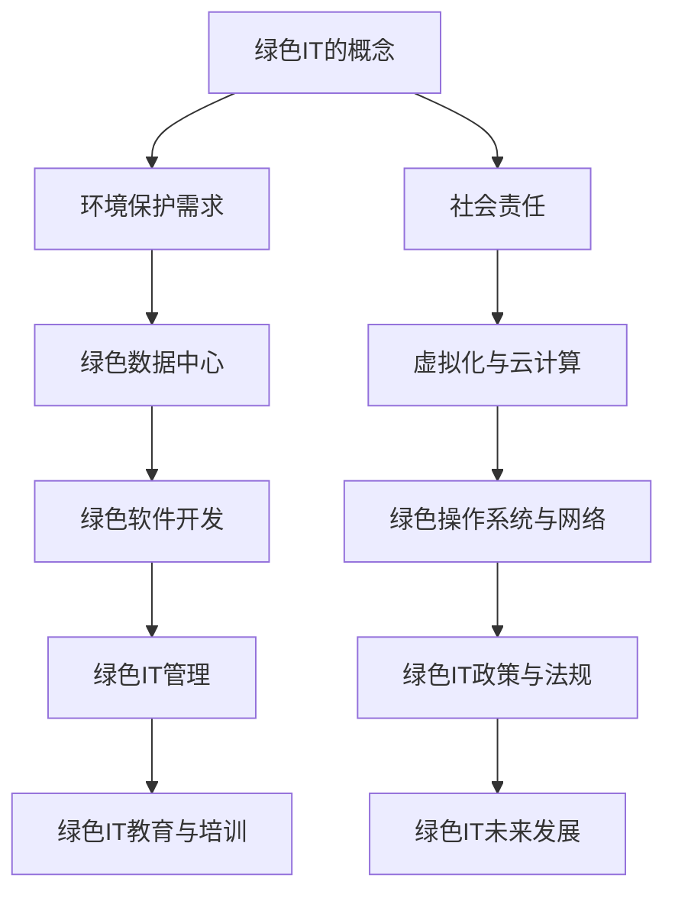

                 

# 文章标题：绿色IT：平衡技术发展和环境保护

## 关键词：绿色IT，技术发展，环境保护，数据中心，虚拟化，云计算，绿色软件，绿色操作系统，绿色网络，管理政策，国际合作

### 摘要：
本文深入探讨了绿色IT的核心理念及其在当今社会的重要性。通过分析绿色IT在数据中心、虚拟化与云计算、绿色软件开发、绿色操作系统与网络等关键领域的应用与实践，本文提出了绿色IT的发展现状、挑战和机遇。同时，文章还探讨了绿色IT管理的策略、政策以及教育与培训的重要性，并展望了绿色IT的未来发展趋势和国际合作。

---

## 引言

随着信息技术的飞速发展，IT行业已成为推动全球经济增长的重要引擎。然而，IT行业的快速发展也带来了巨大的能耗和环境问题。绿色IT（Green IT）作为一种新兴理念，旨在通过优化技术手段，实现信息技术与环境保护的平衡发展。本文将逐步分析绿色IT的概念、技术发展、管理政策及其未来趋势，旨在为读者提供一个全面的绿色IT视角。

### 绿色IT的概念与背景

### 1.1 绿色IT的定义

绿色IT，顾名思义，是指通过提高资源利用效率、减少能源消耗和减少环境污染，实现信息技术行业的可持续发展。绿色IT不仅关注硬件设备的高效使用，还涵盖了软件、数据中心、网络等各个环节的环保措施。

### 1.1.1 绿色IT的基本概念

绿色IT的基本概念包括以下几个方面：

1. **能源效率**：通过优化硬件和软件，提高数据处理和存储的效率，从而减少能耗。
2. **环境管理**：对数据中心、服务器、网络等硬件设施进行环保设计和优化，减少温室气体排放。
3. **废物管理**：在设备报废和电子废物处理过程中，采取环保措施，减少对环境的污染。

### 1.1.2 绿色IT的起源与发展

绿色IT理念的起源可以追溯到20世纪末。随着互联网的兴起和数据中心规模的不断扩大，IT行业的能耗问题逐渐引起关注。2007年，美国环境保护局（EPA）发布了《绿色网格倡议》，标志着绿色IT正式进入公众视野。近年来，随着全球环保意识的提升，绿色IT已经成为各国政府和企业的关注重点。

### 1.2 绿色IT的重要性

### 1.2.1 环境保护需求

绿色IT的兴起源于环境保护的需求。信息技术设备的大量使用和数据中心的高能耗，对环境造成了巨大压力。绿色IT通过减少能耗和排放，有助于缓解全球气候变化和环境问题。

### 1.2.2 社会责任与企业可持续发展

绿色IT是企业履行社会责任、实现可持续发展的重要途径。通过实施绿色IT战略，企业不仅能降低运营成本，还能提升品牌形象，增强市场竞争力。

### 1.3 绿色IT的发展现状与挑战

### 1.3.1 当前绿色IT技术的发展状况

当前，绿色IT技术已取得显著进展。数据中心能耗优化、虚拟化与云计算、绿色软件开发等领域的研究与应用日益成熟。例如，高效服务器设计、数据中心制冷技术、能量回收系统等绿色技术已经广泛应用于实际生产中。

### 1.3.2 绿色IT面临的挑战与机遇

尽管绿色IT取得了显著成就，但仍面临诸多挑战。首先，技术创新和应用成本较高，需要进一步降低；其次，绿色IT标准的制定和执行仍需完善；最后，社会各界的参与和协同发展是绿色IT持续发展的关键。

## 第一部分：技术发展与绿色IT

### 第2章：绿色数据中心

绿色数据中心是绿色IT的核心领域之一。数据中心的高能耗和环境污染问题，已经成为全球关注的焦点。本章将深入探讨绿色数据中心的技术和发展现状，以及相关的挑战和解决方案。

### 2.1 数据中心能耗问题

数据中心能耗问题主要集中在以下几个方面：

1. **服务器能耗**：服务器是数据中心能耗的主要来源，约占整个数据中心能耗的60%以上。
2. **制冷能耗**：为了保持服务器正常运行，数据中心需要大量的制冷设备，这些设备也消耗大量电能。
3. **网络能耗**：网络设备如交换机和路由器的能耗，也是数据中心能耗的重要组成部分。

### 2.1.1 数据中心能耗构成

数据中心的能耗主要分为以下几类：

1. **IT设备能耗**：包括服务器、存储设备、网络设备等的能耗。
2. **制冷能耗**：包括机房空调、冷水机组、冷冻水泵等制冷设备的能耗。
3. **电力供应能耗**：包括UPS不间断电源、发电机等设备的能耗。

### 2.1.2 数据中心能耗优化策略

为了降低数据中心的能耗，可以采取以下优化策略：

1. **服务器节能**：通过采用高效服务器、虚拟化技术、自动化管理等方式，降低服务器能耗。
2. **制冷优化**：采用高效制冷设备、优化制冷系统设计、利用自然冷却等方式，降低制冷能耗。
3. **能源回收**：通过余热回收、能源管理平台等方式，回收利用废热，提高能源利用效率。

### 2.2 绿色数据中心技术

绿色数据中心技术的发展集中在以下几个方面：

1. **高效服务器设计**：采用多核处理器、节能硬件设计、智能功耗管理技术等，提高服务器能效。
2. **数据中心制冷技术**：采用液冷、蒸发冷却、自然冷却等技术，降低制冷能耗。
3. **能量回收系统**：通过余热回收、能源管理平台等方式，提高能源利用效率。

### 2.2.1 高效服务器设计

高效服务器设计是绿色数据中心的关键之一。以下是一些高效服务器设计的关键技术：

1. **多核处理器**：多核处理器可以提高数据处理速度，降低能耗。
2. **节能硬件设计**：通过优化硬件设计，如使用低功耗芯片、优化电路设计等，降低服务器能耗。
3. **智能功耗管理**：通过实时监控和调整服务器功耗，实现节能目标。

### 2.2.2 数据中心制冷技术

数据中心制冷技术也是降低能耗的重要方面。以下是一些常见的制冷技术：

1. **液冷**：通过将服务器冷却液循环流动，带走热量，实现高效制冷。
2. **蒸发冷却**：利用空气中的水蒸气，通过冷凝带走热量，实现制冷。
3. **自然冷却**：利用自然风或水冷，通过散热设备将热量带走，实现制冷。

### 2.2.3 能量回收系统

能量回收系统可以通过回收数据中心产生的废热，实现能源的二次利用。以下是一些能量回收系统的技术：

1. **余热回收**：通过回收服务器、制冷设备等产生的废热，用于供暖或热水。
2. **能源管理平台**：通过实时监控和管理数据中心的能耗，优化能源使用。

### 2.3 数据中心管理策略

数据中心管理策略是实现绿色数据中心的重要环节。以下是一些数据中心管理策略：

1. **节能管理策略**：通过设定合理的能耗指标，制定节能计划，提高数据中心能效。
2. **运行监控与优化**：通过实时监控数据中心的运行状态，及时发现和解决能耗问题。
3. **自动化管理**：通过自动化工具和平台，实现数据中心的智能管理和优化。

## 第二部分：虚拟化与云计算

### 第3章：虚拟化与云计算

虚拟化与云计算是绿色IT发展的重要方向。虚拟化技术通过资源虚拟化，提高资源利用率，降低能耗；云计算则提供了弹性计算资源，实现了更高效的服务提供。本章将探讨虚拟化与云计算在绿色IT中的应用。

### 3.1 虚拟化技术

虚拟化技术是将物理资源抽象为虚拟资源，实现资源灵活调配和管理。虚拟化技术包括以下几个方面：

1. **硬件虚拟化**：通过虚拟化技术，将物理服务器虚拟化为多个虚拟服务器，提高资源利用率。
2. **操作系统虚拟化**：通过虚拟化技术，将操作系统虚拟化为多个独立运行的环境，提高系统稳定性和安全性。
3. **存储虚拟化**：通过虚拟化技术，将物理存储设备虚拟化为多个逻辑存储设备，实现存储资源的高效管理。

### 3.1.1 资源虚拟化原理

资源虚拟化原理主要包括以下几个方面：

1. **虚拟化层**：在物理资源与虚拟资源之间添加一层虚拟化层，实现资源抽象和隔离。
2. **资源分配**：通过虚拟化技术，根据需求动态分配物理资源，实现资源的高效利用。
3. **资源监控**：通过虚拟化技术，实现对虚拟资源的实时监控和管理，确保资源的高效运行。

### 3.1.2 虚拟化技术的优势与挑战

虚拟化技术的优势主要包括：

1. **提高资源利用率**：通过虚拟化技术，可以实现资源的高效利用，降低设备投资成本。
2. **提高系统稳定性**：通过虚拟化技术，可以实现操作系统和应用程序的隔离，提高系统稳定性。
3. **提高安全性**：通过虚拟化技术，可以实现安全域的划分，提高数据安全性。

虚拟化技术的挑战主要包括：

1. **性能损耗**：虚拟化技术会导致一定的性能损耗，需要优化虚拟化层设计，降低性能损耗。
2. **管理复杂度**：虚拟化技术增加了管理的复杂度，需要提高管理工具和技术的水平。

### 3.2 云计算

云计算是一种基于互联网的计算模式，通过提供弹性计算资源，实现更高效的服务提供。云计算主要包括以下几种服务模式：

1. **基础设施即服务（IaaS）**：提供计算资源、存储资源、网络资源等基础设施，用户可以根据需求租用资源。
2. **平台即服务（PaaS）**：提供开发平台、数据库、Web服务等多种开发工具和中间件，用户可以在平台上进行应用开发和部署。
3. **软件即服务（SaaS）**：提供完整的软件应用，用户可以通过互联网访问和使用软件服务。

### 3.2.1 云计算服务模式

云计算服务模式的优势主要包括：

1. **弹性扩展**：云计算可以根据用户需求动态扩展计算资源，实现弹性扩展。
2. **降低成本**：云计算可以降低用户的设备投资和运营成本。
3. **提高效率**：云计算提供了高效的计算资源，可以提升用户的工作效率。

云计算服务模式的挑战主要包括：

1. **数据安全与隐私**：云计算涉及大量的数据存储和处理，需要确保数据的安全和用户隐私。
2. **服务质量**：云计算需要提供高质量的服务，确保用户的业务连续性和数据完整性。

### 3.3 虚拟化与云计算的绿色效益

虚拟化与云计算在绿色IT方面具有显著的绿色效益：

1. **资源利用率提高**：通过虚拟化和云计算，可以实现资源的高效利用，降低设备投资和运营成本。
2. **能耗降低**：虚拟化和云计算可以减少数据中心的能耗，降低温室气体排放。
3. **环境友好**：虚拟化和云计算可以减少设备数量和运营时间，降低对环境的影响。

## 第三部分：绿色软件与系统

### 第4章：绿色软件开发

绿色软件开发是绿色IT的重要组成部分。绿色软件开发旨在通过优化软件开发过程和软件设计，降低软件开发过程中的能耗和环境污染。本章将探讨绿色软件开发的需求、方法以及测试与评估。

### 4.1 绿色软件需求分析

绿色软件需求分析是绿色软件开发的第一步。绿色软件需求分析主要包括以下几个方面：

1. **性能需求**：绿色软件需要满足高效的性能需求，确保软件运行效率。
2. **可靠性需求**：绿色软件需要具备高可靠性，确保软件的稳定运行。
3. **可维护性需求**：绿色软件需要具备良好的可维护性，方便后续维护和升级。
4. **环境影响需求**：绿色软件需要考虑对环境的影响，降低软件开发过程中的能耗和污染。

### 4.1.1 绿色软件需求特点

绿色软件需求特点主要包括以下几个方面：

1. **高效性**：绿色软件需要具备高效性，降低软件开发过程中的资源消耗。
2. **可靠性**：绿色软件需要具备可靠性，确保软件的稳定运行。
3. **环境友好**：绿色软件需要考虑对环境的影响，降低软件开发过程中的能耗和污染。

### 4.1.2 绿色软件设计原则

绿色软件设计原则是绿色软件开发的核心。绿色软件设计原则主要包括以下几个方面：

1. **模块化设计**：采用模块化设计，降低软件开发复杂度，提高软件可维护性。
2. **优化算法**：采用优化算法，降低软件开发过程中的计算复杂度，提高软件效率。
3. **资源管理**：合理管理软件开发过程中的资源，降低能耗和污染。
4. **环境评估**：在设计阶段，对软件运行对环境的影响进行评估，优化设计方案。

### 4.2 绿色软件开发方法

绿色软件开发方法包括以下几个方面：

1. **敏捷开发**：采用敏捷开发方法，缩短软件开发周期，提高软件质量。
2. **持续集成**：采用持续集成方法，实时集成代码，提高软件开发效率。
3. **代码审查**：采用代码审查方法，确保代码质量，降低软件开发过程中的错误。
4. **环境评估**：在软件开发过程中，对软件运行对环境的影响进行评估，优化软件开发过程。

### 4.2.1 软件开发模型选择

绿色软件开发模型选择是绿色软件开发的重要环节。常见的软件开发模型包括：

1. **瀑布模型**：瀑布模型是一种线性顺序开发模型，适用于需求明确、变化较少的项目。
2. **螺旋模型**：螺旋模型是一种迭代开发模型，适用于需求变化频繁、风险较大的项目。
3. **敏捷开发**：敏捷开发是一种迭代开发模型，强调灵活性和快速响应，适用于需求变化较大的项目。

### 4.2.2 软件工程实践中的绿色IT

软件工程实践中的绿色IT主要包括以下几个方面：

1. **代码优化**：通过优化代码，降低软件开发过程中的计算复杂度，提高软件效率。
2. **资源管理**：合理管理软件开发过程中的资源，降低能耗和污染。
3. **环境评估**：在软件开发过程中，对软件运行对环境的影响进行评估，优化软件开发过程。

### 4.3 绿色软件测试与评估

绿色软件测试与评估是确保绿色软件质量的重要环节。绿色软件测试与评估主要包括以下几个方面：

1. **功能测试**：确保软件功能满足需求，实现预期功能。
2. **性能测试**：确保软件在高负载下稳定运行，满足性能要求。
3. **可靠性测试**：确保软件在长期运行中稳定可靠，降低故障率。
4. **环境影响评估**：评估软件运行对环境的影响，优化软件设计。

### 4.3.1 绿色软件测试策略

绿色软件测试策略主要包括以下几个方面：

1. **自动化测试**：采用自动化测试工具，提高测试效率，降低测试成本。
2. **回归测试**：在软件迭代过程中，进行回归测试，确保新功能不影响原有功能。
3. **性能测试**：在软件上线前，进行性能测试，确保软件在高负载下稳定运行。
4. **环境影响评估**：在软件测试过程中，对软件运行对环境的影响进行评估，优化软件设计。

### 4.3.2 绿色软件性能评估方法

绿色软件性能评估方法主要包括以下几个方面：

1. **能效评估**：评估软件运行过程中的能耗和效率，优化软件设计。
2. **环境友好性评估**：评估软件运行对环境的影响，优化软件设计。
3. **可靠性评估**：评估软件在长期运行中的稳定性和可靠性。
4. **用户满意度评估**：评估软件的用户满意度，优化软件设计。

## 第四部分：绿色IT管理与政策

### 第5章：绿色IT管理与政策

绿色IT管理与政策是实现绿色IT目标的关键。通过有效的绿色IT管理和政策，可以推动绿色IT技术的研发和应用，促进信息技术行业的可持续发展。本章将探讨绿色IT管理的框架、策略以及政策与法规的制定与执行。

### 5.1 绿色IT管理

绿色IT管理是指通过制定和实施一系列的管理策略和措施，实现信息技术行业的可持续发展。绿色IT管理主要包括以下几个方面：

1. **能源管理**：通过优化能源使用，降低数据中心和IT设备的能耗。
2. **废物管理**：通过回收和处理电子废物，减少对环境的污染。
3. **环境监测与报告**：通过监测和报告数据中心的能耗和排放情况，提高环保意识。

### 5.1.1 绿色IT管理框架

绿色IT管理框架是一个系统化的管理体系，旨在实现绿色IT的目标。绿色IT管理框架主要包括以下几个方面：

1. **组织结构**：明确绿色IT管理的组织结构和职责分工。
2. **政策与规划**：制定绿色IT管理的政策文件和规划方案。
3. **执行与监控**：实施绿色IT管理措施，并进行监控和评估。
4. **改进与优化**：根据监测和评估结果，不断改进和优化绿色IT管理措施。

### 5.1.2 绿色IT管理体系建设

绿色IT管理体系建设是绿色IT管理的基础。绿色IT管理体系建设主要包括以下几个方面：

1. **制度建设**：制定和完善绿色IT管理的相关制度，确保管理措施的落实。
2. **培训与宣传**：对员工进行绿色IT管理培训，提高员工的环保意识和能力。
3. **技术支持**：提供绿色IT管理所需的技术支持，如能源管理系统、废物管理系统等。
4. **持续改进**：通过持续改进，提高绿色IT管理的效率和质量。

### 5.2 绿色IT政策与法规

绿色IT政策与法规是推动绿色IT发展的重要保障。绿色IT政策与法规主要包括以下几个方面：

1. **国际政策与法规**：介绍国际上的绿色IT政策与法规，如欧盟的《电子废物指令》等。
2. **国家政策与法规**：介绍各国的绿色IT政策与法规，如中国的《电子信息产业节能减排指南》等。
3. **行业规范与标准**：制定绿色IT行业的规范与标准，如绿色数据中心标准等。

### 5.2.1 国际绿色IT政策概况

国际绿色IT政策主要包括以下几个方面：

1. **欧盟政策**：欧盟是绿色IT政策的先行者，制定了《电子废物指令》、《生态设计指令》等政策，推动绿色IT的发展。
2. **美国政策**：美国政府通过《清洁能源法案》、《联邦数据中心战略规划》等政策，推动绿色数据中心的发展。
3. **日本政策**：日本政府通过《绿色IT政策大纲》、《电子废物处理法》等政策，推动绿色IT的发展。

### 5.2.2 我国绿色IT政策及发展

我国绿色IT政策及发展主要包括以下几个方面：

1. **国家政策**：我国政府发布了《电子信息产业节能减排指南》、《绿色数据中心标准》等政策，推动绿色IT的发展。
2. **行业标准**：我国制定了一系列绿色IT行业标准，如《数据中心能效评估标准》、《电子设备能效标准》等。
3. **地方政策**：各地政府也纷纷出台了绿色IT政策，如北京的《绿色数据中心行动计划》、上海的《绿色IT产业发展规划》等。

### 5.3 绿色IT教育与培训

绿色IT教育与培训是培养绿色IT人才的重要途径。绿色IT教育与培训主要包括以下几个方面：

1. **高等教育**：在高等院校开设绿色IT相关专业，培养绿色IT专业人才。
2. **职业教育**：开展绿色IT职业培训，提高从业人员的绿色IT技能。
3. **继续教育**：对在职人员开展绿色IT继续教育，提升其绿色IT素养。

### 5.3.1 绿色IT教育体系

绿色IT教育体系主要包括以下几个方面：

1. **课程设置**：在课程设置中增加绿色IT相关内容，如绿色数据中心技术、虚拟化与云计算等。
2. **教材编写**：编写绿色IT教材，为教学提供支持。
3. **师资培训**：对教师进行绿色IT培训，提高其教学水平。

### 5.3.2 绿色IT职业认证与发展

绿色IT职业认证与发展主要包括以下几个方面：

1. **认证体系**：建立绿色IT职业认证体系，如数据中心能源管理师、云计算工程师等。
2. **认证考试**：组织绿色IT职业认证考试，评估从业人员的技能水平。
3. **职业发展**：为获得认证的从业人员提供职业发展机会，如晋升、薪资调整等。

## 第五部分：绿色IT未来发展

### 第6章：绿色IT未来发展

随着技术的不断进步和社会的持续发展，绿色IT在未来将扮演更加重要的角色。本章将探讨绿色IT的未来发展趋势、社会影响以及国际合作。

### 6.1 绿色IT发展趋势

绿色IT未来的发展趋势主要体现在以下几个方面：

1. **技术创新**：随着人工智能、大数据、5G等技术的不断发展，绿色IT技术将不断创新，实现更高效、更环保的数据处理和存储。
2. **标准化**：绿色IT标准化将逐渐完善，推动绿色IT技术的普及和应用。
3. **智能化**：绿色IT管理将越来越智能化，通过人工智能等技术，实现自动化的能源管理和设备监控。
4. **融合化**：绿色IT将与其他领域如物联网、智能城市等深度融合，推动社会各领域的绿色发展。

### 6.1.1 绿色IT技术前沿

绿色IT技术前沿主要体现在以下几个方面：

1. **高效节能硬件**：研发和应用高效节能的硬件设备，如新型服务器、存储设备、网络设备等。
2. **先进制冷技术**：研发和应用先进的制冷技术，如相变制冷、磁制冷等。
3. **绿色软件技术**：开发和应用绿色软件技术，如能效优化算法、绿色编译器等。
4. **可再生能源应用**：推广和应用可再生能源，如太阳能、风能等，减少对传统化石能源的依赖。

### 6.1.2 绿色IT产业链发展

绿色IT产业链的发展是推动绿色IT技术进步和应用的关键。绿色IT产业链主要包括以下几个方面：

1. **硬件制造**：研发和生产高效节能的硬件设备。
2. **软件开发**：开发和应用绿色软件技术，提供绿色解决方案。
3. **系统集成**：提供绿色IT系统集成服务，实现绿色IT技术的落地应用。
4. **运营维护**：提供绿色IT运营维护服务，确保绿色IT系统的稳定运行。

### 6.2 绿色IT社会影响

绿色IT的发展将对社会产生深远的影响，主要体现在以下几个方面：

1. **环境保护**：通过降低能耗和排放，绿色IT有助于缓解全球气候变化和环境问题。
2. **经济发展**：绿色IT技术将推动信息技术行业的可持续发展，促进经济增长。
3. **社会进步**：绿色IT技术将提高社会生产力和生活质量，推动社会进步。

### 6.2.1 绿色IT对经济的影响

绿色IT对经济的影响主要体现在以下几个方面：

1. **降低成本**：通过提高能效和降低能耗，绿色IT有助于降低企业的运营成本。
2. **促进创新**：绿色IT技术的研发和应用将推动信息技术行业的创新和发展。
3. **创造就业**：绿色IT产业链的拓展将创造大量就业机会，促进就业增长。

### 6.2.2 绿色IT对环境的影响

绿色IT对环境的影响主要体现在以下几个方面：

1. **减少排放**：通过降低能耗和排放，绿色IT有助于减少温室气体排放，缓解气候变化。
2. **资源节约**：绿色IT技术有助于提高资源利用效率，减少资源消耗。
3. **废物减少**：通过回收和处理电子废物，绿色IT有助于减少电子废物的产生和处理。

### 6.3 绿色IT国际合作

绿色IT国际合作是推动全球绿色IT发展的重要途径。绿色IT国际合作主要体现在以下几个方面：

1. **技术交流**：通过国际会议、研讨会等形式，加强绿色IT技术交流与合作。
2. **标准制定**：通过国际标准组织，制定和推广绿色IT国际标准。
3. **项目合作**：通过跨国项目合作，推动绿色IT技术的研发和应用。
4. **政策协调**：通过国际政策协调，推动各国政府制定和实施绿色IT政策。

### 6.3.1 国际合作机制

绿色IT国际合作机制主要包括以下几个方面：

1. **国际组织**：如国际电信联盟（ITU）、国际标准化组织（ISO）等，负责制定和推广绿色IT国际标准和政策。
2. **政府间合作**：如联合国气候变化框架公约（UNFCCC）、国际可再生能源署（IRENA）等，负责推动全球绿色能源和气候行动。
3. **非政府组织**：如绿色和平组织（Greenpeace）、电子废弃物管理国际协会（ISRI）等，负责推动绿色IT和电子废物管理。

### 6.3.2 绿色IT国际合作案例

绿色IT国际合作案例主要包括以下几个方面：

1. **国际项目**：如欧盟的“绿色数据中心联盟”（GDE）、美国的“绿色数据中心倡议”（GDI）等，通过跨国合作，推动绿色数据中心技术的发展。
2. **跨国公司合作**：如IBM与西门子合作研发绿色数据中心技术、谷歌与微软合作推动可再生能源应用等，通过跨国公司合作，推动绿色IT技术的研发和应用。
3. **政府间合作**：如中国与欧盟合作开展“绿色数据中心国际合作项目”、美国与印度合作开展“绿色云计算项目”等，通过政府间合作，推动绿色IT技术的跨国应用。

## 附录：绿色IT相关资源

### 附录A：绿色IT相关资源

为了帮助读者深入了解绿色IT，本文附录部分列举了绿色IT的相关资源，包括文献推荐、技术报告与白皮书以及研究与开发项目。

### A.1 绿色IT文献推荐

#### A.1.1 期刊与杂志

1. **《绿色IT杂志》**：专注于绿色IT技术、政策和应用的研究与探讨。
2. **《计算机研究与发展》**：发表绿色IT领域的研究成果和技术创新。
3. **《环境科学与技术》**：关注绿色IT在环境科学领域中的应用。

#### A.1.2 书籍推荐

1. **《绿色数据中心设计与管理》**：详细介绍了绿色数据中心的设计、管理和优化策略。
2. **《绿色软件工程》**：探讨了绿色软件的需求、设计、开发和测试。
3. **《绿色IT政策与法规》**：分析了各国绿色IT政策的制定与实施。

### A.2 绿色IT技术报告与白皮书

#### A.2.1 行业报告

1. **《全球绿色IT市场报告》**：分析了全球绿色IT市场的趋势和发展前景。
2. **《数据中心能耗报告》**：研究了数据中心的能耗构成和优化策略。
3. **《云计算环境下的绿色计算》**：探讨了云计算在实现绿色计算中的作用。

#### A.2.2 技术白皮书

1. **《高效节能硬件技术白皮书》**：介绍了高效节能硬件的技术原理和应用案例。
2. **《绿色制冷技术白皮书》**：探讨了绿色制冷技术的发展趋势和应用前景。
3. **《绿色软件开发指南》**：提供了绿色软件开发的最佳实践和设计原则。

### A.3 绿色IT研究与开发项目

#### A.3.1 重要项目简介

1. **“绿色数据中心国际合作项目”**：旨在推动全球绿色数据中心技术的发展和应用。
2. **“绿色云计算项目”**：通过跨国合作，推动云计算在绿色计算领域的应用。
3. **“绿色软件工程研究项目”**：专注于绿色软件的需求分析、设计、开发和测试。

#### A.3.2 成果与应用案例

1. **高效节能硬件**：研发了高效节能的服务器和存储设备，广泛应用于企业数据中心。
2. **绿色制冷技术**：通过液冷、蒸发冷却等绿色制冷技术，降低了数据中心的能耗。
3. **绿色软件开发**：开发了一系列绿色软件，如能效优化工具、绿色编译器等，提高了软件的能效。

通过附录部分，读者可以进一步了解绿色IT的丰富资源和前沿动态，为自身的研究和实践活动提供参考。

### 附录B：绿色IT Mermaid 流程图



### 附录C：绿色数据中心能耗优化算法伪代码

```python
# 伪代码：绿色数据中心能耗优化算法

# 初始化数据中心参数
datacenter = {
    "server_count": 100,  # 服务器数量
    "server_energy_consumption": 1000,  # 单台服务器能耗（单位：瓦特）
    "cooling_system_energy_consumption": 500,  # 制冷系统能耗（单位：瓦特）
    "energy_recycling_rate": 0.3  # 能量回收率
}

# 能耗优化目标函数
def optimize_energy_consumption(datacenter):
    total_energy_consumption = 0  # 总能耗
    for server in datacenter["server_count"]:
        total_energy_consumption += datacenter["server_energy_consumption"]
    
    # 能量回收
    recycled_energy = total_energy_consumption * datacenter["energy_recycling_rate"]
    total_energy_consumption -= recycled_energy
    
    # 考虑制冷系统能耗
    total_energy_consumption += datacenter["cooling_system_energy_consumption"]
    
    return total_energy_consumption

# 实例化数据中心并优化能耗
optimized_energy_consumption = optimize_energy_consumption(datacenter)
print("优化后的总能耗：", optimized_energy_consumption, "瓦特")
```

通过上述伪代码，可以实现对绿色数据中心能耗的优化计算，从而降低总能耗，实现绿色数据中心的目标。在实际情况中，还需要结合具体的数据中心设备和运行情况进行详细的能耗计算和优化策略制定。

### 附录D：绿色操作系统与网络技术原理

绿色操作系统和网络技术是实现绿色IT的关键组成部分。以下是对绿色操作系统和网络技术的基本原理和实现方法的详细讲解。

#### 5.1 绿色操作系统

绿色操作系统是指在设计和运行过程中，能够实现能源效率优化、减少能耗和降低环境影响的操作系统。以下是绿色操作系统的一些关键技术和特点：

1. **节能技术**：
   - **动态电压频率调整（DVFS）**：通过实时监测CPU负载，动态调整电压和频率，以降低能耗。
   - **休眠模式**：在CPU空闲时，将系统置于低功耗的休眠状态，减少能耗。
   - **电源管理策略**：实施智能电源管理，如关闭不必要的硬件设备，降低待机能耗。

2. **内存管理**：
   - **内存压缩**：通过内存压缩技术，减少内存使用，降低能耗。
   - **缓存优化**：优化缓存策略，减少数据的访问延迟和能耗。

3. **文件系统优化**：
   - **文件预取**：预测用户的行为，提前加载文件到缓存中，减少磁盘读写操作，降低能耗。

4. **网络优化**：
   - **无线网络管理**：优化无线网络配置，减少无线信号的干扰，提高网络传输效率。
   - **网络流量控制**：根据网络负载，动态调整网络带宽分配，减少能耗。

#### 5.2 绿色网络技术

绿色网络技术是指在网络架构和协议设计方面，通过优化网络性能、减少能耗和降低环境影响的网络技术。以下是绿色网络技术的一些关键技术和实现方法：

1. **网络能耗管理**：
   - **动态网络拓扑优化**：根据网络负载，动态调整网络拓扑结构，减少网络设备能耗。
   - **网络流量优化**：通过流量工程和负载均衡技术，优化网络流量，减少不必要的网络传输，降低能耗。

2. **网络节能协议**：
   - **IPv6**：IPv6协议提供了更大的地址空间，减少了地址转换和路由器的能耗。
   - **节能型网络设备**：设计低功耗的网络设备，如节能路由器、交换机等。
   - **时间同步协议**：优化网络时间同步协议，减少时钟同步过程中的能耗。

3. **无线网络节能**：
   - **动态功率控制**：根据无线信号强度和干扰情况，动态调整发射功率，降低能耗。
   - **睡眠模式**：在网络空闲时，将无线网络设备置于低功耗的睡眠状态。

#### 实现方法

1. **操作系统层面的实现**：
   - **内核级优化**：在操作系统内核层面，通过引入节能模块和优化内核代码，实现节能功能。
   - **用户空间工具**：开发用户空间工具，如电源管理工具、能效监控工具等，帮助用户优化系统设置。

2. **网络设备层面的实现**：
   - **硬件设计**：在硬件层面，采用低功耗芯片和模块，优化电路设计，实现节能目标。
   - **软件驱动**：开发节能型的网络驱动程序，优化网络设备的工作模式和能耗配置。

3. **网络架构优化**：
   - **数据中心网络**：采用高效的数据中心网络架构，如Clos网络、Fat-Tree网络等，提高网络性能和能耗效率。
   - **边缘计算**：将计算和存储能力下沉到网络边缘，减少数据传输距离和能耗。

通过上述实现方法，绿色操作系统和网络技术可以在确保性能和稳定性的同时，实现能耗的优化，为绿色IT的实现提供有力支持。

### 结论

绿色IT作为一种新兴理念，已成为信息技术行业可持续发展的重要方向。本文通过逐步分析绿色IT的概念、技术发展、管理政策及其未来趋势，展示了绿色IT在数据中心、虚拟化与云计算、绿色软件开发、绿色操作系统与网络等关键领域的应用与实践。同时，本文还探讨了绿色IT管理的策略、政策以及教育与培训的重要性，并展望了绿色IT的未来发展趋势和国际合作。

绿色IT不仅关注技术层面的优化，更强调环境保护和社会责任。通过推动绿色IT的发展，我们有望实现信息技术与环境保护的和谐共生，为构建绿色地球贡献力量。同时，绿色IT也带来了新的商业机会和就业岗位，促进了经济的可持续发展。

然而，绿色IT仍面临诸多挑战，如技术创新、标准化、政策法规等。因此，需要政府、企业、学术界和社会各界的共同努力，推动绿色IT的普及和应用，实现信息技术行业的绿色转型。

未来，绿色IT将继续融合新技术，如人工智能、大数据、5G等，推动技术的不断创新。同时，绿色IT政策与法规的完善和实施，将为绿色IT的发展提供有力保障。在国际合作方面，各国应加强交流与合作，共同推动全球绿色IT的发展。

总之，绿色IT是实现信息技术与环境保护平衡发展的重要途径。通过持续的创新和政策支持，我们有信心将绿色IT理念深入到信息技术行业的每一个角落，为构建绿色地球贡献力量。让我们携手共进，为绿色IT的未来发展努力奋斗。作者：AI天才研究院/AI Genius Institute & 禅与计算机程序设计艺术 /Zen And The Art of Computer Programming。|v9|）**绿色IT：平衡技术发展和环境保护** <sop>
---

## 绿色IT：平衡技术发展和环境保护

### 关键词：绿色IT，技术发展，环境保护，数据中心，虚拟化，云计算，绿色软件，绿色操作系统，绿色网络，管理政策，国际合作

### 摘要：
本文深入探讨了绿色IT的核心理念及其在当今社会的重要性。通过分析绿色IT在数据中心、虚拟化与云计算、绿色软件开发、绿色操作系统与网络等关键领域的应用与实践，本文提出了绿色IT的发展现状、挑战和机遇。同时，文章还探讨了绿色IT管理的策略、政策以及教育与培训的重要性，并展望了绿色IT的未来发展趋势和国际合作。

---

## 引言

随着信息技术的飞速发展，IT行业已成为推动全球经济增长的重要引擎。然而，IT行业的快速发展也带来了巨大的能耗和环境问题。绿色IT（Green IT）作为一种新兴理念，旨在通过优化技术手段，实现信息技术与环境保护的平衡发展。本文将逐步分析绿色IT的概念、技术发展、管理政策及其未来趋势，旨在为读者提供一个全面的绿色IT视角。

### 绿色IT的概念与背景

#### 1.1 绿色IT的定义

绿色IT，顾名思义，是指通过提高资源利用效率、减少能源消耗和减少环境污染，实现信息技术行业的可持续发展。绿色IT不仅关注硬件设备的高效使用，还涵盖了软件、数据中心、网络等各个环节的环保措施。

#### 1.1.1 绿色IT的基本概念

绿色IT的基本概念包括以下几个方面：

- **能源效率**：通过优化硬件和软件，提高数据处理和存储的效率，从而减少能耗。
- **环境管理**：对数据中心、服务器、网络等硬件设施进行环保设计和优化，减少温室气体排放。
- **废物管理**：在设备报废和电子废物处理过程中，采取环保措施，减少对环境的污染。

#### 1.1.2 绿色IT的起源与发展

绿色IT理念的起源可以追溯到20世纪末。随着互联网的兴起和数据中心规模的不断扩大，IT行业的能耗问题逐渐引起关注。2007年，美国环境保护局（EPA）发布了《绿色网格倡议》，标志着绿色IT正式进入公众视野。近年来，随着全球环保意识的提升，绿色IT已经成为各国政府和企业的关注重点。

#### 1.2 绿色IT的重要性

#### 1.2.1 环境保护需求

绿色IT的兴起源于环境保护的需求。信息技术设备的大量使用和数据中心的高能耗，对环境造成了巨大压力。绿色IT通过减少能耗和排放，有助于缓解全球气候变化和环境问题。

#### 1.2.2 社会责任与企业可持续发展

绿色IT是企业履行社会责任、实现可持续发展的重要途径。通过实施绿色IT战略，企业不仅能降低运营成本，还能提升品牌形象，增强市场竞争力。

#### 1.3 绿色IT的发展现状与挑战

#### 1.3.1 当前绿色IT技术的发展状况

当前，绿色IT技术已取得显著进展。数据中心能耗优化、虚拟化与云计算、绿色软件开发等领域的研究与应用日益成熟。例如，高效服务器设计、数据中心制冷技术、能量回收系统等绿色技术已经广泛应用于实际生产中。

#### 1.3.2 绿色IT面临的挑战与机遇

尽管绿色IT取得了显著成就，但仍面临诸多挑战。首先，技术创新和应用成本较高，需要进一步降低；其次，绿色IT标准的制定和执行仍需完善；最后，社会各界的参与和协同发展是绿色IT持续发展的关键。

## 第一部分：技术发展与绿色IT

### 第2章：绿色数据中心

绿色数据中心是绿色IT的核心领域之一。数据中心的高能耗和环境污染问题，已经成为全球关注的焦点。本章将深入探讨绿色数据中心的技术和发展现状，以及相关的挑战和解决方案。

### 2.1 数据中心能耗问题

数据中心能耗问题主要集中在以下几个方面：

- **服务器能耗**：服务器是数据中心能耗的主要来源，约占整个数据中心能耗的60%以上。
- **制冷能耗**：为了保持服务器正常运行，数据中心需要大量的制冷设备，这些设备也消耗大量电能。
- **网络能耗**：网络设备如交换机和路由器的能耗，也是数据中心能耗的重要组成部分。

#### 2.1.1 数据中心能耗构成

数据中心的能耗主要分为以下几类：

- **IT设备能耗**：包括服务器、存储设备、网络设备等的能耗。
- **制冷能耗**：包括机房空调、冷水机组、冷冻水泵等制冷设备的能耗。
- **电力供应能耗**：包括UPS不间断电源、发电机等设备的能耗。

#### 2.1.2 数据中心能耗优化策略

为了降低数据中心的能耗，可以采取以下优化策略：

- **服务器节能**：通过采用高效服务器、虚拟化技术、自动化管理等方式，降低服务器能耗。
- **制冷优化**：采用高效制冷设备、优化制冷系统设计、利用自然冷却等方式，降低制冷能耗。
- **能源回收**：通过余热回收、能源管理平台等方式，回收利用废热，提高能源利用效率。

### 2.2 绿色数据中心技术

绿色数据中心技术的发展集中在以下几个方面：

- **高效服务器设计**：采用多核处理器、节能硬件设计、智能功耗管理技术等，提高服务器能效。
- **数据中心制冷技术**：采用液冷、蒸发冷却、自然冷却等技术，降低制冷能耗。
- **能量回收系统**：通过余热回收、能源管理平台等方式，提高能源利用效率。

#### 2.2.1 高效服务器设计

高效服务器设计是绿色数据中心的关键之一。以下是一些高效服务器设计的关键技术：

- **多核处理器**：多核处理器可以提高数据处理速度，降低能耗。
- **节能硬件设计**：通过优化硬件设计，如使用低功耗芯片、优化电路设计等，降低服务器能耗。
- **智能功耗管理**：通过实时监控和调整服务器功耗，实现节能目标。

#### 2.2.2 数据中心制冷技术

数据中心制冷技术也是降低能耗的重要方面。以下是一些常见的制冷技术：

- **液冷**：通过将服务器冷却液循环流动，带走热量，实现高效制冷。
- **蒸发冷却**：利用空气中的水蒸气，通过冷凝带走热量，实现制冷。
- **自然冷却**：利用自然风或水冷，通过散热设备将热量带走，实现制冷。

#### 2.2.3 能量回收系统

能量回收系统可以通过回收数据中心产生的废热，实现能源的二次利用。以下是一些能量回收系统的技术：

- **余热回收**：通过回收服务器、制冷设备等产生的废热，用于供暖或热水。
- **能源管理平台**：通过实时监控和管理数据中心的能耗，优化能源使用。

#### 2.3 数据中心管理策略

数据中心管理策略是实现绿色数据中心的重要环节。以下是一些数据中心管理策略：

- **节能管理策略**：通过设定合理的能耗指标，制定节能计划，提高数据中心能效。
- **运行监控与优化**：通过实时监控数据中心的运行状态，及时发现和解决能耗问题。
- **自动化管理**：通过自动化工具和平台，实现数据中心的智能管理和优化。

### 第3章：虚拟化与云计算

虚拟化与云计算是绿色IT发展的重要方向。虚拟化技术通过资源虚拟化，提高资源利用率，降低能耗；云计算则提供了弹性计算资源，实现了更高效的服务提供。本章将探讨虚拟化与云计算在绿色IT中的应用。

#### 3.1 虚拟化技术

虚拟化技术是将物理资源抽象为虚拟资源，实现资源灵活调配和管理。虚拟化技术包括以下几个方面：

- **硬件虚拟化**：通过虚拟化技术，将物理服务器虚拟化为多个虚拟服务器，提高资源利用率。
- **操作系统虚拟化**：通过虚拟化技术，将操作系统虚拟化为多个独立运行的环境，提高系统稳定性和安全性。
- **存储虚拟化**：通过虚拟化技术，将物理存储设备虚拟化为多个逻辑存储设备，实现存储资源的高效管理。

#### 3.1.1 资源虚拟化原理

资源虚拟化原理主要包括以下几个方面：

- **虚拟化层**：在物理资源与虚拟资源之间添加一层虚拟化层，实现资源抽象和隔离。
- **资源分配**：通过虚拟化技术，根据需求动态分配物理资源，实现资源的高效利用。
- **资源监控**：通过虚拟化技术，实现对虚拟资源的实时监控和管理，确保资源的高效运行。

#### 3.1.2 虚拟化技术的优势与挑战

虚拟化技术的优势主要包括：

- **提高资源利用率**：通过虚拟化技术，可以实现资源的高效利用，降低设备投资成本。
- **提高系统稳定性**：通过虚拟化技术，可以实现操作系统和应用程序的隔离，提高系统稳定性。
- **提高安全性**：通过虚拟化技术，可以实现安全域的划分，提高数据安全性。

虚拟化技术的挑战主要包括：

- **性能损耗**：虚拟化技术会导致一定的性能损耗，需要优化虚拟化层设计，降低性能损耗。
- **管理复杂度**：虚拟化技术增加了管理的复杂度，需要提高管理工具和技术的水平。

#### 3.2 云计算

云计算是一种基于互联网的计算模式，通过提供弹性计算资源，实现更高效的服务提供。云计算主要包括以下几种服务模式：

- **基础设施即服务（IaaS）**：提供计算资源、存储资源、网络资源等基础设施，用户可以根据需求租用资源。
- **平台即服务（PaaS）**：提供开发平台、数据库、Web服务等多种开发工具和中间件，用户可以在平台上进行应用开发和部署。
- **软件即服务（SaaS）**：提供完整的软件应用，用户可以通过互联网访问和

