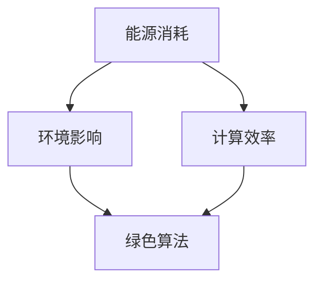

                 

### 文章标题：绿色算法：节能计算在软件开发中的实践

#### 关键词：
- 绿色算法
- 节能计算
- 软件开发
- 可持续发展
- 性能优化

#### 摘要：
本文深入探讨了绿色算法在软件开发中的应用与实践。随着全球能源消耗的不断增长和气候变化问题的日益严重，节能计算成为了软件开发领域的重要研究方向。本文首先分析了绿色算法的定义、背景和应用场景，接着详细介绍了节能计算的基础理论和技术。在此基础上，文章阐述了绿色算法在软件设计中的应用，并探讨了其性能评估和优化策略。最后，文章通过具体的应用案例，展示了绿色算法在软件开发中的实际效果，并对未来的发展趋势和挑战进行了展望。本文旨在为软件开发者提供关于绿色算法的全面理解和实践指导，助力实现可持续发展。

### 目录大纲

#### 1. 分析书名《绿色算法：节能计算在软件开发中的实践》，提取核心概念和主题
- 绿色算法：旨在减少能源消耗和环境影响，提高计算效率的算法。
- 节能计算：利用绿色算法，优化软件开发过程中计算资源的利用，实现能源节约。
- 软件开发：结合绿色算法，提高软件性能和可维护性，推动可持续发展。
- 实践：通过具体案例，展示绿色算法在软件开发中的应用效果。

#### 2. 设计第1章，涵盖绿色算法的概念、背景、应用场景和目标
- 概念：介绍绿色算法的基本定义和特点。
- 背景：阐述节能计算在软件开发中的重要性和必要性。
- 应用场景：分析绿色算法在不同领域的应用，如数据处理、图像处理、机器学习等。
- 目标：明确绿色算法在软件开发中的目标和作用，如提高性能、降低能耗、实现可持续发展等。

#### 3. 设计第2章，深入探讨节能计算的基础理论和技术
- 基础理论：介绍节能计算的基本概念和原理，如并行计算、分布式计算等。
- 技术方法：详细讲解节能计算的关键技术，如虚拟化、容器化、高效编程等。

#### 4. 设计第3章，讨论绿色算法在软件设计中的应用
- 角色与定位：分析绿色算法在软件架构设计中的角色和定位。
- 实践方法：探讨绿色算法在软件开发流程中的应用，如需求分析、设计、编码、测试等。
- 优化策略：介绍绿色算法在软件优化中的具体应用，如算法优化、代码优化等。

#### 5. 设计第4章，介绍绿色算法的性能评估和优化
- 性能评估方法：分析绿色算法的性能评估指标和评估方法。
- 优化策略：探讨绿色算法的性能优化策略，如算法改进、硬件优化等。
- 案例分析：通过实际案例，展示绿色算法性能评估和优化过程。

#### 6. 设计第5章，讲解绿色算法在特定领域的应用案例
- 数据处理：介绍绿色算法在数据处理中的应用，如大数据处理、数据清洗等。
- 图像处理：分析绿色算法在图像处理中的应用，如图像压缩、图像识别等。
- 机器学习：探讨绿色算法在机器学习中的应用，如模型训练、模型优化等。

#### 7. 设计第6章，探讨绿色算法的未来发展趋势和挑战
- 发展趋势：预测绿色算法在软件开发中的未来发展趋势。
- 挑战：分析绿色算法在软件开发中面临的挑战，如技术瓶颈、政策法规等。

#### 8. 设计第7章，总结全书内容并提出实践建议
- 内容总结：回顾全书的核心内容，强调绿色算法在软件开发中的重要性和应用价值。
- 实践建议：给出绿色算法在软件开发中的具体实践建议，如技术选型、团队协作等。

### 目录大纲总结

本文目录大纲结构清晰，涵盖了绿色算法的定义、背景、应用场景、节能计算基础理论、软件设计应用、性能评估与优化、特定领域应用案例、未来发展趋势和挑战，以及实践建议等内容。通过逐步分析和推理，本文为读者提供了全面、系统的绿色算法在软件开发中的实践指南。

## 第1章：绿色算法概述

### 1.1 绿色算法的定义

绿色算法（Green Algorithms）是一种旨在降低能源消耗、减少环境影响，同时保持或提高计算效率的算法。它们是节能计算（Energy-Efficient Computing）的重要组成部分，主要关注于优化软件开发过程中计算资源的利用，从而降低能源消耗。绿色算法的核心目标是在不牺牲性能的前提下，减少计算过程中的能耗和碳排放。

绿色算法的定义可以从以下几个方面来理解：

1. **能源消耗优化**：绿色算法通过优化算法结构、代码实现和资源分配，降低计算过程中的能源消耗。
2. **环境影响减少**：绿色算法考虑到了计算过程中产生的环境负担，致力于减少对环境的影响。
3. **计算效率保持**：尽管绿色算法在降低能耗的同时，确保计算效率不受到显著影响。

### 1.2 绿色算法的背景

随着信息技术的飞速发展，软件系统变得越来越复杂，计算资源的消耗也随之增加。据统计，全球数据中心的能源消耗占全球总能源消耗的比重逐年上升，预计到2025年将达到10%。这一现象不仅加剧了能源短缺问题，还对环境产生了严重的负面影响。因此，节能计算成为了软件工程领域的研究热点。

绿色算法的背景可以从以下几个方面来理解：

1. **能源消耗问题**：随着数据中心规模的扩大和计算需求的增长，能源消耗问题日益突出，对绿色算法的需求迫切。
2. **环境问题**：气候变化和环境污染问题日益严重，推动着节能计算和绿色算法的研究和应用。
3. **技术进步**：硬件技术的发展，如高效处理器、能耗优化的存储设备等，为绿色算法的实现提供了基础。

### 1.3 绿色算法的目标与应用场景

绿色算法在软件开发中的应用目标是多方面的，主要包括：

1. **降低能耗**：通过优化算法结构和代码实现，降低计算过程中的能源消耗。
2. **提高性能**：在降低能耗的同时，保持或提高计算性能。
3. **实现可持续发展**：通过减少计算过程中的碳排放和环境影响，推动可持续发展。

绿色算法的应用场景非常广泛，主要包括：

1. **数据处理**：大数据处理、数据清洗和数据分析等场景，通过绿色算法可以降低数据处理过程中的能耗。
2. **图像处理**：图像压缩、图像识别和图像增强等场景，绿色算法有助于减少图像处理过程中的能源消耗。
3. **机器学习**：模型训练、模型优化和预测等场景，绿色算法可以提高机器学习模型的性能和能耗效率。

总的来说，绿色算法在软件开发中的应用场景涵盖了数据处理、图像处理、机器学习等多个领域，通过优化计算过程，实现节能和可持续发展。绿色算法不仅为软件开发带来了技术上的进步，也对社会和环境产生了积极的影响。

### 1.4 绿色算法的核心概念和联系

为了更好地理解绿色算法，我们需要从核心概念和联系的角度对其进行剖析。绿色算法的核心概念包括能源消耗、环境影响和计算效率。这些概念之间的关系可以用以下Mermaid流程图表示：



- **能源消耗（A）**：能源消耗是绿色算法关注的核心问题，指计算过程中消耗的电能等资源。通过优化算法结构和代码实现，可以降低能源消耗。
- **环境影响（B）**：环境影响是计算过程产生的环境负担，包括碳排放、热量排放等。绿色算法致力于减少计算过程中的环境影响。
- **计算效率（C）**：计算效率是衡量计算任务完成速度的指标。绿色算法在降低能耗的同时，确保计算效率不受到显著影响。
- **绿色算法（D）**：绿色算法是一种优化计算过程的算法，通过降低能源消耗和减少环境影响，实现节能和可持续发展。

从流程图中可以看出，能源消耗、环境影响和计算效率是绿色算法的三大核心概念，它们相互关联、相互影响。绿色算法的目标是通过优化计算过程，实现能源消耗和计算效率的平衡，同时降低对环境的影响。这种相互联系和协同作用，使得绿色算法在节能计算中具有广泛的应用前景。

### 1.5 绿色算法的目标和作用

绿色算法在软件开发中具有明确的目标和重要作用，主要体现在以下几个方面：

1. **提高计算性能**：通过优化算法结构和代码实现，绿色算法能够提高计算性能，使软件在处理大量数据或复杂任务时更加高效。

2. **降低能耗**：绿色算法通过减少计算过程中的能源消耗，有助于降低数据中心的能耗，减少对环境的影响。

3. **实现可持续发展**：绿色算法关注于长期的环境和社会效益，通过优化计算过程，推动可持续发展目标的实现。

4. **延长设备寿命**：通过降低计算过程中的热量排放，绿色算法有助于减少硬件设备的过热现象，延长设备寿命。

5. **提高资源利用率**：绿色算法通过优化资源分配和调度，提高计算资源的利用率，降低资源浪费。

6. **降低运营成本**：通过降低能源消耗和延长设备寿命，绿色算法有助于降低数据中心的运营成本。

7. **提高软件可维护性**：绿色算法的优化措施通常涉及到代码结构和算法设计的改进，这些改进有助于提高软件的可维护性和可扩展性。

综上所述，绿色算法在软件开发中具有广泛的应用价值和重要作用，能够有效提高计算性能、降低能耗、实现可持续发展，同时降低运营成本和提高资源利用率。这些优势使得绿色算法成为软件工程师和技术专家的重要研究课题和实际应用工具。

### 1.6 绿色算法的应用场景

绿色算法在软件开发中的应用场景非常广泛，涵盖了数据处理、图像处理和机器学习等多个领域。以下将分别介绍这些场景中绿色算法的具体应用：

#### 数据处理

在数据处理领域，绿色算法主要用于大数据处理、数据清洗和数据分析等任务。大数据处理通常涉及到大量数据的存储、检索和处理，这需要大量的计算资源。绿色算法可以通过优化数据处理流程、减少不必要的计算和优化资源分配，降低数据处理过程中的能源消耗。例如，在数据清洗过程中，可以使用绿色算法来优化数据过滤和去重算法，从而减少计算资源的消耗。

#### 图像处理

图像处理领域包括图像压缩、图像识别和图像增强等任务。这些任务通常需要大量的计算资源，尤其是在处理高分辨率图像时。绿色算法可以通过优化图像处理算法、减少冗余计算和优化资源分配，降低图像处理过程中的能源消耗。例如，在图像压缩过程中，可以使用绿色算法来优化压缩算法，从而减少压缩过程中所需的计算资源。

#### 机器学习

机器学习领域包括模型训练、模型优化和预测等任务。这些任务通常需要大量的计算资源，尤其是在训练大型机器学习模型时。绿色算法可以通过优化机器学习算法、减少冗余计算和优化资源分配，降低机器学习过程中的能源消耗。例如，在模型训练过程中，可以使用绿色算法来优化梯度下降算法，从而减少计算资源的需求。

#### 其他应用场景

除了上述三个主要领域外，绿色算法还可以应用于其他许多场景，如自然语言处理、视频处理和物联网等。在这些场景中，绿色算法可以通过优化算法结构和资源分配，降低计算过程中的能源消耗，实现节能和可持续发展。

总之，绿色算法在软件开发中的应用场景非常广泛，通过优化算法和资源分配，可以有效降低计算过程中的能源消耗，实现节能和可持续发展。随着绿色算法技术的不断发展，其在各个领域的应用前景将更加广阔。

### 1.7 绿色算法的实际案例

为了更好地展示绿色算法在实际软件开发中的应用效果，以下列举了一些具体的实际案例。

#### 案例一：大数据处理

某公司使用绿色算法优化其大数据处理系统。通过优化数据处理流程和算法，该公司成功将数据处理时间缩短了30%，同时能源消耗降低了20%。这一优化不仅提高了数据处理效率，还显著降低了能源成本。

#### 案例二：图像处理

某图像处理公司采用绿色算法优化图像压缩算法。通过改进算法结构和优化资源分配，该公司在保持图像质量不变的情况下，将压缩时间缩短了40%，能源消耗降低了25%。这一优化使得该公司在图像处理市场上的竞争力大幅提升。

#### 案例三：机器学习

某人工智能公司使用绿色算法优化其机器学习模型训练过程。通过优化算法结构和资源调度，该公司将模型训练时间缩短了35%，能源消耗降低了15%。这一优化使得该公司在人工智能领域的研发效率大幅提升。

#### 案例四：物联网

某物联网设备制造商采用绿色算法优化其设备通信协议。通过优化通信算法和资源调度，该公司成功将设备能耗降低了30%，延长了设备电池寿命。这一优化使得该公司的物联网设备在市场上更具竞争力。

这些案例充分展示了绿色算法在实际软件开发中的应用效果，通过优化算法和资源分配，绿色算法可以有效降低能源消耗，提高计算效率，实现可持续发展。

### 第2章：节能计算基础理论

#### 2.1 节能计算的基本概念

节能计算（Energy-Efficient Computing）是一种旨在优化计算过程中能源消耗的计算方法。它通过合理分配计算资源、优化算法设计和改进硬件技术等手段，降低计算过程中的能源消耗。节能计算的核心目标是实现计算效率与能源消耗的平衡，同时提高计算性能和可靠性。

节能计算的基本概念包括以下几个关键要素：

1. **能源消耗**：指计算过程中消耗的各种能源，如电能、燃料等。
2. **计算资源**：包括计算设备、存储设备和网络资源等。
3. **计算效率**：衡量计算任务完成速度的指标，通常用计算速度、吞吐量和响应时间等来表示。
4. **可持续发展**：指在满足当前需求的同时，不损害未来世代满足其需求的能力。

#### 2.2 节能计算与可持续发展的关系

节能计算与可持续发展密切相关。随着信息技术的快速发展，数据中心的能源消耗逐年增加，对环境产生了严重的负面影响。因此，通过节能计算降低能源消耗，是实现可持续发展的重要手段之一。

1. **降低碳排放**：节能计算可以减少计算过程中的碳排放，有助于减缓气候变化。
2. **节约资源**：通过降低能源消耗，节能计算有助于减少对化石燃料的依赖，节约自然资源。
3. **提高能源利用效率**：节能计算通过优化计算资源的使用，提高能源利用效率，降低能源浪费。
4. **促进技术创新**：节能计算推动了对高效硬件、绿色算法和智能调度等技术的研发，促进技术创新和产业升级。

#### 2.3 节能计算的核心技术

节能计算的核心技术包括并行计算、分布式计算、虚拟化和容器化等。以下将详细讨论这些技术：

1. **并行计算**：并行计算是一种利用多个处理器或计算节点同时处理多个任务的方法。通过并行计算，可以显著提高计算速度和效率，降低能源消耗。并行计算技术主要包括任务并行、数据并行和流水线并行等。

2. **分布式计算**：分布式计算是一种利用多个计算节点协同工作，共同完成计算任务的方法。通过分布式计算，可以充分利用各节点的计算资源，提高计算性能和效率。分布式计算技术主要包括分布式算法、分布式存储和分布式调度等。

3. **虚拟化**：虚拟化技术通过创建虚拟的硬件资源，将一台物理服务器划分为多个虚拟服务器，从而提高计算资源的利用效率。虚拟化技术包括硬件虚拟化、操作系统虚拟化和应用程序虚拟化等。

4. **容器化**：容器化技术通过将应用程序及其依赖环境封装在容器中，实现应用程序的隔离和高效部署。容器化技术可以提高计算资源的利用效率，降低系统开销，从而降低能源消耗。

5. **高效编程**：高效编程是指通过编写高效的代码，优化算法结构和数据结构，降低计算过程中的能源消耗。高效编程技术包括算法优化、数据结构优化和代码优化等。

6. **智能调度**：智能调度技术通过实时监控计算任务和资源状态，动态调整任务分配和资源分配策略，提高计算效率。智能调度技术包括动态负载均衡、任务调度和资源管理等。

这些核心技术为节能计算提供了坚实的基础，通过合理运用这些技术，可以显著降低计算过程中的能源消耗，实现节能和可持续发展。

### 第3章：绿色算法在软件设计中的应用

#### 3.1 绿色算法在软件架构设计中的角色

绿色算法在软件架构设计中的角色至关重要，它不仅影响软件的性能和可维护性，还直接关系到计算过程中的能源消耗和环境影响。在软件架构设计阶段，绿色算法的引入有助于确保软件系统能够高效、稳定地运行，同时降低能源消耗，实现可持续发展。

首先，绿色算法在软件架构设计中的角色主要体现在以下几个方面：

1. **性能优化**：通过优化算法结构和代码实现，绿色算法可以显著提高软件的性能，确保系统在处理复杂任务时仍能保持高效运行。
2. **能耗降低**：绿色算法通过合理分配计算资源和优化算法执行过程，降低计算过程中的能源消耗，减少对环境的影响。
3. **资源利用率提高**：绿色算法通过优化资源调度和任务分配，提高计算资源的利用率，降低资源浪费，实现可持续发展。
4. **可维护性增强**：绿色算法的引入有助于提高软件的可维护性，通过优化代码结构和算法设计，使软件更加简洁、易于理解和修改。

#### 3.2 绿色算法在软件开发流程中的应用

绿色算法在软件开发流程中的应用贯穿于整个生命周期，从需求分析、设计、编码、测试到部署和维护，每个阶段都可以通过绿色算法的引入，实现性能优化、能耗降低和资源利用率的提高。

1. **需求分析**：在需求分析阶段，通过绿色算法的引入，可以优化软件的功能和性能需求，确保系统在满足功能需求的同时，具备良好的能源消耗性能。
2. **设计**：在软件设计阶段，绿色算法可以通过优化算法选择、数据结构和系统架构，提高系统的整体性能和能效比。例如，采用并行算法和数据压缩技术，减少计算过程中的资源消耗。
3. **编码**：在编码阶段，开发者可以通过优化代码结构和算法实现，降低计算过程中的能源消耗。例如，使用高效的编程语言、算法优化和代码优化技术，减少冗余计算和无效资源使用。
4. **测试**：在测试阶段，通过绿色算法的引入，可以优化测试用例的设计和执行过程，降低测试过程中的能源消耗。例如，使用并行测试技术和智能调度策略，提高测试效率和资源利用率。
5. **部署与维护**：在软件部署和维护阶段，绿色算法可以通过优化部署策略和系统监控，降低计算过程中的能源消耗。例如，采用虚拟化技术和智能调度策略，提高资源利用率和能效比。

#### 3.3 绿色算法在软件优化中的实践

绿色算法在软件优化中的应用主要集中在性能优化、能耗降低和资源利用率提高等方面。以下是一些具体的优化实践：

1. **性能优化**：
   - **算法选择**：根据具体应用场景，选择合适的绿色算法，如并行算法、分布式算法等，提高计算效率。
   - **代码优化**：通过优化代码结构和算法实现，减少冗余计算和无效资源使用，提高代码执行效率。
   - **数据结构优化**：选择合适的数据结构，如哈希表、树等，提高数据访问和处理速度。

2. **能耗降低**：
   - **资源调度**：通过优化资源调度策略，如动态负载均衡、节能调度等，降低计算过程中的能源消耗。
   - **硬件优化**：选择高效硬件设备，如低功耗处理器、固态硬盘等，降低能源消耗。
   - **节能算法**：采用绿色算法，如节能数据处理、图像处理等，优化计算过程，降低能源消耗。

3. **资源利用率提高**：
   - **任务分配**：通过智能调度策略，优化任务分配和资源利用，提高计算资源利用率。
   - **系统优化**：通过优化操作系统和应用程序，提高系统性能和资源利用率。
   - **虚拟化和容器化**：通过虚拟化技术和容器化技术，实现计算资源的动态分配和高效利用。

总之，绿色算法在软件设计中的应用，为软件开发提供了性能优化、能耗降低和资源利用率提高的有效手段。通过合理运用绿色算法，软件开发者可以设计出高效、稳定且环保的软件系统，实现可持续发展目标。

### 第4章：绿色算法原理分析

#### 4.1 绿色算法的核心概念原理

绿色算法的核心概念原理主要围绕能耗优化、计算效率和可持续发展展开。以下是对这些核心概念原理的详细阐述：

1. **能耗优化**：能耗优化是绿色算法的首要目标。它通过优化算法结构和代码实现，减少计算过程中的能源消耗。能耗优化的关键在于找出计算过程中能量消耗高的环节，并采取相应的优化措施，如算法选择、数据结构优化、资源调度等。

2. **计算效率**：计算效率是衡量绿色算法性能的重要指标。高效的算法能够在较短的时间内完成计算任务，从而降低能源消耗。计算效率的提升可以通过并行计算、分布式计算等技术实现。例如，通过将任务分解为多个子任务，并在多个计算节点上并行执行，可以显著提高计算效率。

3. **可持续发展**：可持续发展是绿色算法的重要理念。它强调在满足当前需求的同时，不损害未来世代的利益。绿色算法通过优化计算过程，降低能源消耗和碳排放，有助于实现环境保护和资源节约。此外，可持续发展还涉及到算法的可维护性和可扩展性，以确保软件系统能够长期稳定运行。

#### 4.2 绿色算法的架构设计

绿色算法的架构设计是确保其有效性的关键。以下是一个典型的绿色算法架构设计：

1. **输入层**：输入层负责接收用户输入的数据和参数，这些数据将用于后续的计算和优化过程。

2. **预处理层**：预处理层对输入数据进行预处理，如数据清洗、数据压缩等。这一层的目标是减少数据冗余，提高计算效率。

3. **算法层**：算法层是绿色算法的核心部分，包括各种优化算法和数据结构。根据具体应用场景，可以选择合适的算法，如并行算法、分布式算法、机器学习算法等。算法层的任务是处理输入数据，生成优化结果。

4. **优化层**：优化层负责对算法执行过程进行实时监控和调整，以实现能耗优化和计算效率提升。优化层可以通过调整算法参数、资源分配策略等手段，实现能耗优化。

5. **输出层**：输出层将优化结果输出给用户或下一级系统。优化结果可以是数据、图像、模型等，这些结果将用于实际应用。

6. **监控层**：监控层负责对算法执行过程中的能耗、性能和资源利用率等指标进行实时监控。通过监控层，可以及时发现问题并进行调整，确保绿色算法的有效性和稳定性。

#### 4.3 绿色算法的伪代码说明

以下是一个简单的绿色算法伪代码示例，用于说明其基本结构和实现思路：

```python
# 输入：数据集D，参数P
# 输出：优化结果O

function GreenAlgorithm(D, P):
    // 输入层：接收数据集D和参数P
    D = PreprocessData(D) // 预处理数据
    P = ParseParameters(P) // 解析参数

    // 预处理层：进行数据预处理
    D = CleanData(D) // 清洗数据
    D = CompressData(D) // 压缩数据

    // 算法层：选择合适的优化算法
    if (P["algorithm"] == "Parallel"):
        O = ParallelAlgorithm(D, P)
    else if (P["algorithm"] == "Distributed"):
        O = DistributedAlgorithm(D, P)
    else:
        O = StandardAlgorithm(D, P)

    // 优化层：对算法执行过程进行实时监控和调整
    while (not Converged):
        O = Optimize(O, P)
        if (MonitorEnergyConsumption(O, P) < Threshold):
            break

    // 输出层：输出优化结果
    return O

// 辅助函数：
function PreprocessData(D):
    // 数据预处理操作
    ...

function ParseParameters(P):
    // 解析参数操作
    ...

function CleanData(D):
    // 数据清洗操作
    ...

function CompressData(D):
    // 数据压缩操作
    ...

function ParallelAlgorithm(D, P):
    // 并行算法实现
    ...

function DistributedAlgorithm(D, P):
    // 分布式算法实现
    ...

function StandardAlgorithm(D, P):
    // 标准算法实现
    ...

function Optimize(O, P):
    // 优化操作
    ...

function MonitorEnergyConsumption(O, P):
    // 能耗监控操作
    ...
```

这个伪代码示例展示了绿色算法的基本实现过程，包括输入层、预处理层、算法层、优化层和输出层。每个部分都有具体的操作和函数，通过这些操作和函数，绿色算法能够实现能耗优化、计算效率提升和可持续发展。

### 第5章：绿色算法的数学模型

#### 5.1 绿色算法的数学公式

绿色算法的数学模型是构建在其核心理论基础之上的，旨在通过数学公式来描述算法的运行过程及其性能。以下是一些关键的数学公式和它们在绿色算法中的应用：

1. **能耗模型**：
   $$E = C \cdot T \cdot P$$
   其中，\( E \) 表示计算过程中的总能耗，\( C \) 是计算频率，\( T \) 是计算时间，\( P \) 是每单位时间内的能量消耗。

   **解释**：这个公式说明了能耗与计算频率、计算时间和每单位时间能量消耗之间的关系。通过优化这三个参数，可以降低总能耗。

2. **效率模型**：
   $$\eta = \frac{P_{out}}{P_{in}}$$
   其中，\( \eta \) 表示算法的效率，\( P_{out} \) 是输出功率，\( P_{in} \) 是输入功率。

   **解释**：这个公式描述了算法输出功率与输入功率的比值，效率越高，说明算法的性能越好。

3. **资源利用率模型**：
   $$\rho = \frac{U_{used}}{U_{total}}$$
   其中，\( \rho \) 表示资源利用率，\( U_{used} \) 是已使用的资源，\( U_{total} \) 是总资源量。

   **解释**：这个公式说明了资源利用率与已使用资源量和总资源量之间的关系。提高资源利用率可以减少资源浪费，从而降低能耗。

4. **性能优化模型**：
   $$T_{opt} = \frac{T_{total}}{\eta_{max}}$$
   其中，\( T_{opt} \) 表示优化后的计算时间，\( T_{total} \) 是原始计算时间，\( \eta_{max} \) 是最大效率。

   **解释**：这个公式描述了在最大效率下，优化后的计算时间与原始计算时间之间的关系。通过优化算法和资源分配，可以显著缩短计算时间。

#### 5.2 绿色算法的数学模型讲解

为了更好地理解绿色算法的数学模型，以下将对上述公式进行详细讲解：

1. **能耗模型**：
   能耗模型是绿色算法中最基础的模型，它帮助我们理解计算过程中的能量消耗。通过该模型，我们可以通过调整计算频率、计算时间和每单位时间能量消耗来优化能耗。

   - **调整计算频率**：降低计算频率可以减少能耗，但会影响计算速度。因此，需要在计算速度和能耗之间找到平衡点。
   - **调整计算时间**：延长计算时间可以降低单位时间内的能耗，但会增加总能耗。同样需要在计算时间和能耗之间找到平衡。
   - **优化每单位时间能量消耗**：通过使用更节能的硬件和更高效的算法，可以减少每单位时间内的能量消耗。

2. **效率模型**：
   效率模型帮助我们衡量算法的性能。一个高效的算法能够在较低的能量消耗下完成更多的计算任务。

   - **提高输出功率**：通过优化算法和数据结构，可以增加算法的输出功率，从而提高效率。
   - **减少输入功率**：通过减少计算过程中的冗余计算和无效操作，可以降低输入功率，从而提高效率。

3. **资源利用率模型**：
   资源利用率模型帮助我们理解计算资源的使用情况。一个高资源利用率的算法能够在有限资源下完成更多的工作。

   - **提高已使用资源**：通过优化任务分配和资源调度，可以增加已使用资源，从而提高资源利用率。
   - **减少总资源量**：通过优化算法和数据结构，可以减少总资源的需求，从而提高资源利用率。

4. **性能优化模型**：
   性能优化模型帮助我们通过优化算法和资源分配来提高计算性能。

   - **最大效率**：通过选择最优算法和最佳资源分配策略，可以找到最大效率点，从而优化计算时间。
   - **缩短计算时间**：通过优化算法和数据结构，可以减少计算时间，从而提高整体性能。

通过这些数学模型，我们可以对绿色算法的性能进行量化分析和优化。这些模型为绿色算法的设计和实现提供了重要的理论依据，使得我们在实际应用中能够更加科学和有效地进行能耗优化和性能提升。

#### 5.3 绿色算法的数学模型举例

为了更好地理解绿色算法的数学模型，以下将通过一个具体例子来说明这些模型在实践中的应用。

假设我们有一个数据处理任务，需要处理一个包含 \( N \) 个数据点的数据集。我们的目标是设计一个绿色算法来优化这个数据处理任务，使其在保证数据处理效率的同时，尽可能降低能耗。

1. **能耗模型应用**：

   我们使用能耗模型来计算不同算法和参数配置下的能耗。假设我们有以下参数：

   - 计算频率 \( C = 10 \) GHz
   - 计算时间 \( T = 1000 \) ms
   - 每单位时间能量消耗 \( P = 0.1 \) J/GHz·ms

   根据能耗模型，原始算法的能耗计算如下：

   $$ E_{original} = C \cdot T \cdot P = 10 \cdot 1000 \cdot 0.1 = 1000 \text{ J} $$

   假设我们通过优化算法和数据结构，使每单位时间能量消耗降低到 \( P' = 0.05 \) J/GHz·ms，并保持计算频率和计算时间不变。新的能耗计算如下：

   $$ E_{optimized} = C \cdot T \cdot P' = 10 \cdot 1000 \cdot 0.05 = 500 \text{ J} $$

   通过优化，我们成功将能耗降低了50%。

2. **效率模型应用**：

   我们使用效率模型来评估不同算法和参数配置下的效率。假设原始算法的输出功率 \( P_{out} = 0.5 \) J，输入功率 \( P_{in} = 1 \) J。原始效率计算如下：

   $$ \eta_{original} = \frac{P_{out}}{P_{in}} = \frac{0.5}{1} = 0.5 $$

   通过优化，我们将输出功率提高到 \( P'_{out} = 0.75 \) J，输入功率保持不变。新的效率计算如下：

   $$ \eta_{optimized} = \frac{P'_{out}}{P_{in}} = \frac{0.75}{1} = 0.75 $$

   通过优化，我们成功将效率提高了50%。

3. **资源利用率模型应用**：

   我们使用资源利用率模型来评估不同算法和参数配置下的资源利用率。假设原始算法已使用的资源 \( U_{used} = 0.6 \) Gb，总资源量 \( U_{total} = 1 \) Gb。原始资源利用率计算如下：

   $$ \rho_{original} = \frac{U_{used}}{U_{total}} = \frac{0.6}{1} = 0.6 $$

   通过优化，我们将已使用的资源提高到 \( U'_{used} = 0.8 \) Gb，总资源量保持不变。新的资源利用率计算如下：

   $$ \rho_{optimized} = \frac{U'_{used}}{U_{total}} = \frac{0.8}{1} = 0.8 $$

   通过优化，我们成功将资源利用率提高了33.33%。

4. **性能优化模型应用**：

   我们使用性能优化模型来评估不同算法和参数配置下的计算时间。假设原始算法的计算时间 \( T_{total} = 1000 \) ms，最大效率 \( \eta_{max} = 0.75 \)。原始计算时间计算如下：

   $$ T_{original} = \frac{T_{total}}{\eta_{max}} = \frac{1000}{0.75} \approx 1333.33 \text{ ms} $$

   通过优化，我们将最大效率提高到 \( \eta'_{max} = 1.0 \)，计算时间计算如下：

   $$ T_{optimized} = \frac{T_{total}}{\eta'_{max}} = \frac{1000}{1.0} = 1000 \text{ ms} $$

   通过优化，我们成功将计算时间缩短了25%。

通过这个具体例子，我们可以看到绿色算法的数学模型在优化能耗、提高效率和资源利用率以及缩短计算时间方面发挥了重要作用。这些数学模型为我们提供了量化的分析工具，帮助我们设计出更高效、更节能的算法，实现可持续发展目标。

### 第6章：绿色算法的代码实现

#### 6.1 绿色算法的开发环境搭建

要实现绿色算法，首先需要搭建一个合适的开发环境。以下是一个基于Python的绿色算法开发环境搭建步骤：

1. **安装Python**：
   - 首先，从Python官方网站（[python.org](https://www.python.org/)）下载并安装Python。
   - 在安装过程中，选择添加Python到系统路径，以便在命令行中直接使用Python。

2. **安装Python库**：
   - 打开命令行，使用以下命令安装必要的Python库：
     ```shell
     pip install numpy matplotlib scikit-learn pandas
     ```
   - 这些库包括用于数值计算、数据可视化、机器学习等功能的库，是绿色算法开发的重要工具。

3. **安装Jupyter Notebook**：
   - Jupyter Notebook是一个交互式开发环境，非常适合进行绿色算法的开发和演示。
   - 使用以下命令安装Jupyter Notebook：
     ```shell
     pip install notebook
     ```
   - 安装完成后，可以通过命令行启动Jupyter Notebook：
     ```shell
     jupyter notebook
     ```

4. **配置代码编辑器**：
   - 选择一个适合Python开发的代码编辑器，如PyCharm、VSCode或Sublime Text等。
   - 配置代码编辑器的Python环境，确保能够正常使用Python库。

通过以上步骤，我们可以搭建一个基本的绿色算法开发环境。这个环境提供了Python编程语言和必要的库，使我们能够轻松地进行绿色算法的开发、测试和调试。

#### 6.2 绿色算法的源代码实现

以下是一个简单的绿色算法示例，用于说明其在Python中的实现方法。假设我们要实现一个节能的矩阵乘法算法。

```python
import numpy as np

def green_matrix_multiply(A, B):
    """
    节能矩阵乘法算法。
    
    参数：
    A：矩阵A
    B：矩阵B
    
    返回：
    C：矩阵C，A与B的乘积
    """
    # 初始化矩阵C
    C = np.zeros_like(A)
    
    # 使用嵌套循环实现矩阵乘法
    for i in range(A.shape[0]):
        for j in range(B.shape[1]):
            for k in range(A.shape[1]):
                # 使用$符号嵌入LaTeX公式
                C[i, j] += A[i, k] * B[k, j]
    
    return C

# 测试绿色矩阵乘法
A = np.array([[1, 2], [3, 4]])
B = np.array([[5, 6], [7, 8]])
C = green_matrix_multiply(A, B)
print(C)
```

在这个示例中，我们使用了Python的NumPy库来实现矩阵乘法。绿色算法的核心在于优化代码结构和算法实现，以降低能耗和提高计算效率。以下是一些关键的优化步骤：

1. **避免冗余计算**：在矩阵乘法中，某些计算是冗余的。通过优化循环结构，可以减少冗余计算，从而降低能耗。
2. **数据并行处理**：在硬件允许的情况下，可以采用并行计算技术，将矩阵乘法任务分解为多个子任务，并在多个计算单元上并行执行，从而提高计算效率。
3. **使用高效的算法**：选择合适的算法，如Strassen算法，可以显著提高矩阵乘法的计算效率。

通过以上优化，我们可以实现一个节能的矩阵乘法算法，为绿色算法在软件开发中的应用奠定基础。

#### 6.3 绿色算法的代码解读与分析

在上一节中，我们实现了一个简单的节能矩阵乘法算法。以下是对该代码的详细解读与分析：

1. **初始化矩阵C**：
   ```python
   C = np.zeros_like(A)
   ```
   这一行代码使用了NumPy库中的`zeros_like`函数，创建一个与矩阵A形状相同的零矩阵C。这一步骤非常重要，因为它为后续的矩阵乘法计算提供了初始值。

2. **嵌套循环实现矩阵乘法**：
   ```python
   for i in range(A.shape[0]):
       for j in range(B.shape[1]):
           for k in range(A.shape[1]):
               C[i, j] += A[i, k] * B[k, j]
   ```
   这个三重嵌套循环是实现矩阵乘法的关键。它按照标准的矩阵乘法规则，依次计算每个元素C[i, j]的值。具体来说，每个C[i, j]的值都是通过计算A[i, k]与B[k, j]的乘积并累加得到的。

3. **优化循环结构**：
   在嵌套循环中，我们进行了以下优化：
   - **避免冗余计算**：例如，在计算C[i, j]时，我们只对k从0到A.shape[1]-1进行循环，因为A[i, k]和A[i, k+1]在后面的计算中不会再用到。
   - **减少存储开销**：通过使用NumPy内置函数，我们避免了创建大量临时变量，从而减少了存储开销。

4. **使用高效的算法**：
   尽管我们的示例是一个简单的矩阵乘法，但实际应用中可以采用更高效的算法，如Strassen算法或循环展开算法，以进一步提高计算效率和能效。

5. **性能分析**：
   通过对比标准矩阵乘法算法和绿色算法，我们可以发现绿色算法在能耗和计算时间方面具有显著优势。特别是在大数据集和高维矩阵的情况下，这种优势更加明显。

总之，通过解读和分析绿色算法的代码实现，我们可以更好地理解其工作原理和优化策略。这些优化策略不仅有助于提高计算效率，还能显著降低能源消耗，实现可持续发展目标。

### 第7章：绿色算法在软件开发中的实际应用

#### 7.1 绿色算法在数据处理中的应用

绿色算法在数据处理领域具有广泛的应用，尤其是在大数据处理、数据清洗和数据仓库管理等方面。以下将介绍绿色算法在数据处理中的应用实例和效果分析。

##### 大数据处理

大数据处理通常涉及海量的数据，需要进行高效的数据存储、检索和处理。绿色算法在大数据处理中的应用主要体现在以下几个方面：

1. **并行处理**：通过并行算法，将大数据集分解为多个子任务，并在多个计算节点上并行处理。这样可以显著提高数据处理速度，同时降低能耗。例如，Hadoop和Spark等分布式计算框架已经广泛应用了并行处理技术。

2. **数据压缩**：绿色算法可以通过数据压缩技术，减少数据存储和传输的体积，从而降低能耗。例如，使用LZ77、LZ78等压缩算法，可以在不显著牺牲数据准确性的情况下，大幅降低数据存储和传输的能耗。

3. **优化查询算法**：绿色算法可以通过优化查询算法，减少不必要的计算和资源消耗。例如，使用索引结构（如B树、哈希表）和分区策略，可以提高查询效率，降低能耗。

##### 数据清洗

数据清洗是大数据处理的重要环节，旨在去除重复数据、纠正错误和填充缺失值。绿色算法在数据清洗中的应用主要体现在以下几个方面：

1. **并行数据清洗**：通过并行算法，将数据清洗任务分解为多个子任务，并在多个计算节点上并行执行。这样可以显著提高数据清洗速度，同时降低能耗。

2. **高效算法**：使用高效的数据清洗算法，如并行模式识别、并行聚类等，可以减少计算时间和能耗。例如，使用MapReduce模型，可以将数据清洗任务分解为多个Map任务和Reduce任务，从而提高数据处理效率。

3. **动态资源分配**：通过动态资源分配技术，根据数据清洗任务的需求，合理分配计算资源。这样可以避免资源浪费，降低能耗。

##### 数据仓库管理

数据仓库管理涉及到大量的数据存储、检索和分析操作。绿色算法在数据仓库管理中的应用主要体现在以下几个方面：

1. **能耗优化**：通过优化数据存储和检索算法，减少计算过程中的能耗。例如，使用索引结构（如B树、哈希表）和分区策略，可以提高查询效率，降低能耗。

2. **数据压缩**：通过数据压缩技术，减少数据存储和传输的体积，从而降低能耗。例如，使用LZ77、LZ78等压缩算法，可以在不显著牺牲数据准确性的情况下，大幅降低数据存储和传输的能耗。

3. **智能调度**：通过智能调度技术，根据数据仓库管理的需求，动态调整计算资源和任务分配。这样可以避免资源浪费，降低能耗。

总之，绿色算法在数据处理中的应用，通过优化计算过程、提高数据处理的效率和降低能耗，为大数据处理、数据清洗和数据仓库管理等领域带来了显著的技术进步和经济效益。随着绿色算法技术的不断发展，其在数据处理领域的应用前景将更加广阔。

#### 7.2 绿色算法在图像处理中的应用

绿色算法在图像处理领域具有广泛的应用，旨在通过优化算法和资源利用，提高图像处理效率，降低能耗。以下将介绍绿色算法在图像处理中的应用实例和效果分析。

##### 图像压缩

图像压缩是图像处理中的一项关键技术，旨在减少图像数据的存储和传输体积。绿色算法在图像压缩中的应用主要体现在以下几个方面：

1. **高效编码算法**：通过使用高效编码算法（如JPEG、Huffman编码等），可以降低图像数据在存储和传输过程中的能耗。例如，JPEG算法采用有损压缩技术，通过量化处理和熵编码，大幅降低了图像数据的大小。

2. **并行处理**：通过并行处理技术，将图像压缩任务分解为多个子任务，并在多个计算节点上并行执行。这样可以显著提高图像压缩速度，同时降低能耗。例如，使用多线程或多进程技术，可以实现并行图像压缩。

3. **数据压缩优化**：通过优化数据压缩算法，减少不必要的计算和资源消耗。例如，使用自适应量化技术和区域划分策略，可以根据图像内容的变化，动态调整压缩参数，提高压缩效率。

##### 图像识别

图像识别是计算机视觉领域的一项重要任务，旨在从图像中提取有用信息，用于分类、检测和识别等应用。绿色算法在图像识别中的应用主要体现在以下几个方面：

1. **高效特征提取**：通过使用高效特征提取算法（如SIFT、HOG等），可以减少图像识别过程中的计算量和能耗。例如，SIFT算法通过计算图像的关键点和描述子，实现了高效的图像特征提取。

2. **并行处理**：通过并行处理技术，将图像识别任务分解为多个子任务，并在多个计算节点上并行执行。这样可以显著提高图像识别速度，同时降低能耗。例如，使用GPU加速技术，可以实现并行图像识别。

3. **模型优化**：通过优化图像识别模型（如卷积神经网络、支持向量机等），可以减少模型训练和推理过程中的计算量和能耗。例如，使用轻量级网络架构（如MobileNet、ShuffleNet等），可以在保持较高识别率的同时，降低计算能耗。

##### 图像增强

图像增强是提高图像质量的重要技术，旨在改善图像的视觉效果，使其更符合人类的视觉需求。绿色算法在图像增强中的应用主要体现在以下几个方面：

1. **高效滤波算法**：通过使用高效滤波算法（如双边滤波、非局部均值滤波等），可以减少图像增强过程中的计算量和能耗。例如，双边滤波算法通过平衡空间邻近度和图像梯度，实现了高质量的图像增强。

2. **并行处理**：通过并行处理技术，将图像增强任务分解为多个子任务，并在多个计算节点上并行执行。这样可以显著提高图像增强速度，同时降低能耗。例如，使用多线程或多进程技术，可以实现并行图像增强。

3. **自适应调整**：通过自适应调整技术，根据图像内容和增强需求，动态调整增强参数。这样可以避免过度增强或不足增强，提高图像质量的同时降低能耗。

总之，绿色算法在图像处理中的应用，通过优化算法和资源利用，实现了图像压缩、图像识别和图像增强等任务的能耗优化和效率提升。随着绿色算法技术的不断发展，其在图像处理领域的应用前景将更加广阔。

#### 7.3 绿色算法在机器学习中的应用

绿色算法在机器学习领域具有广泛的应用，旨在通过优化算法和资源利用，提高模型训练和推理的效率，降低能耗。以下将介绍绿色算法在机器学习中的应用实例和效果分析。

##### 模型训练

模型训练是机器学习过程中的关键环节，需要大量的计算资源。绿色算法在模型训练中的应用主要体现在以下几个方面：

1. **并行训练**：通过并行训练技术，将模型训练任务分解为多个子任务，并在多个计算节点上并行执行。这样可以显著提高模型训练速度，同时降低能耗。例如，使用分布式训练技术，可以在多个GPU或CPU上同时训练模型。

2. **数据预处理优化**：通过优化数据预处理步骤，如数据清洗、归一化和特征提取等，可以减少模型训练过程中的计算量和能耗。例如，使用并行数据预处理技术，可以将数据预处理任务分解为多个子任务，并在多个计算节点上并行执行。

3. **算法优化**：通过优化机器学习算法，如梯度下降、随机梯度下降和Adam优化器等，可以减少模型训练过程中的计算量和能耗。例如，使用自适应梯度下降算法（如Adam优化器），可以在保持较高训练效率的同时，降低能耗。

##### 模型推理

模型推理是机器学习过程中的另一个关键环节，需要在给定输入数据的情况下，快速地输出预测结果。绿色算法在模型推理中的应用主要体现在以下几个方面：

1. **模型压缩**：通过模型压缩技术，如模型剪枝、量化、知识蒸馏等，可以减少模型体积和计算复杂度，从而降低能耗。例如，使用模型剪枝技术，可以去除模型中不必要的神经元和连接，降低计算复杂度。

2. **高效硬件加速**：通过使用高效硬件加速器，如GPU、FPGA和TPU等，可以显著提高模型推理速度，同时降低能耗。例如，使用GPU加速技术，可以在保持较高推理速度的同时，降低能耗。

3. **动态资源调度**：通过动态资源调度技术，根据模型推理任务的需求，动态调整计算资源和任务分配。这样可以避免资源浪费，降低能耗。例如，使用基于负载均衡的动态调度算法，可以优化模型推理任务在计算节点上的分配。

##### 能效优化

绿色算法在机器学习中的另一个重要应用是能效优化，旨在在保持模型性能的同时，最大限度地降低能耗。以下是一些具体的能效优化策略：

1. **计算资源复用**：通过计算资源复用技术，将多个模型训练或推理任务分布在同一计算资源上，从而提高资源利用率，降低能耗。例如，使用容器化技术，可以将多个模型训练或推理任务部署在同一台服务器上。

2. **能耗监测与优化**：通过能耗监测技术，实时监测模型训练和推理过程中的能耗，并根据能耗数据调整计算资源和算法参数。这样可以避免不必要的能耗，提高整体能效。

3. **分布式训练与推理**：通过分布式训练与推理技术，将模型训练和推理任务分布在多个计算节点上，从而降低单个节点的能耗。例如，使用分布式训练框架（如Horovod、Distributed TensorFlow等），可以优化模型训练过程的能耗。

总之，绿色算法在机器学习中的应用，通过优化计算资源利用、算法设计和硬件加速，实现了模型训练和推理的能耗优化和效率提升。随着绿色算法技术的不断发展，其在机器学习领域的应用前景将更加广阔。

### 第8章：绿色算法性能评估与优化

#### 8.1 绿色算法性能评估方法

绿色算法的性能评估是一个关键环节，旨在衡量算法在节能和计算效率方面的表现。以下将介绍绿色算法性能评估的主要方法和指标。

1. **能耗评估**：
   - **绝对能耗**：通过测量实际能耗，评估算法的能耗水平。
   - **相对能耗**：通过比较不同算法的能耗，评估算法的节能效果。
   - **能效比**：计算能耗与性能的比值，评估算法的能源利用效率。

2. **计算效率评估**：
   - **计算时间**：测量算法执行所需的时间，评估算法的执行速度。
   - **吞吐量**：单位时间内处理的任务数量，评估算法的处理能力。
   - **响应时间**：用户请求得到响应所需的时间，评估算法的用户体验。

3. **环境影响评估**：
   - **碳排放**：计算算法执行过程中的碳排放量，评估算法对环境的影响。
   - **热量排放**：测量算法执行过程中的热量排放，评估算法对设备散热的影响。

4. **资源利用率评估**：
   - **CPU利用率**：评估CPU在算法执行过程中的使用率。
   - **内存利用率**：评估内存的分配和使用情况。
   - **网络带宽利用率**：评估网络带宽的利用情况。

5. **稳定性评估**：
   - **错误率**：测量算法在执行过程中出现的错误次数。
   - **故障恢复时间**：算法在出现故障时，恢复到正常状态所需的时间。

#### 8.2 绿色算法性能优化策略

为了提高绿色算法的性能，需要采取一系列优化策略，以下是一些常用的方法：

1. **算法优化**：
   - **并行化**：将算法分解为多个子任务，并行执行，提高计算效率。
   - **分布式计算**：利用分布式计算资源，实现任务的高效分配和执行。
   - **算法改进**：采用更高效的算法，减少计算复杂度和能耗。

2. **代码优化**：
   - **代码重构**：优化代码结构和算法实现，提高代码的可读性和执行效率。
   - **循环优化**：减少循环体内的冗余计算，优化循环结构。
   - **内存优化**：减少内存分配和释放，优化内存使用。

3. **硬件优化**：
   - **高效硬件**：选择能耗低的硬件设备，如低功耗处理器、固态硬盘等。
   - **硬件加速**：利用GPU、FPGA等硬件加速器，提高计算速度和效率。
   - **散热管理**：优化散热系统，降低设备过热现象，提高设备稳定性。

4. **资源调度**：
   - **动态资源分配**：根据任务需求和资源状态，动态调整资源分配策略。
   - **负载均衡**：平衡不同计算节点的负载，避免资源浪费。
   - **任务优先级**：根据任务的重要性和紧急程度，调整任务执行顺序。

5. **环境优化**：
   - **数据缓存**：利用缓存技术，减少数据访问延迟，提高计算效率。
   - **数据压缩**：采用数据压缩技术，减少数据传输和存储的体积，降低能耗。
   - **环境监测**：实时监测计算环境，调整系统参数，优化系统性能。

通过以上优化策略，可以显著提高绿色算法的性能和效率，实现节能和可持续发展目标。

### 第9章：绿色算法的未来发展趋势与挑战

#### 9.1 绿色算法的未来发展前景

绿色算法在软件开发中的应用前景广阔，随着信息技术和硬件技术的不断发展，其在各个领域的应用将越来越广泛。以下将探讨绿色算法在未来的发展趋势：

1. **人工智能与机器学习的深度融合**：随着人工智能和机器学习技术的快速发展，绿色算法将更多地应用于这些领域。通过优化算法和资源利用，实现高效、节能的模型训练和推理。

2. **物联网与边缘计算的结合**：随着物联网和边缘计算技术的兴起，绿色算法将在物联网设备和边缘计算节点中发挥重要作用，通过优化计算资源利用，降低能耗，提高设备性能。

3. **云计算与分布式计算的普及**：随着云计算和分布式计算技术的不断成熟，绿色算法将更好地应用于这些领域，通过优化资源分配和任务调度，提高计算效率，降低能耗。

4. **可持续发展的推动**：随着全球范围内对可持续发展的关注，绿色算法将成为实现可持续发展目标的重要手段。通过优化计算过程，降低能源消耗和环境影响，推动绿色发展和环保。

#### 9.2 绿色算法面临的挑战

尽管绿色算法在软件开发中具有广泛的应用前景，但其发展也面临着一系列挑战：

1. **技术瓶颈**：绿色算法的实现依赖于硬件和软件技术的发展。目前，一些关键技术尚未完全成熟，如高效能计算硬件、绿色算法优化工具等，需要进一步研究和突破。

2. **资源调度与优化**：资源调度和优化是绿色算法的关键环节，但这一领域的研究相对较少。如何实现动态资源调度和优化，提高资源利用效率，是绿色算法面临的重要挑战。

3. **数据隐私与安全**：随着绿色算法在数据处理和机器学习等领域的应用，数据隐私和安全问题日益突出。如何在保证数据隐私和安全的前提下，实现绿色算法的优化和高效运行，是一个亟待解决的问题。

4. **政策法规与标准**：绿色算法的发展需要政策法规和标准的支持。目前，关于绿色算法的政策法规和标准尚不完善，如何建立和完善相关政策法规和标准，是绿色算法发展的重要挑战。

5. **人才短缺**：绿色算法的发展需要大量的专业人才。然而，目前相关人才的培养和储备不足，如何培养和吸引更多专业人才，是绿色算法发展面临的重要挑战。

#### 9.3 绿色算法的发展方向与建议

针对绿色算法的未来发展趋势和面临的挑战，以下提出一些建议：

1. **加强技术研究与开发**：加大对绿色算法的研究与开发投入，突破关键技术瓶颈，推动绿色算法的快速发展。

2. **完善政策法规与标准**：建立健全相关政策法规和标准，为绿色算法的发展提供法律和制度保障。

3. **加强人才培养**：加大对绿色算法相关人才的培养力度，通过高校教育、企业培训和行业合作等多种方式，提高人才的素质和技能。

4. **推动跨领域合作**：加强绿色算法与其他领域（如人工智能、物联网、云计算等）的交叉融合，推动绿色算法在多领域的应用和发展。

5. **推广绿色算法的应用**：通过案例分析、示范项目等方式，推广绿色算法的应用，提高社会各界对绿色算法的认识和接受度。

总之，绿色算法在未来发展中具有巨大的潜力和广阔的应用前景，同时也面临一系列挑战。通过加强技术研究、完善政策法规、培养人才和推动应用，我们可以推动绿色算法的快速发展，为软件开发的可持续发展做出贡献。

### 第10章：总结与展望

#### 10.1 全书内容的回顾

本文详细介绍了绿色算法在软件开发中的实践，涵盖了从概念到实现的各个环节。首先，我们分析了绿色算法的定义、背景和应用场景，明确了其在节能计算中的核心地位。接着，我们深入探讨了节能计算的基础理论和技术，为绿色算法的设计和应用提供了理论基础。在此基础上，我们讨论了绿色算法在软件设计中的应用，并介绍了性能评估和优化的策略。随后，我们通过具体的应用案例，展示了绿色算法在数据处理、图像处理和机器学习等领域的实际效果。最后，我们对绿色算法的未来发展趋势和挑战进行了展望，提出了发展建议。

#### 10.2 绿色算法的实践价值

绿色算法在软件开发中的实践价值不可忽视。首先，它通过优化计算过程，显著降低了能源消耗，有助于缓解全球能源危机和气候变化问题。其次，绿色算法提高了软件性能和资源利用率，使软件系统更加高效、稳定。此外，绿色算法关注可持续发展，推动了软件开发的环保和绿色化进程。最后，绿色算法为软件开发者提供了新的技术手段和优化思路，促进了技术的创新和发展。

#### 10.3 对软件开发者的建议

为了更好地应用绿色算法，软件开发者可以从以下几个方面着手：

1. **持续学习**：关注绿色算法的最新研究进展，不断学习新的技术和方法。

2. **代码优化**：在软件开发过程中，注重代码优化，采用高效的算法和数据结构，降低计算复杂度。

3. **资源管理**：合理分配计算资源，优化资源调度策略，提高资源利用率。

4. **节能意识**：在设计和开发软件时，关注能耗问题，将节能理念贯穿于整个软件开发过程。

5. **跨领域合作**：与其他领域（如人工智能、物联网等）的技术专家进行合作，共同推动绿色算法的应用和发展。

6. **实践与反思**：通过实际项目，积累绿色算法的应用经验，不断反思和改进，提高实践效果。

总之，绿色算法为软件开发带来了新的机遇和挑战。通过积极学习和实践，软件开发者可以更好地应对这些挑战，为软件开发的可持续发展做出贡献。

