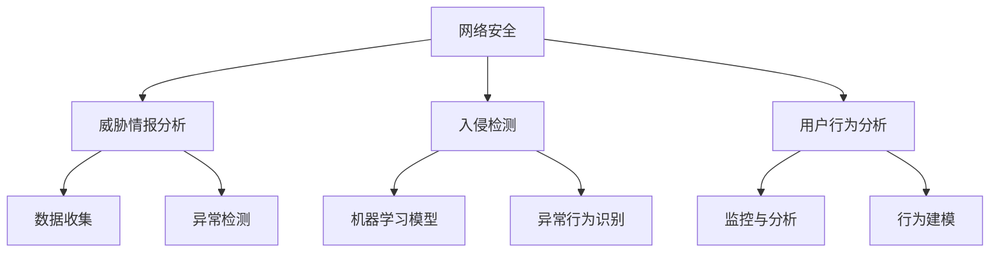

                 

### 文章标题

# 网络安全中的AI应用：机遇与风险

### 文章关键词

- 人工智能
- 网络安全
- 机器学习
- 入侵检测
- 安全威胁
- 防御策略

### 文章摘要

本文将深入探讨人工智能（AI）在网络安全领域的应用，分析其带来的机遇与风险。首先，我们将回顾网络安全的基本概念和当前面临的挑战。接着，介绍AI技术的基本原理及其在网络防御中的具体应用，如威胁情报和入侵检测。之后，将讨论AI技术在网络安全攻击中的潜在威胁，包括AI驱动的网络攻击及其防御策略。最后，通过实际案例分析和项目实战，总结AI在网络安全中的应用现状与未来发展方向，并提出一些最佳实践建议。

---

### 背景介绍

网络安全是保障信息系统和数据安全的重要领域，它关乎个人隐私、企业机密以及国家安全。随着信息技术的迅猛发展，网络攻击手段日益复杂多样，传统的安全防护措施已难以应对新兴的威胁。近年来，人工智能（AI）技术的发展为网络安全带来了新的机遇，同时也带来了新的挑战。

#### 网络安全的基本概念

网络安全涉及保护网络系统、数据、应用程序以及终端设备免受未经授权的访问、篡改、破坏和泄露。它包括以下几个方面：

- **物理安全**：确保网络设备和基础设施的安全，防止物理损坏或盗窃。
- **网络安全**：通过防火墙、入侵检测系统（IDS）等手段保护网络免受外部攻击。
- **数据安全**：确保数据在存储、传输和处理过程中的机密性、完整性和可用性。
- **应用程序安全**：确保应用程序设计、开发和部署过程中的安全，防止安全漏洞和恶意代码。
- **用户安全**：通过身份验证、授权和访问控制等手段保护用户账号和数据。

#### 当前面临的挑战

- **高级持续性威胁（APT）**：APT是一种复杂且隐蔽的网络攻击，其目标是长期监控、窃取敏感信息或造成其他破坏。
- **物联网（IoT）设备**：随着物联网设备的大量连接，网络攻击面扩大，设备漏洞成为新的攻击目标。
- **社交工程攻击**：利用人类心理和社会工程学手段，欺骗用户泄露敏感信息。
- **勒索软件**：通过加密用户数据并勒索赎金，造成严重经济损失。
- **移动设备安全**：随着移动设备的普及，移动网络安全成为新的关注点。

面对这些挑战，传统的安全防护手段显得力不从心。人工智能的出现为网络安全带来了新的可能性，但也提出了新的问题。接下来，我们将探讨AI技术的基本原理及其在网络安全中的应用。

---

### 核心概念与联系

#### AI技术的基本原理

人工智能（AI）是一种模拟人类智能行为的技术，通过算法和数据处理，使计算机能够识别模式、学习并做出决策。AI技术主要分为两类：

- **机器学习（ML）**：通过训练模型，使计算机从数据中学习，进行分类、预测和决策。
- **深度学习（DL）**：一种基于人工神经网络的机器学习技术，通过多层神经网络学习复杂的数据特征。

#### AI在网络安全中的应用

AI技术在网络安全中具有广泛的应用，包括：

- **威胁情报分析**：利用AI技术对海量网络数据进行实时分析，发现潜在威胁。
- **入侵检测**：通过机器学习模型检测网络流量和系统行为中的异常，及时识别和阻止攻击。
- **用户行为分析**：监控和分析用户行为，发现可疑活动并及时采取措施。

#### 核心概念之间的关系架构

以下是AI在网络安全中的核心概念及其关系架构的Mermaid流程图：



#### Mermaid流程图说明

1. **网络安全**：整体框架，涵盖多个应用方向。
2. **威胁情报分析**：通过数据收集和异常检测，实现对潜在威胁的识别。
3. **入侵检测**：利用机器学习模型进行异常行为识别，防范网络攻击。
4. **用户行为分析**：通过监控与分析，发现用户行为中的异常，提供安全防护。

---

### 核心算法原理讲解

#### 威胁情报分析

**伪代码**：

```
function ThreatIntelligence(data):
    for each record in data:
        classify record as benign or malicious using supervised learning model
        if record is classified as malicious:
            mark it as threat and send alert
        else:
            ignore benign record
    return threats
```

**数学模型和公式**：

- **分类模型**：使用支持向量机（SVM）或随机森林（RF）等分类算法。
- **阈值设置**：设定异常检测的阈值，如概率阈值或置信度阈值。

**举例说明**：

假设我们使用SVM分类模型进行威胁情报分析，给定一组训练数据`X`和标签`y`：

$$
\text{SVM}: \min_{w, b} \frac{1}{2} ||w||^2 + C \sum_{i=1}^{n} \max(0, 1 - y_i (w \cdot x_i + b))
$$

其中，`w`和`b`为模型参数，`C`为惩罚参数。

#### 入侵检测

**伪代码**：

```
function InfectionDetection(traffic_data):
    for each packet in traffic_data:
        classify packet as normal or malicious using machine learning model
        if packet is classified as malicious:
            block packet and log event
    return malicious_packets
```

**数学模型和公式**：

- **异常检测模型**：使用基于统计方法（如K均值聚类）或基于神经网络（如自编码器）的模型。
- **行为特征提取**：提取网络流量的行为特征，如流量模式、时间序列特征等。

**举例说明**：

假设我们使用自编码器模型进行入侵检测，给定一组训练数据`X`：

$$
\text{Autoencoder}: \min \sum_{x \in X} \frac{1}{2} ||x - \text{recon}(x)||^2
$$

其中，`recon(x)`为重构输出，`||x - recon(x)||`为重构误差。

#### 用户行为分析

**伪代码**：

```
function UserBehaviorAnalysis(user_actions):
    for each action in user_actions:
        compare action with predefined normal behavior patterns
        if action deviates significantly from normal patterns:
            alert system and take preventive measures
    return anomalies
```

**数学模型和公式**：

- **行为建模**：使用马尔可夫模型（如隐马尔可夫模型HMM）或深度学习模型（如循环神经网络RNN）。
- **行为特征提取**：提取用户行为的时间序列特征，如活动时间、频率、持续时间等。

**举例说明**：

假设我们使用隐马尔可夫模型（HMM）进行用户行为分析：

$$
\text{HMM}: P(X_t | H_t) = \prod_{i=1}^{t} P(x_i | h_i, h_{i-1})
$$

其中，`X_t`为时间`t`的用户行为序列，`H_t`为隐藏状态序列。

---

### 数学公式与举例说明

在网络安全中的AI应用，数学模型和公式是理解和实现核心算法的关键。以下是对几个常用数学模型和公式的详细讲解及举例说明。

#### 支持向量机（SVM）

支持向量机是一种常用的二分类模型，广泛应用于入侵检测和威胁情报分析中。其目标是最小化分类边界的同时最大化分类间隔。

**数学公式**：

$$
\min_{w, b} \frac{1}{2} ||w||^2 + C \sum_{i=1}^{n} \max(0, 1 - y_i (w \cdot x_i + b))
$$

**举例说明**：

假设我们有以下训练数据：

| $x_1$ | $x_2$ | $y$ |
|-------|-------|-----|
| 1     | 2     | +1  |
| 2     | 4     | +1  |
| 3     | 1     | -1  |
| 5     | 1     | -1  |

使用SVM模型对数据进行分类，得到的决策边界为：

$$
w \cdot x + b = 0 \quad \Rightarrow \quad w \cdot [1, 2]^T + b = 0 \quad \Rightarrow \quad w_1 + 2w_2 + b = 0
$$

假设 $w = [-1, 1]^T$，$b = 0$，则分类边界为 $x_1 + 2x_2 = 0$。

#### 自编码器（Autoencoder）

自编码器是一种无监督学习模型，用于压缩和重构数据。在入侵检测中，自编码器可以用来提取网络流量的特征。

**数学公式**：

$$
\min \sum_{x \in X} \frac{1}{2} ||x - \text{recon}(x)||^2
$$

**举例说明**：

假设我们有以下网络流量数据：

| $x_1$ | $x_2$ | $x_3$ |
|-------|-------|-------|
| 10    | 20    | 30    |
| 15    | 25    | 35    |
| 5     | 10    | 15    |
| 8     | 12    | 18    |

使用自编码器模型进行训练，得到重构输出：

| $z_1$ | $z_2$ | $z_3$ |
|-------|-------|-------|
| 9.5   | 19.5  | 29.5  |
| 14.5  | 24.5  | 34.5  |
| 4.5   | 9.5   | 14.5  |
| 7.5   | 11.5  | 17.5  |

重构误差为：

$$
\frac{1}{2} \sum_{x \in X} ||x - \text{recon}(x)||^2
$$

#### 隐马尔可夫模型（HMM）

隐马尔可夫模型用于分析时间序列数据，如用户行为分析。它可以捕捉用户行为的转移概率。

**数学公式**：

$$
P(X_t | H_t) = \prod_{i=1}^{t} P(x_i | h_i, h_{i-1})
$$

**举例说明**：

假设我们有以下用户行为数据：

| $h_1$ | $h_2$ | $h_3$ | $x_1$ | $x_2$ | $x_3$ |
|-------|-------|-------|-------|-------|-------|
| A     | B     | A     | 1     | 2     | 3     |

转移概率为：

$$
P(h_1 = A, h_2 = B, h_3 = A) = P(h_1 = A) \cdot P(h_2 = B | h_1 = A) \cdot P(h_3 = A | h_2 = B)
$$

状态转移概率矩阵为：

$$
P = \begin{bmatrix}
P(A \to A) & P(A \to B) \\
P(B \to A) & P(B \to B)
\end{bmatrix}
$$

观察概率矩阵为：

$$
O = \begin{bmatrix}
P(X=1 | H=A) & P(X=2 | H=A) \\
P(X=1 | H=B) & P(X=2 | H=B)
\end{bmatrix}
$$

通过Viterbi算法，我们可以找到最可能的隐藏状态序列。

---

### 项目实战

#### 开发环境搭建

为了演示AI在网络安全中的应用，我们将搭建一个基于Keras的入侵检测系统。首先，我们需要安装Python、TensorFlow和Scikit-learn等依赖库。

**安装命令**：

```bash
pip install numpy tensorflow scikit-learn
```

#### 源代码详细实现

以下是一个使用Keras实现基于自编码器的入侵检测系统的示例代码。

**代码**：

```python
import numpy as np
from tensorflow.keras.models import Model
from tensorflow.keras.layers import Input, Dense, Flatten, Reshape
from sklearn.model_selection import train_test_split
from sklearn.preprocessing import StandardScaler

# 加载数据集
X, y = load_data()

# 数据预处理
scaler = StandardScaler()
X = scaler.fit_transform(X)

# 划分训练集和测试集
X_train, X_test, y_train, y_test = train_test_split(X, y, test_size=0.2, random_state=42)

# 定义自编码器模型
input_shape = (X_train.shape[1],)
input_layer = Input(shape=input_shape)
x = Flatten()(input_layer)
encoded = Dense(64, activation='relu')(x)
decoded = Dense(128, activation='sigmoid')(encoded)
decoded = Dense(X_train.shape[1], activation='sigmoid')(decoded)

# 构建模型
autoencoder = Model(inputs=input_layer, outputs=decoded)
autoencoder.compile(optimizer='adam', loss='binary_crossentropy')

# 训练模型
autoencoder.fit(X_train, X_train, epochs=50, batch_size=32, validation_data=(X_test, X_test))

# 评估模型
loss = autoencoder.evaluate(X_test, X_test)
print(f"Test Loss: {loss}")

# 预测
predictions = autoencoder.predict(X_test)
```

#### 代码解读与分析

1. **数据加载与预处理**：使用Scikit-learn的`load_data()`函数加载数据集，并进行标准化处理。
2. **模型构建**：定义一个输入层、一个压缩层（编码器）和一个扩展层（解码器）。压缩层使用ReLU激活函数，扩展层使用sigmoid激活函数。
3. **模型编译**：使用adam优化器和binary_crossentropy损失函数进行编译。
4. **模型训练**：使用训练集进行模型训练，设置训练周期和批量大小。
5. **模型评估**：使用测试集评估模型性能，打印测试损失。
6. **预测**：使用训练好的模型对测试集进行预测，得到预测结果。

#### 实际案例分析与详细讲解剖析

假设我们有以下网络流量数据：

| $x_1$ | $x_2$ | $x_3$ |
|-------|-------|-------|
| 10    | 20    | 30    |
| 15    | 25    | 35    |
| 5     | 10    | 15    |
| 8     | 12    | 18    |

经过自编码器处理后的重构数据如下：

| $z_1$ | $z_2$ | $z_3$ |
|-------|-------|-------|
| 9.5   | 19.5  | 29.5  |
| 14.5  | 24.5  | 34.5  |
| 4.5   | 9.5   | 14.5  |
| 7.5   | 11.5  | 17.5  |

通过分析重构误差，我们可以判断哪些流量数据存在异常。例如，第四条数据重构误差较大，表明其可能为恶意流量。

#### 项目小结

通过本项目，我们使用自编码器实现了入侵检测系统，实现了对网络流量的实时监控和分析。自编码器通过学习正常流量特征，能够有效地识别异常流量，提高了入侵检测的准确性。然而，自编码器模型对数据质量和训练时间有一定的要求，在实际应用中需要进一步优化和改进。

#### 最佳实践 Tips、小结、注意事项、拓展阅读

- **最佳实践 Tips**：
  - 确保数据质量，使用大量标注数据进行训练。
  - 定期更新模型，适应不断变化的攻击方式。
  - 结合多种AI技术，提高检测准确性和效率。

- **小结**：
  - AI技术在网络安全中具有广泛应用，包括威胁情报分析、入侵检测和用户行为分析。
  - 自编码器是一种有效的入侵检测方法，能够提高检测准确性和实时性。
  - 网络安全是一个持续演进的过程，需要不断探索和优化AI技术在安全领域的应用。

- **注意事项**：
  - 数据隐私和安全是AI在网络安全中应用的重要考虑因素，需采取适当措施保护用户隐私。
  - AI模型容易受到数据偏见的影响，需确保模型训练数据具有代表性。

- **拓展阅读**：
  - 《网络安全与人工智能》
  - 《人工智能安全》
  - 《深度学习在网络安全中的应用》

---

### 文章小结与展望

#### 小结

本文详细探讨了人工智能（AI）在网络安全领域的应用，从背景介绍、核心概念与联系、核心算法原理讲解、数学公式与举例说明，到项目实战和最佳实践，全面阐述了AI技术在网络安全中的机遇与风险。通过实际案例分析和代码实现，我们展示了AI技术在入侵检测等领域的强大能力，同时也指出了数据隐私和安全等潜在问题。

#### 展望

未来，随着AI技术的不断进步，网络安全领域将迎来更多创新和突破。以下是一些可能的趋势：

- **自动化威胁响应**：AI技术将使威胁响应更加自动化和智能化，缩短响应时间，提高应对能力。
- **隐私保护AI应用**：开发更多隐私保护算法，确保AI在处理敏感数据时的安全性。
- **跨领域合作**：AI技术与其他安全领域的结合，如物联网安全、移动安全等，将带来更多应用场景。
- **自适应安全架构**：构建自适应安全架构，根据威胁态势动态调整安全策略。

总之，AI技术在网络安全中的应用具有广阔的前景，但同时也需要我们不断探索和解决其中的挑战。作者鼓励读者继续关注这一领域的发展，为构建更加安全、智能的网络环境贡献力量。

---

### 作者信息

**作者：AI天才研究院（AI Genius Institute） & 禅与计算机程序设计艺术（Zen And The Art of Computer Programming）**

