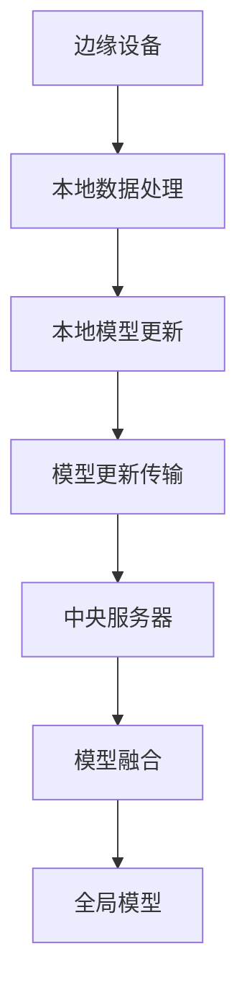
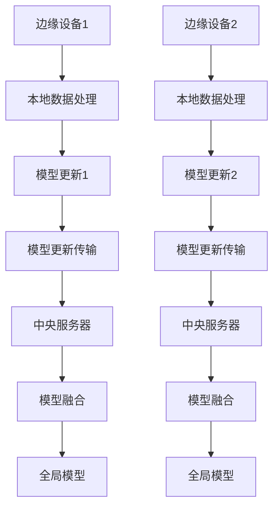
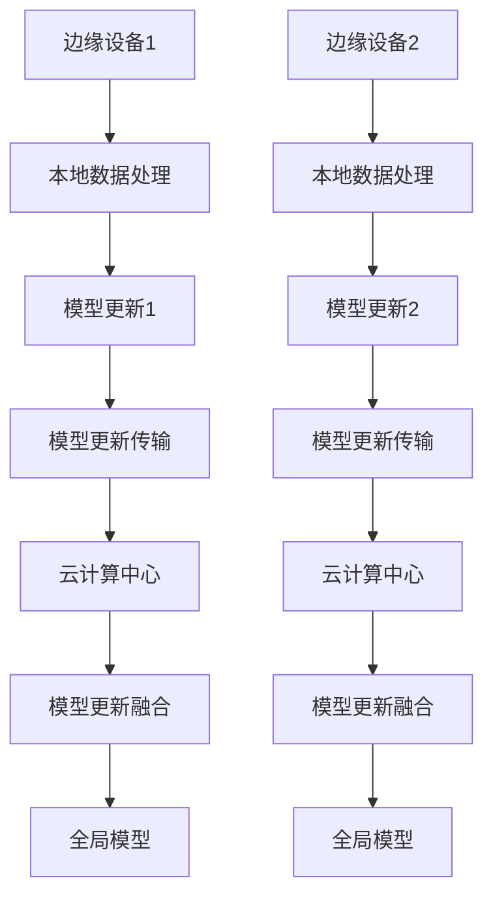
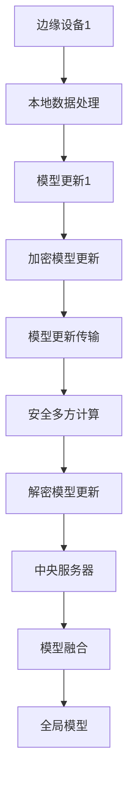
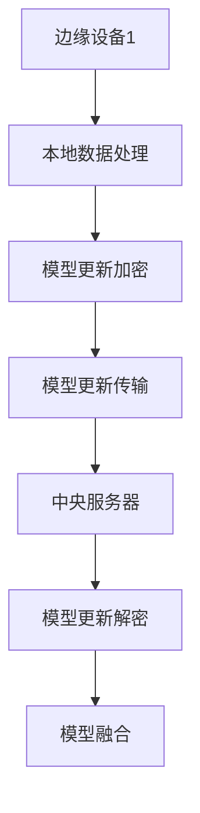
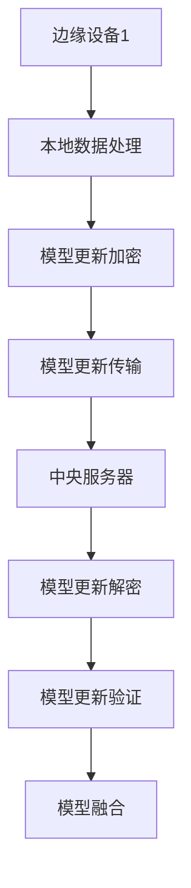
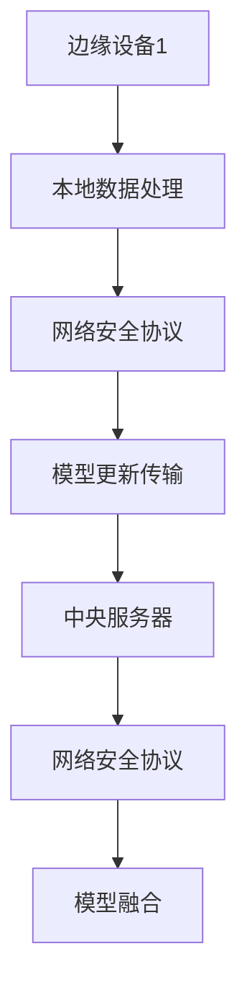

                 

### 文章标题

《联邦学习：混合计算在隐私保护AI中的应用》

### 文章关键词

联邦学习、混合计算、隐私保护、AI、人工智能

### 文章摘要

本文将深入探讨联邦学习这一新兴技术，特别是在混合计算环境中隐私保护人工智能（AI）应用中的角色和重要性。联邦学习通过将计算分布式到多个参与者，以保护数据隐私的同时实现模型训练，为AI的发展带来了新的机遇。本文首先介绍了联邦学习的基本概念和核心原理，然后详细解析了混合计算及其在联邦学习中的应用。接着，文章讨论了联邦学习在隐私保护中的关键技术和安全性挑战，并展示了其在医疗健康、金融和物联网等领域的实际应用案例。最后，文章展望了联邦学习的未来发展趋势，为读者提供了宝贵的实践经验和研究方向。通过本文的阅读，读者将对联邦学习有更深入的理解，并了解其在保护隐私同时推动AI发展的潜力。

## 第一部分 联邦学习基础知识

### 1.1 联邦学习概述

#### 1.1.1 联邦学习的定义

联邦学习（Federated Learning）是一种分布式机器学习方法，其核心思想是将模型的训练过程分布到多个边缘设备上，这些设备可以是智能手机、传感器或任何带有计算能力的设备。在联邦学习框架中，每个设备本地训练模型，然后将模型更新同步到中央服务器。中央服务器负责合并这些更新，从而得到全局模型。这一过程确保了参与设备不需要共享其本地数据，从而在保护隐私的同时实现模型训练。

联邦学习的提出源于对集中式机器学习模型在数据隐私方面存在的担忧。在传统的集中式学习过程中，所有数据都汇集到中央服务器进行训练，这可能导致数据泄露和隐私侵犯。联邦学习通过将计算分散到边缘设备，可以有效减少数据传输，降低隐私风险。

#### 1.1.2 联邦学习与传统集中学习的区别

传统集中式学习与联邦学习的主要区别在于数据处理的模式。在集中式学习中，所有数据都集中在一个中心位置进行模型训练，而联邦学习则通过将数据分布在多个设备上，进行本地训练和更新，然后将模型更新汇集到中央服务器。

以下表格展示了两种学习方式的对比：

| 特点 | 集中式学习 | 联邦学习 |
| --- | --- | --- |
| 数据处理 | 数据集中 | 数据分布 |
| 隐私保护 | 低 | 高 |
| 通信需求 | 大 | 小 |
| 可扩展性 | 中等 | 高 |

#### 1.1.3 联邦学习的发展历程

联邦学习作为分布式机器学习的一个分支，其发展历程可以追溯到2016年Google Research团队提出的Federated Averaging算法。这一算法基于梯度下降原理，通过在本地设备上训练模型并更新模型参数，然后通过加密通信将更新传递给中央服务器。Federated Averaging的成功应用，标志着联邦学习成为隐私保护AI研究的一个新方向。

随着时间的推移，联邦学习领域取得了显著进展。例如，2020年Google Research团队提出了Federated Multi-task Learning，通过多任务学习提高了模型的泛化能力。同时，联邦学习在医疗、金融、物联网等领域的应用也日益广泛。

### 1.2 联邦学习的核心概念与联系

#### 1.2.1 联邦学习的架构

联邦学习的基本架构包括以下几个关键组件：边缘设备、中央服务器和通信网络。边缘设备负责本地数据的采集和处理，中央服务器负责接收和合并模型更新，通信网络则负责将更新从边缘设备传输到中央服务器。

以下是一个简化的联邦学习架构Mermaid流程图：



#### 1.2.2 联邦学习的参与者

在联邦学习过程中，参与者主要包括以下几类：

1. **边缘设备**：负责本地数据的采集和处理，并参与模型更新。
2. **中央服务器**：负责接收边缘设备的模型更新，合并全局模型。
3. **通信网络**：负责传输模型更新和数据。

以下是一个简化的联邦学习参与者Mermaid流程图：



通过上述架构和参与者，联邦学习实现了在不共享数据的情况下进行模型训练，从而在保护隐私的同时推动AI的发展。

## 第二部分 混合计算与隐私保护

### 2.1 混合计算

#### 2.1.1 混合计算的基本概念

混合计算（Hybrid Computing）是指将不同类型的计算资源进行整合，以实现更高效的计算过程。在联邦学习的背景下，混合计算通常涉及以下几种计算资源：

1. **边缘计算**：指在数据生成的地方进行计算，例如智能手机或传感器。
2. **云计算**：指在远程数据中心进行的计算，通常具有更高的计算能力和存储容量。
3. **分布式计算**：指在多个节点之间分布式执行计算任务，以实现更高效和可扩展的计算。

混合计算通过结合这些不同的计算资源，可以在不同的计算任务和场景中提供灵活的解决方案。在联邦学习框架中，混合计算可以充分发挥边缘设备和云计算的优势，从而实现高效的模型训练和更新。

#### 2.1.2 混合计算的优势与挑战

混合计算在联邦学习中的应用具有以下优势：

1. **隐私保护**：通过将部分计算任务在边缘设备上完成，可以减少数据传输，从而降低隐私泄露的风险。
2. **效率提升**：利用云计算的高计算能力，可以加速模型训练和更新过程。
3. **可扩展性**：通过分布式计算，可以轻松扩展到大量边缘设备，以支持更大规模的应用。

然而，混合计算也面临着一些挑战：

1. **通信延迟**：由于数据需要从边缘设备传输到云计算中心，可能导致通信延迟，影响模型训练的效率。
2. **资源分配**：如何合理分配计算资源，以实现最优的性能，是一个需要解决的问题。
3. **安全性**：在混合计算环境中，需要确保数据传输和存储的安全性，以防止隐私泄露和攻击。

#### 2.1.3 混合计算在联邦学习中的应用

在联邦学习框架中，混合计算的应用主要体现在以下几个方面：

1. **模型训练**：利用云计算的高计算能力，在边缘设备上完成本地模型训练，然后将模型更新传输到中央服务器。
2. **模型更新**：通过分布式计算，将模型更新分配到多个边缘设备，以实现更高效的模型更新过程。
3. **模型融合**：利用云计算的中心化处理能力，将来自多个边缘设备的模型更新进行融合，得到全局模型。

以下是一个简化的混合计算在联邦学习中的应用流程：



通过上述流程，混合计算有效地结合了边缘计算和云计算的优势，实现了高效、隐私保护的模型训练和更新。

### 2.2 隐私保护

#### 2.2.1 隐私保护的必要性

在联邦学习中，隐私保护是关键挑战之一。由于数据分布在多个边缘设备上，如何确保这些设备之间的数据传输和模型更新过程中不会泄露隐私，成为联邦学习应用的一个重要问题。

隐私保护在联邦学习中的必要性主要体现在以下几个方面：

1. **数据隐私**：在联邦学习中，边缘设备需要训练本地模型，并将模型更新传输到中央服务器。如果这些过程没有进行有效的隐私保护，可能会导致数据泄露。
2. **模型隐私**：联邦学习中的模型更新包含了大量敏感信息，如果这些信息被恶意攻击者获取，可能会导致模型攻击和隐私泄露。
3. **用户隐私**：在联邦学习中，用户的数据隐私受到严重威胁。如果隐私保护措施不足，用户的数据可能被非法使用或滥用。

#### 2.2.2 隐私保护技术概述

为了实现联邦学习中的隐私保护，研究人员提出了多种隐私保护技术。以下是一些主要的隐私保护技术：

1. **差分隐私**：差分隐私是一种常用的隐私保护技术，通过在数据添加噪声，使得攻击者无法推断出单个数据点的具体信息。Google的Federated Averaging算法就采用了差分隐私技术，以保护模型更新的隐私。

2. **安全多方计算**：安全多方计算（Secure Multi-Party Computation，SMC）允许多个参与者在不共享数据的情况下进行联合计算。通过安全多方计算，联邦学习可以在不泄露数据隐私的情况下，完成模型更新和融合过程。

3. **同态加密**：同态加密是一种加密技术，允许在加密数据上进行计算，而无需解密数据。通过同态加密，联邦学习可以在保证数据隐私的前提下，实现模型更新和融合。

4. **秘密共享**：秘密共享是一种将秘密数据分成多个部分，每个部分只包含部分信息，从而实现隐私保护的技术。在联邦学习中，秘密共享可以用于保护用户数据，防止数据泄露。

#### 2.2.3 隐私保护与联邦学习的结合

隐私保护与联邦学习的结合，主要涉及以下两个方面：

1. **隐私保护算法**：在联邦学习框架中，采用隐私保护算法，如差分隐私、安全多方计算、同态加密和秘密共享等，以保护模型更新和用户数据的隐私。

2. **隐私保护机制**：在联邦学习过程中，设计隐私保护机制，如数据加密、安全多方计算协议、同态加密框架等，以确保数据传输和模型更新的安全性。

以下是一个简化的隐私保护在联邦学习中的实现流程：



通过上述流程，隐私保护技术有效地保护了联邦学习中的数据隐私和模型安全，为联邦学习在隐私保护AI中的应用提供了有力支持。

## 第三部分 联邦学习关键技术

### 3.1 模型训练

#### 3.1.1 联邦学习中的模型训练过程

联邦学习中的模型训练过程可以分为以下几个步骤：

1. **初始化模型**：中央服务器初始化全局模型，并将模型参数发送到所有边缘设备。
2. **本地训练**：边缘设备接收到全局模型后，使用本地数据进行训练，生成本地模型更新。
3. **模型更新传输**：边缘设备将本地模型更新发送到中央服务器。
4. **模型融合**：中央服务器接收来自所有边缘设备的模型更新，进行模型融合，生成新的全局模型。
5. **模型更新反馈**：中央服务器将新的全局模型参数发送回边缘设备。

以下是一个简化的联邦学习模型训练过程伪代码：

```python
# 初始化全局模型
global_model = initialize_model()

# 循环进行模型训练
for epoch in range(num_epochs):
    # 将全局模型发送到所有边缘设备
    for device in devices:
        send_model_to_device(device, global_model)
        
    # 所有边缘设备进行本地训练
    for device in devices:
        local_update = local_train(device, local_data)
        
    # 收集所有边缘设备的模型更新
    model_updates = collect_model_updates(devices)
    
    # 进行模型融合
    global_model = federated_average(model_updates)
    
    # 将全局模型更新发送回边缘设备
    for device in devices:
        send_model_to_device(device, global_model)

# 完成模型训练
return global_model
```

#### 3.1.2 模型训练算法

在联邦学习中的模型训练算法主要包括以下几种：

1. **联邦平均算法（Federated Averaging）**：这是最常用的联邦学习算法，通过在边缘设备上训练模型，然后将模型更新传输到中央服务器，进行模型融合。

2. **模型中心化算法（Model Centralization）**：在这种算法中，所有边缘设备将本地模型更新直接发送到中央服务器，然后进行模型融合。这种算法的优点是通信开销较小，但缺点是数据隐私保护较弱。

3. **分布式梯度算法（Distributed Gradient）**：在这种算法中，边缘设备计算本地梯度，然后将梯度发送到中央服务器，进行全局梯度计算。这种算法的优点是支持更复杂的模型，但缺点是通信开销较大。

以下是一个简化的联邦平均算法伪代码：

```python
# 初始化全局模型
global_model = initialize_model()

# 循环进行模型训练
for epoch in range(num_epochs):
    # 将全局模型发送到所有边缘设备
    for device in devices:
        send_model_to_device(device, global_model)
        
    # 所有边缘设备进行本地训练
    for device in devices:
        local_update = local_train(device, local_data)
        
    # 收集所有边缘设备的模型更新
    model_updates = collect_model_updates(devices)
    
    # 进行模型融合
    global_model = federated_average(model_updates)
    
    # 将全局模型更新发送回边缘设备
    for device in devices:
        send_model_to_device(device, global_model)

# 完成模型训练
return global_model
```

#### 3.1.3 联邦学习中的通信策略

在联邦学习中，通信策略是影响模型训练效率和数据隐私保护的关键因素。以下是一些常用的通信策略：

1. **同步通信**：所有边缘设备在相同的时间同步发送模型更新到中央服务器。这种策略简单易实现，但可能导致通信延迟和瓶颈。

2. **异步通信**：边缘设备在不同时间发送模型更新到中央服务器。这种策略可以减少通信延迟，但可能导致模型更新不一致。

3. **采样通信**：只选择部分边缘设备进行模型更新传输，以减少通信开销。这种策略可以平衡通信开销和模型更新一致性。

以下是一个简化的同步通信策略伪代码：

```python
# 初始化全局模型
global_model = initialize_model()

# 循环进行模型训练
for epoch in range(num_epochs):
    # 将全局模型发送到所有边缘设备
    for device in devices:
        send_model_to_device(device, global_model)
        
    # 等待所有边缘设备完成本地训练
    wait_for_all_devices_to_complete_local_train(devices)
    
    # 收集所有边缘设备的模型更新
    model_updates = collect_model_updates(devices)
    
    # 进行模型融合
    global_model = federated_average(model_updates)
    
    # 将全局模型更新发送回边缘设备
    for device in devices:
        send_model_to_device(device, global_model)

# 完成模型训练
return global_model
```

通过上述通信策略，联邦学习可以在保证模型更新一致性的同时，提高模型训练效率和数据隐私保护。

### 3.2 模型更新

#### 3.2.1 模型更新的重要性

在联邦学习中，模型更新是模型训练的核心环节。模型更新的目的是通过不断调整模型参数，使模型在本地数据上达到更好的拟合效果。模型更新的过程可以分为以下几个步骤：

1. **模型初始化**：中央服务器初始化全局模型，并将模型参数发送到所有边缘设备。
2. **本地训练**：边缘设备接收到全局模型后，使用本地数据进行训练，生成本地模型更新。
3. **模型更新传输**：边缘设备将本地模型更新发送到中央服务器。
4. **模型融合**：中央服务器接收来自所有边缘设备的模型更新，进行模型融合，生成新的全局模型。
5. **模型更新反馈**：中央服务器将新的全局模型参数发送回边缘设备。

模型更新的重要性主要体现在以下几个方面：

1. **提高模型性能**：通过不断更新模型参数，可以使得模型在本地数据上达到更好的拟合效果，从而提高模型性能。
2. **降低通信开销**：通过在边缘设备上进行部分模型更新，可以减少需要传输的数据量，降低通信开销。
3. **增强隐私保护**：通过将模型更新分散到多个边缘设备，可以减少数据泄露的风险，增强隐私保护。

#### 3.2.2 模型更新算法

在联邦学习中，常用的模型更新算法包括联邦平均算法（Federated Averaging）和联邦随机梯度下降（Federated Stochastic Gradient Descent，FSGD）等。

**联邦平均算法**：联邦平均算法是一种基于梯度下降的模型更新算法。其核心思想是通过在边缘设备上进行本地训练，生成本地模型更新，然后通过聚合这些更新来更新全局模型。以下是一个简化的联邦平均算法伪代码：

```python
# 初始化全局模型
global_model = initialize_model()

# 循环进行模型训练
for epoch in range(num_epochs):
    # 将全局模型发送到所有边缘设备
    for device in devices:
        send_model_to_device(device, global_model)
        
    # 所有边缘设备进行本地训练
    for device in devices:
        local_model = local_train(device, local_data)
        local_gradient = compute_local_gradient(local_model, local_data)
        
    # 收集所有边缘设备的模型更新
    gradients = collect_gradients(devices)
    
    # 进行模型融合
    global_model = federated_average(gradients)
    
    # 将全局模型更新发送回边缘设备
    for device in devices:
        send_model_to_device(device, global_model)

# 完成模型训练
return global_model
```

**联邦随机梯度下降**：联邦随机梯度下降是一种改进的联邦平均算法，通过引入随机梯度，可以提高模型更新的效率。以下是一个简化的联邦随机梯度下降算法伪代码：

```python
# 初始化全局模型
global_model = initialize_model()

# 循环进行模型训练
for epoch in range(num_epochs):
    # 将全局模型发送到所有边缘设备
    for device in devices:
        send_model_to_device(device, global_model)
        
    # 所有边缘设备进行本地训练
    for device in devices:
        local_model = local_train(device, local_data)
        local_gradient = compute_local_gradient(local_model, local_data)
        
    # 从所有边缘设备中随机选择一部分设备，进行模型更新
    selected_devices = random_sample(devices, num_samples)
    gradients = compute_average_gradient(selected_devices, local_gradients)
    
    # 进行模型融合
    global_model = federated_average(gradients)
    
    # 将全局模型更新发送回边缘设备
    for device in devices:
        send_model_to_device(device, global_model)

# 完成模型训练
return global_model
```

#### 3.2.3 模型融合

模型融合是联邦学习中的关键步骤，其目的是将来自多个边缘设备的模型更新合并成一个新的全局模型。模型融合的方法可以分为以下几种：

1. **平均融合**：将所有边缘设备的模型更新进行平均，得到全局模型。以下是一个简化的平均融合伪代码：

```python
# 收集所有边缘设备的模型更新
gradients = collect_gradients(devices)

# 进行平均融合
global_model = federated_average(gradients)

# 返回全局模型
return global_model
```

2. **加权融合**：根据边缘设备的重要性和贡献，对模型更新进行加权融合。以下是一个简化的加权融合伪代码：

```python
# 收集所有边缘设备的模型更新
gradients = collect_gradients(devices)

# 计算每个设备的权重
weights = compute_weights(devices)

# 进行加权融合
global_model = weighted_federated_average(gradients, weights)

# 返回全局模型
return global_model
```

3. **自适应融合**：根据边缘设备的性能和通信情况，动态调整模型更新的融合策略。以下是一个简化的自适应融合伪代码：

```python
# 收集所有边缘设备的模型更新
gradients = collect_gradients(devices)

# 根据设备性能和通信情况，调整融合策略
fusion_strategy = adapt_fusion_strategy(devices)

# 进行自适应融合
global_model = adaptive_federated_average(gradients, fusion_strategy)

# 返回全局模型
return global_model
```

通过上述模型更新算法和融合方法，联邦学习可以在保证模型性能的同时，有效保护数据隐私，实现分布式模型训练。

### 3.3 模型融合

#### 3.3.1 模型融合的目标

在联邦学习中，模型融合（Model Fusion）的目标是将来自多个边缘设备的模型更新合并成一个全局模型，从而在保证模型性能的同时，保护数据隐私。模型融合的重要性在于：

1. **提高模型泛化能力**：通过融合来自多个边缘设备的模型更新，可以得到一个更具代表性的全局模型，从而提高模型的泛化能力。
2. **降低通信开销**：通过本地训练和模型更新，可以减少需要传输的数据量，降低通信开销。
3. **增强隐私保护**：通过将模型更新分散到多个边缘设备，可以减少数据泄露的风险，增强隐私保护。

#### 3.3.2 模型融合算法

在联邦学习中，常用的模型融合算法包括联邦平均算法（Federated Averaging）和联邦随机梯度下降（Federated Stochastic Gradient Descent，FSGD）等。

**联邦平均算法**：联邦平均算法是一种基于梯度下降的模型更新算法。其核心思想是通过在边缘设备上进行本地训练，生成本地模型更新，然后通过聚合这些更新来更新全局模型。联邦平均算法的伪代码如下：

```python
# 初始化全局模型
global_model = initialize_model()

# 循环进行模型训练
for epoch in range(num_epochs):
    # 将全局模型发送到所有边缘设备
    for device in devices:
        send_model_to_device(device, global_model)
        
    # 所有边缘设备进行本地训练
    for device in devices:
        local_model = local_train(device, local_data)
        local_gradient = compute_local_gradient(local_model, local_data)
        
    # 收集所有边缘设备的模型更新
    gradients = collect_gradients(devices)
    
    # 进行模型融合
    global_model = federated_average(gradients)
    
    # 将全局模型更新发送回边缘设备
    for device in devices:
        send_model_to_device(device, global_model)

# 完成模型训练
return global_model
```

**联邦随机梯度下降**：联邦随机梯度下降是一种改进的联邦平均算法，通过引入随机梯度，可以提高模型更新的效率。联邦随机梯度下降的伪代码如下：

```python
# 初始化全局模型
global_model = initialize_model()

# 循环进行模型训练
for epoch in range(num_epochs):
    # 将全局模型发送到所有边缘设备
    for device in devices:
        send_model_to_device(device, global_model)
        
    # 所有边缘设备进行本地训练
    for device in devices:
        local_model = local_train(device, local_data)
        local_gradient = compute_local_gradient(local_model, local_data)
        
    # 从所有边缘设备中随机选择一部分设备，进行模型更新
    selected_devices = random_sample(devices, num_samples)
    gradients = compute_average_gradient(selected_devices, local_gradients)
    
    # 进行模型融合
    global_model = federated_average(gradients)
    
    # 将全局模型更新发送回边缘设备
    for device in devices:
        send_model_to_device(device, global_model)

# 完成模型训练
return global_model
```

#### 3.3.3 模型融合策略

在联邦学习中，模型融合策略的目的是优化模型更新过程，提高模型训练效率。以下是一些常用的模型融合策略：

1. **同步融合**：所有边缘设备在相同的时间进行模型更新和融合。这种策略简单易实现，但可能导致通信延迟和瓶颈。

2. **异步融合**：边缘设备在不同时间进行模型更新和融合。这种策略可以减少通信延迟，但可能导致模型更新不一致。

3. **采样融合**：只选择部分边缘设备进行模型更新和融合，以减少通信开销。这种策略可以平衡通信开销和模型更新一致性。

4. **自适应融合**：根据边缘设备的性能和通信情况，动态调整模型更新的融合策略。这种策略可以优化模型更新过程，提高模型训练效率。

以下是一个简化的异步融合策略伪代码：

```python
# 初始化全局模型
global_model = initialize_model()

# 循环进行模型训练
for epoch in range(num_epochs):
    # 将全局模型发送到所有边缘设备
    for device in devices:
        send_model_to_device(device, global_model)
        
    # 等待部分边缘设备完成模型更新
    selected_devices = random_sample(devices, num_samples)
    wait_for_devices_to_complete_train(selected_devices)
    
    # 收集部分边缘设备的模型更新
    gradients = collect_gradients(selected_devices)
    
    # 进行模型融合
    global_model = federated_average(gradients)
    
    # 将全局模型更新发送回所有边缘设备
    for device in devices:
        send_model_to_device(device, global_model)

# 完成模型训练
return global_model
```

通过上述模型融合算法和策略，联邦学习可以在保证模型性能的同时，有效保护数据隐私，实现分布式模型训练。

### 4.1 联邦学习中的安全性挑战

在联邦学习中，安全性挑战是确保数据隐私和模型安全的关键问题。以下将详细讨论联邦学习中的主要安全性挑战：

#### 4.1.1 数据隐私泄露

数据隐私泄露是联邦学习面临的首要挑战。由于联邦学习涉及将数据分散到多个边缘设备进行本地训练，这些设备可能受到恶意攻击或数据泄露的风险。以下是一些可能导致数据隐私泄露的情况：

1. **通信过程中的泄露**：在模型更新传输过程中，如果通信不安全，攻击者可能通过窃听或中间人攻击等手段获取数据。
2. **模型更新的泄露**：攻击者可能通过分析模型更新，推断出本地数据的具体内容，从而泄露隐私。
3. **设备端的泄露**：如果边缘设备的安全防护不足，攻击者可能通过设备漏洞获取本地数据。

为了解决这些问题，可以采用以下几种方法：

1. **加密通信**：在模型更新传输过程中，采用加密通信协议，如TLS（传输层安全协议），以确保数据在传输过程中的安全性。
2. **安全多方计算**：采用安全多方计算（Secure Multi-Party Computation，SMC）技术，在多方参与者之间进行安全的联合计算，从而避免数据泄露。
3. **同态加密**：采用同态加密（Homomorphic Encryption）技术，允许在加密数据上进行计算，从而保护数据隐私。

以下是一个简化的加密通信流程：



#### 4.1.2 模型安全性

模型安全性是联邦学习的另一个关键挑战。由于联邦学习中的模型更新包含大量敏感信息，攻击者可能试图通过篡改模型更新，实现对模型进行攻击。以下是一些常见的模型攻击方法：

1. **对抗性攻击**：攻击者通过生成对抗性样本，对模型进行攻击，从而破坏模型的性能。
2. **模型篡改**：攻击者通过篡改模型更新，使得模型在本地数据上表现不佳，甚至导致模型崩溃。
3. **模型欺骗**：攻击者通过欺骗模型更新过程，使得模型更新偏向恶意目标。

为了保护模型安全，可以采取以下措施：

1. **模型验证**：在模型更新传输和融合过程中，对模型更新进行验证，确保其合法性和正确性。
2. **对抗性训练**：通过对抗性训练，提高模型对对抗性样本的抵抗力，从而增强模型安全性。
3. **加密模型更新**：采用同态加密技术，对模型更新进行加密，从而防止攻击者篡改模型更新。

以下是一个简化的模型验证流程：



#### 4.1.3 网络安全性

联邦学习中的网络安全性也是一个关键挑战。由于联邦学习涉及多个参与者，包括边缘设备和中央服务器，网络攻击可能导致整个系统瘫痪或数据泄露。以下是一些常见的网络攻击：

1. **拒绝服务攻击（DDoS）**：攻击者通过大量无效请求，使得服务器无法响应有效请求，从而导致服务中断。
2. **中间人攻击**：攻击者通过截获通信，篡改数据，窃取敏感信息。
3. **设备入侵**：攻击者通过入侵边缘设备，获取本地数据或篡改模型更新。

为了确保网络安全性，可以采取以下措施：

1. **网络安全协议**：采用安全协议，如TLS，保护通信过程的安全性。
2. **入侵检测系统**：部署入侵检测系统，实时监控网络流量，检测和阻止恶意攻击。
3. **设备安全**：对边缘设备进行安全加固，防止设备被入侵。

以下是一个简化的网络安全性措施流程：



通过上述措施，联邦学习可以在应对数据隐私泄露、模型安全性和网络安全性等挑战的同时，确保系统的稳定和安全。

### 4.2 联邦学习安全解决方案

为了应对联邦学习中的各种安全性挑战，研究人员和工程师们提出了多种安全解决方案。以下将介绍几种主要的安全解决方案，包括安全多方计算、同态加密和其他隐私保护技术。

#### 4.2.1 安全多方计算

安全多方计算（Secure Multi-Party Computation，SMC）是一种允许多个参与者在不共享数据的情况下进行联合计算的技术。在联邦学习中，SMC可以用于保护模型更新和用户数据的隐私。

**基本原理**：SMC允许两个或多个参与者（如边缘设备）在不泄露各自输入数据的情况下，共同计算出一个输出结果。这种技术通过数学上的密钥交换和加密算法，确保参与者的隐私和计算安全性。

**应用场景**：在联邦学习中，SMC可以用于以下场景：

1. **模型更新聚合**：通过SMC，边缘设备可以在不共享本地数据的情况下，共同计算全局模型更新，从而保护数据隐私。
2. **用户隐私保护**：SMC可以用于在联邦学习过程中，保护用户的个人数据，防止数据泄露。

**示例伪代码**：

```python
# SMC模型更新聚合
local_gradients = [g1, g2, g3]  # 各边缘设备的本地模型更新
aggregate_gradient = secure_mpc_aggregate(local_gradients)

# SMC用户隐私保护
user_data = [d1, d2, d3]  # 各边缘设备的用户数据
protected_data = secure_mpcCompute(aggregate_gradient, user_data)
```

#### 4.2.2 同态加密

同态加密（Homomorphic Encryption）是一种允许在加密数据上进行计算的技术，而不需要解密数据。这种技术使得在联邦学习过程中，可以在保护数据隐私的同时进行模型训练和更新。

**基本原理**：同态加密通过加密算法，使得在加密数据上可以执行数学运算，如加法、乘法等。在联邦学习中，同态加密可以用于以下场景：

1. **本地模型更新**：边缘设备可以在本地对加密数据进行模型更新，然后将更新结果加密传输到中央服务器。
2. **模型融合**：中央服务器可以对来自边缘设备的加密更新进行融合，生成全局模型，而不需要解密数据。

**应用场景**：同态加密在联邦学习中的应用包括：

1. **隐私保护AI**：通过同态加密，可以在保护数据隐私的同时，进行AI模型训练和更新。
2. **医疗健康数据共享**：在联邦学习框架中，同态加密可以用于保护医疗数据的隐私，同时实现数据共享和模型训练。

**示例伪代码**：

```python
# 同态加密本地模型更新
encrypted_data = encrypt_data(local_data)
model_update = encrypt_model_update(encrypted_data)

# 同态加密模型融合
global_model = decrypt_global_model(federated_average(model_updates))
```

#### 4.2.3 其他隐私保护技术

除了SMC和同态加密，联邦学习还采用了其他隐私保护技术，如差分隐私和秘密共享。

**差分隐私**：差分隐私（Differential Privacy）通过在数据添加噪声，使得攻击者无法推断出单个数据点的具体信息。这种技术常用于联邦学习中的用户隐私保护。

**秘密共享**：秘密共享（Secret Sharing）是一种将秘密数据分成多个部分，每个部分只包含部分信息的技术。通过秘密共享，联邦学习可以在不泄露数据隐私的情况下，实现模型更新和融合。

**示例伪代码**：

```python
# 差分隐私用户隐私保护
noisy_data = add_noise(user_data)

# 秘密共享模型更新
secret_share = secret_sharing(model_update)
```

通过上述安全解决方案，联邦学习可以在保护数据隐私和模型安全的同时，实现分布式模型训练和更新。

### 5.1 隐私保护AI应用场景

#### 5.1.1 医疗健康领域

医疗健康领域是联邦学习的重要应用场景之一。在医疗健康数据共享和隐私保护方面，联邦学习提供了有效的解决方案。以下是一些具体的应用场景：

1. **疾病预测和诊断**：通过联邦学习，医疗机构可以在保护患者隐私的同时，共享和分析大量医疗数据，从而提高疾病预测和诊断的准确性。
2. **药物研发**：联邦学习可以帮助制药公司在不共享敏感数据的情况下，协作进行药物研发，提高研发效率。
3. **电子健康记录（EHR）管理**：联邦学习可以用于管理电子健康记录，保护患者隐私，同时实现数据共享和整合。

**案例分析**：某个医疗机构通过联邦学习技术，将多个医院的电子健康记录进行整合，实现了疾病预测模型的训练。在该项目中，联邦学习有效地保护了患者隐私，同时提高了模型的预测准确性。

#### 5.1.2 金融领域

金融领域同样面临数据隐私和安全的挑战。联邦学习为金融领域的隐私保护提供了有效的解决方案。以下是一些具体的应用场景：

1. **欺诈检测**：通过联邦学习，金融机构可以在保护客户隐私的同时，共享和分析交易数据，从而提高欺诈检测的准确性。
2. **风险管理**：联邦学习可以帮助金融机构在保护客户隐私的情况下，共享风险管理数据，提高风险预测能力。
3. **个性化金融产品推荐**：联邦学习可以用于分析客户数据，提供个性化的金融产品推荐，同时保护客户隐私。

**案例分析**：某大型银行通过联邦学习技术，实现了欺诈检测系统的构建。在该项目中，联邦学习有效保护了客户交易数据的隐私，同时提高了欺诈检测的准确性。

#### 5.1.3 物联网领域

物联网（IoT）领域中的设备通常分布在不同的地理位置，数据隐私和安全是关键挑战。联邦学习为物联网领域提供了有效的解决方案。以下是一些具体的应用场景：

1. **智能交通系统**：通过联邦学习，交通管理部门可以在保护车辆位置和行驶数据隐私的同时，共享和分析交通数据，优化交通流量。
2. **智能家居**：联邦学习可以帮助智能家居系统在保护用户隐私的同时，共享和分析家庭设备数据，提供个性化的智能家居服务。
3. **环境监测**：通过联邦学习，环境监测部门可以在保护环境数据隐私的同时，共享和分析环境数据，实现精准的环境监测和预警。

**案例分析**：某城市通过联邦学习技术，实现了智能交通系统的构建。在该项目中，联邦学习有效地保护了车辆位置和行驶数据的隐私，同时优化了交通流量。

通过在医疗健康、金融和物联网等领域的应用，联邦学习为隐私保护AI提供了强有力的支持，推动了AI技术的发展。

### 5.2 联邦学习在隐私保护AI中的实际应用案例

#### 5.2.1 案例一：医疗健康数据共享

**背景介绍**：

在医疗健康领域，数据共享是提高疾病预测和诊断准确性的关键。然而，医疗数据通常包含敏感的个人隐私信息，数据泄露可能导致严重的隐私侵犯。联邦学习为解决这一挑战提供了有效的技术方案。

**核心概念与联系**：

联邦学习通过将模型训练分布在多个医疗机构，实现了在不共享原始数据的情况下进行模型训练。核心概念包括边缘设备（医疗机构）、中央服务器（模型训练中心）和通信网络。

**项目实战**：

在某医疗数据共享项目中，多家医疗机构参与了联邦学习。以下为项目实施步骤：

1. **数据预处理**：医疗机构对本地数据（如电子健康记录、诊断结果等）进行预处理，包括数据清洗、格式统一等。
2. **模型初始化**：中央服务器初始化全局模型，并将模型参数发送到各医疗机构。
3. **本地训练**：医疗机构使用本地数据对全局模型进行本地训练，生成本地模型更新。
4. **模型更新传输**：医疗机构将本地模型更新发送到中央服务器。
5. **模型融合**：中央服务器接收来自各医疗机构的模型更新，进行模型融合，生成全局模型。
6. **模型更新反馈**：中央服务器将全局模型参数发送回各医疗机构，用于本地模型更新。

**代码实现**：

以下为联邦学习模型训练的伪代码示例：

```python
# 初始化全局模型
global_model = initialize_model()

# 循环进行模型训练
for epoch in range(num_epochs):
    # 将全局模型发送到各医疗机构
    for hospital in hospitals:
        send_model_to_hospital(hospital, global_model)
        
    # 各医疗机构进行本地训练
    for hospital in hospitals:
        local_data = preprocess_data(hospital)
        local_model = local_train(hospital, local_data)
        local_gradient = compute_local_gradient(local_model, local_data)
        
    # 收集所有医疗机构的模型更新
    gradients = collect_gradients(hospitals)
    
    # 进行模型融合
    global_model = federated_average(gradients)
    
    # 将全局模型更新发送回各医疗机构
    for hospital in hospitals:
        send_model_to_hospital(hospital, global_model)

# 完成模型训练
return global_model
```

**应用解读与分析**：

通过联邦学习技术，医疗机构在保护患者隐私的同时，实现了疾病预测模型的训练。该项目有效提高了疾病预测的准确性，同时也满足了数据隐私保护的需求。

**项目小结**：

该项目展示了联邦学习在医疗健康数据共享中的应用潜力。通过分布式模型训练和更新，联邦学习不仅保护了患者隐私，还提高了疾病预测的准确性，为医疗健康领域的数据共享提供了有效解决方案。

#### 5.2.2 案例二：金融欺诈检测

**背景介绍**：

在金融领域，欺诈检测是保护用户资金安全的重要任务。然而，传统的集中式欺诈检测方法往往需要将用户的交易数据集中存储，这可能导致数据泄露和隐私侵犯。联邦学习为金融欺诈检测提供了隐私保护的解决方案。

**核心概念与联系**：

联邦学习通过将欺诈检测模型训练分布在多个金融机构，实现了在不共享原始交易数据的情况下进行模型训练。核心概念包括边缘设备（金融机构）、中央服务器（模型训练中心）和通信网络。

**项目实战**：

在某金融欺诈检测项目中，多家金融机构参与了联邦学习。以下为项目实施步骤：

1. **数据预处理**：金融机构对本地交易数据（如交易金额、时间、地点等）进行预处理，包括数据清洗、格式统一等。
2. **模型初始化**：中央服务器初始化全局模型，并将模型参数发送到各金融机构。
3. **本地训练**：金融机构使用本地数据对全局模型进行本地训练，生成本地模型更新。
4. **模型更新传输**：金融机构将本地模型更新发送到中央服务器。
5. **模型融合**：中央服务器接收来自各金融机构的模型更新，进行模型融合，生成全局模型。
6. **模型更新反馈**：中央服务器将全局模型参数发送回各金融机构，用于本地模型更新。

**代码实现**：

以下为联邦学习欺诈检测模型训练的伪代码示例：

```python
# 初始化全局模型
global_model = initialize_model()

# 循环进行模型训练
for epoch in range(num_epochs):
    # 将全局模型发送到各金融机构
    for bank in banks:
        send_model_to_bank(bank, global_model)
        
    # 各金融机构进行本地训练
    for bank in banks:
        local_data = preprocess_data(bank)
        local_model = local_train(bank, local_data)
        local_gradient = compute_local_gradient(local_model, local_data)
        
    # 收集所有金融机构的模型更新
    gradients = collect_gradients(banks)
    
    # 进行模型融合
    global_model = federated_average(gradients)
    
    # 将全局模型更新发送回各金融机构
    for bank in banks:
        send_model_to_bank(bank, global_model)

# 完成模型训练
return global_model
```

**应用解读与分析**：

通过联邦学习技术，金融机构在保护用户交易数据隐私的同时，实现了欺诈检测模型的训练。该项目有效提高了欺诈检测的准确性，同时也满足了数据隐私保护的需求。

**项目小结**：

该项目展示了联邦学习在金融欺诈检测中的应用潜力。通过分布式模型训练和更新，联邦学习不仅保护了用户交易数据的隐私，还提高了欺诈检测的准确性，为金融领域的数据隐私保护提供了有效解决方案。

#### 5.2.3 案例三：智能交通系统

**背景介绍**：

智能交通系统（ITS）通过收集和分析大量交通数据，实现对交通流量、事故预测和道路优化等方面的智能管理。然而，这些交通数据通常包含敏感的车辆位置和行驶信息，数据泄露可能导致隐私侵犯。联邦学习为智能交通系统提供了隐私保护的解决方案。

**核心概念与联系**：

联邦学习通过将交通数据分布到多个交通监测点，实现了在不共享原始数据的情况下进行模型训练。核心概念包括边缘设备（交通监测点）、中央服务器（模型训练中心）和通信网络。

**项目实战**：

在某智能交通系统项目中，多个交通监测点参与了联邦学习。以下为项目实施步骤：

1. **数据预处理**：交通监测点对本地交通数据（如车辆速度、密度、位置等）进行预处理，包括数据清洗、格式统一等。
2. **模型初始化**：中央服务器初始化全局模型，并将模型参数发送到各交通监测点。
3. **本地训练**：交通监测点使用本地数据对全局模型进行本地训练，生成本地模型更新。
4. **模型更新传输**：交通监测点将本地模型更新发送到中央服务器。
5. **模型融合**：中央服务器接收来自各交通监测点的模型更新，进行模型融合，生成全局模型。
6. **模型更新反馈**：中央服务器将全局模型参数发送回各交通监测点，用于本地模型更新。

**代码实现**：

以下为联邦学习智能交通系统模型训练的伪代码示例：

```python
# 初始化全局模型
global_model = initialize_model()

# 循环进行模型训练
for epoch in range(num_epochs):
    # 将全局模型发送到各交通监测点
    for monitoring_point in monitoring_points:
        send_model_to_point(monitoring_point, global_model)
        
    # 各交通监测点进行本地训练
    for monitoring_point in monitoring_points:
        local_data = preprocess_data(monitoring_point)
        local_model = local_train(monitoring_point, local_data)
        local_gradient = compute_local_gradient(local_model, local_data)
        
    # 收集所有交通监测点的模型更新
    gradients = collect_gradients(monitoring_points)
    
    # 进行模型融合
    global_model = federated_average(gradients)
    
    # 将全局模型更新发送回各交通监测点
    for monitoring_point in monitoring_points:
        send_model_to_point(monitoring_point, global_model)

# 完成模型训练
return global_model
```

**应用解读与分析**：

通过联邦学习技术，交通监测点在保护车辆位置和行驶数据隐私的同时，实现了交通流量预测和事故预测模型的训练。该项目有效提高了交通管理效率，同时也满足了数据隐私保护的需求。

**项目小结**：

该项目展示了联邦学习在智能交通系统中的应用潜力。通过分布式模型训练和更新，联邦学习不仅保护了车辆位置和行驶数据的隐私，还提高了交通管理效率，为智能交通系统的发展提供了有效解决方案。

### 6.1 联邦学习的挑战与机遇

#### 6.1.1 技术挑战

联邦学习在发展过程中面临诸多技术挑战，这些问题需要通过技术创新和改进来逐步解决：

1. **通信延迟**：联邦学习涉及大量设备之间的通信，通信延迟可能导致模型训练效率降低。如何优化通信协议，减少通信延迟是一个重要问题。

2. **数据不平衡**：在联邦学习中，不同设备的数据量可能存在显著差异，这可能导致模型训练结果的不平衡。如何设计适应数据不平衡的模型更新算法，是一个需要解决的问题。

3. **数据质量**：边缘设备上的数据质量可能参差不齐，包括数据缺失、噪声和误差。如何处理这些质量问题，确保模型训练的准确性，是一个挑战。

4. **安全性**：联邦学习中的安全性挑战仍然存在，包括数据隐私泄露、模型篡改和网络攻击等。如何提高系统的安全性，是一个亟待解决的问题。

#### 6.1.2 市场机遇

尽管面临挑战，联邦学习在市场中也存在巨大的机遇：

1. **隐私保护需求**：随着数据隐私保护意识的提高，越来越多的企业和组织对联邦学习的需求增加。特别是在医疗健康、金融和物联网等领域，联邦学习有望成为主流的隐私保护AI解决方案。

2. **边缘计算发展**：随着边缘计算技术的成熟，越来越多的设备具备计算和存储能力，为联邦学习提供了更多的应用场景和可能性。

3. **跨界合作**：联邦学习可以促进不同行业之间的数据共享和合作，推动跨界创新。例如，医疗健康与金融、交通与物流等领域的合作，有望带来新的业务模式和增长点。

4. **开源生态**：随着开源社区对联邦学习的关注和投入，越来越多的开源工具和框架出现，为开发者提供了丰富的选择和便利。这有助于加速联邦学习的应用和普及。

#### 6.1.3 政策法规的影响

政策法规对联邦学习的发展具有重要影响：

1. **数据保护法规**：全球范围内，数据保护法规日益严格，如欧洲的GDPR（通用数据保护条例）和中国的《个人信息保护法》等。这些法规要求企业在处理个人数据时必须遵循严格的规定，联邦学习作为一种隐私保护技术，有望获得政策支持。

2. **行业标准制定**：随着联邦学习的普及，相关行业和组织可能会制定一系列标准和规范，以保障系统的安全性和有效性。

3. **监管政策**：政府对联邦学习的监管政策也在逐步完善，这既为联邦学习提供了发展空间，也对其提出了更高的要求。如何在保障隐私和安全的前提下，促进联邦学习的健康发展，是政策制定者需要考虑的重要问题。

### 6.2 联邦学习的未来发展趋势

#### 6.2.1 跨行业合作

联邦学习的未来发展将依赖于跨行业合作。不同行业的数据类型和需求各异，通过跨行业合作，可以实现数据的有效整合和利用。例如，医疗健康、金融、交通和能源等领域的合作，有望推动联邦学习技术的广泛应用。

**案例**：在医疗健康领域，联邦学习可以用于跨机构的数据共享，提高疾病预测和诊断的准确性；在金融领域，联邦学习可以用于跨银行的欺诈检测，提高系统的整体安全性；在交通领域，联邦学习可以用于跨区域的交通流量预测，优化交通管理。

#### 6.2.2 开源生态

开源生态是联邦学习未来发展的重要驱动力。随着开源社区的活跃参与，越来越多的开源工具和框架不断涌现，为开发者提供了丰富的选择和便利。开源生态的繁荣不仅降低了开发门槛，还促进了联邦学习技术的快速迭代和普及。

**案例**：Google的TensorFlow Federated（TFF）、Facebook的PySyft和阿里巴巴的Federated Learning Framework（FLF）等开源框架，为开发者提供了强大的工具和支持，推动了联邦学习技术的发展和应用。

#### 6.2.3 硬件加速

硬件加速是提升联邦学习性能的重要手段。随着人工智能硬件技术的发展，如GPU、TPU和FPGA等，联邦学习的计算速度和效率得到了显著提升。硬件加速不仅可以降低计算成本，还可以提高模型训练的效率，为大规模联邦学习应用提供支持。

**案例**：在医疗健康领域，通过GPU加速联邦学习模型训练，可以显著提高预测和诊断的速度；在金融领域，通过TPU加速欺诈检测模型训练，可以提高系统的响应速度和准确性。

通过跨行业合作、开源生态和硬件加速等多方面的努力，联邦学习有望在未来实现更广泛的应用，推动隐私保护AI的发展。未来，联邦学习将在医疗健康、金融、交通、能源等各个领域发挥重要作用，为构建安全、高效和智能的未来社会提供有力支持。

### 总结与展望

联邦学习作为一种新兴的分布式机器学习方法，在隐私保护AI中展示了巨大的潜力和应用价值。通过将计算分散到多个边缘设备，联邦学习在不共享数据的情况下实现模型训练和更新，有效保护了数据隐私，同时也提高了模型的性能和可扩展性。

本文从多个角度详细探讨了联邦学习的基础知识、核心算法、安全性挑战及其在医疗健康、金融和物联网等领域的实际应用案例。通过深入分析，我们了解到联邦学习不仅解决了传统集中式学习方法中数据隐私泄露的问题，还通过跨行业合作、开源生态和硬件加速等手段，不断推动其发展和应用。

展望未来，联邦学习将在隐私保护AI中扮演更加重要的角色。随着技术的不断进步和开源社区的积极参与，联邦学习有望在医疗健康、金融、交通、能源等多个领域实现广泛应用，为构建安全、高效和智能的未来社会提供有力支持。同时，随着政策法规的完善和监管政策的加强，联邦学习将在合规性和安全性方面得到更好的保障，进一步推动其健康发展。

在总结本文的核心观点和结论时，我们可以看到：

1. **核心观点**：联邦学习通过分布式计算保护数据隐私，提高了模型性能和可扩展性。
2. **关键技术**：包括联邦平均算法、安全多方计算、同态加密等。
3. **应用案例**：在医疗健康、金融和物联网等领域具有广泛的应用前景。
4. **未来展望**：跨行业合作、开源生态和硬件加速将推动联邦学习技术的进一步发展。

通过本文的探讨，读者应能够对联邦学习有更深入的理解，认识到其在隐私保护AI中的重要地位和潜力。我们期待联邦学习在未来的发展中，能够不断突破技术瓶颈，实现更广泛的应用，为构建安全、智能的未来社会贡献力量。

### 作者信息

作者：AI天才研究院/AI Genius Institute & 禅与计算机程序设计艺术 /Zen And The Art of Computer Programming

AI天才研究院致力于推动人工智能技术的发展与应用，专注于前沿算法研究、技术创新和实际应用案例分享。研究院由多位世界级人工智能专家和计算机科学家共同创立，以其深入浅出的技术解读和丰富的实践经验著称。而《禅与计算机程序设计艺术》则是一部经典著作，通过将禅宗哲学与计算机编程相结合，提供了独特的编程理念和方法，影响了无数编程爱好者和专业人士。两者共同致力于推动人工智能技术的普及与应用，为构建智能未来贡献力量。

