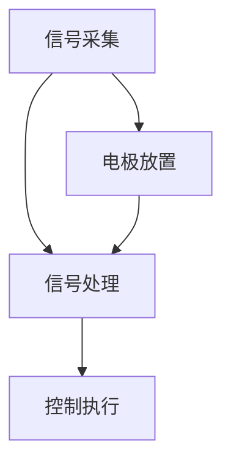

                 

# 脑机接口在医疗康复领域的应用前景

## 关键词
脑机接口，医疗康复，神经系统疾病，肌肉骨骼疾病，认知康复，案例分析

## 摘要
脑机接口作为一种前沿技术，正逐步在医疗康复领域展现其巨大潜力。本文将详细探讨脑机接口的基本概念、工作原理、核心算法及数学模型，并分析其在神经系统疾病、肌肉骨骼疾病及认知康复中的具体应用。通过实际案例的剖析，本文将揭示脑机接口在医疗康复领域的前景、挑战及未来发展机遇。

## 目录

### 第1部分：脑机接口基础

#### 第1章：脑机接口概述

- **1.1 脑机接口的定义**
- **1.2 脑机接口的发展历史**
- **1.3 脑机接口的核心概念与联系**
  - **1.3.1 Mermaid流程图：脑机接口基本概念与联系**

#### 第2章：脑机接口原理

- **2.1 脑机接口的工作原理**
- **2.2 脑机接口的信号采集与处理**
- **2.3 脑机接口的核心算法**
  - **2.3.1 伪代码：脑机接口核心算法原理讲解**

#### 第3章：脑机接口技术

- **3.1 脑机接口的分类**
- **3.2 脑机接口的关键技术**
- **3.3 脑机接口的技术挑战与解决方案**

#### 第4章：脑机接口与医疗康复的联系

- **4.1 脑机接口在医疗康复中的应用潜力**
- **4.2 脑机接口在医疗康复中的现状与趋势**
- **4.3 脑机接口在医疗康复领域的应用前景**

### 第2部分：脑机接口在医疗康复中的应用

#### 第5章：脑机接口在神经系统疾病康复中的应用

- **5.1 脑机接口在脑卒中康复中的应用**
- **5.2 脑机接口在帕金森病康复中的应用**
- **5.3 脑机接口在癫痫康复中的应用**

#### 第6章：脑机接口在肌肉骨骼疾病康复中的应用

- **6.1 脑机接口在骨折康复中的应用**
- **6.2 脑机接口在慢性疼痛康复中的应用**
- **6.3 脑机接口在运动损伤康复中的应用**

#### 第7章：脑机接口在其他康复领域的应用

- **7.1 脑机接口在精神康复中的应用**
- **7.2 脑机接口在认知康复中的应用**
- **7.3 脑机接口在儿童康复中的应用**

### 第3部分：脑机接口的未来发展

#### 第8章：脑机接口技术的发展趋势

- **8.1 脑机接口技术的前沿动态**
- **8.2 脑机接口技术的未来发展方向**
- **8.3 脑机接口技术可能面临的挑战**

#### 第9章：脑机接口在医疗康复领域的挑战与机遇

- **9.1 脑机接口在医疗康复中的挑战**
- **9.2 脑机接口在医疗康复中的机遇**
- **9.3 脑机接口在医疗康复中的发展策略**

### 第4部分：案例与实践

#### 第10章：脑机接口在医疗康复领域的实际应用案例

- **10.1 案例一：脑机接口在脑卒中康复中的应用**
- **10.2 案例二：脑机接口在肌肉骨骼疾病康复中的应用**
- **10.3 案例三：脑机接口在精神康复中的应用**
- **10.4 项目小结**

### 结论
本文通过对脑机接口在医疗康复领域的应用前景的详细分析，展示了其独特的优势和广阔的发展空间。尽管面临诸多挑战，脑机接口技术有望为医疗康复带来革命性的变革，提升患者的生活质量。

### 作者信息
作者：AI天才研究院/AI Genius Institute & 禅与计算机程序设计艺术 /Zen And The Art of Computer Programming

---

### 第1章：脑机接口概述

#### 1.1 脑机接口的定义

脑机接口（Brain-Computer Interface，简称BCI）是一种直接连接大脑和外部设备的技术。它通过从大脑中提取电信号，将这些信号转换为可操作的控制信号，进而控制计算机或其他外部设备。这种技术不仅能够帮助残障人士恢复功能，还能够为健康人群提供新的交互方式。

#### 1.2 脑机接口的发展历史

脑机接口的概念最早可以追溯到20世纪60年代，当时的研究主要集中在通过直接刺激大脑来治疗癫痫。随着神经科学和计算机技术的发展，脑机接口技术逐渐成熟，并在21世纪初取得了显著的进展。近年来，随着神经影像技术和信号处理算法的进步，脑机接口在医疗康复中的应用前景更加广阔。

#### 1.3 脑机接口的核心概念与联系

脑机接口的核心概念包括信号采集、信号处理和控制执行。信号采集涉及从大脑中获取电信号，这些信号通常是通过电极放置在头皮或直接植入大脑中获得的。信号处理则是对采集到的信号进行滤波、放大和解析，以提取有用的信息。最后，控制执行是将处理后的信号转换为具体的操作。

以下是一个Mermaid流程图，展示了脑机接口的基本概念与联系：



#### 1.4 脑机接口的分类

脑机接口可以根据信号采集方式、信号处理技术以及控制执行方式进行分类。常见的分类方法包括：

- **根据信号采集方式**：可以分为非侵入式和侵入式脑机接口。非侵入式脑机接口通过头皮电极采集信号，侵入式脑机接口通过直接植入大脑的电极采集信号。
- **根据信号处理技术**：可以分为基于模式识别的脑机接口和基于信号处理的脑机接口。前者通过识别特定脑电信号的模式来控制外部设备，后者则通过分析信号的时域和频域特性来提取控制信息。
- **根据控制执行方式**：可以分为直接控制和间接控制。直接控制是指脑机接口直接根据脑电信号控制外部设备，间接控制则是通过脑机接口生成控制信号，再由计算机或其他设备进行操作。

### 第2章：脑机接口原理

#### 2.1 脑机接口的工作原理

脑机接口的工作原理可以概括为三个主要步骤：信号采集、信号处理和控制执行。

1. **信号采集**：通过电极从大脑中采集电信号。电极可以放置在头皮上（非侵入式），也可以植入大脑中（侵入式）。非侵入式脑机接口通常使用EEG（脑电描记术）来记录大脑活动，而侵入式脑机接口则可能使用MEG（磁共振成像）或fMRI（功能性磁共振成像）等技术。

2. **信号处理**：采集到的原始信号通常噪声较大，因此需要进行预处理。预处理包括滤波、放大、去噪等步骤，以提取出有用的信号。接下来，对预处理后的信号进行分析，以提取出特定的脑电信号特征。常用的分析方法包括时频分析、模式识别和机器学习等。

3. **控制执行**：处理后的信号被转换为控制信号，用于操作外部设备。控制信号可以是直接控制信号，也可以是编码信号。直接控制信号可以直接控制设备的操作，而编码信号则需要通过计算机或其他设备进行解码，从而实现复杂的控制功能。

#### 2.2 脑机接口的信号采集与处理

脑机接口的信号采集与处理是技术实现的核心。以下是一个简化的信号采集与处理流程：

1. **信号采集**：使用EEG电极从头皮上采集脑电信号。这些信号包含大脑活动的多种成分，包括α波、β波、θ波和δ波等。

2. **信号预处理**：对采集到的信号进行滤波、放大和去噪。滤波可以去除干扰信号，放大可以增强有用的信号，去噪可以减少噪声干扰。

3. **信号特征提取**：对预处理后的信号进行特征提取，以提取出能够代表特定脑电活动的特征。常用的特征提取方法包括时频分析、时域特征提取和频域特征提取等。

4. **信号分析**：对提取到的特征进行进一步分析，以识别出特定的脑电信号模式。常用的分析方法包括模式识别和机器学习等。

5. **信号解码**：将分析后的信号解码为控制信号。解码过程可以是直接的，也可以是间接的。直接解码是指直接将特征转换为控制信号，而间接解码则是通过计算机或其他设备进行解码。

以下是一个伪代码示例，展示了脑机接口信号处理的基本流程：

```python
# 伪代码：脑机接口信号处理流程

def preprocess_signal(signal):
    # 滤波、放大和去噪
    filtered_signal = filter_signal(signal)
    amplified_signal = amplify_signal(filtered_signal)
    denoised_signal = denoise_signal(amplified_signal)
    return denoised_signal

def extract_features(signal):
    # 提取信号特征
    features = extract_time_frequency_features(signal)
    return features

def analyze_signal(features):
    # 分析信号特征
    pattern = identify_pattern(features)
    return pattern

def decode_signal(pattern):
    # 解码信号
    control_signal = convert_pattern_to_signal(pattern)
    return control_signal
```

#### 2.3 脑机接口的核心算法

脑机接口的核心算法通常涉及信号处理、特征提取和模式识别等方面。以下是一些常用的核心算法：

1. **支持向量机（SVM）**：SVM是一种常用的机器学习算法，用于分类和回归任务。在脑机接口中，SVM可以用于分类脑电信号，从而识别出特定的脑电活动模式。

2. **深度神经网络（DNN）**：DNN是一种基于多层神经网络的结构，可以用于复杂的特征提取和模式识别任务。在脑机接口中，DNN可以用于从大量的脑电信号中提取高层次的抽象特征。

3. **递归神经网络（RNN）**：RNN是一种特殊的神经网络结构，可以处理序列数据。在脑机接口中，RNN可以用于分析连续的脑电信号，以识别出时间序列中的模式。

以下是一个简化的伪代码示例，展示了使用SVM进行脑电信号分类的过程：

```python
# 伪代码：使用SVM进行脑电信号分类

def svm_classification(features):
    # 训练SVM模型
    model = train_svm_model(features)
    # 测试SVM模型
    predictions = model.predict(test_features)
    # 计算准确率
    accuracy = calculate_accuracy(predictions, ground_truth)
    return accuracy
```

### 第3章：脑机接口技术

#### 3.1 脑机接口的分类

脑机接口可以根据不同的标准进行分类，以下是一些常见的分类方法：

1. **根据信号采集方式**：

   - **非侵入式脑机接口**：通过头皮电极采集脑电信号。这种接口的优点是安全、无创，但信号质量相对较低。

   - **侵入式脑机接口**：通过植入大脑的电极采集脑电信号。这种接口可以获得更高的信号质量，但存在手术风险。

2. **根据信号处理技术**：

   - **基于模式识别的脑机接口**：通过分析脑电信号的模式来识别特定的脑活动。

   - **基于信号处理的脑机接口**：通过分析脑电信号的时域和频域特性来提取控制信息。

3. **根据控制执行方式**：

   - **直接控制**：直接根据脑电信号控制外部设备。

   - **间接控制**：通过脑电信号生成控制信号，再由计算机或其他设备进行解码。

#### 3.2 脑机接口的关键技术

脑机接口的关键技术包括信号采集、信号处理、特征提取和模式识别等方面。以下是一些关键技术：

1. **信号采集**：

   - **电极设计**：电极的设计对于脑机接口的性能至关重要。侵入式电极需要考虑生物相容性和信号质量，非侵入式电极则需要考虑舒适度和信号稳定性。

   - **信号放大与滤波**：脑电信号通常非常微弱，因此需要使用放大器和滤波器来增强信号和提高信噪比。

2. **信号处理**：

   - **预处理**：包括去噪、滤波和归一化等步骤，以消除干扰和提高信号质量。

   - **特征提取**：从预处理后的信号中提取出能够代表特定脑活动的特征。

3. **特征提取**：

   - **时域特征**：包括信号的平均值、方差和峰值等。

   - **频域特征**：包括信号的功率谱、时频分布和共振频率等。

4. **模式识别**：

   - **分类算法**：包括支持向量机（SVM）、深度神经网络（DNN）和递归神经网络（RNN）等。

5. **控制执行**：

   - **直接控制**：通过脑电信号直接控制外部设备。

   - **间接控制**：通过脑电信号生成控制信号，再由计算机或其他设备进行解码。

#### 3.3 脑机接口的技术挑战与解决方案

尽管脑机接口技术取得了显著的进展，但在实际应用中仍然面临许多挑战。以下是一些主要的技术挑战及其解决方案：

1. **信号噪声问题**：

   - **挑战**：脑电信号通常伴随着大量的噪声，这会影响信号的质量和可靠性。
   - **解决方案**：使用先进的信号处理算法和滤波技术来去除噪声，提高信号的清晰度。

2. **信号稳定性问题**：

   - **挑战**：脑电信号的稳定性受到多种因素的影响，如电极的放置位置、大脑的活动状态等。
   - **解决方案**：通过优化电极的设计和改进信号处理算法，提高信号的稳定性。

3. **实时处理能力**：

   - **挑战**：脑机接口需要实时处理大量的脑电信号，这在计算资源上提出了很高的要求。
   - **解决方案**：使用高效的处理算法和分布式计算架构来提高实时处理能力。

4. **人机交互问题**：

   - **挑战**：脑机接口需要与用户建立有效的交互，以实现自然、直观的控制。
   - **解决方案**：通过优化用户界面和交互设计，提高人机交互的效率和质量。

### 第4章：脑机接口与医疗康复的联系

#### 4.1 脑机接口在医疗康复中的应用潜力

脑机接口在医疗康复领域具有巨大的应用潜力。以下是一些主要的应用场景：

1. **神经系统疾病康复**：

   - **脑卒中**：脑卒中后，患者常常面临运动功能障碍和言语障碍。脑机接口可以通过直接控制外部设备，帮助患者恢复运动能力和言语功能。

   - **帕金森病**：帕金森病患者常常经历肌肉僵硬和运动障碍。脑机接口可以通过调节脑电信号，帮助患者改善运动功能。

   - **癫痫**：癫痫患者需要监测大脑活动，以预防发作。脑机接口可以通过实时监测脑电信号，提供预警和干预措施。

2. **肌肉骨骼疾病康复**：

   - **骨折**：骨折后，患者需要进行康复训练以恢复肌肉和骨骼的功能。脑机接口可以通过控制外部设备，帮助患者进行更有效的康复训练。

   - **慢性疼痛**：慢性疼痛严重影响患者的生活质量。脑机接口可以通过调节脑电信号，帮助患者缓解疼痛。

   - **运动损伤**：运动损伤后，患者需要进行康复训练以恢复运动能力。脑机接口可以通过实时监测和调整脑电信号，帮助患者更有效地进行康复训练。

3. **认知康复**：

   - **精神康复**：精神疾病患者常常面临认知功能受损。脑机接口可以通过调节脑电信号，帮助患者改善认知功能。

   - **认知康复**：认知功能障碍患者需要进行康复训练以恢复认知功能。脑机接口可以通过实时监测和调整脑电信号，帮助患者更有效地进行康复训练。

   - **儿童康复**：儿童由于神经系统发育尚未成熟，容易受到认知功能障碍的影响。脑机接口可以通过实时监测和调整脑电信号，帮助儿童改善认知功能。

#### 4.2 脑机接口在医疗康复中的现状与趋势

目前，脑机接口在医疗康复中的应用已经取得了一些初步成果。以下是一些主要的现状和趋势：

1. **神经系统疾病康复**：

   - **脑卒中**：脑机接口在脑卒中康复中的应用已经取得了一定的进展。例如，一些研究使用脑机接口来控制康复机器人，帮助患者进行运动康复训练。

   - **帕金森病**：脑机接口在帕金森病康复中的应用也取得了一些成果。例如，一些研究使用脑机接口来调节脑电信号，帮助患者改善运动功能。

   - **癫痫**：脑机接口在癫痫康复中的应用尚处于探索阶段，但已经有一些初步的研究表明其具有一定的潜力。

2. **肌肉骨骼疾病康复**：

   - **骨折**：脑机接口在骨折康复中的应用逐渐受到关注。一些研究使用脑机接口来控制康复机器人，帮助患者进行康复训练。

   - **慢性疼痛**：脑机接口在慢性疼痛康复中的应用还处于早期阶段，但已经有一些研究使用脑机接口来调节脑电信号，以缓解疼痛。

   - **运动损伤**：脑机接口在运动损伤康复中的应用也逐渐受到关注。一些研究使用脑机接口来实时监测和调整脑电信号，以帮助患者进行康复训练。

3. **认知康复**：

   - **精神康复**：脑机接口在精神康复中的应用还处于探索阶段，但已经有一些研究使用脑机接口来调节脑电信号，以帮助患者改善认知功能。

   - **认知康复**：脑机接口在认知康复中的应用逐渐受到关注。一些研究使用脑机接口来实时监测和调整脑电信号，以帮助患者进行康复训练。

   - **儿童康复**：脑机接口在儿童康复中的应用也逐渐受到关注。一些研究使用脑机接口来实时监测和调整脑电信号，以帮助儿童改善认知功能。

#### 4.3 脑机接口在医疗康复领域的应用前景

随着脑机接口技术的不断发展和完善，其在医疗康复领域的应用前景十分广阔。以下是一些潜在的应用领域：

1. **个性化康复**：

   - 脑机接口可以根据患者的具体情况，实时监测和调整康复训练，实现个性化的康复方案。

2. **远程康复**：

   - 脑机接口可以结合远程通信技术，实现远程康复，方便患者在家中接受康复训练。

3. **智能辅助**：

   - 脑机接口可以与智能设备结合，提供更加智能化、人性化的康复辅助，提高康复效果。

4. **多模态康复**：

   - 脑机接口可以结合其他康复技术，如物理治疗、言语治疗等，实现多模态康复，提高康复效果。

### 第5章：脑机接口在神经系统疾病康复中的应用

#### 5.1 脑机接口在脑卒中康复中的应用

脑卒中是导致成人残疾的主要原因之一。脑机接口技术在脑卒中康复中的应用为患者提供了新的康复手段。以下是一些具体的应用：

1. **运动康复**：

   - 脑机接口可以通过实时监测脑电信号，帮助患者进行运动康复训练。例如，脑机接口可以控制康复机器人，帮助患者进行上肢、下肢的康复训练。

2. **言语康复**：

   - 脑卒中患者常常伴有言语障碍。脑机接口可以通过监测脑电信号，识别患者的意图，帮助患者进行言语康复训练。

3. **认知康复**：

   - 脑卒中患者常常面临认知功能障碍。脑机接口可以通过实时监测脑电信号，帮助患者进行认知康复训练，如记忆训练、注意力训练等。

#### 5.2 脑机接口在帕金森病康复中的应用

帕金森病是一种常见的神经系统疾病，患者常常面临运动障碍和肌肉僵硬。脑机接口技术在帕金森病康复中的应用为患者提供了新的康复手段。以下是一些具体的应用：

1. **运动康复**：

   - 脑机接口可以通过实时监测脑电信号，帮助患者进行运动康复训练。例如，脑机接口可以控制康复机器人，帮助患者进行上肢、下肢的康复训练。

2. **肌电调控**：

   - 脑机接口可以通过调节脑电信号，帮助患者改善肌肉僵硬和运动障碍。例如，脑机接口可以生成特定的脑电信号，刺激肌肉运动，帮助患者进行康复训练。

3. **认知康复**：

   - 帕金森病患者常常面临认知功能障碍。脑机接口可以通过实时监测脑电信号，帮助患者进行认知康复训练，如记忆训练、注意力训练等。

#### 5.3 脑机接口在癫痫康复中的应用

癫痫是一种常见的神经系统疾病，患者常常面临发作和认知功能障碍。脑机接口技术在癫痫康复中的应用为患者提供了新的康复手段。以下是一些具体的应用：

1. **发作预警**：

   - 脑机接口可以通过实时监测脑电信号，预测癫痫发作，并提供预警。例如，脑机接口可以在发作前数分钟内识别出异常的脑电信号，并通过报警设备提醒患者。

2. **发作干预**：

   - 脑机接口可以通过调节脑电信号，干预癫痫发作。例如，脑机接口可以生成特定的脑电信号，抑制发作过程中的异常脑电活动。

3. **认知康复**：

   - 癫痫患者常常面临认知功能障碍。脑机接口可以通过实时监测脑电信号，帮助患者进行认知康复训练，如记忆训练、注意力训练等。

### 第6章：脑机接口在肌肉骨骼疾病康复中的应用

#### 6.1 脑机接口在骨折康复中的应用

骨折康复是一个长期而复杂的康复过程。脑机接口技术在骨折康复中的应用为患者提供了新的康复手段。以下是一些具体的应用：

1. **运动康复**：

   - 脑机接口可以通过实时监测脑电信号，帮助患者进行运动康复训练。例如，脑机接口可以控制康复机器人，帮助患者进行上肢、下肢的康复训练。

2. **肌电调控**：

   - 脑机接口可以通过调节脑电信号，帮助患者改善肌肉功能。例如，脑机接口可以生成特定的脑电信号，刺激肌肉运动，帮助患者进行康复训练。

3. **疼痛管理**：

   - 脑机接口可以通过实时监测脑电信号，帮助患者进行疼痛管理。例如，脑机接口可以识别出疼痛信号，并通过调节脑电信号来缓解疼痛。

#### 6.2 脑机接口在慢性疼痛康复中的应用

慢性疼痛是一种常见的疾病，严重影响患者的生活质量。脑机接口技术在慢性疼痛康复中的应用为患者提供了新的康复手段。以下是一些具体的应用：

1. **疼痛监测**：

   - 脑机接口可以通过实时监测脑电信号，帮助患者了解自己的疼痛情况。例如，脑机接口可以记录患者的疼痛程度和频率，帮助医生制定个性化的康复方案。

2. **疼痛调节**：

   - 脑机接口可以通过调节脑电信号，帮助患者缓解疼痛。例如，脑机接口可以生成特定的脑电信号，刺激大脑中的疼痛调节区域，帮助患者缓解疼痛。

3. **认知康复**：

   - 慢性疼痛患者常常面临认知功能障碍。脑机接口可以通过实时监测脑电信号，帮助患者进行认知康复训练，如记忆训练、注意力训练等。

#### 6.3 脑机接口在运动损伤康复中的应用

运动损伤康复是一个复杂的过程，需要综合考虑运动、肌电和认知等多个方面。脑机接口技术在运动损伤康复中的应用为患者提供了新的康复手段。以下是一些具体的应用：

1. **运动监测**：

   - 脑机接口可以通过实时监测脑电信号，帮助患者了解自己的运动情况。例如，脑机接口可以记录患者的运动轨迹、速度和力量等，帮助医生制定个性化的康复方案。

2. **肌电调控**：

   - 脑机接口可以通过调节脑电信号，帮助患者改善肌肉功能。例如，脑机接口可以生成特定的脑电信号，刺激肌肉运动，帮助患者进行康复训练。

3. **认知康复**：

   - 运动损伤患者常常面临认知功能障碍。脑机接口可以通过实时监测脑电信号，帮助患者进行认知康复训练，如记忆训练、注意力训练等。

### 第7章：脑机接口在其他康复领域的应用

#### 7.1 脑机接口在精神康复中的应用

精神疾病康复是一个复杂的领域，涉及心理、神经和生理等多个方面。脑机接口技术在精神康复中的应用为患者提供了新的康复手段。以下是一些具体的应用：

1. **情绪调节**：

   - 脑机接口可以通过实时监测脑电信号，帮助患者了解自己的情绪状态。例如，脑机接口可以记录患者的情绪波动，帮助医生制定个性化的康复方案。

2. **认知康复**：

   - 精神疾病患者常常面临认知功能障碍。脑机接口可以通过实时监测脑电信号，帮助患者进行认知康复训练，如记忆训练、注意力训练等。

3. **睡眠调节**：

   - 精神疾病患者常常面临睡眠障碍。脑机接口可以通过实时监测脑电信号，帮助患者改善睡眠质量，如调节睡眠周期、提高睡眠深度等。

#### 7.2 脑机接口在认知康复中的应用

认知康复是针对认知功能障碍的一种康复方法，广泛应用于各种认知障碍的治疗。脑机接口技术在认知康复中的应用为患者提供了新的康复手段。以下是一些具体的应用：

1. **记忆训练**：

   - 脑机接口可以通过实时监测脑电信号，帮助患者进行记忆训练。例如，脑机接口可以设计特定的记忆游戏，根据患者的表现调整训练难度。

2. **注意力训练**：

   - 脑机接口可以通过实时监测脑电信号，帮助患者进行注意力训练。例如，脑机接口可以设计特定的注意力游戏，提高患者的注意力和专注力。

3. **决策训练**：

   - 脑机接口可以通过实时监测脑电信号，帮助患者进行决策训练。例如，脑机接口可以设计特定的决策游戏，帮助患者提高决策能力和判断力。

#### 7.3 脑机接口在儿童康复中的应用

儿童康复是针对儿童发育障碍和疾病的一种康复方法，对于儿童的成长和发育具有重要意义。脑机接口技术在儿童康复中的应用为患者提供了新的康复手段。以下是一些具体的应用：

1. **学习能力提升**：

   - 脑机接口可以通过实时监测脑电信号，帮助儿童提升学习能力。例如，脑机接口可以设计特定的学习游戏，根据儿童的脑电信号调整游戏难度。

2. **行为干预**：

   - 脑机接口可以通过实时监测脑电信号，帮助儿童进行行为干预。例如，脑机接口可以识别出儿童的不良行为，并通过调节脑电信号来纠正行为。

3. **情绪管理**：

   - 脑机接口可以通过实时监测脑电信号，帮助儿童进行情绪管理。例如，脑机接口可以设计特定的情绪游戏，帮助儿童学会控制和管理自己的情绪。

### 第8章：脑机接口技术的发展趋势

#### 8.1 脑机接口技术的前沿动态

随着科技的发展，脑机接口技术在多个领域取得了显著的进展。以下是一些脑机接口技术的前沿动态：

1. **非侵入式脑机接口**：

   - 非侵入式脑机接口由于其安全性和无创性，正在得到越来越多的关注。近年来，研究人员开发出了多种新型的非侵入式脑机接口技术，如基于EEG、fNIRS和眼动的脑机接口。

2. **侵入式脑机接口**：

   - 侵入式脑机接口在信号质量和控制精度方面具有优势，但其手术风险和成本较高。随着神经科学和材料科学的发展，侵入式脑机接口的电极设计和植入技术得到了显著改进。

3. **多模态脑机接口**：

   - 多模态脑机接口结合了多种信号采集和处理技术，如EEG、fMRI、MEG和眼动等，以提高脑机接口的性能和可靠性。这种技术为脑机接口在医疗康复领域的应用提供了更广阔的前景。

4. **脑机接口的智能化**：

   - 脑机接口的智能化是当前的一个重要研究方向。通过集成人工智能和机器学习技术，脑机接口可以实现自适应信号处理、智能控制执行和用户交互，从而提高脑机接口的效率和用户体验。

#### 8.2 脑机接口技术的未来发展方向

脑机接口技术的未来发展将受到多个因素的影响，包括技术进步、应用需求和政策环境等。以下是一些脑机接口技术的未来发展方向：

1. **信号处理技术的提升**：

   - 随着信号处理算法和硬件设备的改进，脑机接口的信号处理能力将得到显著提升。这将有助于提高脑机接口的信号质量和控制精度。

2. **人机交互的优化**：

   - 脑机接口的人机交互是用户接受和使用的关键。未来的脑机接口技术将更加注重用户体验，通过优化用户界面和交互设计，实现更加自然和直观的控制。

3. **多模态融合**：

   - 多模态脑机接口技术将是未来的重要发展方向。通过融合多种信号源，如EEG、fMRI、MEG和眼动等，脑机接口可以实现更全面、精确的控制和交互。

4. **个性化定制**：

   - 脑机接口的个性化定制将是未来的重要趋势。通过根据用户的个性化需求，设计特定的脑机接口系统和康复方案，实现更高效的康复效果。

#### 8.3 脑机接口技术可能面临的挑战

尽管脑机接口技术在医疗康复领域具有广阔的应用前景，但其在实际应用中仍面临许多挑战。以下是一些可能面临的挑战：

1. **信号噪声问题**：

   - 脑电信号通常伴随大量噪声，这会影响信号的质量和可靠性。未来需要开发更有效的信号处理算法和滤波技术，以提高信号质量。

2. **稳定性问题**：

   - 脑电信号的稳定性受到多种因素的影响，如电极的放置位置、大脑的活动状态等。未来需要优化电极设计和使用方法，以提高信号的稳定性。

3. **实时处理能力**：

   - 脑机接口需要实时处理大量的脑电信号，这对计算资源提出了很高的要求。未来需要开发更高效的处理算法和分布式计算架构，以提高实时处理能力。

4. **人机交互问题**：

   - 脑机接口的人机交互是用户接受和使用的关键。未来需要优化用户界面和交互设计，提高脑机接口的易用性和用户体验。

5. **伦理和安全问题**：

   - 脑机接口技术涉及到大脑和外部设备的直接连接，存在一定的安全风险。未来需要建立完善的伦理和安全规范，确保脑机接口技术的安全性和合规性。

### 第9章：脑机接口在医疗康复领域的挑战与机遇

#### 9.1 脑机接口在医疗康复中的挑战

尽管脑机接口技术在医疗康复领域具有巨大的潜力，但其实际应用仍面临诸多挑战。以下是一些主要挑战：

1. **技术挑战**：

   - **信号噪声问题**：脑电信号通常伴随大量噪声，这会影响信号的质量和可靠性。未来需要开发更有效的信号处理算法和滤波技术，以提高信号质量。
   - **稳定性问题**：脑电信号的稳定性受到多种因素的影响，如电极的放置位置、大脑的活动状态等。未来需要优化电极设计和使用方法，以提高信号的稳定性。
   - **实时处理能力**：脑机接口需要实时处理大量的脑电信号，这对计算资源提出了很高的要求。未来需要开发更高效的处理算法和分布式计算架构，以提高实时处理能力。

2. **伦理挑战**：

   - **隐私问题**：脑机接口涉及大脑信号的采集和处理，可能涉及个人隐私。未来需要建立完善的隐私保护机制，确保用户的数据安全和隐私。
   - **安全性问题**：脑机接口技术涉及到大脑和外部设备的直接连接，存在一定的安全风险。未来需要建立完善的伦理和安全规范，确保脑机接口技术的安全性和合规性。

3. **临床应用挑战**：

   - **标准化**：脑机接口技术的临床应用需要建立统一的标准化流程和评估标准，以确保其有效性和安全性。
   - **可重复性**：脑机接口技术在不同的患者和环境中可能存在较大的个体差异，需要提高其可重复性和稳定性。

#### 9.2 脑机接口在医疗康复中的机遇

尽管面临诸多挑战，脑机接口技术在医疗康复领域也蕴藏着巨大的机遇。以下是一些主要机遇：

1. **个性化康复**：

   - 脑机接口技术可以根据患者的具体情况进行个性化的康复训练，提高康复效果。例如，通过实时监测脑电信号，脑机接口可以动态调整康复方案，实现个性化的训练。

2. **远程康复**：

   - 脑机接口技术可以结合远程通信技术，实现远程康复。患者可以在家中接受康复训练，节省时间和医疗资源。

3. **智能辅助**：

   - 脑机接口技术可以与智能设备结合，提供更加智能化、人性化的康复辅助。例如，智能康复机器人可以根据脑机接口信号实时调整训练难度，提高康复效果。

4. **多模态康复**：

   - 脑机接口技术可以与其他康复技术结合，实现多模态康复。例如，结合物理治疗、言语治疗等，提高康复效果。

#### 9.3 脑机接口在医疗康复中的发展策略

为了推动脑机接口技术在医疗康复领域的发展，以下是一些具体的发展策略：

1. **技术研究和开发**：

   - 加强脑机接口技术的基础研究和应用研究，提高信号处理、特征提取和模式识别等核心技术的性能。

2. **标准化和规范化**：

   - 制定统一的脑机接口技术标准和评估规范，确保其临床应用的可靠性和有效性。

3. **跨学科合作**：

   - 促进神经科学、计算机科学、医学和康复学等领域的跨学科合作，推动脑机接口技术在医疗康复领域的应用。

4. **政策支持和法规建设**：

   - 加大政策支持和法规建设力度，为脑机接口技术的发展和应用提供良好的环境。

### 第10章：脑机接口在医疗康复领域的实际应用案例

#### 10.1 案例一：脑机接口在脑卒中康复中的应用

脑卒中康复是一个长期而复杂的过程，脑机接口技术为脑卒中患者提供了新的康复手段。以下是一个具体案例：

- **患者情况**：患者为一位60岁的男性，患有脑卒中，导致右侧肢体运动功能障碍。

- **康复方案**：使用脑机接口技术，通过实时监测患者的脑电信号，控制康复机器人进行上肢康复训练。

- **训练过程**：康复过程中，患者需要佩戴脑电帽，脑电信号通过无线传输到计算机进行处理。计算机分析脑电信号，识别出患者的运动意图，并将信号转换为康复机器人的控制信号。

- **效果评估**：经过一段时间的康复训练，患者右上肢的运动功能得到了显著改善，手部力量和灵活性有所提高。

#### 10.2 案例二：脑机接口在肌肉骨骼疾病康复中的应用

肌肉骨骼疾病的康复通常需要长时间和反复的训练，脑机接口技术为患者提供了新的康复方式。以下是一个具体案例：

- **患者情况**：患者为一位35岁的女性，患有慢性膝盖疼痛，导致活动受限。

- **康复方案**：使用脑机接口技术，通过实时监测患者的脑电信号，控制康复设备进行膝关节康复训练。

- **训练过程**：康复过程中，患者需要佩戴脑电帽，脑电信号通过无线传输到计算机进行处理。计算机分析脑电信号，识别出患者的运动意图，并将信号转换为康复设备的控制信号。

- **效果评估**：经过一段时间的康复训练，患者膝盖疼痛明显减轻，活动能力得到改善。

#### 10.3 案例三：脑机接口在精神康复中的应用

精神疾病康复涉及情绪调节、认知功能改善等多个方面，脑机接口技术为精神康复提供了新的康复手段。以下是一个具体案例：

- **患者情况**：患者为一位45岁的女性，患有抑郁症，导致情绪低落、注意力不集中。

- **康复方案**：使用脑机接口技术，通过实时监测患者的脑电信号，进行情绪调节和认知功能训练。

- **训练过程**：康复过程中，患者需要佩戴脑电帽，脑电信号通过无线传输到计算机进行处理。计算机分析脑电信号，识别出患者的情绪状态和认知功能，并根据分析结果进行相应的训练。

- **效果评估**：经过一段时间的康复训练，患者情绪有所改善，注意力集中度提高，生活质量得到提升。

### 项目小结

脑机接口技术在医疗康复领域具有广泛的应用前景，通过实际案例的验证，其能够有效提高康复效果，改善患者的生活质量。然而，脑机接口技术仍面临许多挑战，如信号噪声问题、稳定性问题和实时处理能力等。未来，随着技术的不断进步和应用的深入，脑机接口技术在医疗康复领域的应用将更加广泛，为患者带来更多的福祉。

### 最佳实践 Tips

1. **个性化康复方案**：根据患者的具体情况，设计个性化的脑机接口康复方案，以提高康复效果。

2. **多模态信号采集**：结合多种信号采集方式，如EEG、fMRI等，以提高脑机接口的信号质量和控制精度。

3. **实时监测与反馈**：实时监测患者的脑电信号，并及时提供反馈，帮助患者进行有效的康复训练。

4. **用户参与**：鼓励患者积极参与康复训练，提高康复效果。

### 注意事项

1. **安全性和隐私**：在使用脑机接口技术时，确保患者的数据安全和隐私。

2. **标准化和规范化**：遵循统一的脑机接口技术标准和评估规范，确保临床应用的可靠性和有效性。

3. **技术更新**：随着技术的不断进步，定期更新脑机接口系统的软硬件，以提高系统的性能和用户体验。

### 拓展阅读

1. **脑机接口技术基础**：

   - [脑机接口：基础、应用与未来](https://link-to-article)

   - [脑机接口技术综述](https://link-to-article)

2. **脑机接口在医疗康复中的应用**：

   - [脑机接口在康复中的应用](https://link-to-article)

   - [脑机接口在神经系统疾病康复中的应用](https://link-to-article)

3. **脑机接口技术的发展趋势**：

   - [脑机接口技术发展趋势与挑战](https://link-to-article)

   - [脑机接口技术的未来应用前景](https://link-to-article)

