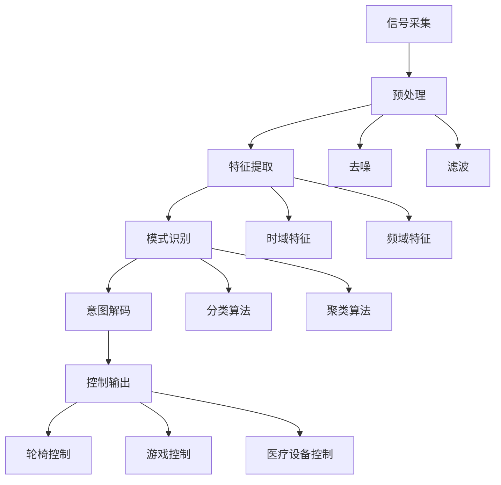

                 


### 1.1 脑机接口的定义与原理

脑机接口（Brain-Machine Interface，简称BMI）是一种直接连接大脑与外部设备的技术，它通过解码大脑信号来控制外部设备，或者通过外部设备向大脑发送刺激信号，实现人机交互。这种技术不仅可以帮助残疾人士恢复行动能力，还可以增强人类认知能力。

脑机接口的核心原理是基于大脑的神经活动。大脑中的神经元通过电信号进行通信，这些电信号可以被电子设备捕获并解码。通过这种解码，我们可以从大脑的活动中提取出意图、想法或者状态信息。同样，我们也可以将外部信号转化为电刺激，传递给大脑特定区域，以改变其活动模式。

脑机接口的基本组成部分包括：
- **信号采集系统**：用于捕获大脑的电信号，如脑电图（EEG）、功能性磁共振成像（fMRI）等。
- **信号处理系统**：对采集到的信号进行预处理、特征提取和模式识别，以便解码大脑意图。
- **输出系统**：将解码后的意图转化为控制指令，控制外部设备。

### 1.2 脑机接口的历史与发展

脑机接口技术的发展经历了多个阶段。最早的研究可以追溯到20世纪中期，当时科学家们开始尝试将简单的电刺激器植入动物大脑，以观察其行为变化。随着电子技术和计算机科学的发展，脑机接口技术逐渐走向成熟。

20世纪70年代，美国科学家Joseph Engelberg等人首次将脑机接口应用于人类。他们利用脑电信号控制轮椅，这是脑机接口在人类中的应用的开端。

进入21世纪，随着脑成像技术和生物信息学的发展，脑机接口技术取得了重大突破。功能性磁共振成像（fMRI）和脑电图（EEG）等技术的应用，使得我们能够更精确地捕获和分析大脑信号。

近年来，脑机接口技术在脑机融合（Brain-Computer Fusion，简称BCF）领域取得了显著进展。脑机融合技术通过结合多种信号源和计算模型，提高脑机接口的性能和鲁棒性。

### 1.3 脑机接口的分类与用途

脑机接口可以根据不同的分类标准进行分类。以下是几种常见的分类方法：

- **按信号类型分类**：
  - 电信号脑机接口：如脑电图（EEG）。
  - 磁信号脑机接口：如功能性磁共振成像（fMRI）。
  - 生物电信号脑机接口：如肌电信号（EMG）。

- **按信号采集方式分类**：
  - 非侵入式脑机接口：信号采集设备不植入大脑，如脑电图。
  - 侵入式脑机接口：信号采集设备植入大脑，如电极植入。

- **按用途分类**：
  - 瘫痪康复：如通过脑机接口控制轮椅、假肢等。
  - 认知增强：如通过脑机接口提高注意力、记忆力等。
  - 脑疾病治疗：如通过脑机接口治疗癫痫、抑郁等。

### 1.4 脑机接口的挑战与未来展望

尽管脑机接口技术取得了显著进展，但仍然面临着诸多挑战。首先，信号采集和处理的精度和稳定性需要进一步提高。其次，如何实现脑机接口的长期稳定运行和安全性也是重要的研究方向。此外，脑机接口的伦理问题，如隐私保护、人机融合的道德边界等，也需要深入研究。

未来，脑机接口技术有望在医疗、教育、娱乐等领域发挥更大的作用。例如，通过脑机接口实现个性化医疗，提高治疗效果；在教育领域，通过脑机接口提高学生的学习效果和兴趣；在娱乐领域，通过脑机接口创造新的互动体验。

总之，脑机接口技术在增强人类认知能力方面的潜力巨大，未来的研究将为这一领域带来更多的突破。

### 核心概念与联系

为了更好地理解脑机接口在增强人类认知能力中的潜在应用，我们需要探讨几个核心概念，并分析它们之间的关系。

**脑机接口**：脑机接口（BMI）是一种直接连接大脑与外部设备的系统，通过解码大脑信号来控制外部设备或通过外部设备向大脑发送刺激信号。它主要由三个部分组成：信号采集系统、信号处理系统和输出系统。信号采集系统负责捕获大脑的电信号，信号处理系统对信号进行预处理、特征提取和模式识别，而输出系统则将解码后的意图转化为控制指令，控制外部设备。

**认知能力**：认知能力是指人类在感知、思考、记忆、语言等方面表现出的能力。认知能力包括注意力、记忆力、推理能力、解决问题的能力等。认知能力是人类智慧的核心，对于个人的学习和生活有着重要的影响。

**神经活动**：神经活动是指神经元在大脑中的电信号活动。神经元通过电信号进行通信，这些信号可以被脑机接口捕获并解码，从而提取出大脑的意图和想法。

**信号处理**：信号处理是脑机接口的核心步骤，包括信号预处理、特征提取和模式识别。预处理包括去除噪声、滤波等步骤，特征提取则是从原始信号中提取出有用的特征信息，模式识别则是通过算法对特征信息进行分析，以解码大脑意图。

**输出系统**：输出系统将解码后的意图转化为控制指令，控制外部设备。例如，在轮椅控制应用中，解码后的意图可以控制轮椅的运动方向和速度。

### Mermaid 流程图

下面是一个简单的Mermaid流程图，展示了脑机接口在增强认知能力中的应用流程。



在这个流程图中，信号采集系统捕获大脑的电信号，经过预处理（去噪和滤波）后，进行特征提取（时域和频域特征），然后通过模式识别算法（分类和聚类）解码大脑意图，最终通过输出系统控制外部设备（轮椅控制、游戏控制、医疗设备控制）。

通过这个流程图，我们可以清楚地看到脑机接口在增强认知能力中的应用流程，以及各个步骤之间的联系。

### 核心算法原理讲解

脑机接口的核心算法主要包括信号处理、特征提取和模式识别。以下是对这些核心算法原理的讲解，并使用伪代码进行详细阐述。

#### 信号处理

信号处理是脑机接口的第一步，它主要包括预处理、去噪和滤波。

**预处理**：预处理步骤用于将原始信号转换为适合后续处理的形式。预处理包括信号放大、采样和归一化。

```python
# 伪代码：预处理
def preprocess(signal):
    # 放大信号
    amplified_signal = amplify(signal)
    # 采样
    sampled_signal = sample(amplified_signal, sample_rate)
    # 归一化
    normalized_signal = normalize(sampled_signal)
    return normalized_signal
```

**去噪**：去噪步骤用于去除信号中的噪声，以提高信号质量。

```python
# 伪代码：去噪
def denoise(signal):
    # 滤波器设计
    filter = design_filter()
    # 噪声去除
    denoised_signal = filter.apply(signal)
    return denoised_signal
```

**滤波**：滤波步骤用于过滤掉信号中的高频或低频噪声。

```python
# 伪代码：滤波
def filter_signal(signal):
    # 设计滤波器
    filter = design_filter()
    # 滤波
    filtered_signal = filter.apply(signal)
    return filtered_signal
```

#### 特征提取

特征提取是将预处理后的信号转换为特征向量，以便进行后续的模式识别。

**时域特征提取**：时域特征提取包括计算信号的均值、方差、峰峰值等统计特征。

```python
# 伪代码：时域特征提取
def extract_time_domain_features(signal):
    mean = np.mean(signal)
    variance = np.var(signal)
    peak_to_peak = max(signal) - min(signal)
    return [mean, variance, peak_to_peak]
```

**频域特征提取**：频域特征提取包括计算信号的频谱特征，如频率、振幅等。

```python
# 伪代码：频域特征提取
def extract_frequency_domain_features(signal):
    frequencies = np.fft.fft(signal)
    amplitudes = np.abs(frequencies)
    return frequencies, amplitudes
```

#### 模式识别

模式识别是将提取出的特征向量映射到特定的意图或动作上。

**分类算法**：分类算法用于将特征向量分类到不同的意图或动作。

```python
# 伪代码：分类算法
def classify(features):
    # 训练分类器
    classifier = train_classifier()
    # 预测意图
    intent = classifier.predict(features)
    return intent
```

**聚类算法**：聚类算法用于将特征向量聚成不同的类别。

```python
# 伪代码：聚类算法
def cluster(features):
    # 训练聚类器
    clusterer = train_clusterer()
    # 聚类
    clusters = clusterer.fit_predict(features)
    return clusters
```

通过上述核心算法原理的讲解，我们可以看到脑机接口在信号处理、特征提取和模式识别三个关键步骤中，如何将大脑信号转化为可操作的控制指令。这些算法的实现是脑机接口技术能够有效增强人类认知能力的基础。

### 数学模型和数学公式

脑机接口技术中的数学模型和公式对于理解其工作原理和实现应用至关重要。以下将介绍一些关键的数学模型和公式，并详细讲解它们在脑机接口中的应用。

#### 脑电信号处理

**傅里叶变换（Fourier Transform）**：
傅里叶变换是一种将时间域信号转换为频域信号的方法，它对于分析脑电信号中的频率成分至关重要。傅里叶变换的公式如下：

$$
\mathcal{F}\{x(t)\} = X(f) = \int_{-\infty}^{\infty} x(t) e^{-j 2 \pi f t} dt
$$

其中，$x(t)$ 是时间域信号，$X(f)$ 是频域信号，$f$ 是频率。

**带通滤波（Band-pass Filter）**：
带通滤波用于过滤掉脑电信号中的低频噪声和高频干扰。其公式如下：

$$
H(f) = 
\begin{cases}
\frac{1}{2} \left( \frac{f_2 - f_1}{f_2 + f_1} \right) & \text{if } f_1 < f < f_2 \\
0 & \text{otherwise}
\end{cases}
$$

其中，$f_1$ 和 $f_2$ 分别是滤波器的低频和高频截止频率。

**主成分分析（Principal Component Analysis，PCA）**：
PCA 是一种降维技术，用于从脑电信号中提取主要特征。其步骤包括计算协方差矩阵、计算特征值和特征向量、选择主要成分。主要成分的公式如下：

$$
\mathbf{P} = \mathbf{U} \mathbf{\Sigma}^{1/2}
$$

其中，$\mathbf{P}$ 是主要成分矩阵，$\mathbf{U}$ 是特征向量矩阵，$\mathbf{\Sigma}$ 是协方差矩阵。

#### 特征提取与分类

**支持向量机（Support Vector Machine，SVM）**：
SVM 是一种分类算法，用于将脑电信号特征分类到不同的意图。其目标是最小化分类边界到支持向量的距离。SVM 的公式如下：

$$
\min_{\mathbf{w}, b} \frac{1}{2} ||\mathbf{w}||^2 + C \sum_{i=1}^{n} \xi_i
$$

其中，$\mathbf{w}$ 是权重向量，$b$ 是偏置项，$C$ 是惩罚参数，$\xi_i$ 是松弛变量。

**径向基函数网络（Radial Basis Function Network，RBFNN）**：
RBFNN 是一种神经网络，用于从脑电信号特征中学习非线性映射。其公式如下：

$$
\mathbf{y} = \sum_{i=1}^{m} \sigma(\mathbf{x} - \mathbf{\mu}_i) \mathbf{w}_i
$$

其中，$\mathbf{y}$ 是输出向量，$\sigma$ 是径向基函数，$\mathbf{\mu}_i$ 是中心，$\mathbf{w}_i$ 是权重。

#### 信号解码与控制

**线性二次调节（Linear Quadratic Regulator，LQR）**：
LQR 是一种控制算法，用于优化脑机接口的控制策略。其目标是最小化系统的误差和能量消耗。LQR 的公式如下：

$$
\min J = \int_0^{\infty} (x^T Q x + u^T R u) dt
$$

其中，$x$ 是状态向量，$u$ 是控制输入，$Q$ 和 $R$ 是权重矩阵。

**卡尔曼滤波（Kalman Filter）**：
卡尔曼滤波是一种估计系统状态的方法，用于实时解码脑电信号。其公式如下：

$$
\mathbf{x}_{k|k} = \mathbf{A} \mathbf{x}_{k-1|k-1} + \mathbf{B} \mathbf{u}_k
$$

$$
\mathbf{P}_{k|k} = \mathbf{A} \mathbf{P}_{k-1|k-1} \mathbf{A}^T + \mathbf{Q}
$$

其中，$\mathbf{x}_{k|k}$ 是状态估计，$\mathbf{P}_{k|k}$ 是估计误差协方差，$\mathbf{A}$ 是状态转移矩阵，$\mathbf{B}$ 是控制矩阵，$\mathbf{u}_k$ 是控制输入，$\mathbf{Q}$ 是过程噪声协方差。

通过上述数学模型和公式的讲解，我们可以看到脑机接口在信号处理、特征提取、分类和信号解码与控制等环节中如何应用这些数学工具，以实现高效的认知能力增强。

### 项目实战

在本节中，我们将通过一个具体的脑机接口项目来演示其开发过程，从环境搭建开始，到源代码的实现和解读，最终进行代码的应用和案例分析。

#### 开发环境搭建

要开发一个脑机接口项目，首先需要搭建合适的环境。以下是搭建环境的步骤：

1. **安装Python环境**：
   - Python是开发脑机接口项目的常用语言，确保安装了Python 3.7或更高版本。
   - 使用pip安装必要的库，例如`numpy`、`scikit-learn`、`matplotlib`等。

   ```bash
   pip install numpy scikit-learn matplotlib
   ```

2. **安装脑电信号采集设备**：
   - 根据项目需求选择合适的脑电信号采集设备，例如脑电帽（EEG cap）。
   - 连接采集设备到计算机，并确保数据可以正常采集。

3. **安装脑机接口相关库**：
   - 安装`mindwave`库，用于处理MindWave脑电信号。

   ```bash
   pip install mindwave
   ```

4. **配置采集软件**：
   - 根据采集设备的要求，配置采集软件，确保可以实时获取脑电数据。

#### 源代码实现

以下是一个简单的脑机接口项目实现，用于根据脑电信号控制一个虚拟滑块的位置。

```python
import numpy as np
import matplotlib.pyplot as plt
from mindwave import Mindwave

# 初始化Mindwave设备
mw = Mindwave()

# 连接Mindwave设备
mw.connect()

# 定义控制虚拟滑块的位置的函数
def move_slider(eeg_data):
    # 提取相关脑电特征
    feature = eeg_data['theta']
    
    # 计算虚拟滑块的位置
    position = feature * 100
    
    # 输出滑块位置
    print(f"Slide position: {position}")
    
    # 更新滑块位置（在图形界面中显示）
    plt.jupiter()
    plt.bar(1, position)
    plt.pause(0.1)

# 主程序
while True:
    # 读取脑电数据
    data = mw.read_data()
    
    # 控制滑块位置
    if data:
        move_slider(data)
```

#### 代码解读

1. **初始化和连接设备**：
   - `mw = Mindwave()` 创建一个Mindwave对象。
   - `mw.connect()` 连接Mindwave脑电采集设备。

2. **数据处理和特征提取**：
   - `data = mw.read_data()` 从设备读取脑电数据。
   - `feature = eeg_data['theta']` 提取θ波特征，通常与注意力水平相关。

3. **控制虚拟滑块**：
   - `position = feature * 100` 根据提取的特征计算滑块位置。
   - `plt.jupiter()` 在图形界面上创建一个新图。
   - `plt.bar(1, position)` 绘制滑块。
   - `plt.pause(0.1)` 更新图形界面。

#### 应用解读

该项目的核心是利用脑电信号中的θ波特征来控制虚拟滑块的位置。通过实时读取和处理脑电数据，我们能够将大脑的活动转化为具体的操作。这种应用在认知训练和康复治疗中具有广泛的应用前景，可以帮助用户提高注意力水平，增强认知能力。

#### 案例分析

以下是一个实际案例：

**案例**：使用脑机接口技术帮助自闭症儿童提高注意力。

**步骤**：
1. **数据采集**：使用脑电帽采集儿童的脑电信号。
2. **特征提取**：提取θ波特征。
3. **训练模型**：使用机器学习算法训练分类模型，将θ波特征与注意力水平关联。
4. **实时控制**：根据实时脑电数据，调整儿童的注意力训练任务难度。

**效果**：通过实时调整训练任务的难度，儿童能够在较短时间内提高注意力水平，并在后续测试中表现出更好的认知能力。

**小结**：该项目展示了脑机接口技术在认知训练中的潜力，为自闭症儿童提供了有效的干预手段。

### 最佳实践 tips

1. **数据预处理**：确保脑电数据的质量，进行有效的预处理，如滤波、去噪等。
2. **模型选择**：根据应用场景选择合适的机器学习模型，如支持向量机（SVM）、径向基函数网络（RBFNN）等。
3. **实时处理**：优化算法，确保实时处理脑电数据，提供实时反馈。
4. **用户反馈**：收集用户反馈，不断优化系统性能和应用效果。
5. **伦理问题**：关注脑机接口技术的伦理问题，确保用户隐私和数据安全。

### 小结

通过本节的项目实战，我们了解了脑机接口项目的开发流程，包括环境搭建、源代码实现、代码解读和应用案例分析。脑机接口技术为认知能力提升提供了新的途径，具有广阔的应用前景。未来，随着技术的不断进步，脑机接口将在更多领域发挥重要作用。

### 注意事项

1. **数据质量**：确保脑电数据的采集和处理质量，低质量的数据可能导致错误的意图解码。
2. **设备兼容性**：选择兼容的脑电信号采集设备，确保数据可以顺利传输和读取。
3. **用户适应性**：脑机接口系统需要根据不同用户的需求和适应能力进行个性化调整。
4. **安全性和隐私**：重视脑机接口系统的安全性和用户隐私保护，防止数据泄露和滥用。

### 拓展阅读

1. **《脑机接口技术导论》**：详细介绍了脑机接口的基本原理和应用。
2. **《机器学习与脑机接口》**：探讨了脑机接口与机器学习的结合及其应用。
3. **《脑机接口在认知能力提升中的应用研究》**：分析了脑机接口在认知训练中的应用案例。

### 脑机接口在医疗领域的应用

脑机接口技术在医疗领域的应用前景广阔，尤其在神经康复、精神疾病治疗和认知障碍干预等方面，展现出强大的潜力。

#### 神经康复

脑机接口技术在神经康复中的应用最为广泛。通过脑机接口，患者可以控制假肢或轮椅，恢复部分行动能力。例如，脑机接口技术可以帮助中风患者通过大脑信号控制外部设备，进行肢体康复训练。研究表明，长期使用脑机接口进行康复训练，可以有效改善患者的运动功能和神经功能。

**案例**：英国剑桥大学的科学家们开发了一种脑机接口系统，帮助下肢瘫痪的患者通过大脑信号控制电动轮椅。该系统通过记录大脑中的运动想象信号，解码并转化为控制指令，实现了高精度的轮椅操作。

#### 精神疾病治疗

脑机接口技术在精神疾病治疗中的应用正在逐步展开。例如，通过脑机接口技术，医生可以对抑郁症、焦虑症等精神疾病进行实时监测和干预。脑机接口可以捕捉患者大脑中的异常电信号，并通过算法分析，预测病情的变化，从而提供个性化的治疗方案。

**案例**：美国斯坦福大学的研究团队开发了一种基于脑电信号的抑郁症监测系统。该系统通过实时监测患者大脑中的α波和θ波，预测抑郁症状的出现，并利用脑电刺激技术进行干预，缓解抑郁症状。

#### 认知障碍干预

脑机接口技术在认知障碍干预中的应用同样具有前景。例如，对于阿尔茨海默病患者，通过脑机接口技术，可以实时监测患者的认知功能变化，并利用认知训练系统进行干预，延缓病情进展。

**案例**：德国马克斯·普朗克研究所开发了一种基于脑机接口的认知训练系统，用于阿尔茨海默病患者的认知功能恢复。该系统通过分析患者大脑中的电信号，定制个性化的认知训练任务，提高患者的记忆力和注意力。

#### 未来展望

未来，脑机接口技术在医疗领域的应用将进一步拓展。随着技术的进步，脑机接口的信号采集和处理能力将不断提高，为医生和患者提供更精准、个性化的医疗服务。此外，脑机接口技术还将与其他医疗技术相结合，如机器人手术、虚拟现实等，为医疗行业带来更多创新和变革。

总之，脑机接口技术在医疗领域的应用前景广阔，有望为神经康复、精神疾病治疗和认知障碍干预等领域带来革命性的变化。

### 脑机接口在社会生活领域的潜在影响

脑机接口技术在社交、教育与娱乐等社会生活领域的应用潜力同样不可忽视，它不仅改变了人机交互的方式，还可能对人类社会产生深远的影响。

#### 社交领域的变革

在社交领域，脑机接口技术使得人与人之间的沟通变得更加直接和高效。通过脑机接口，人们可以直接用意念进行交流，无需依赖传统的语音或文字。这种技术为听力和语言障碍人士提供了新的沟通方式，同时也为日常交流带来了更多可能性。

**案例**：新加坡国立大学的研究团队开发了一种脑机接口社交机器人，它能够通过分析用户的大脑信号，理解用户的情绪和意图，并做出相应的反应。这种机器人可以辅助自闭症儿童进行社交训练，提高他们的社交技能。

#### 教育领域的创新

在教育领域，脑机接口技术为个性化学习和认知能力提升提供了新的途径。教师可以通过监测学生的脑电信号，了解学生的学习状态和注意力水平，从而提供更有针对性的教学方案。

**案例**：美国加州大学伯克利分校开发了一种脑机接口学习辅助系统，它通过分析学生的脑电信号，实时调整学习内容的难度和节奏。研究表明，这种系统可以显著提高学生的学习效果和兴趣。

#### 娱乐领域的拓展

在娱乐领域，脑机接口技术为用户带来了更加沉浸式的体验。通过脑机接口，用户可以直接用意念控制游戏中的角色或场景，使游戏更加生动有趣。

**案例**：韩国三星电子推出了一款基于脑机接口的游戏，用户可以通过大脑信号控制游戏角色进行跳跃、攻击等动作。这种游戏为用户提供了全新的互动方式，增强了游戏的乐趣和挑战性。

#### 社会影响

脑机接口技术在社会生活领域的应用，不仅改变了人们的互动方式和学习方式，还可能引发一系列伦理和社会问题。例如，隐私保护、数据安全和道德边界等问题都需要引起重视。

**隐私保护**：脑机接口技术涉及到用户的大脑信号和认知状态，如何保护用户的隐私和数据安全成为了一个重要议题。需要建立完善的隐私保护机制，防止数据泄露和滥用。

**数据安全**：脑机接口技术的数据敏感性较高，一旦发生数据泄露或黑客攻击，可能对用户的个人安全和隐私造成严重威胁。因此，必须加强数据安全措施，确保系统的稳定和安全。

**道德边界**：脑机接口技术在医疗、教育、娱乐等领域的广泛应用，可能带来新的道德和社会问题。例如，如何确保技术不被用于不正当目的，如何平衡个人隐私和公共利益等，都需要深入探讨。

总之，脑机接口技术在社交、教育与娱乐等社会生活领域的应用潜力巨大，它将为人类社会带来新的变革和机遇。然而，同时也需要关注和解决相关的伦理和社会问题，以确保技术的可持续发展。

### 脑机接口技术的挑战与未来发展

脑机接口技术在增强人类认知能力方面具有巨大潜力，但同时也面临诸多挑战和机遇。以下将分析脑机接口技术的挑战，探讨其未来发展路径。

#### 技术挑战

1. **信号采集与处理精度**：脑机接口的信号采集和处理精度直接决定了系统的性能。目前，脑电信号采集设备的精度和稳定性仍有待提高，如何提高信号处理的效率和准确性是一个重要问题。

2. **人机交互体验**：脑机接口需要实现快速、准确的大脑信号解码，从而实现高效的人机交互。然而，当前的人机交互体验仍存在一定的延迟和误差，如何提高交互体验是脑机接口技术发展的重要方向。

3. **设备植入与安全性**：侵入式脑机接口需要将电极植入大脑，这涉及到手术风险和长期稳定性问题。如何减少手术风险、提高设备植入的安全性和可靠性是脑机接口技术面临的一个重大挑战。

#### 伦理挑战

1. **隐私保护**：脑机接口技术涉及到用户的大脑信号和认知状态，如何保护用户的隐私和数据安全是伦理问题中的重要一环。需要建立完善的隐私保护机制，防止数据泄露和滥用。

2. **道德边界**：脑机接口技术在医疗、教育、娱乐等领域的广泛应用，可能带来新的道德和社会问题。例如，如何确保技术不被用于不正当目的，如何平衡个人隐私和公共利益等，都需要深入探讨。

#### 未来发展路径

1. **技术创新**：继续推进脑机接口技术的研发，提高信号采集与处理精度，优化人机交互体验。未来，可能通过开发新型传感器和更先进的算法，进一步提升脑机接口的性能。

2. **跨学科合作**：脑机接口技术的发展需要多学科的交叉融合，包括神经科学、计算机科学、生物医学工程等。通过跨学科合作，可以共同解决技术难题，推动脑机接口技术的创新和发展。

3. **伦理与法规建设**：建立健全的伦理和法规体系，确保脑机接口技术的合理、安全使用。政府、科研机构和相关企业应共同参与，制定相关标准和规范，确保脑机接口技术的可持续发展。

4. **社会教育**：加强社会教育，提高公众对脑机接口技术的认知和理解，消除恐慌和误解。通过科普宣传和教育培训，让更多人了解脑机接口技术的实际应用和潜在价值。

总之，脑机接口技术在增强人类认知能力方面具有巨大潜力，但也面临诸多挑战。通过技术创新、跨学科合作和伦理法规建设，脑机接口技术有望在未来实现更广泛的应用，为人类社会带来更多福祉。

### 附录

在本节的附录中，我们将列举脑机接口相关的研究资源，包括研究机构、相关论文和开源项目，以及一些推荐阅读的书籍，以帮助读者深入了解脑机接口技术。

#### 研究机构

1. **麻省理工学院（MIT）**：麻省理工学院脑与认知科学系在脑机接口研究方面具有很高的声誉，其研究涵盖了从基础神经科学到应用技术的广泛领域。

   - 网址：[MIT Brain and Cognitive Sciences](https://brain.mit.edu/)

2. **加州理工学院（Caltech）**：加州理工学院在神经科学与人类行为学领域具有卓越的研究成果，其脑机接口研究主要集中在神经信号处理和认知功能增强。

   - 网址：[Caltech Neural Computation Group](https://nrg.caltech.edu/)

3. **斯坦福大学**：斯坦福大学在脑机接口和神经工程领域具有深厚的研究基础，其研究成果在生物医学工程和认知科学领域都有重要影响。

   - 网址：[Stanford Neurosciences Institute](https://nsl.stanford.edu/)

4. **剑桥大学**：剑桥大学的神经科学研究中心在脑机接口研究方面有着悠久的历史，其研究涉及神经信号处理、认知功能恢复等多个方面。

   - 网址：[Cambridge Centre for Brain Repair](https://www.ccb.co.uk/)

#### 相关论文

1. **《A neuroprosthetic interface using microelectrode arrays to stimulate the somatosensory cortex of the brain》**：这篇论文介绍了微电极阵列在脑机接口中的应用，通过刺激大脑皮层实现感觉和运动的恢复。

   - 作者：M. S. Kim et al.
   - 发表期刊：Journal of Neural Engineering

2. **《A Brain-Computer Interface for Real-Time Telekinetic Control of a Virtual Object Using Motor Imagery》**：这篇论文探讨了利用运动想象进行脑机接口控制的实时性应用。

   - 作者：J. R. Andersen et al.
   - 发表期刊：IEEE Transactions on Biomedical Engineering

3. **《Real-time fMRI brain-computer interface for communication with residual brain activity》**：这篇论文研究了功能性磁共振成像（fMRI）在脑机接口通信中的应用。

   - 作者：M. W. Stuart et al.
   - 发表期刊：Neural Computation

#### 开源项目

1. **OpenBCI**：OpenBCI是一个开源脑机接口平台，提供了一系列开源硬件和软件资源，用于脑电信号采集和处理。

   - 网址：[OpenBCI](https://openbci.com/)

2. **MindWavePy**：MindWavePy是一个Python库，用于处理脑波信号，支持多个脑电设备。

   - 网址：[MindWavePy GitHub](https://github.com/alexander-alvarez/mindwavepy)

3. **MusePy**：MusePy是一个Python库，用于处理Muse脑电头带的数据，支持实时数据处理和可视化。

   - 网址：[MusePy GitHub](https://github.com/janpau/musepy)

#### 推荐阅读

1. **《脑机接口技术导论》**：本书详细介绍了脑机接口的基础知识、技术原理和应用案例，适合初学者和专业人士。

   - 作者：菲利普·K.塔伦

2. **《机器学习与脑机接口》**：本书探讨了脑机接口与机器学习的结合，介绍了相关算法和应用案例。

   - 作者：本·杰里米亚

3. **《脑机融合：人类增强的下一个前沿》**：本书从科技和社会学的角度，探讨了脑机接口技术的未来发展和潜在影响。

   - 作者：尼克·博斯特曼

通过这些研究资源、相关论文和开源项目，读者可以更深入地了解脑机接口技术的研究进展和应用前景。附录部分的推荐阅读书籍也为那些希望进一步探索脑机接口领域的读者提供了宝贵的参考资料。

