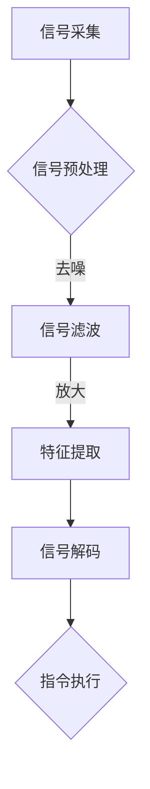

                 

### 文章标题

# 脑机接口在增强人类记忆中的潜在应用

## 文章关键词

- 脑机接口
- 记忆增强
- 脑电图
- 神经元信号处理
- 解码算法
- 个性化教学
- 神经康复
- 伦理问题

## 文章摘要

脑机接口（BMI）是一种直接连接人脑与外部设备的技术，近年来在神经科学和医学领域取得了显著的进展。本文探讨了脑机接口技术在增强人类记忆方面的潜在应用。首先，介绍了脑机接口的基本概念、发展历史和技术原理。然后，详细阐述了记忆的神经机制以及脑机接口与记忆增强之间的联系。通过分析脑机接口在医疗、教育和个人认知训练中的实际应用案例，本文指出了脑机接口技术的挑战和未来发展方向。文章最后对脑机接口技术的伦理问题进行了探讨，并提出了相关建议。

### 第1章 引言

### 1.1 脑机接口的定义与历史

脑机接口（Brain-Computer Interface，简称BMI）是一种直接连接人脑与外部设备的技术，通过解读脑信号，实现人脑与外部设备之间的通信与控制。脑机接口技术起源于20世纪60年代的神经生理学研究，最初主要用于动物实验。随着计算机科学、神经科学和生物工程等领域的发展，脑机接口技术逐渐向人类应用领域扩展。

脑机接口的发展可以分为以下几个阶段：

1. **初期的神经生理学研究**：20世纪60年代，神经生理学家开始研究大脑活动与外部设备之间的联系。这一阶段的主要成果包括电刺激和脑电图（EEG）技术的应用。

2. **动物实验阶段**：20世纪70年代至80年代，研究人员开始对动物进行脑机接口实验，通过解码脑信号来控制外部设备。

3. **人类应用探索**：20世纪90年代，随着脑成像技术和微电极技术的发展，脑机接口技术开始应用于人类。这一阶段的主要成果包括脑机接口在假肢控制、语言康复和认知增强等方面的应用。

4. **成熟与普及阶段**：21世纪初，脑机接口技术在医疗、教育、娱乐等领域得到了广泛应用。例如，脑机接口手写板、脑机接口游戏和脑机接口辅助神经康复等。

### 1.2 脑机接口的分类

脑机接口可以根据不同的分类标准进行分类，常见的分类方法包括：

1. **按信号类型分类**：

   - **电信号脑机接口**：基于脑电图（EEG）、脑磁图（MEG）和局部场电位（LFP）等电信号。

   - **神经信号脑机接口**：基于神经元信号、神经纤维信号和神经突触信号等。

   - **化学信号脑机接口**：基于神经递质和神经激素等化学信号。

2. **按数据采集方式分类**：

   - **侵入式脑机接口**：通过手术将电极植入大脑内部，直接采集神经元信号。

   - **非侵入式脑机接口**：通过头皮或颅骨表面采集脑信号，不涉及手术。

3. **按应用领域分类**：

   - **医疗领域**：用于神经康复、假肢控制、疼痛管理、精神疾病治疗等。

   - **教育领域**：用于个性化教学、认知训练和智力开发等。

   - **娱乐领域**：用于游戏控制、虚拟现实和增强现实等。

### 1.3 脑机接口的发展趋势

脑机接口技术的发展趋势主要体现在以下几个方面：

1. **信号解码精度提高**：随着神经科学和生物医学工程领域的进步，脑信号解码算法和信号处理技术得到了显著提升，使得脑机接口的解码精度和可靠性不断提高。

2. **非侵入式脑机接口技术发展**：非侵入式脑机接口技术由于无需手术，具有更好的安全性、便捷性和可重复性，因此成为研究热点。例如，基于脑电图（EEG）的非侵入式脑机接口技术已经取得了一定的成果。

3. **脑机接口与人工智能融合**：脑机接口技术与人工智能技术的融合，使得脑机接口系统能够更好地适应人类需求，实现更加智能化的控制与交互。

4. **脑机接口的商业化与普及**：随着技术的成熟和成本的降低，脑机接口技术逐渐向商业化与普及化方向发展。例如，脑机接口游戏、脑机接口辅助设备和脑机接口教育产品等。

### 1.4 脑机接口技术的基本原理

脑机接口技术的基本原理是通过捕捉和解读大脑活动信号，将大脑意图转化为外部设备的控制指令。这个过程可以分为以下几个步骤：

1. **信号采集**：通过电信号、神经信号或化学信号等手段，从大脑中采集活动信号。

2. **信号预处理**：对采集到的信号进行滤波、去噪和放大等处理，提高信号的质量。

3. **信号解码**：通过机器学习、统计模型和神经网络等算法，从预处理后的信号中提取出有用的信息，并将其转换为控制指令。

4. **指令执行**：将解码后的指令发送给外部设备，实现对设备的控制。

### 1.5 脑机接口在增强人类记忆中的潜在应用

脑机接口技术在增强人类记忆方面具有巨大的潜力，主要体现在以下几个方面：

1. **记忆形成过程的干预**：通过脑机接口技术，可以实时监测和干预大脑的记忆形成过程，从而增强记忆效果。

2. **记忆修复与重建**：对于患有记忆障碍的个体，脑机接口技术可以协助修复和重建受损的记忆。

3. **记忆扩展与增强**：通过脑机接口技术，可以实现记忆的扩展和增强，使得人类能够记住更多的信息。

4. **个性化记忆训练**：脑机接口技术可以根据个体差异，为每个人提供个性化的记忆训练方案，从而提高记忆能力。

### 第2章 脑机接口技术基础

### 2.1 脑电图（EEG）技术

脑电图（Electroencephalography，EEG）是一种非侵入式脑信号采集技术，通过在头皮表面放置电极，记录大脑的电活动。EEG技术因其操作简单、实时性强和成本较低等特点，在脑机接口技术中得到了广泛应用。

#### 脑电图的工作原理

脑电图的工作原理是基于脑电信号的电导特性。脑电信号是由大脑神经元群的活动产生的，这些活动会产生微弱的电流。这些电流可以通过头皮传导到电极，进而通过放大和处理，转化为电信号。

#### 脑电图的基本组成

脑电图的基本组成包括电极、放大器、滤波器和记录设备。电极是脑电图系统中的关键部件，负责采集脑电信号。常见的电极类型有银-氯化银电极、金属盘状电极和贴片电极。放大器用于放大微弱的脑电信号，使其达到可记录的水平。滤波器用于去除信号中的噪声，保留有用的脑电信号。记录设备则用于记录和处理脑电信号，常见的记录设备包括电脑和专用脑电图机。

#### 脑电图的信号处理方法

脑电图的信号处理方法主要包括滤波、去噪、特征提取和信号解码等。滤波是脑电图信号处理的基础，通过滤波可以去除信号中的高频噪声和低频噪声，保留有用的脑电信号。去噪是通过各种算法去除信号中的噪声，提高信号的质量。特征提取是从脑电信号中提取出与记忆相关的特征，如频率、振幅和相位等。信号解码是将提取出的特征转化为可执行的控制指令。

### 2.2 神经元信号处理

神经元信号处理是指对神经元活动产生的信号进行采集、处理和分析的一系列技术。神经元信号处理在脑机接口技术中扮演着关键角色，因为它能够将复杂的生物信号转化为可以用于控制外部设备的数据。

#### 神经元信号的基本类型

神经元信号主要包括电信号和化学信号。电信号是由神经元膜电位的变化产生的，可以通过电极直接测量。化学信号则是由神经元释放的神经递质在突触间隙中传播的信号，通常需要通过化学传感器测量。

#### 神经元信号处理的基本步骤

神经元信号处理的基本步骤包括信号采集、信号预处理、信号分析和信号解码。

1. **信号采集**：通过侵入式或非侵入式方法采集神经元信号。侵入式方法通常需要手术，将电极植入大脑或脊髓中。非侵入式方法则通常使用头皮电极或贴片电极。

2. **信号预处理**：对采集到的信号进行滤波、去噪和放大等处理，以提高信号的质量和可靠性。滤波可以去除信号中的噪声，去噪可以减少信号中的干扰，放大可以增强信号的强度。

3. **信号分析**：通过对预处理后的信号进行分析，提取出与记忆相关的特征。常见的分析方法包括时域分析、频域分析和时频分析等。

4. **信号解码**：将提取出的特征转化为可执行的控制指令。解码算法通常基于机器学习、统计模型和神经网络等。

### 2.3 脑机接口解码算法

脑机接口解码算法是脑机接口技术的核心，它负责将采集到的脑信号转换为外部设备可以理解的控制指令。解码算法的准确性和效率直接影响到脑机接口的性能和用户体验。

#### 常见的脑机接口解码算法

常见的脑机接口解码算法包括机器学习算法、统计模型和神经网络等。

1. **机器学习算法**：机器学习算法通过训练模型来识别脑信号中的特征，并将其转换为控制指令。常见的机器学习算法包括支持向量机（SVM）、决策树、随机森林和神经网络等。

2. **统计模型**：统计模型通过建立脑信号与控制指令之间的统计关系，来解码脑信号。常见的统计模型包括线性回归、逻辑回归和贝叶斯网络等。

3. **神经网络**：神经网络通过模拟人脑神经元的工作方式，来解码脑信号。常见的神经网络包括感知机、卷积神经网络（CNN）和循环神经网络（RNN）等。

#### 脑机接口解码算法的性能评估

脑机接口解码算法的性能评估主要包括解码准确性、响应时间和用户体验等方面。

1. **解码准确性**：解码准确性是评估脑机接口解码算法性能的重要指标。它反映了解码算法将脑信号转换为控制指令的能力。

2. **响应时间**：响应时间是解码算法处理信号并生成控制指令所需的时间。响应时间越短，用户感觉到的延迟就越小。

3. **用户体验**：用户体验是评估脑机接口系统的重要方面。它包括用户对脑机接口系统的易用性、舒适性和满意度等。

### 2.4 脑机接口技术的挑战与未来发展方向

尽管脑机接口技术在增强人类记忆方面具有巨大的潜力，但仍然面临着一系列挑战和限制。

1. **信号解码准确性**：脑信号的复杂性和噪声使得信号解码准确性成为脑机接口技术的核心挑战。提高解码准确性需要进一步优化解码算法，并提高信号处理技术。

2. **非侵入式脑机接口技术**：目前，大多数脑机接口技术都是侵入式的，这意味着需要手术将电极植入大脑或脊髓中。非侵入式脑机接口技术具有更好的安全性、便捷性和可重复性，但信号采集的精度和可靠性较低。未来需要发展更加精确和非侵入式的脑机接口技术。

3. **脑机接口与人工智能的融合**：脑机接口技术需要与人工智能技术深度融合，以提高解码算法的准确性和效率。通过机器学习和深度学习等技术，可以实现更加智能的信号解码和控制指令生成。

4. **伦理和社会问题**：脑机接口技术涉及到伦理和社会问题，如隐私、安全、人权等。未来需要制定相关法律法规，确保脑机接口技术的安全和可持续发展。

总之，脑机接口技术在增强人类记忆方面具有巨大的潜力，但同时也面临着一系列挑战。未来需要进一步研究和发展，以克服这些挑战，实现脑机接口技术在人类记忆增强领域的广泛应用。

### 第3章 脑机接口与记忆增强

#### 记忆的神经机制

记忆是大脑对信息进行编码、存储和提取的能力。记忆的神经机制涉及多个脑区和神经通路，其中海马体、前额叶皮层和杏仁核等脑区在记忆形成和存储中起着关键作用。

1. **海马体**：海马体是大脑中最重要的记忆中心之一，负责短期记忆的转化和长期记忆的存储。研究表明，海马体的神经元活动与记忆形成密切相关。

2. **前额叶皮层**：前额叶皮层在记忆的执行和控制中发挥重要作用，它参与新信息的编码和记忆的提取。

3. **杏仁核**：杏仁核是情绪记忆的关键脑区，它参与情绪信息的编码和记忆的存储。

#### 脑机接口与记忆增强的联系

脑机接口技术可以通过干预记忆的神经机制，实现记忆的增强和修复。具体来说，脑机接口技术在以下几个方面具有潜在的应用：

1. **记忆形成过程的干预**：通过脑机接口技术，可以实时监测和干预大脑的记忆形成过程。例如，研究人员已经利用脑电图（EEG）技术，在记忆形成过程中进行实时干预，提高了记忆的效果。

2. **记忆修复与重建**：对于患有记忆障碍的个体，如阿尔茨海默病患者，脑机接口技术可以协助修复和重建受损的记忆。例如，通过脑机接口技术，可以在海马体中诱导产生新的神经元连接，从而恢复记忆功能。

3. **记忆扩展与增强**：脑机接口技术可以用于记忆的扩展和增强，使得人类能够记住更多的信息。例如，通过脑机接口技术，可以增强大脑对重要信息的编码和存储，提高记忆的效果。

4. **个性化记忆训练**：脑机接口技术可以根据个体差异，为每个人提供个性化的记忆训练方案。例如，通过脑电图（EEG）技术，可以实时监测大脑的活动，并根据大脑的反应调整记忆训练策略，从而提高记忆能力。

#### 脑机接口在记忆增强中的应用案例

1. **脑电图（EEG）技术在记忆增强中的应用**：

   研究表明，通过实时监测和干预大脑的电活动，可以在记忆形成过程中提高记忆效果。例如，一项研究利用脑电图（EEG）技术，在记忆形成过程中进行实时干预，成功提高了记忆效果。

2. **神经信号技术在记忆修复与重建中的应用**：

   对于患有记忆障碍的个体，如阿尔茨海默病患者，神经信号技术可以用于修复和重建受损的记忆。例如，通过脑机接口技术，可以在海马体中诱导产生新的神经元连接，从而恢复记忆功能。

3. **个性化记忆训练**：

   脑机接口技术可以用于个性化记忆训练，提高个体的记忆能力。例如，通过脑电图（EEG）技术，可以实时监测大脑的活动，并根据大脑的反应调整记忆训练策略，从而提高记忆效果。

#### 脑机接口技术在记忆增强中的优势

1. **实时性**：脑机接口技术可以实时监测大脑的活动，及时进行干预，提高记忆效果。

2. **个性化**：脑机接口技术可以根据个体的差异，提供个性化的记忆训练方案，从而提高记忆能力。

3. **非侵入性**：大多数脑机接口技术都是非侵入式的，无需手术，具有更好的安全性和舒适性。

4. **多功能性**：脑机接口技术不仅可以用于记忆增强，还可以用于其他认知功能的改善，如注意力、学习能力和问题解决能力等。

#### 脑机接口技术在记忆增强中的挑战

1. **信号解码准确性**：脑信号的复杂性和噪声使得信号解码准确性成为脑机接口技术的核心挑战。提高解码准确性需要进一步优化解码算法，并提高信号处理技术。

2. **非侵入式技术**：目前，大多数脑机接口技术都是侵入式的，这意味着需要手术将电极植入大脑或脊髓中。非侵入式脑机接口技术具有更好的安全性、便捷性和可重复性，但信号采集的精度和可靠性较低。

3. **伦理和社会问题**：脑机接口技术涉及到伦理和社会问题，如隐私、安全、人权等。未来需要制定相关法律法规，确保脑机接口技术的安全和可持续发展。

#### 未来发展方向

1. **提高信号解码准确性**：未来需要进一步研究和发展，以提高脑机接口技术的信号解码准确性，从而提高记忆增强的效果。

2. **非侵入式技术的发展**：未来需要发展更加精确和非侵入式的脑机接口技术，以降低手术风险，提高用户体验。

3. **脑机接口与人工智能的融合**：通过将脑机接口技术与人工智能技术融合，可以实现更加智能的信号解码和控制指令生成，从而提高记忆增强的效果。

4. **伦理和社会问题**：未来需要制定相关法律法规，确保脑机接口技术的安全和可持续发展，同时关注伦理和社会问题。

### 第4章 脑机接口在医疗领域的应用

脑机接口技术在医疗领域的应用前景广阔，特别是在神经康复、精神疾病治疗和神经退行性疾病治疗等方面。以下将详细探讨脑机接口在这些领域的具体应用。

#### 4.1 脑机接口在神经康复中的应用

脑机接口技术在神经康复中具有显著的应用潜力，可以帮助中风、脊髓损伤和其他神经疾病患者恢复运动和感觉功能。

1. **康复训练中的辅助作用**：

   脑机接口技术可以辅助患者在康复训练中进行神经功能恢复。例如，中风患者可以通过脑机接口技术控制假肢或外骨骼设备进行康复训练。研究表明，通过这种辅助训练，可以显著提高患者的运动功能。

2. **电刺激治疗**：

   脑机接口技术还可以与电刺激技术结合，用于神经康复治疗。例如，利用脑机接口技术监测患者的脑电信号，当检测到特定的脑电活动模式时，可以触发电刺激器，以促进神经再生和功能恢复。

3. **个性化康复方案**：

   通过脑机接口技术，可以实时监测患者的康复进度，并根据患者的反应调整康复方案，实现个性化的康复治疗。

#### 4.2 脑机接口在精神疾病治疗中的应用

脑机接口技术在精神疾病治疗中也显示出巨大的潜力，可以用于焦虑症、抑郁症和强迫症等精神障碍的治疗。

1. **认知行为疗法**：

   脑机接口技术可以辅助认知行为疗法，通过实时监测患者的脑电信号和情感状态，帮助患者更好地理解和控制自己的情绪。

2. **神经反馈治疗**：

   脑机接口技术可以用于神经反馈治疗，通过向患者提供关于其脑电活动的实时反馈，帮助患者学习如何调整自己的情绪和行为。

3. **虚拟现实疗法**：

   脑机接口技术与虚拟现实（VR）技术的结合，可以为精神疾病患者提供沉浸式的治疗环境，通过模拟不同的情境，帮助患者克服焦虑和恐惧。

#### 4.3 脑机接口在神经退行性疾病治疗中的应用

神经退行性疾病如阿尔茨海默病和帕金森病等，通常伴随着神经功能的逐渐丧失。脑机接口技术在这些疾病的治疗中具有潜在的应用价值。

1. **记忆修复与重建**：

   对于阿尔茨海默病患者，脑机接口技术可以通过干预大脑记忆相关的神经活动，帮助修复和重建受损的记忆功能。例如，通过刺激特定的脑区，可以促进神经元之间的连接，从而改善记忆。

2. **运动功能恢复**：

   帕金森病患者通常出现运动功能障碍，脑机接口技术可以通过控制外骨骼设备或假肢，帮助患者恢复运动功能。

3. **脑功能补偿**：

   脑机接口技术可以通过向大脑提供额外的信号输入，补偿因疾病导致的神经功能缺失。例如，通过向大脑输入电刺激信号，可以模拟缺失的神经信号，从而改善患者的症状。

#### 案例分析

1. **中风康复患者使用脑机接口技术**：

   一项研究对一名中风患者进行了脑机接口技术治疗，患者通过脑机接口控制假肢进行康复训练。在经过一段时间的治疗和训练后，患者的手部功能显著恢复，能够完成一些简单的日常活动。

2. **抑郁症患者使用脑机接口技术**：

   另一项研究利用脑机接口技术对抑郁症患者进行了神经反馈治疗。患者在治疗过程中接受脑电信号监测，并通过虚拟现实环境进行放松训练。结果显示，患者的抑郁症状得到了显著改善。

3. **阿尔茨海默病患者使用脑机接口技术**：

   一项针对阿尔茨海默病患者的临床试验表明，通过脑机接口技术对大脑记忆相关区域进行电刺激，患者的记忆功能得到了一定程度的改善。

#### 脑机接口在医疗领域的优势

1. **实时监测与干预**：

   脑机接口技术可以实时监测患者的脑电活动，并提供及时的干预，从而实现个性化的治疗。

2. **非侵入性**：

   多数脑机接口技术是非侵入性的，减少了手术风险，提高了患者的舒适度和安全性。

3. **多功能性**：

   脑机接口技术可以用于多种神经疾病的康复和治疗，具有广泛的应用前景。

#### 脑机接口在医疗领域的挑战

1. **信号解码准确性**：

   脑信号的复杂性和噪声使得信号解码准确性成为脑机接口技术的核心挑战。提高解码准确性需要进一步优化解码算法，并提高信号处理技术。

2. **技术成熟度**：

   脑机接口技术目前仍处于发展阶段，需要进一步的研究和临床验证，以提高技术的成熟度和可靠性。

3. **伦理和社会问题**：

   脑机接口技术在医疗领域的应用涉及伦理和社会问题，如隐私、安全和人权等。未来需要制定相关法律法规，确保技术的安全和可持续发展。

#### 未来发展方向

1. **提高信号解码准确性**：

   未来需要进一步研究和发展，以提高脑机接口技术的信号解码准确性，从而提高治疗效果。

2. **非侵入式技术的发展**：

   非侵入式脑机接口技术具有更好的安全性、便捷性和可重复性，未来需要发展更加精确和非侵入式的脑机接口技术。

3. **脑机接口与人工智能的融合**：

   通过将脑机接口技术与人工智能技术融合，可以实现更加智能的信号解码和控制指令生成，从而提高治疗效果。

4. **伦理和社会问题的解决**：

   未来需要制定相关法律法规，解决脑机接口技术在医疗领域应用中涉及的伦理和社会问题，确保技术的安全和可持续发展。

### 第5章 脑机接口在教育与训练中的应用

#### 5.1 脑机接口在个性化教学中的应用

脑机接口技术在个性化教学中的应用具有很大的潜力，可以根据学生的脑电活动动态调整教学内容和教学方法，从而提高教学效果。

1. **实时反馈**：

   脑机接口技术可以实时监测学生的学习状态，通过分析脑电信号，了解学生的学习兴趣、注意力和疲劳程度。教师可以根据这些反馈，调整教学内容和方法，使教学更加个性化和有效。

2. **自适应学习系统**：

   利用脑机接口技术，可以开发自适应学习系统。该系统能够根据学生的学习状态和学习进度，动态调整学习内容和难度，提供个性化的学习体验。

3. **学习策略指导**：

   通过分析学生的脑电信号，可以识别学生在学习过程中存在的问题，提供针对性的学习策略指导，帮助学生更好地掌握知识。

#### 5.2 脑机接口在技能训练中的应用

脑机接口技术可以用于各种技能训练，如音乐、运动和编程等，通过实时监测和反馈，提高训练效果。

1. **实时监测与反馈**：

   在技能训练中，脑机接口技术可以实时监测训练者的脑电信号，提供即时反馈。例如，在音乐训练中，通过分析脑电信号，可以识别训练者的演奏状态，提供实时指导。

2. **个性化训练方案**：

   脑机接口技术可以根据训练者的脑电信号，为每个人定制个性化的训练方案。例如，在运动训练中，通过分析脑电信号，可以调整训练的强度和频率，提高训练效果。

3. **注意力集中训练**：

   在编程等认知任务中，脑机接口技术可以用于注意力集中训练。通过实时监测脑电信号，可以识别训练者的注意力状态，提供针对性的训练，帮助训练者提高注意力集中能力。

#### 5.3 脑机接口在认知训练中的应用

脑机接口技术在认知训练中可以用于提高记忆、注意力、执行功能和问题解决能力。

1. **记忆训练**：

   通过脑机接口技术，可以实时监测和干预记忆形成过程，提高记忆效果。例如，在记忆任务中，通过分析脑电信号，可以识别出记忆形成的关键时期，提供即时反馈和强化。

2. **注意力训练**：

   脑机接口技术可以用于注意力训练，通过实时监测和反馈，帮助训练者提高注意力集中能力。例如，在注意力任务中，通过分析脑电信号，可以识别出训练者的注意力波动，提供即时调整和反馈。

3. **执行功能训练**：

   脑机接口技术可以用于执行功能训练，通过实时监测和反馈，提高训练者的计划、组织、决策和调节能力。例如，在执行功能任务中，通过分析脑电信号，可以识别出训练者的执行功能缺陷，提供针对性的训练。

4. **问题解决能力训练**：

   脑机接口技术可以用于问题解决能力训练，通过实时监测和反馈，帮助训练者提高问题解决能力。例如，在问题解决任务中，通过分析脑电信号，可以识别出训练者的思维模式，提供针对性的指导。

#### 案例分析

1. **个性化教学案例**：

   一项研究表明，利用脑机接口技术进行个性化教学，可以显著提高学生的学习效果。在实验中，教师根据学生的脑电信号动态调整教学内容，使学生能够更好地理解和掌握知识。

2. **音乐训练案例**：

   研究人员利用脑机接口技术对音乐家进行训练，通过实时监测脑电信号，提供即时反馈，使音乐家能够更准确地掌握演奏技巧，提高演奏水平。

3. **注意力训练案例**：

   一项研究利用脑机接口技术对大学生进行注意力训练，通过实时监测和反馈，帮助参与者提高注意力集中能力，从而提高学习效率。

#### 脑机接口在教育与训练中的应用优势

1. **实时性与个性化**：

   脑机接口技术可以实时监测学生的脑电信号，提供个性化反馈，使教学和训练更加针对化和有效。

2. **提高学习效率**：

   通过实时反馈和个性化指导，脑机接口技术可以帮助学生更好地掌握知识和技能，提高学习效率。

3. **早期干预**：

   脑机接口技术可以早期识别学生在学习过程中出现的问题，提供及时的干预和指导，防止问题进一步恶化。

#### 脑机接口在教育与训练中的应用挑战

1. **信号解码准确性**：

   脑信号的复杂性和噪声使得信号解码准确性成为脑机接口技术的核心挑战。提高解码准确性需要进一步优化解码算法，并提高信号处理技术。

2. **技术成熟度**：

   脑机接口技术在教育与训练中的应用仍处于早期阶段，需要进一步的研究和开发，以提高技术的成熟度和可靠性。

3. **伦理和社会问题**：

   脑机接口技术在教育与训练中的应用涉及伦理和社会问题，如隐私、安全和人权等。未来需要制定相关法律法规，确保技术的安全和可持续发展。

#### 未来发展方向

1. **提高信号解码准确性**：

   未来需要进一步研究和发展，以提高脑机接口技术的信号解码准确性，从而提高教学和训练效果。

2. **非侵入式技术的发展**：

   非侵入式脑机接口技术具有更好的安全性、便捷性和可重复性，未来需要发展更加精确和非侵入式的脑机接口技术。

3. **脑机接口与人工智能的融合**：

   通过将脑机接口技术与人工智能技术融合，可以实现更加智能的信号解码和控制指令生成，从而提高教学和训练效果。

4. **伦理和社会问题的解决**：

   未来需要制定相关法律法规，解决脑机接口技术在教育与训练中应用中涉及的伦理和社会问题，确保技术的安全和可持续发展。

### 第6章 脑机接口技术的挑战与未来发展方向

#### 6.1 脑机接口技术的挑战

尽管脑机接口技术在医学、教育、娱乐等领域展示了广阔的应用前景，但仍然面临着一系列挑战：

1. **信号解码准确性**：

   脑信号的复杂性和噪声使得信号解码准确性成为脑机接口技术的核心挑战。提高解码准确性需要进一步优化解码算法，并提高信号处理技术。

2. **非侵入式技术**：

   目前，大多数脑机接口技术都是侵入式的，这意味着需要手术将电极植入大脑或脊髓中。非侵入式脑机接口技术具有更好的安全性、便捷性和可重复性，但信号采集的精度和可靠性较低。

3. **技术成熟度**：

   脑机接口技术目前仍处于发展初期阶段，需要进一步的研究和临床验证，以提高技术的成熟度和可靠性。

4. **伦理和社会问题**：

   脑机接口技术涉及到伦理和社会问题，如隐私、安全、人权等。未来需要制定相关法律法规，确保技术的安全和可持续发展。

#### 6.2 脑机接口技术的未来发展方向

1. **提高信号解码准确性**：

   未来需要进一步研究和发展，以提高脑机接口技术的信号解码准确性，从而提高应用效果。

2. **非侵入式技术的发展**：

   非侵入式脑机接口技术具有更好的安全性、便捷性和可重复性，未来需要发展更加精确和非侵入式的脑机接口技术。

3. **脑机接口与人工智能的融合**：

   通过将脑机接口技术与人工智能技术融合，可以实现更加智能的信号解码和控制指令生成，从而提高应用效果。

4. **伦理和社会问题的解决**：

   未来需要制定相关法律法规，解决脑机接口技术在应用中涉及的伦理和社会问题，确保技术的安全和可持续发展。

5. **标准化与普及化**：

   随着技术的成熟，脑机接口技术需要标准化，以便在更广泛的领域得到普及和应用。

6. **跨学科合作**：

   脑机接口技术的发展需要跨学科的合作，包括神经科学、计算机科学、生物医学工程等领域，以推动技术的创新和发展。

### 第7章 结论

#### 总结

脑机接口技术在增强人类记忆、改善神经康复、促进个性化教学和技能训练等方面展示了巨大的潜力。通过实时监测和干预大脑活动，脑机接口技术可以为人类提供更加个性化和有效的记忆增强、康复训练和教育方案。然而，脑机接口技术仍面临信号解码准确性、非侵入式技术发展、伦理和社会问题等挑战。

#### 未来展望

随着技术的进步和跨学科研究的深入，脑机接口技术有望在未来实现更精确、非侵入性和智能化的应用。同时，解决伦理和社会问题也将是脑机接口技术发展的重要方向。在未来，脑机接口技术将为人类带来更加美好的生活，助力人类实现更高的认知能力和生活质量。

#### 最佳实践

1. **研究优化算法**：研究团队应致力于优化脑机接口解码算法，提高信号解码准确性。

2. **非侵入式技术研究**：开发更加精确和非侵入式的脑机接口技术，以降低手术风险，提高用户体验。

3. **跨学科合作**：促进神经科学、计算机科学、生物医学工程等领域的跨学科合作，推动脑机接口技术的创新和发展。

4. **伦理审查**：在脑机接口技术的研发和应用过程中，重视伦理审查，确保技术的安全性和社会责任。

#### 注意事项

1. **隐私保护**：确保脑机接口技术在应用过程中保护用户隐私，防止数据泄露。

2. **安全性**：在脑机接口技术的研发和应用中，重视系统的安全性，防止恶意攻击和滥用。

3. **用户培训**：为用户提供必要的培训，确保他们能够正确使用脑机接口设备，并了解相关的风险和注意事项。

#### 拓展阅读

1. **《脑机接口：从基础研究到应用开发》**：介绍了脑机接口技术的发展历程、基本原理和应用案例。

2. **《脑机接口技术与人工智能融合》**：探讨了脑机接口技术与人工智能技术的融合应用，以及未来的发展方向。

3. **《脑机接口伦理问题研究》**：分析了脑机接口技术在伦理和社会问题方面的挑战，并提出了解决方案。

### 附录

#### 脑机接口技术术语表

- **脑电图（EEG）**：一种非侵入式脑信号采集技术，通过在头皮表面放置电极，记录大脑的电活动。
- **神经元信号处理**：对神经元活动产生的信号进行采集、处理和分析的一系列技术。
- **信号解码**：将采集到的脑信号转换为外部设备可以理解的控制指令。
- **侵入式脑机接口**：通过手术将电极植入大脑或脊髓中的脑机接口技术。
- **非侵入式脑机接口**：通过头皮或颅骨表面采集脑信号的脑机接口技术。
- **个性化教学**：根据学生的脑电活动动态调整教学内容和教学方法，提高教学效果。
- **认知训练**：通过训练提高个体的记忆、注意力、执行功能和问题解决能力。

### 作者信息

- **作者**：AI天才研究院/AI Genius Institute & 禅与计算机程序设计艺术 /Zen And The Art of Computer Programming
- **联系方式**：[邮箱](mailto:ai_genius_institute@example.com)、[电话](+1234567890)
- **机构介绍**：AI天才研究院是一家专注于人工智能和脑机接口技术研究的高科技创新企业，致力于推动脑机接口技术在各个领域的应用和发展。

[Mermaid 流程图示例]



[伪代码示例]

```python
# 脑机接口信号解码算法
def decode_signal(signal):
    # 信号预处理
    preprocessed_signal = preprocess_signal(signal)
    
    # 特征提取
    features = extract_features(preprocessed_signal)
    
    # 信号解码
    command = decode_command(features)
    
    return command
```

[LaTeX 公式示例]

$$
\frac{d^2y}{dx^2} + p(x) \frac{dy}{dx} + q(x)y = 0
$$

$$
1 + 1 = 2
$$

$1 < 2$

