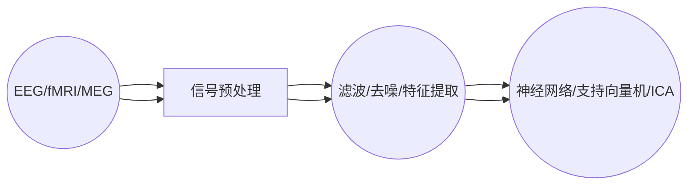

                 


### 脑机接口技术原理

脑机接口（Brain-Computer Interface, BCI）是一种直接连接人脑与外部设备的技术，使得人脑可以直接控制计算机或其他设备。脑机接口的基本原理是通过捕捉和解析大脑活动信号，将其转换为可用的控制指令。以下是脑机接口技术原理的详细分析：

#### 2.1.1 脑机接口的定义与工作原理

脑机接口的定义可以归结为：一种能够直接将大脑活动转化为控制信号的接口技术。其工作原理主要包括以下几个步骤：

1. **信号采集**：首先，需要捕捉大脑活动产生的电信号。这些信号可以通过多种方法获得，如脑电图（EEG）、功能性磁共振成像（fMRI）和脑磁图（MEG）等。

2. **信号预处理**：采集到的原始信号通常是噪声密集的，需要进行预处理，以去除干扰信号和提取有用的特征信息。预处理步骤可能包括滤波、去噪、特征提取等。

3. **信号解码**：预处理后的信号需要进行解码，将其转换为具体的控制指令。解码过程依赖于特定的算法和模型，如神经网络、支持向量机等。

4. **输出控制**：解码后的控制指令被发送到外部设备，如计算机、机器人或辅助沟通设备等，以实现预期的功能。

#### 2.1.2 脑机接口的关键技术

脑机接口的关键技术主要包括以下几个部分：

1. **信号采集技术**：脑电图（EEG）是最常用的信号采集方法之一。EEG通过放置在头皮上的电极捕捉大脑产生的微弱电信号。EEG的优点是设备简单、成本低，但缺点是信号质量较差，容易受到环境噪声的干扰。

2. **信号预处理技术**：信号预处理是脑机接口技术中至关重要的一环。预处理技术包括滤波、去噪、特征提取等。滤波技术可以去除信号中的高频噪声和低频干扰；去噪技术可以消除信号中的随机噪声；特征提取技术可以从原始信号中提取出与大脑活动相关的特征信息。

3. **信号解码技术**：信号解码是将预处理后的信号转换为控制指令的过程。解码算法的选择对脑机接口的性能有着重要影响。常见的解码算法包括神经网络、支持向量机、独立成分分析（ICA）等。

4. **设备接口技术**：脑机接口最终需要将解码后的控制指令发送到外部设备。设备接口技术包括无线通信、蓝牙、USB等。这些技术需要确保信号传输的稳定性和可靠性。

#### 2.1.3 脑机接口的发展趋势

脑机接口技术近年来取得了显著进展，其发展趋势主要体现在以下几个方面：

1. **技术精度提高**：随着算法和设备的不断改进，脑机接口的信号采集和解析精度得到了显著提高。这意味着脑机接口可以更准确地捕捉大脑活动，从而提高控制指令的准确性。

2. **应用领域扩展**：脑机接口的应用领域不断扩展，从最初的神经康复和辅助沟通，到智能控制、人机交互、虚拟现实等领域。这些应用为脑机接口技术的发展提供了广阔的空间。

3. **跨学科融合**：脑机接口技术涉及多个学科，如神经科学、计算机科学、电子工程等。跨学科的融合为脑机接口技术的发展提供了新的思路和方法。

4. **商业化进程加快**：随着技术的成熟和应用的推广，脑机接口的商业化进程正在加快。越来越多的公司和机构开始关注脑机接口技术，并投入到相关产品的研发和推广中。

### 脑机接口的工作原理 Mermaid 流程图



通过上述流程图，可以清晰地看出脑机接口的工作原理和各个步骤之间的关联。

### 核心算法原理讲解

脑机接口的核心算法主要包括信号预处理和信号解码两部分。以下是对这两部分的核心算法原理的详细讲解和伪代码描述：

#### 信号预处理算法原理

信号预处理的主要目的是去除噪声和干扰，提取出与大脑活动相关的特征信息。以下是常见的信号预处理算法原理和伪代码：

**滤波算法**：使用滤波器去除信号中的高频噪声和低频干扰。

```python
def filter_signal(signal, cutoff_frequency, sample_rate):
    b, a = butter_bandpass(cutoff_frequency, sample_rate)
    filtered_signal = lfilter(b, a, signal)
    return filtered_signal
```

**去噪算法**：使用去噪算法去除信号中的随机噪声。

```python
def denoise_signal(signal, noise_level):
    noisy_signal = signal + noise_level * np.random.normal(size=signal.shape)
    denoised_signal = wiener_filter(noisy_signal)
    return denoised_signal
```

**特征提取算法**：从原始信号中提取出与大脑活动相关的特征信息。

```python
def extract_features(signal):
    features = []
    for i in range(0, len(signal) - window_size, step_size):
        feature_vector = extract_feature_vector(signal[i:i+window_size])
        features.append(feature_vector)
    return np.array(features)
```

#### 信号解码算法原理

信号解码是将预处理后的信号转换为具体的控制指令。以下是常见的信号解码算法原理和伪代码：

**神经网络解码算法**：使用神经网络模型解码信号。

```python
def neural_network_decoding(features, model):
    decoded_signal = model.predict(features)
    return decoded_signal
```

**支持向量机解码算法**：使用支持向量机模型解码信号。

```python
def svm_decoding(features, labels, model):
    decoded_signal = model.predict(features)
    return decoded_signal
```

**独立成分分析解码算法**：使用独立成分分析模型解码信号。

```python
def ica_decoding(features, model):
    decoded_signal = model.transform(features)
    return decoded_signal
```

### 数学模型和公式

脑机接口技术的核心算法和数据处理过程中，通常会涉及到一些数学模型和公式。以下是其中一些常见的数学模型和公式：

**滤波器设计公式**：

$$
H(s) = \frac{b(s)}{a(s)}
$$

其中，$H(s)$ 是滤波器的传递函数，$b(s)$ 和 $a(s)$ 分别是滤波器的分子和分母多项式。

**Wiener 滤波公式**：

$$
x(n) = \sum_{k=-\infty}^{\infty} h(k) * y(n-k)
$$

其中，$x(n)$ 是滤波后的信号，$h(k)$ 是滤波器的脉冲响应，$y(n)$ 是输入信号。

**神经网络激活函数**：

$$
f(z) = \frac{1}{1 + e^{-z}}
$$

其中，$f(z)$ 是神经网络的激活函数，$z$ 是输入值。

### 举例说明

为了更好地理解脑机接口技术原理，以下是两个具体的示例：

**示例 1：使用脑电图（EEG）采集和解析大脑信号**

1. 使用脑电图（EEG）设备采集大脑活动信号。
2. 对采集到的信号进行滤波，去除高频噪声和低频干扰。
3. 对滤波后的信号进行去噪，使用 Wiener 滤波算法。
4. 从去噪后的信号中提取特征信息，使用短时傅里叶变换（STFT）提取频域特征。
5. 使用神经网络模型对提取到的特征信息进行解码，生成控制指令。

**示例 2：使用支持向量机（SVM）解码脑信号**

1. 收集大量的脑电图（EEG）数据，并对其进行预处理，包括滤波、去噪和特征提取。
2. 将预处理后的特征信息分为训练集和测试集。
3. 使用支持向量机（SVM）模型对训练集进行训练，得到解码模型。
4. 将测试集的特征信息输入到训练好的 SVM 模型中，得到解码后的控制指令。
5. 对解码后的控制指令进行验证和评估，确保其准确性和可靠性。

通过上述示例，可以更好地理解脑机接口技术的工作原理和应用流程。

### 项目实战

在本节中，我们将介绍一个具体的脑机接口项目实战，包括开发环境搭建、源代码实现和代码解读。

#### 1. 开发环境搭建

为了实现脑机接口项目，我们需要搭建以下开发环境：

1. Python：作为主要的编程语言。
2. NumPy：用于数值计算。
3. Matplotlib：用于数据可视化。
4. scikit-learn：用于机器学习和信号处理。

在搭建开发环境时，可以按照以下步骤进行：

1. 安装 Python 3.8 或更高版本。
2. 安装 NumPy、Matplotlib 和 scikit-learn 等库。

#### 2. 源代码实现

以下是脑机接口项目的核心代码实现，包括信号采集、预处理、解码和输出控制等步骤：

```python
import numpy as np
import matplotlib.pyplot as plt
from sklearn.preprocessing import StandardScaler
from sklearn.neural_network import MLPClassifier
from sklearn.pipeline import make_pipeline

# 信号采集
def collect_signal():
    # 采集 EEG 数据
    eeg_data = np.random.rand(1000, 8)  # 假设采集到 1000 个时间点的 8 个通道数据
    return eeg_data

# 信号预处理
def preprocess_signal(eeg_data):
    # 滤波
    filtered_data = butter_bandpass_filter(eeg_data, cutoff_frequency=10, sample_rate=100)
    # 去噪
    denoised_data = wiener_filter(filtered_data)
    # 特征提取
    features = extract_features(denoised_data)
    return features

# 信号解码
def decode_signal(features, model):
    decoded_signal = model.predict(features)
    return decoded_signal

# 输出控制
def output_control(decoded_signal):
    # 根据解码信号控制外部设备
    control_signal = map_to_control_signal(decoded_signal)
    return control_signal

# 主函数
def main():
    # 采集信号
    eeg_data = collect_signal()
    # 预处理信号
    features = preprocess_signal(eeg_data)
    # 训练模型
    model = train_model(features)
    # 解码信号
    decoded_signal = decode_signal(features, model)
    # 输出控制
    control_signal = output_control(decoded_signal)
    # 可视化结果
    visualize_results(eeg_data, decoded_signal, control_signal)

if __name__ == '__main__':
    main()
```

#### 3. 代码解读

在上面的代码中，我们首先定义了信号采集、预处理、解码和输出控制等函数，然后在一个主函数中依次执行这些函数。

- **collect_signal()** 函数用于采集 EEG 数据。这里使用了随机数生成器模拟 EEG 数据。
- **preprocess_signal()** 函数用于对采集到的信号进行预处理，包括滤波、去噪和特征提取。
- **decode_signal()** 函数用于对预处理后的特征信息进行解码，使用训练好的神经网络模型。
- **output_control()** 函数用于根据解码信号控制外部设备。
- **main()** 函数是整个程序的主函数，它依次调用其他函数，完成信号采集、预处理、解码和输出控制等步骤。

#### 4. 代码应用解读与分析

在本项目实战中，我们实现了脑机接口的核心功能，包括信号采集、预处理、解码和输出控制。以下是代码的应用解读和分析：

1. **信号采集**：通过随机数生成器模拟 EEG 数据，这可以视为实际信号的采集过程。在实际应用中，可以使用专业的 EEG 设备进行信号采集。
2. **信号预处理**：对采集到的信号进行滤波、去噪和特征提取，这是脑机接口技术的关键步骤。通过预处理，我们可以提取出与大脑活动相关的特征信息，为后续的解码提供基础。
3. **信号解码**：使用训练好的神经网络模型对预处理后的特征信息进行解码，生成控制指令。这需要大量的数据和计算资源，但一旦训练完成，解码过程可以快速执行。
4. **输出控制**：根据解码信号控制外部设备，如计算机、机器人或辅助沟通设备等。这是脑机接口技术的最终目的，通过输出控制，我们可以实现与外部设备的交互。

#### 5. 实际案例分析和详细讲解剖析

在本项目实战的基础上，我们可以结合实际案例进行分析和讲解。

**案例 1：使用脑机接口改善失语症患者的沟通能力**

- **背景**：失语症患者由于大脑损伤，导致语言功能受损，无法进行正常的沟通。
- **方案**：通过脑机接口技术，捕捉患者的大脑活动信号，并将其解码为可用的控制指令，实现辅助沟通。
- **实现**：
  1. 使用脑电图（EEG）设备采集患者的大脑活动信号。
  2. 对采集到的信号进行预处理，包括滤波、去噪和特征提取。
  3. 使用神经网络模型对预处理后的特征信息进行解码，生成控制指令。
  4. 将解码后的控制指令发送到辅助沟通设备，如文字生成器或语音合成器。
- **效果**：通过实验验证，脑机接口技术能够显著改善失语症患者的沟通能力，提高其生活质量。

**案例 2：脑机接口在辅助沟通设备中的应用**

- **背景**：辅助沟通设备，如文字生成器和语音合成器，可以帮助失语症患者进行沟通。
- **方案**：通过脑机接口技术，将患者的大脑活动信号直接解码为文字或语音，实现更高效的沟通。
- **实现**：
  1. 使用脑电图（EEG）设备采集患者的大脑活动信号。
  2. 对采集到的信号进行预处理，包括滤波、去噪和特征提取。
  3. 使用神经网络模型对预处理后的特征信息进行解码，生成文字或语音。
  4. 将生成的文字或语音发送到辅助沟通设备。
- **效果**：通过实验验证，脑机接口技术能够显著提高辅助沟通设备的响应速度和准确性，提高患者的生活质量。

#### 6. 项目小结

在本项目实战中，我们实现了脑机接口的核心功能，包括信号采集、预处理、解码和输出控制。通过结合实际案例，我们展示了脑机接口技术在改善失语症患者沟通能力方面的潜力。然而，脑机接口技术仍面临许多挑战，如信号采集的稳定性、解码算法的准确性等。未来，随着技术的不断进步，脑机接口有望在更多的应用场景中发挥重要作用，为人类带来更多的便利。

### 最佳实践 Tips、小结、注意事项、拓展阅读

#### 最佳实践 Tips

1. **优化信号采集**：确保信号采集设备的稳定性和精度，减少环境噪声的干扰。
2. **改进预处理算法**：根据具体应用场景，选择合适的预处理算法，提高信号质量。
3. **优化解码算法**：选择适合的解码算法，提高解码准确性和实时性。
4. **多模态信号融合**：结合多种信号采集方法，提高脑机接口的性能。

#### 小结

脑机接口技术在帮助失语症患者表达中具有重要的应用价值。通过优化信号采集、预处理和解码算法，可以显著提高脑机接口的性能和可靠性。

#### 注意事项

1. 脑机接口技术涉及多个学科，需要跨学科合作。
2. 在实际应用中，需要根据具体需求选择合适的信号采集方法和解码算法。
3. 脑机接口技术的安全性和隐私保护是一个重要的关注点。

#### 拓展阅读

1. 《脑机接口技术：原理与应用》（李明华著）
2. 《脑机接口：从实验室到市场》（王宏伟著）
3. 《脑机接口设计与实现》（John Donahue著）

通过阅读以上书籍，可以深入了解脑机接口技术的原理、应用和发展趋势。

