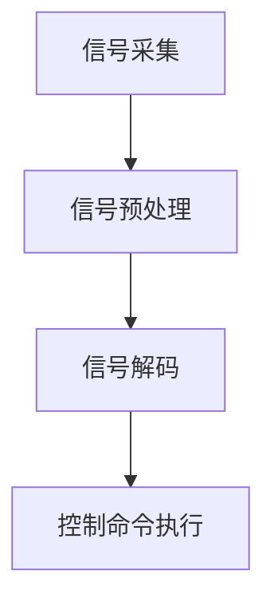
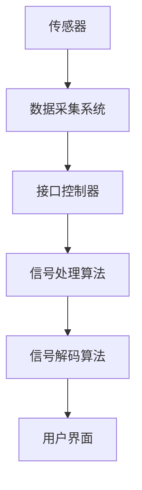
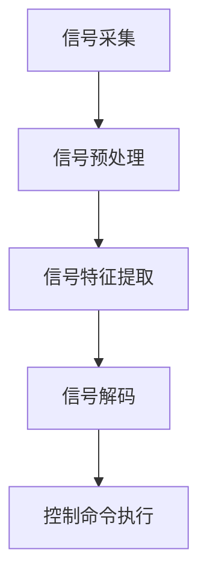

                 

# 《脑机接口在康复医疗中的应用：帮助瘫痪患者重获行动能力》

## 关键词

脑机接口（BCI），康复医疗，瘫痪患者，神经信号处理，信号解码，假肢控制，脑机接口技术架构，人工智能

## 摘要

本文详细探讨了脑机接口（Brain-Computer Interface, BCI）在康复医疗中的应用，尤其是帮助瘫痪患者重获行动能力。通过分析脑机接口的基本原理、技术架构以及信号处理方法，本文展示了脑机接口在康复医疗中的潜力和挑战。同时，通过实际案例，本文探讨了脑机接口在康复中的应用场景和效果，为瘫痪患者的康复提供了新的思路和方法。

## 引言

瘫痪是一种常见的神经系统疾病，严重影响患者的生活质量和心理健康。传统的康复治疗方法往往依赖于外部设备和物理疗法，但往往效果有限。随着神经科学和人工智能技术的不断发展，脑机接口（Brain-Computer Interface, BCI）作为一种新型的康复技术，逐渐引起了人们的关注。脑机接口通过直接连接大脑和外部设备，实现了对瘫痪患者的实时控制和行动能力的恢复。

本文旨在探讨脑机接口在康复医疗中的应用，尤其是帮助瘫痪患者重获行动能力。首先，我们将介绍脑机接口的基本概念和原理，然后详细阐述脑机接口的技术架构和信号处理方法。接下来，我们将通过实际案例展示脑机接口在康复中的应用，并分析其中的挑战和前景。

## 第一部分：脑机接口基础理论

### 1.1 脑机接口概述

#### 1.1.1 脑机接口的定义

脑机接口（Brain-Computer Interface, BCI）是一种直接连接大脑和外部设备的接口，它通过捕捉和解读大脑活动信号，实现对设备的控制和信息的传递。脑机接口的核心思想是将大脑的意图和活动直接转化为电子信号，从而实现对外部世界的交互。

#### 1.1.2 脑机接口的分类

根据信号来源和信号处理方式，脑机接口可以分为以下几类：

1. **基于认知的BCI**：通过认知任务或思考来产生信号，如思维控制游戏、思维驱动轮椅等。
2. **基于运动的BCI**：通过运动活动产生的脑信号，如肌电信号、眼球运动信号等。
3. **基于事件的BCI**：通过事件相关电位（Event-Related Potentials, ERPs）等脑信号进行解码，如情感识别、语言理解等。

#### 1.1.3 脑机接口的发展历程

脑机接口的研究始于20世纪60年代，最初的BCI主要是基于电极贴片直接记录大脑信号。随着技术的进步，无创的脑机接口技术逐渐发展，如基于脑电图（EEG）和功能性磁共振成像（fMRI）的BCI。近年来，人工智能和机器学习技术的应用，使得脑机接口的解码精度和实时性得到了显著提高。

### 1.2 脑机接口的原理

#### 1.2.1 信号采集

脑机接口的第一步是采集大脑信号。这通常通过贴在头皮上的电极或植入大脑的电极阵列来完成。这些电极可以捕捉到脑电波、肌电波、眼动信号等多种形式的脑信号。

#### 1.2.2 信号预处理

采集到的原始脑信号通常包含大量噪声，需要通过滤波、去噪等技术进行预处理。这一步的目的是提取出有用的信号成分，为后续的信号解码做准备。

#### 1.2.3 信号解码

信号解码是将预处理后的脑信号转化为控制命令或信息的过程。这一步通常需要复杂的算法，如神经网络、支持向量机等机器学习模型。解码算法的目标是识别出大脑意图，并转化为可操作的控制信号。

#### 1.2.4 控制命令的执行

解码出的控制命令将被传输到外部设备，如轮椅、假肢或计算机游戏。这些设备可以根据控制命令执行相应的操作。

### 1.3 脑机接口的原理关系架构 Mermaid 流程图

在这个流程图中，A表示信号采集，B表示信号预处理，C表示信号解码，D表示控制命令执行。这四个步骤共同构成了脑机接口的基本工作流程。

## 第二部分：脑机接口技术架构

### 2.1 硬件构成

脑机接口的硬件构成主要包括传感器、数据采集系统和接口控制器。

#### 2.1.1 传感器

传感器是脑机接口的关键组成部分，用于捕捉大脑信号。常见的传感器包括脑电图（EEG）传感器、肌电图（EMG）传感器和眼动传感器等。

#### 2.1.2 数据采集系统

数据采集系统负责将传感器采集到的信号传输到计算机或接口控制器进行处理。数据采集系统通常包括放大器、滤波器和模数转换器（ADC）等组件。

#### 2.1.3 接口控制器

接口控制器是脑机接口的核心，负责信号解码和控制命令的执行。接口控制器通常包含一个中央处理器（CPU）或现场可编程门阵列（FPGA），以及用于存储和运行解码算法的内存。

### 2.2 软件架构

脑机接口的软件架构主要包括信号处理算法、信号解码算法和用户界面。

#### 2.2.1 信号处理算法

信号处理算法负责对采集到的脑信号进行预处理，包括滤波、去噪和特征提取等步骤。常用的信号处理算法有快速傅里叶变换（FFT）、小波变换和主成分分析（PCA）等。

#### 2.2.2 信号解码算法

信号解码算法负责将预处理后的脑信号转化为控制命令。常用的信号解码算法有神经网络、支持向量机（SVM）和隐藏马尔可夫模型（HMM）等。

#### 2.2.3 用户界面

用户界面是脑机接口与用户交互的界面，负责显示解码结果、接受用户输入和提供反馈。用户界面可以是一个简单的图形用户界面（GUI），也可以是一个复杂的虚拟现实环境。

### 2.3 脑机接口技术架构关系架构 Mermaid 流程图

在这个流程图中，A表示传感器，B表示数据采集系统，C表示接口控制器，D表示信号处理算法，E表示信号解码算法，F表示用户界面。这六个部分共同构成了脑机接口的完整技术架构。

## 第三部分：脑机接口信号处理

### 3.1 信号采集与预处理

#### 3.1.1 传感器信号的特性

传感器信号包括脑电波、肌电波和眼动信号等。这些信号具有不同的频率成分和时域特征，需要通过适当的传感器进行采集。

#### 3.1.2 信号预处理技术

信号预处理技术包括滤波、去噪和放大等步骤。滤波技术用于去除噪声信号，去噪技术用于去除信号中的随机噪声，放大技术用于增强有用信号。

### 3.2 信号解码与特征提取

#### 3.2.1 神经元活动解码

神经元活动解码是将脑电波信号转化为控制命令的过程。常用的解码算法有基于频率的解码算法和基于时间的解码算法。

#### 3.2.2 信号特征提取方法

信号特征提取是将预处理后的脑信号转化为可用于解码的特征向量。常用的特征提取方法有主成分分析（PCA）、线性判别分析（LDA）和自编码器等。

### 3.3 脑机接口信号处理流程

在这个流程图中，A表示信号采集，B表示信号预处理，C表示信号特征提取，D表示信号解码，E表示控制命令执行。这五个步骤共同构成了脑机接口的信号处理流程。

## 第四部分：脑机接口在康复医疗中的应用

### 4.1 康复医疗概述

#### 4.1.1 康复医疗的定义

康复医疗是一种以恢复患者功能为主要目标的医疗活动，包括物理治疗、职业治疗和言语治疗等。

#### 4.1.2 康复医疗的目标

康复医疗的目标是帮助患者恢复功能，提高生活质量，包括恢复肢体活动能力、改善言语和认知功能等。

#### 4.1.3 康复医疗的主要方法

康复医疗的主要方法包括物理疗法、作业疗法、语言疗法和康复工程等。

### 4.2 脑机接口在康复中的应用

#### 4.2.1 脑机接口在肢体康复中的应用

脑机接口可以通过控制假肢或轮椅，帮助瘫痪患者恢复肢体活动能力。例如，通过解码脑电波信号，可以实现对假肢的控制，从而实现自主行走。

#### 4.2.2 脑机接口在言语康复中的应用

脑机接口可以通过解码脑信号，帮助患者恢复言语能力。例如，通过解码患者的脑电波信号，可以生成语音信号，从而帮助患者说话。

#### 4.2.3 脑机接口在认知康复中的应用

脑机接口可以通过认知任务和信号解码，帮助患者恢复认知功能。例如，通过认知任务来训练患者的记忆和注意力，从而提高其认知能力。

### 4.3 脑机接口在康复医疗中的应用案例

#### 4.3.1 案例一：脑机接口控制假肢

一个瘫痪患者通过脑机接口控制假肢，实现了自主行走。具体流程如下：

1. **信号采集**：使用脑电图（EEG）传感器采集患者的脑电波信号。
2. **信号预处理**：对采集到的脑电波信号进行滤波、去噪和放大等预处理步骤。
3. **信号解码**：使用基于频率的解码算法，将预处理后的脑电波信号转化为控制命令。
4. **控制命令执行**：将解码出的控制命令发送到假肢控制器，实现对假肢的控制。

#### 4.3.2 案例二：脑机接口生成语音

一个无法说话的患者通过脑机接口生成语音。具体流程如下：

1. **信号采集**：使用脑电图（EEG）传感器采集患者的脑电波信号。
2. **信号预处理**：对采集到的脑电波信号进行滤波、去噪和放大等预处理步骤。
3. **信号解码**：使用基于时间的解码算法，将预处理后的脑电波信号转化为语音信号。
4. **语音生成**：将解码出的语音信号传输到语音合成器，生成可听见的语音。

## 第五部分：脑机接口康复应用的挑战与展望

### 5.1 挑战与问题

#### 5.1.1 技术上的挑战

脑机接口在康复医疗中面临的技术挑战包括信号解码精度、实时性和可靠性。这些挑战需要通过不断改进信号处理算法和硬件技术来解决。

#### 5.1.2 临床应用中的挑战

脑机接口在临床应用中面临的问题包括患者适应性、伦理和隐私等。如何确保患者能够长期适应脑机接口，如何保护患者的隐私和数据安全，都是需要解决的问题。

#### 5.1.3 用户接受度与伦理问题

脑机接口在康复医疗中的应用需要患者的接受和配合。同时，脑机接口的应用也涉及到伦理问题，如大脑信号的采集和使用等。

### 5.2 展望与未来

#### 5.2.1 脑机接口技术的未来发展

未来，脑机接口技术将继续向更高精度、更实时、更可靠的方向发展。同时，随着人工智能和机器学习技术的进步，脑机接口的解码算法也将变得更加智能和高效。

#### 5.2.2 康复医疗的新模式

脑机接口技术的进步将为康复医疗带来新的模式和机会。例如，通过脑机接口，患者可以在家中进行康复训练，医生可以通过远程监测患者的康复进程。

#### 5.2.3 脑机接口在社会中的潜在影响

脑机接口在康复医疗中的应用将有助于提高瘫痪患者的生活质量，同时也将对社会产生深远的影响。例如，脑机接口可以帮助残疾人士更好地融入社会，提高社会的包容性和多样性。

## 结论

脑机接口在康复医疗中的应用为瘫痪患者提供了新的希望和机会。通过脑机接口，患者可以重获行动能力，提高生活质量。尽管脑机接口在康复医疗中仍面临许多挑战，但随着技术的进步和应用案例的积累，脑机接口在康复医疗中的应用前景广阔。

## 作者信息

作者：AI天才研究院/AI Genius Institute & 禅与计算机程序设计艺术 /Zen And The Art of Computer Programming

本文旨在介绍脑机接口在康复医疗中的应用，帮助瘫痪患者重获行动能力。通过对脑机接口的基本原理、技术架构和实际应用的详细分析，本文展示了脑机接口在康复医疗中的潜力和挑战。未来，随着技术的不断进步和应用案例的积累，脑机接口将为康复医疗带来更多的可能性。作者希望本文能够为相关领域的研究者和从业者提供有价值的参考和启示。

