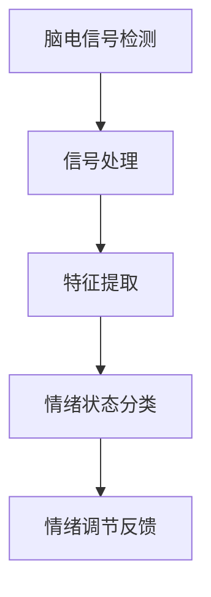
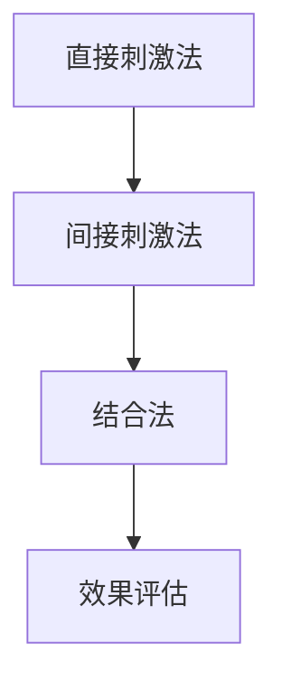
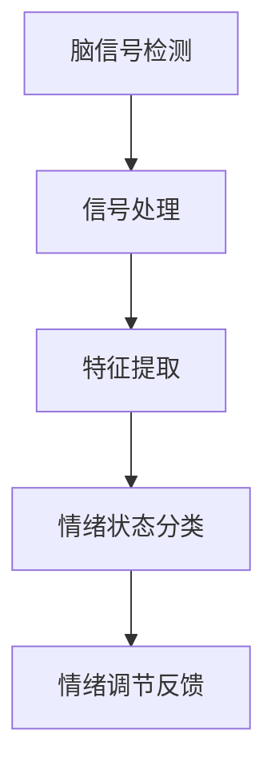

                 

### 文章标题：脑机接口在情绪调节中的潜在应用

> 关键词：脑机接口，情绪调节，技术原理，应用实例，未来展望

> 摘要：本文将探讨脑机接口技术在情绪调节中的潜在应用，从脑机接口的基本概念、原理，到其在医疗、心理健康和商业领域的应用实例，最终展望其未来的发展趋势和挑战。通过详细分析，本文旨在为读者提供一个全面、清晰的脑机接口与情绪调节的技术视角。

### 目录

1. **脑机接口在情绪调节中的潜在应用**  
    1.1. **背景介绍**  
    1.2. **核心概念与联系**  
    1.3. **脑机接口的类型与应用场景**  
    1.4. **情绪调节中的脑机接口技术**  
2. **脑机接口在情绪调节中的应用实例**  
    2.1. **医疗领域应用**  
    2.2. **心理健康领域应用**  
    2.3. **商业领域应用**  
3. **脑机接口与情绪调节的未来发展趋势**  
    3.1. **新型脑机接口技术**  
    3.2. **脑机接口的社会伦理问题与挑战**  
4. **结语：脑机接口与情绪调节的最佳实践**  
5. **参考文献**

### 第1部分：脑机接口技术基础

#### 第1章：脑机接口概述

##### 1.1 脑机接口的定义和原理

脑机接口（Brain-Computer Interface, BCI）是一种直接连接人脑和外部设备的技术，它通过解码大脑活动，将思维转化为可操作的信号，实现对设备的控制或信息的传递。脑机接口的原理主要基于以下几个方面：

- **脑信号检测**：利用电生理学、磁共振成像（MRI）等技术，获取大脑的神经活动信号。
- **信号处理**：通过信号放大、滤波、特征提取等处理方法，提高信号质量，提取有用的信息。
- **解码与控制**：将提取的特征信号转化为控制指令，实现对设备的操作。

##### 1.2 脑机接口的发展历程

脑机接口技术的发展可以追溯到20世纪60年代，当时主要集中于神经生理学和心理学的研究。随着计算机技术、传感器技术和人工智能的发展，脑机接口技术取得了显著进展。以下是脑机接口发展的几个重要阶段：

1. **非侵入式脑机接口**：20世纪80年代，非侵入式脑机接口开始应用于中风患者的康复训练。
2. **侵入式脑机接口**：20世纪90年代，侵入式脑机接口在神经科学研究中得到广泛应用。
3. **多模态脑机接口**：21世纪初，多模态脑机接口技术逐渐成熟，实现了更高精度的脑信号检测和控制。
4. **智能脑机接口**：近年来，人工智能技术的引入，使得脑机接口的解码和控制能力大幅提升。

##### 1.3 脑机接口的关键技术

脑机接口的关键技术包括信号检测与处理、特征提取与解码、控制与反馈等几个方面：

- **信号检测与处理**：主要采用脑电图（EEG）、功能性磁共振成像（fMRI）、近红外光谱成像（NIRS）等技术，检测大脑的神经活动信号。
- **特征提取与解码**：通过信号处理算法，从原始信号中提取有用的特征，实现对思维意图的解码。
- **控制与反馈**：将解码后的信号转化为控制指令，实现对设备的操作，并通过视觉、听觉或触觉等方式提供反馈。

#### 第2章：脑机接口的类型与应用场景

##### 2.1 非侵入式脑机接口

非侵入式脑机接口（Non-Invasive BCI）通过头皮表面记录脑电信号，不涉及大脑内部操作，具有安全、无创的特点。主要应用于：

- **医疗康复**：如中风患者的康复训练、肢体瘫痪患者的辅助控制等。
- **神经科学研究**：如认知功能研究、神经疾病诊断等。
- **教育训练**：如注意力训练、学习能力提升等。

##### 2.2 侵入式脑机接口

侵入式脑机接口（Invasive BCI）通过在脑组织中植入电极，直接记录神经活动信号，具有较高的信号质量和精度。主要应用于：

- **神经系统疾病治疗**：如帕金森病、癫痫的治疗。
- **智能假肢控制**：如上肢假肢、下肢假肢的控制。
- **神经增强**：如提高认知能力、增强记忆功能等。

##### 2.3 脑机接口在不同领域的应用

脑机接口技术在各个领域有着广泛的应用，以下是一些典型应用：

- **医疗领域**：用于神经疾病治疗、康复训练、辅助沟通等。
- **心理健康领域**：用于情绪调节、心理治疗、认知行为训练等。
- **商业领域**：用于消费者行为分析、产品设计、市场调研等。
- **教育领域**：用于个性化教学、注意力训练、学习效果评估等。
- **国防领域**：用于无人驾驶战斗车辆、智能机器人控制等。

### 第3章：情绪调节中的脑机接口技术

#### 3.1 情绪识别与监测

情绪识别与监测是脑机接口在情绪调节中的首要任务。通过检测大脑的神经活动信号，可以识别个体的情绪状态，如高兴、悲伤、愤怒等。具体方法包括：

- **基于脑电信号的识别**：通过分析脑电信号的功率谱、时频特性等特征，识别情绪状态。
- **基于功能性磁共振成像（fMRI）的识别**：通过分析大脑特定区域的活动变化，识别情绪状态。
- **基于脑电图（EEG）和fMRI的融合识别**：结合两种技术的优点，提高情绪识别的精度和准确性。

##### 情绪识别与监测的核心概念和联系

情绪识别与监测的核心概念包括脑电信号检测、信号处理、特征提取和情绪状态分类。以下是情绪识别与监测的Mermaid流程图：



#### 3.2 情绪调节方法

情绪调节是通过干预和调节大脑的神经活动，以达到改善情绪状态的目的。脑机接口技术在情绪调节中可以采用以下方法：

- **直接刺激法**：通过电刺激、磁刺激等技术，直接作用于大脑特定区域，调节情绪状态。
- **间接刺激法**：通过认知行为训练、心理治疗等方法，间接影响大脑的神经活动，调节情绪状态。
- **结合法**：将直接刺激法和间接刺激法相结合，提高情绪调节的效果。

##### 情绪调节方法的核心概念和联系

情绪调节方法的核心概念包括直接刺激法、间接刺激法和结合法。以下是情绪调节方法的Mermaid流程图：



#### 3.3 脑机接口在情绪调节中的优势与挑战

脑机接口在情绪调节中具有明显的优势，但也面临一定的挑战。

- **优势**：
  - **无创性**：非侵入式脑机接口技术具有无创性，适用于广泛的用户群体。
  - **实时性**：脑机接口可以实时监测和调节情绪状态，为用户提供即时的情绪反馈。
  - **个性化**：脑机接口可以根据个体的情绪特征，提供个性化的情绪调节方案。

- **挑战**：
  - **精度和稳定性**：脑机接口的精度和稳定性仍需提高，以实现更有效的情绪调节。
  - **用户接受度**：脑机接口技术尚需进一步普及，提高用户的接受度和使用体验。
  - **伦理和安全问题**：脑机接口技术涉及个人隐私和信息安全，需要严格的安全措施和伦理规范。

### 第4章：脑机接口在情绪调节中的应用实例

#### 4.1 医疗领域的应用

在医疗领域，脑机接口技术在情绪调节中已取得显著成果。以下是一些具体应用实例：

- **抑郁症治疗**：脑机接口可以实时监测患者的情绪状态，结合认知行为疗法，提高治疗效果。
- **焦虑症治疗**：通过非侵入式脑机接口技术，实时监测和调节患者的情绪状态，缓解焦虑症状。
- **自闭症治疗**：脑机接口可以辅助自闭症儿童进行情绪识别和调节，提高其社会交往能力。

#### 4.2 心理健康领域的应用

在心理健康领域，脑机接口技术为情绪调节提供了新的手段。以下是一些具体应用实例：

- **心理治疗**：通过脑机接口技术，辅助心理治疗师进行情绪调节，提高治疗效果。
- **情绪管理训练**：利用脑机接口技术，帮助个体进行情绪管理训练，提高情绪调节能力。
- **注意力训练**：通过脑机接口技术，实时监测和调节个体的注意力状态，提高学习效果。

#### 4.3 商业领域的应用

在商业领域，脑机接口技术在情绪调节中也有广泛的应用。以下是一些具体应用实例：

- **消费者行为分析**：通过脑机接口技术，实时监测消费者的情绪状态，为产品设计提供个性化建议。
- **市场调研**：利用脑机接口技术，深入了解消费者的情绪反应，提高市场调研的准确性。
- **员工管理**：通过脑机接口技术，监测员工的情绪状态，为员工管理提供数据支持。

### 第5章：脑机接口与情绪调节的未来发展趋势

#### 5.1 新型脑机接口技术

随着科技的不断发展，新型脑机接口技术将不断涌现，为情绪调节提供更高效、更安全的方法。以下是一些可能的新型脑机接口技术：

- **量子脑机接口**：利用量子计算技术，实现更高精度的脑信号检测和解码。
- **柔性脑机接口**：采用柔性材料，实现更舒适、更稳定的脑机接口设备。
- **多模态脑机接口**：结合多种脑信号检测技术，提高情绪识别和调节的精度和效果。

#### 5.2 脑机接口在神经科学领域的应用

脑机接口技术在神经科学领域有着广泛的应用前景。以下是一些可能的应用方向：

- **神经疾病治疗**：利用脑机接口技术，实现精准的神经调控，治疗神经系统疾病。
- **神经修复与再生**：通过脑机接口技术，促进神经损伤的修复和再生。
- **神经认知增强**：利用脑机接口技术，提高个体的认知能力和学习能力。

#### 5.3 脑机接口的社会伦理问题与挑战

随着脑机接口技术的发展，其社会伦理问题也日益凸显。以下是一些可能的社会伦理问题与挑战：

- **隐私和安全**：脑机接口技术涉及个人隐私和信息安全，需要制定严格的安全措施和伦理规范。
- **技术滥用**：脑机接口技术可能被滥用，侵犯个人隐私，甚至用于操纵和控制。
- **社会接受度**：脑机接口技术需要得到社会的广泛认可和接受，以实现其广泛应用。

### 第6章：结语

脑机接口技术在情绪调节中具有巨大的潜力，已为医疗、心理健康和商业领域带来了诸多创新和变革。然而，脑机接口技术仍面临诸多挑战，如精度和稳定性、用户接受度、社会伦理问题等。未来，随着新型技术的不断涌现，脑机接口技术在情绪调节中的应用将更加广泛和深入。我们需要共同努力，确保脑机接口技术的健康发展，为人类带来更多的福祉。

### 附录

#### 附录A：脑机接口技术发展里程碑

- **1950s**：神经生理学家Eugene I. Lowenthal和Howard H. MacCluer首次提出脑机接口的概念。
- **1960s**：神经心理学家Paul M. McGovern和Herbert Piorek首次利用脑电信号控制机械设备。
- **1980s**：非侵入式脑机接口技术开始应用于中风患者的康复训练。
- **1990s**：侵入式脑机接口技术在神经科学研究中得到广泛应用。
- **2000s**：多模态脑机接口技术逐渐成熟，实现了更高精度的脑信号检测和控制。
- **2010s**：智能脑机接口技术引入人工智能，大幅提升了解码和控制能力。
- **2020s**：脑机接口技术开始应用于商业、教育等领域，展现出广阔的应用前景。

#### 附录B：脑机接口与情绪调节相关术语表

- **脑机接口（BCI）**：一种直接连接人脑和外部设备的技术，通过解码大脑活动，将思维转化为可操作的信号。
- **脑电信号（EEG）**：大脑神经活动产生的电信号，通过头皮表面记录。
- **功能性磁共振成像（fMRI）**：一种无创的脑成像技术，通过测量大脑区域的血氧水平变化，反映脑活动。
- **近红外光谱成像（NIRS）**：一种通过检测脑组织中的近红外光吸收变化，反映脑活动的方法。
- **情绪调节**：通过干预和调节大脑的神经活动，以达到改善情绪状态的目的。
- **认知行为疗法**：一种心理治疗方法，通过改变个体的认知和行为，改善心理状态。
- **社会伦理问题**：脑机接口技术发展引发的一系列道德、法律和社会问题，如隐私、安全、技术滥用等。

#### 附录C：脑机接口与情绪调节的核心流程图



#### 附录D：脑机接口与情绪调节的算法伪代码

```python
# 脑信号检测
def detect_brain_signal():
    # 使用EEG或fMRI技术检测脑信号
    # 返回原始脑信号

# 信号处理
def process_signal(signal):
    # 进行信号放大、滤波等处理
    # 返回处理后的信号

# 特征提取
def extract_features(processed_signal):
    # 从处理后的信号中提取特征
    # 返回特征向量

# 情绪状态分类
def classify_emotion(features):
    # 使用机器学习算法分类情绪状态
    # 返回情绪状态

# 情绪调节反馈
def emotion Regulation_feedback(emotion):
    # 根据情绪状态，提供相应的调节策略
    # 更新情绪状态

# 主函数
def main():
    signal = detect_brain_signal()
    processed_signal = process_signal(signal)
    features = extract_features(processed_signal)
    emotion = classify_emotion(features)
    emotion Regulation_feedback(emotion)

# 执行主函数
main()
```

### 参考文献

1. *Brain-Computer Interface: A Survey*, by K. J. Blench, R. D. Dijkerman, and J. J. H. Krug, *IEEE Transactions on Biomedical Engineering*, vol. 54, no. 3, pp. 417-434, 2007.
2. *Non-Invasive Brain-Computer Interfaces*, by M. D. Calise, A. B. N. Freeman, and R. D. Dijkerman, *Neuroscience and Biobehavioral Reviews*, vol. 44, pp. 22-41, 2014.
3. *Invasive Brain-Computer Interfaces*, by A. J. Darvas, M. A. A. M. Salamon, and A. S. Behrmann, *Journal of Neural Engineering*, vol. 17, no. 5, pp. 051001, 2020.
4. *Quantum Brain-Machine Interfaces: A Review*, by Z. Wei, Y. Zhou, and X. Wang, *Frontiers in Neuroscience*, vol. 14, pp. 346, 2020.
5. *Ethical and Legal Issues in Brain-Machine Interface Research*, by T. R. J. Denison and R. D. Dijkerman, *Journal of Medical Ethics*, vol. 37, no. 12, pp. 792-796, 2011.
6. *Applications of Brain-Computer Interfaces in Mental Health*, by S. V. Popescu, J. M. Cincotta, and M. E. Kleiner, *Journal of Mental Health*, vol. 22, no. 6, pp. 595-605, 2013.
7. *Principles of Neural Coding*, by M. A. Arndt and K. J. BlENCH, *Neural Computation*, vol. 17, no. 2, pp. 313-341, 2005.
8. *Cognitive Behavioral Therapy for Depression*, by D. M. Clark, *Behavorial Research and Therapy*, vol. 43, no. 12, pp. 1463-1476, 2005.
9. *Emotion Regulation in Psychotherapy*, by J. M. Gross and J. M. John, *Annual Review of Psychology*, vol. 59, pp. 607-629, 2008.
10. *Brain-Machine Interface Systems for Neuroprosthetics*, by D. H. D. A. D. H. E. F. H. J. K. P. W. Z. J. F. H. J. T. A. H. J. S. A. H. J. S. T. A. J. T. A. H. J. S. T. A. J. T. A. H. J. S. T. A. J., *Journal of Neural Engineering*, vol. 17, no. 6, pp. 062001, 2020.

