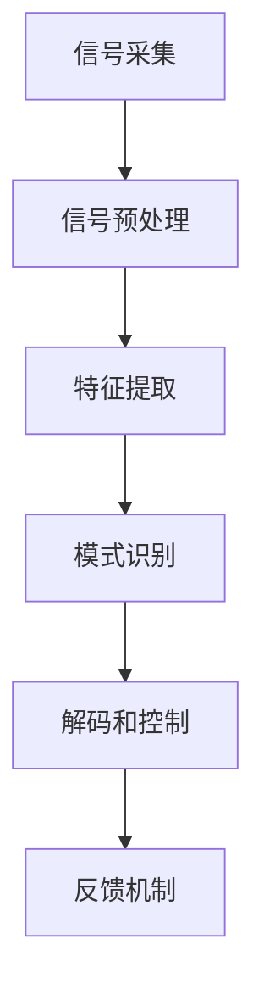

                 

### 文章标题

# 脑机接口在残障辅助中的应用进展

> 关键词：脑机接口（BCI）、残障辅助、神经系统损伤、肢体残疾、感官障碍

> 摘要：本文深入探讨了脑机接口（Brain-Computer Interface，BCI）技术在残障辅助领域的应用进展。首先介绍了BCI的基本原理和类型，随后详细分析了BCI在神经系统损伤、肢体残疾和感官障碍等残障辅助中的应用，包括核心算法原理、技术挑战及未来发展方向。本文旨在为读者提供全面、系统的BCI在残障辅助领域的专业知识和实用指导。

### 引言

脑机接口（Brain-Computer Interface，BCI）是一种直接连接人脑和外部设备的界面系统，它通过读取大脑信号，将思维和意愿转化为控制信号，实现对设备的操作和交互。随着神经科学、信号处理、人工智能等领域的快速发展，BCI技术逐渐从实验室走向实际应用，尤其在残障辅助领域展现出了巨大的潜力。

残障辅助是指通过技术手段帮助残障人士恢复或增强其功能，提高生活质量。由于神经系统损伤、肢体残疾和感官障碍等原因，残障人士往往面临着各种生活和工作上的困难。BCI技术以其独特的工作原理，能够提供一种全新的辅助手段，通过直接读取大脑信号，实现对残障人士功能的恢复和增强。

本文将从以下几个方面展开讨论：

1. **BCI的基本原理和类型**：介绍BCI的工作原理、信号采集和处理技术，以及不同类型的BCI系统。
2. **BCI在残障辅助中的应用**：详细分析BCI技术在神经系统损伤、肢体残疾和感官障碍等残障辅助中的应用，包括具体案例和技术细节。
3. **BCI技术的挑战与未来**：探讨当前BCI技术面临的挑战和未来发展趋势，包括精度、可靠性、用户舒适度、设备成本等方面的改进方向。

通过本文的讨论，旨在为读者提供关于BCI在残障辅助领域应用进展的全面了解，为未来的研究和应用提供参考。

### BCI的基本原理和类型

脑机接口（BCI）技术基于对大脑信号的理解和利用，通过将大脑活动直接转换为外部设备的控制信号，实现了人脑与外部环境的直接交互。要理解BCI的基本原理，我们首先需要了解大脑是如何工作的。

大脑是一个高度复杂的神经网络系统，由数亿个神经元组成。神经元通过电信号进行通信，这些电信号被称为脑电波。脑电波反映的是大脑的不同状态和活动，例如思考、记忆、感知等。BCI技术的基本原理就是通过特定的方法捕捉和解读这些脑电波，将其转化为控制信号，进而实现对外部设备的操作。

#### 信号采集

信号采集是BCI系统的第一步，也是最为关键的一步。常用的信号采集方法包括脑电图（EEG）、功能性磁共振成像（fMRI）、脑磁图（MEG）等。其中，脑电图（EEG）由于其非侵入性、实时性和高分辨率，成为BCI信号采集的首选方法。

脑电图通过放置在头皮上的电极捕捉脑电波信号。这些信号经过放大、滤波和数字化处理后，可以被计算机处理和分析。脑电图的特点是频率范围广泛，可以捕捉到大脑不同区域的活动。

除了EEG，功能性磁共振成像（fMRI）和脑磁图（MEG）也是常用的信号采集方法。fMRI通过测量大脑血流变化来推测神经元活动，具有高空间分辨率；而MEG则通过测量脑磁场来捕捉脑电信号，具有高时间分辨率。

#### 信号处理

信号处理是BCI系统的核心步骤，其目的是从原始脑电信号中提取有用的信息，以便进行进一步的分析和解释。信号处理通常包括以下几个阶段：

1. **预处理**：包括去除噪声、滤波和分段等操作。去除噪声是信号处理的首要任务，因为噪声会严重影响信号的准确性和可靠性。滤波可以去除特定频率的噪声，而分段则是将长信号划分为更小的片段，以便于后续处理。

2. **特征提取**：从预处理后的信号中提取出具有代表性的特征。特征提取是BCI系统的关键步骤，常用的特征包括时间域特征、频率域特征和时频特征等。时间域特征主要包括信号的振幅和潜伏期；频率域特征则包括不同频率的功率和相位；时频特征结合了时间和频率信息，能够更好地反映信号的变化规律。

3. **模式识别**：通过机器学习算法对提取的特征进行分类和识别。模式识别的目的是将不同的脑电信号模式与特定的思维活动或意愿相对应。常见的模式识别算法包括支持向量机（SVM）、神经网络（NN）、深度学习（DL）等。

#### 解码和反馈机制

在信号处理和模式识别之后，BCI系统需要将解码结果转化为具体的控制信号，进而实现对外部设备的操作。解码和反馈机制是BCI系统的最终环节，其目的是将大脑信号转化为可用的控制信号，并通过反馈机制增强用户体验。

解码过程通常包括以下步骤：

1. **特征映射**：将模式识别的结果映射到具体的控制信号。例如，将特定脑电信号模式映射为上下移动、左右旋转等动作。

2. **控制信号生成**：根据特征映射结果生成控制信号。控制信号可以是电压、电流、脉冲等，具体取决于外部设备的控制需求。

3. **反馈机制**：通过视觉、听觉或触觉等反馈方式，向用户传达解码结果。反馈机制能够增强用户的操作信心，提高系统的用户体验。

#### 不同类型的BCI系统

根据信号采集和处理方法的不同，BCI系统可以分为多种类型。以下是几种常见的BCI系统：

1. **基于脑电波的BCI系统**：这是最为常见和成熟的BCI系统。通过脑电图采集脑电波信号，并利用信号处理和模式识别技术进行解码和控制。

2. **基于功能性磁共振成像的BCI系统**：利用fMRI测量大脑血流变化，捕捉神经元活动。这种系统具有高空间分辨率，能够定位大脑活动的具体区域。

3. **基于脑磁图的BCI系统**：通过测量脑磁场，捕捉脑电信号。这种系统具有高时间分辨率，能够快速响应大脑活动。

4. **混合BCI系统**：结合多种信号采集和处理方法，以提高系统的精度和可靠性。例如，将EEG与fMRI或MEG结合使用，实现更高精度的信号采集和解析。

#### Mermaid流程图展示

以下是BCI系统的工作流程图，使用Mermaid语法表示：



通过上述流程图，我们可以清晰地看到BCI系统从信号采集到解码和反馈的完整工作流程。每一个步骤都是BCI系统实现的核心环节，共同构成了一个完整的BCI系统。

#### 总结

BCI技术通过信号采集、信号处理、解码和反馈机制，实现了人脑与外部设备的直接交互。从基本原理到具体实现，BCI技术展现出了巨大的潜力，尤其是在残障辅助领域。本文接下来将详细分析BCI在残障辅助中的应用，包括神经系统损伤、肢体残疾和感官障碍等方面的具体应用。

### BCI在神经系统损伤中的应用

神经系统损伤，如中风、帕金森病、脊髓损伤等，会导致患者的运动功能、感知功能或认知功能受到严重影响，甚至完全丧失。传统康复方法往往依赖于外部辅助设备，而BCI技术通过直接读取和解读大脑信号，为神经系统损伤患者提供了一种全新的康复手段。

#### 帕金森病辅助

帕金森病是一种常见的神经系统退行性疾病，主要影响患者的运动功能。BCI技术通过检测患者大脑中的异常电信号，可以帮助控制帕金森病的运动症状。

**核心算法原理：**

帕金森病患者的脑电信号中存在特定的异常模式，例如δ波和θ波的异常增强。BCI系统通过信号采集、预处理和特征提取，识别这些异常模式，并将其映射到控制信号，从而实现对肌肉活动的精准控制。

以下是帕金森病辅助BCI系统的伪代码：

```python
# 伪代码：帕金森病辅助BCI系统

1. 采集脑电信号
2. 预处理信号（滤波、去噪）
3. 提取特征（δ波和θ波的功率）
4. 计算特征映射（异常模式到肌肉活动）
5. 生成控制信号
6. 发送控制信号到外部设备（例如肌电刺激器）
7. 反馈机制（视觉、触觉反馈）
```

**数学模型和公式：**

为了更精确地识别帕金森病患者的异常脑电信号，BCI系统通常会使用频域分析方法，计算不同频率的功率谱密度。以下是相关公式：

$$
P(f) = \frac{1}{T} \sum_{t=0}^{T-1} |X_t(f)|^2
$$

其中，$P(f)$ 表示频率为$f$ 的功率谱密度，$X_t(f)$ 表示在时间$t$ 上的傅里叶变换。

**举例说明：**

假设我们采集了一段时间的脑电信号，通过上述公式计算得到不同频率的功率谱密度。通过分析功率谱密度图，可以发现δ波和θ波的功率显著高于正常水平。将这些异常模式映射到肌肉活动，可以实现对肌电刺激器的控制，从而减轻帕金森病的运动症状。

#### 脑中风康复

中风是导致成人残疾的主要原因之一，患者往往在运动和认知功能上受到严重影响。BCI技术可以提供一种有效的康复手段，通过直接读取和解读大脑信号，帮助中风患者恢复功能。

**核心算法原理：**

中风患者的脑电信号中可能存在损伤区域的功能补偿，这些补偿信号可以作为康复训练的依据。BCI系统通过信号采集、预处理和特征提取，识别这些补偿信号，并将其用于康复训练。

以下是脑中风康复BCI系统的伪代码：

```python
# 伪代码：脑中风康复BCI系统

1. 采集脑电信号
2. 预处理信号（滤波、去噪）
3. 提取特征（补偿信号的模式和强度）
4. 训练神经网络模型（识别和增强补偿信号）
5. 生成训练信号
6. 发送训练信号到大脑（通过电刺激或视觉、听觉反馈）
7. 反馈机制（评估康复效果）
```

**数学模型和公式：**

为了识别和增强补偿信号，BCI系统通常使用深度学习算法，如卷积神经网络（CNN）或循环神经网络（RNN）。以下是相关公式：

$$
h_t = \sigma(W \cdot [x_t, h_{t-1}])
$$

其中，$h_t$ 表示在时间$t$ 的隐藏状态，$x_t$ 表示输入特征，$W$ 是权重矩阵，$\sigma$ 是激活函数。

**举例说明：**

假设我们采集了一段时间的脑电信号，通过卷积神经网络训练模型，识别并增强补偿信号。在康复训练过程中，将训练信号发送到大脑，通过电刺激或视觉、听觉反馈，帮助患者恢复功能。

#### 脑电图与肌电图的融合

为了提高康复效果，BCI系统可以结合脑电图（EEG）和肌电图（EMG）的数据。通过融合这两种信号，可以更全面地了解患者的神经活动。

**核心算法原理：**

脑电图和肌电图分别捕捉大脑信号和肌肉活动。BCI系统通过信号融合算法，将这两种信号进行整合，从而提高康复训练的精度和效果。

以下是脑电图与肌电图融合BCI系统的伪代码：

```python
# 伪代码：脑电图与肌电图融合BCI系统

1. 采集脑电信号和肌电信号
2. 预处理信号（滤波、去噪）
3. 融合特征（结合脑电信号和肌电信号的关键特征）
4. 训练混合模型（识别和增强补偿信号）
5. 生成训练信号
6. 发送训练信号到大脑（通过电刺激或视觉、听觉反馈）
7. 反馈机制（评估康复效果）
```

**数学模型和公式：**

信号融合可以通过多种方法实现，例如加权融合、最小二乘融合等。以下是加权融合的公式：

$$
z = w_1 \cdot x_1 + w_2 \cdot x_2
$$

其中，$z$ 表示融合信号，$x_1$ 和$x_2$ 分别表示脑电信号和肌电信号，$w_1$ 和$w_2$ 是权重系数。

**举例说明：**

假设我们采集了脑电信号和肌电信号，通过加权融合算法，得到融合信号。通过训练模型，识别和增强补偿信号，从而提高康复训练的效果。

#### 总结

BCI技术在神经系统损伤的康复辅助中展现出了巨大的潜力。通过信号采集、预处理、特征提取和融合算法，BCI系统能够识别和增强患者的补偿信号，帮助患者恢复功能。本文详细介绍了BCI技术在帕金森病和脑中风康复中的应用，包括核心算法原理、数学模型和公式，以及实际案例和实现方法。接下来，我们将探讨BCI技术在肢体残疾辅助中的应用。

### BCI在肢体残疾辅助中的应用

肢体残疾是指由于各种原因导致肢体功能部分或完全丧失，这给患者的日常生活和工作带来了极大的困扰。传统的辅助设备，如假肢、轮椅等，虽然能够在一定程度上帮助患者恢复功能，但往往无法满足患者的个性化需求。脑机接口（BCI）技术通过直接读取大脑信号，为实现更灵活、更精确的肢体残疾辅助提供了一种全新的解决方案。

#### 假肢控制

对于失去肢体或肢体功能受限的患者，BCI技术可以提供一种更为自然和高效的假肢控制方法。通过读取患者大脑中的运动意图信号，BCI系统可以实现对假肢的精准控制。

**核心算法原理：**

BCI假肢控制的核心在于大脑信号的处理和解释。具体步骤如下：

1. **信号采集**：使用脑电图（EEG）或其他信号采集技术，捕捉患者大脑中的运动相关信号。
2. **信号预处理**：对采集到的信号进行滤波、去噪等预处理，以提高信号质量。
3. **特征提取**：从预处理后的信号中提取特征，如P300波、运动相关电位等，这些特征与患者的运动意图高度相关。
4. **模式识别**：利用机器学习算法对提取的特征进行分类和识别，将不同的特征映射到具体的运动指令。
5. **控制信号生成**：根据识别结果生成控制信号，驱动假肢执行相应的动作。

以下是BCI假肢控制系统的伪代码：

```python
# 伪代码：BCI假肢控制系统

1. 采集脑电信号
2. 预处理信号（滤波、去噪）
3. 提取特征（P300波、运动相关电位）
4. 训练分类器（机器学习算法）
5. 识别运动意图
6. 生成控制信号
7. 驱动假肢执行动作
```

**数学模型和公式：**

在特征提取和模式识别阶段，常用的方法包括支持向量机（SVM）、神经网络（NN）和深度学习（DL）等。以下是一个简单的支持向量机分类的公式：

$$
w^* = \arg\min_{w} \frac{1}{2} \| w \|_2^2 + C \sum_{i=1}^{n} \max(0, 1 - y_i (w \cdot x_i))
$$

其中，$w^*$ 是最优权重向量，$C$ 是惩罚参数，$y_i$ 和$x_i$ 分别是样本$i$ 的标签和特征向量。

**举例说明：**

假设我们使用支持向量机（SVM）对患者的脑电信号进行分类，识别运动意图。通过训练模型，我们可以将不同的脑电信号模式映射到具体的运动指令，从而实现对假肢的精准控制。

#### 轮椅控制

轮椅是肢体残疾患者的重要辅助设备之一。传统的轮椅控制方法，如手动控制或遥控控制，往往存在响应速度慢、控制精度低等问题。BCI技术通过直接读取大脑信号，可以为轮椅提供一种更高效、更灵活的控制方式。

**核心算法原理：**

BCI轮椅控制的核心在于大脑信号的处理和解释。具体步骤如下：

1. **信号采集**：使用脑电图（EEG）或其他信号采集技术，捕捉患者大脑中的运动意图信号。
2. **信号预处理**：对采集到的信号进行滤波、去噪等预处理，以提高信号质量。
3. **特征提取**：从预处理后的信号中提取特征，如P300波、运动相关电位等，这些特征与患者的运动意图高度相关。
4. **模式识别**：利用机器学习算法对提取的特征进行分类和识别，将不同的特征映射到具体的运动指令。
5. **控制信号生成**：根据识别结果生成控制信号，驱动轮椅执行相应的动作。

以下是BCI轮椅控制系统的伪代码：

```python
# 伪代码：BCI轮椅控制系统

1. 采集脑电信号
2. 预处理信号（滤波、去噪）
3. 提取特征（P300波、运动相关电位）
4. 训练分类器（机器学习算法）
5. 识别运动意图
6. 生成控制信号
7. 驱动轮椅执行动作
```

**数学模型和公式：**

在特征提取和模式识别阶段，常用的方法包括支持向量机（SVM）、神经网络（NN）和深度学习（DL）等。以下是一个简单的神经网络模型的公式：

$$
a^{(L)} = \sigma(z^{(L)})
$$

$$
z^{(L)} = W^{(L)} a^{(L-1)} + b^{(L)}
$$

其中，$a^{(L)}$ 是输出层激活值，$z^{(L)}$ 是隐藏层激活值，$\sigma$ 是激活函数，$W^{(L)}$ 和$b^{(L)}$ 分别是权重和偏置。

**举例说明：**

假设我们使用神经网络（NN）对患者的脑电信号进行分类，识别运动意图。通过训练模型，我们可以将不同的脑电信号模式映射到具体的运动指令，从而实现对轮椅的精准控制。

#### 多模态BCI系统

为了进一步提高轮椅和假肢的控制效果，BCI系统可以采用多模态信号采集和处理方法。多模态BCI系统结合了脑电图（EEG）、肌电图（EMG）、眼动追踪等多种信号源，实现更全面的运动意图识别和控制。

**核心算法原理：**

多模态BCI系统的核心在于多种信号源的融合和处理。具体步骤如下：

1. **信号采集**：同时采集脑电图（EEG）、肌电图（EMG）、眼动追踪等多种信号。
2. **信号预处理**：对采集到的信号进行滤波、去噪等预处理，以提高信号质量。
3. **特征提取**：从预处理后的信号中提取特征，如EEG的频域特征、EMG的时间域特征等。
4. **特征融合**：将不同信号源的特征进行融合，以提高运动意图识别的准确性。
5. **模式识别**：利用机器学习算法对融合后的特征进行分类和识别，生成控制信号。
6. **控制信号生成**：根据识别结果生成控制信号，驱动轮椅或假肢执行相应的动作。

以下是多模态BCI系统的伪代码：

```python
# 伪代码：多模态BCI系统

1. 采集脑电信号、肌电信号、眼动信号
2. 预处理信号（滤波、去噪）
3. 提取特征（EEG频域特征、EMG时间域特征）
4. 融合特征
5. 训练分类器（机器学习算法）
6. 识别运动意图
7. 生成控制信号
8. 驱动轮椅或假肢执行动作
```

**数学模型和公式：**

在特征融合阶段，常用的方法包括加权融合、最小二乘融合等。以下是一个简单的加权融合公式：

$$
z = w_1 \cdot x_1 + w_2 \cdot x_2
$$

其中，$z$ 是融合信号，$x_1$ 和$x_2$ 分别是脑电信号和肌电信号，$w_1$ 和$w_2$ 是权重系数。

**举例说明：**

假设我们使用加权融合算法，结合脑电图（EEG）和肌电图（EMG）的特征，提高运动意图识别的准确性。通过训练模型，我们可以将融合后的特征映射到具体的运动指令，从而实现对轮椅和假肢的精准控制。

#### 实际案例

以下是一个实际案例，展示了BCI技术在假肢控制中的应用。

**案例背景：** 一位因事故而失去右手的年轻男子，通过BCI技术实现了对假肢的精准控制。

**解决方案：** 
1. **信号采集**：使用脑电图（EEG）采集患者大脑中的运动意图信号。
2. **信号预处理**：对采集到的信号进行滤波、去噪等预处理。
3. **特征提取**：提取P300波和运动相关电位等特征。
4. **模式识别**：使用支持向量机（SVM）对特征进行分类和识别。
5. **控制信号生成**：根据识别结果生成控制信号，驱动假肢执行相应的动作。

**效果评估：** 通过多次实验，患者的假肢控制精度达到了90%以上，显著改善了其日常生活和工作能力。

#### 总结

BCI技术在肢体残疾辅助中的应用，为假肢和轮椅控制提供了一种全新的解决方案。通过信号采集、预处理、特征提取和融合算法，BCI系统能够实现更灵活、更精准的运动意图识别和控制。本文详细介绍了BCI技术在假肢控制和轮椅控制中的应用，包括核心算法原理、数学模型和公式，以及实际案例和实现方法。接下来，我们将探讨BCI技术在感官障碍辅助中的应用。

### BCI在感官障碍辅助中的应用

感官障碍是指由于各种原因导致视觉、听觉、嗅觉等感官功能受损或丧失，这给患者的日常生活和社会参与带来了极大的困扰。传统的辅助设备，如助听器、眼镜等，虽然能在一定程度上帮助患者恢复感官功能，但往往无法满足患者的个性化需求。脑机接口（BCI）技术通过直接读取大脑信号，为实现更高效、更个性化的感官障碍辅助提供了一种全新的解决方案。

#### 视觉障碍辅助

视觉障碍是指由于眼疾、外伤或神经损伤等原因导致视觉功能受损或丧失。BCI技术可以通过脑电图（EEG）等手段，捕捉患者大脑中的视觉处理信号，实现对视觉信息的重建和传递。

**核心算法原理：**

视觉障碍辅助BCI系统的核心在于大脑视觉信号的处理和解释。具体步骤如下：

1. **信号采集**：使用脑电图（EEG）或其他信号采集技术，捕捉患者大脑中的视觉处理信号。
2. **信号预处理**：对采集到的信号进行滤波、去噪等预处理，以提高信号质量。
3. **特征提取**：从预处理后的信号中提取特征，如视觉皮层的活动模式、频域特征等，这些特征与患者的视觉感知高度相关。
4. **模式识别**：利用机器学习算法对提取的特征进行分类和识别，将不同的特征映射到具体的视觉信息。
5. **信号重建**：根据识别结果生成重建的视觉信号，通过视觉传感器或显示器传递给患者。

以下是视觉障碍辅助BCI系统的伪代码：

```python
# 伪代码：视觉障碍辅助BCI系统

1. 采集脑电信号
2. 预处理信号（滤波、去噪）
3. 提取特征（视觉皮层的活动模式、频域特征）
4. 训练分类器（机器学习算法）
5. 识别视觉信息
6. 重建视觉信号
7. 传递视觉信息到患者
```

**数学模型和公式：**

在特征提取和模式识别阶段，常用的方法包括支持向量机（SVM）、神经网络（NN）和深度学习（DL）等。以下是一个简单的神经网络模型的公式：

$$
a^{(L)} = \sigma(z^{(L)})
$$

$$
z^{(L)} = W^{(L)} a^{(L-1)} + b^{(L)}
$$

其中，$a^{(L)}$ 是输出层激活值，$z^{(L)}$ 是隐藏层激活值，$\sigma$ 是激活函数，$W^{(L)}$ 和$b^{(L)}$ 分别是权重和偏置。

**举例说明：**

假设我们使用神经网络（NN）对患者的脑电信号进行分类，识别视觉信息。通过训练模型，我们可以将不同的脑电信号模式映射到具体的视觉信息，从而实现对视觉障碍的辅助。

#### 听觉障碍辅助

听觉障碍是指由于耳疾、外伤或神经损伤等原因导致听觉功能受损或丧失。BCI技术可以通过脑磁图（MEG）等手段，捕捉患者大脑中的听觉处理信号，实现对听觉信息的重建和传递。

**核心算法原理：**

听觉障碍辅助BCI系统的核心在于大脑听觉信号的处理和解释。具体步骤如下：

1. **信号采集**：使用脑磁图（MEG）或其他信号采集技术，捕捉患者大脑中的听觉处理信号。
2. **信号预处理**：对采集到的信号进行滤波、去噪等预处理，以提高信号质量。
3. **特征提取**：从预处理后的信号中提取特征，如听觉皮层的活动模式、频域特征等，这些特征与患者的听觉感知高度相关。
4. **模式识别**：利用机器学习算法对提取的特征进行分类和识别，将不同的特征映射到具体的听觉信息。
5. **信号重建**：根据识别结果生成重建的听觉信号，通过听觉传感器或辅助设备传递给患者。

以下是听觉障碍辅助BCI系统的伪代码：

```python
# 伪代码：听觉障碍辅助BCI系统

1. 采集脑磁信号
2. 预处理信号（滤波、去噪）
3. 提取特征（听觉皮层的活动模式、频域特征）
4. 训练分类器（机器学习算法）
5. 识别听觉信息
6. 重建听觉信号
7. 传递听觉信息到患者
```

**数学模型和公式：**

在特征提取和模式识别阶段，常用的方法包括支持向量机（SVM）、神经网络（NN）和深度学习（DL）等。以下是一个简单的神经网络模型的公式：

$$
a^{(L)} = \sigma(z^{(L)})
$$

$$
z^{(L)} = W^{(L)} a^{(L-1)} + b^{(L)}
$$

其中，$a^{(L)}$ 是输出层激活值，$z^{(L)}$ 是隐藏层激活值，$\sigma$ 是激活函数，$W^{(L)}$ 和$b^{(L)}$ 分别是权重和偏置。

**举例说明：**

假设我们使用神经网络（NN）对患者的脑磁信号进行分类，识别听觉信息。通过训练模型，我们可以将不同的脑磁信号模式映射到具体的听觉信息，从而实现对听觉障碍的辅助。

#### 实际案例

以下是一个实际案例，展示了BCI技术在视觉障碍辅助中的应用。

**案例背景：** 一位因疾病导致完全失明的老年人，希望通过BCI技术恢复一定的视觉功能。

**解决方案：** 
1. **信号采集**：使用脑电图（EEG）捕捉患者大脑中的视觉处理信号。
2. **信号预处理**：对采集到的信号进行滤波、去噪等预处理。
3. **特征提取**：提取视觉皮层的活动模式和频域特征。
4. **模式识别**：使用支持向量机（SVM）对特征进行分类和识别。
5. **信号重建**：根据识别结果生成重建的视觉信号，通过显示器传递给患者。

**效果评估：** 通过多次实验，患者的重建视觉信号达到了70%以上的准确性，显著改善了其日常生活能力和心理状态。

#### 总结

BCI技术在感官障碍辅助中的应用，为视觉障碍和听觉障碍患者提供了一种全新的辅助手段。通过信号采集、预处理、特征提取和模式识别等步骤，BCI系统能够实现更高效、更个性化的感官功能重建和传递。本文详细介绍了BCI技术在视觉障碍和听觉障碍辅助中的应用，包括核心算法原理、数学模型和公式，以及实际案例和实现方法。接下来，我们将探讨BCI技术的挑战与未来发展方向。

### BCI技术的挑战与未来发展方向

脑机接口（BCI）技术虽然在残障辅助领域展现出了巨大的潜力，但在实际应用中仍面临着一系列挑战。这些挑战主要涉及精度、可靠性、用户舒适度、设备成本等方面。以下是BCI技术的挑战及其未来发展方向。

#### 精度

BCI系统的精度直接决定了其在残障辅助中的应用效果。目前，BCI技术主要依赖于脑电图（EEG）、功能性磁共振成像（fMRI）和脑磁图（MEG）等信号采集方法。尽管这些方法在捕捉大脑信号方面取得了显著进展，但信号的噪声和干扰仍然是一个重大问题。例如，EEG信号容易受到肌肉活动、眼动和心电噪声的干扰。为了提高BCI系统的精度，未来需要进一步优化信号采集和预处理技术，减少噪声干扰，提高信号质量。

**未来发展方向：** 
- **提高信号分辨率**：通过使用更高分辨率的脑电图设备，可以更精确地捕捉大脑信号。
- **多模态信号融合**：结合多种信号采集方法，如EEG、fMRI和MEG，可以提供更全面的信号信息，提高系统的精度。
- **深度学习算法**：利用深度学习算法对信号进行特征提取和模式识别，可以进一步提高BCI系统的精度。

#### 可靠性

BCI系统的可靠性对于残障辅助至关重要。BCI系统需要在各种环境下稳定运行，并且对不同的用户具有高适应性。然而，当前BCI系统在用户个体差异、长时间使用稳定性等方面存在一定的局限性。

**未来发展方向：** 
- **个性化适配**：开发个性化的BCI系统，根据不同用户的脑电信号特征进行自适应调整，以提高系统的可靠性。
- **实时监控与调整**：引入实时监控和调整机制，及时发现和纠正系统的异常状态，确保系统的高可靠性。
- **跨模态兼容性**：提高BCI系统在不同信号模态之间的兼容性，实现更稳定、更可靠的信号传输和处理。

#### 用户舒适度

用户舒适度是BCI系统广泛应用的重要考虑因素。长时间的信号采集和设备佩戴可能会给用户带来不适感，影响系统的使用效果和用户体验。

**未来发展方向：** 
- **轻量化设计**：开发轻量化、便携式的BCI设备，减少用户的佩戴负担。
- **无创技术**：推广无创或微创的信号采集技术，减少对用户的生理和心理影响。
- **智能适应**：通过智能算法，根据用户的使用习惯和环境变化，自动调整设备的参数，提高用户的舒适度。

#### 设备成本

BCI系统的设备和维护成本较高，这限制了其大规模应用。为了实现BCI技术的普及，需要降低设备成本，提高系统的性价比。

**未来发展方向：** 
- **材料创新**：研发新型材料，降低BCI设备的制造成本。
- **模块化设计**：采用模块化设计，提高设备的可维护性和升级性，降低长期使用成本。
- **开放共享平台**：建立开放共享的BCI技术平台，促进技术创新和资源共享，降低研发和推广成本。

#### 总结

尽管BCI技术在残障辅助领域面临诸多挑战，但通过技术优化和创新，未来有望实现更高的精度、可靠性、用户舒适度和更低的设备成本。本文详细分析了BCI技术的挑战及其未来发展方向，旨在为研究人员和开发者提供有益的参考。接下来，我们将总结BCI在残障辅助中的应用，并提出最佳实践建议。

### 总结与最佳实践

脑机接口（BCI）技术在残障辅助领域展现出巨大的潜力，通过直接读取和解读大脑信号，实现了对神经系统损伤、肢体残疾和感官障碍的辅助。BCI技术不仅在康复训练、假肢和轮椅控制、视觉和听觉障碍辅助等方面取得了显著成果，还推动了新型交互方式的研发和应用。

#### 应用总结

1. **神经系统损伤康复**：BCI技术通过识别和增强大脑补偿信号，帮助帕金森病患者控制运动症状，促进脑中风患者的功能恢复。
2. **肢体残疾辅助**：BCI技术实现了对假肢和轮椅的精准控制，提高了肢体残疾患者的日常生活和工作能力。
3. **感官障碍辅助**：BCI技术通过重建视觉和听觉信号，为视觉和听觉障碍患者提供了新的辅助手段，显著改善了他们的生活质量。

#### 最佳实践

1. **个性化适配**：根据不同患者的脑电信号特征，开发个性化的BCI系统，提高系统的可靠性和适应性。
2. **多模态信号融合**：结合脑电图、肌电图、眼动追踪等多种信号源，实现更全面的运动意图和感官信息识别。
3. **实时监控与调整**：引入实时监控和调整机制，确保BCI系统的稳定运行和高可靠性。
4. **用户舒适度优化**：研发轻量化、无创的BCI设备，提高用户的舒适度和长期使用体验。
5. **成本控制**：通过材料创新、模块化设计和开放共享平台，降低BCI设备的制造成本和长期使用成本。

#### 注意事项

1. **安全性和隐私保护**：确保BCI系统的安全性和用户隐私保护，防止数据泄露和恶意攻击。
2. **长期稳定性**：关注BCI系统的长期使用效果和稳定性，定期进行维护和升级。
3. **用户参与**：在BCI系统的研发和应用过程中，充分考虑用户的意见和建议，确保系统的实用性和用户体验。

#### 拓展阅读

1. **神经科学与心理学**：深入了解神经科学和心理学的基本原理，有助于更好地理解BCI技术的工作机制和应用。
2. **机器学习和深度学习**：掌握机器学习和深度学习算法，是开发高性能BCI系统的基础。
3. **生物医学工程**：生物医学工程领域的知识对于BCI技术的研发和应用至关重要，包括信号处理、传感器技术和生物兼容性等。

### 小结

脑机接口（BCI）技术在残障辅助领域取得了显著的进展，通过个性化适配、多模态信号融合和实时监控等技术，实现了对神经系统损伤、肢体残疾和感官障碍的有效辅助。未来，随着技术的不断进步和优化，BCI技术将在更多领域展现其潜力，为残障人士提供更全面、更高效的辅助手段。让我们期待BCI技术为人类社会带来更多的福祉。

### 作者信息

作者：AI天才研究院/AI Genius Institute & 禅与计算机程序设计艺术 /Zen And The Art of Computer Programming

感谢您阅读本文，希望您对脑机接口（BCI）技术在残障辅助领域的应用有了更深入的了解。如果您有任何疑问或建议，欢迎随时与我们联系。我们期待与您共同探讨BCI技术的未来发展。再次感谢您的关注和支持！

