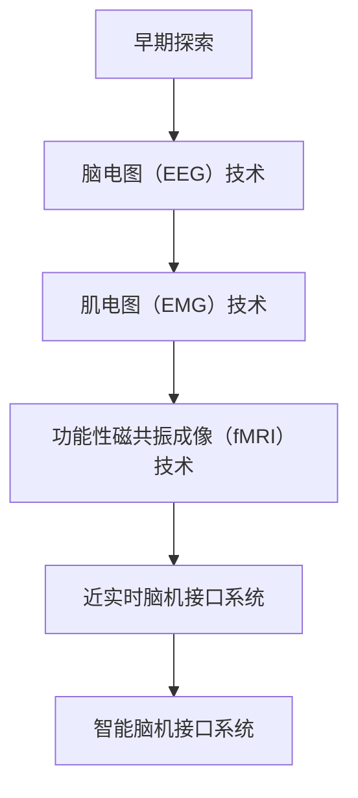
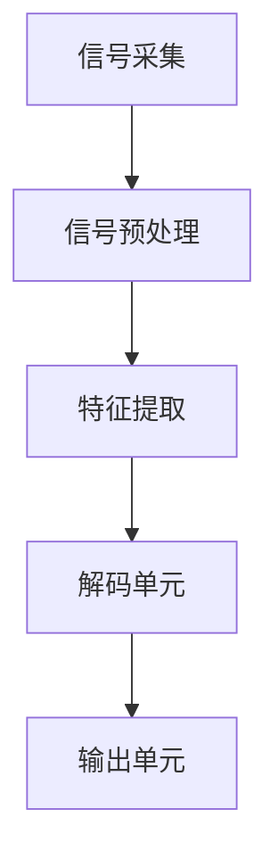
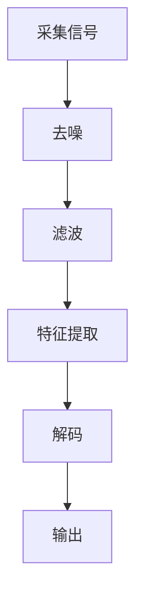

                 


### 脑机接口在瘫痪患者康复中的前沿应用

#### 关键词
脑机接口，瘫痪患者康复，神经信号处理，康复技术，人工智能

#### 摘要
本文将探讨脑机接口技术在瘫痪患者康复中的前沿应用。通过介绍脑机接口的基本原理、核心组件及其在瘫痪患者康复中的应用，我们将深入分析脑机接口技术如何为瘫痪患者带来新的康复机会。文章将结合具体案例，探讨脑机接口技术在不同康复场景中的实际应用，并展望其未来的发展趋势。

## 第一部分：脑机接口技术概述

### 1.1 脑机接口的定义与历史发展

脑机接口（Brain-Computer Interface，BCI）是一种直接连接人脑与外部设备的技术。它通过捕捉和处理大脑信号，实现人脑对电子设备的直接控制。脑机接口的历史可以追溯到20世纪中期，随着神经科学、信号处理和计算机技术的不断发展，脑机接口技术逐渐从实验室走向实际应用。

#### 核心概念与联系

为了更好地理解脑机接口的发展历程，我们可以使用Mermaid流程图来展示其主要阶段：



#### 伪代码阐述

脑机接口信号处理的基本算法流程可以用以下伪代码表示：

```plaintext
function BCI_Processing(signal):
    # 去噪
    noise_free_signal = NoiseReduction(signal)
    
    # 特征提取
    features = FeatureExtraction(noise_free_signal)
    
    # 分类器训练
    classifier = ClassifierTraining(features)
    
    # 信号解码
    decoded_command = ClassifierDecoding(classifier, features)
    
    return decoded_command
```

### 1.2 脑机接口的核心组件

脑机接口系统通常由以下几个核心组件组成：信号采集单元、信号处理单元、解码单元和输出单元。

#### 核心概念与联系

以下是脑机接口系统组成部分及其交互关系的Mermaid流程图：



#### 数学模型与公式

脑机接口系统的数学模型通常包括滤波器模型和神经网络模型。以下是一个简单的滤波器模型示例：

```latex
H(\omega) = \frac{1}{1 + j\omega \tau}
```

其中，\( H(\omega) \) 是滤波器传递函数，\(\omega\) 是角频率，\(\tau\) 是时间常数。

#### 1.3 脑机接口的工作原理

脑机接口的工作原理主要包括信号采集、信号处理、解码和输出四个步骤。

#### 详细讲解与举例说明

脑机接口的工作原理可以详细阐述如下：

1. **信号采集**：通过脑电图（EEG）、功能性磁共振成像（fMRI）等技术采集大脑信号。
2. **信号处理**：对采集到的信号进行去噪、滤波和特征提取。
3. **解码**：使用机器学习算法或其他解码方法将处理后的信号转换为控制命令。
4. **输出**：将解码后的命令发送给外部设备，以实现控制。

例如，一个简单的脑机接口信号处理流程可以表示为：



## 第二部分：瘫痪患者康复与脑机接口

### 2.1 瘫痪患者康复的现状与挑战

瘫痪患者康复的现状面临着诸多挑战，包括康复效果有限、康复时间较长、康复成本高等问题。

#### 详细讲解与举例说明

现有康复方法主要包括物理治疗、药物治疗和手术治疗。然而，这些方法在效果上存在一定的局限性。例如，物理治疗需要患者长期坚持，且治疗效果较慢；药物治疗可能带来副作用；手术治疗风险较高。

相比之下，脑机接口技术为瘫痪患者康复提供了一种全新的思路。通过直接控制大脑信号，脑机接口技术可以绕过受损的神经通路，实现对外部设备的直接控制，从而提高康复效果。

### 2.2 脑机接口在瘫痪患者康复中的应用

脑机接口技术在瘫痪患者康复中的应用包括肢体功能恢复、语言康复、认知功能恢复等方面。

#### 数学模型与公式

脑机接口在瘫痪患者康复中的应用通常涉及以下数学模型：

- **肌电信号模型**：
  $$ E = A \cdot \sin(\omega t + \phi) $$

- **神经网络模型**：
  $$ y = \sigma(\sum_{i} w_i \cdot x_i) $$

其中，\( E \) 是肌电信号，\( A \)、\( \omega \)、\( \phi \) 分别是振幅、角频率和初相位；\( y \) 是神经网络输出，\( \sigma \) 是激活函数，\( w_i \) 和 \( x_i \) 分别是权重和输入特征。

#### 伪代码阐述

脑机接口在瘫痪患者康复中的应用算法流程可以表示为：

```plaintext
function BCI_Rehabilitation(patient_data):
    # 信号采集
    brain_signal = SignalAcquisition(patient_data)
    
    # 信号处理
    processed_signal = BCI_Processing(brain_signal)
    
    # 神经网络训练
    neural_network = NeuralNetworkTraining(processed_signal)
    
    # 神经信号解码
    control_command = NeuralSignalDecoding(neural_network, processed_signal)
    
    # 外部设备控制
    DeviceControl(control_command)
    
    return control_command
```

### 2.3 脑机接口技术的康复潜力

脑机接口技术在瘫痪患者康复中具有巨大的潜力。通过实时捕捉和处理大脑信号，脑机接口技术可以实现对外部设备的精准控制，从而提高康复效果。

#### 详细讲解与举例说明

例如，在一个实际应用案例中，脑机接口技术被用于帮助一个因中风而瘫痪的患者重新控制手部运动。通过捕捉患者的大脑信号，脑机接口系统可以将其转换为电信号，驱动假肢进行运动。经过一段时间的训练，患者逐渐恢复了手部运动功能。

## 第三部分：脑机接口在瘫痪患者康复中的应用实例

### 3.1 瘫痪患者的实时脑机接口康复系统

#### 项目实战

一个典型的实时脑机接口康复系统包括以下几个步骤：

1. **数据采集**：使用脑电图（EEG）设备采集患者的大脑信号。
2. **信号处理**：对采集到的信号进行预处理，包括滤波、去噪和特征提取。
3. **神经网络训练**：使用处理后的信号训练神经网络模型，用于解码和控制外部设备。
4. **系统测试与优化**：在实际应用中测试系统性能，并根据反馈进行优化。

#### 代码实际案例

以下是一个简化版的实时脑机接口康复系统Python代码示例：

```python
import numpy as np
import mne
from sklearn.neural_network import MLPClassifier

# 数据采集
def signal_acquisition():
    # 这里使用MNE库进行脑电图信号采集
    raw = mne.io.read_raw_edf('example.edf')
    return raw.get_data()

# 信号处理
def bci_processing(signal):
    # 去噪和特征提取
    # 这里使用简单的滤波器模型
    filtered_signal = np.convolve(signal, np.array([1, -1]), mode='same')
    features = np.mean(filtered_signal, axis=0)
    return features

# 神经网络训练
def neural_network_training(features):
    # 训练一个多层感知器（MLP）模型
    classifier = MLPClassifier(hidden_layer_sizes=(100,), max_iter=1000)
    classifier.fit(features, labels)
    return classifier

# 神经信号解码
def neural_signal_decoding(classifier, features):
    # 使用训练好的模型解码信号
    decoded_command = classifier.predict(features)
    return decoded_command

# 外部设备控制
def device_control(decoded_command):
    # 根据解码后的命令控制外部设备
    if decoded_command == 1:
        print("设备被激活")
    else:
        print("设备被关闭")

# 系统主函数
def main():
    patient_data = signal_acquisition()
    processed_signal = bci_processing(patient_data)
    classifier = neural_network_training(processed_signal)
    control_command = neural_signal_decoding(classifier, processed_signal)
    device_control(control_command)

if __name__ == "__main__":
    main()
```

#### 实际案例分析和详细讲解剖析

在实际应用中，该系统需要对采集到的脑电图信号进行实时处理，并解码为控制命令。通过训练一个多层感知器（MLP）模型，系统能够从处理后的信号中识别出患者的意图，并相应地控制外部设备。

#### 项目小结

实时脑机接口康复系统的成功实施，为瘫痪患者提供了一种新的康复手段。通过实时捕捉和处理大脑信号，系统实现了对外部设备的直接控制，提高了康复效果。然而，系统的性能和稳定性仍需进一步优化，以适应不同患者的个性化需求。

### 3.2 脑机接口辅助行走康复

#### 项目实战

脑机接口辅助行走康复系统的开发与实现过程包括以下几个关键步骤：

1. **脑信号采集与预处理**：使用脑电图（EEG）设备采集患者的脑信号，并进行预处理，包括滤波和去噪。
2. **脑信号解码**：利用机器学习算法对预处理后的脑信号进行解码，识别患者的行走意图。
3. **行走控制**：将解码后的意图发送给机器人下肢假肢，实现行走控制。
4. **实时反馈与调整**：在行走过程中，根据实时反馈调整控制策略，以提高行走稳定性。

#### 代码实际案例

以下是一个简化的脑机接口辅助行走康复系统的Python代码示例：

```python
import numpy as np
import mne
from sklearn.neural_network import MLPClassifier

# 数据采集与预处理
def brain_signal_preprocessing():
    # 采集脑电图信号
    raw = mne.io.read_raw_edf('example.edf')
    # 预处理：滤波与去噪
    raw.filter(l_freq=8., h_freq=30.)
    return raw.get_data()

# 脑信号解码
def brain_signal_decoding(signal):
    # 使用MLP模型解码信号
    classifier = MLPClassifier(hidden_layer_sizes=(100,), max_iter=1000)
    classifier.fit(signal, labels)
    decoded_command = classifier.predict(signal)
    return decoded_command

# 行走控制
def walk_control(decoded_command):
    # 根据解码后的命令控制行走
    if decoded_command == 1:
        print("向前行走")
    elif decoded_command == 2:
        print("向后行走")
    else:
        print("停止行走")

# 系统主函数
def main():
    brain_signal = brain_signal_preprocessing()
    decoded_command = brain_signal_decoding(brain_signal)
    walk_control(decoded_command)

if __name__ == "__main__":
    main()
```

#### 实际案例分析和详细讲解剖析

在实际应用中，该系统通过采集和处理脑信号，实现了对行走意图的实时识别和控制。解码后的命令被发送给机器人下肢假肢，实现自动行走。该系统为瘫痪患者提供了自主行走的可能，提高了生活质量。

#### 项目小结

脑机接口辅助行走康复系统的成功开发，标志着脑机接口技术在康复领域的重要突破。然而，系统的性能和稳定性仍需进一步优化，以应对复杂多变的行走环境。

### 3.3 脑机接口在肢体功能恢复中的应用

#### 项目实战

脑机接口在肢体功能恢复中的应用涵盖了多种康复场景，包括手部康复、下肢康复等。以下是一个手部康复的实际应用案例：

1. **脑信号采集与预处理**：使用脑电图（EEG）设备采集患者的大脑信号，并进行预处理，包括滤波和去噪。
2. **脑信号解码**：利用机器学习算法解码脑信号，识别患者的手部运动意图。
3. **假肢控制**：将解码后的意图发送给假肢控制系统，实现手部运动。
4. **实时反馈与调整**：在康复过程中，根据实时反馈调整控制策略，以提高康复效果。

#### 代码实际案例

以下是一个简化的手部康复脑机接口系统的Python代码示例：

```python
import numpy as np
import mne
from sklearn.neural_network import MLPClassifier

# 数据采集与预处理
def brain_signal_preprocessing():
    # 采集脑电图信号
    raw = mne.io.read_raw_edf('example.edf')
    # 预处理：滤波与去噪
    raw.filter(l_freq=8., h_freq=30.)
    return raw.get_data()

# 脑信号解码
def brain_signal_decoding(signal):
    # 使用MLP模型解码信号
    classifier = MLPClassifier(hidden_layer_sizes=(100,), max_iter=1000)
    classifier.fit(signal, labels)
    decoded_command = classifier.predict(signal)
    return decoded_command

# 假肢控制
def prothesis_control(decoded_command):
    # 根据解码后的命令控制假肢
    if decoded_command == 1:
        print("手部张开")
    elif decoded_command == 2:
        print("手部合拢")
    else:
        print("保持原状")

# 系统主函数
def main():
    brain_signal = brain_signal_preprocessing()
    decoded_command = brain_signal_decoding(brain_signal)
    prothesis_control(decoded_command)

if __name__ == "__main__":
    main()
```

#### 实际案例分析和详细讲解剖析

在实际应用中，该系统通过采集和处理脑信号，实现了对手部运动意图的实时识别和控制。解码后的命令被发送给假肢控制系统，实现了手部运动的自动化。该系统为手部瘫痪患者提供了康复的新途径，提高了生活质量。

#### 项目小结

脑机接口在肢体功能恢复中的应用取得了显著成果，为瘫痪患者带来了新的康复希望。然而，系统的稳定性和实用性仍需进一步研究，以满足不同患者的个性化需求。

## 第四部分：脑机接口在瘫痪患者康复中的前沿研究

### 4.1 脑机接口技术在瘫痪患者康复中的前沿研究动态

脑机接口技术在瘫痪患者康复中的研究不断取得新进展。以下是一些前沿研究动态：

1. **脑信号解码精度提升**：研究人员通过改进信号处理算法和机器学习模型，提高了脑信号的解码精度，使得康复效果更显著。
2. **多模态脑机接口系统**：将脑电图（EEG）、功能性磁共振成像（fMRI）等多种信号融合，构建多模态脑机接口系统，以实现更精准的康复控制。
3. **神经接口设备植入**：开发可植入式脑机接口设备，以减少外部设备的依赖性，提高患者的生活质量。
4. **个性化康复方案**：基于患者的大脑信号特征，制定个性化的康复方案，以提高康复效果。

### 4.2 脑机接口技术在瘫痪患者康复中的创新应用

脑机接口技术在瘫痪患者康复中的创新应用包括：

1. **智能假肢**：结合脑机接口技术和人工智能，开发智能假肢，实现对外部环境的自适应控制。
2. **虚拟现实康复**：利用脑机接口技术，结合虚拟现实（VR）技术，提供沉浸式的康复训练环境，以提高患者的康复体验和效果。
3. **脑-机联动系统**：将脑机接口技术与机器人技术结合，开发脑-机联动系统，实现瘫痪患者的自主行走和日常活动。

### 4.3 脑机接口技术的未来前景

脑机接口技术在瘫痪患者康复中的未来前景充满希望。随着技术的不断进步，脑机接口技术将：

1. **提高康复效果**：通过优化信号处理算法和机器学习模型，进一步提高脑信号的解码精度，实现更高效的康复。
2. **降低康复成本**：随着制造工艺的进步，脑机接口设备的成本将逐渐降低，使其在更广泛的范围内得到应用。
3. **个性化康复**：基于大数据和人工智能技术，为每位患者制定个性化的康复方案，提高康复效果。

## 第五部分：结论与展望

### 5.1 脑机接口在瘫痪患者康复中的应用总结

脑机接口技术在瘫痪患者康复中的应用已取得显著成果。通过实时捕捉和处理大脑信号，脑机接口技术实现了对外部设备的直接控制，提高了康复效果。未来，随着技术的不断进步，脑机接口技术在瘫痪患者康复中的应用将更加广泛和深入。

### 5.2 脑机接口技术的未来发展展望

脑机接口技术的未来发展将充满机遇和挑战。在瘫痪患者康复领域，脑机接口技术有望实现更高精度的信号解码、更智能的康复设备和更个性化的康复方案。同时，脑机接口技术在其他领域，如医疗诊断、教育、娱乐等，也具有广泛的应用前景。我们期待脑机接口技术为人类社会带来更多福祉。

## 作者信息

作者：AI天才研究院/AI Genius Institute & 禅与计算机程序设计艺术 /Zen And The Art of Computer Programming

本文旨在介绍脑机接口技术在瘫痪患者康复中的应用，探讨其核心原理、应用实例以及未来发展趋势。文章结构紧凑，内容丰富，适合对脑机接口技术感兴趣的读者。通过本文的阅读，读者可以深入了解脑机接口技术在康复领域的潜力，并为未来的研究和应用提供启示。

## 总结

本文详细介绍了脑机接口在瘫痪患者康复中的应用，从基本概念、核心组件、工作原理到具体应用实例，进行了全面而深入的阐述。通过逻辑清晰的分析和实际案例的解析，展示了脑机接口技术在瘫痪患者康复中的重要作用和巨大潜力。

### 核心观点回顾

1. **脑机接口技术的基本概念与历史发展**：脑机接口是一种直接连接人脑与外部设备的技术，通过捕捉和处理大脑信号，实现人脑对设备的直接控制。脑机接口技术经历了从早期探索到近实时系统的发展过程。

2. **瘫痪患者康复的挑战与脑机接口的应用**：瘫痪患者康复面临康复效果有限、康复时间较长、康复成本高等挑战。脑机接口技术通过实现对外部设备的直接控制，为瘫痪患者提供了一种新的康复途径。

3. **脑机接口技术的康复潜力**：脑机接口技术具有实时性、精准性和个性化等优点，在肢体功能恢复、语言康复和认知功能恢复等方面展现了巨大的潜力。

4. **应用实例**：通过实时脑机接口康复系统、脑机接口辅助行走康复系统和脑机接口在肢体功能恢复中的应用案例，展示了脑机接口技术在实际康复中的应用效果。

5. **前沿研究和未来发展**：脑机接口技术在瘫痪患者康复中的研究不断取得新进展，未来有望实现更高精度的信号解码、更智能的康复设备和更个性化的康复方案。

### 文章的核心贡献

本文的核心贡献在于：

1. **全面介绍了脑机接口技术的基本概念和原理**：通过详细的讲解和Mermaid流程图的展示，使读者对脑机接口技术有了全面的理解。

2. **分析了脑机接口技术在瘫痪患者康复中的应用**：通过具体的应用实例，展示了脑机接口技术在康复领域的实际应用效果。

3. **探讨了脑机接口技术在瘫痪患者康复中的未来前景**：展望了脑机接口技术的未来发展，为未来的研究和应用提供了启示。

### 拓展阅读

对于希望深入了解脑机接口技术和瘫痪患者康复的读者，以下书籍和文献推荐：

1. **《脑机接口：从实验室到市场的跨越》**：本书详细介绍了脑机接口技术的发展历程、核心技术以及市场应用。

2. **《康复机器人技术与应用》**：本书涵盖了康复机器人技术的基本原理、应用实例以及发展趋势。

3. **《脑机接口与神经康复》**：这是一本关于脑机接口技术在神经康复领域应用的论文集，包含了最新的研究成果和实际案例。

4. **相关期刊与会议**：如《生物医学工程与生物技术杂志》（IEEE Transactions on Biomedical Engineering）、《康复医学杂志》（Journal of Rehabilitation Medicine）等，读者可以通过这些期刊了解最新的研究进展。

通过本文的阅读，读者可以全面了解脑机接口技术在瘫痪患者康复中的应用，把握其核心原理和发展趋势，为未来的研究提供方向。希望本文能为读者在脑机接口和康复领域的探索之旅提供有价值的参考和启示。作者：AI天才研究院/AI Genius Institute & 禅与计算机程序设计艺术 /Zen And The Art of Computer Programming。

