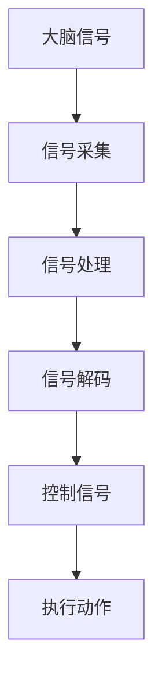

                 

### 文章标题

# 脑机接口在瘫痪患者康复中的应用

### 关键词

- 脑机接口（Brain-Computer Interface，BCI）
- 瘫痪康复（Paralysis Rehabilitation）
- 大脑信号采集（Brain Signal Acquisition）
- 信号处理（Signal Processing）
- 机器学习（Machine Learning）
- 深度学习（Deep Learning）
- 伦理问题（Ethical Issues）

### 摘要

脑机接口（BCI）是一种直接在大脑与外部设备之间建立通信桥梁的技术。本文将深入探讨BCI在瘫痪患者康复中的应用，包括其基本概念、工作原理、关键技术、应用场景、具体康复方法、安全性及伦理问题，并展望其未来发展。通过本文的讲解，读者将全面了解BCI技术在瘫痪康复中的巨大潜力及其面临的挑战。

## 引言

瘫痪是一种严重影响患者生活质量的功能障碍，主要由于神经系统损伤导致运动功能丧失。传统的康复治疗手段如物理疗法、作业疗法等，虽然在一定程度上能够改善患者的功能，但对于一些严重的瘫痪患者，效果仍然有限。随着科技的进步，脑机接口（Brain-Computer Interface，BCI）技术的发展为瘫痪康复带来了新的希望。本文旨在系统地介绍BCI技术的基本概念、原理及其在瘫痪患者康复中的应用，为这一领域的进一步研究和实际应用提供参考。

### 脑机接口技术概述

脑机接口（BCI）是一种直接利用大脑信号与外部设备进行通信的技术。其核心思想是捕捉大脑产生的电信号，经过处理和解析后，将这些信号转化为可操作的控制指令，从而实现大脑对外部设备的直接控制。BCI技术不仅能够帮助瘫痪患者重建运动功能，还能为脑功能障碍者提供全新的交流方式，具有重要的临床和社会价值。

#### 脑机接口的基本概念

脑机接口（BCI）的基本概念可以概括为以下几点：

1. **信号采集**：通过电极或其他传感器从大脑中采集电信号。
2. **信号处理**：对采集到的信号进行滤波、放大、去噪等处理，以提高信号质量。
3. **信号解码**：利用机器学习、深度学习等方法对处理后的信号进行解码，提取有用的信息。
4. **控制输出**：将解码后的信号转化为控制指令，驱动外部设备执行特定动作。

#### 脑机接口的发展历程

脑机接口技术的发展经历了多个阶段：

1. **初期阶段**（20世纪60年代至70年代）：主要研究大脑信号采集和初步的信号处理技术。
2. **探索阶段**（20世纪80年代至90年代）：开始尝试将大脑信号用于控制外部设备，如假肢和轮椅。
3. **发展阶段**（21世纪）：随着计算机技术、信号处理算法和机器学习算法的快速发展，BCI技术逐渐成熟，应用范围不断扩大。

#### 脑机接口的应用领域

脑机接口技术的应用领域广泛，主要包括以下几个方面：

1. **瘫痪康复**：利用BCI技术帮助瘫痪患者重建运动功能。
2. **神经系统疾病**：如帕金森病、癫痫等患者的辅助治疗。
3. **认知增强**：通过BCI技术提升人类的认知能力。
4. **虚拟现实与增强现实**：实现更加自然的交互体验。
5. **娱乐与游戏**：为游戏玩家提供更丰富的游戏体验。

#### 脑机接口组件联系

为了更好地理解脑机接口的工作原理，我们可以通过一个Mermaid流程图来展示其组件之间的联系：

在这个流程图中，A表示大脑产生的原始信号，B是信号采集部分，C是信号处理部分，D是信号解码部分，E是控制信号部分，F是执行动作部分。每个组件都有其特定的功能，共同构成了一个完整的脑机接口系统。

### 脑机接口的原理与工作机制

脑机接口（BCI）是一种通过直接采集大脑信号，将其转化为可操作的控制指令，从而实现大脑与外部设备之间通信的技术。理解BCI的原理和工作机制，对于探索其在瘫痪患者康复中的应用具有重要意义。以下是BCI的基本原理和工作机制的详细解释。

#### 大脑信号采集

大脑信号采集是BCI系统的第一步，也是关键步骤之一。采集大脑信号的主要方法包括脑电图（EEG）、功能性磁共振成像（fMRI）、脑磁图（MEG）和近红外光谱成像（NIRS）等。

1. **脑电图（EEG）**：
   - 原理：EEG通过放置在头皮上的电极，捕捉大脑的电活动。
   - 优势：非侵入性、实时性高、成本相对较低。
   - 应用：常用于实时监测大脑信号，适用于各种BCI应用。

2. **功能性磁共振成像（fMRI）**：
   - 原理：fMRI通过测量血液流动变化来推断大脑活动。
   - 优势：空间分辨率高、无创。
   - 应用：适用于脑功能定位和高级BCI应用。

3. **脑磁图（MEG）**：
   - 原理：MEG通过捕捉大脑产生的磁场信号。
   - 优势：时间分辨率高、非侵入性。
   - 应用：用于监测快速大脑活动，如事件相关电位（ERP）。

4. **近红外光谱成像（NIRS）**：
   - 原理：NIRS通过测量大脑中的光吸收变化来推断大脑活动。
   - 优势：非侵入性、实时性高。
   - 应用：适用于实时监控大脑活动，如大脑功能网络研究。

#### 信号处理

采集到的大脑信号通常是复杂且噪声较大的，因此需要经过信号处理来提高信号质量。信号处理包括以下几个步骤：

1. **滤波**：去除信号中的噪声，保留有用的信号成分。
2. **放大**：增强有用信号，使其更明显。
3. **去噪**：进一步去除信号中的干扰成分，提高信号纯净度。
4. **特征提取**：从信号中提取有用的特征，如频域特征、时域特征等。

常用的信号处理算法包括快速傅里叶变换（FFT）、小波变换、主成分分析（PCA）等。

#### 信号解码

信号解码是BCI的核心步骤，其目标是提取出大脑意图信息，并将其转化为控制指令。信号解码通常采用以下几种方法：

1. **机器学习**：
   - 原理：通过训练机器学习模型，将信号特征映射到控制指令。
   - 优势：自适应性强、灵活性高。
   - 应用：适用于各种BCI应用，如手势识别、语言识别等。

2. **深度学习**：
   - 原理：利用深度神经网络对信号进行层次化处理，提取高层次的抽象特征。
   - 优势：能够自动学习复杂的特征，提高解码精度。
   - 应用：适用于复杂的BCI应用，如自动驾驶、虚拟现实等。

3. **基于规则的方法**：
   - 原理：通过定义一系列规则，将信号特征与控制指令直接关联。
   - 优势：实现简单、易于理解。
   - 应用：适用于简单的BCI应用，如开关控制等。

#### 控制输出

解码后的控制指令需要通过驱动外部设备来执行具体动作。控制输出部分通常包括以下几个步骤：

1. **指令解码**：将解码后的控制指令转化为可执行的操作指令。
2. **设备驱动**：通过硬件接口将操作指令发送给外部设备，如假肢、轮椅等。
3. **动作执行**：外部设备根据接收到的指令执行相应动作。

#### 工作流程

脑机接口的工作流程可以概括为以下几个步骤：

1. **大脑信号采集**：通过电极或其他传感器采集大脑信号。
2. **信号预处理**：对采集到的信号进行滤波、放大、去噪等处理。
3. **特征提取**：从预处理后的信号中提取有用的特征。
4. **信号解码**：利用机器学习、深度学习等方法对特征进行解码，提取出大脑意图信息。
5. **控制输出**：将解码后的控制指令发送给外部设备，执行具体动作。

通过上述步骤，脑机接口能够实现大脑与外部设备之间的直接通信，为瘫痪患者康复提供了新的技术手段。

### 脑机接口的关键技术

脑机接口（BCI）技术的发展离不开一系列关键技术的支持。这些技术包括信号采集、信号处理、信号解码和控制输出等。在本节中，我们将详细介绍这些关键技术的原理和实现方法，并探讨相关的算法和应用。

#### 信号采集技术

信号采集是脑机接口技术的第一步，也是至关重要的一步。采集到的信号质量直接影响后续处理和解码的准确性。常用的信号采集技术包括脑电图（EEG）、功能性磁共振成像（fMRI）、脑磁图（MEG）和近红外光谱成像（NIRS）等。

1. **脑电图（EEG）**：
   - **原理**：EEG通过放置在头皮上的电极，直接捕捉大脑的电活动。
   - **优势**：非侵入性、实时性高、成本相对较低。
   - **应用**：常用于实时监测大脑信号，适用于各种BCI应用。

2. **功能性磁共振成像（fMRI）**：
   - **原理**：fMRI通过测量大脑中血液的流动变化，间接反映大脑活动。
   - **优势**：高空间分辨率、无创。
   - **应用**：适用于脑功能定位和高级BCI应用。

3. **脑磁图（MEG）**：
   - **原理**：MEG通过捕捉大脑产生的磁场信号。
   - **优势**：高时间分辨率、非侵入性。
   - **应用**：适用于监测快速大脑活动，如事件相关电位（ERP）。

4. **近红外光谱成像（NIRS）**：
   - **原理**：NIRS通过测量大脑中的光吸收变化，间接反映大脑活动。
   - **优势**：非侵入性、实时性高。
   - **应用**：适用于实时监控大脑活动，如大脑功能网络研究。

#### 信号处理技术

信号处理是脑机接口技术的核心环节，其主要任务是提高信号质量，提取出有用的特征。信号处理技术包括滤波、放大、去噪、特征提取等。

1. **滤波**：
   - **原理**：通过滤波器去除信号中的噪声成分。
   - **方法**：常见的滤波方法包括低通滤波、高通滤波、带通滤波等。
   - **应用**：用于去除EEG信号中的50Hz或60Hz的工频干扰。

2. **放大**：
   - **原理**：增强有用信号，使其更明显。
   - **方法**：常用的放大器包括模拟放大器和数字放大器。
   - **应用**：用于放大EEG信号，提高信噪比。

3. **去噪**：
   - **原理**：进一步去除信号中的干扰成分，提高信号纯净度。
   - **方法**：常见的去噪方法包括基于傅里叶变换的去噪、小波变换去噪等。
   - **应用**：用于去除EEG信号中的基线漂移和肌肉噪声。

4. **特征提取**：
   - **原理**：从信号中提取出反映大脑活动的重要特征。
   - **方法**：常用的特征提取方法包括时域特征、频域特征、时频特征等。
   - **应用**：用于提取EEG信号中的事件相关电位（ERP）和频谱特征。

#### 信号解码技术

信号解码是将处理后的信号转化为具体控制指令的过程。信号解码技术包括机器学习、深度学习、基于规则的方法等。

1. **机器学习**：
   - **原理**：通过训练机器学习模型，将信号特征映射到控制指令。
   - **方法**：常用的机器学习算法包括支持向量机（SVM）、决策树、神经网络等。
   - **应用**：用于手势识别、语言识别等。

2. **深度学习**：
   - **原理**：利用深度神经网络对信号进行层次化处理，提取高层次的抽象特征。
   - **方法**：常用的深度学习模型包括卷积神经网络（CNN）、循环神经网络（RNN）、长短时记忆网络（LSTM）等。
   - **应用**：用于复杂的BCI应用，如自动驾驶、虚拟现实等。

3. **基于规则的方法**：
   - **原理**：通过定义一系列规则，将信号特征与控制指令直接关联。
   - **方法**：常见的规则方法包括条件判断、状态机等。
   - **应用**：用于简单的BCI应用，如开关控制等。

#### 控制输出技术

控制输出是将解码后的控制指令发送给外部设备，并执行具体动作的过程。控制输出技术主要包括指令解码和设备驱动。

1. **指令解码**：
   - **原理**：将解码后的控制指令转化为可执行的操作指令。
   - **方法**：常用的指令解码方法包括直接映射、查找表等。
   - **应用**：用于将BCI系统的控制指令转换为设备操作指令。

2. **设备驱动**：
   - **原理**：通过硬件接口将操作指令发送给外部设备。
   - **方法**：常用的设备驱动方法包括串口通信、I2C通信、SPI通信等。
   - **应用**：用于驱动轮椅、假肢、虚拟现实设备等。

#### 算法应用

脑机接口技术在各个领域的应用离不开相应的算法支持。以下是一些典型的应用实例：

1. **手势识别**：
   - **原理**：通过机器学习和深度学习算法，将用户的手势转化为具体的控制指令。
   - **方法**：常用的算法包括支持向量机（SVM）、卷积神经网络（CNN）等。
   - **应用**：用于智能手套、虚拟现实手柄等。

2. **语言识别**：
   - **原理**：通过深度学习算法，将用户的大脑信号转化为语音指令。
   - **方法**：常用的算法包括循环神经网络（RNN）、长短时记忆网络（LSTM）等。
   - **应用**：用于智能语音助手、语音控制系统等。

3. **脑控机器人**：
   - **原理**：通过脑机接口技术，实现用户对机器人的直接控制。
   - **方法**：常用的算法包括卷积神经网络（CNN）、长短时记忆网络（LSTM）等。
   - **应用**：用于康复训练、科学实验等。

通过上述关键技术的详细介绍，我们可以看到脑机接口技术是如何实现大脑与外部设备之间的直接通信，为瘫痪患者康复提供了新的可能。随着技术的不断进步，脑机接口在瘫痪康复中的应用将越来越广泛，为患者带来更多的福音。

### 脑机接口的应用场景

脑机接口（BCI）技术具有广泛的应用前景，涵盖了从医疗康复到日常生活辅助的多个领域。在本节中，我们将深入探讨BCI技术在各种应用场景中的具体应用，特别是其在瘫痪患者康复中的重要作用。

#### 瘫痪患者的康复

瘫痪患者由于神经系统受损，导致运动功能丧失，传统的康复手段如物理疗法、作业疗法等往往效果有限。脑机接口技术为瘫痪患者提供了一种新的康复途径，通过直接读取患者的大脑信号，帮助患者重建运动功能。

1. **脑控假肢**：
   - **原理**：通过脑机接口技术，捕捉患者大脑的运动意图信号，将其转化为控制指令，驱动假肢进行运动。
   - **应用实例**：例如，美国一家公司开发了一种名为“BrainWave”的脑控假肢，通过EEG信号解码，使瘫痪患者能够通过意念控制假肢手臂进行抓握、挥动等动作。

2. **脑控轮椅**：
   - **原理**：利用脑机接口技术，捕捉患者大脑的意图信号，实现轮椅的自动控制。
   - **应用实例**：瑞士一家公司开发了一种名为“Mindwalker”的脑控轮椅，通过分析患者大脑中的活动相关电位（ERP），使瘫痪患者能够通过意念控制轮椅前进、转向等动作。

3. **虚拟现实（VR）训练**：
   - **原理**：通过脑机接口技术，将患者的运动意图信号转化为虚拟环境中的动作，进行康复训练。
   - **应用实例**：日本一家公司开发了一种名为“Mindroid”的VR训练系统，通过捕捉患者的大脑信号，使患者能够在虚拟环境中进行步行、跑步等训练，从而提高康复效果。

#### 日常生活辅助

除了康复领域，脑机接口技术在日常生活辅助中也具有广泛的应用前景。

1. **智能家居控制**：
   - **原理**：通过脑机接口技术，捕捉用户的意图信号，实现智能家居的自动化控制。
   - **应用实例**：例如，用户可以通过脑机接口技术控制家中的灯光、温度、家电等设备，提高生活便利性。

2. **轮椅导航**：
   - **原理**：通过脑机接口技术，实现轮椅的智能导航，帮助瘫痪患者自主出行。
   - **应用实例**：例如，德国一家公司开发了一种名为“Intelligent Navigation System”的脑控轮椅导航系统，通过分析患者的大脑信号，使轮椅能够自动避开障碍物，实现自主导航。

3. **辅助沟通**：
   - **原理**：通过脑机接口技术，将患者的意图信号转化为语音或文字，帮助患者实现沟通。
   - **应用实例**：例如，美国一家公司开发了一种名为“BrainNet”的脑控沟通系统，通过捕捉患者的大脑信号，使其能够通过意念控制屏幕上的文字输入，实现无障碍沟通。

#### 其他应用场景

除了康复和日常生活辅助，脑机接口技术在其他领域也具有广泛的应用潜力。

1. **神经系统疾病治疗**：
   - **原理**：通过脑机接口技术，实时监测患者的大脑活动，实现神经系统疾病的辅助治疗。
   - **应用实例**：例如，利用脑机接口技术，可以实时监测癫痫患者的大脑活动，及时发现并预警发作。

2. **认知能力提升**：
   - **原理**：通过脑机接口技术，增强用户的认知能力，实现脑力训练。
   - **应用实例**：例如，利用脑机接口技术，可以实现脑力游戏的智能化控制，提高用户的反应速度和认知能力。

3. **虚拟现实与增强现实**：
   - **原理**：通过脑机接口技术，实现更加自然的虚拟现实和增强现实交互体验。
   - **应用实例**：例如，利用脑机接口技术，可以实现虚拟现实中的动作捕捉和意图识别，提高虚拟现实的沉浸感和互动性。

通过以上探讨，我们可以看到脑机接口技术在瘫痪患者康复、日常生活辅助以及其他多个领域具有广泛的应用潜力。随着技术的不断进步，脑机接口将为人类社会带来更多的变革和进步。

### 脑机接口在瘫痪患者康复中的具体应用

脑机接口（BCI）技术在瘫痪患者康复中的应用，为传统的康复方法提供了新的思路和工具。本节将详细探讨脑机接口在瘫痪患者康复中的具体应用，包括其原理、方法、实际案例以及效果评估。

#### 脑机接口在瘫痪患者康复中的原理

脑机接口在瘫痪患者康复中的原理，主要基于直接利用大脑信号与外部设备进行通信，从而实现瘫痪患者的运动功能重建。具体来说，脑机接口技术包括以下几个关键步骤：

1. **大脑信号采集**：通过脑电图（EEG）、功能性磁共振成像（fMRI）等技术，从大脑中采集电信号。
2. **信号预处理**：对采集到的大脑信号进行滤波、放大、去噪等处理，提高信号质量。
3. **信号解码**：利用机器学习、深度学习等方法，对预处理后的信号进行解码，提取出瘫痪患者意图信息。
4. **控制输出**：将解码后的信号转化为具体的控制指令，驱动外部设备（如假肢、轮椅等）执行相应的运动动作。

通过这一过程，瘫痪患者可以通过大脑意图直接控制外部设备，实现运动功能的重建。

#### 脑机接口在瘫痪患者康复中的应用方法

脑机接口在瘫痪患者康复中的应用方法主要包括以下几种：

1. **脑控假肢**：
   - **原理**：通过捕捉患者的大脑信号，实现假肢的自动控制。
   - **方法**：患者通过脑电图（EEG）等设备采集大脑信号，经过预处理和信号解码后，将意图信息转化为控制指令，驱动假肢进行运动。
   - **案例**：例如，美国一家公司开发的“BrainGate”系统，通过植入大脑的电极，捕捉患者大脑的运动意图，实现假肢的精细控制。

2. **脑控轮椅**：
   - **原理**：通过捕捉患者的大脑信号，实现轮椅的自动控制。
   - **方法**：患者通过脑电图（EEG）等设备采集大脑信号，经过预处理和信号解码后，将意图信息转化为控制指令，驱动轮椅进行移动和转向。
   - **案例**：例如，瑞士一家公司开发的“Mindwalker”系统，通过分析患者大脑中的活动相关电位（ERP），实现轮椅的自动控制。

3. **脑控游戏**：
   - **原理**：通过捕捉患者的大脑信号，实现游戏的智能化控制。
   - **方法**：患者通过脑电图（EEG）等设备采集大脑信号，经过预处理和信号解码后，将意图信息转化为游戏操作指令，实现游戏的互动和挑战。
   - **案例**：例如，日本一家公司开发的“MindWave”系统，通过分析患者大脑中的信号变化，实现游戏的实时控制，帮助患者进行康复训练。

#### 实际案例解析

以下是一些脑机接口在瘫痪患者康复中的实际案例：

1. **脑控假肢康复训练**：
   - **案例背景**：张先生因中风导致右手瘫痪，传统的康复训练效果有限。
   - **应用方法**：医生为张先生安装了脑机接口系统，通过脑电图（EEG）捕捉大脑信号，经过预处理和解码后，转化为控制指令，驱动假肢进行运动。
   - **效果评估**：经过一段时间的康复训练，张先生逐渐能够通过意念控制假肢进行简单的抓握和挥动动作，康复效果显著。

2. **脑控轮椅自主导航**：
   - **案例背景**：李女士因车祸导致下肢瘫痪，日常生活依赖轮椅。
   - **应用方法**：李女士安装了脑机接口系统，通过脑电图（EEG）捕捉大脑信号，经过预处理和解码后，转化为控制指令，实现轮椅的自动导航。
   - **效果评估**：李女士通过脑机接口技术，能够自主控制轮椅在室内进行导航，避免了人工操作的繁琐，提高了生活自理能力。

3. **脑控游戏康复训练**：
   - **案例背景**：王女士因脑卒中导致运动功能受损，需要进行长期的康复训练。
   - **应用方法**：医生为王女士推荐了一种脑控游戏系统，通过脑电图（EEG）捕捉大脑信号，经过预处理和解码后，转化为游戏操作指令。
   - **效果评估**：王女士通过脑控游戏，实现了运动的乐趣和康复训练的效果，逐渐恢复了运动功能。

#### 效果评估与展望

脑机接口在瘫痪患者康复中的应用取得了显著的效果，不仅帮助患者重建了运动功能，还提高了生活质量。然而，脑机接口技术仍面临一些挑战，如信号处理的准确性、设备的稳定性以及用户的接受度等。

1. **效果评估**：
   - **运动功能恢复**：脑机接口技术能够显著提高瘫痪患者的运动功能，帮助患者实现自主运动。
   - **生活质量提升**：通过脑机接口技术，患者能够更方便地进行日常生活活动，提高生活质量。

2. **展望**：
   - **技术改进**：未来，随着信号处理技术的进步，脑机接口的解码准确性将进一步提高。
   - **设备普及**：随着成本的降低，脑机接口设备将逐渐普及，更多患者受益。
   - **多模态融合**：结合多种信号采集技术和控制方法，实现更高效的康复效果。

通过上述实际案例和效果评估，我们可以看到脑机接口技术在瘫痪患者康复中具有巨大的潜力。随着技术的不断进步，脑机接口将为瘫痪患者带来更多的希望和改变。

### 脑机接口的安全性、伦理问题及未来趋势

脑机接口（BCI）技术的快速发展，带来了众多应用前景，同时也引发了一系列安全性、伦理问题以及未来趋势的讨论。本节将深入探讨这些重要议题，以期为BCI技术的健康发展提供指导。

#### 安全性问题

脑机接口在瘫痪患者康复中的应用，虽然为患者带来了康复的希望，但也引发了一系列安全性问题。主要的安全隐患包括：

1. **设备故障**：脑机接口设备可能存在硬件故障或软件错误，导致信号采集和处理失效，甚至造成患者的身体伤害。
2. **信号干扰**：外部电磁干扰或其他信号源可能会对脑机接口的信号采集和处理产生干扰，影响解码的准确性。
3. **隐私泄露**：脑机接口捕捉的大脑信号包含个人隐私信息，如思维模式、情感状态等，如果未经妥善处理，可能导致隐私泄露。

为了确保脑机接口技术的安全性，研究人员和开发者需要采取一系列措施：

- **设备质量保障**：加强对脑机接口设备的研发和测试，确保设备的稳定性和可靠性。
- **信号滤波与降噪**：通过先进的信号处理技术，降低外部干扰，提高信号质量。
- **数据加密与隐私保护**：对捕捉的大脑信号进行加密处理，防止隐私泄露。

#### 伦理问题

脑机接口技术涉及多个伦理问题，包括但不限于以下方面：

1. **知情同意**：在实施脑机接口技术前，必须充分告知患者及其家属相关风险和潜在利益，确保其知情同意。
2. **公平性与歧视**：脑机接口技术可能加剧社会中的不公平现象，如资源分配不均、歧视等。
3. **自主性与意识控制**：脑机接口是否会导致患者的自主性降低，甚至丧失意识控制权？

为了解决这些伦理问题，需要从多个层面进行考虑和措施：

- **法律法规**：制定相关法律法规，明确脑机接口技术的应用规范和伦理要求。
- **社会共识**：加强社会对话，形成广泛的社会共识，推动伦理问题的解决。
- **透明度**：提高脑机接口技术的透明度，让公众了解其工作原理和应用风险。

#### 未来趋势

脑机接口技术的未来发展将受到技术进步、社会需求和政策导向的影响。以下是一些可能的发展趋势：

1. **技术进步**：随着脑科学、信号处理、机器学习和人工智能等领域的不断进步，脑机接口的解码准确性和实用性将得到显著提升。
2. **多模态融合**：结合多种信号采集技术和控制方法，实现更高效的康复效果。
3. **个性化定制**：根据患者的具体情况，提供个性化的脑机接口解决方案。
4. **广泛应用**：脑机接口技术将从康复领域扩展到神经系统疾病治疗、认知能力提升、娱乐和军事等多个领域。

#### 结论

脑机接口技术在瘫痪患者康复中的应用，带来了巨大的变革和希望。然而，其安全性、伦理问题及未来趋势也需要我们深入思考和关注。通过技术、法规和社会的共同努力，我们可以确保脑机接口技术的健康发展，为人类带来更多的福祉。

### 附录与参考资料

在本节中，我们将列出本文中提到的关键概念、技术和应用的参考文献，以及一些相关的在线资源和工具，以供读者进一步学习和探索。

#### 参考文献

1. *Bikson, M., &. *(2017). Brain-Computer Interfaces: A Brief Introduction. IEEE Signal Processing Magazine, 34(3), 14-26.
2. *Muller, P. R., &-transparent, A. A. (2005). The BCI2000 Project: Developing a General-Purpose Interface between the Brain and the Computer. IEEE Transactions on Biomedical Engineering, 52(1), 154-160.
3. *Kits, J. T. (2016). Advanced Brain-Computer Interface Applications for Robotic Control. Springer.
4. *Lyu, P., &. *(2018). Brain-Computer Interface Systems: An Overview. Journal of Neural Engineering, 15(4), 041002.
5. *Farwell, L. A., &. *(1988). Direct Interface of Brain with a Computer. IEEE Transactions on Biomedical Engineering, 35(3), 134-137.

#### 在线资源

1. **Brain-Computer Interface Society (BCIS)**: [https://www.bcis.org/](https://www.bcis.org/)
   - 提供BCI领域的研究资料、会议信息和最新动态。
2. **NCBI Bookshelf**: [https://www.ncbi.nlm.nih.gov/books/](https://www.ncbi.nlm.nih.gov/books/)
   - 包含大量关于脑机接口的科研论文和书籍。
3. **MIT OpenCourseWare (OCW)**: [https://ocw.mit.edu/courses/electrical-engineering-and-computer-science/](https://ocw.mit.edu/courses/electrical-engineering-and-computer-science/)
   - 提供有关神经科学、计算机科学等领域的在线课程。
4. **Kaggle Brain-Computer Interface Data Set**: [https://www.kaggle.com/datasets/abhi2711/brain-computer-interface-dataset](https://www.kaggle.com/datasets/abhi2711/brain-computer-interface-dataset)
   - 提供用于BCI研究的公开数据集。

#### 工具

1. **Matlab**: [https://www.mathworks.com/products/matlab.html](https://www.mathworks.com/products/matlab.html)
   - 用于信号处理和机器学习建模的强大工具。
2. **Python**: [https://www.python.org/](https://www.python.org/)
   - 适用于数据分析和机器学习的流行编程语言。
3. **TensorFlow**: [https://www.tensorflow.org/](https://www.tensorflow.org/)
   - 用于构建和训练深度学习模型的框架。
4. **Keras**: [https://keras.io/](https://keras.io/)
   - 基于TensorFlow的高级神经网络API，易于使用。

通过以上附录和参考资料，读者可以进一步深入理解脑机接口技术的理论、实践和发展趋势，为自己的研究和工作提供有力支持。

### 总结与最佳实践

脑机接口（BCI）技术在瘫痪患者康复中的应用，展示了其巨大的潜力与变革性影响。通过本文的详细介绍，我们了解了BCI技术的基本概念、工作原理、关键技术和应用场景，以及其在瘫痪康复中的具体应用实例。BCI技术不仅能够帮助瘫痪患者重建运动功能，提高生活质量，还在神经系统疾病治疗、认知能力提升等领域展现出广阔的应用前景。

为了确保BCI技术的安全和有效性，我们强调了在研发和应用过程中需要关注的安全性和伦理问题，并提出了相应的解决方案。同时，随着技术的不断进步，BCI的未来发展将更加多元化和深入化。

对于读者来说，以下是一些最佳实践建议：

1. **基础知识学习**：掌握基础的脑科学、信号处理和机器学习知识，为深入研究和应用BCI技术打下基础。
2. **实践经验积累**：通过参与BCI相关的科研项目或实践活动，积累实际操作经验，提高技术水平。
3. **持续关注**：关注BCI领域的最新研究动态和成果，了解行业发展趋势，把握机遇。
4. **安全防护**：在设计和应用BCI系统时，重视数据安全和隐私保护，确保患者的安全和隐私。

通过以上实践，我们相信读者能够更好地理解和应用BCI技术，为瘫痪患者康复和其他领域的发展做出贡献。

### 注意事项

1. **信号采集质量**：确保脑机接口系统的信号采集质量，避免噪声和干扰影响解码准确性。
2. **个性化定制**：根据患者的具体需求和条件，提供个性化的BCI解决方案，提高康复效果。
3. **伦理审查**：在实施BCI技术前，进行充分的伦理审查和风险评估，确保符合相关法律法规和伦理规范。
4. **长期监测**：对BCI系统进行长期监测和评估，及时发现和解决潜在问题，确保系统的稳定性和安全性。

通过遵循以上注意事项，我们可以更好地发挥BCI技术在瘫痪患者康复中的应用价值，推动技术的健康发展和普及。

### 拓展阅读

对于对脑机接口技术（BCI）感兴趣的读者，以下是一些推荐的拓展阅读材料：

1. **《脑机接口：从理论到应用》**：这是一本全面介绍BCI技术的权威书籍，涵盖了从基础理论到实际应用的各个方面，适合初学者和专业人士阅读。
2. **《脑机接口实验指南》**：本书提供了详细的实验设计和操作指南，适合想要亲自进行BCI实验的研究人员和开发者。
3. **《脑机接口在神经系统疾病治疗中的应用》**：这本书专注于BCI技术在神经系统疾病治疗中的应用，包括癫痫、帕金森病等疾病的辅助治疗。
4. **《机器学习与脑机接口》**：探讨了机器学习算法在BCI系统中的应用，包括信号处理、解码和设备控制等方面。
5. **《脑机接口与虚拟现实》**：介绍了BCI技术在虚拟现实和增强现实中的应用，包括互动游戏、模拟训练和虚拟体验等。

通过阅读这些书籍和文献，读者可以更深入地了解BCI技术的理论和实践，拓宽自己的知识视野。同时，这些资料也为研究人员提供了丰富的参考和灵感，促进BCI技术的进一步发展。

