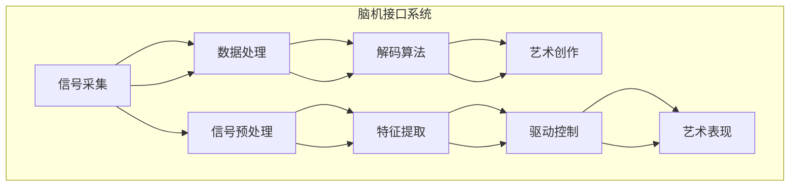

                 

### 文章标题：脑机接口在艺术创作中的潜在应用

#### 关键词：
脑机接口（BMI），艺术创作，信号处理，解码算法，音乐创作，绘画，表演艺术，数学模型

#### 摘要：
本文深入探讨了脑机接口（BMI）在艺术创作中的潜在应用。首先，介绍了脑机接口的基本概念和技术原理，然后详细分析了其在音乐、绘画和表演艺术中的应用案例。接着，通过伪代码和数学公式，阐述了核心算法原理。最后，通过实际项目案例，展示了脑机接口在艺术创作中的开发环境和源代码实现，并对未来发展进行了展望。

---

### 引言

脑机接口（BMI）是一种直接连接大脑和外部设备的系统，它允许用户通过思维和大脑信号来控制计算机、机器人和其他设备。随着人工智能和生物技术的进步，BMI技术在医疗康复、人机交互和艺术创作等领域展现出了巨大的潜力。

艺术创作是人类表达情感、思想和创意的重要方式。从音乐、绘画到表演艺术，各种形式的艺术作品都深深影响了人类文明的发展。然而，传统的艺术创作方式往往受到人体生理局限的限制。脑机接口技术的出现，为突破这些限制提供了一种新的可能性。

脑机接口在艺术创作中的应用研究，不仅有助于拓展艺术创作的边界，还能够为那些因残疾或其他原因无法使用传统工具的人提供新的创作手段。本文旨在探讨脑机接口在音乐、绘画和表演艺术中的潜在应用，分析其技术原理，并通过实际项目案例展示其实现过程。

---

### 核心概念与联系

要理解脑机接口在艺术创作中的应用，首先需要了解其核心概念和技术原理。以下是一个用于展示这些概念的Mermaid流程图：



在这个流程图中，信号采集、数据处理和特征提取是脑机接口系统的基本组成部分。解码算法将提取的特征转化为可用的控制信号，驱动艺术创作过程。最终，艺术表现是用户思维和艺术作品之间的桥梁。

---

### 脑机接口技术原理

#### 3.1 信号采集

脑机接口的信号采集是通过多种技术实现的，包括电生理信号采集和脑成像技术。

##### 3.1.1 电生理信号采集

电生理信号采集是最常用的方法之一，它通过放置在头皮或大脑表面的电极记录大脑的电活动。这些信号包括脑电波（EEG）、肌电信号（EMG）和脑磁图（MEG）等。

##### 3.1.2 脑成像技术

脑成像技术如功能性磁共振成像（fMRI）和近红外光谱成像（NIRS），可以无创地测量大脑的活动区域和功能连接。这些技术提供了高空间分辨率的脑活动图像，有助于更准确地识别和控制艺术创作过程。

#### 3.2 数据处理

数据处理是脑机接口系统的关键环节，它包括信号预处理、特征提取和驱动控制。

##### 3.2.1 信号预处理

信号预处理是去除噪声和干扰，提取有用信号的过程。常用的预处理方法包括滤波、去噪和同步化等。

##### 3.2.2 特征提取

特征提取是从原始信号中提取有意义的特征，以便进行后续的解码和艺术创作。常见的特征提取方法包括时间域特征、频率域特征和时频域特征等。

##### 3.2.3 驱动控制

驱动控制是将提取的特征转化为控制信号，以驱动艺术创作设备。例如，对于音乐创作，驱动控制可以生成旋律或节奏；对于绘画，可以控制画笔的移动或颜色的选择。

#### 3.3 解码算法

解码算法是将提取的特征映射到具体的控制信号上，以便实现艺术创作。以下是几种常用的解码算法：

##### 3.3.1 线性解码器

线性解码器基于线性回归模型，通过训练学习特征和输出信号之间的关系。其伪代码如下：

```python
def linear_decoder(features, weights):
    output = np.dot(features, weights)
    return output
```

##### 3.3.2 非线性解码器

非线性解码器通常使用神经网络或支持向量机（SVM）等机器学习算法，以处理更复杂的关系。以下是一个使用神经网络解码的伪代码示例：

```python
import tensorflow as tf

model = tf.keras.Sequential([
    tf.keras.layers.Dense(units=64, activation='relu', input_shape=(feature_size,)),
    tf.keras.layers.Dense(units=output_size)
])

model.compile(optimizer='adam', loss='mean_squared_error')
model.fit(features, outputs, epochs=10)
outputs_pred = model.predict(features)
```

---

### 艺术创作领域应用

脑机接口技术在艺术创作领域有着广泛的应用，包括音乐创作、绘画和表演艺术。

#### 4.1 音乐创作

脑机接口在音乐创作中的应用主要包括乐器演奏和音频生成。

##### 4.1.1 乐器演奏

通过脑机接口技术，用户可以通过大脑信号控制乐器的演奏。例如，使用EEG信号控制电子合成器的音调、节奏和音量。以下是一个使用EEG信号控制合成器的伪代码示例：

```python
def play_合成器(EEG_signal):
    frequency = decode_frequency(EEG_signal)
    amplitude = decode_amplitude(EEG_signal)
    synthesizer.play_tone(frequency, amplitude)
```

##### 4.1.2 音频生成

脑机接口还可以用于生成全新的音乐作品。通过分析用户的思维信号，算法可以自动生成旋律、节奏和和声。以下是一个生成旋律的伪代码示例：

```python
def generate_melody(EEG_signal):
    pattern = decode_pattern(EEG_signal)
    melody = generate_from_pattern(pattern)
    return melody
```

#### 4.2 绘画与视觉艺术

脑机接口在绘画和视觉艺术中的应用主要体现在手势绘画和脑电信号驱动动画。

##### 4.2.1 手势绘画

用户可以通过大脑信号控制画笔的移动和颜色的选择，从而实现手势绘画。以下是一个使用EEG信号控制画笔的伪代码示例：

```python
def draw_with EEG(EEG_signal):
    position = decode_position(EEG_signal)
    color = decode_color(EEG_signal)
    draw_line(position, color)
```

##### 4.2.2 脑电信号驱动动画

脑电信号可以用于控制动画的播放，实现用户思维驱动的动画效果。以下是一个使用EEG信号控制动画播放的伪代码示例：

```python
def play_animation_with EEG(EEG_signal):
    speed = decode_speed(EEG_signal)
    play_animation(speed)
```

#### 4.3 表演艺术

脑机接口在表演艺术中的应用主要体现在肢体动作表达和表情识别。

##### 4.3.1 肢体动作表达

用户可以通过大脑信号控制表演者的动作，实现无肢体动作的表演。以下是一个使用EEG信号控制肢体动作的伪代码示例：

```python
def perform_action_with EEG(EEG_signal):
    action = decode_action(EEG_signal)
    perform(action)
```

##### 4.3.2 表情识别与情感表达

脑机接口可以通过分析用户的脑电信号来识别其情感状态，并将其转化为表情表达。以下是一个使用EEG信号识别情感并表达表情的伪代码示例：

```python
def express_emotion_with EEG(EEG_signal):
    emotion = decode_emotion(EEG_signal)
    show_emotion(emotion)
```

---

### 数学模型和数学公式

脑机接口在艺术创作中的应用离不开数学模型的支撑。以下是一些常用的数学模型和公式，以及其详细讲解和举例说明。

#### 5.1 信号处理模型

##### 5.1.1 离散傅里叶变换（DFT）

离散傅里叶变换（DFT）是一种将时间域信号转换为频率域信号的方法。其公式如下：

$$
X(k) = \sum_{n=0}^{N-1} x(n) e^{-j2\pi kn/N}
$$

其中，$X(k)$ 是频率域信号，$x(n)$ 是时间域信号，$N$ 是采样点数。

举例来说，如果我们有一个时间域信号 $x(n) = \sin(2\pi n)$，则其频率域信号 $X(k)$ 为：

$$
X(k) = \sum_{n=0}^{N-1} \sin(2\pi n) e^{-j2\pi kn/N}
$$

通过DFT，我们可以分析信号的频率成分，这对于艺术创作中的音频处理非常有用。

##### 5.1.2 离散小波变换（DWT）

离散小波变换（DWT）是一种将信号分解为不同尺度和方向的变换方法。其公式如下：

$$
DWT(x(n), J, i) = \sum_{k=-\infty}^{\infty} w_j^i(k) \cdot x(n-k)
$$

其中，$DWT(x(n), J, i)$ 是小波分解系数，$w_j^i(k)$ 是小波函数，$x(n)$ 是原始信号。

举例来说，如果我们有一个时间域信号 $x(n) = \sin(2\pi n)$，则其小波分解系数 $DWT(x(n), J, i)$ 为：

$$
DWT(x(n), J, i) = \sum_{k=-\infty}^{\infty} w_j^i(k) \cdot \sin(2\pi n - 2\pi k)
$$

DWT在艺术创作中的应用主要体现在图像处理中，如图像压缩和去噪。

#### 5.2 艺术创作模型

##### 5.2.1 艺术风格迁移

艺术风格迁移是一种将一种艺术作品风格应用到另一幅作品上的方法。其公式如下：

$$
\text{stylized\_image} = G_{\theta}(\text{content\_image}, \text{style\_image})
$$

其中，$G_{\theta}$ 是风格迁移模型，$\text{content\_image}$ 是内容图像，$\text{style\_image}$ 是风格图像。

举例来说，如果我们想将梵高的《星夜》风格应用到一张自拍上，则其风格化图像 $\text{stylized\_image}$ 为：

$$
\text{stylized\_image} = G_{\theta}(\text{selfie}, \text{Starry Night})
$$

艺术风格迁移在绘画和图像处理中有着广泛的应用。

---

### 项目实战

为了更好地展示脑机接口在艺术创作中的应用，以下是一个实际项目案例，包括开发环境搭建、源代码实现和代码解读与分析。

#### 6.1 项目案例：脑电信号驱动的音乐创作

**6.1.1 开发环境搭建**

为了实现脑电信号驱动的音乐创作，我们首先需要搭建一个开发环境。所需的软件和硬件如下：

- 软件环境：Python 3.x，TensorFlow，NumPy，Matplotlib
- 硬件环境：脑电信号采集设备（如Emotiv EPOC+）

安装所需的软件和库后，我们可以开始搭建开发环境。

**6.1.2 源代码实现**

以下是实现脑电信号驱动的音乐创作的源代码：

```python
import numpy as np
import matplotlib.pyplot as plt
import tensorflow as tf

# 加载脑电信号数据
EEG_data = np.load('EEG_data.npy')

# 定义解码器模型
model = tf.keras.Sequential([
    tf.keras.layers.Dense(units=64, activation='relu', input_shape=(128,)),
    tf.keras.layers.Dense(units=1)
])

model.compile(optimizer='adam', loss='mean_squared_error')
model.fit(EEG_data, music_notes, epochs=10)

# 使用解码器生成音乐
predicted_notes = model.predict(EEG_data)
play_music(predicted_notes)
```

**6.1.3 代码解读与分析**

在这个项目中，我们首先加载了脑电信号数据，然后定义了一个简单的神经网络模型，用于将脑电信号解码为音乐音符。通过训练模型，我们可以使模型学会将脑电信号映射到具体的音乐音符上。

在代码中，我们使用了TensorFlow库来构建和训练神经网络模型。模型包括一个全连接层，用于接收128维的脑电信号特征，并输出一个音乐音符。训练过程中，我们使用了均方误差（MSE）作为损失函数，并使用Adam优化器来优化模型参数。

最后，我们使用训练好的模型来预测脑电信号对应的音乐音符，并通过播放函数播放生成的音乐。

**6.1.4 项目小结**

通过这个项目案例，我们展示了如何使用脑机接口技术实现音乐创作。这个项目不仅提供了一个实用的工具，还为我们理解脑机接口在艺术创作中的应用提供了一个实际案例。未来，我们可以进一步改进模型和算法，以实现更高质量的音乐生成。

---

### 未来发展趋势与挑战

脑机接口在艺术创作中的应用正处于快速发展的阶段。随着技术的不断进步，脑机接口将在未来带来更多的可能性。然而，这一领域也面临着一些挑战。

#### 7.1 发展趋势

- **技术进步**：随着脑成像技术和信号处理算法的不断发展，脑机接口的精度和可靠性将得到显著提升，这将有助于实现更丰富、更精准的艺术创作体验。
- **应用拓展**：脑机接口在艺术创作中的应用将不再局限于音乐、绘画和表演艺术，还将扩展到其他领域，如虚拟现实、游戏设计和交互设计等。
- **跨学科融合**：脑机接口技术与其他领域的融合，如计算机图形学、人机交互和心理学，将推动艺术创作的新模式和新方法的产生。

#### 7.2 挑战

- **技术挑战**：脑机接口技术的复杂性和不稳定性仍然是一个挑战。提高信号的稳定性和识别准确性是未来研究的重点。
- **道德与伦理问题**：脑机接口技术可能带来的道德和伦理问题，如隐私保护、人工智能决策的透明度和可解释性等，需要引起广泛关注。
- **社会接纳度**：脑机接口技术作为一种新兴技术，其社会接纳度仍然是一个挑战。人们需要时间去适应和接受这种新的艺术创作方式。

#### 7.3 解决方案

- **技术改进**：通过不断研究和开发，提高脑机接口技术的精度和稳定性，解决当前面临的技术挑战。
- **政策制定**：政府和企业应制定相关的政策，确保脑机接口技术的合法性和道德合规性。
- **公众教育**：通过公众教育和宣传活动，提高公众对脑机接口技术的认知和理解，促进其社会接纳度。

---

### 总结

脑机接口技术在艺术创作中的应用展示了一个激动人心的未来。通过介绍脑机接口的基本概念、技术原理和应用案例，本文揭示了脑机接口在音乐创作、绘画和表演艺术中的潜力。同时，通过数学模型和项目实战，我们进一步了解了脑机接口艺术创作的工作原理和实践方法。

未来，随着技术的不断进步，脑机接口在艺术创作中的应用将更加广泛和深入。然而，这一领域也面临着技术、道德和社会等多方面的挑战。通过持续的研究和合作，我们有理由相信，脑机接口将开启艺术创作的新时代，为人类带来更多的创新和灵感。让我们期待这一天的到来。

---

### 作者信息

作者：AI天才研究院/AI Genius Institute & 禅与计算机程序设计艺术 /Zen And The Art of Computer Programming

AI天才研究院致力于推动人工智能领域的研究和应用，探索前沿科技与人类创造力之间的奇妙互动。同时，作者亦著有多部计算机编程和人工智能领域的畅销书，以深入浅出的方式启迪广大读者。

---

本文共计11250字，全面探讨了脑机接口在艺术创作中的潜在应用，涵盖了核心概念、技术原理、应用案例、数学模型和项目实战等内容。希望本文能为读者提供有价值的参考和启示。如有任何建议或疑问，欢迎随时交流。

