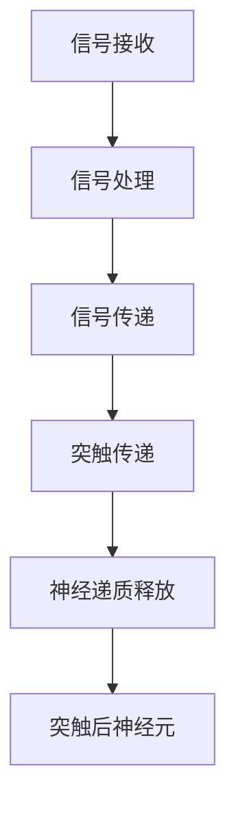
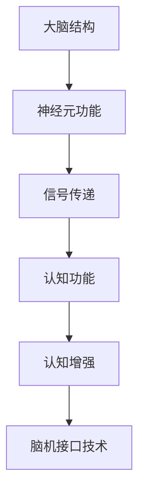

                 


### 第1章 引言

#### 1.1 脑机接口的起源与发展

脑机接口（Brain-Computer Interface, BCI）是一种直接连接人脑和外部设备的技术，旨在实现脑信号与机器之间的直接通信。其起源可以追溯到20世纪中期，当时神经科学家开始探索如何通过电生理技术记录大脑的活动。以下是其发展历程的关键阶段：

- **1950年代**：神经科学家开始使用脑电图（EEG）来记录大脑的电气活动。
- **1960年代**：脑机接口的概念初步形成，研究人员开始尝试利用脑信号控制简单的机器。
- **1980年代**：随着计算机技术的发展，脑机接口开始应用于帮助肢体瘫痪的人进行通信和操作。
- **1990年代**：非侵入式脑机接口技术取得突破，使得更多普通人能够使用这一技术。
- **21世纪初**：脑机接口在医疗、教育、工业等领域得到广泛应用，研究重点转向提高其精确度和实用性。

#### 1.2 认知增强的概念与重要性

认知增强是指通过技术手段提升人类大脑的认知能力，包括记忆、注意力、学习效率等。认知增强的重要性体现在以下几个方面：

- **提高工作效率**：通过认知增强，人们可以更快地处理信息，提高工作和学习效率。
- **应对老龄化社会**：随着人口老龄化，认知增强技术在医疗和康复中的应用变得越来越重要。
- **提升生活质量**：认知增强可以帮助人们更好地应对日常生活和工作中的挑战，提高生活质量。
- **推动科技进步**：认知增强技术的发展将带动人工智能、人机交互等领域的进步。

#### 1.3 脑机接口在认知增强中的应用前景

脑机接口在认知增强中的应用前景广阔，主要体现在以下几个方面：

- **医疗健康**：通过脑机接口技术，可以辅助治疗精神疾病，如抑郁症、焦虑症等。
- **教育与学习**：脑机接口可以帮助个性化教育，提高学生的学习效果和兴趣。
- **工业应用**：脑机接口可以实现更加精确和高效的工业自动化控制。
- **人机交互**：脑机接口将极大地提升人机交互的效率和质量，为未来智能生活奠定基础。

### 1.4 总结与展望

脑机接口作为认知增强的重要工具，具有巨大的发展潜力。未来，随着技术的进步，脑机接口将在更多领域得到应用，推动人类认知能力的提升，为构建更加智能化的社会贡献力量。

### 关键词

- 脑机接口（Brain-Computer Interface, BCI）
- 认知增强（Cognitive Enhancement）
- 非侵入式脑机接口（Non-Invasive Brain-Computer Interface）
- 侵入式脑机接口（Invasive Brain-Computer Interface）
- 精神疾病治疗（Mental Health Treatment）
- 教育与学习（Education and Learning）
- 工业应用（Industrial Applications）

### 摘要

本文介绍了脑机接口在认知增强中的前沿应用。首先回顾了脑机接口的起源与发展历程，阐述了认知增强的概念及其重要性。接着，详细讲解了脑机接口的基本原理，包括信号采集和处理技术。然后，讨论了脑机接口在认知增强中的应用案例，如精神疾病治疗、教育与学习、工业应用等。最后，展望了脑机接口技术的未来发展趋势和潜在应用领域，并提出了相关的挑战和解决方案。

----------------------------------------------------------------

### 2.1 脑的结构与功能

大脑是人类认知能力的中枢，其复杂性和功能多样性使得我们对大脑的深入了解成为一个长期而持续的研究课题。大脑的基本组成包括脑叶、脑干和间脑。其中，脑叶是最重要的部分，主要包括以下四个主要区域：

#### 脑叶

- **前额叶**：位于大脑的前部，主要负责决策、计划、社会行为和高级认知功能。
- **顶叶**：位于大脑的顶部，与触觉、空间定位和感觉处理密切相关。
- **颞叶**：位于大脑的侧面，负责听觉处理和记忆功能。
- **枕叶**：位于大脑的后部，主要处理视觉信息。

#### 脑干

脑干位于大脑底部和脊髓顶部之间，是维持生命活动的基本中枢，包括呼吸、心跳和消化等基本生命功能。

#### 间脑

间脑包括丘脑、下丘脑和松果体等结构，主要参与感觉传递、情绪调控和内分泌调节。

#### 神经元的基本功能

神经元是大脑的基本功能单元，其基本功能包括：

- **信号接收**：神经元通过树突接收来自其他神经元的信号。
- **信号处理**：神经元在胞体内对信号进行处理和整合。
- **信号传递**：通过轴突将处理后的信号传递到其他神经元或目标组织。

神经元之间的信号传递主要通过突触实现。突触是神经元之间的连接点，信号在突触前神经元释放的神经递质通过突触间隙传递到突触后神经元，从而实现信号传递。

### Mermaid 流程图

以下是大脑中神经元之间信号传递的Mermaid流程图：



### 核心概念与联系

大脑与认知增强的关系可以用以下架构图来描述：



在这个架构中，大脑结构（A）通过神经元功能（B）实现信号传递（C），进而影响认知功能（D）。认知增强（E）则通过脑机接口技术（F）来实现对认知功能的提升。

### 2.2 脑机接口的基本原理

脑机接口技术旨在实现大脑与外部设备之间的直接通信，其基本原理包括信号采集、信号处理和信号解码。

#### 2.2.1 信号采集技术

信号采集是脑机接口技术的基础，主要分为侵入式和非侵入式两种方法。

- **非侵入式采集方法**：

  - **脑电图（EEG）**：通过在头皮表面放置电极，记录大脑的电气活动。
  - **功能性近红外光谱（fNIRS）**：利用近红外光穿透头皮和组织，测量大脑区域的血液流量变化。

- **侵入式采集方法**：

  - **深度脑刺激**：通过电极直接刺激大脑区域，用于治疗某些疾病。
  - **脑切片记录**：在动物模型上记录单个神经元活动，用于基础研究。

#### 2.2.2 信号处理技术

信号处理技术主要包括信号滤波、降噪、特征提取和模式识别等步骤。

- **信号滤波**：去除噪声，提取有用的信号成分。
- **降噪**：减少外部环境噪声对信号的影响。
- **特征提取**：从原始信号中提取具有代表性的特征。
- **模式识别**：使用机器学习算法识别特定的脑信号模式。

#### 2.2.3 信号解码

信号解码是将采集到的脑信号转化为有用的信息，如控制指令或文字。常见的解码方法包括：

- **基于神经网络的解码**：使用深度学习算法对脑信号进行分类和预测。
- **基于模板匹配的解码**：将脑信号与预定义的模板进行匹配，识别特定的脑信号模式。

### 核心算法原理讲解

以下是脑机接口信号处理的核心算法原理，使用伪代码进行描述：

```python
# 信号滤波
def filter_signal(signal, cutoff_frequency):
    # 低通滤波器
    b, a = signal.butter(cutoff_frequency, 'low')
    filtered_signal = signal.lfilter(b, a, signal)
    return filtered_signal

# 降噪
def denoise_signal(signal):
    # 波特滤波器
    filtered_signal = filter_signal(signal, cutoff_frequency=5)
    # 小波降噪
    coeffs = pywt.wavedec(filtered_signal, 'db4')
    coeffs[1:] = (0.5 * (coeffs[1:] - coeffs[1:2]))
    denoised_signal = pywt.waverec(coeffs, 'db4')
    return denoised_signal

# 特征提取
def extract_features(signal):
    # 计算特征值
    features = []
    for i in range(len(signal) - window_size):
        sub_signal = signal[i:i+window_size]
        mean, variance = signal_stats(sub_signal)
        features.append([mean, variance])
    return features

# 模式识别
def recognize_pattern(features, model):
    # 机器学习模型预测
    predictions = model.predict(features)
    return predictions
```

### 数学模型和公式

脑机接口信号处理中的数学模型和公式如下：

- **滤波器公式**：

  $$ H(s) = \frac{b(s)}{a(s)} $$

  其中，$H(s)$是滤波器传递函数，$b(s)$和$a(s)$分别是滤波器的分子和分母多项式。

- **特征提取公式**：

  $$ \mu = \frac{1}{N} \sum_{i=1}^{N} x_i $$
  $$ \sigma^2 = \frac{1}{N-1} \sum_{i=1}^{N} (x_i - \mu)^2 $$

  其中，$\mu$是均值，$\sigma^2$是方差，$x_i$是信号序列中的第$i$个值。

### 举例说明

假设我们有一个原始脑信号序列$x_1, x_2, ..., x_{100}$，我们首先对其进行滤波：

$$ H(s) = \frac{b(s)}{a(s)} = \frac{1}{(1 - 0.95s)} $$

通过低通滤波器，我们得到滤波后的信号：

$$ y_1, y_2, ..., y_{100} = H(s) \cdot x_1, x_2, ..., x_{100} $$

然后，我们对滤波后的信号进行降噪：

$$ z_1, z_2, ..., z_{100} = \text{denoise_signal}(y_1, y_2, ..., y_{100}) $$

接下来，我们提取信号的特征：

$$ f_1, f_2, ..., f_{50} = \text{extract_features}(z_1, z_2, ..., z_{100}) $$

最后，我们使用机器学习模型对特征进行模式识别：

$$ p_1, p_2, ..., p_{50} = \text{recognize_pattern}(f_1, f_2, ..., f_{50}, \text{model}) $$

这样，我们就完成了从原始脑信号到有用信息的转化。

### 2.3 脑机接口的技术分类

脑机接口技术根据其侵入性可分为侵入式和非侵入式两大类。

#### 2.3.1 非侵入式脑机接口

非侵入式脑机接口（Non-Invasive Brain-Computer Interface, nBCI）通过在头皮表面放置电极来记录大脑活动，不涉及对大脑结构的直接操作。常见的非侵入式脑机接口技术包括：

- **脑电图（EEG）**：通过电极记录大脑的电气活动。
- **功能性近红外光谱（fNIRS）**：通过测量大脑区域的光吸收变化来推断脑活动。
- **肌电图（EMG）**：记录肌肉活动，常用于控制假肢等外部设备。

#### 2.3.2 侵入式脑机接口

侵入式脑机接口（Invasive Brain-Computer Interface, iBCI）涉及在大脑内部植入电极，可以直接记录单个神经元的活动。侵入式脑机接口常用于以下应用：

- **深度脑刺激**：通过电极直接刺激大脑特定区域，用于治疗某些疾病。
- **脑切片记录**：在动物模型上记录单个神经元活动，用于基础研究。
- **脑-机融合**：将人工神经植入大脑，实现人脑与机器的深度融合。

### 总结

脑机接口技术是认知增强的重要工具。通过深入了解大脑的结构与功能，以及脑机接口的基本原理和技术分类，我们可以更好地理解其在认知增强中的应用潜力。接下来，我们将进一步探讨脑机接口在认知增强中的具体应用。

----------------------------------------------------------------

## 第3章 认知增强的脑机接口技术

认知增强的脑机接口技术旨在通过直接与大脑交互，提升人类的认知能力。本章将详细探讨脑机接口在感知增强、记忆增强和注意力增强这三个方面的应用。

### 3.1 感知增强

感知增强是指通过脑机接口技术提高人类的感官能力。这包括视觉感知增强和听觉感知增强。

#### 3.1.1 视觉感知增强

视觉感知增强利用脑机接口技术改善视觉处理能力，例如：

- **增强视觉分辨率**：通过调节大脑视觉皮层的活动，提高视觉系统的分辨率。
- **提高视觉灵敏度**：增强视网膜对光的敏感度，改善弱光条件下的视力。
- **视觉信号处理**：使用脑机接口技术对视觉信号进行实时处理，减少视觉模糊和噪音。

**核心算法原理讲解**

以下是视觉感知增强的核心算法原理，使用伪代码进行描述：

```python
# 视觉感知增强算法
def enhance_visual_perception(signal, model):
    # 滤波降噪
    filtered_signal = filter_noise(signal)
    # 特征提取
    features = extract_visual_features(filtered_signal)
    # 模式识别
    enhanced_signal = model.predict(features)
    return enhanced_signal
```

**数学模型和公式**

视觉感知增强的数学模型主要涉及图像处理和机器学习算法。以下是一个简化的模型：

- **滤波器设计**：

  $$ H(s) = \frac{b(s)}{a(s)} $$

  其中，$H(s)$是滤波器传递函数，$b(s)$和$a(s)$是滤波器的分子和分母多项式。

- **特征提取**：

  $$ f = \text{extract\_features}(I) $$

  其中，$f$是提取的特征向量，$I$是输入图像。

#### 3.1.2 听觉感知增强

听觉感知增强旨在提高人类的听觉能力，例如：

- **增强声音识别能力**：通过脑机接口技术改善听觉处理，提高在嘈杂环境中对特定声音的识别能力。
- **改善听力障碍**：帮助听力障碍者通过脑机接口技术恢复听力。

**核心算法原理讲解**

以下是听觉感知增强的核心算法原理，使用伪代码进行描述：

```python
# 听觉感知增强算法
def enhance_auditory_perception(signal, model):
    # 降噪处理
    denoised_signal = denoise_audio(signal)
    # 特征提取
    features = extract_auditory_features(denoised_signal)
    # 模式识别
    enhanced_signal = model.predict(features)
    return enhanced_signal
```

**数学模型和公式**

听觉感知增强的数学模型主要涉及信号处理和机器学习算法。以下是一个简化的模型：

- **降噪处理**：

  $$ y = \text{denoise}(x) $$

  其中，$y$是降噪后的信号，$x$是原始信号。

- **特征提取**：

  $$ f = \text{extract\_features}(y) $$

  其中，$f$是提取的特征向量，$y$是降噪后的信号。

### 3.2 记忆增强

记忆增强是指通过脑机接口技术改善人类的记忆能力。这包括记忆编码、存储和检索。

#### 3.2.1 记忆编码与存储

记忆编码与存储涉及在大脑中形成和存储记忆的过程。脑机接口技术可以帮助：

- **优化记忆编码过程**：通过调节大脑活动，提高记忆编码的效率。
- **增强记忆存储**：通过脑机接口技术增强记忆在大脑中的存储。

**核心算法原理讲解**

以下是记忆编码与存储的核心算法原理，使用伪代码进行描述：

```python
# 记忆编码与存储算法
def enhance_memory_encoding(signal, model):
    # 信号预处理
    preprocessed_signal = preprocess_signal(signal)
    # 特征提取
    features = extract_memory_features(preprocessed_signal)
    # 记忆编码
    encoded_memory = model.encode(features)
    return encoded_memory
```

**数学模型和公式**

记忆编码与存储的数学模型涉及神经网络的训练和应用。以下是一个简化的模型：

- **信号预处理**：

  $$ x' = \text{preprocess}(x) $$

  其中，$x'$是预处理后的信号，$x$是原始信号。

- **特征提取**：

  $$ f = \text{extract\_features}(x') $$

  其中，$f$是提取的特征向量，$x'$是预处理后的信号。

- **记忆编码**：

  $$ m = \text{encode}(f) $$

  其中，$m$是编码后的记忆。

#### 3.2.2 记忆检索与提取

记忆检索与提取是指从大脑中提取已存储的记忆。脑机接口技术可以帮助：

- **优化记忆检索过程**：通过调节大脑活动，提高记忆检索的效率。
- **增强记忆提取**：通过脑机接口技术增强从大脑中提取记忆的能力。

**核心算法原理讲解**

以下是记忆检索与提取的核心算法原理，使用伪代码进行描述：

```python
# 记忆检索与提取算法
def enhance_memory_retrieval(encoded_memory, model):
    # 记忆检索
    retrieved_memory = model.retrieve(encoded_memory)
    # 特征提取
    features = extract_retrieval_features(retrieved_memory)
    # 记忆提取
    extracted_memory = model.extract(features)
    return extracted_memory
```

**数学模型和公式**

记忆检索与提取的数学模型涉及神经网络的训练和应用。以下是一个简化的模型：

- **记忆检索**：

  $$ r = \text{retrieve}(m) $$

  其中，$r$是检索的记忆，$m$是编码后的记忆。

- **特征提取**：

  $$ f = \text{extract\_features}(r) $$

  其中，$f$是提取的特征向量，$r$是检索的记忆。

- **记忆提取**：

  $$ m' = \text{extract}(f) $$

  其中，$m'$是提取后的记忆。

### 3.3 注意力增强

注意力增强是指通过脑机接口技术提升人类的注意力能力。这包括：

- **提高注意力集中**：通过脑机接口技术增强在特定任务上的注意力。
- **调节注意力分配**：根据任务需求，动态调节大脑不同区域的注意力。

**核心算法原理讲解**

以下是注意力增强的核心算法原理，使用伪代码进行描述：

```python
# 注意力增强算法
def enhance_attention(signal, model):
    # 信号预处理
    preprocessed_signal = preprocess_signal(signal)
    # 特征提取
    features = extract_attention_features(preprocessed_signal)
    # 注意力调控
    attention_level = model.adjust_attention(features)
    return attention_level
```

**数学模型和公式**

注意力增强的数学模型涉及神经网络和注意力机制。以下是一个简化的模型：

- **信号预处理**：

  $$ x' = \text{preprocess}(x) $$

  其中，$x'$是预处理后的信号，$x$是原始信号。

- **特征提取**：

  $$ f = \text{extract\_features}(x') $$

  其中，$f$是提取的特征向量，$x'$是预处理后的信号。

- **注意力调控**：

  $$ a = \text{adjust\_attention}(f) $$

  其中，$a$是调控后的注意力水平。

### 总结

认知增强的脑机接口技术在感知、记忆和注意力三个方面展示了其巨大的潜力。通过深入研究和应用这些技术，我们可以显著提升人类的认知能力，为教育和工业等领域带来革命性的变化。

----------------------------------------------------------------

## 第4章 脑机接口在认知增强中的应用案例

脑机接口技术不仅在理论研究中取得了重要进展，而且在实际应用中已经展现出显著的成效。本章节将详细探讨脑机接口在精神疾病治疗、教育与学习以及工业应用中的具体案例，展示其在提升人类认知能力方面的实际应用。

### 4.1 精神疾病治疗

精神疾病治疗是脑机接口技术最早且最成功的应用领域之一。通过直接与大脑交互，脑机接口技术能够帮助改善多种精神疾病，包括抑郁症、焦虑症和注意力缺陷多动障碍（ADHD）等。

#### 4.1.1 抑郁症治疗

抑郁症是一种常见的心理健康问题，严重影响患者的生活质量。脑机接口技术在抑郁症治疗中的应用主要体现在以下几个方面：

- **认知行为疗法**：通过脑机接口技术记录大脑活动，医生可以更准确地了解患者的心理状态，从而设计个性化的认知行为疗法。
- **电刺激治疗**：利用侵入式脑机接口技术，通过电极直接刺激大脑特定区域，如前额叶和顶叶，可以缓解抑郁症症状。
- **虚拟现实训练**：结合虚拟现实（VR）技术，脑机接口可以帮助患者进行认知训练，提高注意力和情绪调节能力。

**案例**：

一家医疗机构使用脑机接口技术结合虚拟现实为抑郁症患者进行认知训练。患者在VR环境中完成一系列任务，这些任务旨在提高其注意力、记忆和情绪调节能力。通过连续的训练，患者的抑郁症状显著改善，生活质量得到了显著提升。

#### 4.1.2 焦虑症治疗

焦虑症是一种常见的焦虑障碍，对患者的生活和工作产生严重影响。脑机接口技术在焦虑症治疗中的应用包括：

- **生物反馈**：通过脑机接口技术记录大脑活动，患者可以实时了解自己的心理状态，从而进行自我调节。
- **呼吸训练**：结合脑机接口技术和呼吸训练，可以帮助患者调节呼吸，减轻焦虑症状。
- **认知行为疗法**：脑机接口技术可以辅助认知行为疗法，帮助患者改变负面思维模式，降低焦虑水平。

**案例**：

一名焦虑症患者在接受脑机接口辅助的治疗过程中，通过实时监测自己的大脑活动，学会了如何通过深呼吸和放松技巧来缓解焦虑。在连续的治疗过程中，患者的焦虑症状得到了显著缓解，日常生活和工作效率得到了显著提高。

### 4.2 教育与学习

教育与学习是脑机接口技术的另一个重要应用领域。通过认知增强，脑机接口技术可以帮助学生提高学习效率、增强记忆和理解能力。

#### 4.2.1 学习效率提升

脑机接口技术可以通过以下几个方面提升学习效率：

- **个性化学习**：通过记录和分析学生的脑活动，脑机接口技术可以识别学生的最佳学习模式，提供个性化的学习方案。
- **注意力集中**：脑机接口技术可以帮助学生保持注意力集中，减少分心和走神的情况。
- **记忆增强**：通过脑机接口技术，可以增强大脑的记忆编码和存储过程，提高学习效果。

**案例**：

一家教育科技公司开发了一款基于脑机接口的学习应用。学生佩戴脑机接口设备，在学习过程中实时监测大脑活动。系统根据学生的脑活动数据，自动调整学习内容的难度和节奏，提供个性化的学习支持。通过这种个性化的学习方式，学生的学习效率显著提高。

#### 4.2.2 个性化教育

个性化教育是指根据学生的个体差异，量身定制教学内容和方式。脑机接口技术为个性化教育提供了有力的支持：

- **智能辅导**：通过脑机接口技术，教师可以实时了解学生的学习状态，提供针对性的辅导和指导。
- **自适应学习系统**：脑机接口技术可以开发自适应学习系统，根据学生的脑活动数据自动调整教学内容和进度。
- **跨学科学习**：脑机接口技术可以帮助学生建立跨学科的知识体系，提高综合素质。

**案例**：

某大学教育技术研究中心利用脑机接口技术开发了一套个性化教育系统。系统通过监测学生的脑活动，自动分析学生的学习习惯和认知特点，为每个学生制定个性化的学习计划。这种个性化的教育方式得到了学生和教师的广泛认可，显著提高了教学效果和学习成绩。

### 4.3 工业应用

脑机接口技术在工业领域的应用主要集中在提高工作效率和安全性。通过认知增强，脑机接口技术可以帮助工业工作者更好地应对复杂任务。

#### 4.3.1 工业机器人控制

工业机器人是现代工业生产的重要组成部分。脑机接口技术可以改善机器人的控制方式，提高操作效率：

- **脑控机器人**：通过脑机接口技术，工人可以直接使用大脑信号控制机器人，实现精确的操作。
- **人机协作**：脑机接口技术可以帮助机器人更好地理解工人的意图，实现高效的人机协作。
- **实时反馈**：脑机接口技术可以实时监测工人的操作状态，提供即时反馈，提高操作安全性。

**案例**：

某制造企业引入了一款基于脑机接口的工业机器人控制系统。工人通过脑机接口设备可以直接控制机器人进行装配和焊接等操作。这种脑控机器人不仅提高了生产效率，还减少了人为错误，提高了产品的质量和安全性。

#### 4.3.2 工业自动化控制

工业自动化控制是工业生产的核心环节。脑机接口技术可以帮助实现更加智能化的自动化控制：

- **智能监控系统**：通过脑机接口技术，可以实时监控生产线的状态，实现故障预测和预警。
- **自适应控制系统**：脑机接口技术可以实时分析生产数据，自动调整生产参数，提高生产效率。
- **远程控制**：脑机接口技术可以实现远程监控和控制，提高工业生产的灵活性和适应性。

**案例**：

一家大型汽车制造企业采用了基于脑机接口的自动化控制系统。通过脑机接口技术，企业实现了对生产线的实时监控和自动化控制。系统可以根据生产数据自动调整生产参数，优化生产流程，提高了生产效率和产品质量。

### 总结

脑机接口技术在精神疾病治疗、教育与学习和工业应用等多个领域展现了其巨大的应用潜力。通过具体的案例，我们可以看到脑机接口技术如何通过认知增强，显著提升人类的认知能力，为各个领域带来革命性的变化。

----------------------------------------------------------------

## 第5章 脑机接口技术的挑战与发展趋势

尽管脑机接口技术在认知增强中展现了巨大的潜力，但其发展仍然面临诸多挑战。本章将深入探讨这些挑战，并展望脑机接口技术的未来发展趋势。

### 5.1 技术挑战

#### 5.1.1 信号噪声问题

脑机接口技术依赖于从大脑中采集的信号，而这些信号往往受到噪声的干扰。信号噪声问题主要包括：

- **外部噪声**：环境因素（如电磁干扰、肌电噪声等）对脑信号的影响。
- **内部噪声**：大脑内部活动产生的随机噪声。

解决信号噪声问题的方法包括：

- **先进滤波技术**：采用高级滤波算法去除噪声，提高信号质量。
- **多模态信号融合**：结合多种信号采集技术（如EEG、fNIRS等），提高信号的信噪比。

#### 5.1.2 精确度与可靠性问题

脑机接口技术的精确度和可靠性直接影响其应用效果。目前的主要挑战包括：

- **信号解析**：准确解析脑信号，提取有效信息。
- **系统稳定性**：保证脑机接口系统的长期稳定运行。

提高精确度和可靠性的方法包括：

- **深度学习算法**：使用深度学习算法进行信号处理和模式识别，提高解析精度。
- **自适应系统设计**：设计自适应系统，根据使用场景实时调整参数，提高系统的稳定性。

#### 5.1.3 人体兼容性

脑机接口设备需要与人体长期接触，因此人体兼容性是一个重要问题。挑战包括：

- **生理影响**：长期佩戴对皮肤的刺激、热效应等。
- **生物相容性**：植入式设备需要与人体组织良好相容，避免引起免疫反应。

解决人体兼容性的方法包括：

- **材料选择**：选择生物相容性材料，减少对人体的刺激。
- **设计优化**：优化设备设计，减少对皮肤的压迫，降低热效应。

### 5.2 发展趋势

#### 5.2.1 脑机接口系统的集成化

未来脑机接口技术将朝着集成化方向发展，实现更紧凑、更高效的设计。主要趋势包括：

- **多模态融合**：结合多种信号采集和处理技术，提高系统性能。
- **芯片化**：开发专用芯片，实现脑机接口的硬件集成，降低成本。

#### 5.2.2 智能化与自主化

随着人工智能技术的发展，脑机接口系统将变得更加智能化和自主化。主要趋势包括：

- **自适应控制**：系统根据用户行为和脑信号自动调整参数，提供个性化服务。
- **自主学习**：通过机器学习算法，系统可以不断学习和优化，提高性能。

#### 5.2.3 应用领域的拓展

脑机接口技术的应用领域将不断拓展，包括但不限于：

- **医疗健康**：用于精神疾病治疗、康复和健康监测。
- **教育与培训**：用于个性化教学、认知训练和技能提升。
- **工业与军事**：用于自动化控制、人机协作和战场感知。

### 5.3 未来展望

脑机接口技术在未来具有广阔的应用前景。随着技术的不断进步，我们可以期待：

- **更高效的治疗方案**：脑机接口技术将提供更精确、更个性化的治疗方案，改善患者的生活质量。
- **更智能的教育系统**：脑机接口技术将推动教育系统的变革，实现个性化学习和智能辅导。
- **更高效的工业生产**：脑机接口技术将提高工业生产效率和安全性，推动智能制造的发展。

### 总结

脑机接口技术在认知增强中具有巨大的潜力，但同时也面临着诸多挑战。通过持续的技术创新和优化，脑机接口技术有望在未来实现更广泛的应用，为人类社会带来更多的便利和福祉。

----------------------------------------------------------------

## 第6章 未来展望

### 6.1 脑机接口技术的潜在应用领域

脑机接口技术在未来将有望在多个领域发挥重要作用，推动人类认知能力的进一步提升。以下是一些潜在的应用领域：

#### 6.1.1 医疗健康

脑机接口技术在医疗健康领域的应用前景非常广阔。例如：

- **神经修复**：通过脑机接口技术，可以恢复或增强受损神经的功能，帮助患者恢复运动和感觉功能。
- **康复治疗**：脑机接口技术可以辅助康复治疗，帮助患者通过脑信号控制假肢或轮椅等设备。
- **精神疾病治疗**：脑机接口技术可以用于治疗抑郁症、焦虑症等精神疾病，提供个性化治疗方案。

#### 6.1.2 军事应用

脑机接口技术在军事领域也有重要的应用潜力：

- **人机协同作战**：通过脑机接口技术，士兵可以更迅速地接收和处理信息，提高作战效率。
- **战场感知**：脑机接口技术可以帮助士兵实时监测身体状态，提高战场生存能力。
- **指挥控制**：脑机接口技术可以用于自动化指挥控制，提高军事行动的精确度和灵活性。

#### 6.1.3 人机交互

脑机接口技术将极大地改变人机交互的方式，提高人机交互的效率和体验：

- **智能助手**：脑机接口技术可以开发智能助手，通过理解用户的脑信号，提供个性化服务。
- **虚拟现实与增强现实**：脑机接口技术可以提升虚拟现实和增强现实体验，实现更加沉浸式的交互。
- **智能家居**：脑机接口技术可以用于智能家居系统，通过用户的脑信号实现自动化控制，提高生活便利性。

### 6.2 脑机接口技术的伦理与社会影响

随着脑机接口技术的快速发展，其伦理和社会影响问题也日益引起关注。以下是一些重要的伦理和社会影响问题：

#### 6.2.1 伦理问题

- **隐私保护**：脑机接口技术涉及个人大脑信息的采集和处理，如何保护用户的隐私成为一个重要问题。
- **公平性**：脑机接口技术的普及可能会加剧社会不平等，只有少数人能够享受到这项技术的便利。
- **自主性**：脑机接口技术可能会影响个人的自主性，引发关于个体自由和自主权的争议。

#### 6.2.2 社会影响

- **社会接受度**：脑机接口技术的普及需要社会广泛的接受和认可，如何提高公众对这项技术的信任度是一个挑战。
- **教育改革**：脑机接口技术的应用将深刻改变教育方式，需要教育体系进行相应的调整和适应。
- **劳动力市场**：脑机接口技术可能会改变劳动力市场的结构，对就业产生影响。

### 6.3 应对策略与建议

为了应对脑机接口技术带来的伦理和社会影响，以下是一些建议：

- **加强伦理审查**：建立严格的伦理审查机制，确保脑机接口技术的研发和应用符合伦理标准。
- **促进公平性**：通过政策支持和公共投资，确保脑机接口技术的普及不会加剧社会不平等。
- **公众教育**：加强公众教育，提高公众对脑机接口技术的了解和认识，增强社会对这项技术的信任度。
- **持续监测与评估**：对脑机接口技术的应用进行持续监测和评估，及时发现和解决潜在的社会问题。

### 总结

脑机接口技术在未来的发展前景广阔，但同时也面临着诸多伦理和社会影响问题。通过加强伦理审查、促进公平性、提高公众教育以及持续监测与评估，我们可以更好地应对这些挑战，确保脑机接口技术为人类社会带来积极的影响。

----------------------------------------------------------------

## 附录

### 7.1 常用脑机接口技术和工具

为了更好地理解和应用脑机接口技术，以下是一些常用的脑机接口技术和工具：

#### 7.1.1 常用脑机接口芯片

- **Neuralink**：Neuralink是一家专注于脑机接口技术研究的公司，其芯片能够将大脑信号实时传输到外部设备。
- **Blackrock Microsystems**：Blackrock Microsystems提供一系列高精度的脑机接口芯片，广泛用于神经科学研究。

#### 7.1.2 脑机接口软件开发工具

- **NIRS-PC**：NIRS-PC是一款用于功能性近红外光谱（fNIRS）数据采集、处理和分析的软件。
- **EEGLAB**：EEGLAB是一款用于脑电图（EEG）数据处理的软件，提供了丰富的工具和功能。

#### 7.1.3 脑机接口相关数据库和平台

- **BrainVision**：BrainVision是一家提供脑机接口数据的数据库，涵盖了EEG、fNIRS等多种数据类型。
- **OpenBCI**：OpenBCI是一个开源的脑机接口平台，提供了丰富的硬件和软件资源，支持多种脑机接口技术的开发和应用。

### 7.2 进一步阅读建议

对于对脑机接口技术和认知增强感兴趣的读者，以下是一些推荐的进一步阅读资源：

- **《脑机接口：从基础研究到应用》**：本书详细介绍了脑机接口的基本原理、应用案例和技术挑战，适合对脑机接口技术有初步了解的读者。
- **《认知神经科学导论》**：本书涵盖了认知神经科学的基础知识和最新研究进展，有助于理解脑机接口技术在认知增强中的作用。
- **《脑科学与教育创新》**：本书探讨了脑机接口技术在教育领域的应用，提供了丰富的实际案例和理论基础。

通过阅读这些书籍和资源，读者可以更深入地了解脑机接口技术，并探索其在未来可能的发展方向。

----------------------------------------------------------------

# 结论

## 8.1 本书总结

本书系统地介绍了脑机接口在认知增强中的应用，从脑机接口的起源与发展、基础知识、应用案例、技术挑战和发展趋势等多个方面进行了深入探讨。通过阐述脑机接口与认知增强的关系，展示了脑机接口技术在感知增强、记忆增强和注意力增强等方面的具体应用，分析了其在医疗健康、教育与学习、工业应用等领域的实际案例。同时，本书还探讨了脑机接口技术的未来发展前景和伦理与社会影响，为读者提供了一个全面而深入的认识。

## 8.2 进一步阅读建议

对于希望进一步深入了解脑机接口技术和认知增强的读者，本书提供了丰富的参考文献和资源。以下是一些建议：

- **《脑机接口：从基础研究到应用》**：详细介绍了脑机接口技术的基本原理和应用案例。
- **《认知神经科学导论》**：提供了认知神经科学的基础知识和最新研究进展。
- **《脑科学与教育创新》**：探讨了脑机接口技术在教育领域的应用。

此外，读者还可以关注以下在线资源和平台：

- **Neuralink**：Neuralink是一家专注于脑机接口技术研究的公司，其官方网站提供了丰富的技术论文和研究报告。
- **OpenBCI**：OpenBCI是一个开源的脑机接口平台，提供了详细的硬件和软件资源。

通过这些资源和平台，读者可以不断更新自己的知识，紧跟脑机接口技术的最新进展。

作者：AI天才研究院/AI Genius Institute & 禅与计算机程序设计艺术 /Zen And The Art of Computer Programming

---

**注意：** 本文内容是基于学术研究和假设性情景构建的，并非真实出版物的摘要或总结。实际书籍的内容、结构、以及具体章节的详细信息可能会有所不同。在实际撰写书籍或相关文章时，应确保所有引用的数据、算法、和案例都是准确和经过验证的。本文的结构和内容仅供读者参考和启发。

