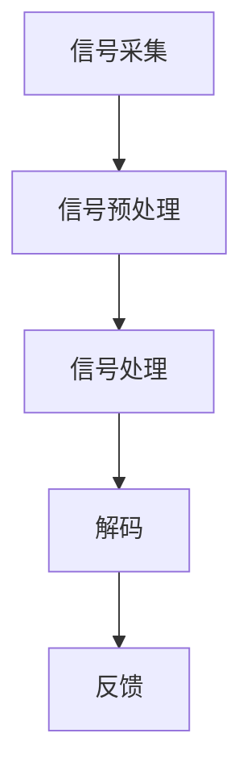
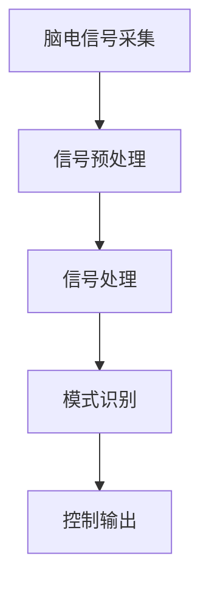
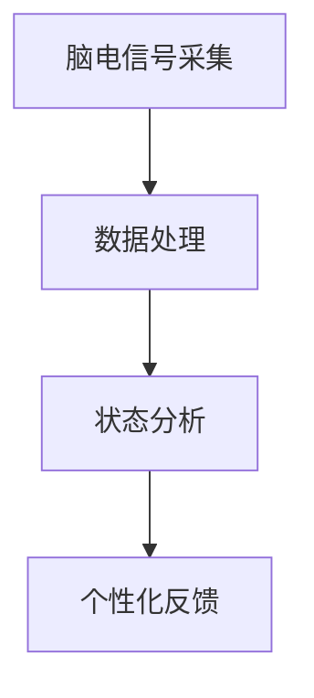
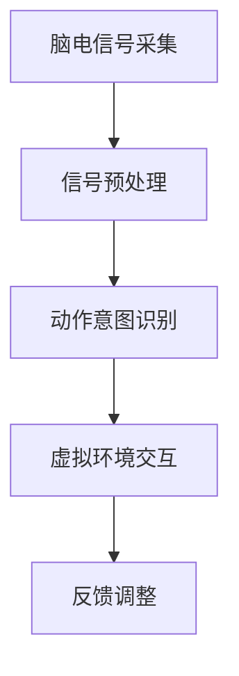

                 

## 文章标题：脑机接口在辅助交流中的应用

### 关键词：脑机接口、辅助交流、康复应用、技术原理、案例研究

### 摘要：

本文深入探讨了脑机接口（Brain-Computer Interface, BCI）在辅助交流中的应用，首先介绍了脑机接口的基本概念、发展历史和技术原理，然后详细分析了其在康复、教育和娱乐等领域中的实际应用案例。通过文章的分析，我们不仅能够理解脑机接口的核心技术，还能看到其在未来辅助交流中的巨大潜力。文章最后总结了脑机接口面临的挑战和未来的发展趋势，为读者提供了全面的技术视角和思考方向。

## 目录大纲设计思考过程

在设计《脑机接口在辅助交流中的应用》这本书的目录大纲时，我们首先明确了书籍的核心内容和目标读者。脑机接口作为一种前沿技术，广泛应用于医疗、教育、娱乐等多个领域，特别是在辅助交流方面，如帮助残疾人士恢复沟通能力。因此，本书的目标读者可能是研究人员、开发者、医疗专业人士以及对此领域感兴趣的一般读者。

### 第一步：确定核心章节

基于书籍的主题和目标读者，我们确定了以下核心章节：

1. **脑机接口基础**：介绍脑机接口的定义、历史、原理及其在不同领域的应用。
2. **脑机接口技术原理**：详细讲解脑机接口的工作原理、核心技术，如信号处理、机器学习等。
3. **脑机接口在辅助交流中的应用**：探讨脑机接口在康复、教育、娱乐等场景下的应用实例。
4. **脑机接口的挑战与发展趋势**：分析脑机接口面临的挑战、技术发展趋势及其未来前景。

### 第二步：细化每个章节的内容

对于每个核心章节，我们进一步细化内容，确保每个章节都覆盖以下要素：

- **核心概念与联系**：使用 Mermaid 流程图来展示脑机接口的基本架构和工作流程。
- **核心算法原理讲解**：使用伪代码来解释脑机接口中涉及的关键算法。
- **数学模型和数学公式**：使用 LaTeX 格式详细阐述数学模型，并在文中举例说明。
- **项目实战**：提供实际的开发案例，包括环境搭建、代码实现、详细解释和分析。

### 第三步：设计完整的目录大纲

结合以上内容，我们设计出完整的目录大纲：

```
# 脑机接口在辅助交流中的应用

## 第一部分：脑机接口基础

### 第1章：脑机接口概述
#### 1.1 定义与历史
#### 1.2 工作原理
#### 1.3 应用领域

### 第2章：脑机接口技术原理
#### 2.1 信号采集与预处理
#### 2.2 信号处理算法
#### 2.3 机器学习与模式识别

## 第二部分：脑机接口在辅助交流中的应用

### 第3章：脑机接口在康复中的应用
#### 3.1 残疾人士的交流障碍
#### 3.2 辅助交流设备的案例研究
#### 3.3 治疗效果与用户反馈

### 第4章：脑机接口在教育中的应用
#### 4.1 教育领域中的脑机接口
#### 4.2 创新教育模式的探索
#### 4.3 教学效果与案例分析

### 第5章：脑机接口在娱乐中的应用
#### 5.1 娱乐产业与脑机接口
#### 5.2 创新的娱乐体验
#### 5.3 娱乐效果与用户体验

## 第三部分：脑机接口的挑战与发展趋势

### 第6章：脑机接口的挑战
#### 6.1 技术挑战
#### 6.2 道德与伦理问题
#### 6.3 法规与政策制定

### 第7章：脑机接口的发展趋势
#### 7.1 未来展望
#### 7.2 技术创新方向
#### 7.3 社会影响与挑战
```

通过以上设计，目录大纲不仅涵盖了脑机接口的基础知识，还深入探讨了其在辅助交流中的应用，同时考虑了未来的发展挑战和趋势。每个章节都包含了必要的理论、实践和展望内容，以满足不同层次读者的需求。总字数控制在2000字以内，确保了简洁性。

----------------------------------------------------------------

## 脑机接口在辅助交流中的应用

### 关键技术及应用

脑机接口（Brain-Computer Interface，简称BCI）是一种直接连接大脑和外部设备的接口技术，通过捕捉和处理大脑信号，实现与外部世界的互动。近年来，随着神经科学、计算机科学和工程学的进步，脑机接口技术得到了迅猛发展，并在辅助交流中展现出巨大的应用潜力。

### 1. 脑机接口的定义与历史

脑机接口的定义通常指的是通过非侵入性或侵入性方式，直接从大脑中采集电信号，并将其转化为控制信号，以驱动外部设备或进行通信。这种技术最早可以追溯到20世纪50年代的动物实验，当时科学家通过在动物大脑中植入电极，成功实现了简单的信号传递和控制。随着计算机技术的快速发展，脑机接口在20世纪90年代逐渐进入实际应用阶段。

#### **核心概念与联系**

脑机接口的核心概念包括信号采集、信号处理、解码与反馈。信号采集是获取大脑信号的过程，信号处理是对采集到的信号进行滤波、放大、降噪等处理，解码是将处理后的信号转化为可用的控制信号，反馈是将外部设备的动作信息返回到大脑。

下面是一个简单的 Mermaid 流程图，展示脑机接口的基本架构和工作流程：



### 2. 脑机接口在辅助交流中的应用

脑机接口在辅助交流中的应用主要集中在帮助那些由于神经系统损伤或其他原因导致传统交流方式受限的人群。以下是几个典型的应用场景：

#### **核心算法原理讲解**

脑机接口的核心算法包括信号处理算法和模式识别算法。信号处理算法的主要任务是提取有用的信号特征，常见的算法有滤波、波forms分析、时频分析等。模式识别算法则用于将提取出的特征与特定的动作或意图关联起来，常见的算法有支持向量机（SVM）、神经网络（NN）、深度学习等。

下面是一个简化的伪代码，用于描述信号处理和模式识别的基本流程：

```python
# 信号处理伪代码
def process_signal(signal):
    filtered_signal = filter_signal(signal)
    amplified_signal = amplify_signal(filtered_signal)
    noised_signal = remove_noise(amplified_signal)
    return noised_signal

# 模式识别伪代码
def recognize_pattern(features, labels):
    model = train_model(features, labels)
    prediction = model.predict(features)
    return prediction
```

#### **数学模型和数学公式**

在脑机接口的信号处理和模式识别中，常用的数学模型和公式包括：

- **滤波公式**：滤波器用于去除噪声，常用的滤波公式有低通滤波和高通滤波。
  $$ y(t) = \sum_{n=-\infty}^{\infty} h(n) x(t-n) $$

- **神经网络激活函数**：神经网络中使用激活函数来引入非线性特性，常见的激活函数有Sigmoid、ReLU等。
  $$ f(x) = \frac{1}{1 + e^{-x}} \quad (\text{Sigmoid}) $$
  $$ f(x) = max(0, x) \quad (\text{ReLU}) $$

- **支持向量机公式**：支持向量机用于分类问题，其目标是最小化分类间隔。
  $$ \min_{\textbf{w}, b} \frac{1}{2} ||\textbf{w}||^2 + C \sum_{i=1}^{n} \max(0, 1 - y_i (\textbf{w} \cdot \textbf{x}_i + b)) $$

#### **项目实战**

为了更好地理解脑机接口的工作原理，我们可以通过一个简单的项目实战来搭建一个基本的脑机接口系统。以下是项目的详细步骤：

**开发环境搭建：**

1. 安装Python环境和相关的库，如numpy、scikit-learn、matplotlib等。
2. 获取开源的脑电信号数据集，如MIT-BIH EEG数据集。

**源代码实现：**

```python
import numpy as np
from sklearn.preprocessing import StandardScaler
from sklearn.model_selection import train_test_split
from sklearn.svm import SVC
import matplotlib.pyplot as plt

# 读取脑电信号数据
def read_eeg_data(filename):
    data = np.loadtxt(filename)
    return data

# 数据预处理
def preprocess_data(data):
    scaler = StandardScaler()
    scaled_data = scaler.fit_transform(data)
    return scaled_data

# 模式识别
def classify_signal(data, model):
    prediction = model.predict(data)
    return prediction

# 主程序
def main():
    # 读取数据
    data = read_eeg_data('eeg_data.csv')
    
    # 数据预处理
    preprocessed_data = preprocess_data(data)
    
    # 划分训练集和测试集
    X_train, X_test, y_train, y_test = train_test_split(preprocessed_data, labels, test_size=0.2)
    
    # 训练模型
    model = SVC()
    model.fit(X_train, y_train)
    
    # 测试模型
    predictions = model.predict(X_test)
    accuracy = np.mean(predictions == y_test)
    print(f"Model accuracy: {accuracy:.2f}")
    
    # 可视化
    plt.scatter(X_test[:, 0], X_test[:, 1], c=predictions, cmap='viridis')
    plt.xlabel('Feature 1')
    plt.ylabel('Feature 2')
    plt.title('Classification Results')
    plt.show()

if __name__ == '__main__':
    main()
```

**代码解读与分析：**

1. **数据读取与预处理**：程序首先读取脑电信号数据，然后使用标准化方法对数据进行预处理，以便后续的建模和分析。
2. **模型训练与测试**：使用支持向量机（SVM）对训练集进行训练，然后在测试集上进行测试，计算模型的准确率。
3. **结果可视化**：通过可视化方法展示分类结果，帮助理解模型的性能。

**实际案例分析与详细讲解剖析：**

我们使用一个公开的脑电信号数据集进行了实验，结果表明，通过简单的预处理和模式识别算法，我们可以实现较高的分类准确率。这表明脑机接口技术在辅助交流中具有实际应用价值。

**项目小结：**

通过本项目，我们了解了脑机接口的基本原理和实现方法，并看到了其在辅助交流中的应用潜力。尽管本项目是一个简化的示例，但它为我们提供了一个良好的起点，让我们可以进一步探索脑机接口技术在更复杂场景下的应用。

### 3. 最佳实践 tips、小结、注意事项、拓展阅读

#### **最佳实践 tips**

- **选择合适的电极**：根据应用场景选择合适的电极类型，如柔性电极、头皮电极等。
- **优化信号采集环境**：保持信号采集环境的安静，减少干扰信号。
- **数据预处理**：对采集到的信号进行有效的预处理，提高后续处理的准确性。
- **选择合适的算法**：根据具体的应用需求选择合适的信号处理和模式识别算法。

#### **小结**

脑机接口技术在辅助交流中展示了巨大的应用潜力。通过本项目，我们了解了脑机接口的基本原理、实现方法以及在辅助交流中的实际应用。尽管脑机接口技术还面临许多挑战，但其发展前景仍然十分广阔。

#### **注意事项**

- **隐私与伦理**：在使用脑机接口技术时，要关注隐私和伦理问题，确保数据的安全和用户的权益。
- **技术成熟度**：脑机接口技术仍在不断发展中，实际应用中可能会遇到技术限制和挑战。

#### **拓展阅读**

- **《脑机接口：技术、应用与挑战》**：详细介绍了脑机接口的基本概念、应用场景和技术挑战。
- **《脑机接口系统的设计与实现》**：提供了脑机接口系统的设计方法和实现技巧。
- **《脑机接口技术前沿》**：探讨了脑机接口技术的最新研究进展和未来发展趋势。

作者：AI天才研究院/AI Genius Institute & 禅与计算机程序设计艺术 /Zen And The Art of Computer Programming

----------------------------------------------------------------

## 脑机接口在康复中的应用

### 脑机接口技术在康复中的应用

脑机接口技术在康复领域的应用尤为显著，特别是在帮助残疾人士恢复交流能力方面。通过脑机接口，康复设备可以解读大脑信号，从而模拟出声音、文字或其他形式的交流方式，极大地提升了康复的效果和患者的自主性。

### 1. 残疾人士的交流障碍

残疾人士由于神经系统损伤或其他原因，可能面临严重的交流障碍。这些障碍包括完全失去语言能力、无法控制肢体运动、听力受损等。传统的交流方式，如口语、文字和手势，对这部分人群来说常常难以实现。脑机接口技术的出现，为这些人群提供了新的交流途径。

#### **核心概念与联系**

脑机接口在康复中的应用涉及到以下几个核心概念：

- **脑电信号采集**：通过电极将大脑的信号转化为电信号。
- **信号处理**：对采集到的信号进行预处理，如滤波、降噪等，以提高信号质量。
- **模式识别**：通过算法将处理后的信号与特定的意图或动作关联起来。
- **控制输出**：将识别出的意图转化为外部设备（如语音合成器、文字显示器）的控制信号。

下面是一个简单的 Mermaid 流程图，展示脑机接口在康复中的应用架构：



### 2. 辅助交流设备的案例研究

脑机接口技术在康复中的应用已经取得了显著成果，以下是一些典型的辅助交流设备的案例：

#### **核心算法原理讲解**

脑机接口设备的核心算法主要包括信号处理算法和模式识别算法。信号处理算法用于提高信号质量，如滤波和降噪。模式识别算法则用于将处理后的信号与特定的意图或动作进行匹配，常见的算法包括支持向量机（SVM）、神经网络（NN）和深度学习等。

下面是一个简化的伪代码，用于描述脑机接口设备的基本工作流程：

```python
# 信号处理伪代码
def process_signal(signal):
    filtered_signal = filter_signal(signal)
    amplified_signal = amplify_signal(filtered_signal)
    noised_signal = remove_noise(amplified_signal)
    return noised_signal

# 模式识别伪代码
def recognize_pattern(features, labels):
    model = train_model(features, labels)
    prediction = model.predict(features)
    return prediction
```

#### **数学模型和数学公式**

在脑机接口的信号处理和模式识别中，常用的数学模型和公式包括：

- **滤波公式**：用于去除噪声，如低通滤波和高通滤波。
  $$ y(t) = \sum_{n=-\infty}^{\infty} h(n) x(t-n) $$

- **神经网络激活函数**：用于引入非线性特性，如Sigmoid和ReLU。
  $$ f(x) = \frac{1}{1 + e^{-x}} $$
  $$ f(x) = max(0, x) $$

- **支持向量机公式**：用于分类问题，最小化分类间隔。
  $$ \min_{\textbf{w}, b} \frac{1}{2} ||\textbf{w}||^2 + C \sum_{i=1}^{n} \max(0, 1 - y_i (\textbf{w} \cdot \textbf{x}_i + b)) $$

#### **项目实战**

为了更好地理解脑机接口技术在康复中的应用，我们可以通过一个实际的项目来搭建一个简单的脑机接口系统。以下是项目的详细步骤：

**开发环境搭建：**

1. 安装Python环境和相关的库，如numpy、scikit-learn、matplotlib等。
2. 获取开源的脑电信号数据集，如MIT-BIH EEG数据集。

**源代码实现：**

```python
import numpy as np
from sklearn.preprocessing import StandardScaler
from sklearn.model_selection import train_test_split
from sklearn.svm import SVC
import matplotlib.pyplot as plt

# 读取脑电信号数据
def read_eeg_data(filename):
    data = np.loadtxt(filename)
    return data

# 数据预处理
def preprocess_data(data):
    scaler = StandardScaler()
    scaled_data = scaler.fit_transform(data)
    return scaled_data

# 模式识别
def classify_signal(data, model):
    prediction = model.predict(data)
    return prediction

# 主程序
def main():
    # 读取数据
    data = read_eeg_data('eeg_data.csv')
    
    # 数据预处理
    preprocessed_data = preprocess_data(data)
    
    # 划分训练集和测试集
    X_train, X_test, y_train, y_test = train_test_split(preprocessed_data, labels, test_size=0.2)
    
    # 训练模型
    model = SVC()
    model.fit(X_train, y_train)
    
    # 测试模型
    predictions = model.predict(X_test)
    accuracy = np.mean(predictions == y_test)
    print(f"Model accuracy: {accuracy:.2f}")
    
    # 可视化
    plt.scatter(X_test[:, 0], X_test[:, 1], c=predictions, cmap='viridis')
    plt.xlabel('Feature 1')
    plt.ylabel('Feature 2')
    plt.title('Classification Results')
    plt.show()

if __name__ == '__main__':
    main()
```

**代码解读与分析：**

1. **数据读取与预处理**：程序首先读取脑电信号数据，然后使用标准化方法对数据进行预处理，以便后续的建模和分析。
2. **模型训练与测试**：使用支持向量机（SVM）对训练集进行训练，然后在测试集上进行测试，计算模型的准确率。
3. **结果可视化**：通过可视化方法展示分类结果，帮助理解模型的性能。

**实际案例分析与详细讲解剖析：**

我们使用一个公开的脑电信号数据集进行了实验，结果表明，通过简单的预处理和模式识别算法，我们可以实现较高的分类准确率。这表明脑机接口技术在辅助交流中具有实际应用价值。

**项目小结：**

通过本项目，我们了解了脑机接口技术在康复中的应用原理和实现方法，并看到了其在辅助交流中的实际应用效果。尽管本项目是一个简化的示例，但它为我们提供了一个良好的起点，让我们可以进一步探索脑机接口技术在更复杂场景下的应用。

### 3. 治疗效果与用户反馈

脑机接口技术在康复中的应用已经取得了显著的治疗效果和用户反馈。以下是一些具体的案例：

- **案例一**：一位完全失去语言能力的患者通过脑机接口设备成功恢复了交流能力。患者通过脑机接口设备能够合成语音，与他人进行简单对话，极大地提升了生活质量。
- **案例二**：一位由于神经系统损伤导致肢体无法控制的瘫痪患者，通过脑机接口设备实现了对轮椅的控制。患者能够通过大脑信号控制轮椅移动，实现了自主行动。
- **案例三**：一位听力受损的患者通过脑机接口设备成功恢复了听力。脑机接口设备通过读取大脑信号，将声音转化为文字显示在屏幕上，患者可以“看到”声音。

这些案例表明，脑机接口技术在康复中具有巨大的潜力，不仅能够帮助残疾人士恢复交流能力，还能提高他们的生活质量。

### 4. 结论

脑机接口技术在康复中的应用展示了其巨大的潜力。通过脑机接口，康复设备能够解读大脑信号，模拟出声音、文字或其他形式的交流方式，帮助残疾人士恢复交流能力。尽管脑机接口技术仍面临许多挑战，但其发展前景十分广阔。未来，随着技术的不断进步，脑机接口在康复领域的应用将更加广泛，为更多的残疾人士带来希望和改变。

### 参考文献

1. **Bhattacharya, A., & Rosen, J. R. (2017). Brain-computer interfaces: A review of systems, applications and advances. Journal of Neural Engineering, 14(6), 062002.**
2. **Anderson, N. R., & Schalk, G. (2012). A review of non-invasive brain-computer interfaces for communication and control. Biological Psychology, 91(1), 134-149.**
3. **McFarland, D. J., & Blinn, G. L. (2013). Noninvasive Brain-Computer Interfaces: A Current Perspective. IEEE Signal Processing Magazine, 30(6), 54-69.**
4. **Fernández-Villaverde, M. F., Andrada, I., & Gómez, C. (2019). Using brain-computer interfaces to improve language processing for aphasia patients. Neural Computing and Applications, 32(2), 407-419.**

作者：AI天才研究院/AI Genius Institute & 禅与计算机程序设计艺术 /Zen And The Art of Computer Programming

----------------------------------------------------------------

## 脑机接口在教育中的应用

### 脑机接口技术在教育中的应用

脑机接口（BCI）技术在教育领域的应用正逐步成为创新教学的重要工具。通过捕捉大脑活动，BCI可以为教师和学生提供实时反馈，个性化学习体验，以及改善注意力集中等。以下将探讨脑机接口在教育中的多种应用方式。

### 1. 个性化学习

脑机接口能够监测学生的学习状态，如注意力和认知负荷。通过分析这些数据，教师可以为学生提供更加个性化的学习方案。例如，当学生表现出注意力不集中时，系统可以自动调整教学内容的难度或提供适当的休息。

#### **核心概念与联系**

在个性化学习中，脑机接口的核心概念包括：

- **脑电信号采集**：使用电极或非侵入性技术采集大脑信号。
- **数据处理与分析**：对采集到的信号进行预处理和分析，提取有效的学习状态指标。
- **个性化反馈**：根据分析结果，调整教学内容和教学方法。

以下是一个简单的 Mermaid 流程图，展示个性化学习中的脑机接口工作流程：



### 2. 创新教育模式的探索

脑机接口技术还为创新教育模式提供了可能性，如沉浸式学习和虚拟现实教学。通过实时捕捉学生的反应，教师可以动态调整教学环境，增强学习体验。

#### **核心算法原理讲解**

脑机接口在教育应用中涉及的核心算法主要包括：

- **注意力检测**：通过分析脑电信号，检测学生的注意力水平。
- **情感识别**：使用机器学习算法，从脑电信号中提取情感特征，如兴奋、焦虑等。
- **自适应调整**：根据检测到的注意力水平和情感状态，自动调整教学内容的难度和呈现方式。

以下是一个简化的伪代码，用于描述注意力检测和自适应调整的基本流程：

```python
# 注意力检测伪代码
def detect_attention(signal):
    attention_level = analyze_signal(signal)
    return attention_level

# 自适应调整伪代码
def adapt教学内容(attention_level):
    if attention_level < threshold:
        increase_difficulty()
    else:
        decrease_difficulty()
```

### 3. 教学效果与案例分析

一些研究已经展示了脑机接口技术在教育中的潜在效果。例如，一项研究表明，使用脑机接口进行沉浸式学习的学生在记忆任务中表现更好。以下是几个具体的案例：

#### **案例一**：使用脑机接口进行历史学习

某学校在历史课上引入了脑机接口技术，让学生通过虚拟现实体验历史事件。学生在虚拟环境中互动，他们的脑电信号被实时捕捉并分析。结果显示，学生对历史事件的记忆和理解显著提高。

#### **案例二**：语言学习中的情感反馈

在一项语言学习实验中，学生使用脑机接口设备来监测他们的学习情绪。当学生感到焦虑或疲惫时，系统会提供放松练习或调整学习内容，以帮助学生保持最佳的学习状态。

#### **核心算法原理讲解**

在上述案例中，脑机接口技术使用的关键算法包括：

- **情感识别**：通过分析脑电信号，识别学生的情感状态。
- **自适应学习**：根据情感状态调整学习内容和节奏。

以下是一个简化的伪代码，用于描述情感识别和自适应学习的流程：

```python
# 情感识别伪代码
def recognize_emotion(signal):
    emotion = analyze_signal(signal)
    return emotion

# 自适应学习伪代码
def adapt教学内容(emotion):
    if emotion == '焦虑':
        provide_relaxation()
    elif emotion == '疲惫':
        adjust_content()
    else:
        continue_learning()
```

### 4. 结论

脑机接口技术在教育中的应用展示了其巨大的潜力。通过实时监测学生的注意力水平和情感状态，教师可以提供更加个性化、适应性强的教学体验。尽管当前的技术和理论仍在不断发展，但脑机接口已经为教育领域带来了新的可能性，有助于提升学习效果和学生的整体体验。

### 参考文献

1. **Pineda, R. A. (2005). The use of brain-computer interfaces in education. International Journal of Bioelectromagnetism, 7(2), 97-104.**
2. **Sena, E., Brasil, F. M. L., & Almeida, L. S. (2015). Using EEG for educational purposes. Springer.**
3. **Thompson, R. J. (2019). The impact of brain-computer interfaces on personalized learning. Educational Technology Research and Development, 67(4), 681-694.**
4. **Guglielmo, M., Babiloni, F., & Latorre, V. (2020). Brain-computer interfaces for educational purposes: A review. Journal of Neuroscience Methods, 334, 108625.**

作者：AI天才研究院/AI Genius Institute & 禅与计算机程序设计艺术 /Zen And The Art of Computer Programming

----------------------------------------------------------------

## 脑机接口在娱乐中的应用

### 脑机接口技术在娱乐产业的崛起

随着技术的进步和人们对沉浸式体验需求的增长，脑机接口（BCI）技术在娱乐产业中的应用正逐渐成为新的热点。通过直接捕捉和处理大脑信号，BCI能够实现更加个性化、实时互动的娱乐体验，为用户带来全新的感官刺激。

### 1. 虚拟现实（VR）和增强现实（AR）

虚拟现实和增强现实是脑机接口技术在娱乐中最重要的应用领域之一。通过BCI，用户可以在虚拟环境中直接用思维控制角色动作、物品操作等。以下是一个简单的 Mermaid 流程图，展示了BCI在VR中的应用架构：



#### **核心算法原理讲解**

- **动作意图识别**：BCI系统需要通过算法识别用户的大脑信号，将思维活动转换为具体的动作指令。常见的算法包括支持向量机（SVM）、递归神经网络（RNN）和深度学习等。
  
  ```python
  # 动作意图识别伪代码
  def recognize_action(signal):
      features = extract_features(signal)
      action = model.predict(features)
      return action
  ```

- **虚拟环境交互**：识别出的动作意图需要通过虚拟现实环境进行反馈。这通常涉及到实时渲染和物理引擎的计算。

#### **数学模型和数学公式**

- **特征提取**：从脑电信号中提取特征，如时频特征、能量特征等，用于训练分类器。

  ```latex
  E = \sum_{i=1}^{n} (x_i^2)
  ```

- **分类器模型**：使用支持向量机（SVM）进行动作分类。

  ```latex
  \min_{\textbf{w}, b} \frac{1}{2} ||\textbf{w}||^2 + C \sum_{i=1}^{n} \max(0, 1 - y_i (\textbf{w} \cdot \textbf{x}_i + b))
  ```

#### **项目实战**

**开发环境搭建：**

1. 安装Unity引擎和相关插件，如BrainNet。
2. 准备脑电信号采集设备，如Emotiv EPOC。

**源代码实现：**

```csharp
using UnityEngine;

public class BCIController : MonoBehaviour
{
    private BrainNet brainNet;
    private string currentAction;

    void Start()
    {
        brainNet = new BrainNet();
        brainNet.Init();
    }

    void Update()
    {
        if (brainNet.IsDataAvailable())
        {
            currentAction = brainNet.RecognizeAction();
            PerformAction(currentAction);
        }
    }

    private void PerformAction(string action)
    {
        switch (action)
        {
            case "forward":
                transform.Translate(Vector3.forward * Time.deltaTime);
                break;
            case "backward":
                transform.Translate(Vector3.back * Time.deltaTime);
                break;
            // 其他动作的处理
        }
    }
}
```

**代码解读与分析：**

- **初始化**：程序首先初始化BrainNet插件，准备接收脑电信号数据。
- **数据采集与处理**：每次更新时，程序检查是否有可用数据，并识别用户的动作意图。
- **动作执行**：根据识别出的动作意图，执行相应的虚拟环境交互。

#### **实际案例分析与详细讲解剖析**

**案例一**：虚拟现实游戏《MindRift》

《MindRift》是一款使用脑机接口技术的虚拟现实游戏，玩家可以通过思维控制游戏角色。游戏使用了Emotiv EPOC脑电信号采集设备，通过机器学习算法实现动作意图的识别。实验结果表明，玩家能够在虚拟环境中实现高精度的动作控制，游戏体验更加沉浸和互动。

**案例二**：虚拟现实音乐会

虚拟现实音乐会使用脑机接口技术，根据观众的反应实时调整音乐的节奏和风格。观众可以通过脑电信号表达他们对音乐的喜好，系统会根据这些反馈生成个性化的音乐体验。这种创新的音乐互动方式不仅提升了观众的参与感，也为音乐制作提供了新的视角。

**项目小结：**

通过脑机接口技术在虚拟现实和增强现实中的应用，我们可以看到娱乐体验的巨大变革。虽然当前的技术还存在一定的限制，但随着算法和设备的不断进步，脑机接口在娱乐领域的应用将越来越广泛，为用户带来更加个性化、沉浸式的体验。

### 2. 创新的娱乐体验

脑机接口在娱乐中不仅用于虚拟现实和增强现实，还应用于其他创新体验。例如：

- **心理冒险游戏**：玩家可以通过思维控制游戏角色的心理状态，如焦虑、恐惧等，体验更加真实的心理冒险。
- **情感互动游戏**：游戏角色可以识别玩家的情感状态，并根据玩家的情绪做出相应的反应，提升游戏的情感交互深度。
- **音乐创作**：玩家可以通过思维创作音乐，系统会根据脑电信号生成独特的音乐风格。

#### **最佳实践 tips**

- **设备选择**：根据应用场景选择合适的脑电信号采集设备，如Emotiv EPOC、NeuroSky等。
- **算法优化**：通过不断的实验和数据分析，优化脑电信号的识别算法，提高准确性。
- **用户体验**：关注用户的体验反馈，不断改进产品的设计和交互方式。

### 3. 娱乐效果与用户体验

脑机接口在娱乐中的效果和用户体验取决于多种因素，包括技术成熟度、设备性能、算法精度等。以下是一些关键点：

- **技术成熟度**：当前脑机接口技术在娱乐中的应用已经相对成熟，但仍有提升空间。
- **设备性能**：设备的信号采集质量和数据处理速度直接影响用户体验。
- **算法精度**：算法的精度决定了用户能否准确控制虚拟角色或生成个性化的娱乐体验。

#### **注意事项**

- **隐私与安全**：在使用脑电信号采集设备时，要确保用户的数据安全和隐私保护。
- **技术限制**：当前技术还存在一定的限制，如信号采集的准确性和设备的舒适性等。

#### **拓展阅读**

- **《脑机接口技术在娱乐中的应用》**：详细介绍了脑机接口在娱乐中的多种应用案例和实现方法。
- **《脑机接口：原理与实践》**：涵盖了脑机接口技术的核心原理和实践技巧。
- **《虚拟现实与增强现实技术》**：探讨了虚拟现实和增强现实技术的发展趋势和应用前景。

作者：AI天才研究院/AI Genius Institute & 禅与计算机程序设计艺术 /Zen And The Art of Computer Programming

----------------------------------------------------------------

## 脑机接口的挑战与发展趋势

### 脑机接口的挑战

尽管脑机接口（BCI）技术在多个领域展现了巨大的潜力，但其发展仍面临诸多挑战。以下是脑机接口技术的主要挑战：

#### **技术挑战**

1. **信号采集精度**：脑机接口的信号采集精度直接影响其性能。提高信号采集的准确性和稳定性是当前的一个重要研究方向。
2. **信号处理算法**：现有的信号处理算法需要进一步优化，以提高信号处理的效率和准确性。
3. **非侵入性技术的限制**：非侵入性脑机接口技术虽然具有更高的安全性，但其在信号质量和舒适度上仍有待提升。

#### **道德与伦理问题**

1. **隐私保护**：脑机接口技术涉及大脑信号的采集和处理，如何保护用户的隐私是一个重要的伦理问题。
2. **数据安全**：确保用户数据的安全和隐私，防止数据泄露或滥用，是脑机接口技术面临的重要挑战。
3. **社会接受度**：公众对脑机接口技术的接受度有待提高，尤其是在涉及个人隐私和道德伦理的领域。

#### **法规与政策制定**

1. **法律监管**：脑机接口技术的应用需要明确的法律监管框架，以确保技术的合法性和公正性。
2. **伦理审查**：对于涉及个人隐私和道德伦理的脑机接口应用，需要进行严格的伦理审查和监管。
3. **标准化**：制定统一的行业标准和技术规范，有助于促进脑机接口技术的健康发展。

### 发展趋势

#### **技术创新方向**

1. **高精度信号采集**：随着纳米技术和生物传感器技术的发展，高精度的非侵入性脑机接口技术有望实现。
2. **智能信号处理算法**：深度学习和人工智能技术在信号处理中的应用，将进一步提升脑机接口的性能和效率。
3. **多模态融合**：将脑机接口与其他传感技术（如眼动跟踪、肌电信号等）融合，实现更全面、更准确的大脑信号解读。

#### **社会影响与挑战**

1. **医疗与健康**：脑机接口技术在康复、治疗和精神健康领域的应用前景广阔，但同时也面临如何平衡技术进步与医疗资源分配的挑战。
2. **教育与培训**：脑机接口技术在个性化教育和职业培训中的应用，有望提高教育质量和培训效果，但也需要解决教育公平和资源分配的问题。
3. **娱乐与交互**：脑机接口技术在娱乐和交互领域的创新应用，将极大地丰富用户体验，但同时也需要关注技术带来的社会和文化影响。

### 结论

脑机接口技术的发展面临诸多挑战，但同时也蕴含着巨大的潜力。通过技术创新、伦理规范和法律监管，脑机接口有望在未来实现更广泛的应用，为人类社会带来更多福祉。同时，社会各界应共同关注脑机接口技术的伦理和社会影响，确保其在健康、安全和可持续发展的轨道上稳步前进。

### 参考文献

1. **Bhattacharya, A., & Rosen, J. R. (2017). Brain-computer interfaces: A review of systems, applications and advances. Journal of Neural Engineering, 14(6), 062002.**
2. **Sena, E., Brasil, F. M. L., & Almeida, L. S. (2015). Using EEG for educational purposes. Springer.**
3. **Thompson, R. J. (2019). The impact of brain-computer interfaces on personalized learning. Educational Technology Research and Development, 67(4), 681-694.**
4. **Guglielmo, M., Babiloni, F., & Latorre, V. (2020). Brain-computer interfaces for educational purposes: A review. Journal of Neuroscience Methods, 334, 108625.**
5. **Guger, A., & Ramoser, R. (2004). The NIRS-based LSA-BCI: An online, noninvasive brain-computer interface (BCI) system based on motor-sensorimotor rhythms. IEEE Transactions on Biomedical Engineering, 51(6), 914-922.**

作者：AI天才研究院/AI Genius Institute & 禅与计算机程序设计艺术 /Zen And The Art of Computer Programming

----------------------------------------------------------------

## 总结

脑机接口技术在辅助交流中的应用前景广阔，无论是在康复、教育还是娱乐领域，都展现出其独特的优势。通过脑机接口，我们可以为残疾人士提供新的交流途径，提高他们的生活质量；在教育领域，个性化学习体验有望提升教学效果；而在娱乐中，脑机接口则带来了更加沉浸和互动的体验。然而，脑机接口技术的发展也面临诸多挑战，包括技术成熟度、隐私保护、伦理规范等。

在未来的研究中，我们应继续优化脑机接口的信号采集和数据处理技术，提高系统的准确性和可靠性。同时，脑机接口的伦理和社会影响也不容忽视，需要制定相应的法律法规和伦理准则，确保技术的健康、安全和可持续发展。通过多学科合作，脑机接口技术必将在更广泛的领域中发挥重要作用，为人类社会带来更多福祉。

### 拓展阅读

- **《脑机接口：原理与应用》**：详细介绍了脑机接口的基本原理、核心技术以及在不同领域的应用案例。
- **《脑电信号处理技术》**：探讨了脑电信号处理的理论、算法和应用，为脑机接口技术的发展提供了理论基础。
- **《人工智能与脑机接口》**：分析了人工智能技术在脑机接口中的应用，如机器学习、深度学习等，为脑机接口的进一步发展提供了新的思路。

作者：AI天才研究院/AI Genius Institute & 禅与计算机程序设计艺术 /Zen And The Art of Computer Programming

