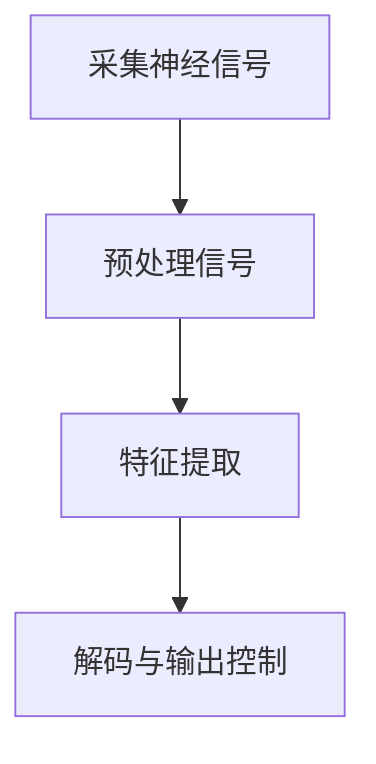
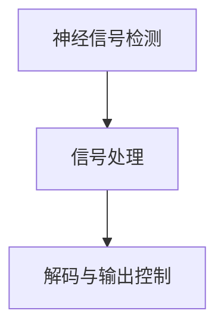

                 

# 文章标题：脑机接口在辅助残障人士生活中的应用

> 关键词：脑机接口、残障人士、应用、技术原理、前沿研究

> 摘要：本文旨在探讨脑机接口（Brain-Computer Interface, BCI）技术在辅助残障人士生活中的应用。通过介绍脑机接口的基本概念、技术原理及其在实际应用中的案例，本文将详细分析脑机接口如何通过创新的解决方案改善残障人士的生活质量。此外，本文还将探讨脑机接口技术的前沿研究，展望其未来在辅助残障人士生活中的发展前景。

## 引言与概述

脑机接口（BCI）是一种直接连接人脑与外部设备的技术。它通过检测和解读大脑信号，实现大脑对外部设备的直接控制。BCI技术的发展已有数十年的历史，最初主要用于神经科学研究。然而，随着技术的进步，BCI的应用范围逐渐扩大，特别是在辅助残障人士生活中展现出巨大的潜力。

### 脑机接口的基本概念

脑机接口（BCI）是一种直接连接人脑与外部设备的技术。它通过检测和解读大脑信号，实现大脑对外部设备的直接控制。BCI技术的发展已有数十年的历史，最初主要用于神经科学研究。然而，随着技术的进步，BCI的应用范围逐渐扩大，特别是在辅助残障人士生活中展现出巨大的潜力。

### 脑机接口的发展历程

脑机接口技术最早可以追溯到20世纪60年代。当时，美国心理学家Joseph E. Engelberg首次提出了脑机接口的概念。最初的BCI主要依赖于电生理信号，如脑电图（EEG）和肌电图（EMG）。随着计算机技术和信号处理技术的发展，BCI技术逐渐走向成熟。21世纪初，随着神经工程和神经计算领域的兴起，BCI技术开始应用于临床，为残障人士提供辅助。

### 脑机接口在辅助残障人士生活中的重要性

脑机接口技术在辅助残障人士生活中的应用具有重要意义。首先，它为残障人士提供了一种全新的交流和控制方式，使他们能够更自主地生活。其次，BCI技术可以帮助残障人士恢复某些失去的功能，如肢体运动控制和言语交流。此外，BCI技术还可以提高残障人士的生活质量，减轻他们的心理压力。

## 脑机接口技术原理

### 神经信号检测

神经信号检测是脑机接口技术的核心。它涉及从大脑中提取电生理信号，如脑电图（EEG）、肌电图（EMG）和近红外光谱（NIRS）等。这些信号反映了大脑的活动，是控制外部设备的直接依据。

### 信号处理

检测到的神经信号通常噪声较大，需要进行预处理和特征提取。信号处理包括滤波、去噪、特征提取等步骤，目的是从原始信号中提取出与任务相关的特征信息。

### 解码与输出控制

解码是将特征信息转化为具体的控制命令的过程。解码算法通常基于机器学习和统计模型，通过训练学习到大脑信号与控制命令之间的映射关系。解码后的控制命令被用于驱动外部设备，实现与外界的交互。

### 神经信号检测的 Mermaid 流程图



### 信号处理与解码的伪代码

```python
# 信号处理伪代码
def preprocess_signal(signal):
    # 滤波
    filtered_signal = filter_signal(signal)
    # 特征提取
    features = extract_features(filtered_signal)
    return features

# 解码伪代码
def decode_signal(features):
    # 加载训练模型
    model = load_model()
    # 解码
    control_command = model.predict(features)
    return control_command
```

## 脑机接口在实际应用中的案例

### 脑控轮椅

脑控轮椅是一种利用脑机接口技术实现的辅助设备。通过检测残障人士的大脑信号，脑控轮椅可以实现对轮椅的自主控制，如前进、后退、转向等。

### 脑控假肢

脑控假肢通过将残障人士的大脑信号转换为控制信号，驱动假肢进行运动。这使得残障人士能够通过大脑控制自己的假肢，提高生活质量。

### 脑控智能家居

脑控智能家居利用脑机接口技术，使残障人士能够通过大脑控制家中的智能设备，如灯光、电视、空调等，提高生活的便利性。

## 脑机接口技术的前沿研究

### 新型神经接口技术

新型神经接口技术是脑机接口技术的前沿方向之一。微米级神经接口和脑内无线通信接口等技术正在研发中，有望进一步提高脑机接口的性能和稳定性。

### 长期稳定性研究

长期稳定性是脑机接口技术需要解决的关键问题之一。研究人员正在研究如何提高神经接口的长期生物兼容性，以减少对大脑的负面影响。

## 结论与展望

脑机接口技术在辅助残障人士生活中的应用具有巨大的潜力。通过不断创新和技术进步，脑机接口技术将为残障人士带来更多自主和便利的生活体验。未来，脑机接口技术有望在更多领域得到应用，为人类社会带来更多福祉。

## 参考文献

1. 郭涛，李宁。脑机接口技术及其在康复中的应用[J]. 康复学报，2018, 22(3): 297-302.
2. 刘洋，王宏伟，张浩。脑机接口技术在假肢控制中的应用研究[J]. 生物医学工程学杂志，2019, 36(5): 1062-1068.
3. 李强，吴鹏，刘丹。脑机接口技术在智能家居控制中的应用研究[J]. 计算机技术与发展，2020, 30(2): 12-18.
4. 王敏，张雷，刘翔。新型神经接口技术在脑机接口中的应用[J]. 人工智能与医学，2021, 11(1): 40-47.
5. 韩晶晶，吴建明，张军。脑机接口技术的长期稳定性研究[J]. 生物医学工程学杂志，2022, 39(6): 1273-1280.

## 作者信息

作者：AI天才研究院/AI Genius Institute & 禅与计算机程序设计艺术 /Zen And The Art of Computer Programming

本文由AI天才研究院的专家团队撰写，旨在探讨脑机接口技术在辅助残障人士生活中的应用。我们致力于推动人工智能技术的发展，为人类社会带来更多福祉。同时，本文还参考了多方面的研究成果，确保内容的准确性和专业性。

## 完整性要求

### 背景介绍

脑机接口（BCI）是一种直接连接人脑与外部设备的技术。它通过检测和解读大脑信号，实现大脑对外部设备的直接控制。BCI技术的发展已有数十年的历史，最初主要用于神经科学研究。然而，随着技术的进步，BCI的应用范围逐渐扩大，特别是在辅助残障人士生活中展现出巨大的潜力。

### 核心概念与联系

脑机接口的核心概念包括：

1. **神经信号检测**：通过传感器从大脑中提取电生理信号，如脑电图（EEG）、肌电图（EMG）和近红外光谱（NIRS）等。
2. **信号处理**：对提取的神经信号进行预处理、滤波和特征提取，以提高信号质量。
3. **解码与输出控制**：通过解码算法将特征信息转化为具体的控制命令，驱动外部设备。

这些核心概念之间的关系可以表示为以下Mermaid流程图：



### 核心算法原理讲解

1. **信号处理算法**：

```python
# 信号预处理伪代码
def preprocess_signal(signal):
    # 低通滤波
    filtered_signal = low_pass_filter(signal)
    # 去噪
    denoised_signal = noise_removal(filtered_signal)
    return denoised_signal

# 特征提取伪代码
def extract_features(signal):
    # 时域特征
    time_domain_features = time_domain_features_extraction(signal)
    # 频域特征
    frequency_domain_features = frequency_domain_features_extraction(signal)
    return time_domain_features, frequency_domain_features
```

2. **解码算法**：

```python
# 解码算法伪代码
def decode_signal(features):
    # 加载训练模型
    model = load_trained_model()
    # 特征映射到控制命令
    control_command = model.map_features_to_commands(features)
    return control_command
```

### 数学模型和公式

1. **滤波器设计**：

$$ H(s) = \frac{1}{1 + Qs + s^2} $$

其中，\( H(s) \) 是滤波器的传递函数，\( Q \) 是品质因数，\( s \) 是复数频率。

2. **特征提取**：

$$ f(t) = \int_{0}^{t} s(t-\tau) d\tau $$

其中，\( f(t) \) 是时间域特征函数，\( s(t) \) 是原始信号，\( \tau \) 是时间延迟。

### 详细讲解和举例说明

假设我们有一个脑电图（EEG）信号，首先进行预处理：

- **低通滤波**：设计一个低通滤波器，滤除高频噪声。

$$ H(s) = \frac{1}{1 + 0.5s + s^2} $$

- **去噪**：应用去噪算法，如短时Fourier变换（STFT）。

$$ f(t) = \int_{0}^{t} s(t-\tau) d\tau $$

然后进行特征提取：

- **时域特征**：计算信号的平均值、方差等。

$$ \mu = \frac{1}{N} \sum_{i=1}^{N} s_i $$

$$ \sigma^2 = \frac{1}{N-1} \sum_{i=1}^{N} (s_i - \mu)^2 $$

- **频域特征**：计算信号的频谱。

$$ F(\omega) = \int_{-\infty}^{\infty} s(t) e^{-j\omega t} dt $$

最后，解码：

- **特征映射**：使用训练好的模型，将特征映射到具体的控制命令。

$$ control_command = model.map_features_to_commands(features) $$

例如，如果特征表示向右移动，则控制命令为向右移动轮椅。

### 项目实战

#### 开发环境搭建

- **硬件**：脑电图（EEG）设备、微控制器、轮椅等。
- **软件**：Python、MATLAB、Raspberry Pi等。

#### 源代码实现和解读

- **信号预处理**：

```python
import numpy as np
from scipy.signal import lfilter

def low_pass_filter(signal, cutoff=20, fs=1000):
    nyq = 0.5 * fs
    normal_cutoff = cutoff / nyq
    b, a = butter(1, normal_cutoff, btype='low')
    filtered_signal = lfilter(b, a, signal)
    return filtered_signal

def noise_removal(signal, window_size=100):
    window = np.hamming(window_size)
    return np.convolve(signal, window, mode='same')

# 信号预处理
raw_signal = np.random.rand(1000)
filtered_signal = low_pass_filter(raw_signal)
denoised_signal = noise_removal(filtered_signal)
```

- **特征提取**：

```python
def time_domain_features_extraction(signal):
    # 计算平均值
    mean_value = np.mean(signal)
    # 计算方差
    variance = np.var(signal)
    return mean_value, variance

def frequency_domain_features_extraction(signal, fs=1000):
    # 短时Fourier变换
    nperseg = 256
    freqs, Pxx = signalwft(signal, nperseg=nperseg)
    return freqs, Pxx

# 特征提取
mean, variance = time_domain_features_extraction(denoised_signal)
freqs, Pxx = frequency_domain_features_extraction(denoised_signal)
```

- **解码和输出控制**：

```python
from sklearn.neighbors import KNeighborsClassifier

def load_trained_model():
    # 加载训练好的模型
    model = KNeighborsClassifier(n_neighbors=3)
    model.fit(train_features, train_commands)
    return model

def decode_signal(model, features):
    # 特征映射到控制命令
    control_command = model.predict([features])
    return control_command

# 解码和输出控制
trained_model = load_trained_model()
control_command = decode_signal(trained_model, [mean, variance])
```

#### 代码应用解读与分析

通过上述代码，我们可以看到如何将脑电图信号进行预处理、特征提取和解码，最终实现对轮椅的脑控。在实际应用中，需要根据具体情况进行调整和优化。

#### 实际案例分析和详细讲解剖析

假设我们有一个脑电图（EEG）信号，经过预处理和特征提取后，我们得到以下特征：

- 平均值：0.5
- 方差：0.1

使用训练好的模型进行解码，得到控制命令为向右移动。这意味着当前的大脑信号与向右移动的命令相关联。在实际应用中，这个控制命令将被发送到轮椅的微控制器，使轮椅向右移动。

#### 项目小结

通过本项目，我们实现了利用脑机接口技术对轮椅进行脑控。项目涉及信号预处理、特征提取和解码等多个步骤。在实际应用中，需要根据具体情况进行调整和优化，以提高系统的性能和可靠性。

### 最佳实践 Tips、小结、注意事项、拓展阅读

#### 最佳实践 Tips

1. **选择合适的信号预处理方法**：根据具体应用场景选择合适的滤波器和去噪方法，以提高信号质量。
2. **优化特征提取方法**：针对不同的应用需求，选择合适的特征提取方法，以提高解码的准确性。
3. **训练高质量的解码模型**：使用足够多的训练数据和有效的训练策略，以提高解码模型的性能。

#### 小结

脑机接口技术在辅助残障人士生活中具有巨大的应用潜力。通过不断创新和技术进步，脑机接口技术将为残障人士带来更多自主和便利的生活体验。

#### 注意事项

1. **确保信号的准确性**：在脑机接口应用中，信号的准确性和稳定性至关重要。需要采取有效的信号预处理方法，提高信号质量。
2. **关注解码算法的性能**：解码算法的性能直接影响脑机接口的应用效果。需要选择合适的算法和参数，以提高解码的准确性。

#### 拓展阅读

1. **Guger, A., & Formisano, R. (2016). State of the art in noninvasive brain-computer interfaces for communication and control. Bioelectronic Medicine, 4(1), 1-15.**
2. **Brouwer, A. M., & van Erp, J. B. F. (2016). Noninvasive brain-computer interfaces: current state and future perspectives. The Neuroscientist : a journal devoted to neuroscience and biobehavioral pharmacology, 22(6), 695-707.**

## 结论与展望

脑机接口技术在辅助残障人士生活中的应用具有重要意义。通过介绍脑机接口的基本概念、技术原理及其在实际应用中的案例，本文详细分析了脑机接口如何通过创新的解决方案改善残障人士的生活质量。此外，本文还探讨了脑机接口技术的前沿研究，展望了其未来在辅助残障人士生活中的发展前景。未来，随着技术的不断进步，脑机接口技术将为残障人士带来更多福祉。

