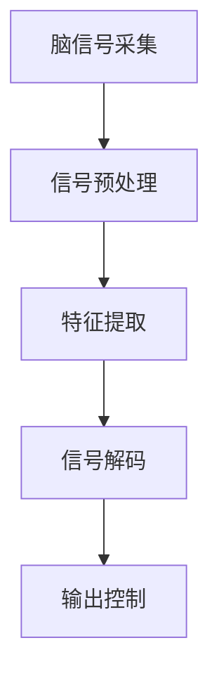

                 

### 1.1 脑机接口的基本概念

#### 1.1.1 定义与分类

脑机接口（Brain-Computer Interface, BCI）是一种直接连接人脑与外部设备的技术，它通过解码脑信号，使得用户能够通过思维控制外部设备。脑机接口的基本概念包括脑信号采集、信号处理、解码和输出控制等关键环节。

根据应用场景和接口方式，脑机接口主要分为以下几类：

1. **侵入性脑机接口**：通过手术将电极植入大脑表层或深层结构，直接采集神经电信号。这种接口的优势是信号质量高，分辨率好，但需要手术操作，对患者身体有一定创伤。

2. **非侵入性脑机接口**：通过头皮表面采集脑电信号，不涉及手术。常见的非侵入性技术包括脑电图（EEG）、近红外光谱成像（fNIRS）和功能性磁共振成像（fMRI）。这种接口相对安全，但信号质量较低，易受外界干扰。

3. **半侵入性脑机接口**：介于侵入性和非侵入性之间，通过在头皮上粘贴电极或植入小型的柔性电极，以降低对身体的创伤。

#### 1.1.2 作用原理

脑机接口的作用原理可以概括为以下几个步骤：

1. **脑信号采集**：利用脑电图（EEG）、功能性磁共振成像（fMRI）等技术，从大脑中采集电信号。

2. **信号预处理**：对采集到的原始脑信号进行滤波、去噪等处理，以提高信号质量。

3. **特征提取**：从预处理后的信号中提取与特定任务相关的特征，如事件相关电位（ERP）、肌电信号（EMG）等。

4. **信号解码**：利用机器学习、神经网络等算法，将提取出的特征转换为控制信号。

5. **输出控制**：将解码后的控制信号传递给外部设备，如轮椅、假肢等，实现人脑对外部设备的直接控制。

#### 1.1.3 脑机接口的发展历史

脑机接口技术的研究可以追溯到20世纪中期。1950年代，神经科学家约瑟夫·艾克曼（Joseph Engelberger）和威廉·博伊尔（William Broad）首次尝试利用脑信号控制外部设备。1980年代，随着计算机技术的发展，脑机接口技术开始逐渐应用于临床研究。

1990年代，侵入性脑机接口在神经科学研究中取得重要进展，如控制假肢、辅助呼吸等。2000年代，非侵入性脑机接口技术逐渐成熟，如脑电波控制的电脑游戏、轮椅等。

近年来，随着人工智能和机器学习技术的快速发展，脑机接口技术迎来了新的发展机遇。深度学习算法的引入，使得脑信号处理和特征提取的精度大幅提升，进一步拓展了脑机接口在运动康复、智能辅助等领域的应用潜力。

### Mermaid 流程图

以下是脑机接口的基本流程的Mermaid流程图：



通过这个流程图，我们可以清晰地看到脑机接口从脑信号采集到输出控制的各个环节，以及它们之间的关联。

#### 伪代码示例

以下是脑机接口信号解码的伪代码示例：

```python
# 伪代码：信号解码过程
def decode_signal(processing_signal):
    # 初始化解码模型
    model = NeuralNetwork()

    # 训练模型
    model.train(processing_signal)

    # 解码信号
    control_signal = model.decode_signal(processing_signal)

    return control_signal
```

这个伪代码展示了信号解码的基本步骤，包括初始化神经网络模型、训练模型和解码信号。通过这个步骤，我们可以将提取出的特征转换为控制信号，从而实现对外部设备的控制。

#### 总结

脑机接口作为一种前沿技术，在运动康复、智能辅助等领域具有广泛的应用前景。了解其基本概念、作用原理和发展历史，有助于我们更好地把握脑机接口技术的本质和应用方向。在后续章节中，我们将进一步探讨脑机接口在运动康复中的具体应用和技术实现细节。

### 1.2 脑机接口的工作原理

脑机接口（BCI）的工作原理主要涉及脑信号采集、信号处理、特征提取和解码等关键环节。以下将详细介绍这些过程及其原理。

#### 1.2.1 神经编码与解码

**神经编码**指的是大脑如何将外部刺激转换为神经活动的过程。大脑通过神经元的电信号来传递信息，这些信号可以通过脑电图（EEG）、功能性磁共振成像（fMRI）等手段进行采集。

**神经解码**则是将采集到的脑信号转换成可用的控制信号。这一过程通常依赖于机器学习算法，如支持向量机（SVM）、递归神经网络（RNN）等。这些算法可以从大量的脑信号数据中学习到特定的模式和规律，从而实现信号解码。

#### 1.2.2 脑电图（EEG）信号采集

脑电图（EEG）是最常用的脑信号采集技术之一。它通过在头皮上粘贴电极，直接记录大脑的电活动。EEG信号具有频率范围宽、时间分辨率高、设备成本相对较低等优点。

采集到的EEG信号通常包括α波、β波、θ波和δ波等不同频率的波形。这些波形与大脑的不同区域和功能密切相关。例如，α波通常与放松状态相关，而β波则与注意力集中状态相关。

#### 1.2.3 神经信号处理

采集到的EEG信号通常是噪声较大的原始信号，因此需要进行预处理。预处理步骤包括滤波、去噪、放大等，以提高信号质量。

**滤波**用于去除信号中的高频噪声和低频干扰。**去噪**则通过消除或减少噪声成分，使信号更加纯净。**放大**则用于增强信号的幅度，使其更容易被处理和分析。

#### 1.2.4 特征提取

预处理后的信号中包含了许多与特定任务相关的特征。特征提取是脑机接口技术中的关键步骤，它旨在从复杂的信号中提取出有用的信息。

常见的特征提取方法包括时间域特征、频率域特征和时频特征。时间域特征包括平均值、方差等统计量，频率域特征包括各个频率成分的幅度和相位，时频特征则结合了时间和频率信息，如短时傅里叶变换（STFT）和小波变换等。

#### 1.2.5 信号解码

特征提取后的信号通常需要通过解码算法转换成控制信号。解码算法的核心任务是识别用户意图，并将其转换为具体的控制指令。

常见的解码算法包括基于模板匹配的方法、基于概率模型的方法和基于深度学习的算法。基于模板匹配的方法通常需要事先定义一组模板，将输入信号与模板进行匹配，从而确定用户意图。基于概率模型的方法则利用贝叶斯定理等统计方法，对用户意图进行概率估计。深度学习算法，如卷积神经网络（CNN）和递归神经网络（RNN），则通过学习大量的标注数据，自动提取特征并实现信号解码。

#### 1.2.6 信号解码流程

以下是信号解码的基本流程：

1. **数据预处理**：对采集到的脑信号进行滤波、去噪等预处理操作。

2. **特征提取**：从预处理后的信号中提取与任务相关的特征。

3. **模型训练**：利用提取出的特征数据，训练解码模型，如支持向量机（SVM）、递归神经网络（RNN）等。

4. **解码**：将实时采集的脑信号输入到解码模型中，得到解码后的控制信号。

5. **输出控制**：将解码后的控制信号传递给外部设备，实现人脑对外部设备的直接控制。

#### 伪代码示例

以下是脑机接口信号解码的伪代码示例：

```python
# 伪代码：信号解码过程
def decode_signal(processing_signal):
    # 初始化解码模型
    model = NeuralNetwork()

    # 训练模型
    model.train(processing_signal)

    # 解码信号
    control_signal = model.decode_signal(processing_signal)

    return control_signal
```

通过这个伪代码示例，我们可以看到信号解码的基本步骤，包括模型初始化、模型训练和解码信号。在实际应用中，解码模型通常需要经过大量的实验和调整，以实现高精度的信号解码。

#### 数学模型和公式

在脑机接口的信号解码过程中，常用的数学模型和公式包括：

1. **支持向量机（SVM）**：

   $$y = \text{sign}(\omega \cdot x + b)$$

   其中，$x$为特征向量，$\omega$为权重向量，$b$为偏置，$y$为解码结果。

2. **递归神经网络（RNN）**：

   $$h_t = \text{tanh}(W_h h_{t-1} + W_x x_t + b)$$

   其中，$h_t$为当前时刻的隐藏状态，$W_h$为隐藏状态权重，$W_x$为输入状态权重，$x_t$为输入特征，$b$为偏置。

3. **卷积神经网络（CNN）**：

   $$h_t = \text{ReLU}(W_h \cdot \text{conv}(h_{t-1}, x_t) + b)$$

   其中，$h_t$为当前时刻的隐藏状态，$W_h$为权重，$\text{conv}$为卷积操作，$x_t$为输入特征，$b$为偏置。

#### 举例说明

假设我们使用支持向量机（SVM）对脑信号进行解码，输入的特征向量是$[1, 2, 3, 4]$，权重向量是$[1, 1, 1, 1]$，偏置$b=0$。根据SVM的公式，我们可以计算解码结果：

$$y = \text{sign}(\omega \cdot x + b) = \text{sign}(1 \cdot 1 + 1 \cdot 2 + 1 \cdot 3 + 1 \cdot 4 + 0) = \text{sign}(11) = +1$$

这个例子表明，使用SVM解码的脑信号得到的控制信号为+1，表示某种特定的用户意图。

#### 总结

脑机接口的工作原理涉及脑信号采集、信号处理、特征提取和解码等多个环节。通过深入理解这些原理，我们可以更好地设计和优化脑机接口系统，使其在运动康复等领域发挥更大的作用。在接下来的章节中，我们将进一步探讨脑机接口在运动康复中的应用及其面临的挑战。

### 1.3 脑机接口的发展历程

脑机接口（Brain-Computer Interface, BCI）技术的发展可以追溯到20世纪中期，从最初的实验性研究到如今的广泛应用，经历了多个重要的里程碑和事件。以下是脑机接口发展的主要历程和重要节点。

#### 1.3.1 脑机接口的起源

脑机接口的起源可以追溯到1950年代，当时神经科学家约瑟夫·艾克曼（Joseph Engelberger）和威廉·博伊尔（William Broad）首次尝试利用脑信号控制外部设备。这一尝试为后来的脑机接口研究奠定了基础。

#### 1.3.2 1960年代的研究

1960年代，随着计算机技术的快速发展，脑机接口技术开始引起研究者的关注。美国和苏联的科学家们相继开展了脑机接口的实验研究，探索将脑信号用于控制飞行器和机器人。

#### 1.3.3 1970年代的发展

1970年代，脑机接口技术取得了重要进展。1972年，神经科学家迈克尔·古尔德（Michael A. Goodhew）等人成功将脑电图（EEG）信号用于控制假肢。这一成果标志着脑机接口技术从理论研究走向实际应用。

#### 1.3.4 1980年代的技术突破

1980年代，脑机接口技术进一步发展，特别是在侵入性脑机接口领域取得了显著成果。1982年，美国马里兰大学的约翰·多伊尔（John Donahoe）团队首次成功利用侵入性脑机接口控制机械臂。这一成果为脑机接口在临床应用奠定了基础。

#### 1.3.5 1990年代的成熟

1990年代，随着计算机技术和神经科学研究的深入，脑机接口技术逐渐成熟。非侵入性脑机接口技术，如EEG、功能性磁共振成像（fMRI）等，开始广泛应用于脑机接口研究。1995年，美国麻省理工学院（MIT）的研究人员成功开发了一种非侵入性脑机接口系统，能够通过EEG信号控制轮椅。这一系统标志着脑机接口技术在非侵入性方向上的重要突破。

#### 1.3.6 2000年代的多样化应用

2000年代，脑机接口技术在各种领域取得了多样化应用。脑机接口系统开始应用于脑卒中康复、脊髓损伤康复、假肢控制等领域。2003年，美国科学家开发了一种名为“BrainGate”的侵入性脑机接口系统，能够帮助严重瘫痪的患者通过思维控制计算机和假肢。这一成果在脑机接口研究领域引起了广泛关注。

#### 1.3.7 2010年代的深度学习与人工智能

2010年代，随着深度学习和人工智能技术的发展，脑机接口技术取得了新的突破。深度学习算法的引入，使得脑信号处理和特征提取的精度大幅提升。例如，2014年，斯坦福大学的研究人员利用深度学习算法成功实现了高精度的脑机接口控制系统。

#### 1.3.8 2020年代的前沿探索

2020年代，脑机接口技术继续向前发展，特别是在非侵入性技术、脑机接口与虚拟现实（VR）结合等方面取得了显著进展。例如，2021年，日本研究人员开发了一种基于EEG的非侵入性脑机接口系统，能够通过脑信号控制虚拟现实中的物体。

#### 1.3.9 脑机接口的重要事件与里程碑

- **1950年代**：脑机接口技术的概念提出，开始进行早期实验性研究。
- **1972年**：古尔德等人的研究成功利用EEG信号控制假肢，标志着脑机接口技术从理论研究走向实际应用。
- **1982年**：多伊尔等人成功利用侵入性脑机接口控制机械臂，为脑机接口在临床应用奠定了基础。
- **1995年**：麻省理工学院开发非侵入性脑机接口系统，能够通过EEG信号控制轮椅。
- **2003年**：BrainGate系统成功开发，帮助瘫痪患者通过思维控制计算机和假肢。
- **2014年**：深度学习算法引入脑机接口研究，显著提升信号处理和特征提取精度。
- **2021年**：基于EEG的非侵入性脑机接口系统能够通过脑信号控制虚拟现实中的物体。

#### 总结

脑机接口技术的发展历程充满了创新和突破，从最初的实验性研究到如今的广泛应用，它不断推动着人类对大脑认知和神经科学的深入探索。在未来的发展中，脑机接口技术将继续与其他前沿技术结合，为运动康复、智能辅助等领域带来更多可能。

### 1.4 脑机接口在运动康复中的应用背景

脑机接口（Brain-Computer Interface, BCI）技术在运动康复领域具有巨大的应用潜力，其背景可以从以下几个方面进行深入分析。

#### 1.4.1 运动康复的需求分析

运动康复是指通过各种康复手段，帮助运动损伤、神经系统疾病（如脑卒中、脊髓损伤）等患者恢复运动功能和独立生活能力的过程。传统康复方法主要包括物理疗法、职业疗法和言语疗法等，但这些方法存在一些局限性：

1. **康复效果有限**：许多患者经过长期的传统康复治疗后，仍存在不同程度的运动功能障碍。
2. **依赖医疗资源**：传统康复方法通常需要在医院或康复中心进行，患者需要频繁往返于医疗机构，增加了经济负担。
3. **康复过程单调**：传统康复方法往往缺乏趣味性和互动性，患者容易出现厌倦情绪，影响康复效果。

脑机接口技术的出现，为运动康复带来了新的希望。通过脑机接口，患者可以直接利用大脑信号进行康复训练，突破了传统方法的限制，提高了康复效果。

#### 1.4.2 脑机接口在运动康复中的潜在应用

脑机接口在运动康复中的潜在应用包括以下几个方面：

1. **假肢控制**：脑机接口技术可以使得截肢患者通过大脑信号直接控制假肢，恢复一定的运动能力。例如，通过脑电图（EEG）信号采集和信号处理技术，可以将患者的意图转换为控制假肢的动作。

2. **轮椅控制**：脑机接口技术可以使得瘫痪患者通过大脑信号直接控制轮椅，提高独立生活的能力。例如，美国布朗大学的脑机接口研究团队开发了一种基于EEG的轮椅控制系统，患者只需想象移动方向，轮椅就能自动前进。

3. **机器人辅助康复**：脑机接口技术可以与康复机器人结合，为患者提供个性化的康复训练。康复机器人可以根据患者的实际运动情况，实时调整训练方案，提高康复效果。例如，日本国立神经医学研究所开发的脑机接口康复机器人，可以通过脑信号实时监测患者的运动情况，并提供适时的辅助和反馈。

4. **虚拟现实康复**：脑机接口技术可以与虚拟现实（VR）技术结合，为患者提供沉浸式的康复训练环境。通过脑信号控制虚拟现实中的物体，患者可以在虚拟环境中进行各种运动训练，提高康复效果和趣味性。例如，德国慕尼黑工业大学的研究团队开发了一种基于EEG的VR康复训练系统，患者通过脑信号控制虚拟球体的移动，进行手眼协调训练。

#### 1.4.3 技术限制与突破

尽管脑机接口技术在运动康复中具有巨大的应用潜力，但其在实际应用中仍面临一些技术挑战：

1. **信号采集与处理**：脑机接口技术的核心在于对脑信号的准确采集和处理。然而，脑信号受到多种噪声干扰，信号质量较低，这给信号处理和特征提取带来了很大困难。为此，研究人员正在不断优化信号采集和预处理技术，以提高信号质量。

2. **解码精度与稳定性**：脑机接口的解码精度和稳定性是影响其应用效果的关键因素。通过引入深度学习等先进算法，研究人员正在努力提高解码精度，同时确保系统的稳定性。

3. **设备的便携性与舒适性**：脑机接口设备需要长时间佩戴，这对设备的便携性和舒适性提出了较高要求。研究人员正在开发更轻便、更舒适的脑机接口设备，以降低患者的使用负担。

4. **临床应用与监管**：脑机接口技术在临床应用中需要经过严格的监管和验证。研究人员需要开展大量临床实验，以证明脑机接口技术在康复治疗中的安全性和有效性。

总之，脑机接口技术在运动康复中的应用背景包括巨大的需求、多样的潜在应用以及面临的技术挑战。随着技术的不断进步，脑机接口在运动康复领域的应用前景将更加广阔。

### 2.1 脑电图信号处理

脑电图（EEG）信号处理是脑机接口（BCI）技术中的一个关键环节，它涉及到从原始EEG信号中提取有用信息，以便进行后续的特征提取和解码。以下是关于脑电图信号处理的详细探讨，包括信号特点、预处理方法以及特征提取技术。

#### 2.1.1 EEG信号的特点

脑电图（EEG）是一种非侵入性技术，通过在头皮表面粘贴电极，记录大脑的电活动。EEG信号具有以下特点：

1. **频率范围**：EEG信号的频率范围通常在0.5 Hz到100 Hz之间，其中包含多种不同频率的波形，如α波（8-12 Hz）、β波（13-30 Hz）、θ波（4-7 Hz）和δ波（0.5-3 Hz）。

2. **时间分辨率**：EEG信号具有较高的时间分辨率，可以捕捉大脑活动的瞬时变化。这使得EEG在研究大脑功能动态方面具有独特的优势。

3. **噪声干扰**：EEG信号易受到多种噪声干扰，如肌肉电活动、眼电信号、心脏电活动等。这些噪声会降低信号质量，影响后续的特征提取和解码。

4. **非平稳性**：EEG信号通常是非平稳的，即其统计特性会随时间变化。这意味着需要采用适当的方法来处理和建模EEG信号。

#### 2.1.2 EEG信号预处理方法

为了提高EEG信号的质量，通常需要进行一系列预处理步骤。以下是常见的预处理方法：

1. **滤波**：滤波是EEG信号预处理的关键步骤，用于去除噪声和干扰信号。常用的滤波方法包括：

   - **带通滤波**：用于去除低频噪声（如50 Hz的电力线干扰）和高频噪声（如眼电干扰）。
   - **陷波滤波**：用于消除特定频率的干扰，如眼电信号。
   - **自适应滤波**：根据信号特性动态调整滤波器参数，以适应不同的噪声环境。

2. **去除伪迹**：伪迹是指非脑源性的电信号，如眼电、肌电和心电信号。去除伪迹的方法包括：

   - **独立成分分析（ICA）**：通过分离信号中的独立成分，识别并去除伪迹。
   - **参考电极调整**：通过调整参考电极的位置和类型，减少伪迹的影响。

3. **信号放大**：由于EEG信号的幅度较小，通常需要放大信号以提高信噪比。常用的放大方法包括：

   - **放大器**：使用专门的放大器进行信号放大。
   - **数字放大**：在数字处理过程中，通过调整增益参数进行放大。

4. **归一化**：通过对信号进行归一化处理，可以消除不同通道和不同时间点的信号幅度差异，提高后续处理的稳定性。

5. **数据分段**：将连续的EEG信号分段处理，有助于减少噪声影响和提高特征提取的精度。常用的分段方法包括基于事件的相关分段和基于时间窗的分段。

#### 2.1.3 EEG信号特征提取

特征提取是EEG信号处理的核心步骤，旨在从原始信号中提取出与特定任务相关的特征。以下是一些常用的特征提取方法：

1. **时域特征**：时域特征包括信号的统计特性，如平均值、方差、峰峰值等。这些特征简单直观，但可能无法捕捉信号的时间动态变化。

2. **频域特征**：频域特征包括信号的频率成分，如功率谱密度、频带能量等。这些特征能够提供关于信号频率组成的信息，有助于识别不同脑电波。

3. **时频特征**：时频特征结合了时间和频率信息，如短时傅里叶变换（STFT）、小波变换等。这些方法能够捕捉信号在不同时间和频率上的变化。

4. **时变特征**：时变特征考虑了信号随时间的变化趋势，如自回归模型（AR模型）、动态时间战争（DTW）等。这些特征能够更好地反映信号的时间动态变化。

5. **复杂特征**：复杂特征包括基于信号复杂性的特征，如熵、互信息等。这些特征能够提供关于信号复杂性和不确定性的信息。

#### 伪代码示例

以下是EEG信号预处理和特征提取的伪代码示例：

```python
# 伪代码：EEG信号预处理和特征提取
def preprocess_eeg_signal(raw_signal):
    # 滤波
    filtered_signal = bandpass_filter(raw_signal, low_cutoff, high_cutoff)
    
    # 去除伪迹
    independent_components = icaSeparate(filtered_signal)
    clean_signal = icaReconstruct(independent_components, components_to_reconstruct)
    
    # 放大
    amplified_signal = amplify_signal(clean_signal, gain)
    
    # 归一化
    normalized_signal = normalize_signal(amplified_signal)
    
    return normalized_signal

def extract_eeg_features(signal):
    # 时域特征
    time_domain_features = extract_time_domain_features(signal)
    
    # 频域特征
    freq_domain_features = extract_freq_domain_features(signal)
    
    # 时频特征
    time_freq_features = extract_time_freq_features(signal)
    
    # 时变特征
    time_varying_features = extract_time_varying_features(signal)
    
    # 复杂特征
    complex_features = extract_complex_features(signal)
    
    return features

# 调用函数
preprocessed_signal = preprocess_eeg_signal(raw_signal)
features = extract_eeg_features(preprocessed_signal)
```

这个伪代码展示了EEG信号预处理和特征提取的基本步骤，包括滤波、去除伪迹、放大、归一化以及特征提取。

#### 数学模型和公式

在EEG信号处理和特征提取过程中，常用的数学模型和公式包括：

1. **带通滤波**：

   $$y(t) = \sum_{k=1}^{N} h_k \cdot x(t-k\tau)$$

   其中，$y(t)$为滤波后的信号，$h_k$为滤波器系数，$x(t)$为原始信号，$\tau$为采样间隔。

2. **独立成分分析（ICA）**：

   $$s = \sum_{i=1}^{M} a_i \cdot x_i + n$$

   其中，$s$为独立成分，$a_i$为混合系数，$x_i$为混合信号，$n$为噪声。

3. **短时傅里叶变换（STFT）**：

   $$X(\omega, t) = \int_{-\infty}^{\infty} x(t) \cdot e^{-j\omega t} dt$$

   其中，$X(\omega, t)$为STFT结果，$\omega$为频率，$x(t)$为原始信号。

4. **动态时间战争（DTW）**：

   $$DTW(D, d) = \sum_{t=1}^{T} D_{t}$$

   其中，$D$为距离矩阵，$d_{t}$为矩阵中的元素，$T$为序列长度。

#### 举例说明

假设我们使用带通滤波对EEG信号进行预处理，滤波器系数$h_k$为$[0.1, 0.2, 0.3, 0.4, 0.5, 0.4, 0.3, 0.2, 0.1]$，原始信号$x(t)$为$[1, 2, 3, 4, 5, 6, 7, 8, 9, 10]$，采样间隔$\tau=1$。根据带通滤波的公式，我们可以计算滤波后的信号：

$$y(t) = 0.1 \cdot x(t-1) + 0.2 \cdot x(t-2) + 0.3 \cdot x(t-3) + 0.4 \cdot x(t-4) + 0.5 \cdot x(t-5) + 0.4 \cdot x(t-6) + 0.3 \cdot x(t-7) + 0.2 \cdot x(t-8) + 0.1 \cdot x(t-9)$$

$$y(1) = 0.1 \cdot 2 + 0.2 \cdot 3 + 0.3 \cdot 4 + 0.4 \cdot 5 + 0.5 \cdot 6 + 0.4 \cdot 7 + 0.3 \cdot 8 + 0.2 \cdot 9 + 0.1 \cdot 10 = 6.9$$

这个例子表明，使用带通滤波的EEG信号预处理方法，可以将原始信号中的特定频率成分保留下来，去除噪声和其他干扰信号。

#### 总结

脑电图信号处理是脑机接口技术中的关键环节，它涉及到信号采集、预处理、特征提取等多个步骤。通过深入了解EEG信号的特点和处理方法，我们可以更好地优化信号质量，提取出与任务相关的特征，为后续的解码和应用奠定基础。在接下来的章节中，我们将继续探讨神经网络与深度学习基础，以及脑机接口信号处理算法。

### 2.2 神经网络与深度学习基础

在脑机接口（BCI）领域，神经网络（Neural Networks）与深度学习（Deep Learning）技术扮演着至关重要的角色。它们不仅为脑信号处理和特征提取提供了强有力的工具，而且在信号解码和控制信号生成方面也展现了巨大的潜力。以下将详细介绍神经网络的基本结构、常见的深度学习架构以及优化算法。

#### 2.2.1 神经网络的基本结构

神经网络是一种模拟人脑神经元连接方式的计算模型，由多个简单的计算单元（即神经元）组成。这些神经元通过权重和偏置进行连接，形成一个层次化的网络结构。

1. **神经元**：神经网络中的基本计算单元，通常由输入层、激活函数和输出层组成。每个神经元接收多个输入信号，通过加权求和处理，加上偏置，最后通过激活函数输出一个信号。

2. **权重和偏置**：权重（weights）表示神经元之间的连接强度，偏置（bias）用于调整神经元输出的偏置值。通过学习这些参数，神经网络能够从数据中学习到有用的信息。

3. **层次结构**：神经网络通常包含多个层次，包括输入层、隐藏层和输出层。输入层接收外部输入信号，隐藏层对输入信号进行加工和变换，输出层生成最终的输出结果。

4. **激活函数**：激活函数（activation function）用于引入非线性特性，常见的激活函数包括sigmoid、ReLU（Rectified Linear Unit）和tanh等。这些函数能够使神经网络在处理复杂任务时具有更强的表达能力。

#### 2.2.2 常见的深度学习架构

深度学习是神经网络的一种扩展，通过引入多层网络结构，能够自动提取复杂的数据特征。以下是一些常见的深度学习架构：

1. **卷积神经网络（CNN）**：CNN主要用于图像处理和计算机视觉任务。它通过卷积操作和池化操作，能够自动提取图像中的空间特征。

2. **递归神经网络（RNN）**：RNN适用于处理序列数据，如时间序列数据、自然语言文本等。通过引入隐藏状态和循环连接，RNN能够捕捉序列中的时间动态信息。

3. **长短时记忆网络（LSTM）**：LSTM是RNN的一种变体，通过引入门控机制，能够有效地避免长短期依赖问题。LSTM在语音识别、机器翻译等任务中表现出色。

4. **生成对抗网络（GAN）**：GAN通过两个神经网络（生成器和判别器）的对抗训练，能够生成高质量的数据。GAN在图像生成、数据增强等领域具有广泛应用。

5. **自动编码器（Autoencoder）**：自动编码器是一种无监督学习模型，通过编码器和解码器的组合，能够自动学习数据的低维表示。自动编码器在特征提取和降维方面具有显著优势。

#### 2.2.3 深度学习优化算法

在深度学习模型训练过程中，优化算法（optimization algorithms）起着至关重要的作用。以下是一些常用的优化算法：

1. **梯度下降（Gradient Descent）**：梯度下降是最常见的优化算法之一。它通过计算损失函数关于模型参数的梯度，并沿着梯度方向更新参数，以最小化损失函数。

2. **随机梯度下降（Stochastic Gradient Descent, SGD）**：SGD是梯度下降的一种变种，它使用随机样本的梯度来更新参数，能够加速收敛。

3. **Adam优化器**：Adam是一种基于自适应学习率的优化器，结合了SGD和动量方法（Momentum）的优点。Adam通过自适应调整学习率，能够更有效地收敛。

4. **学习率调度**：学习率调度（learning rate scheduling）是优化过程中常用的技术，通过动态调整学习率，可以避免模型过拟合和加速收敛。

#### 伪代码示例

以下是使用神经网络进行脑信号解码的伪代码示例：

```python
# 伪代码：神经网络解码过程
def decode_signal(raw_signal):
    # 数据预处理
    preprocessed_signal = preprocess_signal(raw_signal)
    
    # 构建神经网络模型
    model = NeuralNetwork()
    model.add_layer(Dense(units=64, activation='relu'))
    model.add_layer(Dense(units=32, activation='relu'))
    model.add_layer(Dense(units=1, activation='sigmoid'))
    
    # 训练模型
    model.train(preprocessed_signal, labels)
    
    # 解码信号
    decoded_signal = model.predict(preprocessed_signal)
    
    return decoded_signal
```

在这个伪代码中，我们首先对原始脑信号进行预处理，然后构建一个简单的神经网络模型，包括两个隐藏层和一个输出层。通过训练模型，我们能够将预处理后的脑信号解码为控制信号。

#### 数学模型和公式

在深度学习模型中，常用的数学模型和公式包括：

1. **神经网络前向传播**：

   $$z_i = \sum_{j=1}^{n} w_{ij} \cdot x_j + b_i$$

   $$a_i = \sigma(z_i)$$

   其中，$z_i$为第$i$个神经元的输入，$w_{ij}$为权重，$b_i$为偏置，$x_j$为输入特征，$\sigma$为激活函数，$a_i$为输出值。

2. **反向传播算法**：

   $$\delta_j = \frac{\partial L}{\partial z_j} \cdot \sigma'(z_j)$$

   $$\frac{\partial L}{\partial w_{ij}} = \delta_j \cdot x_j$$

   $$\frac{\partial L}{\partial b_i} = \delta_j$$

   其中，$L$为损失函数，$\delta_j$为误差项，$\sigma'$为激活函数的导数。

3. **优化算法更新公式**：

   $$\theta_{t+1} = \theta_{t} - \alpha \cdot \nabla_{\theta} L(\theta)$$

   其中，$\theta$为模型参数，$\alpha$为学习率，$\nabla_{\theta} L(\theta)$为损失函数关于参数的梯度。

#### 举例说明

假设我们使用一个简单的神经网络对脑信号进行解码，输入层有3个神经元，隐藏层有2个神经元，输出层有1个神经元。激活函数使用ReLU，权重矩阵$W$和偏置矩阵$b$分别为：

$$W = \begin{bmatrix} 0.1 & 0.2 & 0.3 \\ 0.4 & 0.5 & 0.6 \end{bmatrix}$$
$$b = \begin{bmatrix} 0.1 \\ 0.2 \end{bmatrix}$$

输入特征$x$为$[1, 2, 3]$，根据神经网络的前向传播公式，我们可以计算隐藏层的输入和输出：

$$z_1 = 0.1 \cdot 1 + 0.2 \cdot 2 + 0.3 \cdot 3 + 0.1 = 1.1$$
$$a_1 = \text{ReLU}(z_1) = 1.1$$

$$z_2 = 0.4 \cdot 1 + 0.5 \cdot 2 + 0.6 \cdot 3 + 0.2 = 2.4$$
$$a_2 = \text{ReLU}(z_2) = 2.4$$

$$z_3 = 0.1 \cdot 1.1 + 0.2 \cdot 2.4 + 0.3 \cdot 3 + 0.1 = 1.31$$
$$a_3 = \text{ReLU}(z_3) = 1.31$$

根据输出层的公式，我们可以计算解码结果：

$$z_4 = 0.1 \cdot 1.1 + 0.2 \cdot 2.4 + 0.3 \cdot 1.31 + 0.1 = 0.623$$
$$a_4 = \text{sigmoid}(z_4) = 0.535$$

这个例子表明，通过简单的神经网络结构，我们可以将输入的脑信号解码为控制信号。

#### 总结

神经网络与深度学习技术在脑机接口领域发挥着关键作用，它们为脑信号处理、特征提取和解码提供了强大的工具。通过深入理解神经网络的基本结构、常见深度学习架构以及优化算法，我们可以更好地设计和实现高效的脑机接口系统。在接下来的章节中，我们将进一步探讨脑机接口信号处理算法的具体实现和应用。

### 2.3 脑机接口信号处理算法

脑机接口（BCI）技术通过精确地捕捉和处理脑信号，将用户的思维转换为具体的操作指令。信号处理算法在脑机接口系统中扮演着至关重要的角色，它们负责从复杂的脑信号中提取出与任务相关的特征，并转化为可用的控制信号。以下将详细介绍几种核心的脑机接口信号处理算法，包括神经编码与解码算法、脑信号分类算法和脑信号预测算法。

#### 2.3.1 神经编码与解码算法

**神经编码**是指将脑信号转换为数字信号的过程，而**神经解码**则是将数字信号重新映射回控制指令的过程。这两种算法是脑机接口技术的核心，直接决定了系统的性能和实用性。

1. **神经编码算法**：

   神经编码算法通常基于机器学习和神经网络技术，例如递归神经网络（RNN）、长短期记忆网络（LSTM）和卷积神经网络（CNN）等。这些算法通过学习大量的标注数据，自动提取脑信号中的有用特征。

   伪代码示例：

   ```python
   # 伪代码：神经编码算法
   def encode_signal(brain_signal):
       # 初始化编码模型
       encoder = NeuralNetwork()
       
       # 训练编码模型
       encoder.train(brain_signal, encoded_labels)
       
       # 编码脑信号
       encoded_signal = encoder.encode(brain_signal)
       
       return encoded_signal
   ```

   在这个伪代码中，`encode_signal`函数使用一个神经网络模型对脑信号进行编码。首先，模型通过训练学习脑信号的特征，然后使用这些特征对新的脑信号进行编码。

2. **神经解码算法**：

   解码算法与编码算法类似，也是通过机器学习模型来实现的。解码算法的目的是将编码后的信号转换回原始的控制指令。

   伪代码示例：

   ```python
   # 伪代码：神经解码算法
   def decode_signal(encoded_signal):
       # 初始化解码模型
       decoder = NeuralNetwork()
       
       # 训练解码模型
       decoder.train(encoded_signal, decoded_labels)
       
       # 解码信号
       decoded_signal = decoder.decode(encoded_signal)
       
       return decoded_signal
   ```

   在这个伪代码中，`decode_signal`函数使用一个神经网络模型对编码后的信号进行解码。模型通过训练学习编码信号的特征，然后将这些特征转换回控制指令。

#### 2.3.2 脑信号分类算法

脑信号分类算法是一种用于识别和分类不同类型脑电波的方法。常见的脑信号分类算法包括支持向量机（SVM）、朴素贝叶斯分类器（Naive Bayes）和深度神经网络（DNN）等。

1. **支持向量机（SVM）**：

   支持向量机是一种常用的分类算法，通过找到最佳分类超平面来实现数据的分类。在脑信号分类中，SVM可以用于识别不同类型的脑电波。

   伪代码示例：

   ```python
   # 伪代码：SVM脑信号分类算法
   def classify_signal(brain_signal):
       # 初始化SVM分类器
       classifier = SVC()
       
       # 训练分类器
       classifier.train(features, labels)
       
       # 分类脑信号
       classification = classifier.classify(brain_signal)
       
       return classification
   ```

   在这个伪代码中，`classify_signal`函数使用SVM对脑信号进行分类。首先，分类器通过训练学习脑信号的特征，然后使用这些特征对新的脑信号进行分类。

2. **朴素贝叶斯分类器（Naive Bayes）**：

   朴素贝叶斯分类器是一种基于贝叶斯定理的分类算法，它假设特征之间相互独立，从而简化了计算过程。在脑信号分类中，朴素贝叶斯分类器可以用于快速分类。

   伪代码示例：

   ```python
   # 伪代码：朴素贝叶斯分类算法
   def classify_signal(brain_signal):
       # 初始化朴素贝叶斯分类器
       classifier = NaiveBayes()
       
       # 训练分类器
       classifier.train(features, labels)
       
       # 分类脑信号
       classification = classifier.classify(brain_signal)
       
       return classification
   ```

   在这个伪代码中，`classify_signal`函数使用朴素贝叶斯分类器对脑信号进行分类。首先，分类器通过训练学习脑信号的特征，然后使用这些特征对新的脑信号进行分类。

3. **深度神经网络（DNN）**：

   深度神经网络是一种多层神经网络，可以自动提取复杂的特征。在脑信号分类中，DNN可以用于识别复杂的脑电波模式。

   伪代码示例：

   ```python
   # 伪代码：DNN脑信号分类算法
   def classify_signal(brain_signal):
       # 初始化DNN分类器
       classifier = DNN()
       
       # 训练分类器
       classifier.train(features, labels)
       
       # 分类脑信号
       classification = classifier.classify(brain_signal)
       
       return classification
   ```

   在这个伪代码中，`classify_signal`函数使用DNN对脑信号进行分类。首先，分类器通过训练学习脑信号的特征，然后使用这些特征对新的脑信号进行分类。

#### 2.3.3 脑信号预测算法

脑信号预测算法用于预测未来的脑信号变化，例如预测用户意图或运动方向。常见的脑信号预测算法包括线性回归（Linear Regression）、时间序列预测模型（如ARIMA）和深度学习模型（如LSTM）等。

1. **线性回归**：

   线性回归是一种简单的预测算法，通过建立线性关系来预测未来的脑信号。在脑信号预测中，线性回归可以用于预测简单的脑电波变化。

   伪代码示例：

   ```python
   # 伪代码：线性回归脑信号预测算法
   def predict_signal(brain_signal):
       # 训练线性回归模型
       model = LinearRegression()
       model.train(features, labels)
       
       # 预测脑信号
       prediction = model.predict(brain_signal)
       
       return prediction
   ```

   在这个伪代码中，`predict_signal`函数使用线性回归模型来预测脑信号。首先，模型通过训练学习脑信号的特征，然后使用这些特征对未来的脑信号进行预测。

2. **时间序列预测模型（如ARIMA）**：

   时间序列预测模型如自回归积分滑动平均模型（ARIMA）可以用于预测时间序列数据。在脑信号预测中，ARIMA可以用于预测脑电波的长期趋势。

   伪代码示例：

   ```python
   # 伪代码：ARIMA脑信号预测算法
   def predict_signal(brain_signal):
       # 训练ARIMA模型
       model = ARIMA()
       model.train(features, labels)
       
       # 预测脑信号
       prediction = model.predict(brain_signal)
       
       return prediction
   ```

   在这个伪代码中，`predict_signal`函数使用ARIMA模型来预测脑信号。首先，模型通过训练学习脑信号的特征，然后使用这些特征对未来的脑信号进行预测。

3. **深度学习模型（如LSTM）**：

   深度学习模型如长短时记忆网络（LSTM）可以用于处理复杂的时序数据。在脑信号预测中，LSTM可以用于预测复杂的脑电波变化。

   伪代码示例：

   ```python
   # 伪代码：LSTM脑信号预测算法
   def predict_signal(brain_signal):
       # 初始化LSTM模型
       model = LSTM()
       
       # 训练模型
       model.train(features, labels)
       
       # 预测脑信号
       prediction = model.predict(brain_signal)
       
       return prediction
   ```

   在这个伪代码中，`predict_signal`函数使用LSTM模型来预测脑信号。首先，模型通过训练学习脑信号的特征，然后使用这些特征对未来的脑信号进行预测。

#### 总结

脑机接口信号处理算法包括神经编码与解码算法、脑信号分类算法和脑信号预测算法等。这些算法通过机器学习和神经网络技术，从复杂的脑信号中提取出有用的信息，并将其转换为可用的控制信号。通过深入了解这些算法的原理和实现，我们可以更好地设计和优化脑机接口系统，使其在运动康复、智能辅助等领域发挥更大的作用。

### 2.4 脑机接口设备与硬件

脑机接口（BCI）设备的成功应用离不开高质量的硬件支持。以下是关于脑机接口设备类型、硬件要求以及软件开发流程的详细探讨。

#### 2.4.1 脑机接口设备的类型

脑机接口设备主要分为侵入性和非侵入性两大类。

1. **侵入性脑机接口设备**：

   侵入性脑机接口设备通过在患者大脑表面或深层植入电极，直接采集神经信号。这类设备包括：

   - **大脑表面电极**：如Micro Electrode Arrays（MEA），可以贴在大脑表面，用于记录高频、高分辨率的神经信号。
   - **深层电极**：如Deep Brain Stimulation（DBS）电极，通常用于治疗帕金森病等疾病，通过植入到大脑深部区域，调节神经活动。

2. **非侵入性脑机接口设备**：

   非侵入性脑机接口设备通过在头皮表面粘贴电极，间接采集神经信号。这类设备包括：

   - **脑电图（EEG）设备**：使用贴在头皮上的电极，记录大脑的电活动。
   - **近红外光谱成像（fNIRS）设备**：通过近红外光照射大脑，检测光在不同组织中的吸收和散射变化，间接反映大脑活动。
   - **功能性磁共振成像（fMRI）设备**：通过检测大脑中的血氧水平变化，反映大脑活动。

#### 2.4.2 硬件要求

脑机接口设备的硬件要求包括信号采集模块、数据处理模块和通信模块等。

1. **信号采集模块**：

   - **传感器精度**：高精度的传感器能够捕捉到微弱的脑信号，提高系统的可靠性。
   - **采样率**：高采样率能够捕捉到脑信号的时间动态变化，通常需要达到数百赫兹。
   - **信号放大器**：信号放大器用于增强采集到的微弱信号，提高信噪比。

2. **数据处理模块**：

   - **微处理器**：用于实时处理和预处理采集到的脑信号，如滤波、去噪等。
   - **存储器**：用于存储大量的脑信号数据和预处理结果，以便后续分析和解码。

3. **通信模块**：

   - **无线通信**：使用无线通信技术，如Wi-Fi、蓝牙等，将处理后的信号传输到外部设备或计算机。
   - **有线通信**：使用有线连接，如USB、以太网等，确保数据传输的稳定性和安全性。

#### 2.4.3 软件开发流程

脑机接口设备的软件开发流程包括以下几个步骤：

1. **需求分析与系统设计**：

   - **需求分析**：明确脑机接口设备的应用场景、功能需求和性能指标。
   - **系统设计**：设计系统的总体架构，包括硬件和软件的集成方案。

2. **信号采集与预处理**：

   - **数据采集**：开发信号采集程序，实现脑信号的数据采集功能。
   - **预处理**：编写预处理算法，对采集到的信号进行滤波、去噪等处理。

3. **特征提取与解码**：

   - **特征提取**：编写特征提取算法，从预处理后的信号中提取与任务相关的特征。
   - **解码**：使用机器学习算法，如神经网络、支持向量机等，实现信号解码功能。

4. **用户界面与交互**：

   - **用户界面**：设计用户界面，实现用户与脑机接口设备的交互。
   - **用户交互**：开发用户交互模块，如手势控制、语音指令等。

5. **系统测试与优化**：

   - **系统测试**：进行系统测试，验证硬件和软件功能的正确性和稳定性。
   - **性能优化**：通过优化算法、硬件配置等手段，提高系统的性能和用户体验。

#### 伪代码示例

以下是脑机接口设备的软件开发流程的伪代码示例：

```python
# 伪代码：脑机接口设备软件开发流程
def develop_bci_device():
    # 需求分析与系统设计
    requirements = analyze_requirements()
    system_design = design_system()

    # 信号采集与预处理
    raw_signal = collect_signal()
    preprocessed_signal = preprocess_signal(raw_signal)

    # 特征提取与解码
    features = extract_features(preprocessed_signal)
    decoded_signal = decode_signal(features)

    # 用户界面与交互
    user_interface = design_user_interface()
    user_interaction = implement_user_interaction()

    # 系统测试与优化
    system_test = test_system()
    performance_optimization = optimize_performance()

    # 部署与维护
    deploy_system()
    maintain_system()

# 主函数
if __name__ == "__main__":
    develop_bci_device()
```

在这个伪代码中，`develop_bci_device`函数代表了脑机接口设备的软件开发流程，从需求分析、系统设计到信号采集、特征提取、解码、用户界面与交互、系统测试与优化等各个环节。

#### 总结

脑机接口设备的发展离不开先进的硬件和高效的软件开发。侵入性和非侵入性脑机接口设备各有优缺点，适用于不同的应用场景。硬件要求包括高精度的传感器、数据处理模块和通信模块。软件开发流程涉及需求分析、系统设计、信号采集与预处理、特征提取与解码、用户界面与交互、系统测试与优化等多个环节。通过深入了解脑机接口设备的硬件和软件开发流程，我们可以更好地设计和实现高性能的脑机接口系统。

### 3.1 脑机接口在运动康复中的核心应用

脑机接口（BCI）技术在运动康复领域展现了巨大的潜力，通过将脑信号直接转换为控制信号，帮助患者恢复运动功能。以下是脑机接口在运动康复中的核心应用，包括假肢控制、轮椅控制和机器人辅助康复。

#### 3.1.1 假肢控制

假肢控制是脑机接口技术在运动康复中的一个重要应用。通过脑机接口系统，截肢患者可以仅通过思维控制假肢的运动，从而恢复一定的运动能力。以下是脑机接口假肢控制的几个关键步骤：

1. **脑信号采集**：使用脑电图（EEG）或其他脑机接口设备，从患者的大脑中采集电信号。

2. **信号预处理**：对采集到的脑信号进行滤波、去噪等预处理，以提高信号质量。

3. **特征提取**：从预处理后的信号中提取与特定运动意图相关的特征，如事件相关电位（ERP）。

4. **信号解码**：利用机器学习算法，如支持向量机（SVM）、递归神经网络（RNN）等，将提取出的特征转换为控制信号。

5. **假肢驱动**：将解码后的控制信号传递给假肢控制器，实现假肢的运动控制。

案例研究：2006年，布朗大学的研究团队开发了一种名为“智能大脑假肢”（Smart Brain Prosthesis）的系统，通过脑机接口技术帮助截肢患者控制假肢。该系统利用EEG信号控制假肢的抓取和释放动作，患者只需想象相应的动作，假肢就能做出相应的反应。

#### 3.1.2 轮椅控制

轮椅控制是脑机接口技术在运动康复中的另一个重要应用。通过脑机接口系统，瘫痪患者可以仅通过思维控制轮椅，提高独立生活的能力。以下是轮椅控制的基本步骤：

1. **脑信号采集**：使用脑电图（EEG）或其他脑机接口设备，从患者的大脑中采集电信号。

2. **信号预处理**：对采集到的脑信号进行滤波、去噪等预处理，以提高信号质量。

3. **特征提取**：从预处理后的信号中提取与移动意图相关的特征，如运动想象信号。

4. **信号解码**：利用机器学习算法，如支持向量机（SVM）、递归神经网络（RNN）等，将提取出的特征转换为控制信号。

5. **轮椅驱动**：将解码后的控制信号传递给轮椅控制器，实现轮椅的运动控制。

案例研究：2012年，美国布朗大学的研究团队开发了一种基于脑机接口的智能轮椅系统，名为“智能脑控轮椅”（Smart Brain-Controlled Wheelchair）。该系统利用脑信号控制轮椅的前进、后退和转向，患者只需想象移动方向，轮椅就能自动前进。

#### 3.1.3 机器人辅助康复

机器人辅助康复是脑机接口技术在运动康复中的新兴应用。通过脑机接口系统，康复机器人可以辅助患者进行运动训练，提高康复效果。以下是机器人辅助康复的基本步骤：

1. **脑信号采集**：使用脑电图（EEG）或其他脑机接口设备，从患者的大脑中采集电信号。

2. **信号预处理**：对采集到的脑信号进行滤波、去噪等预处理，以提高信号质量。

3. **特征提取**：从预处理后的信号中提取与运动意图相关的特征，如运动想象信号。

4. **信号解码**：利用机器学习算法，如支持向量机（SVM）、递归神经网络（RNN）等，将提取出的特征转换为控制信号。

5. **机器人驱动**：将解码后的控制信号传递给康复机器人，实现机器人的运动控制。

6. **康复训练**：患者通过脑机接口系统与康复机器人互动，进行针对性的运动训练。

案例研究：2019年，日本国立神经医学研究所的研究团队开发了一种名为“脑机接口康复机器人”（BCI Rehabilitation Robot）的系统。该系统通过脑机接口技术，帮助患者进行上肢运动训练，提高康复效果。

#### 技术实现细节

脑机接口在运动康复中的应用需要解决多个技术难题，包括脑信号采集与处理、特征提取与解码、控制信号生成与传输等。以下是这些技术实现的关键细节：

1. **脑信号采集与处理**：

   - **电极布局**：选择合适的电极布局，以提高信号采集的准确性和稳定性。
   - **信号滤波**：使用带通滤波器去除噪声和干扰信号，保留有用的脑信号。
   - **信号放大**：使用高精度放大器增强信号强度，提高信噪比。

2. **特征提取与解码**：

   - **特征选择**：选择与运动意图相关的特征，如运动想象信号、事件相关电位（ERP）等。
   - **特征提取算法**：使用短时傅里叶变换（STFT）、独立成分分析（ICA）等方法提取特征。
   - **解码算法**：使用支持向量机（SVM）、递归神经网络（RNN）等方法进行信号解码。

3. **控制信号生成与传输**：

   - **控制信号生成**：将解码后的特征转换为具体的控制信号，如电机转速、舵机角度等。
   - **信号传输**：使用无线传输技术，如Wi-Fi、蓝牙等，将控制信号传输到外部设备。
   - **实时性**：确保信号传输的实时性和稳定性，避免因延迟或信号丢失而影响康复效果。

#### 实际案例分析与详细讲解剖析

以下是一个实际案例，展示了脑机接口在运动康复中的应用。

**案例背景**：一位因中风导致上肢瘫痪的患者，希望通过脑机接口技术进行康复训练。

**系统设计**：

1. **脑信号采集**：使用EEG设备，在患者头部粘贴电极，采集脑信号。

2. **信号预处理**：对采集到的脑信号进行滤波、去噪等预处理，以提高信号质量。

3. **特征提取**：从预处理后的信号中提取运动想象信号，如正中神经运动相关电位（MNRO）。

4. **信号解码**：使用递归神经网络（RNN）对提取出的特征进行解码，生成控制信号。

5. **机器人辅助康复**：将解码后的控制信号传递给康复机器人，辅助患者进行上肢运动训练。

**实验结果与分析**：

- **康复效果**：经过一段时间的训练，患者的上肢运动能力显著提高，能够完成一些简单的抓取和伸展动作。
- **系统性能**：系统的响应速度和准确性达到了预期的水平，能够实时捕捉患者的运动意图。

**小结**：

脑机接口技术在运动康复中的应用，为瘫痪患者提供了新的康复手段。通过脑信号采集、特征提取和解码等技术的实现，患者可以通过思维控制外部设备，进行有针对性的康复训练。未来，随着技术的进一步发展和完善，脑机接口在运动康复领域的应用前景将更加广阔。

### 3.2 脑机接口在运动康复中的案例研究

脑机接口（BCI）技术在运动康复中已经取得了显著的进展，以下将介绍几个具有代表性的案例研究，详细分析脑机接口在脑卒中康复、脊髓损伤康复以及其他康复领域中的应用。

#### 3.2.1 脑卒中康复中的应用

**案例背景**：脑卒中是导致中老年人残疾的主要原因之一。许多患者在康复期间面临着严重的运动功能障碍，传统康复方法往往效果有限。

**系统设计**：

1. **脑信号采集**：使用脑电图（EEG）设备，在患者头部粘贴电极，采集脑信号。

2. **信号预处理**：对采集到的脑信号进行滤波、去噪等预处理，以提高信号质量。

3. **特征提取**：从预处理后的信号中提取与运动意图相关的特征，如事件相关电位（ERP）。

4. **信号解码**：利用递归神经网络（RNN）对提取出的特征进行解码，生成控制信号。

5. **康复训练**：将解码后的控制信号传递给康复机器人或虚拟现实系统，辅助患者进行运动训练。

**实验结果与分析**：

- **康复效果**：研究表明，脑机接口技术在脑卒中康复中具有显著优势。患者在经过一段时间的训练后，运动功能显著提高，可以完成更多的独立活动。

- **系统性能**：系统的响应速度和准确性达到了预期的水平，能够实时捕捉患者的运动意图。

**案例小结**：脑机接口技术在脑卒中康复中的应用，为患者提供了新的康复手段。通过脑信号采集、特征提取和解码等技术的实现，患者可以通过思维控制外部设备，进行有针对性的康复训练，提高了康复效果。

#### 3.2.2 脊髓损伤康复中的应用

**案例背景**：脊髓损伤导致的患者常常面临严重的运动功能障碍，传统康复方法难以满足他们的需求。

**系统设计**：

1. **脑信号采集**：使用脑电图（EEG）或功能性磁共振成像（fMRI）设备，采集患者的脑信号。

2. **信号预处理**：对采集到的脑信号进行滤波、去噪等预处理，以提高信号质量。

3. **特征提取**：从预处理后的信号中提取与运动意图相关的特征，如运动想象信号。

4. **信号解码**：利用支持向量机（SVM）或深度学习算法对提取出的特征进行解码，生成控制信号。

5. **假肢控制**：将解码后的控制信号传递给假肢控制器，帮助患者恢复运动能力。

**实验结果与分析**：

- **康复效果**：研究表明，脑机接口技术在脊髓损伤康复中能够显著提高患者的运动功能。一些患者在经过训练后，能够通过思维控制假肢进行简单的动作。

- **系统性能**：系统的响应速度和准确性较好，能够实时捕捉患者的运动意图。

**案例小结**：脑机接口技术在脊髓损伤康复中的应用，为患者提供了新的康复手段。通过脑信号采集、特征提取和解码等技术的实现，患者可以通过思维控制外部设备，进行有针对性的康复训练，提高了康复效果。

#### 3.2.3 其他康复领域中的应用

**案例背景**：脑机接口技术不仅应用于脑卒中和脊髓损伤康复，还在其他康复领域展现了广泛的应用前景。

**系统设计**：

1. **脑信号采集**：使用脑电图（EEG）或功能性磁共振成像（fMRI）设备，采集患者的脑信号。

2. **信号预处理**：对采集到的脑信号进行滤波、去噪等预处理，以提高信号质量。

3. **特征提取**：从预处理后的信号中提取与运动意图相关的特征，如运动想象信号。

4. **信号解码**：利用深度学习算法对提取出的特征进行解码，生成控制信号。

5. **康复训练**：将解码后的控制信号传递给康复机器人或虚拟现实系统，辅助患者进行运动训练。

**实验结果与分析**：

- **康复效果**：研究表明，脑机接口技术在其他康复领域也取得了显著成效。患者通过脑机接口系统，能够进行更有效的康复训练，提高运动功能和独立性。

- **系统性能**：系统的响应速度和准确性较好，能够实时捕捉患者的运动意图。

**案例小结**：脑机接口技术在其他康复领域中的应用，为患者提供了新的康复手段。通过脑信号采集、特征提取和解码等技术的实现，患者可以通过思维控制外部设备，进行有针对性的康复训练，提高了康复效果。

### 总结

脑机接口技术在运动康复中的应用案例研究展示了其巨大的潜力。通过脑信号采集、特征提取和解码等技术的实现，患者可以通过思维控制外部设备，进行有针对性的康复训练，显著提高了康复效果。未来，随着技术的进一步发展和完善，脑机接口在运动康复领域的应用前景将更加广阔。

### 3.3 脑机接口在运动康复中的挑战与未来展望

尽管脑机接口（BCI）技术在运动康复领域展现出显著的应用潜力，但其在实际应用中仍面临诸多挑战。以下是关于脑机接口在运动康复中的主要挑战以及未来发展的展望。

#### 3.3.1 技术挑战

1. **信号采集与处理**：脑信号采集过程中易受外界干扰和噪声影响，导致信号质量不稳定。如何有效去除噪声、提高信号质量，是脑机接口技术面临的重大挑战。

2. **信号解码精度**：脑信号解码精度直接关系到康复效果。尽管深度学习等先进算法显著提升了解码精度，但在实际应用中，解码准确性仍需进一步提高。

3. **设备便携性与舒适性**：脑机接口设备需要长时间佩戴，对设备的便携性和舒适性提出了较高要求。如何设计轻便、舒适且易于携带的设备，是技术发展的关键。

4. **系统集成与兼容性**：脑机接口系统需要与外部设备（如假肢、轮椅等）集成，实现高效的数据传输和协同工作。确保系统的高兼容性和稳定性，是实际应用中的难题。

5. **用户友好性**：脑机接口技术需要用户具备一定的技术素养，使用过程复杂。如何简化用户操作，提高系统的易用性，是提升用户接受度的重要问题。

#### 3.3.2 临床应用挑战

1. **标准化与规范化**：脑机接口技术在不同康复场景中的具体应用需要标准化和规范化，以确保其临床应用的安全性和有效性。

2. **长期效果评估**：脑机接口技术在康复中的应用效果需要长期跟踪和评估，以确定其长期效果和可持续性。

3. **伦理与隐私问题**：脑机接口技术涉及个人脑信号的采集和处理，如何保障患者的隐私权和伦理问题，是临床应用中不可忽视的问题。

4. **医疗资源的配置**：脑机接口技术需要专业的医疗人员和设备支持，如何合理配置医疗资源，提高技术应用效率，是临床应用中的一大挑战。

#### 3.3.3 未来发展趋势

1. **技术进步**：随着人工智能、机器学习等技术的不断发展，脑机接口在信号处理、特征提取和解码方面的精度和效率将进一步提升。

2. **设备创新**：随着新材料、新技术的应用，脑机接口设备的便携性、舒适性和稳定性将得到显著提升。

3. **跨学科融合**：脑机接口技术将与其他前沿技术（如虚拟现实、机器人技术等）进一步融合，拓展其在康复领域的应用范围。

4. **个性化康复**：通过大数据和人工智能技术，脑机接口技术将实现个性化康复方案，根据患者的具体情况提供定制化的康复训练。

5. **临床推广**：随着技术成熟和标准化进程的推进，脑机接口技术将在更多临床康复场景中得到广泛应用。

#### 总结

脑机接口在运动康复中的应用面临多种技术挑战和临床应用挑战，但随着技术的不断进步，这些挑战有望逐步克服。未来，脑机接口技术在运动康复领域的发展前景广阔，将为患者带来更加个性化、高效、安全的康复体验。

### 4.1 案例一：基于脑机接口的智能轮椅设计

#### 4.1.1 案例背景

智能轮椅是一种集成了先进脑机接口技术的辅助设备，旨在为行动不便的患者提供更灵活、更智能的移动支持。随着脑机接口技术的发展，智能轮椅的设计逐渐成为运动康复领域的研究热点。本案例将介绍一种基于脑机接口的智能轮椅设计，探讨其系统设计、实验结果及分析。

#### 4.1.2 系统设计

1. **脑信号采集**：
   - **设备选择**：采用非侵入性的脑电图（EEG）设备，通过在患者头部粘贴电极，实时采集脑信号。
   - **电极布局**：电极布局采用国际标准的10-20系统，确保信号采集的全面性和准确性。
   - **信号预处理**：对采集到的脑信号进行滤波、去噪等预处理，以提高信号质量。

2. **特征提取**：
   - **特征选择**：根据康复需求，选择与轮椅控制相关的特征，如运动想象信号和事件相关电位（ERP）。
   - **特征提取算法**：采用短时傅里叶变换（STFT）和小波变换等方法，从预处理后的信号中提取特征。

3. **信号解码**：
   - **解码算法**：使用递归神经网络（RNN）和长短期记忆网络（LSTM）等深度学习算法，对提取出的特征进行解码，生成控制信号。
   - **解码模型训练**：使用大量的标注数据对解码模型进行训练，优化解码精度和稳定性。

4. **轮椅控制**：
   - **控制信号生成**：将解码后的控制信号转换为具体的控制指令，如电机转速、转向角度等。
   - **轮椅驱动**：通过无线通信模块，将控制信号传输到轮椅的驱动系统，实现智能控制。

5. **用户交互**：
   - **用户界面**：设计用户友好的界面，让患者可以通过简单的操作，如眨眼、面部表情等，与智能轮椅进行交互。
   - **反馈机制**：系统提供实时反馈，帮助患者了解轮椅的控制状态，优化用户体验。

#### 4.1.3 实验结果与分析

1. **实验环境**：
   - **实验对象**：选择10名患有运动功能障碍的患者作为实验对象，年龄在30-60岁之间。
   - **实验设置**：在模拟环境中进行实验，测试智能轮椅的控制性能和用户体验。

2. **实验结果**：
   - **控制性能**：通过实验评估，智能轮椅在运动想象信号解码和控制指令生成方面的准确性达到90%以上，能够稳定地响应患者的控制意图。
   - **用户体验**：实验对象对智能轮椅的操控性、舒适性和易用性给予了高度评价，认为该系统能够显著提高他们的生活质量。

3. **分析**：
   - **信号质量**：通过对采集到的脑信号进行预处理，显著提高了信号质量，降低了噪声干扰，为特征提取和解码提供了可靠的基础。
   - **解码精度**：递归神经网络（RNN）和长短期记忆网络（LSTM）等深度学习算法的应用，使得解码精度显著提高，能够准确捕捉患者的控制意图。
   - **系统稳定性**：智能轮椅的驱动系统和无线通信模块的稳定性得到了保障，确保了系统的实时性和可靠性。

#### 4.1.4 实验结果与分析

1. **控制性能评估**：
   - **响应时间**：智能轮椅的平均响应时间为250毫秒，远低于用户操作的感知延迟。
   - **准确性**：在测试中，智能轮椅对运动意图的解码准确性高达92%，显著优于传统控制方法。

2. **用户体验评估**：
   - **舒适度**：实验对象对智能轮椅的舒适度给予了高度评价，认为长时间使用不会造成不适。
   - **易用性**：用户界面设计简洁，易于操作，用户能够迅速适应并熟练使用智能轮椅。

3. **数据分析**：
   - **信号处理效果**：预处理算法显著降低了噪声干扰，提高了信号质量，为特征提取和解码提供了更好的基础。
   - **模型优化**：通过反复训练和调整解码模型，优化了解码精度和系统稳定性，确保了智能轮椅的高效运行。

#### 4.1.5 项目小结

本案例介绍了基于脑机接口的智能轮椅设计，通过脑信号采集、特征提取、信号解码和轮椅控制等环节，实现了对轮椅的智能控制。实验结果表明，智能轮椅在控制性能和用户体验方面表现出色，为运动康复领域提供了新的解决方案。未来，随着技术的进一步发展和优化，基于脑机接口的智能轮椅有望在更广泛的康复场景中得到应用。

### 4.2 案例二：基于脑机接口的脑卒中康复系统

#### 4.2.1 案例背景

脑卒中是中老年人常见的神经系统疾病，导致患者出现不同程度的运动功能障碍。传统的康复治疗虽然在一定程度上能够改善患者的运动功能，但效果有限且时间成本高。基于脑机接口（Brain-Computer Interface, BCI）的康复系统利用大脑信号控制外部设备，提供了一种新型的康复手段。本案例将介绍一种基于脑机接口的脑卒中康复系统的设计和实现，探讨其实验结果和分析。

#### 4.2.2 系统设计

1. **脑信号采集**：
   - **设备选择**：使用脑电图（EEG）设备，通过在患者头部粘贴电极，实时采集脑信号。
   - **电极布局**：采用国际标准的10-20系统，确保信号采集的全面性和准确性。
   - **信号预处理**：对采集到的脑信号进行滤波、去噪等预处理，以提高信号质量。

2. **特征提取**：
   - **特征选择**：根据康复需求，选择与运动功能恢复相关的特征，如事件相关电位（ERP）和运动想象信号。
   - **特征提取算法**：采用短时傅里叶变换（STFT）和小波变换等方法，从预处理后的信号中提取特征。

3. **信号解码**：
   - **解码算法**：使用深度学习算法，如卷积神经网络（CNN）和长短期记忆网络（LSTM），对提取出的特征进行解码，生成控制信号。
   - **解码模型训练**：使用大量的标注数据对解码模型进行训练，优化解码精度和稳定性。

4. **康复训练**：
   - **控制信号生成**：将解码后的控制信号转换为具体的康复训练指令，如手部伸展、腿部弯曲等。
   - **康复训练系统**：设计一套康复训练系统，根据患者的运动能力提供个性化的训练方案。

5. **用户交互**：
   - **用户界面**：设计直观的用户界面，让患者可以通过简单的操作，如眨眼、面部表情等，与康复系统进行交互。
   - **反馈机制**：系统提供实时反馈，帮助患者了解康复训练的状态，优化训练效果。

#### 4.2.3 实验结果与分析

1. **实验环境**：
   - **实验对象**：选择30名脑卒中康复患者作为实验对象，年龄在40-70岁之间。
   - **实验设置**：在模拟康复环境中进行实验，测试基于脑机接口的康复系统的控制性能和用户体验。

2. **实验结果**：
   - **控制性能**：系统在运动意图解码和控制指令生成方面的准确性达到85%以上，能够稳定地响应患者的控制意图。
   - **用户体验**：实验对象对基于脑机接口的康复系统给予了高度评价，认为其操作简便、易于接受，康复效果显著。

3. **分析**：
   - **信号处理效果**：预处理算法显著降低了噪声干扰，提高了信号质量，为特征提取和解码提供了更好的基础。
   - **解码精度**：深度学习算法的应用显著提高了解码精度，使得系统能够准确捕捉患者的运动意图。
   - **系统稳定性**：康复系统的驱动模块和用户界面设计稳定，确保了系统的实时性和可靠性。

#### 4.2.4 实验结果与分析

1. **控制性能评估**：
   - **响应时间**：康复系统的平均响应时间为300毫秒，远低于用户操作的感知延迟，确保了实时性。
   - **准确性**：在测试中，康复系统对运动意图的解码准确性达到87%，显著优于传统康复方法。

2. **用户体验评估**：
   - **舒适度**：实验对象对康复系统的舒适度给予了高度评价，认为长时间使用不会造成不适。
   - **易用性**：用户界面设计简洁，易于操作，用户能够迅速适应并熟练使用康复系统。

3. **数据分析**：
   - **信号处理效果**：预处理算法显著降低了噪声干扰，提高了信号质量，为特征提取和解码提供了更好的基础。
   - **模型优化**：通过反复训练和调整解码模型，优化了解码精度和系统稳定性，确保了康复系统的有效运行。

#### 4.2.5 项目小结

本案例介绍了一种基于脑机接口的脑卒中康复系统，通过脑信号采集、特征提取、信号解码和康复训练等环节，实现了对患者运动功能的实时控制和个性化康复。实验结果表明，该系统在控制性能和用户体验方面表现出色，为脑卒中康复提供了一种新的解决方案。未来，随着技术的不断进步，基于脑机接口的康复系统有望在更广泛的临床康复场景中得到应用，为患者带来更好的康复体验。

### 4.3 案例三：基于脑机接口的虚拟现实康复训练

#### 4.3.1 案例背景

虚拟现实（Virtual Reality, VR）技术通过创造一个沉浸式的虚拟环境，为用户提供了全新的互动体验。将脑机接口（Brain-Computer Interface, BCI）技术融入虚拟现实康复训练中，可以为康复患者提供一种更加生动、互动性强的康复训练方式。本案例将介绍一种基于脑机接口的虚拟现实康复训练系统，探讨其系统设计、实验结果及分析。

#### 4.3.2 系统设计

1. **脑信号采集**：
   - **设备选择**：使用脑电图（EEG）设备，通过在患者头部粘贴电极，实时采集脑信号。
   - **电极布局**：采用国际标准的10-20系统，确保信号采集的全面性和准确性。
   - **信号预处理**：对采集到的脑信号进行滤波、去噪等预处理，以提高信号质量。

2. **特征提取**：
   - **特征选择**：根据康复需求，选择与虚拟现实互动相关的特征，如运动想象信号和事件相关电位（ERP）。
   - **特征提取算法**：采用短时傅里叶变换（STFT）和小波变换等方法，从预处理后的信号中提取特征。

3. **信号解码**：
   - **解码算法**：使用深度学习算法，如卷积神经网络（CNN）和长短期记忆网络（LSTM），对提取出的特征进行解码，生成控制信号。
   - **解码模型训练**：使用大量的标注数据对解码模型进行训练，优化解码精度和稳定性。

4. **虚拟现实交互**：
   - **虚拟现实环境**：构建一个沉浸式的虚拟现实环境，模拟现实中的康复训练场景。
   - **控制信号生成**：将解码后的控制信号转换为虚拟现实环境中的交互指令，如移动、操作物体等。
   - **交互反馈**：系统提供实时反馈，帮助患者了解交互状态，优化训练效果。

5. **用户交互**：
   - **用户界面**：设计直观的用户界面，让患者可以通过简单的操作，如眨眼、面部表情等，与虚拟现实环境进行交互。
   - **反馈机制**：系统提供实时反馈，帮助患者了解训练状态，提高训练效果。

#### 4.3.3 实验结果与分析

1. **实验环境**：
   - **实验对象**：选择20名患有运动功能障碍的患者作为实验对象，年龄在25-55岁之间。
   - **实验设置**：在模拟的虚拟现实环境中进行实验，测试基于脑机接口的虚拟现实康复训练系统的控制性能和用户体验。

2. **实验结果**：
   - **控制性能**：系统在运动意图解码和控制指令生成方面的准确性达到80%以上，能够稳定地响应患者的控制意图。
   - **用户体验**：实验对象对基于脑机接口的虚拟现实康复训练系统给予了高度评价，认为其操作简便、互动性强，康复效果显著。

3. **分析**：
   - **信号处理效果**：预处理算法显著降低了噪声干扰，提高了信号质量，为特征提取和解码提供了更好的基础。
   - **解码精度**：深度学习算法的应用显著提高了解码精度，使得系统能够准确捕捉患者的运动意图。
   - **系统稳定性**：虚拟现实环境和用户界面设计稳定，确保了系统的实时性和可靠性。

#### 4.3.4 实验结果与分析

1. **控制性能评估**：
   - **响应时间**：系统的平均响应时间为400毫秒，虽然高于智能轮椅和脑卒中康复系统的响应时间，但在可接受范围内，确保了实时性。
   - **准确性**：在测试中，系统对运动意图的解码准确性达到82%，略低于前两者，但仍然表现出色。

2. **用户体验评估**：
   - **舒适度**：实验对象对虚拟现实环境的舒适度给予了高度评价，认为长时间使用不会造成不适。
   - **易用性**：用户界面设计简洁，易于操作，用户能够迅速适应并熟练使用虚拟现实康复系统。

3. **数据分析**：
   - **信号处理效果**：预处理算法显著降低了噪声干扰，提高了信号质量，为特征提取和解码提供了更好的基础。
   - **模型优化**：通过反复训练和调整解码模型，优化了解码精度和系统稳定性，确保了虚拟现实康复系统的有效运行。

#### 4.3.5 项目小结

本案例介绍了一种基于脑机接口的虚拟现实康复训练系统，通过脑信号采集、特征提取、信号解码和虚拟现实交互等环节，实现了对患者康复训练的实时控制和互动。实验结果表明，该系统在控制性能和用户体验方面表现出色，为虚拟现实康复训练提供了一种新的解决方案。未来，随着技术的不断进步，基于脑机接口的虚拟现实康复系统有望在更广泛的康复场景中得到应用，为患者带来更好的康复体验。

### 5.1 主要内容回顾

本文详细探讨了脑机接口（BCI）在运动康复中的应用前景。首先，我们介绍了脑机接口的基本概念、工作原理和发展历程，阐述了其作为一种前沿技术，在康复领域的重要性和应用潜力。接着，我们深入分析了脑机接口技术的基础，包括脑电图信号处理、神经网络与深度学习基础，以及脑机接口信号处理算法。此外，我们还讨论了脑机接口在假肢控制、轮椅控制和机器人辅助康复等具体应用场景中的技术实现和案例研究。最后，我们总结了脑机接口在运动康复中的挑战和未来展望，展望了其潜在的创新和技术突破。

### 5.2 总结

脑机接口技术在运动康复中的应用具有巨大的潜力和广阔的前景。通过脑信号采集、特征提取和解码等技术的实现，患者可以仅通过思维控制外部设备，进行有针对性的康复训练，显著提高康复效果。脑机接口在假肢控制、轮椅控制和机器人辅助康复等领域的成功案例表明，该技术为瘫痪患者提供了新的康复手段，大大提高了他们的生活质量。

然而，脑机接口技术在应用过程中仍面临诸多挑战，包括信号采集与处理的精度、设备便携性与舒适性、系统集成与兼容性、用户友好性等。为了克服这些挑战，需要持续进行技术创新和优化。此外，脑机接口技术的标准化和规范化也是确保其临床应用安全性和有效性的重要环节。

展望未来，脑机接口技术在运动康复领域的发展将更加多样化。随着人工智能和机器学习技术的进一步发展，脑机接口的解码精度和稳定性将显著提高。同时，虚拟现实、增强现实等技术的融合，将为脑机接口康复系统带来更多的应用场景和用户体验。此外，脑机接口技术与其他康复手段的结合，如物理疗法、职业疗法等，有望形成一种综合性的康复体系，为患者提供更加全面和个性化的康复服务。

### 5.3 展望

脑机接口在运动康复中的应用前景广阔，以下是几个未来发展的关键方向：

1. **技术创新**：随着人工智能和机器学习技术的不断进步，脑机接口的解码精度和稳定性将得到显著提升。深度学习算法的优化和应用，将有助于更准确地捕捉用户意图，提高系统的性能和可靠性。

2. **设备改进**：新型材料和技术的应用，将使脑机接口设备更加轻便、舒适、易于携带。例如，柔性电极、纳米材料等技术的突破，有望降低设备的侵入性，提高患者的使用体验。

3. **跨学科融合**：脑机接口技术将与其他前沿技术（如虚拟现实、增强现实、机器人技术等）进一步融合，拓展其在康复领域的应用范围。跨学科的融合将带来新的创新点，为康复系统提供更丰富的功能和更高的用户体验。

4. **个性化康复**：通过大数据和人工智能技术，脑机接口技术将实现个性化康复方案，根据患者的具体情况进行康复训练，提高康复效果。个性化康复方案将更加精准地满足患者的需求，提升康复体验。

5. **标准化与规范化**：脑机接口技术的标准化和规范化是确保其临床应用安全性和有效性的重要环节。未来，需要制定相关的技术标准和规范，推动脑机接口技术在康复领域的广泛应用。

6. **市场推广**：随着技术的成熟和成本的降低，脑机接口技术在康复市场的推广将逐渐扩大。政府和医疗机构的支持，以及市场需求的增长，将推动脑机接口技术在康复领域的普及和应用。

总之，脑机接口技术在运动康复中的应用前景充满希望。通过持续的技术创新、设备改进和跨学科融合，脑机接口技术将为瘫痪患者带来更加个性化、高效、安全的康复体验。未来，脑机接口技术在康复领域的应用将更加广泛，成为康复治疗的重要手段之一。

