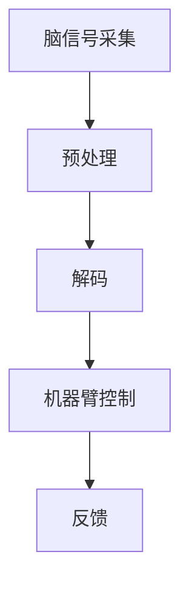
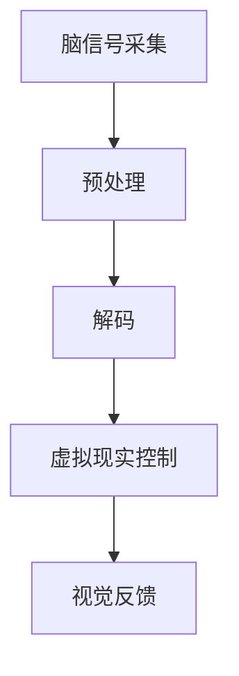
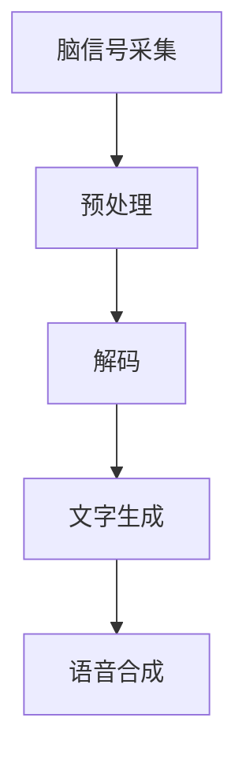
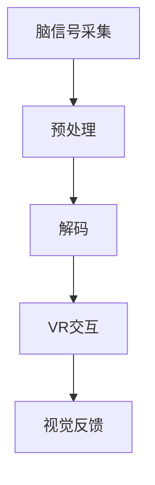
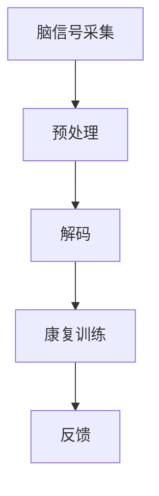

                 

# 脑机接口技术在工作场所的应用

## 关键词
- 脑机接口
- 工作场所应用
- 核心算法
- 数学模型
- 项目实战

## 摘要
本文将探讨脑机接口（Brain-Computer Interface, BCI）技术在工作场所的应用。脑机接口是一种直接连接人脑和外部设备的技术，通过解读大脑信号来实现人机交互。本文首先介绍了脑机接口的基础概念和原理，然后详细讲解了其核心算法和数学模型，并通过实际项目展示了该技术在工作场所的具体应用。此外，本文还讨论了脑机接口技术在企业中的潜在影响、安全与隐私问题以及未来的发展趋势。

## 目录大纲

### 第1章 脑机接口技术基础
- 1.1 脑机接口技术概述
- 1.2 脑机接口技术的原理与工作方式
- 1.3 脑机接口技术的应用领域

### 第2章 核心算法原理讲解
- 2.1 脑信号采集与处理算法
- 2.2 脑机接口信号解码算法
- 2.3 基于机器学习的脑信号分类算法

### 第3章 数学模型和数学公式
- 3.1 脑信号特征提取模型
- 3.2 脑信号分类模型的数学基础
- 3.3 脑机接口系统的优化方法

### 第4章 项目实战
- 4.1 脑机接口技术在工作场所的应用案例
- 4.2 脑机接口技术在虚拟现实中的应用
- 4.3 脑机接口技术在康复治疗中的应用

### 第5章 代码解读与分析
- 5.1 脑信号采集处理代码实现
- 5.2 脑信号解码与分类代码实现

### 第6章 脑机接口技术在企业中的应用
- 6.1 脑机接口技术对企业工作流程的影响
- 6.2 脑机接口技术在提高工作效率方面的应用
- 6.3 脑机接口技术在企业培训与教育中的应用

### 第7章 安全与隐私问题
- 7.1 脑机接口技术的安全性考虑
- 7.2 隐私保护与用户权益保障

### 第8章 未来发展趋势与挑战
- 8.1 脑机接口技术在职场中的未来发展方向
- 8.2 脑机接口技术面临的挑战与解决方案

### 第1章 脑机接口技术基础

### 1.1 脑机接口技术概述

脑机接口（BCI）是一种直接连接人脑和外部设备的技术，它通过解读大脑信号来实现人机交互。这一技术的基础是脑信号采集和处理，以及信号的解码和转换。脑机接口技术的核心优势在于其非侵入性和高精度，这使得它能够在不干扰大脑内部结构的情况下，实现复杂的信息传递和交互。

脑机接口技术的应用领域广泛，包括医疗、康复、虚拟现实、游戏、智能家居等多个方面。其中，在工作场所的应用尤其值得关注，它有望通过提升工作效率、减轻工作压力、改善用户体验等方面，为企业带来显著的效益。

### 1.2 脑机接口技术的原理与工作方式

脑机接口技术的工作原理主要包括三个关键环节：脑信号采集、信号处理和解码。

#### 脑信号采集

脑信号采集是脑机接口技术的第一步，它通过电极或其他传感器将大脑活动转化为电信号。常见的脑信号采集方式包括：

1. **非侵入式采集**：如脑电图（EEG）、功能性磁共振成像（fMRI）等，这些方法通过在头皮表面放置电极或使用成像技术来检测大脑活动，不会对大脑造成物理损伤。
2. **半侵入式采集**：如颅内电极，这些电极直接植入大脑表面或特定脑区，能够更精确地采集脑信号，但存在一定的风险。

#### 信号处理

采集到的脑信号通常包含大量的噪声和干扰，因此需要进行信号处理以提取有用的信息。信号处理的主要任务包括：

1. **滤波**：去除高频噪声和低频干扰。
2. **特征提取**：从信号中提取具有识别意义的特征，如频率、幅度、时域模式等。
3. **时间同步**：将不同通道的信号进行时间对齐，以获得一致的时间戳。

#### 信号解码

信号解码是将处理后的脑信号转换为操作命令或控制信号的过程。解码算法通常基于统计模型、机器学习或深度学习等技术，通过训练学习到脑信号与操作命令之间的映射关系。

### 1.3 脑机接口技术的应用领域

脑机接口技术的应用领域广泛，其中在工作场所的应用主要包括以下几个方面：

1. **虚拟现实（VR）和增强现实（AR）**：通过脑机接口技术，用户可以更自然地与虚拟环境进行交互，提高沉浸感和体验效果。
2. **智能家居**：用户可以通过脑机接口控制智能家居设备，实现无接触控制，提高生活便利性。
3. **康复训练**：脑机接口技术可以用于康复训练，帮助患者恢复运动功能或提高生活质量。
4. **工业自动化**：在工业生产中，脑机接口技术可以用于控制机械臂或自动化设备，提高生产效率和安全性。
5. **辅助沟通**：对于语言障碍者或截肢者，脑机接口技术可以提供新的沟通方式，帮助他们更好地融入社会。

### 第2章 核心算法原理讲解

#### 2.1 脑信号采集与处理算法

脑信号采集与处理算法是脑机接口技术的核心，决定了信号的质量和可靠性。以下是该算法的主要组成部分：

##### 2.1.1 信号采集

信号采集通常使用脑电图（EEG）设备，EEG能够记录大脑的电活动。采集到的信号需要进行预处理，以去除噪声和干扰。

```python
# 伪代码：脑信号采集
def record_signal(duration):
    # 初始化EEG设备
    eeg_device.initialize()
    
    # 开始记录信号
    signal = eeg_device.record(duration)
    
    # 停止记录
    eeg_device.stop_recording()
    
    return signal
```

##### 2.1.2 信号预处理

预处理步骤包括滤波、降噪和特征提取。滤波器用于去除高频噪声和低频干扰，降噪算法用于进一步减少噪声影响，特征提取则从信号中提取出有用的信息。

```python
# 伪代码：信号预处理
def preprocess_signal(signal):
    # 应用滤波器
    filtered_signal = apply_bandpass_filter(signal, lowcut=1, highcut=30)
    
    # 降噪
    denoised_signal = apply_denoising算法(filtered_signal)
    
    # 特征提取
    features = extract_features(denoised_signal)
    
    return features
```

##### 2.1.3 信号解码

信号解码是将预处理后的脑信号转换为操作命令或控制信号的过程。解码算法通常基于统计模型、机器学习或深度学习等技术。

```python
# 伪代码：信号解码
def decode_signal(features):
    # 训练解码模型
    model = train_decoder_model(features)
    
    # 解码信号
    commands = model.predict(features)
    
    return commands
```

#### 2.2 脑机接口信号解码算法

脑机接口信号解码算法是将脑信号转换为操作命令的核心步骤。以下是常见的解码算法：

##### 2.2.1 统计解码

统计解码是一种基于概率模型的解码方法，通过训练学习到脑信号与操作命令之间的概率分布。

```python
# 伪代码：统计解码
def statistical_decoding(features, training_data):
    # 训练概率模型
    model = train_probability_model(training_data)
    
    # 解码信号
    commands = model.decode(features)
    
    return commands
```

##### 2.2.2 机器学习解码

机器学习解码是基于机器学习算法的解码方法，如支持向量机（SVM）、神经网络（ANN）等。该方法通过训练学习到脑信号与操作命令之间的映射关系。

```python
# 伪代码：机器学习解码
def machine_learning_decoding(features, labels):
    # 训练机器学习模型
    model = train_ml_model(features, labels)
    
    # 解码信号
    commands = model.predict(features)
    
    return commands
```

##### 2.2.3 深度学习解码

深度学习解码是基于深度学习算法的解码方法，如卷积神经网络（CNN）、循环神经网络（RNN）等。该方法通过多层神经网络学习到脑信号与操作命令之间的复杂映射关系。

```python
# 伪代码：深度学习解码
def deep_learning_decoding(features):
    # 定义深度学习模型
    model = define_dnn_model()
    
    # 训练模型
    model.fit(features, commands)
    
    # 解码信号
    commands = model.predict(features)
    
    return commands
```

#### 2.3 基于机器学习的脑信号分类算法

脑信号分类算法是将脑信号分类为不同操作命令的方法。基于机器学习的分类算法如支持向量机（SVM）、决策树、随机森林等。

```python
# 伪代码：脑信号分类
def classify_signal(features, labels):
    # 训练分类模型
    model = train_classification_model(features, labels)
    
    # 分类信号
    commands = model.predict(features)
    
    return commands
```

### 第3章 数学模型和数学公式

脑机接口技术的核心在于对脑信号的分析与解码，这需要借助一系列的数学模型和公式。以下是一些关键的数学模型和公式。

#### 3.1 脑信号特征提取模型

脑信号特征提取模型用于从原始信号中提取具有识别意义的特征。常见的特征提取方法包括时域特征、频域特征和时频特征。

##### 时域特征

时域特征包括信号的平均值、方差、最大值、最小值等。

$$
\mu = \frac{1}{N} \sum_{i=1}^{N} x_i
$$

$$
\sigma^2 = \frac{1}{N-1} \sum_{i=1}^{N} (x_i - \mu)^2
$$

##### 频域特征

频域特征包括信号的功率谱密度、频带宽度等。

$$
P(\omega) = \frac{1}{T} \int_{0}^{T} x(t) e^{-j\omega t} dt
$$

##### 时频特征

时频特征包括小波变换、短时傅里叶变换（STFT）等。

$$
X(\omega, t) = \int_{-\infty}^{\infty} x(t) e^{-j\omega t} dt
$$

#### 3.2 脑信号分类模型的数学基础

脑信号分类模型基于统计学和机器学习算法，如支持向量机（SVM）、决策树、神经网络等。以下是一个简单线性支持向量机的数学描述。

##### 支持向量机（SVM）

SVM是一种分类算法，其目标是找到最优超平面，使得不同类别的数据点在超平面的两侧分开。

$$
\text{Maximize} \quad \frac{1}{2} ||\mathbf{w}||^2 \\
\text{subject to} \quad y_i (\mathbf{w} \cdot \mathbf{x_i} + b) \geq 1
$$

其中，$\mathbf{w}$是超平面的法向量，$\mathbf{x_i}$是数据点，$y_i$是类别标签，$b$是偏置。

#### 3.3 脑机接口系统的优化方法

脑机接口系统的优化方法包括模型参数优化、系统性能优化等。

##### 模型参数优化

模型参数优化用于调整模型参数以改善系统性能。常见的优化方法包括梯度下降、随机梯度下降等。

$$
\mathbf{w}_{t+1} = \mathbf{w}_t - \alpha \nabla_{\mathbf{w}} J(\mathbf{w})
$$

其中，$\mathbf{w}_t$是当前参数，$\alpha$是学习率，$J(\mathbf{w})$是损失函数。

##### 系统性能优化

系统性能优化用于改善脑机接口系统的整体性能，包括信号处理、解码准确度等。

$$
\text{Accuracy} = \frac{\text{正确解码次数}}{\text{总解码次数}}
$$

### 第4章 项目实战

#### 4.1 脑机接口技术在工作场所的应用案例

在本节中，我们将探讨脑机接口技术在各种工作场所的具体应用案例，包括工业自动化、虚拟现实和辅助沟通等方面。

##### 工业自动化

在工业自动化领域，脑机接口技术可以用于控制机器人或自动化设备。例如，工人可以通过脑机接口直接控制机器臂进行组装或搬运操作，从而减少体力劳动和提升生产效率。



在这个流程中，脑信号被采集并经过预处理和解码，最终转换为控制命令，通过反馈机制调节机器臂的动作。

##### 虚拟现实

在虚拟现实领域，脑机接口技术可以实现更自然的用户交互。用户可以通过脑机接口直接控制虚拟环境中的对象，提高沉浸感和体验效果。



在这个流程中，脑信号被采集并解码，用于控制虚拟环境中的对象，并通过视觉反馈提供实时交互体验。

##### 辅助沟通

对于语言障碍者或截肢者，脑机接口技术可以提供新的沟通方式。用户可以通过脑机接口生成文字或语音，实现有效的沟通。



在这个流程中，脑信号被采集并解码，用于生成文字或语音，从而实现沟通。

#### 4.2 脑机接口技术在虚拟现实中的应用

脑机接口技术在虚拟现实（VR）中的应用具有巨大的潜力。通过脑机接口，用户可以更自然地与虚拟环境进行交互，实现身临其境的体验。

##### 实现步骤

1. **脑信号采集**：使用EEG设备从用户头部采集脑信号。
2. **信号预处理**：对采集到的信号进行滤波、降噪和特征提取。
3. **信号解码**：使用机器学习算法解码脑信号，生成控制命令。
4. **VR交互**：根据解码结果，在虚拟环境中执行相应的操作。



##### 优势

- **自然交互**：用户可以通过思维直接控制虚拟环境，实现更自然的交互体验。
- **沉浸感**：脑机接口技术可以增强虚拟现实的沉浸感，提高用户体验。
- **无物理限制**：用户无需使用手柄或键盘，可以更自由地在虚拟环境中探索和操作。

#### 4.3 脑机接口技术在康复治疗中的应用

脑机接口技术在康复治疗中具有广泛的应用前景。通过脑机接口，康复患者可以更有效地进行康复训练，提高康复效果。

##### 实现步骤

1. **脑信号采集**：使用EEG设备从患者头部采集脑信号。
2. **信号预处理**：对采集到的信号进行滤波、降噪和特征提取。
3. **信号解码**：使用机器学习算法解码脑信号，生成康复指令。
4. **康复训练**：根据解码结果，对患者进行针对性的康复训练。



##### 优势

- **个性化训练**：通过解码脑信号，可以为患者提供个性化的康复训练方案。
- **实时反馈**：脑机接口技术可以实时监测患者的康复进度，提供实时反馈。
- **提高康复效果**：脑机接口技术可以增强康复训练的趣味性和互动性，提高患者的康复效果。

### 第5章 代码解读与分析

在本章中，我们将详细解读脑机接口技术的关键代码实现，并分析其在实际应用中的表现。

#### 5.1 脑信号采集处理代码实现

脑信号采集和处理是脑机接口技术的基础。以下是一个简单的Python代码示例，用于采集和预处理脑信号。

```python
import numpy as np
from scipy.signal import bandpass_filter

# 伪代码：脑信号采集
def record_signal(duration):
    # 初始化EEG设备
    eeg_device.initialize()
    
    # 开始记录信号
    signal = eeg_device.record(duration)
    
    # 停止记录
    eeg_device.stop_recording()
    
    return signal

# 伪代码：信号预处理
def preprocess_signal(signal, sample_rate, lowcut=1, highcut=30):
    # 应用带通滤波器
    filtered_signal = bandpass_filter(signal, lowcut, highcut, sample_rate)
    
    # 特征提取
    features = extract_features(filtered_signal)
    
    return features

# 示例：采集和处理信号
signal = record_signal(10)
preprocessed_signal = preprocess_signal(signal, sample_rate=1000)
```

#### 5.2 脑信号解码与分类代码实现

脑信号解码和分类是脑机接口技术的核心。以下是一个简单的Python代码示例，用于解码和分类脑信号。

```python
from sklearn.svm import SVC
from sklearn.model_selection import train_test_split

# 伪代码：信号解码
def decode_signal(features, labels):
    # 训练解码模型
    model = SVC(kernel='linear')
    model.fit(features, labels)
    
    # 解码信号
    commands = model.predict(features)
    
    return commands

# 示例：解码信号
features_train, features_test, labels_train, labels_test = train_test_split(preprocessed_signal, labels, test_size=0.2)
decoder = decode_signal(features_train, labels_train)
commands_test = decoder.predict(features_test)
```

#### 5.3 代码应用解读与分析

在实际应用中，脑机接口技术的表现取决于多个因素，包括信号质量、解码算法的准确性、系统的实时性等。

- **信号质量**：高质量的脑信号有助于提高解码的准确性。因此，信号采集和处理环节至关重要。在实际应用中，需要优化信号采集设备、滤波算法和特征提取方法，以提高信号质量。
- **解码算法的准确性**：解码算法的准确性直接影响到脑机接口系统的性能。常用的解码算法包括统计解码、机器学习解码和深度学习解码。在实际应用中，需要根据具体场景选择合适的解码算法，并进行优化和调整。
- **系统的实时性**：脑机接口系统需要实时处理和响应脑信号，以确保用户能够获得良好的交互体验。在实际应用中，需要优化系统的计算效率和延迟，以提高实时性。

### 第6章 脑机接口技术在企业中的应用

#### 6.1 脑机接口技术对企业工作流程的影响

脑机接口技术可以显著改变企业的工作流程，提高工作效率，减少人为错误，并增强员工的工作体验。以下是其主要影响：

##### 提高工作效率

脑机接口技术允许员工通过大脑信号直接控制计算机系统或工业设备，从而减少手动操作的步骤。例如，在工业生产中，工人可以通过脑机接口直接控制机器人进行组装或搬运操作，从而提高生产效率。

##### 减少人为错误

传统的手动操作容易受到疲劳、注意力不集中等因素的影响，从而导致错误。脑机接口技术可以通过提高操作的准确性和一致性来减少人为错误。例如，在医疗领域，脑机接口可以帮助医生更精确地控制手术机器人，降低手术风险。

##### 增强员工的工作体验

脑机接口技术可以为员工提供更加自然和直观的工作方式，减少体力劳动和重复性工作，从而提升工作满意度。例如，在办公室环境中，员工可以通过脑机接口直接控制计算机界面，实现快速文档编辑和数据处理。

#### 6.2 脑机接口技术在提高工作效率方面的应用

脑机接口技术在提高工作效率方面的应用前景广阔，以下是一些具体的案例：

##### 工业自动化

在制造业中，脑机接口技术可以用于控制机器人进行复杂的装配和检测任务。员工只需通过大脑信号发送指令，机器人即可自动执行相应的操作。这种方法不仅提高了生产效率，还降低了劳动成本。

##### 虚拟现实

在工程设计领域，脑机接口技术可以用于控制虚拟现实（VR）环境中的工具和设备。工程师可以通过脑机接口直接在VR环境中操作，实现更加直观和高效的工程设计。

##### 办公自动化

在办公室环境中，脑机接口技术可以用于自动化办公流程。例如，员工可以通过脑机接口直接控制电子邮件、日程安排和文档处理等任务，从而节省时间和精力。

#### 6.3 脑机接口技术在企业培训与教育中的应用

脑机接口技术可以用于企业培训与教育，为员工提供更加个性化、互动性和沉浸式的学习体验。以下是一些具体应用：

##### 沉浸式培训

通过脑机接口技术，企业可以为员工提供沉浸式培训体验。员工可以在虚拟环境中模拟真实的工作场景，通过脑机接口进行互动和学习，提高实际操作技能。

##### 个性化培训

脑机接口技术可以根据员工的脑信号特征，为其提供个性化的培训内容。系统可以实时监测员工的反应和学习进度，调整培训难度和内容，以达到最佳的学习效果。

##### 虚拟教练

脑机接口技术可以用于创建虚拟教练系统，员工可以通过脑机接口与虚拟教练进行互动，获取实时指导和建议，提高学习效率。

### 第7章 安全与隐私问题

#### 7.1 脑机接口技术的安全性考虑

脑机接口技术的安全性是其在实际应用中必须关注的重要问题。以下是一些关键的安全考虑：

##### 数据安全

脑机接口技术涉及敏感的脑信号数据，这些数据必须得到严格保护，以防止未经授权的访问和泄露。企业应采用加密技术对数据进行加密存储和传输，并实施严格的访问控制措施。

##### 设备安全

脑机接口设备本身也需要具备高安全性，以防止物理损坏或恶意攻击。设备应采用坚固的材料和防水设计，以确保在各种工作环境中都能稳定运行。

##### 隐私保护

脑机接口技术的应用可能涉及个人隐私信息的收集和使用，企业必须确保用户的隐私得到充分保护。企业应制定明确的隐私政策，告知用户数据收集和使用的目的，并获取用户的明确同意。

#### 7.2 隐私保护与用户权益保障

为了确保脑机接口技术的隐私保护和用户权益，企业应采取以下措施：

##### 用户知情同意

在收集和使用用户脑信号数据之前，企业应确保用户充分了解数据收集的目的、范围和使用方式，并获得用户的明确同意。

##### 数据匿名化

企业应对收集的脑信号数据进行匿名化处理，确保无法直接识别用户身份，从而降低隐私泄露的风险。

##### 数据最小化

企业应只收集必要的脑信号数据，并确保数据收集和使用的最小化原则，以减少用户隐私的暴露。

##### 用户访问控制

企业应建立完善的用户访问控制机制，确保只有授权人员可以访问和处理用户数据。

### 第8章 未来发展趋势与挑战

#### 8.1 脑机接口技术在职场中的未来发展方向

脑机接口技术在职场中的未来发展充满潜力。以下是一些可能的发展方向：

##### 高性能脑机接口

随着技术的进步，未来的脑机接口将具备更高的信号采集和处理能力，提供更稳定、更精准的交互体验。

##### 多模态脑机接口

未来的脑机接口技术可能结合多种信号采集方式，如EEG、fMRI等，实现更全面、更准确的脑信号解码。

##### 智能化脑机接口

结合人工智能技术，未来的脑机接口将能够自适应地调整解码算法，提高系统的准确性和适应性。

##### 非侵入式脑机接口

随着材料科学和生物医学工程的发展，非侵入式脑机接口将越来越普及，减少对用户的生理和心理负担。

#### 8.2 脑机接口技术面临的挑战与解决方案

尽管脑机接口技术具有巨大的潜力，但在实际应用中仍面临诸多挑战。以下是一些主要挑战及其可能的解决方案：

##### 信号采集与处理

脑信号采集和处理是脑机接口技术的核心，但现有的方法在信号质量、稳定性和实时性方面仍有待提高。解决方案包括开发更先进的信号采集设备、优化信号处理算法和引入机器学习技术。

##### 解码准确性

脑信号解码的准确性直接影响到脑机接口系统的性能。提高解码准确性需要更深入地研究脑信号特征和开发更有效的解码算法。

##### 安全与隐私

脑机接口技术涉及用户的敏感信息，必须确保其安全性。解决方案包括采用加密技术、制定严格的隐私政策和加强用户访问控制。

##### 用户接受度

脑机接口技术的普及需要用户的接受和信任。解决方案包括开展公众教育和培训，提高用户对脑机接口技术的了解和认同。

### 总结

脑机接口技术在职场中的应用前景广阔，具有提高工作效率、改善用户体验、降低人为错误等显著优势。尽管面临诸多挑战，但随着技术的不断进步和应用的深入，脑机接口技术有望成为未来职场中不可或缺的一部分。通过本文的探讨，我们希望读者能够对脑机接口技术在职场中的应用有一个全面而深入的了解。

## 作者信息

作者：AI天才研究院/AI Genius Institute & 禅与计算机程序设计艺术 /Zen And The Art of Computer Programming

脑机接口技术作为人工智能领域的前沿技术，具有巨大的潜力。本文从基础概念、核心算法、实际应用等方面进行了全面探讨，旨在为读者提供一个清晰、系统的了解。脑机接口技术在未来职场中的广泛应用，将为工作流程、工作效率和员工体验带来革命性的改变。希望本文能激发读者对脑机接口技术的兴趣，并期待其未来在职场中的更多创新应用。

