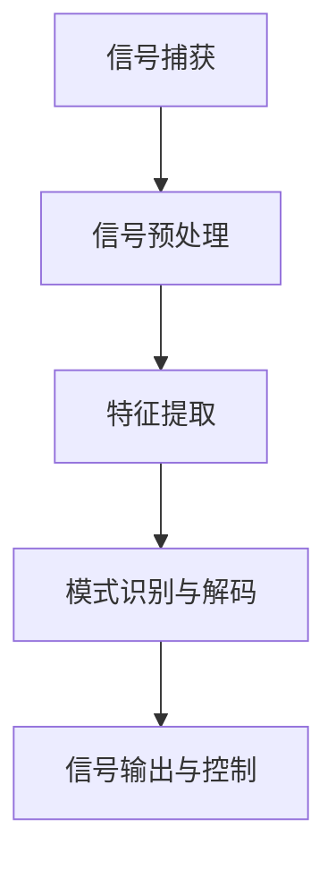

                 

## 《脑机接口技术在工作场所的应用前景》

### 关键词

脑机接口，工作场所，应用前景，效率提升，人机交互，职业健康

### 摘要

脑机接口（BCI）技术作为一种前沿的人机交互技术，正逐渐受到工作场所的重视。本文将详细探讨脑机接口技术在各种工作环境中的应用前景，包括其基础概念、技术原理、实际案例以及面临的挑战。本文旨在提供一个全面的视角，帮助读者理解BCI技术在提升工作效率、改善人机交互和促进职业健康等方面的潜力。

## 引言

随着科技的不断进步，脑机接口（Brain-Computer Interface，BCI）技术逐渐从科幻领域走向现实生活。BCI技术的基本原理是通过直接读取和解析大脑信号，实现人脑与外部设备或计算机系统之间的交互。这种技术不仅具有高度创新性和广泛的应用前景，还能够为工作场所带来革命性的变化。

在工业、医疗、教育、娱乐等领域，BCI技术已经展示出了其独特的优势和应用潜力。然而，在工作场所这一关键领域，BCI技术如何发挥作用、如何影响未来的职业环境，仍然是一个值得深入探讨的话题。本文将围绕以下几个方面展开讨论：

1. **BCI技术的基本概念与工作原理**：介绍BCI技术的定义、发展历程及其关键组成部分。
2. **BCI技术在医疗领域的应用**：探讨BCI技术如何帮助患者康复、提高生活质量，以及其在神经疾病治疗中的作用。
3. **BCI技术在工业领域的应用**：分析BCI技术在提高工作效率、优化生产流程方面的潜力。
4. **BCI技术在教育领域的应用**：讨论BCI技术如何促进个性化教育、改善特殊教育。
5. **BCI技术在游戏与娱乐领域的应用**：探讨BCI技术在游戏设计和娱乐体验中的应用。
6. **BCI技术在安全与监控领域的应用**：分析BCI技术在安全监测、行为分析等方面的应用。
7. **BCI技术的未来趋势与挑战**：总结BCI技术的发展趋势，探讨面临的挑战及伦理问题。

通过上述分析，我们希望能够为读者提供一个全面而深入的视角，了解脑机接口技术在工作场所的应用前景及其潜在影响。

## BCI技术的基本概念与工作原理

### 定义与历史背景

脑机接口（BCI）技术，也被称为脑-机接口或大脑接口，是指通过直接读取大脑信号来实现人脑与外部设备或系统之间的交互。这种技术的基本思想是通过脑电图（EEG）、功能性磁共振成像（fMRI）或其他生物传感器技术，捕捉大脑活动产生的电信号，并将其转换为可操作的控制信号，从而实现与计算机或其他电子设备的直接通信。

BCI技术的发展历程可以追溯到20世纪60年代，当时神经科学家约翰·多伊奇（John Deike）首次提出了“神经接口”这一概念。1969年，多伊奇和他的团队成功地使用脑电图记录大脑信号，并通过解码这些信号来控制一个简单的机器人手臂。这一实验被视为BCI技术的里程碑，标志着脑机接口技术从理论走向实践。

### 脑机接口技术的组成部分

脑机接口技术主要包括以下几个关键组成部分：

1. **信号检测与传感器**：这是BCI技术的核心部分，通过传感器捕捉大脑活动产生的电信号。常见的传感器包括脑电图（EEG）传感器、功能性磁共振成像（fMRI）传感器和近红外光谱成像（NIRS）传感器等。

2. **信号处理与解码算法**：捕捉到的原始脑信号需要进行复杂的信号处理和特征提取，以提取出有用的信息。解码算法是这一过程中的关键，通过训练和优化算法，可以准确地将脑信号映射为具体的操作指令。

3. **接口与输出设备**：处理后的信号需要通过接口传输到外部设备，如计算机、机器人、虚拟现实设备等，从而实现人机交互。

### 工作原理

BCI技术的工作原理可以概括为以下几个步骤：

1. **信号捕获**：通过脑电图（EEG）或其他生物传感器捕捉大脑活动的电信号。

2. **信号预处理**：对捕获到的信号进行滤波、去噪、放大等预处理操作，以提取出有用的脑信号。

3. **特征提取**：通过信号处理算法提取出与特定认知或行为相关的特征，如大脑活动的频段、时间序列模式等。

4. **模式识别与解码**：使用模式识别算法对提取出的特征进行分类和映射，将脑信号解码为具体的操作指令。

5. **信号输出与控制**：解码后的信号通过接口输出到外部设备，从而实现对机器或系统的控制。

### Mermaid 流程图

下面是一个简化的BCI技术工作原理的Mermaid流程图：



通过这个流程图，我们可以清晰地看到BCI技术从信号捕获到信号输出的整个过程。

### 伪代码讲解

以下是一个简单的伪代码示例，用于说明BCI技术中的信号处理与解码算法：

```python
# 信号预处理
def preprocess_signal(raw_signal):
    filtered_signal = filter(raw_signal, low-cut_frequency, high-cut_frequency)
    amplified_signal = amplify(filtered_signal, gain)
    return amplified_signal

# 特征提取
def extract_features(processed_signal):
    frequency_domain = fft(processed_signal)
    time_series_patterns = identify_patterns(processed_signal)
    return frequency_domain, time_series_patterns

# 模式识别与解码
def decode_patterns(features):
    control_signals = classify(features, trained_model)
    return control_signals

# 主函数
def bci_system(raw_signal):
    processed_signal = preprocess_signal(raw_signal)
    features = extract_features(processed_signal)
    control_signals = decode_patterns(features)
    execute_signals(control_signals)
```

这个伪代码展示了BCI技术中的信号处理和模式识别的基本步骤，包括信号预处理、特征提取、模式识别和信号执行。

通过上述内容，我们可以对脑机接口技术的基本概念和工作原理有一个清晰的认识，这为后续章节中BCI技术在具体工作场所中的应用分析奠定了基础。

## BCI技术在医疗领域的应用

### 脑机接口技术对康复医学的影响

脑机接口（BCI）技术在康复医学中具有巨大的应用潜力，尤其是在帮助患者恢复运动功能和提高生活质量方面。BCI技术通过直接读取和解析大脑信号，可以实现对瘫痪肢体或运动功能受限肢体的精确控制，从而显著改善康复效果。

#### 脑机接口技术在康复治疗中的应用

脑机接口技术在康复治疗中的主要应用包括脑控假肢、脑控轮椅和脑控康复机器人等。这些设备可以通过用户的思维活动来控制，为患者提供了全新的康复方式。

1. **脑控假肢**：脑控假肢通过捕捉用户大脑中的意图信号，将其转换为机械运动，帮助截肢者重新获得肢体功能。例如，美国科技公司Cyberdyne的HAL（Hybrid Assistive Limb）就是一种基于BCI技术的假肢，它通过监测用户的大脑活动来控制假肢的运动，使得截肢者可以像正常人一样行走和操纵物体。

2. **脑控轮椅**：脑控轮椅使用户可以通过思考来控制轮椅的运动方向和速度，无需手动操作。这种技术特别适用于行动不便或无法使用传统控制方式的用户。例如，BrainRobotics开发的脑控轮椅通过脑电图（EEG）传感器捕捉用户的大脑信号，实现自然的人机交互。

3. **脑控康复机器人**：脑控康复机器人可以帮助患者在物理治疗中更好地进行康复训练。通过用户的思维活动来控制机器人，患者可以在进行康复训练的同时获得更直观的反馈和刺激。例如，日本东京大学开发的机器人助手通过BCI技术帮助患者进行手臂和腿部康复训练，提高了训练效果和患者的积极性。

#### 成功案例与效果分析

以下是一些成功的脑机接口技术在康复治疗中的应用案例及其效果分析：

1. **埃隆·马斯克的Neuralink项目**：Neuralink是一家致力于开发高带宽脑机接口技术的公司，其目标是通过在人类大脑中植入微电极阵列，实现与计算机的无缝连接。虽然目前该项目仍处于临床前研究阶段，但已展示出巨大的潜力。例如，Neuralink在猴子实验中通过BCI技术成功控制了机器臂，这为未来人类患者的康复提供了希望。

2. **美国梅奥诊所的脑控假肢项目**：梅奥诊所的研究团队通过BCI技术成功开发了一种脑控假肢系统，帮助截肢者实现了对假肢的精确控制。这项技术不仅提高了患者的运动能力，还增强了他们的自信心和生活质量。

3. **瑞士洛桑联邦理工学院（EPFL）的脑控轮椅研究**：EPFL的研究团队开发了一种基于BCI技术的脑控轮椅，该轮椅可以通过脑电图传感器捕捉用户的大脑信号来实现控制。研究表明，这种脑控轮椅的使用可以显著提高患者的行动自由度和生活质量。

#### 脑机接口技术在神经疾病治疗中的应用

除了在康复治疗中的应用，BCI技术还在神经疾病的治疗中发挥了重要作用。例如，对于患有帕金森病、肌萎缩侧索硬化症（ALS）等神经退行性疾病的患者，BCI技术可以通过直接刺激大脑或脊髓来改善其症状。

1. **脑刺激疗法**：通过BCI技术，医生可以在特定的大脑区域植入电极，以刺激神经细胞活动，从而改善患者的症状。例如，美国波士顿大学医学院的研究团队通过脑刺激疗法成功缓解了部分帕金森病患者的症状。

2. **电刺激假肢**：对于因神经损伤而无法控制的肢体，BCI技术可以通过植入电刺激装置来恢复其运动功能。例如，美国贝勒大学的研究团队通过电刺激假肢帮助ALS患者恢复了部分肢体功能。

总之，脑机接口技术在康复医学和神经疾病治疗中的应用已经展示了其巨大的潜力。随着技术的不断进步，BCI技术将在未来的医疗领域发挥越来越重要的作用，为患者带来更多的希望和可能性。

### 脑机接口技术对职业健康的影响

脑机接口（BCI）技术不仅在康复医学和神经疾病治疗中具有广泛应用，还在改善职业健康方面展现出了巨大潜力。随着工作环境的不断变化和复杂化，许多职业面临着身体和心理的巨大压力，BCI技术提供了一种全新的解决方案，帮助工作者提高工作效率、减少工作压力、预防职业病。

#### BCI技术在提升工作效率方面的应用

1. **自动化工作流程**：通过BCI技术，员工可以直接通过大脑信号来控制计算机或机器设备，从而实现自动化工作流程。例如，销售人员可以通过BCI技术直接处理订单、回复邮件，无需手动操作，从而显著提高工作效率。

2. **智能任务分配**：BCI技术可以实时监测员工的大脑活动，了解其工作状态和注意力水平，从而智能地分配任务。这种个性化任务分配可以确保员工在最佳状态下完成任务，提高整体工作效率。

3. **远程控制**：对于远程工作者，BCI技术提供了更加便捷的远程控制方式。通过BCI设备，远程工作者可以直接通过思维控制远程设备，从而减少对键盘和鼠标的依赖，提高工作效率。

#### BCI技术在减少工作压力方面的应用

1. **压力监测与预警**：BCI技术可以实时监测员工的大脑信号，分析其情绪状态。当员工处于高压力状态时，系统可以发出预警信号，提醒员工休息或调整工作节奏，从而减少工作压力。

2. **情绪调节训练**：通过BCI技术，员工可以进行情绪调节训练。例如，使用脑电反馈技术，员工可以学习如何通过调节大脑信号来放松身心，提高情绪管理能力，从而减少工作压力。

3. **个性化休息方案**：BCI技术可以根据员工的大脑信号制定个性化的休息方案，确保员工在最佳状态下工作。例如，在员工大脑信号显示疲劳时，系统可以自动安排短暂的休息时间，帮助员工恢复精力。

#### BCI技术在预防职业病方面的应用

1. **姿势监测与矫正**：长时间坐在电脑前容易导致姿势不良，从而引发颈椎病、腰椎病等职业病。BCI技术可以通过监测员工的头部和身体姿势，实时提醒员工保持正确姿势，从而预防职业病。

2. **眼部保护**：长时间盯着电脑屏幕容易导致眼睛疲劳，甚至引发干眼症。BCI技术可以通过监测员工的眼睛活动，提醒员工定时休息，避免过度用眼，保护视力。

3. **心理健康支持**：BCI技术可以监测员工的心理健康状态，提供个性化的心理健康支持。例如，当员工处于焦虑或抑郁状态时，系统可以提供相应的心理辅导和支持，帮助员工保持心理健康。

总之，脑机接口技术在提升工作效率、减少工作压力和预防职业病方面具有巨大潜力。随着BCI技术的不断发展和应用，未来工作场所将变得更加智能、健康和高效。通过合理利用BCI技术，企业和员工可以共同创造一个更加理想的工作环境。

### 脑机接口技术在工业领域的应用

脑机接口（BCI）技术不仅在医疗和康复领域有着显著的应用，在工业领域也展现出了巨大的潜力和实际价值。随着工业自动化和智能制造的不断推进，BCI技术为工业生产带来了新的变革，尤其是在提高工作效率、优化生产流程和提升生产质量方面。

#### BCI技术在提高工作效率方面的应用

1. **脑控机器人**：BCI技术使得机器人可以通过大脑信号来实现精确控制。例如，通过脑控机器人，工人可以直接通过思维来操控机械臂进行组装或搬运任务，从而减少手动操作的繁琐，提高工作效率。这种技术特别适用于重复性高、劳动强度大的生产任务，能够显著减轻工人的工作负担。

   **案例**：日本一些汽车制造厂已经开始应用脑控机器人进行车身焊接和组装工作。工人只需集中注意力，通过大脑信号控制机器人进行操作，大大提高了生产效率和精度。

2. **脑控自动化生产线**：在高度自动化的生产线上，BCI技术可以用于监控和调节生产设备的运行状态。通过实时监测工人的大脑信号，系统能够自动调整生产线的速度和参数，以适应不同的生产需求，从而提高生产效率。

   **案例**：德国一家汽车制造厂使用BCI技术监控工人的大脑活动，以预测和预防生产设备故障。当工人的大脑信号显示疲劳或注意力不集中时，系统会自动调整生产线的速度，减少事故发生的风险。

3. **脑控质量检测**：在产品质量检测过程中，BCI技术可以帮助工人快速、准确地识别和定位产品缺陷。通过捕捉大脑中的判断和决策信号，系统可以自动生成检测报告，减少人工检测的时间和错误率。

   **案例**：一些电子产品制造厂已经开始使用BCI技术来检测电路板的焊接质量。工人只需通过大脑信号指示需要检查的电路板区域，系统会自动分析并生成检测结果，提高了检测效率和准确性。

#### BCI技术在优化生产流程方面的应用

1. **智能调度与排程**：BCI技术可以通过实时监测和管理工人的大脑活动，优化生产流程和调度安排。例如，通过分析工人的大脑信号，系统可以自动调整工人的工作内容和顺序，确保生产流程的顺畅和高效。

   **案例**：一家制造公司的管理层通过BCI技术监测员工的大脑信号，优化生产线的调度和排程。当员工的大脑信号显示疲劳时，系统会自动调整其工作内容，减少工作压力，提高整体生产效率。

2. **动态资源分配**：BCI技术可以根据实时的大脑信号动态调整生产资源分配，确保资源的最优配置。例如，在生产线高峰期，系统可以通过BCI技术预测员工的工作负荷，自动分配更多的机器和人力资源，避免生产瓶颈。

   **案例**：一家大型工厂使用BCI技术优化生产线的资源分配。在生产线高峰期，系统通过分析员工的大脑信号，自动调整机器和人员的配置，确保生产线的平稳运行，提高了生产效率。

3. **远程监控与维护**：BCI技术可以通过远程监控系统实时监测工厂设备和生产线的运行状态。当设备出现故障或异常时，系统会通过分析大脑信号预测故障原因，并自动进行远程维护和修复，减少停机时间和维修成本。

   **案例**：一家制造业公司通过BCI技术实现了远程监控和故障预测。当设备出现异常时，系统会通过分析员工的大脑信号，预测故障原因，并自动安排维修人员前往处理，减少了设备的停机时间和维护成本。

#### BCI技术在提升生产质量方面的应用

1. **智能质量控制**：BCI技术可以用于实时监测和控制生产过程的质量。通过捕捉员工的大脑信号，系统可以实时分析员工对产品质量的判断和反馈，从而自动调整生产参数，确保产品质量的稳定性。

   **案例**：一家食品加工厂使用BCI技术监测生产过程的质量。员工只需通过大脑信号指示产品质量的判断，系统会自动分析并调整生产参数，确保食品的口感和安全性。

2. **自动化故障检测**：BCI技术可以通过分析员工的大脑信号，自动识别生产过程中的潜在故障。当员工的大脑信号显示对某项操作的疑虑或不安时，系统会自动进行故障检测和排查，确保生产过程的安全和稳定。

   **案例**：一家航空发动机制造厂使用BCI技术自动检测生产过程中的潜在故障。员工在操作过程中，系统通过分析其大脑信号，发现并解决了多个潜在的故障，提高了生产效率和安全性。

3. **个性化培训与评估**：BCI技术可以用于个性化培训员工的操作技能，并通过大脑信号分析评估员工的操作表现。通过实时监测员工的操作状态和大脑活动，系统可以提供个性化的培训方案，提高员工的专业技能和工作效率。

   **案例**：一家电子制造公司使用BCI技术对员工进行个性化培训。通过分析员工的大脑信号，系统提供了针对性的培训内容，帮助员工迅速掌握新技能，提高了生产效率和产品质量。

总之，脑机接口技术在工业领域具有广泛的应用前景。通过提高工作效率、优化生产流程和提升生产质量，BCI技术不仅能够帮助企业降低成本、提高竞争力，还能够改善员工的工作体验和工作环境，为工业4.0和智能制造的进一步发展提供强有力的技术支持。

### 脑机接口技术在教育领域的应用

脑机接口（BCI）技术在教育领域展示出了巨大的潜力，尤其是在个性化教育、特殊教育和教学反馈等方面。通过直接读取和解析大脑信号，BCI技术可以为教育工作者提供更多元化的教学手段和评估方法，从而优化教育过程，提高教育效果。

#### BCI技术在个性化教育的支持

1. **学习模式识别**：通过BCI技术，教育系统可以实时监测学生的学习状态和大脑活动。通过分析这些数据，系统可以识别出学生的最佳学习模式，并自动调整教学策略。例如，当学生的大脑信号显示注意力高度集中时，系统可能会增加互动环节，以充分利用学生的注意力资源。

2. **智能学习资源推荐**：BCI技术可以根据学生的大脑信号和知识掌握情况，智能推荐适合的学习资源和练习。这种个性化推荐系统能够帮助学生在最短的时间内获得最大的学习效果。

3. **个性化学习路径规划**：基于BCI技术，教育系统可以为学生量身定制学习路径。系统会根据学生的学习状态和需求，动态调整学习内容和进度，确保每个学生都能在自己的节奏中稳步前进。

#### BCI技术在特殊教育中的应用

1. **自闭症儿童的干预**：BCI技术可以通过监测和解析自闭症儿童的大脑信号，帮助教育工作者了解其思维模式和行为倾向，从而制定更有效的干预策略。例如，通过脑电图（EEG）监测，系统可以识别自闭症儿童在不同社交情景下的情绪反应，帮助家长和教师更好地理解和支持他们。

2. **运动障碍学生的康复**：BCI技术可以帮助运动障碍学生通过大脑信号控制假肢或辅助设备，提高其运动能力。例如，患有肌肉萎缩症的儿童可以通过BCI技术控制的机器人进行康复训练，从而逐步恢复运动功能。

3. **学习障碍学生的支持**：BCI技术可以辅助学习障碍学生克服阅读、写作和计算等方面的困难。例如，通过BCI技术开发的辅助阅读系统，可以帮助视觉障碍学生通过听觉和触觉感知文字信息，提高他们的阅读能力。

#### BCI技术在教学反馈中的应用

1. **实时教学反馈**：通过BCI技术，教师可以实时获取学生对课程内容的理解和掌握情况。例如，通过分析学生的大脑信号，系统可以识别出学生在课程中的困惑点或难点，教师可以根据这些信息调整教学策略，提供更有针对性的辅导。

2. **自动评估与评分**：BCI技术可以自动评估学生的学习成果，并通过大脑信号分析给出评分。这种自动评估系统能够减少人工评分的工作量，提高评估的准确性和效率。

3. **学习状态监测**：通过BCI技术，教师可以实时监测学生的学习状态，包括注意力水平、情绪状态和认知负荷等。这种监测系统可以帮助教师及时调整教学方式，确保学生始终处于最佳学习状态。

#### 案例分析

1. **英国的一所特殊学校**：英国某特殊学校采用BCI技术辅助自闭症儿童的学习和社交训练。通过脑电图（EEG）监测，系统可以帮助教师了解学生的情绪反应和行为模式，从而制定个性化的教育和干预方案。这项技术的应用不仅提高了自闭症儿童的学习效果，还增强了他们的社交能力和自信心。

2. **美国的一所大学**：美国某大学在课程中引入了BCI技术，通过实时监测学生的学习状态，提供个性化的学习资源和辅导。学生通过BCI技术反馈自己的学习进度和理解程度，教师可以根据这些数据调整教学计划和内容，确保每个学生都能跟上课程进度并得到充分的辅导。

3. **中国的教育科技公司**：中国某教育科技公司开发了一款基于BCI技术的智能学习平台，该平台可以根据学生的大脑信号自动调整教学内容和难度。这款产品不仅提高了学生的学习兴趣和积极性，还显著提高了教学效果，受到了师生和家长的一致好评。

总之，脑机接口技术在教育领域的应用前景广阔，通过个性化教育、特殊教育和教学反馈等方面的创新，将为教育工作者提供更丰富的教学手段和评估方法，从而推动教育质量的全面提升。随着技术的不断发展和完善，BCI技术将在未来的教育领域发挥越来越重要的作用。

### BCI技术在游戏与娱乐领域的应用

脑机接口（BCI）技术在游戏与娱乐领域展示出了独特的魅力和巨大的潜力，为用户提供了更加沉浸和个性化的游戏体验。通过直接读取大脑信号，BCI技术不仅能够改变传统游戏控制方式，还能创造全新的娱乐形式，为游戏设计和娱乐产业带来深远的影响。

#### BCI技术在游戏设计中的应用

1. **脑控游戏操作**：BCI技术使得玩家可以通过大脑信号来控制游戏中的角色或操作。例如，通过脑电图（EEG）传感器，玩家可以思考来控制游戏角色的移动、攻击和跳跃。这种脑控游戏操作不仅增加了游戏的互动性，还提高了玩家的参与度和沉浸感。

   **案例**：游戏公司Entrainment Games开发的脑控游戏《脑波小子》（MindWave Boy）允许玩家通过大脑信号来控制角色在虚拟世界中移动和战斗。这种玩法改变了传统游戏控制方式，让玩家体验到更加真实的游戏体验。

2. **情感互动**：BCI技术可以捕捉玩家的情感状态，并将这些情感转化为游戏中的互动。例如，当玩家感到兴奋或紧张时，游戏角色可以做出相应的反应，增加游戏情节的丰富性和多样性。

   **案例**：《情感互动游戏》（Emotional Interaction Game）是一款基于BCI技术的游戏，它通过捕捉玩家的情绪变化来调整游戏剧情和角色反应。玩家在游戏中的情绪反应会影响游戏的走向，创造了一个动态和交互性更强的游戏体验。

3. **虚拟现实（VR）中的脑控交互**：在虚拟现实中，BCI技术可以帮助用户通过思维来控制虚拟环境中的动作和交互。例如，玩家可以通过BCI设备来控制虚拟角色的移动、旋转和动作，从而实现更加自由和自然的交互体验。

   **案例**：VR游戏《Mind Meld》使用BCI技术让玩家通过思维来控制虚拟环境中的角色。玩家只需通过大脑信号，就可以实现与虚拟角色的互动，体验一种全新的游戏互动方式。

#### BCI技术在娱乐产业中的应用

1. **互动艺术表演**：BCI技术可以用于互动艺术表演，创造更加生动和引人入胜的舞台效果。例如，艺术家可以通过BCI设备实时捕捉大脑信号，将其转化为舞台上的灯光、音乐和动作，实现与观众的互动。

   **案例**：《Mind舞者》（Mind Dancer）是一款基于BCI技术的互动艺术表演，艺术家通过大脑信号控制舞台上的灯光、音乐和动作，与观众互动，创造出独特的艺术体验。

2. **个性化娱乐体验**：BCI技术可以根据用户的大脑信号和行为习惯，为用户生成个性化的娱乐内容。例如，通过分析用户的情感状态和兴趣，系统可以推荐最适合的游戏、音乐和视频，提升用户的娱乐体验。

   **案例**：娱乐公司ViSenze开发了一款基于BCI技术的个性化娱乐平台，该平台通过捕捉用户的大脑信号，分析其情感状态和兴趣，自动推荐个性化的娱乐内容。用户可以在平台上享受到量身定制的娱乐体验。

3. **心理健康娱乐**：BCI技术还可以用于心理健康娱乐，帮助用户通过游戏和互动体验改善心理健康。例如，通过BCI技术开发的放松训练游戏，用户可以在游戏中进行深呼吸和冥想练习，减轻压力和焦虑。

   **案例**：游戏公司MindMaze开发了一款名为《思维迷宫》（MindLabyrinth）的BCI游戏，通过引导用户进行大脑训练，帮助用户提高注意力和集中力，改善心理健康。

总之，脑机接口技术在游戏与娱乐领域的应用为用户提供了更加沉浸、个性化和互动的体验。通过改变传统游戏控制方式、创造互动艺术表演和提供个性化娱乐体验，BCI技术为娱乐产业带来了新的发展机遇。随着BCI技术的不断进步，未来游戏和娱乐产业将迎来更加丰富和多样化的娱乐形式。

### BCI技术在安全与监控领域的应用

脑机接口（BCI）技术在安全与监控领域展示出了巨大的潜力，为各种安全监控应用提供了创新的解决方案。通过直接读取大脑信号，BCI技术可以实现对人类行为和情绪的精准监测，从而提高安全监控的效率和准确性。

#### BCI技术在安全监测中的应用

1. **情绪识别与预警**：BCI技术可以通过捕捉和分析个体的情绪信号，实时识别其情绪状态。例如，在公共安全领域，通过BCI设备可以识别出潜在的危险情绪，如愤怒或焦虑，从而提前预警，防止犯罪行为的发生。

   **案例**：在机场和火车站等公共场所，BCI技术可以用于监测乘客的情绪变化，识别潜在的不满情绪或恐慌情绪，以便安保人员及时介入处理，确保公共安全。

2. **行为分析**：BCI技术可以实时监测个体的行为模式，通过分析大脑信号中的特定特征，识别出异常行为。例如，在监狱和看守所等场所，BCI技术可以用于监控囚犯的行为，识别出潜在的自杀或暴力行为，提高安全管理的水平。

   **案例**：某监狱使用BCI技术监控囚犯的活动，通过分析囚犯的大脑信号，及时发现异常行为，防止了多起潜在的安全事件的发生。

3. **入侵检测**：BCI技术可以用于入侵检测系统，通过监测入侵者的脑电信号，识别其意图和行为。例如，在网络安全领域，BCI技术可以用于识别黑客的攻击行为，提高网络安全的防护能力。

   **案例**：某网络安全公司使用BCI技术开发的入侵检测系统，通过分析黑客的脑电信号，成功识别并阻止了多起网络攻击事件，保护了客户的网络安全。

#### BCI技术在行为分析中的应用

1. **人脸识别与行为分析**：BCI技术可以结合人脸识别技术，实现更精准的行为分析。通过捕捉个体的脑电信号和面部表情，系统可以识别其情感状态和行为意图，提高人脸识别的准确性和实用性。

   **案例**：在商场和机场等场所，BCI技术结合人脸识别系统，可以实时监测顾客和乘客的情绪变化和行为模式，为商家和运营商提供决策支持，优化服务和运营策略。

2. **犯罪侦查中的应用**：BCI技术可以用于犯罪侦查，通过分析嫌疑犯的脑电信号，揭示其心理状态和行为动机，帮助警方更有效地开展侦查工作。

   **案例**：在某个复杂的犯罪案件中，警方使用BCI技术对嫌疑犯进行了心理和行为分析，通过分析其大脑信号，成功揭示了嫌疑犯的犯罪动机和证据，推动了案件的侦破工作。

3. **员工监控与管理**：BCI技术可以用于企业内部的员工监控和管理，通过分析员工的大脑信号和行为模式，了解其工作状态和心理状况，提供针对性的管理建议，提高员工的工作效率和满意度。

   **案例**：某大型企业引入了BCI技术，对员工进行情绪和行为监测。通过分析员工的大脑信号，管理层及时发现员工的心理压力和工作瓶颈，采取了有效的管理措施，提升了员工的工作满意度和工作效率。

总之，脑机接口技术在安全与监控领域具有广泛的应用前景。通过情绪识别、行为分析和人脸识别等技术，BCI技术为各类安全监控应用提供了高效的解决方案，提高了安全监控的准确性和效率。随着BCI技术的不断发展和完善，其在安全与监控领域的应用将更加深入和广泛，为人类社会的安全和发展提供有力支持。

### BCI技术的未来趋势与挑战

#### BCI技术的发展趋势

随着科技的不断进步，脑机接口（BCI）技术正朝着更加智能化、便捷化和普及化的方向发展。以下是一些BCI技术的主要发展趋势：

1. **高带宽通信**：未来BCI技术将实现更高带宽的通信，使得人脑与外部设备之间的交互更加迅速和高效。例如，通过使用纳米电极和光遗传学技术，可以显著提高信号传输速度和精度。

2. **多模态融合**：未来BCI系统将整合多种生物信号，如脑电图（EEG）、功能性磁共振成像（fMRI）和肌电信号（EMG），实现更全面和准确的大脑活动监测。这种多模态融合技术将提升BCI系统的性能和应用范围。

3. **非侵入式技术**：随着光学脑成像和脑磁图等非侵入式技术的不断发展，BCI设备将变得更加安全和便捷，便于大规模应用。这种技术将极大地推动BCI技术在日常生活中的普及。

4. **跨学科研究**：BCI技术将与神经科学、心理学、计算机科学等多个学科交叉融合，推动BCI技术的创新和应用。例如，通过神经科学的深入研究，可以更好地理解大脑信号的工作机制，从而优化BCI系统的设计和性能。

5. **可穿戴设备**：随着可穿戴设备的普及，BCI技术与可穿戴设备的结合将成为未来发展的一个重要趋势。这种结合将使BCI技术更加便携和实用，便于日常生活中的广泛应用。

#### BCI技术的挑战与伦理问题

尽管BCI技术在许多领域展示出了巨大的潜力，但其在实际应用过程中仍面临着一系列挑战和伦理问题：

1. **技术挑战**：

   - **信号处理和精度**：当前BCI技术的信号处理和精度仍需提高，以适应复杂多变的大脑信号。这需要更先进的算法和信号处理技术，以及对大脑信号机制的更深入理解。

   - **设备可靠性**：BCI设备的可靠性和稳定性是应用的关键。设备需要长时间稳定运行，且在恶劣环境下保持性能，这对设备的材料、设计和制造提出了高要求。

   - **兼容性和个性化**：不同个体的脑结构和信号特征差异较大，如何实现设备的兼容性和个性化设置，以满足不同用户的需求，是BCI技术面临的重大挑战。

2. **伦理问题**：

   - **隐私保护**：BCI技术涉及到个人的大脑信号和情感状态，如何确保这些数据的隐私和安全，防止数据泄露和滥用，是必须解决的伦理问题。

   - **数据解释和责任**：BCI技术产生的数据如何解释和使用，以及由此产生的决策责任应由谁承担，这些问题需要明确的伦理规范和法律法规。

   - **技术滥用**：BCI技术可能被滥用，例如在监控、控制或操纵他人方面，这需要严格的监管和法律约束，以防止技术滥用对社会造成负面影响。

3. **社会挑战**：

   - **技术接受度**：BCI技术作为一种新兴技术，其应用需要得到社会的广泛接受和理解。公众对于BCI技术的认知和接受程度将直接影响其推广和应用。

   - **就业影响**：BCI技术在提高工作效率和自动化生产方面的应用，可能会对某些传统职业产生冲击，引发就业结构的变化和社会不平等问题。

   - **公平与包容**：如何确保BCI技术的应用能够惠及所有人，避免加剧社会不平等和边缘化特定群体，是一个重要的社会挑战。

总之，BCI技术在未来具有广阔的发展前景，但同时也面临着技术、伦理和社会等多方面的挑战。通过深入研究和规范管理，有望克服这些挑战，推动BCI技术在各个领域的广泛应用，为人类社会带来更多的福祉。

## 总结

脑机接口（BCI）技术作为一种前沿的人机交互技术，已经在医疗、工业、教育、娱乐和安全等领域展示了其巨大的应用潜力。本文通过详细的探讨，揭示了BCI技术在提升工作效率、优化生产流程、改善康复效果、支持个性化教育、提供沉浸式娱乐体验以及增强安全监控等方面的广泛应用和潜在影响。

随着BCI技术的不断发展和完善，我们有望在未来的工作场所中看到更加智能、高效和健康的环境。然而，BCI技术也面临着一系列技术、伦理和社会挑战，需要我们共同努力去解决。只有在技术、政策和教育等多方面共同努力下，BCI技术才能充分发挥其潜力，为人类社会带来更多的福祉。

未来，BCI技术将在多个领域实现突破性进展，如高带宽通信、多模态融合、非侵入式设备和跨学科研究等。同时，我们需要关注其带来的伦理问题和社会影响，制定相应的法律法规和伦理规范，确保BCI技术的健康、可持续发展。

总之，脑机接口技术正逐渐改变我们的工作与生活方式，其未来的发展值得期待。让我们携手共进，共同推动BCI技术的进步和应用，为创造一个更加美好和智能的未来而努力。

### 作者信息

作者：AI天才研究院/AI Genius Institute & 禅与计算机程序设计艺术 /Zen And The Art of Computer Programming

AI天才研究院（AI Genius Institute）是一家专注于人工智能和脑机接口技术研发的顶尖科研机构，致力于推动人工智能技术的前沿探索和应用。同时，作者在《禅与计算机程序设计艺术》（Zen And The Art of Computer Programming）中，深入探讨了计算机编程和人工智能领域的核心原理和方法，为读者提供了宝贵的知识和经验。

