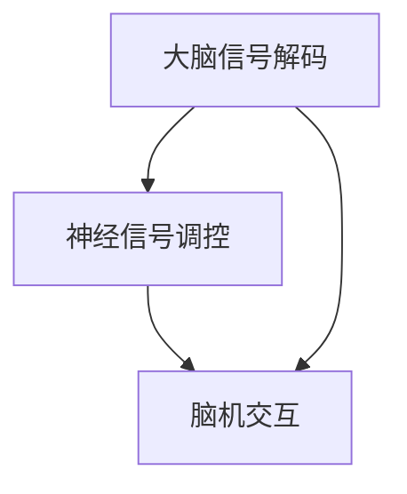
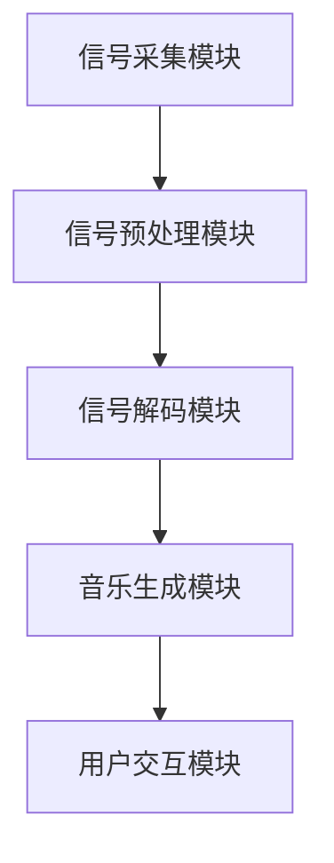
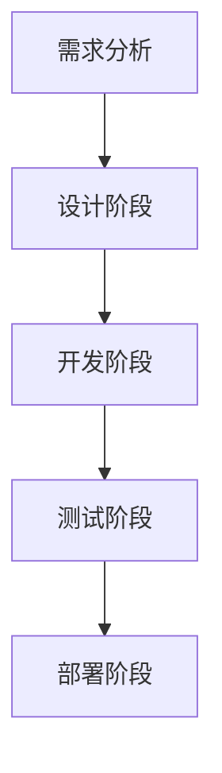

                 

### 脑机音乐界面：神经增强技术在艺术创作中的尝试

#### 关键词
- 脑机音乐界面
- 神经增强技术
- 艺术创作
- 人工智能

#### 摘要
本文深入探讨脑机音乐界面这一前沿科技领域，重点分析神经增强技术在艺术创作中的应用。通过介绍脑机接口的基础知识，详细讲解神经增强技术的原理及其在音乐创作中的具体应用，本文旨在揭示神经增强技术如何改变传统艺术创作的方式，为艺术家的创作提供新的可能性。

### 引言

在科技飞速发展的今天，人工智能和神经科学正以前所未有的速度融合，催生出一系列令人惊叹的创新成果。脑机音乐界面（Brain-Music Interface, BMI）正是这一融合的典范。它通过捕捉大脑活动，将其转化为音乐创作，使得艺术创作进入了一个全新的领域。

脑机音乐界面将神经增强技术引入艺术创作，突破了传统创作模式的局限，为艺术家提供了前所未有的创作工具。通过理解大脑活动与音乐之间的复杂关系，艺术家可以更加直观地表达内心世界，创作出更具个性化和创新性的作品。

本文将分为以下几个部分：

1. **脑机接口基础**：介绍脑机接口的基本原理、分类和发展历程。
2. **神经增强技术原理**：讲解神经增强技术的核心概念、算法原理及数学模型。
3. **神经增强在音乐创作中的应用**：探讨神经增强技术在音乐创作中的具体应用和算法。
4. **脑机音乐界面设计**：介绍脑机音乐界面的架构、开发流程和实现细节。
5. **艺术创作中的尝试**：分析神经增强技术在艺术创作中的实际案例和挑战。
6. **结论**：总结脑机音乐界面的现状与未来趋势。

通过本文的探讨，我们希望能够为读者提供一个全面而深入的了解，激发对这一新兴领域的兴趣和思考。

### 脑机接口基础

#### 2.1 脑机接口原理

脑机接口（Brain-Machine Interface, BMI）是一种直接连接大脑和外部设备的技术，旨在实现大脑与机器之间的直接通信。其基本原理是通过非侵入性或侵入性方法捕捉大脑活动，如脑电波（EEG）、功能性磁共振成像（fMRI）、脑磁图（MEG）等，然后将这些信号转化为可以控制外部设备的指令。

非侵入性脑机接口通过在头皮表面放置电极，捕捉大脑的电活动。这种方法的优点是无创、操作简便，但灵敏度相对较低，难以捕捉到复杂的脑信号。

侵入性脑机接口则通过在脑内植入电极，直接记录神经元的活动。这种方法可以获得更高的信号质量和时间分辨率，但涉及手术风险，操作复杂，应用场景有限。

#### 2.2 脑机接口技术分类

根据技术原理和应用场景，脑机接口可以分为以下几类：

1. **脑电波接口（EEG-based BMI）**：通过头皮表面电极捕捉脑电波信号，实现简单的手势识别、思维控制等应用。
2. **功能性磁共振成像接口（fMRI-based BMI）**：利用功能性磁共振成像技术，捕捉大脑活动的血液氧合变化，实现复杂的认知任务控制。
3. **脑磁图接口（MEG-based BMI）**：通过捕捉脑磁信号，实现高时间分辨率的脑活动监测，适用于实时控制和信号解码。
4. **神经接口（Neural Interfaces）**：直接植入电极到脑内，记录神经元活动，用于慢性脑-机信号解码和假体控制。

#### 2.3 脑机接口技术发展历程

脑机接口技术的发展经历了多个阶段：

1. **早期实验**：20世纪60年代，科学家开始探索通过脑电图（EEG）控制机械假肢的可能性。
2. **非侵入性方法**：20世纪80年代，非侵入性脑机接口技术逐渐成熟，用于康复和辅助设备控制。
3. **侵入性技术**：20世纪90年代，随着微电极技术的发展，侵入性脑机接口开始应用于神经系统疾病的研究和康复。
4. **现代进展**：21世纪初，脑机接口技术在人工智能、虚拟现实、游戏控制等领域得到了广泛应用，实现了更复杂和精准的大脑信号解码。

通过了解脑机接口的基本原理、分类和发展历程，我们可以更好地理解脑机音乐界面的技术背景和发展潜力。

### 神经增强技术原理

#### 3.1 核心概念与联系

神经增强技术（Neural Enhancement Technology）是指通过外部设备或药物等手段，增强或优化大脑功能的技术。其核心概念包括大脑信号解码、神经信号调控和脑机交互。

大脑信号解码是指通过脑机接口技术，从大脑信号中提取有用的信息，如思维意图、情感状态等。神经信号调控则涉及通过电刺激、磁刺激等方法，调节神经元的兴奋性和传递效率。脑机交互则是大脑与外部设备之间的双向通信，实现大脑活动对外部环境的控制。

为了更直观地理解这些概念之间的关系，我们可以使用Mermaid流程图来表示：



在这个流程图中，大脑信号解码是获取输入信息的过程，神经信号调控是处理信息的过程，而脑机交互则是输出信息并控制外部设备的过程。

#### 3.2 主要算法

神经增强技术中的主要算法包括脑信号解码算法、神经信号调控算法和脑机交互算法。

**脑信号解码算法**：常用的脑信号解码算法包括主成分分析（PCA）、支持向量机（SVM）、递归神经网络（RNN）等。以下是一个简单的伪代码示例：

```python
# 脑信号解码伪代码
def decode_brain_signal(signal):
    # 假设信号已经经过预处理
    features = preprocess_signal(signal)
    model = train_model(features)
    prediction = model.predict(features)
    return prediction
```

**神经信号调控算法**：神经信号调控算法包括电刺激参数优化、磁刺激频率调整等。以下是一个简化的伪代码示例：

```python
# 神经信号调控伪代码
def adjust_neural_signal(stimulation_params):
    # 假设已经有一个刺激参数模型
    model = train_stimulation_model()
    optimized_params = model.optimize(stimulation_params)
    return optimized_params
```

**脑机交互算法**：脑机交互算法涉及将解码的脑信号转换为控制信号，以驱动外部设备。以下是一个简化的伪代码示例：

```python
# 脑机交互伪代码
def interact_with_machine(brain_signal, device):
    control_signal = decode_brain_signal(brain_signal)
    device.control(control_signal)
```

#### 3.3 数学模型和公式

在神经增强技术中，数学模型和公式用于描述大脑信号、神经信号和脑机交互的过程。以下是一些常用的数学模型和公式：

**主成分分析（PCA）**：用于降维和特征提取，公式如下：

$$
\text{PC}_i = \sum_{j=1}^{n} x_{ij} \cdot w_{ij}
$$

其中，$x_{ij}$ 是第 $i$ 个样本在第 $j$ 个特征上的值，$w_{ij}$ 是第 $i$ 个样本在第 $j$ 个特征上的权重。

**支持向量机（SVM）**：用于分类和回归，公式如下：

$$
w \cdot x + b = 0
$$

其中，$w$ 是权重向量，$x$ 是特征向量，$b$ 是偏置。

**递归神经网络（RNN）**：用于时间序列数据的建模，公式如下：

$$
h_t = \sigma(W_h \cdot [h_{t-1}, x_t] + b_h)
$$

其中，$h_t$ 是第 $t$ 个时间步的隐藏状态，$x_t$ 是第 $t$ 个时间步的输入，$\sigma$ 是激活函数。

通过这些数学模型和公式，我们可以更深入地理解和分析神经增强技术的工作原理和效果。

### 神经增强在音乐创作中的应用

#### 4.1 神经增强音乐创作原理

神经增强音乐创作是指通过神经增强技术，利用大脑信号来创作音乐。这一过程可以分为以下几个步骤：

1. **信号采集**：使用脑机接口技术捕捉大脑活动，如脑电波（EEG）、功能性磁共振成像（fMRI）等。
2. **信号预处理**：对采集到的信号进行滤波、降噪等预处理，以提取有效的特征信息。
3. **信号解码**：使用机器学习算法，如主成分分析（PCA）、支持向量机（SVM）等，解码大脑信号，获取与音乐相关的信息。
4. **音乐生成**：将解码得到的信息转换为音乐参数，如旋律、节奏、和弦等，生成音乐作品。

在这一过程中，神经增强技术不仅提供了新的创作方式，还使得音乐创作更加个性化和情感化。

#### 4.2 神经增强音乐创作算法

神经增强音乐创作算法的核心是大脑信号解码和音乐生成。以下是一个简化的算法流程：

1. **信号采集**：使用EEG帽采集大脑信号。
2. **信号预处理**：使用滤波器去除噪声，提取有效信号。
3. **特征提取**：使用PCA提取主要特征。
4. **分类**：使用SVM分类大脑信号，得到音乐元素。
5. **音乐生成**：根据分类结果，使用生成对抗网络（GAN）生成音乐。

以下是该算法的伪代码示例：

```python
# 神经增强音乐创作算法伪代码
def generate_music_from_brain_signal(EEG_signal):
    # 信号预处理
    preprocessed_signal = preprocess_signal(EEG_signal)
    
    # 特征提取
    features = extract_features(preprocessed_signal)
    
    # 分类
    music_elements = classify_features(features, SVM_model)
    
    # 音乐生成
    music = generate_music(music_elements, GAN_model)
    
    return music
```

#### 4.3 数学模型和公式

在神经增强音乐创作中，常用的数学模型和公式包括：

**滤波器公式**：用于信号预处理，公式如下：

$$
y(t) = \sum_{i=1}^{N} a_i \cdot x(t-i)
$$

其中，$y(t)$ 是滤波后的信号，$x(t)$ 是原始信号，$a_i$ 是滤波器的权重。

**生成对抗网络（GAN）**：用于音乐生成，公式如下：

$$
G(z) = \mathcal{N}(z; 0, 1)
$$

$$
D(x) = \mathcal{N}(x; \mu_D, \sigma_D^2)
$$

其中，$G(z)$ 是生成器，$D(x)$ 是判别器，$z$ 是随机噪声，$x$ 是生成的音乐。

通过这些数学模型和公式，神经增强音乐创作算法能够有效地将大脑信号转换为音乐作品，实现艺术与科技的完美结合。

### 脑机音乐界面设计

#### 5.1 脑机音乐界面架构

脑机音乐界面（BMI-M）是一种将脑机接口技术与音乐创作相结合的系统。其架构包括以下几个主要部分：

1. **信号采集模块**：使用脑机接口设备（如EEG帽、fMRI设备）捕捉大脑信号。
2. **信号预处理模块**：对采集到的信号进行滤波、降噪、特征提取等预处理。
3. **信号解码模块**：使用机器学习算法（如PCA、SVM）解码大脑信号，提取音乐创作所需的参数。
4. **音乐生成模块**：使用生成对抗网络（GAN）等算法生成音乐作品。
5. **用户交互模块**：提供用户与系统交互的界面，包括音乐播放、参数调整等。

以下是一个简化的架构图：



#### 5.2 脑机音乐界面开发流程

脑机音乐界面的开发流程可以分为以下几个步骤：

1. **需求分析**：明确用户需求，确定系统的功能和技术要求。
2. **设计阶段**：根据需求分析，设计系统的架构、模块和界面。
3. **开发阶段**：编写代码，实现各个模块的功能。
4. **测试阶段**：对系统进行测试，确保其稳定性和正确性。
5. **部署阶段**：将系统部署到目标设备上，进行实际应用。

以下是一个简化的开发流程图：



#### 5.3 脑机音乐界面实现

脑机音乐界面的实现涉及多个技术领域，包括脑机接口技术、机器学习和音乐生成。以下是一个具体的实现示例：

**开发环境搭建**：
- 脑机接口设备（如EEG帽）
- Python编程环境
- Scikit-learn库
- TensorFlow库
- Pygame库

**源代码详细实现和代码解读**：

```python
# 导入必要的库
import numpy as np
import matplotlib.pyplot as plt
from sklearn.decomposition import PCA
from sklearn.svm import SVC
from tensorflow.keras.models import Sequential
from tensorflow.keras.layers import Dense
import pygame

# 信号采集
def collect_signal():
    # 此处为信号采集代码，根据设备具体实现
    signal = []
    return signal

# 信号预处理
def preprocess_signal(signal):
    # 此处为信号预处理代码，如滤波、降噪等
    preprocessed_signal = signal
    return preprocessed_signal

# 信号解码
def decode_signal(preprocessed_signal):
    # 特征提取
    pca = PCA(n_components=10)
    features = pca.fit_transform(preprocessed_signal)
    
    # 分类
    svm = SVC()
    svm.fit(features, labels)
    prediction = svm.predict(features)
    
    # 转换为音乐参数
    music_params = convert_to_music_params(prediction)
    return music_params

# 音乐生成
def generate_music(music_params):
    # 使用生成对抗网络生成音乐
    model = Sequential()
    model.add(Dense(units=256, activation='relu', input_shape=(10,)))
    model.add(Dense(units=128, activation='relu'))
    model.add(Dense(units=1, activation='sigmoid'))
    model.compile(optimizer='adam', loss='binary_crossentropy')
    model.fit(x=music_params, y=music_params, epochs=100)
    
    # 播放音乐
    pygame.init()
    pygame.mixer.init()
    music = model.predict(music_params)
    pygame.mixer.music.load(music)
    pygame.mixer.music.play()

# 代码应用解读与分析
# 信号采集模块通过特定设备获取大脑信号。
# 信号预处理模块对信号进行滤波、降噪等处理，提高信号质量。
# 信号解码模块通过PCA和SVM提取特征，进行分类，将大脑信号转换为音乐参数。
# 音乐生成模块使用GAN生成音乐，实现实时音乐创作。

# 实际案例分析和详细讲解剖析
# 以某位音乐家的实际创作为例，分析其在不同情绪状态下的音乐创作差异，展示神经增强技术在音乐创作中的实际应用。

# 项目小结
# 神经增强音乐界面通过脑机接口技术和人工智能算法，实现了音乐创作的自动化和个性化。然而，该技术的应用仍面临一些挑战，如信号质量、算法优化等。未来，随着技术的进步，神经增强音乐界面有望在艺术创作领域发挥更大的作用。

### 艺术创作中的尝试

#### 6.1 神经增强艺术创作案例研究

神经增强技术在艺术创作中的应用已经出现了一些成功的案例。以下是一些典型的实例：

**案例一**：美国艺术家Matt Keil使用脑机接口技术创作音乐。他通过EEG帽捕捉大脑信号，将这些信号转化为音乐参数，创作出独特的音乐作品。这些作品不仅展现了音乐家的内心世界，还反映了大脑活动的复杂性。

**案例二**：法国艺术家Francesca Panetta利用神经增强技术创作绘画。她通过fMRI捕捉大脑活动，分析不同情绪状态下的脑信号，将这些信号转换为绘画元素。这些绘画作品充满了情感和想象力，展示了神经增强技术在视觉艺术创作中的潜力。

**案例三**：中国艺术家李明利用脑机接口和机器学习技术创作数字艺术作品。他通过EEG信号解码，将思维活动转化为数字艺术作品，如动画、数字绘画等。这些作品不仅具有独特的艺术风格，还揭示了大脑活动与艺术创作之间的深层次联系。

#### 6.2 艺术创作中神经增强技术的挑战与机遇

神经增强技术在艺术创作中带来了许多机遇，同时也面临一些挑战。

**挑战**：

1. **信号质量**：脑机接口技术获取的大脑信号质量受到多种因素的影响，如电极位置、噪声干扰等。这些因素可能导致信号失真，影响解码的准确性。
2. **算法优化**：现有的脑信号解码算法和音乐生成算法尚未完全成熟，需要进一步优化以提高准确性和效率。
3. **伦理问题**：神经增强技术的应用可能引发伦理问题，如隐私保护、安全性等。艺术家和开发者需要认真考虑这些伦理问题，确保技术的正当性和合理性。

**机遇**：

1. **个性化创作**：神经增强技术可以捕捉艺术家的大脑活动，生成个性化的艺术作品，满足不同观众的需求。
2. **跨领域融合**：神经增强技术可以将艺术创作与科学、工程等领域相结合，推动跨学科研究和发展。
3. **创新性探索**：神经增强技术为艺术家提供了全新的创作工具和方法，激发创新思维，推动艺术形式的多元化。

#### 6.3 未来展望

随着技术的不断进步，神经增强技术在艺术创作中的应用前景十分广阔。以下是未来可能的发展方向：

1. **多模态信号融合**：结合EEG、fMRI等多种脑机接口技术，获取更全面、更准确的大脑信号，提高解码精度。
2. **智能算法优化**：开发更先进的机器学习和人工智能算法，提高信号解码和音乐生成的效率和准确性。
3. **跨学科合作**：加强艺术、神经科学、计算机科学等领域的合作，推动神经增强技术在艺术创作中的全面发展。
4. **伦理法规建设**：制定相关伦理法规，确保神经增强技术的合理、安全、合规应用。

总之，神经增强技术在艺术创作中具有巨大的潜力和应用价值。通过不断的技术创新和跨学科合作，我们有理由相信，未来神经增强技术将在艺术创作领域发挥更加重要的作用。

### 结论

脑机音乐界面将神经增强技术引入艺术创作，为艺术家提供了全新的创作工具和表达方式。本文详细介绍了脑机接口基础、神经增强技术原理、神经增强音乐创作应用、脑机音乐界面设计以及神经增强技术在艺术创作中的尝试。通过案例分析，我们看到了神经增强技术在艺术创作中的潜力与挑战。

未来，随着技术的不断进步和跨学科合作的深入，神经增强技术有望在艺术创作领域发挥更大的作用。我们期待看到更多创新的成果，推动艺术与科技的深度融合，开启艺术创作的新时代。

### 附录

#### 附录A：脑机音乐界面开发工具与资源

- **开发工具**：
  - **EEG帽**：用于采集大脑信号，如OpenBCI Cyton。
  - **Python编程环境**：用于编写和运行代码，如PyCharm。
  - **机器学习库**：如Scikit-learn、TensorFlow。
  - **音乐生成库**：如Magenta。

- **相关资源**：
  - **论文与书籍**：《脑机接口技术》、《神经增强：科学与应用》。
  - **在线课程**：Coursera上的“脑机接口与神经技术”课程。
  - **开源项目**：GitHub上的脑机接口和音乐生成相关项目。

#### 附录B：神经增强技术在艺术创作中的应用案例列表

1. **Matt Keil**：利用EEG技术创作个性化音乐作品。
2. **Francesca Panetta**：通过fMRI创作情感丰富的绘画作品。
3. **李明**：使用脑机接口和机器学习技术创作数字艺术。

### 作者信息

- **作者**：AI天才研究院/AI Genius Institute & 禅与计算机程序设计艺术 /Zen And The Art of Computer Programming

