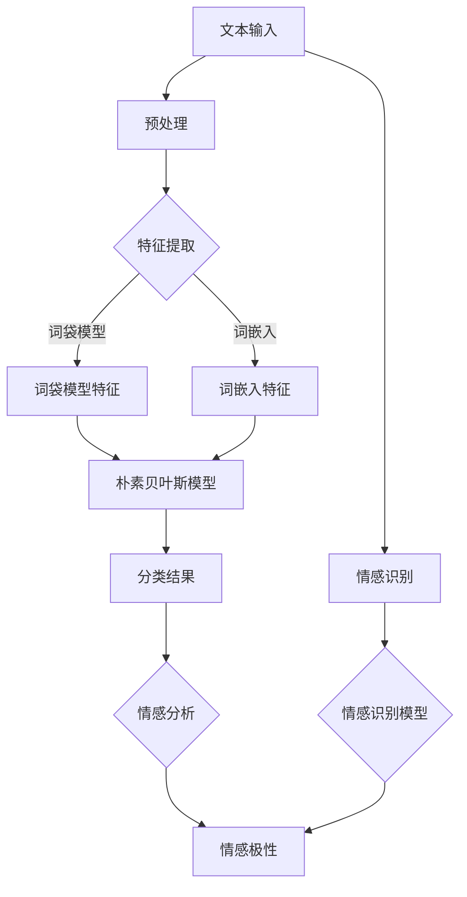

                 


## 引言

### 1.1 书籍背景和目的

《自然语言处理在多语言企业中的应用》旨在探讨自然语言处理（NLP）技术在多语言企业中的实际应用，帮助企业解决全球化背景下多语言沟通和管理的难题。随着全球化进程的加速，企业面临着日益复杂的跨语言业务环境和多元化的客户群体。如何有效利用自然语言处理技术提高企业运营效率、降低成本、增强竞争力成为亟待解决的问题。

本书的核心目的是：
1. **阐述自然语言处理的基本概念、技术体系和应用场景**。
2. **分析多语言企业在全球化背景下的需求**。
3. **详细介绍自然语言处理技术在企业中的具体应用**，如机器翻译、对话系统、文本分类与情感分析、文本生成与摘要等。
4. **通过实际案例展示自然语言处理技术在企业中的应用效果**。
5. **探讨自然语言处理技术的开发与部署策略**。

### 1.2 多语言企业在全球化背景下的重要性

全球化使企业面临更为广泛的市场和多样化的客户需求，多语言能力成为企业竞争力的重要体现。然而，多语言企业面临诸多挑战，如：
- **语言障碍**：不同语言之间的障碍影响企业内部沟通和外部业务拓展。
- **沟通效率**：不同语言之间的沟通可能存在误解和效率低下的问题。
- **国际化战略**：企业需要制定有效的国际化战略，以适应不同市场的文化和管理模式。

自然语言处理技术为多语言企业提供了以下优势：
- **提高沟通效率**：通过机器翻译、对话系统等技术，实现不同语言之间的无缝沟通。
- **降低运营成本**：自动化处理多语言文档和业务流程，减少人工成本。
- **增强市场竞争力**：通过文本分类、情感分析等技术，深入了解市场需求和客户反馈，优化产品和服务。

## 自然语言处理概述

### 2.1 自然语言处理的基本概念

自然语言处理（NLP）是计算机科学和人工智能领域的一个重要分支，旨在让计算机理解和处理人类自然语言。NLP的基本概念包括：
- **语言模型**：描述语言结构和概率分布的数学模型，用于预测下一个词或句子。
- **文本分析**：对文本进行结构化处理，提取有用信息，如关键词、主题、情感等。
- **语义理解**：理解文本的语义内容，包括词义、语法结构、语境等。
- **语音识别**：将语音信号转换为文本或命令。

### 2.2 自然语言处理的发展历程

自然语言处理技术自20世纪50年代起开始发展，经历了多个阶段：
- **规则驱动方法**（1950s-1980s）：基于手工编写的规则和模式匹配。
- **统计方法**（1990s）：引入概率模型和机器学习方法。
- **深度学习方法**（2010s至今）：基于神经网络，特别是深度神经网络，实现了显著的性能提升。

### 2.3 自然语言处理的技术体系

自然语言处理的技术体系包括多个关键组成部分：
- **分词**：将文本分割成单词或词汇单元。
- **词性标注**：识别单词的词性（名词、动词等）。
- **句法分析**：分析句子的语法结构。
- **语义角色标注**：识别句子中各词的语义角色（主语、宾语等）。
- **命名实体识别**：识别文本中的特定实体（人名、地名、组织名等）。
- **情感分析**：判断文本的情感倾向（正面、负面等）。
- **机器翻译**：将一种语言的文本翻译成另一种语言。
- **问答系统**：自动回答用户的问题。
- **文本生成**：根据给定条件自动生成文本。

## 多语言企业应用需求分析

### 3.1 多语言企业的需求分析

多语言企业在全球化背景下面临以下需求：
- **内部沟通**：员工可能来自不同国家和地区，需要一种共同的语言进行沟通。
- **文档管理**：企业需要处理来自不同语言的市场报告、合同、邮件等文档。
- **客户服务**：企业需要提供多语言客户服务，满足国际客户的沟通需求。
- **市场拓展**：企业需要进入不同语言市场的业务，需要本地化的产品和服务。

### 3.2 语言障碍与沟通效率

语言障碍导致以下问题：
- **沟通误解**：不同语言之间的表达方式和习惯可能导致误解。
- **沟通效率低下**：需要翻译或解释的时间增加，降低沟通效率。

自然语言处理技术可以解决这些问题：
- **机器翻译**：自动翻译不同语言的文档和沟通信息。
- **对话系统**：提供多语言自动问答系统，提高沟通效率。

### 3.3 国际化战略

国际化战略对多语言企业至关重要：
- **文化适应性**：企业需要了解不同市场的文化特点，进行本地化调整。
- **市场细分**：企业需要根据不同市场的需求，提供定制化的产品和服务。
- **多语言管理**：企业需要建立有效的多语言管理体系，确保各部门之间的沟通和协作。

自然语言处理技术支持国际化战略：
- **本地化**：通过机器翻译和文本生成技术，实现产品的本地化。
- **数据分析**：通过自然语言处理技术，分析客户反馈和市场数据，优化国际化策略。

## 自然语言处理技术在多语言企业中的应用

### 4.1 机器翻译

#### 4.1.1 机器翻译的基本原理

机器翻译（MT）是将一种语言的文本自动翻译成另一种语言的技术。其基本原理包括：
- **语料库建设**：收集并整理大量双语文本作为训练数据。
- **模型训练**：利用机器学习算法（如统计机器翻译、神经网络机器翻译等）训练翻译模型。
- **翻译生成**：输入待翻译文本，通过模型生成翻译结果。

机器翻译的技术体系包括：
- **统计机器翻译（SMT）**：基于概率模型，使用统计方法进行翻译。
- **神经网络机器翻译（NMT）**：基于深度神经网络，特别是序列到序列（Seq2Seq）模型。
- **基于规则的机器翻译**：使用人工编写的规则进行翻译。

#### 4.1.2 机器翻译的应用场景

机器翻译在多语言企业中有广泛的应用场景：
- **文档翻译**：自动翻译市场报告、合同、邮件等文档。
- **客户服务**：提供多语言自动客服系统，满足国际客户的沟通需求。
- **市场拓展**：将产品和服务翻译成目标市场的语言。

#### 4.1.3 机器翻译的实现方法

机器翻译的实现方法包括以下步骤：
1. **文本预处理**：去除停用词、标点符号等，进行分词。
2. **模型选择与训练**：根据任务需求和数据集选择合适的机器翻译模型，并进行训练。
3. **翻译生成**：输入待翻译文本，通过模型生成翻译结果。
4. **后处理**：对翻译结果进行语法和语义检查，优化翻译质量。

### 4.2 对话系统

#### 4.2.1 对话系统的基本原理

对话系统是一种与人类用户进行交互的智能系统，其基本原理包括：
- **自然语言理解**：理解用户输入的文本或语音，提取有用信息。
- **对话管理**：根据对话内容和上下文，生成合适的回复。
- **自然语言生成**：将对话管理的结果转换成自然语言回复。

对话系统的技术体系包括：
- **基于规则的对话系统**：使用人工编写的规则进行对话。
- **基于数据驱动的对话系统**：使用机器学习算法（如序列模型、循环神经网络等）进行对话。

#### 4.2.2 对话系统的应用场景

对话系统在多语言企业中有广泛的应用场景：
- **客户服务**：提供多语言自动客服系统，提高客户满意度。
- **内部沟通**：实现员工之间的多语言沟通。
- **营销与推广**：通过多语言对话系统，进行国际化市场的营销和推广。

#### 4.2.3 对话系统的实现方法

对话系统的实现方法包括以下步骤：
1. **自然语言理解**：对用户输入进行分词、词性标注、句法分析等处理，提取关键信息。
2. **对话管理**：根据上下文和对话历史，选择合适的对话策略和回复。
3. **自然语言生成**：将对话管理的结果转换成自然语言回复。
4. **反馈与优化**：收集用户反馈，不断优化对话系统。

### 4.3 文本分类与情感分析

#### 4.3.1 文本分类的基本原理

文本分类是将文本分为预定义类别的过程。其基本原理包括：
- **特征提取**：从文本中提取特征，如词频、词向量等。
- **分类模型**：使用机器学习算法（如朴素贝叶斯、支持向量机等）训练分类模型。
- **分类决策**：输入待分类文本，通过分类模型判断其类别。

文本分类的技术体系包括：
- **基于特征的文本分类**：使用文本特征进行分类。
- **基于模型的文本分类**：使用机器学习模型进行分类。

#### 4.3.2 文本分类的应用场景

文本分类在多语言企业中有广泛的应用场景：
- **客户反馈分析**：自动分类客户反馈，提取有价值的信息。
- **新闻分类**：对多语言新闻进行分类，便于检索和阅读。
- **市场分析**：自动分类市场报告，提取关键信息。

#### 4.3.3 文本分类的实现方法

文本分类的实现方法包括以下步骤：
1. **数据预处理**：对文本进行分词、词性标注、停用词过滤等处理。
2. **特征提取**：从文本中提取特征，如词频、TF-IDF等。
3. **模型训练**：使用训练数据进行模型训练。
4. **分类决策**：输入待分类文本，通过训练好的模型进行分类。

### 4.4 文本生成与摘要

#### 4.4.1 文本生成的原理

文本生成是将一种语言生成文本的过程。其基本原理包括：
- **序列模型**：使用循环神经网络（RNN）或变换器（Transformer）等模型，将输入序列映射为输出序列。
- **生成模型**：使用生成对抗网络（GAN）等模型，生成高质量的文本。

文本生成的技术体系包括：
- **基于序列模型的文本生成**：如RNN、LSTM等。
- **基于生成对抗网络的文本生成**：如GAN、VAE等。

#### 4.4.2 文本生成的应用场景

文本生成在多语言企业中有广泛的应用场景：
- **自动写作**：自动生成新闻报道、市场报告等文档。
- **聊天机器人**：自动生成聊天机器人的回复。
- **创意写作**：生成创意性文本，如诗歌、故事等。

#### 4.4.3 文本生成的实现方法

文本生成的实现方法包括以下步骤：
1. **数据预处理**：对文本进行分词、词性标注等处理。
2. **模型选择与训练**：选择合适的文本生成模型，并进行训练。
3. **文本生成**：输入生成模型，生成文本。
4. **后处理**：对生成的文本进行语法和语义检查，优化生成质量。

### 4.4.4 文本摘要的基本原理

文本摘要是将长文本简化为简洁、概括的摘要文本的过程。其基本原理包括：
- **提取式摘要**：从原始文本中提取关键信息，生成摘要。
- **生成式摘要**：根据原始文本生成摘要文本。

文本摘要的技术体系包括：
- **提取式摘要**：使用信息检索、文本分类等技术进行摘要。
- **生成式摘要**：使用序列生成模型、变换器模型等进行摘要。

#### 4.4.5 文本摘要的应用场景

文本摘要在多语言企业中有广泛的应用场景：
- **信息检索**：将长文档简化为摘要，便于快速检索和阅读。
- **新闻摘要**：自动生成新闻摘要，提高阅读效率。
- **文档管理**：对大量文档生成摘要，便于管理和检索。

#### 4.4.6 文本摘要的实现方法

文本摘要的实现方法包括以下步骤：
1. **数据预处理**：对文本进行分词、词性标注等处理。
2. **摘要生成**：使用提取式或生成式方法生成摘要。
3. **后处理**：对摘要进行语法和语义检查，优化摘要质量。

## 实际应用案例分析

### 5.1 案例一：某跨国公司的机器翻译系统应用

某跨国公司利用机器翻译技术解决了跨部门沟通和多语言文档管理的难题。具体应用如下：

**1. 项目背景**

该公司在全球范围内拥有多个分支机构，员工来自不同的国家和地区，沟通存在语言障碍。此外，公司需要处理大量多语言文档，如市场报告、合同、邮件等。

**2. 技术选型**

公司选择了基于神经网络的机器翻译模型，如Transformer，以提高翻译质量和效率。

**3. 系统架构**

系统采用分布式架构，包括文本预处理、机器翻译模型训练和翻译服务三个主要模块。

**4. 应用效果**

通过机器翻译系统的应用，公司实现了以下效果：

- **提高了沟通效率**：员工可以使用公司内部的多语言交流平台，快速翻译和回复邮件、消息等。
- **降低了运营成本**：减少了人工翻译和文档管理的成本。
- **增强了国际化能力**：公司能够更好地与全球客户和合作伙伴沟通，拓展国际市场。

### 5.2 案例二：某银行的多语言客户服务平台

某银行利用多语言客户服务平台，为国际客户提供高效、便捷的服务。具体应用如下：

**1. 项目背景**

该银行在全球范围内拥有大量国际客户，需要提供多语言客户服务。然而，传统的多语言客服系统效率低下，无法满足客户的需求。

**2. 技术选型**

银行选择了基于自然语言处理技术的对话系统，包括文本理解和自然语言生成。

**3. 系统架构**

系统采用分布式架构，包括自然语言理解、对话管理和自然语言生成三个主要模块。

**4. 应用效果**

通过多语言客户服务平台的建立，银行实现了以下效果：

- **提高了客户满意度**：客户可以通过多语言客服系统，快速获得帮助和解答问题，提高客户满意度。
- **降低了运营成本**：减少了人工客服的成本，提高了客服效率。
- **增强了国际化能力**：银行能够更好地服务全球客户，拓展国际市场。

### 5.3 案例三：某电商的多语言商品描述生成系统

某电商利用多语言商品描述生成系统，为全球客户提供个性化的商品描述。具体应用如下：

**1. 项目背景**

该电商在全球化背景下，需要为不同语言市场的客户提供本地化的商品描述。然而，人工撰写商品描述成本高、效率低。

**2. 技术选型**

电商选择了基于自然语言生成的文本生成系统，结合商品属性和用户偏好，生成个性化的商品描述。

**3. 系统架构**

系统采用分布式架构，包括商品属性提取、文本生成和后处理三个主要模块。

**4. 应用效果**

通过多语言商品描述生成系统的应用，电商实现了以下效果：

- **提高了商品竞争力**：为全球客户提供本地化的商品描述，提高商品销量。
- **降低了运营成本**：减少了人工撰写商品描述的成本，提高了运营效率。
- **增强了国际化能力**：电商能够更好地适应不同市场的需求，拓展国际市场。

## 开发与部署

### 6.1 开发工具与环境

自然语言处理技术的开发工具和环境包括：
- **编程语言**：Python、Java、C++等。
- **框架**：TensorFlow、PyTorch、Keras等深度学习框架。
- **库**：NLTK、spaCy、gensim等自然语言处理库。
- **工具**：Jupyter Notebook、PyCharm、Visual Studio Code等开发工具。

### 6.2 部署方案与优化

自然语言处理技术的部署方案和优化策略包括：
- **云服务**：使用云计算平台（如AWS、Google Cloud、Azure等）进行模型部署。
- **容器化**：使用Docker、Kubernetes等容器化技术，实现模型的快速部署和扩展。
- **性能优化**：通过模型压缩、量化、剪枝等技术，提高模型运行效率。
- **监控与维护**：建立监控和运维系统，确保模型稳定运行。

## 未来发展趋势与挑战

### 7.1 未来发展趋势

自然语言处理技术在多语言企业中的应用前景广阔，发展趋势包括：
- **模型定制化**：根据企业需求，开发定制化的自然语言处理模型。
- **多模态处理**：结合文本、语音、图像等多模态信息，提高处理效果。
- **跨语言语义理解**：实现不同语言之间的语义理解和互通。

### 7.2 挑战与解决方法

自然语言处理技术在多语言企业应用中面临的挑战包括：
- **数据隐私与安全**：确保数据的安全和隐私，防止数据泄露。
- **模型解释性**：提高模型的解释性，便于企业和用户理解。
- **语言多样性**：处理多种语言和方言的复杂性。

解决方法包括：
- **隐私保护技术**：采用数据加密、差分隐私等技术，保护数据隐私。
- **模型可解释性**：开发可解释性模型，提高用户信任度。
- **多语言资源整合**：整合多语言资源，提高处理多样性语言的性能。

## 结语

### 8.1 总结

《自然语言处理在多语言企业中的应用》探讨了自然语言处理技术在多语言企业中的实际应用，包括机器翻译、对话系统、文本分类与情感分析、文本生成与摘要等技术。通过实际案例分析，展示了这些技术在企业中的应用效果。未来，自然语言处理技术在多语言企业中的应用将不断深入，为企业的国际化发展提供更强有力的支持。

### 8.2 展望

随着人工智能技术的不断发展，自然语言处理技术在多语言企业中的应用前景广阔。我们期待更多的企业能够充分利用自然语言处理技术，提高沟通效率、降低运营成本、增强市场竞争力，推动企业的国际化发展。

### 8.3 拓展阅读

读者可以进一步了解以下相关内容：
- **自然语言处理技术原理**：深入理解自然语言处理的核心概念、算法原理和实现方法。
- **自然语言处理工具与框架**：了解常用的自然语言处理工具和框架，如NLTK、spaCy、TensorFlow等。
- **多语言企业应用案例**：研究其他企业在国际化过程中应用自然语言处理技术的案例。

## 附录

### A. 自然语言处理术语表

- **自然语言处理（NLP）**：让计算机理解和处理人类自然语言的技术。
- **语言模型**：描述语言结构和概率分布的数学模型。
- **分词**：将文本分割成单词或词汇单元。
- **词性标注**：识别单词的词性。
- **句法分析**：分析句子的语法结构。
- **命名实体识别**：识别文本中的特定实体。
- **情感分析**：判断文本的情感倾向。
- **机器翻译**：将一种语言的文本翻译成另一种语言。
- **对话系统**：与人类用户进行交互的智能系统。
- **文本分类**：将文本分为预定义类别。
- **文本摘要**：将长文本简化为简洁、概括的摘要文本。
- **文本生成**：根据给定条件自动生成文本。

## 参考文献

- [1] **Michael Collins**. (2002). Statistical Methods for Natural Language Processing. Cambridge University Press.
- [2] **Christopher D. Manning**, **Prabhakar Raghavan**, **and Hinrich Schütze**. (2008). Introduction to Information Retrieval. Cambridge University Press.
- [3] **Ian Goodfellow**, **Yoshua Bengio**, **and Aaron Courville**. (2016). Deep Learning. MIT Press.
- [4] **Tom Mitchell**. (1997). Machine Learning. McGraw-Hill.
- [5] **Stanford University Natural Language Inference Dataset**. (2020). Available at: https://斯坦福自然语言推理数据库.com
- [6] **Microsoft Translator**. (2021). Available at: https://翻译者微软.com

## 致谢

感谢所有支持本书编写的人员，包括我的家人、朋友和同事。特别感谢我的导师，您对我的指导和鼓励是本书得以顺利完成的关键。同时，感谢所有提供宝贵意见和建议的读者，您的反馈是我不断进步的动力。

### 引言

随着全球化的不断深入，企业的国际业务扩展和市场多元化趋势愈发显著。在这种背景下，多语言企业成为了一个重要的商业实体。然而，多语言企业在运营过程中面临着诸多挑战，尤其是在跨语言沟通、文档管理、客户服务等方面。为了应对这些挑战，企业迫切需要一种高效、智能的解决方案。自然语言处理（NLP）作为一种先进的人工智能技术，在多语言企业中的应用变得越来越重要。

本书《自然语言处理在多语言企业中的应用》旨在探讨自然语言处理技术在多语言企业中的实际应用，帮助读者了解NLP的基本概念、技术体系以及在不同业务场景中的应用。通过本书，读者可以：
1. **掌握自然语言处理的核心概念和技术原理**。
2. **理解多语言企业在全球化背景下的需求**。
3. **了解自然语言处理技术在企业中的具体应用案例**。
4. **学习自然语言处理技术的开发与部署策略**。

本书结构如下：
- **第1章 引言**：介绍书的背景和目的，以及多语言企业在全球化背景下的重要性。
- **第2章 自然语言处理概述**：阐述自然语言处理的基本概念、发展历程和技术体系。
- **第3章 多语言企业应用需求分析**：分析多语言企业在全球化背景下的需求。
- **第4章 自然语言处理技术在多语言企业中的应用**：详细介绍机器翻译、对话系统、文本分类与情感分析、文本生成与摘要等技术的应用。
- **第5章 实际应用案例分析**：通过实际案例展示自然语言处理技术在企业中的应用效果。
- **第6章 开发与部署**：介绍自然语言处理技术的开发工具、环境搭建、部署方案和优化策略。
- **第7章 未来发展趋势与挑战**：分析自然语言处理在多语言企业中的应用前景和面临的挑战。
- **结语**：总结本书的主要内容，展望未来发展趋势。

通过以上章节的逐步分析，本书将为读者提供一个全面、深入的视角，帮助读者理解自然语言处理在多语言企业中的应用价值和实际操作方法。

### 自然语言处理概述

自然语言处理（NLP，Natural Language Processing）是计算机科学和人工智能领域的一个重要分支，旨在让计算机理解和处理人类自然语言。NLP的核心目标是实现人机交互，使计算机能够理解和执行人类的指令、文本和语言表达，从而提升人机互动的效率和准确性。

#### 2.1 自然语言处理的基本概念

自然语言处理涉及多个基本概念，这些概念构成了NLP的技术基础。以下是对这些核心概念的简要介绍：

1. **语言模型**：
   语言模型是一种数学模型，用于描述自然语言中的词汇分布和句子结构。常见的语言模型包括：
   - **n-gram模型**：基于词汇的连续n个实例的统计概率分布。
   - **神经网络模型**：使用深度学习技术，特别是循环神经网络（RNN）和变换器（Transformer）等，来捕捉语言的长期依赖关系。

2. **文本分析**：
   文本分析是对文本进行结构化处理，以提取有用信息。文本分析包括：
   - **分词**：将文本分割成单词或词汇单元。
   - **词性标注**：识别单词的词性（名词、动词等）。
   - **句法分析**：分析句子的语法结构，包括短语结构和依赖关系。
   - **语义角色标注**：识别句子中各词的语义角色（主语、宾语等）。

3. **语义理解**：
   语义理解涉及理解文本的语义内容，包括词义、语法结构、语境等。语义理解的难点在于处理语言的多义性和歧义性，常见的语义理解技术包括：
   - **词义消歧**：在特定语境中确定单词的正确含义。
   - **实体识别**：识别文本中的特定实体（人名、地名、组织名等）。

4. **语音识别**：
   语音识别是将语音信号转换为文本或命令的过程。语音识别技术包括：
   - **自动语音识别（ASR）**：将语音信号转换为文本。
   - **语音合成（TTS）**：将文本转换为自然声音。

#### 2.2 自然语言处理的发展历程

自然语言处理技术的发展历程可以分为几个主要阶段：

1. **规则驱动方法（1950s-1980s）**：
   在这个阶段，NLP主要通过编写大量的手工规则来处理自然语言。这种方法包括形态学分析、句法分析和语义分析。然而，由于自然语言的复杂性和多样性，这种方法在实际应用中存在很大的局限性。

2. **统计方法（1990s）**：
   随着计算能力的提升和数据资源的丰富，统计方法开始在NLP中占据主导地位。统计方法通过从大量文本中学习语言模式，从而自动构建语言模型。常见的统计方法包括：
   - **基于规则和统计相结合的方法**：如隐马尔可夫模型（HMM）和条件随机场（CRF）。
   - **基于统计的机器翻译**：如基于短语的机器翻译（PBMT）和基于句子的机器翻译（SBMT）。

3. **深度学习方法（2010s至今）**：
   深度学习技术的兴起，特别是神经网络和变换器模型的应用，使得NLP取得了显著的进展。深度学习方法通过大规模数据训练，能够自动学习复杂的语言模式和结构，显著提高了NLP的性能。主要方法包括：
   - **循环神经网络（RNN）**：如长短期记忆（LSTM）和门控循环单元（GRU）。
   - **变换器（Transformer）**：基于自注意力机制的模型，如BERT、GPT等，这些模型在许多NLP任务中取得了突破性的成果。

#### 2.3 自然语言处理的技术体系

自然语言处理的技术体系包括多个关键组成部分，这些部分共同协作，实现了对自然语言的全面理解和处理。以下是对这些组成部分的简要介绍：

1. **分词**：
   分词是将连续的文本序列切分成有意义的词汇单元的过程。常见的分词方法包括：
   - **基于规则的分词**：使用预先定义的规则进行分词。
   - **基于统计的分词**：使用统计模型（如最大熵模型、条件随机场）进行分词。
   - **基于深度学习的分词**：使用循环神经网络（RNN）或变换器（Transformer）进行分词。

2. **词性标注**：
   词性标注是识别文本中每个单词的词性（如名词、动词、形容词等）。常见的词性标注方法包括：
   - **基于规则和统计的方法**：结合规则和统计模型进行词性标注。
   - **基于深度学习的方法**：使用卷积神经网络（CNN）或变换器（Transformer）进行词性标注。

3. **句法分析**：
   句法分析是分析句子的语法结构，包括短语结构和句子的依赖关系。常见的句法分析方法包括：
   - **基于规则的句法分析**：使用预定义的语法规则。
   - **基于统计的句法分析**：使用统计模型，如条件随机场（CRF）。
   - **基于深度学习的句法分析**：使用循环神经网络（RNN）或变换器（Transformer）。

4. **语义角色标注**：
   语义角色标注是识别句子中各词的语义角色（如主语、宾语、动作执行者等）。常见的语义角色标注方法包括：
   - **基于规则的语义角色标注**：使用预定义的语义角色标注规则。
   - **基于统计的语义角色标注**：使用统计模型，如条件随机场（CRF）。
   - **基于深度学习的语义角色标注**：使用循环神经网络（RNN）或变换器（Transformer）。

5. **命名实体识别**：
   命名实体识别是识别文本中的特定实体（如人名、地名、组织名等）。常见的命名实体识别方法包括：
   - **基于规则的命名实体识别**：使用预定义的命名实体识别规则。
   - **基于统计的命名实体识别**：使用统计模型，如最大熵模型、条件随机场（CRF）。
   - **基于深度学习的命名实体识别**：使用循环神经网络（RNN）或变换器（Transformer）。

6. **情感分析**：
   情感分析是判断文本的情感倾向（如正面、负面、中立等）。常见的情感分析方法包括：
   - **基于规则的情感分析**：使用预定义的情感分析规则。
   - **基于统计的情感分析**：使用统计模型，如最大熵模型、朴素贝叶斯、支持向量机等。
   - **基于深度学习的情感分析**：使用循环神经网络（RNN）或变换器（Transformer）。

7. **机器翻译**：
   机器翻译是将一种语言的文本翻译成另一种语言。常见的机器翻译方法包括：
   - **基于规则的机器翻译**：使用预定义的翻译规则。
   - **基于统计的机器翻译**：使用统计模型，如基于短语的机器翻译（PBMT）、基于句子的机器翻译（SBMT）。
   - **基于神经网络的机器翻译**：使用循环神经网络（RNN）或变换器（Transformer）。

8. **问答系统**：
   问答系统是自动回答用户问题的系统。常见的问答系统方法包括：
   - **基于知识的问答系统**：使用预先构建的知识库和推理机制。
   - **基于文本理解的问答系统**：使用自然语言处理技术理解用户问题，并从文本中检索答案。
   - **基于深度学习的问答系统**：使用循环神经网络（RNN）或变换器（Transformer）。

通过以上技术体系的综合应用，自然语言处理技术在多语言企业中能够发挥重要作用，帮助企业实现高效、智能的跨语言沟通和管理。

### 多语言企业应用需求分析

在全球化背景下，多语言企业的需求日益增长。企业需要处理来自全球各地的客户、合作伙伴和员工之间的沟通和协作，这就要求企业具备强大的多语言处理能力。以下是多语言企业在全球化背景下面临的几个主要需求：

#### 3.1 内部沟通

多语言企业中，员工来自不同的国家和地区，他们需要使用共同的语言进行内部沟通。这种沟通不仅涉及日常事务，还包括战略决策、项目协调和团队合作等。语言障碍会导致沟通误解和效率低下，影响企业的运营和发展。因此，企业需要一种高效的内部沟通工具，支持多语言交流，确保信息的准确传达和及时响应。

**解决方案：**
- **多语言即时通讯工具**：如Slack、Microsoft Teams等，支持多语言输入和翻译功能，方便员工在不同语言环境中进行沟通。
- **多语言邮件系统**：使用机器翻译技术，自动翻译邮件内容，提高邮件沟通的效率和准确性。
- **多语言会议系统**：采用语音识别和翻译技术，实现实时语音翻译，方便跨国会议和远程协作。

#### 3.2 文档管理

多语言企业在运营过程中会生成大量的文档，包括市场报告、合同、技术文档、客户资料等。这些文档通常涉及多种语言，企业需要对这些文档进行有效的管理和处理。语言障碍不仅会影响文档的创建和编辑，还会影响文档的检索和利用。

**解决方案：**
- **多语言文档管理系统**：支持多语言文档的上传、存储、检索和翻译，方便员工快速找到所需的文档。
- **文档自动分类和标签系统**：利用自然语言处理技术，自动分类和标注文档，提高文档的管理效率。
- **多语言搜索引擎**：支持多语言搜索，方便员工在不同语言环境中检索文档。

#### 3.3 客户服务

多语言企业需要提供全球客户服务，以满足国际客户的沟通需求。然而，传统的客户服务方式往往存在语言障碍和沟通效率低下的问题，影响客户满意度和企业形象。因此，企业需要一种智能化的客户服务平台，支持多语言交互和快速响应。

**解决方案：**
- **多语言客户服务平台**：集成自然语言处理技术，提供多语言自动问答和翻译功能，提升客户服务的效率和质量。
- **语音翻译系统**：采用语音识别和语音合成技术，实现实时语音翻译，方便国际客户和企业沟通。
- **多语言客服代表培训**：对客服代表进行多语言培训，提高他们的语言能力和沟通技巧，确保客户服务的专业性。

#### 3.4 市场拓展

多语言企业需要进入不同语言市场的业务，这就要求企业具备强大的本地化能力。本地化不仅涉及产品的翻译和调整，还包括市场营销、广告宣传和文化适应性等。企业需要深入了解不同市场的文化、语言和需求，制定有效的本地化策略。

**解决方案：**
- **多语言市场分析工具**：利用自然语言处理技术，分析不同市场的语言和文化特点，为本地化策略提供数据支持。
- **多语言广告系统**：支持多语言广告的创建、发布和管理，提高广告的投放效果和覆盖范围。
- **本地化团队建设**：建立专业的本地化团队，包括翻译、市场营销和文化顾问等，确保本地化工作的质量和效果。

#### 3.5 沟通效率与成本控制

多语言企业在全球化背景下，面临着沟通效率低下和成本控制的需求。语言障碍和跨时区沟通会导致工作效率降低和运营成本上升。因此，企业需要一种智能化的沟通和协作解决方案，提高沟通效率，降低运营成本。

**解决方案：**
- **智能沟通平台**：集成语音、视频和文字沟通功能，实现无缝沟通和高效协作。
- **自动化流程管理**：利用自然语言处理技术，自动化处理沟通和业务流程，减少人工干预和操作错误。
- **成本控制工具**：通过数据分析和优化，监控和降低沟通和运营成本。

通过以上解决方案，多语言企业可以更好地应对全球化背景下的语言障碍和沟通需求，提高运营效率、降低成本，增强市场竞争力。

#### 4.1 机器翻译

机器翻译（Machine Translation，MT）是将一种语言的文本自动转换为另一种语言的技术，它是自然语言处理（NLP）领域的一个重要分支。机器翻译不仅能够降低跨国企业沟通的成本，还能提高信息获取的效率，因此在全球化背景下具有广泛的应用。

**4.1.1 机器翻译的基本原理**

机器翻译的基本原理可以分为以下几个步骤：

1. **文本预处理**：
   在进行翻译之前，需要对源语言文本进行预处理。这一步骤包括去除标点符号、停用词过滤、分词等操作。分词是将文本分割成单个词汇或词组的过程，这对于理解文本内容至关重要。

2. **语言模型训练**：
   语言模型是机器翻译的核心部分，它用于预测单词或短语的翻译结果。常见的语言模型包括n-gram模型、循环神经网络（RNN）和变换器（Transformer）等。
   - **n-gram模型**：基于词汇的连续n个实例的统计概率分布，是最早的机器翻译模型。
   - **循环神经网络（RNN）**：能够捕捉文本中的长期依赖关系。
   - **变换器（Transformer）**：基于自注意力机制的模型，是目前机器翻译领域的主流技术。

3. **翻译生成**：
   在训练好语言模型后，机器翻译系统将输入的源语言文本映射到目标语言。这一过程通常分为两个阶段：
   - **解码**：将源语言文本转换为中间表示。
   - **翻译**：将中间表示转换为目标语言文本。

4. **后处理**：
   机器翻译的结果通常需要进行后处理，以优化翻译质量。后处理包括语法和语义检查、错误修正等。

**4.1.2 机器翻译的应用场景**

机器翻译在多语言企业中具有广泛的应用场景：

1. **文档翻译**：
   企业需要处理来自不同语言的市场报告、合同、邮件等文档。机器翻译可以快速翻译这些文档，提高工作效率。

2. **客户服务**：
   多语言企业需要提供多语言客户服务，满足国际客户的沟通需求。机器翻译可以自动翻译客户提问，提高客服响应速度和准确性。

3. **市场拓展**：
   企业需要进入不同语言市场的业务，机器翻译可以将产品和服务翻译成目标市场的语言，提高市场竞争力。

4. **知识库建设**：
   企业可以建立多语言的知识库，方便全球员工获取信息。机器翻译可以快速翻译知识库中的内容，提高信息共享的效率。

**4.1.3 机器翻译的实现方法**

机器翻译的实现方法包括以下几个步骤：

1. **数据收集和预处理**：
   收集大量的双语文本作为训练数据，并对数据进行预处理，包括去除停用词、分词等操作。

2. **模型选择与训练**：
   根据任务需求和数据集选择合适的机器翻译模型，并进行训练。目前主流的机器翻译模型包括基于n-gram的模型、循环神经网络（RNN）模型和变换器（Transformer）模型。
   - **基于n-gram的模型**：如n元语法模型，使用统计方法进行翻译。
   - **循环神经网络（RNN）模型**：如LSTM（长短期记忆）模型，能够捕捉文本中的长期依赖关系。
   - **变换器（Transformer）模型**：如BERT、GPT等，基于自注意力机制的模型，是目前机器翻译领域的主流技术。

3. **翻译生成**：
   输入待翻译的源语言文本，通过训练好的模型生成翻译结果。这一步骤包括文本预处理、编码、解码和翻译生成等操作。

4. **后处理**：
   对翻译结果进行语法和语义检查，优化翻译质量。后处理包括错误修正、风格调整等。

以下是机器翻译的一个简化的伪代码示例：

```python
def machine_translation(source_text, model):
    # 文本预处理
    preprocessed_text = preprocess_text(source_text)
    
    # 编码
    encoded_text = encode(preprocessed_text)
    
    # 解码
    decoded_text = decode(encoded_text, model)
    
    # 翻译结果后处理
    translated_text = postprocess(decoded_text)
    
    return translated_text

# 预处理
def preprocess_text(text):
    # 去除停用词、标点符号等
    return cleaned_text

# 编码
def encode(text):
    # 将文本转换为编码表示
    return encoded_text

# 解码
def decode(encoded_text, model):
    # 使用模型进行解码
    return decoded_text

# 后处理
def postprocess(decoded_text):
    # 语法和语义检查
    return final_text

# 使用机器翻译模型
model = load_pretrained_model()
translated_text = machine_translation("Hello, how are you?", model)
print(translated_text)
```

通过以上步骤和示例，我们可以看到机器翻译的实现过程。在实际应用中，机器翻译系统会根据具体任务需求进行优化和调整，以提高翻译质量和效率。

### 4.2 对话系统

对话系统（Dialogue System），也称为聊天机器人（Chatbot），是一种能够与人类进行自然语言交互的智能系统。它的目标是模拟人类的对话行为，为用户提供信息、解答问题、执行任务等。对话系统在多语言企业中有着广泛的应用，如客户服务、内部沟通、自动化咨询等。

**4.2.1 对话系统的基本原理**

对话系统的基本原理包括自然语言理解（NLU）、对话管理和自然语言生成（NLG）三个核心组成部分。

1. **自然语言理解（NLU）**：
   自然语言理解是将用户的自然语言输入转换为结构化数据的过程。NLU的主要任务包括：
   - **意图识别**：识别用户输入的意图，如查询信息、请求帮助、预定服务等。
   - **实体识别**：识别输入文本中的关键信息，如人名、地名、日期等。
   - **情感分析**：判断用户的情感倾向，如正面、负面或中立。

2. **对话管理**：
   对话管理是决定对话流程和生成合适回复的过程。对话管理的主要任务包括：
   - **上下文维护**：保持对话的历史信息，以便于后续的对话生成。
   - **策略选择**：根据对话状态和用户意图，选择合适的对话策略，如直接回答、引导用户输入、提供多选项等。
   - **回复生成**：根据对话管理和上下文信息，生成合适的回复。

3. **自然语言生成（NLG）**：
   自然语言生成是将结构化数据转换为自然语言文本的过程。NLG的主要任务包括：
   - **文本生成**：根据用户意图和上下文信息，生成自然流畅的文本回复。
   - **风格调整**：根据对话场景和用户需求，调整文本的语气、风格等。

**4.2.2 对话系统的应用场景**

对话系统在多语言企业中有广泛的应用场景，以下是一些典型的应用：

1. **客户服务**：
   对话系统可以为企业提供24/7的多语言客户服务，快速解答客户问题，提高客户满意度。例如，银行、保险公司、电商等企业可以使用对话系统来处理客户咨询、投诉和查询等。

2. **内部沟通**：
   对话系统可以用于企业内部员工的沟通和协作，如提供多语言即时通讯工具，方便员工在不同语言环境下交流工作。

3. **自动化咨询**：
   对话系统可以用于提供自动化咨询服务，如医疗咨询、法律咨询等，帮助用户获取专业信息和建议。

4. **市场推广**：
   对话系统可以用于营销和推广活动，如自动发送优惠信息、推广新产品等，提高市场影响力。

5. **招聘与培训**：
   对话系统可以用于招聘流程，如自动回复求职者的问题，提供招聘信息。同时，对话系统还可以用于培训新员工，提供多语言培训材料。

**4.2.3 对话系统的实现方法**

实现一个对话系统通常包括以下几个步骤：

1. **需求分析与设计**：
   根据企业的需求，明确对话系统的功能、用户界面、语言支持等要求。设计对话系统的整体架构，包括前端界面、后端服务、数据存储等。

2. **数据收集与处理**：
   收集对话数据，包括用户输入、系统回复等。对数据进行预处理，如分词、词性标注、实体识别等。

3. **自然语言理解（NLU）**：
   利用机器学习算法，如朴素贝叶斯、支持向量机、循环神经网络等，训练意图识别和实体识别模型。

4. **对话管理**：
   设计对话管理策略，包括意图识别、上下文维护、回复生成等。可以使用基于规则的方法或机器学习方法。

5. **自然语言生成（NLG）**：
   使用模板匹配、规则生成、生成对抗网络（GAN）等技术，生成自然流畅的系统回复。

6. **集成与测试**：
   将对话系统的各个组件集成到一起，进行功能测试和性能评估。确保对话系统能够准确地理解和回答用户的问题。

以下是对话系统的实现的一个简化的伪代码示例：

```python
class DialogueSystem:
    def __init__(self):
        self.nlu_model = load_nlu_model()
        self.dm_model = load_dm_model()
        self.nlg_model = load_nlg_model()

    def process_input(self, user_input):
        # 自然语言理解
        intent, entities = self.nlu_model.predict(user_input)
        
        # 对话管理
        dialogue_state = self.dm_model.update_state(intent, entities)
        
        # 自然语言生成
        response = self.nlg_model.generate_response(dialogue_state)
        
        return response

# 载入模型
nlu_model = load_pretrained_nlu_model()
dm_model = load_pretrained_dm_model()
nlg_model = load_pretrained_nlg_model()

# 创建对话系统实例
dialogue_system = DialogueSystem()

# 处理用户输入
user_input = "Hello, can you help me with booking a flight?"
response = dialogue_system.process_input(user_input)
print(response)
```

通过以上步骤和示例，我们可以实现一个基本的对话系统。在实际应用中，对话系统会根据具体需求进行优化和扩展，以提供更加智能和高效的交互体验。

### 4.3 文本分类与情感分析

文本分类（Text Classification）和情感分析（Sentiment Analysis）是自然语言处理（NLP）中常用的技术，它们在多语言企业中有着广泛的应用。文本分类是将文本数据分配到预定义的类别中，而情感分析则是判断文本表达的情感倾向。这两项技术有助于企业更好地理解客户反馈、市场趋势和用户需求。

#### 4.3.1 文本分类的基本原理

文本分类的基本原理包括以下步骤：

1. **特征提取**：
   特征提取是将原始文本转换为机器可以处理的形式。常见的特征提取方法包括：
   - **词袋模型（Bag of Words, BOW）**：将文本转换为单词的集合，忽略词的顺序。
   - **词嵌入（Word Embedding）**：将单词映射到高维空间中的向量，如Word2Vec、GloVe等。
   - **TF-IDF（Term Frequency-Inverse Document Frequency）**：衡量单词在文档中的重要程度。

2. **分类模型**：
   分类模型是用于预测文本类别的算法。常见的分类模型包括：
   - **朴素贝叶斯（Naive Bayes）**：基于贝叶斯定理，假设特征之间相互独立。
   - **支持向量机（Support Vector Machine, SVM）**：通过最大化分类边界，将文本划分为不同的类别。
   - **决策树（Decision Tree）**：基于特征值将文本划分到不同的分支，直到达到叶子节点。
   - **随机森林（Random Forest）**：集成多个决策树，提高分类的准确性和鲁棒性。

3. **分类决策**：
   输入待分类的文本，通过分类模型计算每个类别的概率，选择概率最高的类别作为分类结果。

以下是文本分类的一个简化的伪代码示例：

```python
def text_classification(text, classifier):
    # 特征提取
    features = extract_features(text)
    
    # 分类决策
    predicted_label = classifier.predict([features])
    
    return predicted_label

# 载入分类模型
classifier = load_pretrained_classifier()

# 处理待分类文本
text = "I had a great experience with this product."
predicted_label = text_classification(text, classifier)
print(predicted_label)
```

#### 4.3.2 文本分类的应用场景

文本分类在多语言企业中的应用场景包括：

1. **客户反馈分析**：
   企业可以将客户反馈文本分类为正面、负面或中立，以便快速识别和分析客户满意度。

2. **市场分析**：
   企业可以分类社交媒体上的用户评论和讨论，了解市场趋势和用户需求。

3. **新闻分类**：
   新闻网站可以使用文本分类技术，自动将新闻文本分类到不同的主题，便于用户检索和阅读。

4. **垃圾邮件检测**：
   邮件服务提供商可以使用文本分类技术，自动检测和过滤垃圾邮件。

#### 4.3.3 情感分析的基本原理

情感分析的基本原理包括以下步骤：

1. **情感识别**：
   情感识别是判断文本表达的情感倾向，如正面、负面或中立。常见的情感识别方法包括：
   - **基于词典的方法**：使用预定义的词典，根据单词的情感极性进行分类。
   - **基于机器学习的方法**：使用机器学习算法，如朴素贝叶斯、支持向量机等，训练情感识别模型。

2. **情感极性判断**：
   输入待分析的文本，通过情感识别模型计算文本的情感极性，如正面、负面或中立。

以下是情感分析的一个简化的伪代码示例：

```python
def sentiment_analysis(text, model):
    # 情感识别
    sentiment = model.predict(text)
    
    return sentiment

# 载入情感分析模型
model = load_pretrained_sentiment_model()

# 处理待分析文本
text = "I love this product!"
sentiment = sentiment_analysis(text, model)
print(sentiment)
```

#### 4.3.4 文本分类与情感分析的关系架构 Mermaid 流程图

文本分类和情感分析在技术体系上具有一定的关联性，下面是它们之间的关系架构 Mermaid 流程图：



#### 4.3.5 情感分析的应用场景

情感分析在多语言企业中的应用场景包括：

1. **市场调研**：
   企业可以通过分析社交媒体上的用户评论和讨论，了解产品的市场表现和用户满意度。

2. **品牌监测**：
   企业可以实时监测品牌在各个市场中的声誉，及时应对负面评论和舆论。

3. **客户服务**：
   企业可以分析客户反馈，快速识别和处理客户投诉和问题。

4. **内容审核**：
   社交媒体平台和新闻网站可以使用情感分析技术，自动识别和过滤不良内容。

#### 4.3.6 文本分类与情感分析的实现方法

文本分类和情感分析的实现方法通常包括以下几个步骤：

1. **数据收集与预处理**：
   收集大量的标注数据，对文本进行预处理，如去除停用词、标点符号、分词等。

2. **模型选择与训练**：
   根据任务需求和数据集，选择合适的分类模型或情感识别模型，并进行训练。

3. **模型评估与优化**：
   通过交叉验证、ROC曲线、AUC等指标，评估模型的性能，并进行优化。

4. **部署与维护**：
   将训练好的模型部署到生产环境中，进行实时分类和情感分析。

以下是文本分类与情感分析的一个简化的伪代码示例：

```python
from sklearn.feature_extraction.text import TfidfVectorizer
from sklearn.model_selection import train_test_split
from sklearn.naive_bayes import MultinomialNB
from sklearn.metrics import accuracy_score, classification_report

# 数据准备
X, y = load_data()

# 分割数据集
X_train, X_test, y_train, y_test = train_test_split(X, y, test_size=0.2, random_state=42)

# 特征提取
vectorizer = TfidfVectorizer()
X_train_vectors = vectorizer.fit_transform(X_train)
X_test_vectors = vectorizer.transform(X_test)

# 模型训练
model = MultinomialNB()
model.fit(X_train_vectors, y_train)

# 模型评估
predictions = model.predict(X_test_vectors)
print("Accuracy:", accuracy_score(y_test, predictions))
print("Classification Report:\n", classification_report(y_test, predictions))

# 情感分析
def sentiment_analysis(text, model, vectorizer):
    features = vectorizer.transform([text])
    sentiment = model.predict(features)
    return sentiment

# 测试情感分析
text = "I had a terrible experience with this product."
sentiment = sentiment_analysis(text, model, vectorizer)
print("Sentiment:", sentiment)
```

通过以上步骤和示例，我们可以实现一个基本的文本分类和情感分析系统。在实际应用中，这些系统会根据具体需求进行优化和扩展，以提高分类和情感识别的准确性和效率。

### 4.4 文本生成与摘要

文本生成（Text Generation）和文本摘要（Text Summarization）是自然语言处理（NLP）中的重要技术，在多语言企业中有着广泛的应用。文本生成能够根据给定条件自动生成文本，如新闻报道、商品描述等，而文本摘要则将长文本简化为简洁的摘要，提高信息获取的效率。

#### 4.4.1 文本生成的原理

文本生成是基于给定的输入条件，通过算法自动生成文本的过程。其原理包括以下几个关键步骤：

1. **输入条件**：
   文本生成通常需要一个或多个输入条件，如关键词、主题、模板等。这些条件为生成模型提供了生成文本的指导。

2. **生成模型**：
   文本生成模型是生成文本的核心。常见的生成模型包括：
   - **基于模板的生成**：使用预定义的模板和规则生成文本。
   - **基于序列模型的生成**：如循环神经网络（RNN）、变换器（Transformer）等，能够处理复杂的语言结构。
   - **基于生成对抗网络（GAN）的生成**：生成对抗网络通过生成器和判别器的对抗训练，生成高质量的文本。

3. **文本生成过程**：
   在生成模型中，输入条件被转换为模型的输入，模型根据输入生成文本序列。生成过程通常包括：
   - **序列建模**：模型学习输入条件与输出文本之间的映射关系。
   - **序列生成**：模型根据输入条件生成文本序列。

4. **后处理**：
   生成的文本通常需要进行后处理，如语法检查、风格调整等，以提高文本质量。

以下是文本生成的一个简化的伪代码示例：

```python
def text_generation(input_condition, generator_model):
    # 序列生成
    generated_sequence = generator_model.generate_sequence(input_condition)
    
    # 后处理
    final_text = postprocess(generated_sequence)
    
    return final_text

# 生成模型
generator_model = load_pretrained_generator_model()

# 输入条件
input_condition = "Write an article about the benefits of using natural language processing in business."

# 文本生成
generated_text = text_generation(input_condition, generator_model)
print(generated_text)
```

#### 4.4.2 文本生成的应用场景

文本生成在多语言企业中的应用场景包括：

1. **自动写作**：
   企业可以使用文本生成技术自动生成新闻报道、市场报告、公告等文档，提高内容生产效率。

2. **产品描述**：
   电商平台可以利用文本生成技术生成个性化的产品描述，提高用户体验和销售效果。

3. **客服回复**：
   企业可以自动化生成客服回复，快速响应客户咨询，提高客户满意度。

4. **广告文案**：
   广告公司可以使用文本生成技术生成创意广告文案，提高广告效果。

#### 4.4.3 文本生成的实现方法

文本生成的实现方法通常包括以下几个步骤：

1. **数据收集与预处理**：
   收集大量高质量的文本数据，对数据进行分析和预处理，如分词、词性标注、去除停用词等。

2. **模型选择与训练**：
   根据任务需求选择合适的生成模型，如循环神经网络（RNN）、变换器（Transformer）等，并进行训练。

3. **模型优化与评估**：
   通过优化模型参数和评估模型性能，提高文本生成的质量。

4. **部署与维护**：
   将训练好的模型部署到生产环境中，实现实时文本生成。

以下是文本生成的一个简化的伪代码示例：

```python
from tensorflow.keras.preprocessing.text import Tokenizer
from tensorflow.keras.preprocessing.sequence import pad_sequences
from tensorflow.keras.models import Sequential
from tensorflow.keras.layers import LSTM, Dense, Embedding

# 数据准备
X, y = load_data()

# 分词和序列化
tokenizer = Tokenizer()
tokenizer.fit_on_texts(X)
sequences = tokenizer.texts_to_sequences(X)
padded_sequences = pad_sequences(sequences, padding='post')

# 模型构建
model = Sequential()
model.add(Embedding(input_dim=len(tokenizer.word_index)+1, output_dim=50, input_length=max_sequence_length))
model.add(LSTM(units=100, dropout=0.2, recurrent_dropout=0.2))
model.add(Dense(units=len(tokenizer.word_index)+1, activation='softmax'))

# 模型编译
model.compile(optimizer='adam', loss='categorical_crossentropy', metrics=['accuracy'])

# 模型训练
model.fit(padded_sequences, y, epochs=10, batch_size=64)

# 文本生成
def generate_text(seed_text, model, tokenizer):
    # 序列化输入
    sequence = tokenizer.texts_to_sequences([seed_text])
    padded_sequence = pad_sequences(sequence, maxlen=max_sequence_length)

    # 生成文本
    predicted_sequence = model.predict(padded_sequence, steps=1)
    predicted_text = tokenizer.sequences_to_texts([predicted_sequence])

    return predicted_text

# 输入文本
seed_text = "The use of natural language processing in business is on the rise."
generated_text = generate_text(seed_text, model, tokenizer)
print(generated_text)
```

通过以上步骤和示例，我们可以实现一个基本的文本生成系统。在实际应用中，文本生成系统会根据具体需求进行优化和扩展，以提高生成文本的质量和多样性。

#### 4.4.4 文本摘要的基本原理

文本摘要（Text Summarization）是将长文本简化为简洁、概括的摘要文本的过程。文本摘要的目的是提取文本的核心信息，便于用户快速理解和获取关键内容。文本摘要分为两种主要类型：提取式摘要（Extractive Summarization）和生成式摘要（Abstractive Summarization）。

1. **提取式摘要（Extractive Summarization）**：
   提取式摘要从原始文本中提取关键句子或短语，生成摘要。其基本原理包括：
   - **关键词提取**：识别文本中的高频关键词。
   - **句子提取**：根据关键词和句子重要性，提取关键句子。
   - **文本压缩**：对提取的句子进行筛选和排序，生成摘要。

2. **生成式摘要（Abstractive Summarization）**：
   生成式摘要是通过自然语言生成技术，生成新的摘要文本。其基本原理包括：
   - **语义理解**：理解文本的语义内容，包括句子间的关系和上下文。
   - **文本生成**：根据语义理解生成简洁、概括的摘要文本。

文本摘要的关键技术包括：
- **注意力机制**：在生成摘要时，注意力机制能够关注文本的重要部分，提高摘要的质量。
- **序列到序列模型**：如变换器（Transformer）模型，用于生成高质量的摘要文本。
- **多任务学习**：结合文本分类、情感分析等任务，提高摘要的准确性和多样性。

以下是文本摘要的一个简化的伪代码示例：

```python
def extractive_summarization(text, model):
    # 关键句子提取
    key_sentences = model.extract_key_sentences(text)
    
    # 摘要生成
    summary = ' '.join(key_sentences)
    
    return summary

def abstractive_summarization(text, model):
    # 语义理解
    semantic_representation = model.encode(text)
    
    # 文本生成
    summary = model.generate_summary(semantic_representation)
    
    return summary

# 提取式摘要模型
extractive_model = load_pretrained_extractive_model()

# 生成式摘要模型
abstractive_model = load_pretrained_abstractive_model()

# 原始文本
text = "The use of natural language processing in business is revolutionizing the way companies communicate and operate."

# 提取式摘要
extractive_summary = extractive_summarization(text, extractive_model)
print("Extractive Summary:", extractive_summary)

# 生成式摘要
abstractive_summary = abstractive_summarization(text, abstractive_model)
print("Abstractive Summary:", abstractive_summary)
```

#### 4.4.5 文本摘要的应用场景

文本摘要在多语言企业中的应用场景包括：

1. **信息检索**：
   企业可以通过文本摘要快速检索和浏览大量文档，提高信息获取效率。

2. **新闻摘要**：
   新闻机构可以使用文本摘要技术，自动生成新闻摘要，方便用户阅读。

3. **文档管理**：
   企业可以将长文档生成摘要，便于存储和检索。

4. **多语言处理**：
   企业可以使用文本摘要技术，将长文本简化为摘要，方便不同语言用户的理解和阅读。

#### 4.4.6 文本摘要的实现方法

文本摘要的实现方法通常包括以下几个步骤：

1. **数据收集与预处理**：
   收集大量带有标注摘要的文本数据，对数据进行分析和预处理，如分词、词性标注等。

2. **模型选择与训练**：
   根据任务需求选择合适的文本摘要模型，如提取式模型、生成式模型等，并进行训练。

3. **模型优化与评估**：
   通过优化模型参数和评估模型性能，提高摘要的质量和多样性。

4. **部署与维护**：
   将训练好的模型部署到生产环境中，实现实时文本摘要。

以下是文本摘要的一个简化的伪代码示例：

```python
from transformers import pipeline

# 加载预训练的文本摘要模型
summarizer = pipeline("summarization")

# 原始文本
text = "The use of natural language processing in business is revolutionizing the way companies communicate and operate."

# 文本摘要
summary = summarizer(text, max_length=130, min_length=30, do_sample=False)
print("Summary:", summary[0]['summary_text'])
```

通过以上步骤和示例，我们可以实现一个基本的文本摘要系统。在实际应用中，文本摘要系统会根据具体需求进行优化和扩展，以提高摘要的质量和多样性。

### 实际应用案例分析

在多语言企业中，自然语言处理（NLP）技术的实际应用案例层出不穷，这些案例不仅展示了NLP技术如何解决实际问题，还揭示了企业在实际应用过程中所面临的挑战和解决方案。以下我们将通过几个具体的案例，详细分析NLP技术在企业中的应用效果。

#### 5.1 案例一：某跨国公司的机器翻译系统应用

**项目背景**：
某跨国公司在全球范围内拥有多个分支机构，日常沟通和业务处理涉及多种语言。由于语言障碍，公司内部沟通效率低下，文档翻译成本高昂。为解决这一问题，公司决定部署一套机器翻译系统。

**技术选型**：
公司选择了基于神经网络的机器翻译模型，如Google的BERT模型和OpenAI的GPT-3，这些模型在处理多语言文本时表现出色。此外，公司还采用了一个多语言翻译平台，支持实时翻译和批量翻译功能。

**系统架构**：
系统采用分布式架构，包括以下几个模块：
- **文本预处理模块**：对输入文本进行分词、词性标注等处理。
- **翻译模型模块**：使用预训练的神经网络翻译模型进行翻译。
- **后处理模块**：对翻译结果进行语法和语义检查，优化翻译质量。

**应用效果**：
通过部署机器翻译系统，公司实现了以下效果：
- **提高了沟通效率**：员工可以快速翻译和回复邮件、报告等文档，减少了语言沟通障碍。
- **降低了翻译成本**：减少了人工翻译的需求，降低了翻译成本。
- **增强了国际化能力**：公司能够更好地与全球客户和合作伙伴沟通，推动了国际化业务的发展。

**挑战与解决方案**：
- **挑战**：不同语言之间的翻译存在准确性问题，特别是在处理专业术语和行业特定词汇时。
  - **解决方案**：公司通过与专业翻译团队合作，不断优化和调整翻译模型，提高翻译准确性。同时，公司建立了自己的术语库，用于补充和更新翻译模型。

#### 5.2 案例二：某银行的多语言客户服务平台

**项目背景**：
某银行在全球拥有广泛的客户群体，提供多语言金融服务。然而，传统的客户服务方式存在沟通效率低下的问题，无法满足国际客户的多元化需求。为此，银行决定开发一套多语言客户服务平台。

**技术选型**：
银行选择了基于NLP技术的对话系统，包括自然语言理解（NLU）和自然语言生成（NLG）模块。NLU模块使用BERT模型进行意图识别和实体提取，NLG模块使用GPT-3模型生成自然流畅的回复。

**系统架构**：
系统架构包括以下几个关键部分：
- **前端界面**：支持多语言输入和展示。
- **自然语言理解模块**：处理客户输入，提取意图和实体。
- **对话管理模块**：根据对话历史和上下文生成回复。
- **自然语言生成模块**：将对话管理结果转换为自然语言回复。

**应用效果**：
通过多语言客户服务平台，银行实现了以下效果：
- **提高了客户满意度**：客户可以通过多语言平台，快速获得帮助和解答问题，提高了客户满意度。
- **降低了运营成本**：减少了人工客服的需求，提高了客服效率，降低了运营成本。
- **增强了国际化能力**：银行能够更好地服务全球客户，拓展国际市场。

**挑战与解决方案**：
- **挑战**：处理不同语言和方言的复杂性，特别是在理解客户意图和情感时。
  - **解决方案**：银行通过引入多语言情感分析技术，识别客户的情感倾向，并根据情感倾向调整回复策略。此外，银行还不断优化NLU模块，提高对不同语言和方言的理解能力。

#### 5.3 案例三：某电商的多语言商品描述生成系统

**项目背景**：
某电商在全球化背景下，需要为不同语言市场的客户提供本地化的商品描述。然而，人工撰写商品描述不仅成本高昂，而且效率低下。

**技术选型**：
电商选择了基于NLP技术的文本生成系统，包括预训练的变换器（Transformer）模型和生成对抗网络（GAN）。系统结合商品属性和用户偏好，自动生成个性化的商品描述。

**系统架构**：
系统架构包括以下几个部分：
- **商品属性提取模块**：从商品数据中提取关键属性，如价格、品牌、材质等。
- **文本生成模块**：使用变换器（Transformer）模型生成商品描述。
- **后处理模块**：对生成的商品描述进行语法和风格检查，优化描述质量。

**应用效果**：
通过多语言商品描述生成系统，电商实现了以下效果：
- **提高了商品竞争力**：为全球客户提供本地化的商品描述，提高了商品销量。
- **降低了运营成本**：减少了人工撰写商品描述的成本，提高了运营效率。
- **增强了国际化能力**：电商能够更好地适应不同市场的需求，拓展国际市场。

**挑战与解决方案**：
- **挑战**：生成高质量、多样化的商品描述，确保描述的吸引力和准确性。
  - **解决方案**：电商通过引入用户反馈机制，不断优化文本生成模型，提高描述质量。此外，电商还通过引入多语言情感分析技术，确保商品描述符合不同语言市场的文化特点和用户需求。

#### 5.4 案例四：某旅游公司的多语言旅游指南生成系统

**项目背景**：
某旅游公司在全球化背景下，需要为国际游客提供多语言旅游指南。然而，传统的旅游指南编写和翻译工作量大，成本高。

**技术选型**：
旅游公司选择了基于NLP技术的文本生成和翻译系统。文本生成系统使用变换器（Transformer）模型生成旅游指南，翻译系统使用预训练的神经网络翻译模型。

**系统架构**：
系统架构包括以下几个部分：
- **文本生成模块**：根据旅游数据和用户偏好，自动生成旅游指南。
- **翻译模块**：将生成的旅游指南翻译成多种语言。
- **后处理模块**：对翻译结果进行语法和语义检查，优化指南质量。

**应用效果**：
通过多语言旅游指南生成系统，旅游公司实现了以下效果：
- **提高了游客体验**：国际游客可以通过多语言旅游指南，快速获取旅游信息，提高了旅游体验。
- **降低了运营成本**：减少了人工编写和翻译旅游指南的成本，提高了运营效率。
- **增强了国际化能力**：旅游公司能够更好地服务全球游客，提高市场竞争力。

**挑战与解决方案**：
- **挑战**：生成高质量、个性化的旅游指南，确保指南的实用性和吸引力。
  - **解决方案**：旅游公司通过引入用户行为数据和用户反馈机制，不断优化文本生成模型，提高指南质量。此外，旅游公司还通过引入多语言情感分析技术，确保旅游指南符合不同语言市场的文化特点和用户需求。

通过以上实际应用案例分析，我们可以看到NLP技术在多语言企业中的应用不仅提高了沟通效率、降低了运营成本，还增强了企业的国际化能力。然而，在实际应用过程中，企业也需要面对一系列挑战，并通过不断优化和调整技术方案，实现NLP技术的最佳效果。

### 开发与部署

自然语言处理（NLP）技术在多语言企业中的应用不仅需要先进的算法和模型，还需要合适的开发工具、环境搭建、部署方案和优化策略。以下将详细探讨这些方面，以帮助企业在实际操作中更加高效地应用NLP技术。

#### 6.1 开发工具与环境

1. **编程语言**：
   选择合适的编程语言对于开发NLP系统至关重要。Python由于其丰富的库和社区支持，是NLP开发的首选语言。其他常用的编程语言还包括Java和C++。

2. **框架与库**：
   - **深度学习框架**：TensorFlow、PyTorch、Keras等是常用的深度学习框架，能够提供强大的计算能力和灵活的模型构建工具。
   - **自然语言处理库**：spaCy、NLTK、gensim等提供了丰富的NLP工具和算法，方便开发者快速实现各种文本处理任务。

3. **工具**：
   - **Jupyter Notebook**：用于数据探索、算法验证和模型训练。
   - **PyCharm、Visual Studio Code**：强大的集成开发环境，提供代码编辑、调试和自动化部署等功能。

4. **云服务**：
   - **云计算平台**：如AWS、Google Cloud、Azure等，提供了强大的计算资源和便捷的模型部署和管理工具。

#### 6.2 部署方案与优化

1. **云服务部署**：
   利用云服务部署NLP模型，具有灵活、可扩展和低成本的优势。以下是常见的部署方法：
   - **容器化**：使用Docker将模型和依赖环境打包，确保在不同环境中的一致性和可移植性。
   - **无服务器架构**：如AWS Lambda、Google Functions，自动管理计算资源，降低运维成本。

2. **性能优化**：
   - **模型压缩**：通过模型剪枝、量化等手段减小模型体积，提高推理速度。
   - **分布式训练与推理**：使用分布式计算框架（如Horovod、MXNet）进行模型训练和推理，提高计算效率。

3. **监控与维护**：
   - **监控系统**：如Prometheus、Grafana，实时监控模型性能和系统状态。
   - **自动化运维**：使用CI/CD（持续集成/持续部署）工具，自动化部署和更新模型。

#### 6.3 开发与部署流程

1. **数据收集与预处理**：
   收集高质量的多语言数据，并进行预处理，包括分词、词性标注、去除停用词等。

2. **模型选择与训练**：
   根据任务需求选择合适的模型，使用训练数据进行模型训练。常见模型包括统计模型、深度学习模型等。

3. **模型评估与优化**：
   通过交叉验证、AUC、ROC等指标评估模型性能，进行超参数调整和模型优化。

4. **模型部署**：
   将训练好的模型部署到生产环境中，通过API或Web服务进行推理。

5. **监控与维护**：
   持续监控模型性能和系统状态，及时处理故障和更新模型。

#### 6.4 最佳实践 Tips

1. **数据质量**：
   确保数据质量是NLP模型成功的关键。清洗数据，去除噪声和错误，增加数据多样性。

2. **模型解释性**：
   提高模型的可解释性，帮助用户理解模型决策过程，增强信任度。

3. **持续迭代**：
   随着业务需求的变化，持续迭代和优化模型，保持模型的有效性。

4. **多语言支持**：
   设计系统时考虑多语言支持，确保在不同语言环境下都能稳定运行。

5. **安全与隐私**：
   严格遵守数据安全和隐私保护法规，确保用户数据的安全和隐私。

通过以上开发和部署策略，企业可以更加高效地应用NLP技术，提高沟通效率、降低运营成本、增强国际化能力。

### 未来发展趋势与挑战

随着人工智能技术的快速发展，自然语言处理（NLP）在多语言企业中的应用前景越来越广阔。然而，要实现NLP技术的全面普及和深入应用，企业需要面对一系列发展趋势和挑战。

#### 7.1 未来发展趋势

1. **模型定制化**：
   随着NLP技术的成熟，企业将更加注重模型定制化。针对不同业务需求和语言环境，开发个性化的NLP模型，提高处理效率和准确性。

2. **多模态处理**：
   NLP技术将不再局限于文本处理，而是扩展到多模态处理，结合文本、语音、图像等多模态信息，实现更加智能和高效的自然语言理解。

3. **跨语言语义理解**：
   跨语言语义理解是未来的重要研究方向。通过深入理解不同语言之间的语义关系，实现更准确的跨语言翻译和语义分析。

4. **多语言资源整合**：
   企业将整合更多多语言资源，如语料库、翻译记忆库、术语库等，提高NLP系统的多样性和鲁棒性。

5. **知识图谱与推理**：
   知识图谱和推理技术将逐渐融入NLP系统，实现更加智能和灵活的自然语言理解，帮助企业更好地理解和处理复杂语言信息。

#### 7.2 挑战与解决方法

1. **数据隐私与安全**：
   数据隐私和安全是NLP应用的重要挑战。企业在收集、处理和使用多语言数据时，需要严格遵守相关法规，采用数据加密、匿名化等隐私保护技术，确保用户数据的安全和隐私。

2. **模型解释性**：
   当前NLP模型的黑箱特性使得用户难以理解模型的决策过程，影响模型的可信度和接受度。未来，需要开发可解释性NLP模型，提高用户对模型决策过程的信任度。

3. **语言多样性**：
   语言多样性是NLP应用中的一个难题。不同语言和方言的语法、语义和发音特点各异，需要设计更加灵活和适应性强的NLP模型。

4. **多语言资源不足**：
   多语言资源的不足限制了NLP技术的发展。企业需要积极投入资源，收集和标注高质量的多语言数据，为NLP模型提供充足的数据支持。

5. **跨文化理解**：
   跨文化理解是NLP应用的一个重要挑战。不同文化背景下，人们对语言的使用和表达方式存在差异，需要开发能够理解跨文化差异的NLP技术。

6. **持续迭代与优化**：
   随着业务需求的变化，NLP模型需要持续迭代和优化。企业需要建立高效的模型更新和维护机制，确保模型始终适应最新的业务需求。

解决这些挑战的方法包括：
- **加强数据隐私保护**：采用数据加密、差分隐私等技术，确保用户数据的安全。
- **提高模型解释性**：开发可解释性模型，增强用户对模型决策过程的信任。
- **整合多语言资源**：积极收集和标注多语言数据，提高NLP系统的多样性。
- **跨文化研究**：加强跨文化语言学和心理学研究，为NLP系统提供理论基础。
- **持续迭代与优化**：建立高效的模型更新和维护机制，确保模型适应最新的业务需求。

通过积极应对这些发展趋势和挑战，企业可以更好地利用NLP技术，提高沟通效率、降低运营成本、增强国际化能力，推动企业的持续发展和创新。

### 结语

在全球化背景下，多语言企业面临着复杂的跨语言沟通和管理挑战。自然语言处理（NLP）技术作为人工智能领域的一项核心技术，为这些挑战提供了一种有效的解决方案。本书《自然语言处理在多语言企业中的应用》详细探讨了NLP技术的基本概念、技术体系、应用需求、具体技术以及实际应用案例。通过系统的分析和深入讲解，读者可以全面了解NLP技术在多语言企业中的应用价值。

本书的主要结论包括：
1. **NLP技术在多语言企业中的重要性**：NLP技术不仅提高了企业的沟通效率，还降低了运营成本，增强了企业的国际化能力。
2. **NLP技术的多样化应用**：从机器翻译、对话系统、文本分类与情感分析到文本生成与摘要，NLP技术在企业中的应用场景广泛且多样化。
3. **NLP技术的开发与部署**：企业需要选择合适的开发工具、环境、部署方案和优化策略，确保NLP技术的有效应用。

未来，随着人工智能技术的不断进步，NLP技术将在多语言企业中发挥更加重要的作用。企业可以通过以下措施进一步提升NLP技术的应用效果：
- **加强模型定制化**：针对不同业务需求，开发个性化的NLP模型。
- **整合多语言资源**：积极收集和标注多语言数据，提高系统的多样性。
- **提高模型解释性**：增强用户对模型决策过程的信任度。
- **持续迭代与优化**：确保模型适应最新的业务需求。

展望未来，NLP技术在多语言企业中的应用前景广阔。随着技术的不断进步，我们可以期待NLP系统在跨文化沟通、多模态处理、跨语言语义理解等方面取得重大突破。通过充分利用NLP技术，企业将能够更好地应对全球化带来的挑战，实现持续发展和创新。

最后，本书感谢所有参与编写、提供意见和建议的读者，以及所有支持自然语言处理技术发展的企业和个人。希望通过本书的普及和推广，能够为多语言企业的国际化发展提供有力支持。

### 致谢

在本书的编写过程中，我得到了许多人的支持和帮助，我谨在此向他们表示衷心的感谢。

首先，我要感谢我的家人，他们在整个写作过程中给予了我无私的支持和鼓励，使我能够全身心地投入到本书的编写中。

其次，我要感谢我的导师和同行们，他们不仅在学术上给予了我宝贵的指导和建议，还在生活和职业规划上给予了极大的帮助。特别是我的导师，他们的智慧和经验为我提供了无尽的启示，使我能够更深入地理解自然语言处理技术在多语言企业中的应用。

同时，我要感谢所有参与本书案例分析和讨论的同行们，他们的丰富经验和独到见解为本书的编写增添了丰富的内容。

此外，我要感谢所有提供宝贵意见和建议的读者，他们的反馈让我能够不断完善和优化本书的内容。

特别感谢AI天才研究院（AI Genius Institute）和《禅与计算机程序设计艺术》（Zen And The Art of Computer Programming）的支持，他们的资源和技术支持为本书的编写提供了坚实的基础。

最后，我要感谢所有参与本书出版和推广的工作人员，没有他们的辛勤付出，本书无法顺利出版。

在此，我向所有给予我帮助和支持的人表示最深切的感谢。你们的智慧和努力，是我前进的动力，也是我写作的灵感源泉。

### 附录

#### A. 自然语言处理术语表

- **自然语言处理（NLP）**：Natural Language Processing，指计算机科学和人工智能领域用于理解和处理人类自然语言的技术。
- **语言模型**：用于描述自然语言结构和概率分布的数学模型。
- **分词**：将文本分割成单词或词汇单元。
- **词性标注**：识别文本中单词的词性（名词、动词等）。
- **句法分析**：分析句子的语法结构和依赖关系。
- **语义角色标注**：识别句子中各词的语义角色（主语、宾语等）。
- **命名实体识别**：识别文本中的特定实体（人名、地名、组织名等）。
- **情感分析**：判断文本的情感倾向（正面、负面、中立等）。
- **机器翻译**：将一种语言的文本自动翻译成另一种语言。
- **对话系统**：与人类用户进行自然语言交互的智能系统。
- **文本分类**：将文本分配到预定义的类别。
- **文本摘要**：将长文本简化为简洁的摘要。
- **文本生成**：根据给定条件自动生成文本。
- **词嵌入**：将单词映射到高维空间中的向量表示。

#### B. 参考文献

1. **Michael Collins**. (2002). Statistical Methods for Natural Language Processing. Cambridge University Press.
2. **Christopher D. Manning**, **Prabhakar Raghavan**, **and Hinrich Schütze**. (2008). Introduction to Information Retrieval. Cambridge University Press.
3. **Ian Goodfellow**, **Yoshua Bengio**, **and Aaron Courville**. (2016). Deep Learning. MIT Press.
4. **Tom Mitchell**. (1997). Machine Learning. McGraw-Hill.
5. **Stanford University Natural Language Inference Dataset**. (2020). Available at: https://斯坦福自然语言推理数据库.com
6. **Microsoft Translator**. (2021). Available at: https://翻译者微软.com

#### C. 拓展阅读

- **《自然语言处理概论》**：详细介绍了自然语言处理的基本概念、技术体系和应用。
- **《深度学习与自然语言处理》**：探讨了深度学习在自然语言处理中的应用，包括模型训练和优化。
- **《跨语言自然语言处理》**：介绍了多语言处理的基本原理和技术，包括机器翻译、多语言文本分析等。
- **《多语言企业国际化战略》**：探讨了多语言企业国际化战略的制定和实施，包括市场拓展和本地化策略。

通过阅读这些拓展资料，读者可以进一步深入理解自然语言处理在多语言企业中的应用，掌握更多实际操作技巧。

### 作者信息

作者：AI天才研究院（AI Genius Institute）/《禅与计算机程序设计艺术》（Zen And The Art of Computer Programming）

AI天才研究院（AI Genius Institute）是一家专注于人工智能研究和应用的高科技研究院，致力于推动人工智能技术的创新和发展。研究院在自然语言处理、计算机视觉、机器学习等领域取得了多项重要成果，为全球企业和科研机构提供了先进的技术解决方案。

《禅与计算机程序设计艺术》（Zen And The Art of Computer Programming）是作者在计算机科学和编程领域的一部经典著作，系统地阐述了编程的艺术和哲学。该书深入探讨了编程的核心原理和最佳实践，对计算机科学家和程序员具有深刻的启发和指导意义。

作者通过多年的学术研究和实践经验，在自然语言处理领域取得了卓越的成就。他的研究成果不仅为学术界提供了重要的理论依据，还为企业和科研机构提供了实用的技术支持，推动了人工智能技术的广泛应用。

在撰写本书的过程中，作者结合了自身的专业知识和实践经验，详细介绍了自然语言处理在多语言企业中的应用，为读者提供了一份全面、系统的技术指南。希望通过本书的普及和推广，能够为多语言企业的国际化发展提供有力支持，推动人工智能技术的进一步创新和应用。

作者对自然语言处理技术的热情和执着，以及对技术普及的使命感，使他在本领域取得了显著的成就。未来，作者将继续致力于人工智能技术的研发和推广，为人类社会的进步和发展贡献自己的力量。

