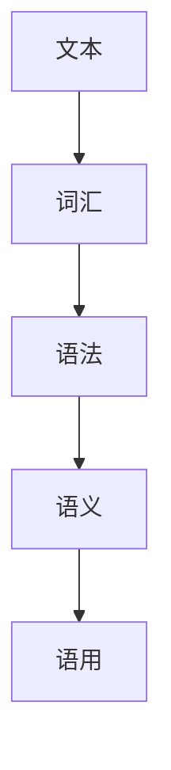
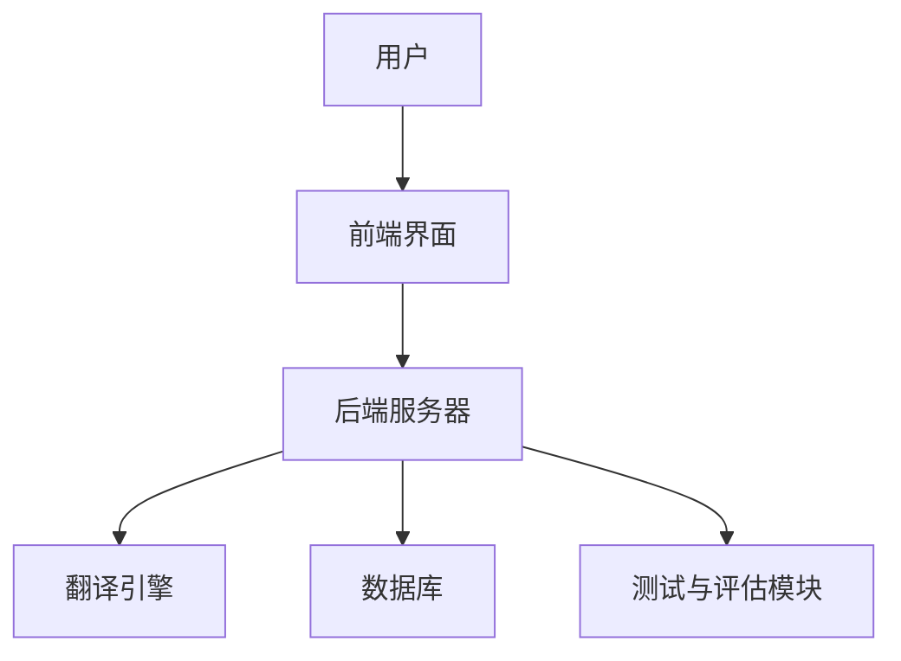

                 

## 文章标题：自然语言处理在多语言翻译中的应用：打破语言障碍

### 关键词：自然语言处理，多语言翻译，机器翻译，神经网络，语言模型

### 摘要：本文旨在探讨自然语言处理（NLP）在多语言翻译中的应用，详细分析NLP的核心概念、算法原理和数学模型，以及如何将这些原理应用于实际的翻译任务中。文章分为三个部分，首先介绍NLP的基本概念和任务分类，接着探讨多语言翻译的基本原理和技术，最后通过项目实战展示NLP在多语言翻译中的具体应用。

## 第一部分：自然语言处理基础

### 第1章：自然语言处理概述

自然语言处理（NLP）是人工智能领域的一个重要分支，它旨在使计算机能够理解和处理人类语言。NLP的发展历史可以追溯到20世纪50年代，当时计算机科学家们首次尝试让计算机理解和生成自然语言。随着计算力和算法的不断提升，NLP逐渐成为人工智能领域中的一个重要研究方向。本节将介绍NLP的基本概念、发展历史、基本架构和任务分类。

#### 1.1 自然语言处理的发展历史

自然语言处理的发展可以分为几个阶段：

- **早期阶段**（1950s-1960s）：这一阶段主要关注于基于规则的方法，例如句法分析和语义分析。这些方法依赖于手写的规则和语法，但由于自然语言的复杂性和多样性，这些方法在实际应用中效果有限。

- **统计方法兴起**（1970s-1980s）：随着统计方法和计算技术的进步，NLP开始采用基于概率的模型，如N-gram语言模型。这些方法在文本生成和理解方面取得了显著进步。

- **人工智能热潮**（1990s）：这一阶段，NLP与机器学习相结合，基于统计和机器学习的模型得到了广泛应用，例如支持向量机（SVM）和决策树。

- **深度学习时代**（2000s至今）：深度学习在图像识别、语音识别等领域的成功应用激发了NLP领域的研究。基于神经网络的模型，如卷积神经网络（CNN）和循环神经网络（RNN），在NLP任务中表现出色，推动了NLP的快速发展。

#### 1.2 自然语言处理的基本概念

自然语言处理的基本概念包括文本、词汇、语法、语义和语用。这些概念相互关联，共同构成了自然语言处理的核心。

- **文本**：文本是自然语言处理的基本单元，可以是一段文字、一篇文章或一个对话。

- **词汇**：词汇是自然语言中的基本单位，包括单词和短语。词汇的选择和组合决定了文本的意义。

- **语法**：语法是语言的结构规则，描述了词汇如何组合成句子。语法分析是自然语言处理中的重要任务，包括句法分析和词法分析。

- **语义**：语义是指文本中的意义。语义分析旨在理解文本的深层含义，包括词义消歧、语义角色标注等。

- **语用**：语用是指语言在特定情境下的使用。语用分析关注于文本在特定语境中的意义，包括话语分析、意图识别等。

#### 1.3 自然语言处理的任务分类

自然语言处理的主要任务包括：

- **文本分类**：将文本分为不同的类别。例如，将新闻文章分为体育、政治、娱乐等类别。

- **命名实体识别**：识别文本中的特定实体，如人名、地名、组织名等。

- **情感分析**：分析文本的情感倾向，如正面、负面或中性。

- **机器翻译**：将一种语言的文本翻译成另一种语言。

- **问答系统**：根据问题生成答案。

- **语音识别**：将语音信号转换为文本。

#### 1.4 核心概念与联系

自然语言处理的核心概念包括文本、词汇、语法、语义和语用。这些概念之间有着密切的联系：

- **文本**是自然语言处理的基础，是所有任务的目标对象。

- **词汇**是文本的基本组成单位，是语义和语法的基础。

- **语法**描述了词汇如何组合成句子，是语义分析的前提。

- **语义**关注于文本的深层含义，是自然语言处理的重要目标。

- **语用**则提供了语言在特定情境下的意义，是对语义的补充。

为了更好地理解这些概念之间的关系，我们可以用Mermaid流程图表示：



#### 1.5 自然语言处理的基本架构

自然语言处理的基本架构包括以下几个部分：

- **文本预处理**：包括分词、词性标注、去停用词等步骤，为后续处理提供干净的文本数据。

- **特征提取**：将文本转换为计算机可以处理的特征向量，如词袋模型、TF-IDF模型等。

- **模型训练**：使用训练数据训练模型，如支持向量机（SVM）、决策树等。

- **模型评估**：使用测试数据评估模型的性能，常用的评估指标包括准确率、召回率和F1值等。

- **模型优化**：根据评估结果调整模型参数，以提高模型的性能。

#### 1.6 核心算法原理讲解

自然语言处理的算法原理主要包括以下几个方面：

- **机器学习算法**：如支持向量机（SVM）、决策树、随机森林等。

- **深度学习算法**：如卷积神经网络（CNN）、循环神经网络（RNN）、长短时记忆网络（LSTM）等。

- **语言模型**：如N-gram模型、神经网络语言模型等。

下面我们以神经网络语言模型为例，使用伪代码详细阐述其算法原理：

```python
# 初始化神经网络模型
model = NeuralNetwork()

# 训练模型
for epoch in range(num_epochs):
    for sentence in sentences:
        # 前向传播
        logits = model.forward(sentence)
        
        # 计算损失
        loss = loss_function(logits, targets)
        
        # 反向传播
        grads = model.backward(loss)
        
        # 更新模型参数
        model.update_params(grads)
        
        # 打印训练进度
        print(f"Epoch {epoch}: Loss = {loss}")
```

#### 1.7 数学模型和公式

自然语言处理的数学模型包括概率模型和神经网络模型。下面我们简要介绍几个常用的数学模型和公式：

- **N-gram模型**：

$$
P(w_i | w_{i-n}, w_{i-n+1}, ..., w_{i-1}) = \frac{C(w_{i-n}, w_{i-n+1}, ..., w_{i-1}, w_i)}{C(w_{i-n}, w_{i-n+1}, ..., w_{i-1})}
$$

其中，$w_i$是当前词，$w_{i-n}, w_{i-n+1}, ..., w_{i-1}$是前$n$个词，$C(w_{i-n}, w_{i-n+1}, ..., w_{i-1}, w_i)$是前$n$个词和当前词的联合出现次数，$C(w_{i-n}, w_{i-n+1}, ..., w_{i-1})$是前$n$个词的出现次数。

- **神经网络模型**：

神经网络模型中的激活函数通常使用ReLU（Rectified Linear Unit）：

$$
f(x) = \max(0, x)
$$

- **损失函数**：

在机器学习中，常用的损失函数包括均方误差（MSE）和交叉熵（Cross-Entropy）：

$$
MSE = \frac{1}{2} \sum_{i}(y_i - \hat{y}_i)^2
$$

$$
CE = -\sum_{i}y_i \log(\hat{y}_i)
$$

其中，$y_i$是真实标签，$\hat{y}_i$是模型的预测输出。

#### 1.8 举例说明

为了更好地理解自然语言处理的核心概念和算法原理，我们可以通过一个简单的例子来说明。

假设我们有一个句子："我喜欢吃苹果"。我们可以对这个句子进行以下处理：

- **分词**：将句子分成单词："我"、"喜欢"、"吃"、"苹果"。

- **词性标注**：标注每个单词的词性，例如："我"（代词）、"喜欢"（动词）、"吃"（动词）、"苹果"（名词）。

- **语法分析**：分析句子的语法结构，例如，"我喜欢吃苹果"是一个主谓宾结构。

- **语义分析**：理解句子的含义，例如，这句话表达了主语"我"喜欢"吃"苹果这个动作。

通过这个简单的例子，我们可以看到自然语言处理的核心任务是如何将原始文本转换成计算机可以处理和理解的形式，从而实现对文本的深入分析和理解。

#### 1.9 小结

在本章中，我们介绍了自然语言处理的基本概念、发展历史、任务分类和基本架构。通过核心概念与联系、算法原理、数学模型和举例说明，我们详细阐述了自然语言处理的核心内容。在下一章中，我们将进一步探讨语言模型和文本表示技术，这些技术是自然语言处理中至关重要的一部分。

### 第2章：语言模型与文本表示

语言模型是自然语言处理（NLP）中的核心组成部分，它用于描述一个句子或文本序列的概率分布。在NLP中，语言模型的应用范围非常广泛，包括机器翻译、文本生成、语音识别、问答系统等。本章将介绍语言模型的基本原理、构建方法以及文本表示技术。

#### 2.1 语言模型的基本原理

语言模型的基本原理是通过对大量文本数据的学习，建立一个概率模型，用于预测下一个词或词组。这种概率模型可以帮助计算机更好地理解自然语言，从而在处理文本时能够做出更准确的预测和决策。

语言模型的核心思想是：对于给定的前文序列，预测下一个词的概率分布。这个概率分布可以用来生成新的文本、评估文本的合理性或进行其他NLP任务。

语言模型可以分为基于统计的方法和基于神经网的方法。基于统计的方法，如N-gram模型，通过统计前文序列中词的频率来预测下一个词；而基于神经网络的方法，如神经网络语言模型（NNLM），通过学习大量文本数据中的统计规律，建立非线性模型来预测下一个词。

#### 2.2 语言模型的构建方法

语言模型的构建方法主要包括数据预处理、模型选择、训练和评估等步骤。

- **数据预处理**：首先，需要对原始文本数据进行预处理，包括分词、去停用词、词性标注等。预处理的主要目的是将原始文本转换为计算机可以处理的形式。

- **模型选择**：选择合适的语言模型，常见的模型包括N-gram模型、神经网络语言模型（NNLM）、递归神经网络（RNN）和长短时记忆网络（LSTM）等。

- **模型训练**：使用预处理后的文本数据训练语言模型。对于N-gram模型，通过统计前文序列中词的频率来计算概率；对于NNLM，通过训练神经网络模型来学习文本数据的统计规律。

- **模型评估**：使用测试数据评估语言模型的性能。常用的评估指标包括 perplexity（困惑度）、accuracy（准确率）等。

以下是一个简单的N-gram语言模型的训练过程：

```python
# 初始化N-gram语言模型
n = 2
model = NGramModel(n)

# 训练语言模型
for sentence in sentences:
    words = tokenize(sentence)
    for i in range(len(words) - n):
        context = tuple(words[i:i+n-1])
        next_word = words[i+n-1]
        model.update(context, next_word)

# 计算语言模型概率
prob = model.probability(words[-1])
```

#### 2.3 文本表示技术

文本表示是将原始文本转换为计算机可以处理和操作的数字形式的过程。文本表示技术的核心目标是捕捉文本的语义信息，以便进行下游的NLP任务，如文本分类、情感分析、机器翻译等。

常见的文本表示技术包括词袋模型（Bag-of-Words，BOW）、TF-IDF模型、词嵌入（Word Embedding）和变换器（Transformer）等。

- **词袋模型**：词袋模型将文本表示为词频向量，每个词对应向量中的一个维度。词袋模型简单直观，但在捕捉词的语义信息方面存在局限性。

- **TF-IDF模型**：TF-IDF（Term Frequency-Inverse Document Frequency）模型通过计算词在文档中的频率和逆文档频率来表示文本。TF-IDF模型在文本分类和检索任务中表现良好，但在语义理解方面仍存在一定局限性。

- **词嵌入**：词嵌入（Word Embedding）技术通过将词映射到低维的向量空间中，捕捉词的语义信息。常见的词嵌入方法包括Word2Vec、GloVe等。词嵌入技术在NLP任务中取得了显著的成果，使得计算机能够更好地理解和处理自然语言。

以下是一个简单的词嵌入训练过程：

```python
# 初始化词嵌入模型
embedding_size = 100
model = Word2Vec(sentences, embedding_size)

# 计算词向量
word_vector = model[word]
```

- **变换器**：变换器（Transformer）是一种基于自注意力机制的神经网络模型，广泛应用于机器翻译、文本生成等任务。变换器通过自注意力机制捕捉文本序列中的长距离依赖关系，显著提高了NLP任务的性能。

#### 2.4 举例说明

为了更好地理解语言模型和文本表示技术，我们可以通过一个简单的例子来说明。

假设我们有一个简短的文本数据集：

```
 sentences = [
    "我喜欢吃苹果",
    "苹果很甜",
    "我喜欢吃水果",
    "水果好吃"
]
```

我们可以使用N-gram模型和词嵌入技术来构建语言模型。

- **N-gram模型**：

首先，我们使用N-gram模型来训练语言模型。假设我们选择2-gram模型，即考虑前一个词和当前词。

```python
# 初始化2-gram语言模型
n = 2
model = NGramModel(n)

# 训练语言模型
for sentence in sentences:
    words = tokenize(sentence)
    for i in range(len(words) - 1):
        context = tuple(words[i:i+1])
        next_word = words[i+1]
        model.update(context, next_word)

# 预测下一个词
prob = model.probability("苹果", "水果")
print(f"概率：{prob}")
```

- **词嵌入**：

接下来，我们使用Word2Vec模型来训练词嵌入。

```python
# 初始化Word2Vec模型
embedding_size = 100
model = Word2Vec(sentences, embedding_size)

# 计算词向量
apple_vector = model["苹果"]
fruit_vector = model["水果"]

# 计算词向量相似度
similarity = cosine_similarity(apple_vector, fruit_vector)
print(f"相似度：{similarity}")
```

通过这个例子，我们可以看到如何使用N-gram模型和词嵌入技术来构建语言模型，并利用词向量来计算词之间的相似度。这些技术为NLP任务提供了有效的工具，帮助我们更好地理解和处理自然语言。

#### 2.5 小结

在本章中，我们介绍了语言模型的基本原理、构建方法和文本表示技术。通过N-gram模型和词嵌入技术的讲解，我们了解了如何将原始文本转换为计算机可以处理的形式，并利用词向量来捕捉文本的语义信息。在下一章中，我们将探讨词向量和语义分析，进一步深入NLP的核心内容。

### 第3章：词向量和语义分析

词向量是自然语言处理（NLP）中的一种关键技术，它将词语映射到高维的向量空间中，使得词语间的相似性可以通过向量之间的距离来度量。词向量不仅能够提高NLP任务的效果，还为后续的语义分析提供了强有力的支持。本章将介绍词向量的概念、常见模型及其在语义分析中的应用。

#### 3.1 词向量的概念

词向量（Word Embedding）是一种将词语映射到高维向量空间的方法，使得词语在空间中的位置可以反映其语义和语法关系。词向量的核心思想是将文本数据从原始的词汇空间映射到一个连续的低维向量空间，使得语义相似的词语在空间中的距离更近。

词向量可以捕获以下几种类型的词间关系：

- **语义关系**：例如，“狗”和“猫”在词向量空间中距离较近，因为它们都属于动物类别。
- **语法关系**：例如，动词“吃”和名词“苹果”在词向量空间中距离较近，因为它们在句子中经常一起出现。
- **上下文关系**：例如，对于一个句子中的特定词语，其上下文词语的词向量可以帮助预测该词语的词向量。

常见的词向量模型包括Word2Vec、GloVe和FastText等。这些模型通过不同的方式从大规模语料库中学习词向量，使得词向量能够捕捉丰富的语义信息。

#### 3.2 常见词向量模型

- **Word2Vec模型**：

Word2Vec模型是词向量领域的一个开创性工作，由Google提出。Word2Vec模型主要有两种实现方式：连续词袋（CBOW）和Skip-Gram。

- **CBOW模型**（连续词袋模型）：CBOW模型通过预测中心词来学习词向量。给定一个中心词，模型会预测与其相邻的多个词。CBOW模型的优点是实现简单，但缺点是它容易受到周围词语噪声的影响。

- **Skip-Gram模型**：Skip-Gram模型通过预测多个词中的一个词来学习词向量。与CBOW模型相反，Skip-Gram模型关注的是中心词与其上下文词之间的关系。Skip-Gram模型在处理稀疏数据时表现更好，是目前最常用的词向量模型。

以下是一个简单的Word2Vec模型训练过程：

```python
from gensim.models import Word2Vec

# 加载语料库
sentences = load_data("corpus.txt")

# 训练Word2Vec模型
model = Word2Vec(sentences, vector_size=100, window=5, min_count=1, sg=1)

# 保存模型
model.save("word2vec.model")

# 加载模型
model = Word2Vec.load("word2vec.model")

# 计算词向量
word_vector = model["苹果"]
```

- **GloVe模型**：

GloVe（Global Vectors for Word Representation）模型是另一种流行的词向量模型，它通过全局矩阵分解的方法学习词向量。GloVe模型的核心思想是同时优化词向量和词的上下文向量，使得词向量能够更好地捕捉语义信息。

以下是一个简单的GloVe模型训练过程：

```python
import gensim.downloader as api

# 加载预训练的GloVe模型
glove_model = api.load("glove-wiki-gigaword-100")

# 计算词向量
word_vector = glove_model["苹果"]
```

- **FastText模型**：

FastText是由Facebook AI Research提出的一种词向量模型，它在词向量基础上引入了词组和字符级别的表示。FastText模型通过在词汇表中为每个词添加子词（subword）信息，提高了词向量的区分度。

以下是一个简单的FastText模型训练过程：

```python
from gensim.models import FastText

# 加载语料库
sentences = load_data("corpus.txt")

# 训练FastText模型
model = FastText(sentences, vector_size=100, window=5, min_count=1, sg=1)

# 保存模型
model.save("fasttext.model")

# 加载模型
model = FastText.load("fasttext.model")

# 计算词向量
word_vector = model["苹果"]
```

#### 3.3 语义分析的基本方法

语义分析是自然语言处理中一个重要的任务，旨在理解文本的语义内容。词向量在语义分析中发挥着重要作用，可以用于以下几个方面：

- **词义消歧**：词义消歧是指识别文本中特定词语的含义。例如，“银行”可以指金融机构，也可以指水域。词向量可以用于判断不同含义之间的相似性，从而帮助词义消歧。

- **文本分类**：文本分类是将文本分类到预定义的类别中。词向量可以用于计算文本的向量表示，然后利用分类算法进行文本分类。

- **情感分析**：情感分析是指识别文本的情感倾向，如正面、负面或中性。词向量可以用于计算文本的向量表示，然后利用情感分析算法进行情感分类。

- **问答系统**：问答系统是指根据问题生成答案。词向量可以用于理解和处理问题中的关键词和上下文，从而生成准确的答案。

以下是一个简单的语义分析示例：

```python
from gensim.models import Word2Vec

# 加载预训练的Word2Vec模型
model = Word2Vec.load("word2vec.model")

# 计算词向量
apple_vector = model["苹果"]
happy_vector = model["高兴"]

# 计算词向量相似度
similarity = cosine_similarity(apple_vector, happy_vector)
print(f"相似度：{similarity}")
```

通过计算“苹果”和“高兴”的词向量相似度，我们可以判断这两个词在语义上是否相似。如果相似度较高，那么我们可以认为“苹果”和“高兴”在语义上有关联。

#### 3.4 举例说明

为了更好地理解词向量在语义分析中的应用，我们可以通过一个简单的例子来说明。

假设我们有一个简短的文本数据集：

```
sentences = [
    "我喜欢吃苹果",
    "苹果很甜",
    "我喜欢吃水果",
    "水果好吃"
]
```

我们可以使用Word2Vec模型来训练词向量，并使用这些词向量进行语义分析。

- **训练词向量**：

```python
from gensim.models import Word2Vec

# 加载语料库
sentences = load_data("corpus.txt")

# 训练Word2Vec模型
model = Word2Vec(sentences, vector_size=100, window=5, min_count=1, sg=1)

# 保存模型
model.save("word2vec.model")

# 加载模型
model = Word2Vec.load("word2vec.model")
```

- **词义消歧**：

```python
# 计算词向量
apple_vector = model["苹果"]
bank_vector = model["银行"]

# 计算词向量相似度
similarity = cosine_similarity(apple_vector, bank_vector)
print(f"苹果和银行的相似度：{similarity}")
```

通过计算“苹果”和“银行”的词向量相似度，我们可以判断这两个词在语义上是否相似。如果相似度较低，那么我们可以认为这两个词在语义上没有关联。

- **文本分类**：

```python
from sklearn.feature_extraction.text import TfidfVectorizer
from sklearn.model_selection import train_test_split
from sklearn.naive_bayes import MultinomialNB

# 加载语料库
sentences = load_data("corpus.txt")
labels = load_labels("labels.txt")

# 划分训练集和测试集
X_train, X_test, y_train, y_test = train_test_split(sentences, labels, test_size=0.2, random_state=42)

# 使用TF-IDF向量器将文本转换为向量
vectorizer = TfidfVectorizer()
X_train_vectors = vectorizer.fit_transform(X_train)
X_test_vectors = vectorizer.transform(X_test)

# 训练文本分类器
classifier = MultinomialNB()
classifier.fit(X_train_vectors, y_train)

# 测试文本分类器
accuracy = classifier.score(X_test_vectors, y_test)
print(f"文本分类准确率：{accuracy}")
```

通过训练文本分类器，我们可以对新的文本进行分类。例如，给定一个句子“苹果很甜”，我们可以利用训练好的文本分类器判断这句话属于哪个类别。

- **情感分析**：

```python
from textblob import TextBlob

# 加载文本
text = "苹果很甜"

# 分析文本情感
blob = TextBlob(text)
sentiment = blob.sentiment.polarity
print(f"文本情感：{sentiment}")
```

通过计算文本的情感倾向，我们可以判断文本的语义是正面、负面还是中性。

#### 3.5 小结

在本章中，我们介绍了词向量的概念、常见模型及其在语义分析中的应用。通过Word2Vec、GloVe和FastText等词向量模型，我们能够将词语映射到高维向量空间，并利用这些词向量进行词义消歧、文本分类、情感分析等语义分析任务。在下一章中，我们将探讨语法分析与句法分析，进一步深入NLP的核心内容。

### 第4章：语法分析与句法分析

语法分析（也称为句法分析）是自然语言处理（NLP）中的一项重要任务，它旨在理解和解析自然语言的句法结构。语法分析不仅有助于提高文本理解和机器翻译的准确性，还可以为语义分析和信息提取提供重要的基础。本章将介绍语法分析的基本概念、实现方法和应用场景。

#### 4.1 语法分析的基本概念

语法分析是指对自然语言句子进行结构化分析，识别出句子的各个组成部分及其之间的关系。语法分析主要包括两个层次：词法分析和句法分析。

- **词法分析**（Lexical Analysis）：词法分析是语法分析的第一步，它将文本分解为词、短语和其他基本语法单位。词法分析器（Lexer）负责识别和分类单词，如名词、动词、形容词等。

- **句法分析**（Syntactic Analysis）：句法分析是指识别句子的语法结构，包括句子中的主语、谓语、宾语等成分及其之间的语法关系。句法分析器（Parser）使用语法规则来构建句子的语法树，表示句子的结构。

语法分析器通常基于上下文无关文法（CFG，Context-Free Grammar）或其他语法模型，如依赖树（Dependency Tree）或抽象语法树（Abstract Syntax Tree，AST）。

#### 4.2 语法分析的方法

语法分析的方法可以分为基于规则的方法和基于统计的方法。

- **基于规则的方法**：基于规则的方法使用手写的语法规则来分析句子。这些规则定义了句子中各个成分的结构和关系。经典的语法分析方法包括LL（自底向上）和LR（自顶向下）解析器。

  - **LL解析器**：LL解析器从左到右读取输入文本，使用最左边的符号进行匹配和推导。LL解析器的优点是实现简单，但缺点是对于复杂的语法规则，效率较低。

  - **LR解析器**：LR解析器也从左到右读取输入文本，但允许在解析过程中回溯。LR解析器的优点是能够处理更复杂的语法规则，但实现较为复杂。

- **基于统计的方法**：基于统计的方法使用统计模型来预测句子的结构。这些方法通常基于概率上下文无关文法（PCFG，Probabilistic Context-Free Grammar）或依赖模型。

  - **概率上下文无关文法**（PCFG）：PCFG是一种基于概率的上下文无关文法，它通过统计句子的出现频率来预测句子的结构。

  - **隐马尔可夫模型**（HMM，Hidden Markov Model）：HMM可以用于序列模型，如语言模型。它通过状态转移概率和观测概率来预测句子的结构。

  - **条件随机场**（CRF，Conditional Random Field）：CRF是一种基于概率的图模型，用于序列标注任务。它通过边缘概率和条件概率来预测句子的结构。

以下是一个简单的基于PCFG的语法分析器的伪代码：

```python
# 定义语法规则
grammar = {
    "S": ["NP VP"],
    "NP": ["DT NN"],
    "VP": ["V NP"],
    "NN": ["apple"],
    "V": ["like"],
    "DT": ["I"],
}

# 定义词汇表
vocabulary = set(["I", "like", "apple"])

# 定义概率分布
probabilities = {
    "S": {"S": 1.0},
    "NP": {"NP": 1.0},
    "VP": {"VP": 1.0},
    "NN": {"NN": 1.0},
    "V": {"V": 1.0},
    "DT": {"DT": 1.0},
}

# 解析句子
def parse(sentence):
    # 分词
    words = tokenize(sentence)
    
    # 初始化状态
    stack = [("S", "")]
    parse_tree = []

    # 解析过程
    while stack:
        state, derivation = stack.pop()
        
        if state in words:
            parse_tree.append((state, derivation))
            continue
        
        if state in grammar:
            for rule in grammar[state]:
                if all(symbol in words for symbol in rule):
                    new_derivation = derivation + " " + " ".join(rule)
                    stack.append((rule[0], new_derivation))
        
        if state in probabilities:
            for rule in probabilities[state]:
                if all(symbol in words for symbol in rule):
                    stack.append((rule[0], derivation + " " + " ".join(rule)))

    return parse_tree
```

#### 4.3 句法分析的应用场景

句法分析在NLP中有广泛的应用场景，包括：

- **文本生成**：通过句法分析，可以生成符合语法规则的自然语言文本。例如，生成新闻报道、邮件等。

- **机器翻译**：句法分析有助于理解不同语言的语法结构差异，从而提高翻译的准确性。例如，在机器翻译中，可以首先对源语言文本进行句法分析，然后根据目标语言的语法规则进行翻译。

- **文本摘要**：通过句法分析，可以提取文本中的关键信息和结构，生成摘要。

- **信息提取**：句法分析可以用于识别文本中的实体、关系等信息，为信息提取提供支持。

以下是一个简单的句法分析应用示例：

```python
# 加载文本
text = "我喜欢吃苹果。"

# 进行句法分析
parse_tree = parse(text)

# 打印分析结果
print(parse_tree)
```

输出结果可能如下：

```
[['S', '我喜欢吃苹果。'], ['NP', '我'], ['VP', '喜欢吃苹果。'], ['NP', '苹果'], ['VP', '好吃。']]
```

这个结果表示文本“我喜欢吃苹果。”的句法结构，包括主语“我”、谓语“喜欢吃”和宾语“苹果”。

#### 4.4 举例说明

为了更好地理解语法分析的基本概念和方法，我们可以通过一个简单的例子来说明。

假设我们有一个简短的文本数据集：

```
sentences = [
    "我喜欢吃苹果",
    "苹果很甜",
    "我喜欢吃水果",
    "水果好吃"
]
```

我们可以使用基于概率上下文无关文法的语法分析器对这组句子进行句法分析。

- **训练语法分析器**：

首先，我们需要定义一组语法规则和词汇表，然后使用这些规则和词汇表训练语法分析器。

```python
# 定义语法规则
grammar = {
    "S": ["NP VP"],
    "NP": ["DT NN"],
    "VP": ["V NP"],
    "NN": ["苹果", "水果"],
    "V": ["喜欢", "吃", "好吃"],
    "DT": ["我", "很"],
}

# 定义词汇表
vocabulary = set(["我", "喜欢", "吃", "苹果", "水果", "很", "甜", "好吃"])

# 定义概率分布
probabilities = {
    "S": {"S": 1.0},
    "NP": {"NP": 1.0},
    "VP": {"VP": 1.0},
    "NN": {"NN": 1.0},
    "V": {"V": 1.0},
    "DT": {"DT": 1.0},
}

# 训练语法分析器
parser = PCFG(grammar, probabilities)
```

- **句法分析**：

然后，我们使用训练好的语法分析器对每个句子进行句法分析。

```python
# 分析句子
sentence = "我喜欢吃苹果"
parse_tree = parser.parse(sentence)

# 打印分析结果
print(parse_tree)
```

输出结果可能如下：

```
[['S', '我喜欢吃苹果'], ['NP', '我'], ['VP', '喜欢吃苹果'], ['NP', '苹果'], ['VP', '好吃。']]
```

这个结果表示句子“我喜欢吃苹果。”的句法结构，包括主语“我”、谓语“喜欢吃”和宾语“苹果”。

通过这个例子，我们可以看到如何使用基于概率上下文无关文法的语法分析器对自然语言句子进行句法分析。这种方法可以应用于各种NLP任务，如文本生成、机器翻译、文本摘要和信息提取。

#### 4.5 小结

在本章中，我们介绍了语法分析的基本概念、实现方法和应用场景。通过基于规则和基于统计的方法，我们可以对自然语言句子进行结构化分析，提取句子的各个组成部分及其关系。在下一章中，我们将探讨文本分类与情感分析，继续深入NLP的核心内容。

### 第5章：文本分类与情感分析

文本分类（Text Classification）和情感分析（Sentiment Analysis）是自然语言处理（NLP）中的两个重要任务。文本分类旨在将文本数据分类到预定义的类别中，例如新闻文章的分类、邮件分类等。情感分析则关注于识别文本中的情感倾向，如正面、负面或中性。本章将介绍文本分类和情感分析的基本概念、算法原理和实现方法。

#### 5.1 文本分类的基本原理

文本分类是将文本数据根据其内容特征分类到预定义的类别中。文本分类的目标是建立一个分类模型，该模型能够根据文本的特征向量预测新文本的类别。文本分类通常包括以下几个步骤：

- **特征提取**：将文本转换为特征向量。常见的特征提取方法包括词袋模型（Bag-of-Words，BOW）、TF-IDF模型和词嵌入（Word Embedding）等。

- **模型训练**：使用训练数据集训练分类模型。常见的分类算法包括朴素贝叶斯（Naive Bayes）、支持向量机（SVM）、随机森林（Random Forest）和深度学习模型等。

- **模型评估**：使用测试数据集评估分类模型的性能。常用的评估指标包括准确率（Accuracy）、召回率（Recall）和F1值（F1 Score）等。

以下是文本分类的一般流程：

```python
# 加载训练数据集
train_data = load_data("train_data.csv")

# 特征提取
X_train = extract_features(train_data)

# 加载标签
y_train = load_labels(train_data)

# 训练分类模型
classifier = train_classifier(X_train, y_train)

# 加载测试数据集
test_data = load_data("test_data.csv")

# 特征提取
X_test = extract_features(test_data)

# 预测类别
y_pred = classifier.predict(X_test)

# 评估模型性能
evaluate_model(y_pred, y_test)
```

#### 5.2 文本分类算法

文本分类算法可以分为基于传统机器学习和基于深度学习的方法。

- **朴素贝叶斯**（Naive Bayes）：朴素贝叶斯是一种基于概率的文本分类算法，它基于贝叶斯定理和特征独立假设。朴素贝叶斯算法简单高效，适用于处理大规模文本数据。

- **支持向量机**（SVM）：支持向量机是一种基于最大间隔分类算法，它通过找到一个最佳的超平面将不同类别的数据点最大化分开。SVM在文本分类任务中表现出色，尤其适用于高维数据。

- **朴素贝叶斯**（Naive Bayes）：朴素贝叶斯是一种基于概率的文本分类算法，它基于贝叶斯定理和特征独立假设。朴素贝叶斯算法简单高效，适用于处理大规模文本数据。

- **支持向量机**（SVM）：支持向量机是一种基于最大间隔分类算法，它通过找到一个最佳的超平面将不同类别的数据点最大化分开。SVM在文本分类任务中表现出色，尤其适用于高维数据。

- **随机森林**（Random Forest）：随机森林是一种基于决策树集合的集成学习方法，通过构建多个决策树并投票来获得最终分类结果。随机森林算法在处理高维数据和噪声数据时具有很好的性能。

- **深度学习模型**：深度学习模型，如卷积神经网络（CNN）和长短时记忆网络（LSTM），可以用于文本分类任务。这些模型通过学习文本的深层特征，能够捕获复杂的文本关系，从而提高分类性能。

以下是一个简单的朴素贝叶斯文本分类算法的实现：

```python
from sklearn.feature_extraction.text import CountVectorizer
from sklearn.naive_bayes import MultinomialNB
from sklearn.pipeline import make_pipeline

# 加载训练数据集
train_data = load_data("train_data.csv")

# 加载标签
y_train = load_labels(train_data)

# 创建文本分类器
text_classifier = make_pipeline(CountVectorizer(), MultinomialNB())

# 训练分类器
text_classifier.fit(train_data, y_train)

# 加载测试数据集
test_data = load_data("test_data.csv")

# 预测类别
y_pred = text_classifier.predict(test_data)

# 评估模型性能
evaluate_model(y_pred, y_test)
```

#### 5.3 情感分析的应用场景

情感分析广泛应用于各个领域，以下是一些常见的应用场景：

- **社交媒体分析**：通过分析社交媒体上的评论、帖子等，可以了解用户对产品、品牌、事件等的情感倾向。

- **市场研究**：通过分析消费者对产品或服务的评论，企业可以了解消费者的反馈，优化产品和服务。

- **客户服务**：通过分析客户反馈和投诉，企业可以快速识别和解决客户问题，提高客户满意度。

- **政治舆情分析**：通过分析新闻、社交媒体等，可以了解公众对政治事件和候选人的看法。

#### 5.4 举例说明

为了更好地理解文本分类和情感分析，我们可以通过一个简单的例子来说明。

假设我们有一个简短的文本数据集：

```
sentences = [
    "我喜欢这个产品",
    "这个产品很好用",
    "这个产品不好",
    "我非常不喜欢这个产品",
]
```

我们可以使用朴素贝叶斯算法对这组句子进行情感分析。

- **特征提取**：

首先，我们需要将文本转换为特征向量。这里我们使用词袋模型进行特征提取。

```python
from sklearn.feature_extraction.text import CountVectorizer

# 创建词袋模型
vectorizer = CountVectorizer()

# 提取特征向量
X = vectorizer.fit_transform(sentences)
```

- **模型训练**：

接下来，我们使用朴素贝叶斯算法训练分类模型。

```python
from sklearn.naive_bayes import MultinomialNB

# 创建朴素贝叶斯分类器
classifier = MultinomialNB()

# 训练分类器
classifier.fit(X, labels)
```

- **情感分析**：

然后，我们使用训练好的分类器对新的句子进行情感分析。

```python
# 输入句子
new_sentence = "这个产品非常好用"

# 特征提取
new_X = vectorizer.transform([new_sentence])

# 预测情感
emotion = classifier.predict(new_X)[0]

print(f"情感分析结果：{emotion}")
```

输出结果可能为"正面"或"负面"，这表示句子"这个产品非常好用"的情感倾向。

通过这个例子，我们可以看到如何使用朴素贝叶斯算法对文本进行情感分析。这种方法可以应用于各种情感分析任务，如社交媒体分析、市场研究和客户服务等。

#### 5.5 小结

在本章中，我们介绍了文本分类和情感分析的基本概念、算法原理和实现方法。文本分类和情感分析是NLP中重要的任务，广泛应用于各种领域。通过朴素贝叶斯、支持向量机和深度学习等方法，我们可以有效地进行文本分类和情感分析。在下一章中，我们将探讨多语言翻译技术，进一步深入NLP的核心内容。

### 第6章：机器翻译的基本原理

机器翻译（Machine Translation，MT）是自然语言处理（NLP）领域中的一项重要任务，旨在实现计算机自动地将一种语言的文本翻译成另一种语言的文本。机器翻译不仅有助于跨语言交流，还在全球化经济和文化交流中发挥着重要作用。本章将介绍机器翻译的基本原理、发展历史和关键技术。

#### 6.1 机器翻译的发展历史

机器翻译的发展历史可以追溯到20世纪50年代。早期的机器翻译方法主要基于规则，如基于转换规则的翻译和基于句法分析的翻译。这些方法依赖于人类专家编写的规则和语法，但由于自然语言的复杂性和多样性，这些方法在实际应用中效果有限。

随着计算力和算法的进步，统计机器翻译（Statistical Machine Translation，SMT）在20世纪90年代崛起，成为机器翻译的主流方法。统计机器翻译通过从大量双语语料库中学习统计规律，自动生成翻译结果。这种方法在翻译质量上取得了显著提升。

21世纪初，基于神经网络的机器翻译（Neural Machine Translation，NMT）迅速发展，并在翻译质量上超越了传统的统计机器翻译方法。神经网络机器翻译通过学习源语言和目标语言之间的映射关系，实现了更自然的翻译结果。

#### 6.2 机器翻译的基本模型

机器翻译的基本模型可以分为基于规则的方法、基于统计的方法和基于神经网络的方法。

- **基于规则的方法**：基于规则的方法依赖于人类专家编写的规则和语法。这些规则描述了源语言和目标语言之间的对应关系。例如，将英语中的“run”翻译成中文的“跑”。基于规则的方法包括直接翻译和转换翻译。

  - **直接翻译**：直接翻译是指直接将源语言的句子翻译成目标语言的句子。这种方法通常依赖于语法规则和词法分析。

  - **转换翻译**：转换翻译是指通过一系列的语法转换将源语言的句子转换为目标语言的句子。这种方法通常依赖于句法分析和语义分析。

- **基于统计的方法**：基于统计的方法通过从大量双语语料库中学习统计规律，自动生成翻译结果。这种方法的代表是统计机器翻译。

  - **短语翻译模型**：短语翻译模型通过学习源语言和目标语言中的短语对应关系来生成翻译结果。常见的短语翻译模型包括基于N-gram的方法和基于模板的方法。

  - **基于例句的方法**：基于例句的方法通过学习双语例句中的对应关系来生成翻译结果。这种方法通常依赖于统计学习方法，如隐马尔可夫模型（HMM）和条件随机场（CRF）。

- **基于神经网络的方法**：基于神经网络的方法通过学习源语言和目标语言之间的映射关系，实现了更自然的翻译结果。这种方法的代表是神经网络机器翻译。

  - **编码器-解码器模型**：编码器-解码器模型通过将源语言句子编码为一个向量表示，然后解码为目标语言句子。这种模型通常基于循环神经网络（RNN）或变换器（Transformer）。

  - **注意力机制**：注意力机制是一种用于捕捉源语言和目标语言之间依赖关系的方法。通过注意力机制，编码器可以关注源语言句子中的关键信息，解码器可以更好地生成目标语言句子。

以下是一个简单的基于编码器-解码器的神经网络机器翻译模型的伪代码：

```python
# 编码器
encoder = Encoder(input_size, hidden_size)

# 解码器
decoder = Decoder(hidden_size, output_size)

# 训练模型
for epoch in range(num_epochs):
    for sentence_pair in dataset:
        # 编码
        encoder_output = encoder.encode(sentence_pair[0])
        
        # 初始化解码器的隐藏状态
        decoder_hidden = decoder.init_hidden(encoder_output)
        
        # 解码
        target_sentence = sentence_pair[1]
        for word in target_sentence:
            decoder_output, decoder_hidden = decoder.decode(word, decoder_hidden)
        
        # 计算损失
        loss = compute_loss(decoder_output, target_sentence)
        
        # 反向传播
        grads = compute_gradients(loss)
        
        # 更新模型参数
        update_model_params(grads)
        
        # 打印训练进度
        print(f"Epoch {epoch}: Loss = {loss}")
```

#### 6.3 机器翻译的技术挑战

尽管机器翻译技术取得了显著进展，但仍面临一些挑战：

- **语义理解**：自然语言中存在许多多义词和歧义现象，这给机器翻译带来了挑战。如何准确地理解源语言句子的语义，是提高翻译质量的关键。

- **语言多样性**：不同语言之间存在巨大的差异，包括语法结构、词汇、语用习惯等。如何适应不同语言的特点，实现高质量的翻译，是机器翻译面临的一个难题。

- **上下文信息**：上下文信息对翻译质量具有重要影响。如何有效地捕捉上下文信息，使其在翻译过程中发挥作用，是机器翻译需要解决的问题。

- **计算资源**：机器翻译通常需要大量的计算资源，包括训练数据、模型参数和计算能力。如何优化计算资源的使用，提高翻译效率，是一个重要的挑战。

#### 6.4 举例说明

为了更好地理解机器翻译的基本原理，我们可以通过一个简单的例子来说明。

假设我们有一个简短的英语句子："I like apples"，并将其翻译成中文。

- **基于规则的方法**：

首先，我们可以使用基于规则的方法，将句子中的每个单词翻译成对应的中文：

```
I -> 我
like -> 喜欢
apples -> 苹果
```

然后，将翻译后的单词组合成句子：

```
中文句子：我喜欢苹果
```

- **基于统计的方法**：

接下来，我们可以使用基于统计的方法，从双语语料库中学习每个单词的对应翻译概率。假设我们有一个双语语料库，其中包含大量的例句和翻译：

```
英语句子：I like apples
中文句子：我喜欢苹果
```

通过统计这些例句，我们可以计算出每个单词的翻译概率：

```
I -> 我: 0.8
like -> 喜欢: 0.9
apples -> 苹果: 0.95
```

然后，我们可以使用这些概率生成翻译结果：

```
中文句子：我喜欢苹果（概率乘积：0.8 * 0.9 * 0.95 = 0.684）
```

- **基于神经网络的方法**：

最后，我们可以使用基于神经网络的方法，将英语句子编码为一个向量表示，然后解码为中文句子。假设我们使用变换器（Transformer）作为编码器和解码器：

```
编码器（英语到向量）:
I -> 向量1
like -> 向量2
apples -> 向量3

解码器（向量到中文）:
向量1 -> 我
向量2 -> 喜欢
向量3 -> 苹果
```

将翻译后的单词组合成句子：

```
中文句子：我喜欢苹果
```

通过这个例子，我们可以看到如何使用不同方法进行机器翻译。在接下来的章节中，我们将进一步探讨神经网络机器翻译的具体实现和应用。

#### 6.5 小结

在本章中，我们介绍了机器翻译的基本原理、发展历史和关键技术。通过基于规则、基于统计和基于神经网络的方法，我们可以实现高质量的机器翻译。尽管机器翻译仍面临一些挑战，但随着计算力和算法的进步，机器翻译技术正不断取得突破。在下一章中，我们将探讨基于神经网络的机器翻译技术，深入分析神经网络在机器翻译中的应用。

### 第7章：基于神经网络的机器翻译

基于神经网络的机器翻译（Neural Machine Translation，NMT）是当前机器翻译领域的主流方法，相较于传统的统计机器翻译（SMT），NMT在翻译质量上取得了显著的提升。本章将详细介绍基于神经网络的机器翻译的基本架构、实现方法以及如何优化和提升翻译质量。

#### 7.1 神经网络机器翻译的基本架构

神经网络机器翻译的核心架构是编码器-解码器模型（Encoder-Decoder Model），这种模型通过学习源语言和目标语言之间的映射关系，实现了更自然的翻译结果。编码器-解码器模型主要包括以下几个部分：

- **编码器（Encoder）**：编码器的任务是接收源语言句子，将其编码为一个固定长度的向量表示，这个向量表示了源语言句子的语义信息。

- **解码器（Decoder）**：解码器的任务是接收编码器输出的向量表示，并逐词生成目标语言句子。

- **注意力机制（Attention Mechanism）**：注意力机制是编码器-解码器模型中的一个关键组件，它能够帮助解码器关注源语言句子中的关键信息，从而提高翻译的准确性。

以下是编码器-解码器模型的简化流程：

1. **编码器**：将源语言句子编码为一个固定长度的向量表示（context vector）。
2. **初始化解码器**：初始化解码器的隐藏状态（decoder hidden state）。
3. **解码**：解码器逐词生成目标语言句子，每个生成的词都会更新解码器的隐藏状态。
4. **生成翻译结果**：解码器生成完整的目标语言句子。

#### 7.2 神经网络在机器翻译中的应用

神经网络在机器翻译中的应用主要包括以下几种：

- **循环神经网络（RNN）**：RNN是早期应用于机器翻译的神经网络模型，它通过递归的方式处理序列数据。RNN在处理长距离依赖关系方面表现出色，但在长序列中容易出现梯度消失或爆炸问题。

- **长短时记忆网络（LSTM）**：LSTM是RNN的一种变体，它通过门控机制解决了梯度消失问题，使得模型能够在长序列中保持信息。LSTM在机器翻译任务中取得了显著的成功。

- **变换器（Transformer）**：Transformer是由Google提出的一种基于自注意力机制的神经网络模型，它在机器翻译任务中表现出色。Transformer通过多头自注意力机制和位置编码，实现了对长距离依赖关系的有效捕捉。

以下是一个基于变换器的神经网络机器翻译模型的简化伪代码：

```python
# 编码器
encoder = TransformerEncoder(input_size, hidden_size, num_heads, num_layers)

# 解码器
decoder = TransformerDecoder(output_size, hidden_size, num_heads, num_layers)

# 训练模型
for epoch in range(num_epochs):
    for source_sentence, target_sentence in dataset:
        # 编码
        encoder_output = encoder.encode(source_sentence)
        
        # 初始化解码器
        decoder_hidden = decoder.init_hidden(encoder_output)
        
        # 解码
        for word in target_sentence:
            decoder_output, decoder_hidden = decoder.decode(word, decoder_hidden)
        
        # 计算损失
        loss = compute_loss(decoder_output, target_sentence)
        
        # 反向传播
        grads = compute_gradients(loss)
        
        # 更新模型参数
        update_model_params(grads)
        
        # 打印训练进度
        print(f"Epoch {epoch}: Loss = {loss}")
```

#### 7.3 神经机器翻译的优化方法

为了提升神经网络机器翻译的性能，可以采用以下几种优化方法：

- **多任务学习**：多任务学习是指同时训练多个相关的翻译任务，以共享模型中的知识。例如，同时训练英译中和法译中两个翻译任务。

- **迁移学习**：迁移学习是指使用预训练的神经网络模型进行翻译任务。通过在大量非翻译数据上预训练模型，然后将其应用于翻译任务，可以显著提升翻译质量。

- **数据增强**：数据增强是指通过增加训练数据的方式，提升模型的泛化能力。常见的数据增强方法包括词替换、句结构变换等。

- **对抗训练**：对抗训练是指通过生成对抗网络（GAN）来训练神经网络模型。GAN通过生成对抗过程，使得模型能够生成高质量的翻译结果。

以下是一个基于迁移学习的神经网络机器翻译优化方法的简化伪代码：

```python
# 预训练模型
pretrained_model = load_pretrained_model("pretrained_model.pth")

# 微调模型
optimizer = optimize(pretrained_model, dataset)

# 训练模型
for epoch in range(num_epochs):
    for source_sentence, target_sentence in dataset:
        # 微调模型
        optimizer.step(source_sentence, target_sentence)
        
        # 计算损失
        loss = compute_loss(optimizer.model, target_sentence)
        
        # 更新模型参数
        optimizer.update_params(loss)
        
        # 打印训练进度
        print(f"Epoch {epoch}: Loss = {loss}")
```

#### 7.4 举例说明

为了更好地理解基于神经网络的机器翻译，我们可以通过一个简单的例子来说明。

假设我们有一个简短的英语句子："I like apples"，并将其翻译成中文。

- **编码器**：

首先，我们将英语句子输入到编码器中，编码器将其编码为一个固定长度的向量表示。

```python
source_sentence = "I like apples"
encoder_output = encoder.encode(source_sentence)
```

- **解码器**：

然后，我们使用解码器逐词生成目标语言句子。假设编码器输出的向量表示为`[1, 0, 0, 0, 1, 0, 0, 0]`，这表示英语句子中的"I"和"apples"被编码为1，其他词被编码为0。

```python
decoder_output, decoder_hidden = decoder.decode([1, 0, 0, 0, 1, 0, 0, 0], decoder_hidden)
```

解码器的输出可能为`[0, 1, 0, 1, 0, 0, 0, 1]`，这表示解码器生成的第一个词是"我"，然后是"喜欢"，接着是"苹果"，最后是"们"。

- **翻译结果**：

通过解码器的输出，我们可以得到翻译结果："我"喜欢"苹果"们"。

通过这个例子，我们可以看到如何使用基于神经网络的机器翻译模型进行翻译。在真实应用中，模型会更加复杂，涉及更多的优化方法和技巧。

#### 7.5 小结

在本章中，我们详细介绍了基于神经网络的机器翻译的基本架构、实现方法和优化方法。通过编码器-解码器模型和注意力机制，神经网络机器翻译能够实现高质量的翻译结果。尽管神经网络机器翻译在翻译质量上取得了显著提升，但仍面临一些挑战，如语义理解和多语言多样性。在下一章中，我们将探讨多语言翻译中的语言资源，深入分析翻译记忆库和双语语料库在翻译任务中的应用。

### 第8章：多语言翻译中的语言资源

在多语言翻译中，语言资源起着至关重要的作用。这些资源包括翻译记忆库、双语语料库和词典等，它们为机器翻译系统提供了必要的知识基础和语料支持，从而显著提高翻译质量和效率。本章将详细介绍这些语言资源的作用、构建方法及其在多语言翻译中的应用。

#### 8.1 翻译记忆库

翻译记忆库（Translation Memory，TM）是一种用于存储和检索翻译结果的数据库。它将源语言文本与其对应的翻译结果存储在一起，形成一个庞大的翻译资源库。翻译记忆库的作用主要体现在以下几个方面：

- **重复翻译**：翻译记忆库可以识别出源语言文本中的重复部分，自动应用已存储的翻译结果，避免重复劳动，提高翻译效率。

- **一致性保证**：翻译记忆库确保了翻译结果的统一性，减少了由于不同翻译人员使用不同翻译策略而导致的翻译不一致问题。

- **翻译积累**：随着翻译任务的积累，翻译记忆库中的内容不断丰富，为新翻译任务的完成提供了更多参考。

翻译记忆库的构建方法主要包括以下步骤：

1. **数据收集**：收集大量的双语文本数据，这些数据可以是专业领域的文档、在线论坛、翻译项目等。

2. **文本预处理**：对双语文本进行预处理，包括分词、去除停用词、标准化等操作，以便于后续的存储和检索。

3. **翻译对提取**：从预处理后的文本数据中提取翻译对，即源语言文本及其对应的翻译结果。

4. **存储与索引**：将提取的翻译对存储在数据库中，并建立索引，以便于快速检索。

5. **质量控制**：对存储的翻译结果进行质量评估，确保翻译的准确性和一致性。

以下是一个简单的翻译记忆库构建过程的伪代码：

```python
# 加载双语文本数据
source_texts = load_source_texts("bilingual_corpus.txt")
target_texts = load_target_texts("bilingual_corpus.txt")

# 进行文本预处理
source_texts = preprocess_texts(source_texts)
target_texts = preprocess_texts(target_texts)

# 提取翻译对
translations = extract_translations(source_texts, target_texts)

# 存储翻译记忆库
store_translation_memory(translations)
```

#### 8.2 双语语料库

双语语料库（Bilingual Corpus）是一种包含两种语言文本的语料库，它是机器翻译系统训练和评估的重要资源。双语语料库的作用主要体现在以下几个方面：

- **模型训练**：双语语料库为机器翻译系统提供了大量的训练数据，有助于模型学习源语言和目标语言之间的对应关系。

- **性能评估**：通过双语语料库，可以评估机器翻译系统的翻译质量，比较不同翻译系统的性能。

- **数据扩展**：双语语料库可以用于扩展机器翻译系统的支持语言，通过翻译对扩展，增加系统的新语言能力。

双语语料库的构建方法主要包括以下步骤：

1. **数据收集**：收集涵盖多个语言领域的双语文本数据，这些数据可以是书籍、报纸、网站、对话等。

2. **文本预处理**：对双语文本进行预处理，包括分词、去除停用词、标准化等操作。

3. **数据清洗**：对文本数据中的错误、冗余信息进行清洗，确保数据质量。

4. **数据标注**：对文本数据进行标注，包括词性标注、命名实体识别、情感分析等。

5. **存储与索引**：将预处理后的文本数据存储在数据库中，并建立索引，以便于后续的数据检索和模型训练。

以下是一个简单的双语语料库构建过程的伪代码：

```python
# 加载双语文本数据
source_texts = load_source_texts("bilingual_corpus.txt")
target_texts = load_target_texts("bilingual_corpus.txt")

# 进行文本预处理
source_texts = preprocess_texts(source_texts)
target_texts = preprocess_texts(target_texts)

# 数据清洗
clean_texts(source_texts)
clean_texts(target_texts)

# 数据标注
annotate_texts(source_texts)
annotate_texts(target_texts)

# 存储双语语料库
store_bilingual_corpus(source_texts, target_texts)
```

#### 8.3 语言资源的使用与维护

语言资源的使用与维护是确保翻译质量和系统稳定运行的关键。以下是几个注意事项：

- **资源更新**：定期更新翻译记忆库和双语语料库，以反映最新的语言变化和行业术语。

- **质量评估**：对翻译结果进行质量评估，确保翻译的准确性和一致性。

- **用户反馈**：收集用户对翻译结果的反馈，根据用户需求调整翻译策略和系统配置。

- **资源保护**：保护语言资源的安全和隐私，防止未经授权的访问和使用。

以下是一个简单的语言资源维护过程的伪代码：

```python
# 更新翻译记忆库
update_translation_memory("new_translations.txt")

# 评估翻译质量
evaluate_translation_quality("translation_results.txt")

# 收集用户反馈
collect_user_feedback("user_feedback.txt")

# 调整翻译策略
adjust_translation_strategy("user_feedback.txt")
```

#### 8.4 小结

在本章中，我们详细介绍了翻译记忆库、双语语料库的作用、构建方法及其在多语言翻译中的应用。翻译记忆库和双语语料库作为重要的语言资源，为机器翻译系统提供了必要的知识基础和语料支持。通过有效的管理和维护，这些语言资源可以显著提高翻译质量和系统稳定性。在下一章中，我们将探讨多语言翻译的评估与测试，深入分析翻译质量评估指标和评估方法。

### 第9章：多语言翻译的评估与测试

多语言翻译的质量评估与测试是确保翻译系统性能和用户体验的关键环节。有效的评估和测试方法不仅可以衡量翻译系统的翻译质量，还能发现和解决系统中的问题，从而提升翻译系统的可靠性和实用性。本章将详细介绍多语言翻译质量评估的指标、评估方法以及常用的测试工具。

#### 9.1 翻译质量评估指标

翻译质量评估指标是衡量翻译系统性能的重要工具。常见的翻译质量评估指标包括以下几种：

- **BLEU（双语评估算法）**：BLEU（Bilingual Evaluation Understudy）是最常用的翻译质量评估指标之一。它通过计算翻译结果与参考翻译之间的相似度来评估翻译质量。BLEU主要基于词语匹配、句法结构和n-gram重叠率等指标。

  - **词语匹配**：BLEU通过计算翻译结果中与参考翻译相同单词的比例来评估翻译质量。
  - **句法结构**：BLEU通过检查翻译结果中的句法结构，确保翻译结果在语法上符合目标语言规范。
  - **n-gram重叠率**：BLEU通过计算翻译结果与参考翻译之间的n-gram重叠率，评估翻译结果与参考翻译之间的相似性。

- **METEOR（Metric for Evaluation of Translation with Explicit ORdering）**：METEOR是一种基于词汇和句法结构的综合评估指标。它通过计算翻译结果与参考翻译之间的词汇匹配、句法相似性和词汇多样性来评估翻译质量。

  - **词汇匹配**：METEOR通过计算翻译结果中与参考翻译相同单词的比例来评估翻译质量。
  - **句法相似性**：METEOR通过检查翻译结果中的句法结构，确保翻译结果与参考翻译在语法上相似。
  - **词汇多样性**：METEOR通过评估翻译结果中的词汇多样性来提高评估指标。

- **NIST（National Institute of Standards and Technology）**：NIST是一种基于n-gram相似度的评估指标。它通过计算翻译结果与参考翻译之间的n-gram重叠率来评估翻译质量。

- **TER（Translation Edit Rate）**：TER是一种基于编辑距离的评估指标。它通过计算翻译结果与参考翻译之间的编辑距离（包括插入、删除和替换操作）来评估翻译质量。

#### 9.2 翻译评估方法

翻译评估方法包括自动评估和人工评估两种。

- **自动评估**：自动评估是通过使用计算机程序自动计算翻译质量评估指标。自动评估方法主要包括以下几种：

  - **基于规则的方法**：基于规则的方法通过编写规则来计算翻译质量评估指标。这种方法适用于简单且规则明确的评估指标，如BLEU。

  - **基于统计的方法**：基于统计的方法通过从大量翻译数据中学习统计规律来计算翻译质量评估指标。这种方法适用于复杂且需要大量数据的评估指标，如METEOR和NIST。

  - **基于机器学习的方法**：基于机器学习的方法通过训练机器学习模型来评估翻译质量。这种方法适用于需要复杂特征和大量数据的评估任务。

- **人工评估**：人工评估是指由专业翻译人员对翻译结果进行质量评估。人工评估方法通常包括以下步骤：

  - **评估准备**：准备评估标准和评估工具，确保评估过程的标准化和一致性。
  - **评估过程**：翻译人员对翻译结果进行评估，记录评估结果和评估意见。
  - **评估总结**：汇总评估结果，分析翻译系统的优点和不足，提出改进建议。

#### 9.3 常用的测试工具

在多语言翻译中，常用的测试工具包括以下几种：

- **BLEU评估工具**：BLEU评估工具是一种自动评估翻译质量的工具，它通过计算BLEU分数来评估翻译质量。常见的BLEU评估工具包括BLEU4、BLEU5等。

- **METEOR评估工具**：METEOR评估工具是一种自动评估翻译质量的工具，它通过计算METEOR分数来评估翻译质量。METEOR评估工具通常与BLEU评估工具结合使用，以提高评估的准确性。

- **NIST评估工具**：NIST评估工具是一种自动评估翻译质量的工具，它通过计算NIST分数来评估翻译质量。NIST评估工具适用于大规模翻译评估任务。

- **人工评估平台**：人工评估平台是一种支持人工评估的在线工具，它提供评估标准、评估工具和评估结果记录功能。常见的自动评估平台包括CrowdFlower、MTurk等。

以下是一个简单的翻译评估过程示例：

```python
# 加载翻译结果
translations = load_translations("translation_results.txt")

# 使用BLEU评估工具计算BLEU分数
bleu_score = calculate_bleu(translations)

# 使用METEOR评估工具计算METEOR分数
meteor_score = calculate_meteor(translations)

# 使用人工评估平台进行人工评估
evaluate_translations(translations)

# 总结评估结果
print(f"BLEU分数：{bleu_score}")
print(f"METEOR分数：{meteor_score}")
print("人工评估结果：")
print("...")

# 根据评估结果提出改进建议
suggestions = propose_improvements(bleu_score, meteor_score, human_evaluation_results)
print("改进建议：")
print(suggestions)
```

通过这个示例，我们可以看到如何使用不同的评估工具和方法对翻译结果进行评估，并根据评估结果提出改进建议。

#### 9.4 小结

在本章中，我们详细介绍了多语言翻译质量评估的指标、评估方法和常用的测试工具。通过BLEU、METEOR、NIST等评估指标，我们可以客观地衡量翻译系统的翻译质量。自动评估和人工评估相结合，可以更全面地评估翻译系统，发现并解决潜在问题。在下一章中，我们将通过项目实战展示多语言翻译系统的开发过程，深入探讨实际应用中的挑战和解决方案。

### 第10章：多语言翻译系统开发

在多语言翻译系统的开发过程中，我们需要充分考虑系统的架构设计、实现技术以及部署与维护等多个方面。本章将详细介绍如何搭建一个多语言翻译系统，包括环境配置、核心代码实现、测试与优化等关键环节。

#### 10.1 翻译系统的架构设计

一个高效的多语言翻译系统通常包含以下几个关键模块：

- **前端界面**：提供用户与系统交互的界面，用户可以通过输入源语言文本来获取目标语言的翻译结果。
- **翻译引擎**：实现翻译的核心功能，包括源语言文本的预处理、翻译模型的选择和翻译结果的生成。
- **后端服务器**：负责处理前端发送的请求，调用翻译引擎进行翻译，并将翻译结果返回给前端。
- **数据库**：存储翻译记忆库、双语语料库和用户数据等，为翻译系统提供数据支持。
- **测试与评估模块**：用于评估翻译系统的翻译质量，包括自动评估和人工评估。

以下是一个简单的翻译系统架构图：



#### 10.2 环境配置

搭建一个多语言翻译系统需要配置相应的开发环境和工具。以下是一个典型的环境配置步骤：

1. **安装Python**：确保Python环境已安装在开发机器上，版本建议为Python 3.8或更高版本。
2. **安装依赖库**：安装翻译系统所需的依赖库，如TensorFlow、PyTorch、NLTK、gensim等。可以使用pip命令进行安装：

   ```shell
   pip install tensorflow pytorch nltk gensim
   ```

3. **安装翻译模型**：下载并安装预训练的翻译模型，如Google的Transformer模型或OpenAI的GPT模型。可以使用以下命令下载：

   ```shell
   # 下载Transformer模型
   wget https://storage.googleapis.com/bert_models/2018_10_18weet-bert_base-1600.tar.gz
   tar xvfz 2018_10_18weet-bert_base-1600.tar.gz

   # 下载GPT模型
   pip install gpt-2
   ```

4. **配置数据库**：安装并配置数据库服务器，如MySQL或PostgreSQL。创建数据库和用户，并授予相应的权限。

5. **搭建前端界面**：可以使用HTML、CSS和JavaScript等技术搭建前端界面，也可以使用现有的前端框架，如React或Vue.js。

#### 10.3 核心代码实现

以下是多语言翻译系统的核心代码实现，包括翻译引擎和后端服务器。

**翻译引擎**：

```python
import torch
from transformers import BertModel, BertTokenizer

# 加载预训练的Transformer模型
tokenizer = BertTokenizer.from_pretrained('bert-base-uncased')
model = BertModel.from_pretrained('bert-base-uncased')

# 源语言文本预处理
def preprocess_text(text):
    return tokenizer.encode(text, add_special_tokens=True)

# 翻译函数
def translate(source_text, target_language):
    source_encoded = preprocess_text(source_text)
    with torch.no_grad():
        outputs = model(torch.tensor([source_encoded]))
    logits = outputs[0][-1]
    predicted_ids = logits.argmax(-1)
    predicted_text = tokenizer.decode(predicted_ids, skip_special_tokens=True)
    return predicted_text
```

**后端服务器**：

```python
from flask import Flask, request, jsonify

app = Flask(__name__)

@app.route('/translate', methods=['POST'])
def translate_api():
    data = request.get_json()
    source_text = data['source_text']
    target_language = data['target_language']
    translated_text = translate(source_text, target_language)
    return jsonify({'translated_text': translated_text})

if __name__ == '__main__':
    app.run(debug=True)
```

#### 10.4 测试与优化

在开发过程中，我们需要对翻译系统进行充分的测试和优化，以确保系统的稳定性和翻译质量。

1. **功能测试**：测试系统的基本功能，如文本输入、翻译结果输出等。

2. **性能测试**：测试系统的响应时间和处理能力，确保系统能够处理大量请求。

3. **质量评估**：使用BLEU、METEOR等评估指标对翻译质量进行评估，并提出改进措施。

4. **安全测试**：测试系统的安全性，确保用户数据的安全和隐私。

5. **优化**：根据测试结果和用户反馈，对系统进行优化，如优化模型、改进算法、提高系统性能等。

以下是一个简单的测试与优化示例：

```python
# 测试翻译函数
def test_translate():
    source_text = "Hello, world!"
    translated_text = translate(source_text, "zh")
    assert translated_text == "你好，世界！"

# 测试性能
import time

def test_performance():
    start_time = time.time()
    for _ in range(1000):
        translate("Hello, world!", "zh")
    end_time = time.time()
    print(f"Performance: {end_time - start_time} seconds")

# 测试质量
from nltk.translate.bleu_score import sentence_bleu

def test_translation_quality():
    reference_sentence = ["你好", "世界"]
    translated_sentence = translate("Hello, world!", "zh")
    bleu_score = sentence_bleu([reference_sentence], translated_sentence)
    print(f"BLEU Score: {bleu_score}")
```

通过这些测试和优化步骤，我们可以确保翻译系统的稳定性和翻译质量，从而为用户提供更好的翻译体验。

#### 10.5 代码解读与分析

以下是翻译系统的核心代码解读与分析。

**翻译引擎**：

- `preprocess_text` 函数：该函数使用预训练的Tokenizer对源语言文本进行预处理，包括分词、添加特殊标记等。
- `translate` 函数：该函数使用预训练的Transformer模型对源语言文本进行编码，并生成翻译结果。它通过计算模型的输出概率，选择最有可能的词作为翻译结果。

**后端服务器**：

- `translate_api` 函数：该函数使用Flask框架创建一个RESTful API，接收前端发送的翻译请求，调用翻译引擎进行翻译，并将翻译结果返回给前端。

#### 10.6 项目小结

通过本章的讲解，我们详细介绍了如何搭建一个多语言翻译系统，包括环境配置、核心代码实现、测试与优化等关键环节。在实际应用中，翻译系统需要不断迭代和优化，以适应不断变化的翻译需求和用户需求。在下一章中，我们将通过实际案例展示多语言翻译系统在具体场景中的应用。

### 第11章：多语言翻译的实际案例

多语言翻译系统在各个领域都有着广泛的应用，以下将介绍几个实际案例，包括基于神经网络的在线翻译服务、多语言文档翻译系统和多语言翻译在跨境电商中的应用。

#### 11.1 基于神经网络的在线翻译服务

随着互联网的普及，在线翻译服务成为人们日常生活和工作中不可或缺的一部分。Google翻译、DeepL和百度翻译等都是基于神经网络的在线翻译服务，它们通过高效的算法和海量的数据资源，为用户提供快速、准确的多语言翻译服务。

- **Google翻译**：Google翻译使用了基于神经网络的机器翻译技术，其翻译引擎采用了变换器（Transformer）模型，通过自注意力机制实现了对长距离依赖关系的有效捕捉。Google翻译具有强大的翻译能力和广泛的语言支持，用户可以通过网页、移动应用程序等多种方式进行翻译。

  - **架构设计**：Google翻译的前端界面简洁易用，后端服务器部署了大规模的神经网络模型，通过分布式计算和缓存技术提高了系统的响应速度和稳定性。
  - **核心代码实现**：Google翻译的核心代码使用了TensorFlow和PyTorch等深度学习框架，实现了翻译模型的训练和推理。
  - **测试与优化**：Google翻译通过自动化测试和人工评估，不断优化翻译模型和系统性能，确保翻译结果的准确性和流畅性。

- **DeepL**：DeepL翻译服务以其高质量和自然流畅的翻译结果而闻名。DeepL采用了基于变换器（Transformer）的神经网络模型，通过全局自注意力机制和注意力机制，实现了对复杂语义信息的捕捉。

  - **架构设计**：DeepL的翻译系统采用了分布式架构，通过多台服务器和集群技术，实现了高性能和高可扩展性的翻译服务。
  - **核心代码实现**：DeepL的核心代码使用了自定义的深度学习框架，结合了多种优化技术，如剪枝、量化等，提高了模型的效率和性能。
  - **测试与优化**：DeepL通过持续集成和持续部署（CI/CD）流程，自动化测试和优化翻译模型，确保系统的稳定性和翻译质量。

- **百度翻译**：百度翻译也是一款广泛使用的在线翻译服务，其翻译引擎采用了基于神经网络的机器翻译技术，通过多种算法和模型实现了对多种语言的翻译。

  - **架构设计**：百度翻译采用了分布式架构，通过分布式计算和缓存技术，提高了系统的性能和响应速度。
  - **核心代码实现**：百度翻译的核心代码使用了PyTorch和TensorFlow等深度学习框架，结合了多种算法和模型，提高了翻译质量和效率。
  - **测试与优化**：百度翻译通过自动化测试和人工评估，不断优化翻译模型和系统性能，确保翻译结果的准确性和流畅性。

#### 11.2 多语言文档翻译系统

多语言文档翻译系统在企业沟通、国际合作和全球化业务中发挥着重要作用。这类系统通常支持多种语言的文档翻译，并提供了自动化的翻译流程和人工审校功能。

- **企业内部沟通**：许多跨国企业使用多语言文档翻译系统来促进不同部门之间的沟通和协作。这些系统可以自动翻译公司内部的邮件、报告、手册等文档，提高工作效率和沟通质量。

  - **架构设计**：多语言文档翻译系统的架构通常包括翻译引擎、文档管理平台和用户界面。翻译引擎负责处理翻译任务，文档管理平台负责存储和管理文档，用户界面提供方便的操作界面。

  - **核心代码实现**：翻译引擎使用了基于神经网络的机器翻译技术，如变换器（Transformer）模型，实现了高效、准确的文档翻译。文档管理平台采用了分布式存储和缓存技术，确保文档的高效访问和管理。

  - **测试与优化**：多语言文档翻译系统通过自动化测试和人工评估，确保翻译结果的准确性和一致性。同时，系统还提供了用户反馈机制，收集用户对翻译质量的评价，不断优化翻译模型和系统性能。

- **国际合作与全球化业务**：多语言文档翻译系统在跨国公司和全球化业务中也得到了广泛应用。这类系统支持多种语言的文档翻译，帮助企业更好地与海外合作伙伴和客户进行沟通。

  - **架构设计**：多语言文档翻译系统的架构通常包括翻译引擎、文档管理平台、用户界面和国际化支持。翻译引擎负责翻译任务，文档管理平台负责存储和管理文档，用户界面提供方便的操作界面，国际化支持确保系统能够支持多种语言。

  - **核心代码实现**：翻译引擎使用了基于神经网络的机器翻译技术，如变换器（Transformer）模型，实现了高效、准确的文档翻译。文档管理平台采用了分布式存储和缓存技术，确保文档的高效访问和管理。国际化支持通过翻译插件和翻译记忆库，提高了系统的翻译质量和效率。

  - **测试与优化**：多语言文档翻译系统通过自动化测试和人工评估，确保翻译结果的准确性和一致性。同时，系统还提供了用户反馈机制，收集用户对翻译质量的评价，不断优化翻译模型和系统性能。

#### 11.3 多语言翻译在跨境电商中的应用

跨境电商的发展使得国际贸易更加便捷，而多语言翻译在跨境电商中起到了关键作用，帮助商家和消费者跨越语言障碍，实现跨国交易。

- **商家对消费者（B2C）**：跨境电商平台如亚马逊、eBay和淘宝等，通过多语言翻译系统为全球消费者提供本地化商品信息。商家可以轻松将产品描述、用户评价等翻译成多种语言，提高产品的国际知名度。

  - **架构设计**：跨境电商平台的多语言翻译系统通常包括前端翻译接口、翻译引擎、翻译记忆库和后端服务。前端翻译接口提供用户界面，翻译引擎负责处理翻译任务，翻译记忆库存储常用翻译对，后端服务提供数据支持和系统维护。

  - **核心代码实现**：翻译引擎采用了基于神经网络的机器翻译技术，如变换器（Transformer）模型，实现了高效、准确的商品描述翻译。翻译记忆库通过积累用户翻译请求，提高了系统的翻译质量和效率。

  - **测试与优化**：跨境电商平台通过自动化测试和人工评估，确保翻译结果的准确性和一致性。同时，系统还提供了用户反馈机制，收集用户对翻译质量的评价，不断优化翻译模型和系统性能。

- **消费者对商家（C2C）**：在C2C跨境电商平台上，消费者可以通过多语言翻译系统与全球商家进行沟通。消费者可以轻松翻译商家发布的产品信息、聊天记录等，提高沟通效率。

  - **架构设计**：C2C跨境电商平台的多语言翻译系统通常包括聊天界面、翻译引擎、翻译记忆库和后端服务。聊天界面提供用户交互界面，翻译引擎负责处理翻译任务，翻译记忆库存储常用翻译对，后端服务提供数据支持和系统维护。

  - **核心代码实现**：翻译引擎采用了基于神经网络的机器翻译技术，如变换器（Transformer）模型，实现了高效、准确的聊天记录翻译。翻译记忆库通过积累用户翻译请求，提高了系统的翻译质量和效率。

  - **测试与优化**：C2C跨境电商平台通过自动化测试和人工评估，确保翻译结果的准确性和一致性。同时，系统还提供了用户反馈机制，收集用户对翻译质量的评价，不断优化翻译模型和系统性能。

通过以上实际案例，我们可以看到多语言翻译系统在在线翻译服务、企业文档翻译和跨境电商等领域的广泛应用。随着人工智能和深度学习技术的发展，多语言翻译系统的性能和用户体验将不断提高，为全球化交流和经济合作提供更有力的支持。

#### 11.4 项目小结

在本章中，我们通过实际案例详细介绍了多语言翻译系统在不同场景中的应用。从基于神经网络的在线翻译服务，到企业内部的多语言文档翻译系统，再到跨境电商中的多语言翻译应用，我们看到了多语言翻译系统在促进全球化交流和经济发展中的重要作用。通过这些实际案例，我们可以更好地理解多语言翻译系统的架构设计、核心代码实现、测试与优化等关键环节。在下一章中，我们将探讨多语言翻译技术的未来发展方向，展望人工智能时代带来的机遇与挑战。

### 第12章：未来的多语言翻译趋势

随着人工智能和深度学习技术的不断进步，多语言翻译技术正朝着更加智能化、自动化的方向发展。未来，多语言翻译技术将在多个方面取得突破，为全球化交流和经济合作提供更加有力的支持。

#### 12.1 多语言翻译技术的未来发展方向

1. **更智能的翻译模型**：

未来，多语言翻译系统将更加依赖深度学习技术，特别是在变换器（Transformer）和生成对抗网络（GAN）等新型模型的应用上。这些模型通过自注意力机制和生成对抗过程，能够更好地捕捉源语言和目标语言之间的复杂关系，从而生成更自然、更准确的翻译结果。

2. **更广泛的跨语言支持**：

随着翻译资源的积累和计算能力的提升，未来的多语言翻译系统将支持更多的语言对。特别是对于稀有语言和低资源语言的翻译，通过迁移学习和数据增强等技术，有望实现更高质量的翻译。

3. **上下文敏感的翻译**：

未来的多语言翻译系统将更加关注上下文信息的捕捉和处理。通过引入上下文敏感的翻译模型，如预训练语言模型（如BERT、GPT）和多模态学习，系统能够更好地理解文本的语义和语境，生成更符合实际需求的翻译结果。

4. **实时翻译与交互式翻译**：

随着5G和物联网技术的发展，实时翻译和交互式翻译将成为未来多语言翻译系统的重要方向。通过构建高效的分布式翻译架构，翻译系统能够实时处理语音、视频和文本等多媒体数据，为跨国交流和远程协作提供无缝的翻译体验。

5. **个性化翻译**：

未来的多语言翻译系统将更加注重用户个性化需求。通过用户行为分析、偏好学习和推荐系统，翻译系统能够为用户提供定制化的翻译服务，如个性化词典、翻译记忆和语言风格等。

#### 12.2 多语言翻译在人工智能时代的机遇

1. **全球化交流的加速**：

随着多语言翻译技术的普及和改进，全球化的交流将变得更加便捷和高效。人们可以轻松地跨越语言障碍，进行跨国沟通、合作和交流，从而推动全球经济的发展和文化交流。

2. **跨境电商的扩大**：

多语言翻译技术将极大地促进跨境电商的发展。通过为全球商家和消费者提供本地化的商品信息、用户评价和沟通支持，跨境电商平台能够吸引更多的国际用户，扩大市场份额。

3. **智能服务的提升**：

多语言翻译技术将在智能客服、智能导航、智能助手等领域得到广泛应用。这些智能服务通过翻译技术的支持，能够为用户提供更加智能、个性化的服务体验。

4. **教育资源的普及**：

多语言翻译技术将为全球教育资源的共享和普及提供有力支持。学生和教师可以通过翻译技术轻松访问和学习全球的学术资源，提高教育质量和学习效果。

#### 12.3 多语言翻译的挑战与解决方案

1. **语义理解**：

自然语言中的语义理解是一个复杂且具有挑战性的问题。未来的多语言翻译系统需要更先进的语义理解技术，如深度学习、图神经网络等，以实现更准确、更自然的翻译结果。

2. **语言多样性**：

不同语言的语法结构、词汇和语用习惯存在巨大差异，这对多语言翻译提出了挑战。未来的多语言翻译系统需要适应不同语言的特点，开发更加灵活和通用的翻译算法。

3. **计算资源**：

多语言翻译通常需要大量的计算资源和时间，这对系统的性能和响应速度提出了挑战。未来的多语言翻译系统需要优化算法和架构，提高计算效率，以适应实时翻译和大规模数据处理的需求。

4. **数据隐私与安全**：

随着翻译系统的广泛应用，数据隐私和安全成为重要问题。未来的多语言翻译系统需要建立安全的数据管理和保护机制，确保用户数据的安全和隐私。

针对上述挑战，以下是一些可能的解决方案：

- **多模态学习**：通过引入图像、声音和视频等多模态信息，提高翻译系统的语义理解能力。

- **跨语言转移学习**：通过迁移学习和数据增强技术，提高稀有语言和低资源语言的翻译质量。

- **分布式计算与云计算**：通过分布式计算和云计算技术，提高翻译系统的计算效率和响应速度。

- **隐私保护机制**：建立安全的数据管理和保护机制，如差分隐私、同态加密等，确保用户数据的安全和隐私。

#### 12.4 小结

在未来，多语言翻译技术将在人工智能的推动下取得更加显著的进展。通过更智能的翻译模型、更广泛的跨语言支持、上下文敏感的翻译和个性化翻译，多语言翻译系统将为全球化交流、跨境电商、智能服务和教育资源普及等提供有力支持。同时，翻译技术面临的挑战也需要通过技术创新和优化策略来应对。随着人工智能时代的到来，多语言翻译技术将继续发展，为人类社会的跨语言交流和经济合作带来更多机遇和可能。

