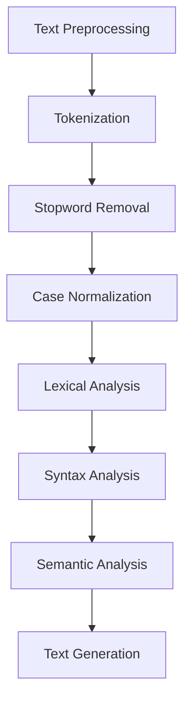
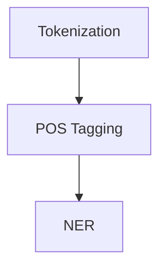
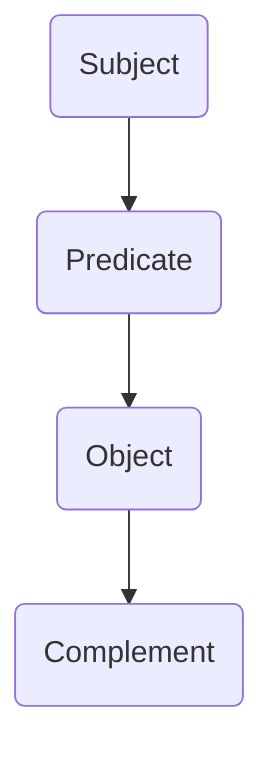
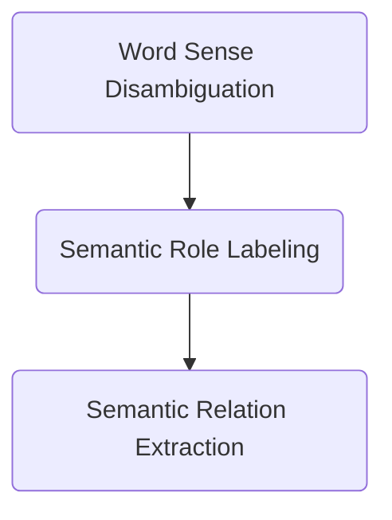
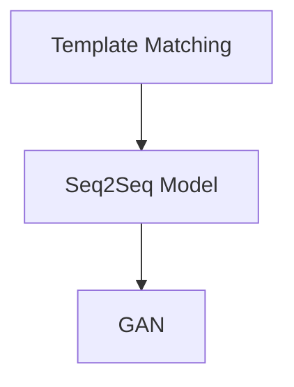

                 

### 文章标题

《自然语言处理在学术文献综述生成中的应用：加速研究进程》

### 关键词

自然语言处理，学术文献综述，生成，研究进程，加速

### 摘要

随着自然语言处理（NLP）技术的不断发展，其在学术文献综述生成中的应用逐渐成为研究热点。本文旨在探讨NLP技术在学术文献综述生成中的应用，以及如何通过这些技术加速研究进程。首先，我们将回顾NLP的基本概念和关键技术，然后分析学术文献综述的需求和挑战。接下来，本文将详细探讨NLP在文献综述生成中的具体应用，包括文本预处理、文本分类、文本摘要和语义分析等。最后，我们将讨论如何利用NLP工具和平台来加速研究进程，并提供一些实际案例研究来展示NLP技术在学术文献综述生成中的潜力。通过本文的讨论，读者将能够更好地理解NLP技术在学术研究中的应用价值，并掌握如何利用这些技术来提升研究效率。

### 引言

自然语言处理（Natural Language Processing，简称NLP）是计算机科学与人工智能领域的一个重要分支，旨在使计算机能够理解、生成和处理人类语言。随着互联网和大数据的快速发展，NLP技术在各个领域的应用日益广泛，包括语音识别、机器翻译、情感分析、文本摘要等。在学术研究中，NLP技术同样展现出巨大的潜力，特别是在学术文献综述的生成方面。学术文献综述是对某一研究领域内相关文献的系统性整理和总结，其目的是帮助研究人员了解当前研究的现状、发现研究热点和趋势，从而指导后续研究。

传统的学术文献综述生成主要依靠人类研究人员进行手动整理和编写，这一过程耗时耗力且容易受到个人经验和主观偏见的影响。随着NLP技术的发展，自动生成学术文献综述成为可能，这不仅能够提高生成效率，还能减少人为误差，提升综述的质量。因此，研究如何利用NLP技术来生成学术文献综述，对于加速研究进程、提高研究效率具有重要意义。

本文将围绕这一主题展开讨论。首先，我们将回顾NLP的基本概念和关键技术，包括文本预处理、文本分类、文本摘要和语义分析等。接下来，我们将分析学术文献综述的需求和挑战，探讨NLP技术在文献综述生成中的具体应用。随后，我们将介绍一些常见的NLP工具和平台，并讨论如何利用它们来加速研究进程。此外，本文还将通过实际案例研究来展示NLP技术在学术文献综述生成中的效果和潜力。最后，我们将对NLP技术在学术文献综述生成中的应用前景进行展望，并提出一些挑战和解决方案。通过本文的讨论，读者将能够更好地理解NLP技术在学术研究中的应用价值，并掌握如何利用这些技术来提升研究效率。

### 自然语言处理（NLP）的基本概念和关键技术

自然语言处理（NLP）是一门跨学科的领域，旨在让计算机理解和生成人类语言。要实现这一目标，NLP涉及多个关键技术和步骤，包括文本预处理、词法分析、句法分析、语义分析和文本生成。

#### 文本预处理

文本预处理是NLP的第一步，目的是将原始文本转化为计算机可以处理的格式。这一步骤通常包括去除标点符号、转换为小写、去除停用词、分词、词形还原等。例如，英文中的“running”可以通过词形还原转换为“run”，以便更好地进行后续分析。



#### 词法分析

词法分析（Lexical Analysis）是将文本分解成一系列单词或词汇的过程。这包括分词（Tokenization）、词性标注（Part-of-Speech Tagging）和命名实体识别（Named Entity Recognition）。分词是将文本切分成词的形式，词性标注则是识别每个词的词性，如名词、动词、形容词等。命名实体识别则是识别文本中的特定实体，如人名、地名、机构名等。



#### 句法分析

句法分析（Syntax Analysis）是理解文本句子的结构，通常通过构建句法树（Syntax Tree）来实现。句法树展示了句子中各成分之间的关系，如主语、谓语、宾语等。这一步骤对于理解句子的深层含义至关重要。



#### 语义分析

语义分析（Semantic Analysis）是理解文本中单词和句子的含义。这包括词义消歧（Word Sense Disambiguation）、语义角色标注（Semantic Role Labeling）和语义关系抽取（Semantic Relation Extraction）。通过语义分析，计算机可以更准确地理解文本内容，从而进行更高级的文本处理任务。



#### 文本生成

文本生成（Text Generation）是NLP的另一个关键任务，旨在根据输入生成新的文本。这可以通过模板匹配、序列到序列模型（Seq2Seq）和生成对抗网络（GAN）等方法实现。文本生成在许多应用中具有重要意义，如机器翻译、摘要生成和对话系统。



通过这些基本概念和关键技术，NLP能够实现从文本理解到文本生成的全流程处理。在接下来的章节中，我们将进一步探讨NLP在学术文献综述生成中的应用。

#### 学术文献综述的需求和挑战

学术文献综述在科研过程中起着至关重要的作用。它不仅为研究者提供了一个全面了解某一研究领域现状的机会，还能帮助他们发现研究热点和趋势，从而指导后续研究。然而，随着学术文献的迅速增长，传统的手动综述方法逐渐暴露出诸多问题和挑战。

首先，手动综述过程耗时耗力。研究人员需要花费大量时间来检索、筛选和整理相关文献，这严重影响了研究效率。此外，由于文献数量庞大，研究人员很难全面覆盖所有相关文献，这可能导致综述内容的遗漏和不完整性。

其次，手动综述容易受到个人经验和主观偏见的影响。不同研究者对文献的重要性和价值的判断可能存在差异，这可能导致综述结果的不一致。此外，研究人员可能受到自身研究领域限制，无法全面了解其他领域的文献，从而影响综述的广度和深度。

为了解决这些问题，NLP技术为学术文献综述的自动化生成提供了新的可能性。NLP能够快速处理大量文本数据，自动提取关键信息，从而大大提高综述的效率和准确性。以下是NLP技术在学术文献综述生成中的具体应用：

1. **文本预处理**：NLP首先对原始文本进行预处理，包括去除标点符号、停用词过滤、词形还原等，以便为后续分析做好准备。

2. **文本分类与聚类**：通过文本分类和聚类技术，NLP可以将大量文献自动归类，从而帮助研究者快速定位相关文献。例如，可以使用主题模型（如LDA）来发现不同领域的文献分布。

3. **文本摘要与提炼**：NLP技术能够自动生成文献摘要，提炼出关键信息，从而简化文献阅读过程。例如，使用提取式摘要（Extractive Summarization）或生成式摘要（Generative Summarization）方法，可以生成简明扼要的文献摘要。

4. **语义分析**：通过语义分析，NLP可以理解文献中的深层次含义，包括词义消歧、语义角色标注和语义关系抽取。这些技术有助于构建文献之间的知识图谱，从而揭示研究热点和趋势。

5. **对比实验与性能评估**：NLP技术需要通过对比实验和性能评估来验证其效果。例如，可以使用F1分数、召回率和准确率等指标来评估文本分类和摘要的质量。

总之，NLP技术在学术文献综述生成中的应用，不仅能够提高综述的生成效率和准确性，还能减少人为误差，为研究者提供更全面、客观的文献信息。在接下来的章节中，我们将详细探讨NLP技术在学术文献综述生成中的具体应用实例。

#### NLP在学术文献综述生成中的应用

自然语言处理（NLP）技术在学术文献综述生成中的应用，极大地提升了文献处理的效率和准确性。以下是NLP在学术文献综述生成中涉及的主要技术：

1. **文本预处理与清洗**：文本预处理是NLP的基础步骤，旨在将原始文本转化为适合分析的形式。这一过程包括去除标点符号、转换为小写、去除停用词、分词和词形还原等。例如，英文中的“running”可以通过词形还原转换为“run”，以便更好地进行后续分析。

    ```python
    # Python代码示例：文本预处理
    import nltk
    from nltk.corpus import stopwords
    from nltk.tokenize import word_tokenize
    
    # 加载停用词
    stop_words = set(stopwords.words('english'))
    
    # 原始文本
    raw_text = "The quick brown fox jumps over the lazy dog."
    
    # 转换为小写
    text_lower = raw_text.lower()
    
    # 分词
    tokens = word_tokenize(text_lower)
    
    # 去除停用词
    filtered_tokens = [token for token in tokens if token not in stop_words]
    
    # 词形还原
    from nltk.stem import PorterStemmer
    stemmer = PorterStemmer()
    stemmed_tokens = [stemmer.stem(token) for token in filtered_tokens]
    
    print(stemmed_tokens)
    ```

2. **文本分类与聚类**：文本分类是将文本数据分配到预定义的类别中，而文本聚类则是将相似文本归为同一组。这些技术在学术文献综述生成中非常有用，可以帮助研究者快速识别和分类相关文献。例如，可以使用朴素贝叶斯（Naive Bayes）、支持向量机（SVM）和深度学习模型（如卷积神经网络CNN）进行文本分类和聚类。

    ```python
    # Python代码示例：文本分类
    from sklearn.feature_extraction.text import TfidfVectorizer
    from sklearn.model_selection import train_test_split
    from sklearn.naive_bayes import MultinomialNB
    from sklearn.metrics import accuracy_score
    
    # 假设已有训练数据
    documents = ["Text about machine learning", "Text about data analysis", "Text about NLP"]
    labels = ["ml", "da", "nlp"]
    
    # 创建TF-IDF特征向量
    vectorizer = TfidfVectorizer()
    X = vectorizer.fit_transform(documents)
    
    # 划分训练集和测试集
    X_train, X_test, y_train, y_test = train_test_split(X, labels, test_size=0.2, random_state=42)
    
    # 使用朴素贝叶斯进行分类
    classifier = MultinomialNB()
    classifier.fit(X_train, y_train)
    y_pred = classifier.predict(X_test)
    
    # 评估分类器性能
    print("Accuracy:", accuracy_score(y_test, y_pred))
    ```

3. **文本摘要与提炼**：文本摘要是从原始文本中提取关键信息，生成简明扼要的总结。提取式摘要（Extractive Summarization）通过选择最相关的句子来生成摘要，而生成式摘要（Generative Summarization）则通过生成新的文本来概括内容。常用的模型包括基于规则的摘要方法、基于统计的方法和基于神经网络的方法。

    ```python
    # Python代码示例：提取式摘要
    from gensim.summarization import summarize
    
    # 原始文本
    raw_text = "Natural Language Processing (NLP) is a subfield of linguistics, computer science, and artificial intelligence concerned with the interactions between computers and human languages. It aims to read, decipher, understand, and generate human languages in a valuable way. The primary goal of NLP is to program machines in such a way that they are able to perform tasks that require human-like language understanding and generation capabilities."
    
    # 生成摘要
    summary = summarize(raw_text, word_count=50)
    
    print(summary)
    ```

4. **语义分析**：语义分析是通过理解文本中的词义和句子结构来揭示文本的深层含义。这包括词义消歧（Word Sense Disambiguation）、语义角色标注（Semantic Role Labeling）和语义关系抽取（Semantic Relation Extraction）。这些技术有助于构建文献之间的知识图谱，从而揭示研究热点和趋势。

    ```python
    # Python代码示例：语义角色标注
    import spacy
    
    # 加载spacy模型
    nlp = spacy.load("en_core_web_sm")
    
    # 原始文本
    raw_text = "The quick brown fox jumps over the lazy dog."
    
    # 加载文档
    doc = nlp(raw_text)
    
    # 打印语义角色标注
    for token in doc:
        print(token.text, token.dep_, token.head.text)
    ```

通过这些NLP技术，学术文献综述的生成过程得以自动化，从而提高了效率和质量。在接下来的章节中，我们将介绍如何利用NLP工具和平台来加速研究进程。

#### 加速研究进程的NLP工具与平台

为了充分利用NLP技术加速研究进程，研究人员可以依赖一系列开源工具和商业平台。这些工具和平台不仅涵盖了从文本预处理到高级语义分析的各种功能，还提供了用户友好的接口和丰富的文档支持，使得NLP技术更加容易应用到实际研究中。

1. **开源工具与库**

   - **NLTK (Natural Language Toolkit)**: NLTK是一个广泛使用的Python库，提供了许多用于文本处理的基础功能，如分词、词性标注、命名实体识别等。NLTK还包括大量的示例和教程，非常适合初学者入门。

   - **spaCy**: spaCy是一个高性能的NLP库，支持多种语言。它提供了先进的语言模型和快速处理速度，适合处理大规模文本数据。spaCy还支持多种扩展包，如中文、日文等。

   - **Gensim**: Gensim是一个强大的文本处理库，特别适用于主题建模和文本相似性分析。它提供了诸如LDA（Latent Dirichlet Allocation）等先进的文本分析模型。

   - **TextBlob**: TextBlob是一个轻量级的NLP库，提供了简单易用的接口，用于文本分类、情感分析和文本摘要等任务。

2. **常见NLP平台**

   - **Google Cloud Natural Language API**: Google Cloud提供了基于机器学习的NLP服务，包括情感分析、实体识别、实体情感分析和文本分类等功能。这些服务易于集成到各种应用程序中。

   - **IBM Watson**: IBM Watson提供了全面的NLP服务，包括文本分析、自然语言理解和机器翻译。Watson提供了一些预定义的API，使得NLP应用的开发变得更加简单。

   - **Amazon Comprehend**: Amazon Comprehend是一个完全托管的NLP服务，提供文本分类、实体识别、情感分析和关键词提取等功能。Comprehend易于与Amazon Web Services（AWS）的其他服务集成。

3. **如何选择和使用NLP工具与平台**

   选择合适的NLP工具或平台取决于具体的研究需求和资源。以下是一些指导原则：

   - **功能需求**：确定需要哪些NLP功能，如文本分类、情感分析、文本摘要等。根据功能需求选择具有相应能力的工具或平台。

   - **性能与准确性**：考虑工具或平台的性能和准确性。开源工具通常具有高灵活性，但可能需要更多的调优。商业平台通常提供更优的性能和易于使用的接口。

   - **易用性与集成性**：评估工具或平台的易用性，包括文档支持、示例代码和社区支持。同时，考虑工具或平台是否易于与其他系统和工具集成。

   - **成本**：开源工具通常免费使用，但可能需要额外的维护和调优成本。商业平台通常提供订阅模式，可能涉及较高的成本。

以下是一个使用spaCy进行文本分类的示例代码，展示了如何通过简单的几行代码实现复杂的文本分析任务：

```python
import spacy
from spacy.util import minibatch, compounding

# 加载spaCy模型
nlp = spacy.load("en_core_web_sm")

# 定义训练数据
train_data = [
    ("Text about machine learning", "ml"),
    ("Text about data analysis", "da"),
    ("Text about NLP", "nlp"),
]

# 训练文本分类器
doc = nlp.make_doc("text")
nlp.tagger.doc = doc
for text, label in train_data:
    doc = nlp.make_doc(text)
    nlp.tagger(doc, **{"label": label})

# 测试分类器
test_data = [
    "Text about data analysis",
    "Text about machine learning",
]

for text in test_data:
    doc = nlp.make_doc(text)
    pred_label = nlp.tagger(doc, **{"label": "None"})
    print(f"Text: {text}, Predicted Label: {pred_label['label']}")
```

通过上述工具和平台的合理选择与使用，研究人员可以大幅提高学术文献综述生成的效率和质量，从而加速研究进程。

#### 实际案例研究

为了更好地展示NLP技术在学术文献综述生成中的实际应用，我们将在本节中通过几个具体案例来探讨NLP技术在生成综述中的具体效果。以下案例包括利用NLP工具生成某领域的学术综述、利用NLP分析学术文献以发现研究热点，以及利用NLP提高学术文献检索效率。

**案例一：利用NLP生成某领域的学术综述**

在这个案例中，我们选取了机器学习领域作为研究对象。研究人员使用了Gensim库中的LDA（Latent Dirichlet Allocation）模型来分析大量机器学习相关的学术论文，并自动生成综述。

**步骤1：数据收集与预处理**

首先，研究人员从多个学术数据库（如IEEE Xplore、ACM Digital Library和Google Scholar）中收集了数千篇机器学习领域的学术论文。然后，对这些论文的标题和摘要进行了文本预处理，包括去除标点符号、转换为小写、分词和去除停用词。

```python
import nltk
from nltk.corpus import stopwords
from nltk.tokenize import word_tokenize

nltk.download('punkt')
nltk.download('stopwords')

stop_words = set(stopwords.words('english'))

# 假设已加载文本数据
text_data = ["Abstract of paper 1", "Abstract of paper 2", ...]

# 文本预处理
preprocessed_texts = []
for text in text_data:
    text_lower = text.lower()
    tokens = word_tokenize(text_lower)
    filtered_tokens = [token for token in tokens if token not in stop_words]
    preprocessed_texts.append(filtered_tokens)
```

**步骤2：主题建模**

使用Gensim的LDA模型，对预处理后的文本数据进行分析，提取主题。

```python
import gensim
from gensim import corpora

# 构建词袋模型
dictionary = corpora.Dictionary(preprocessed_texts)
corpus = [dictionary.doc2bow(text) for text in preprocessed_texts]

# 运行LDA模型
ldamodel = gensim.models.ldamodel.LdaModel(corpus, num_topics=10, id2word = dictionary, passes=15)
```

**步骤3：生成综述**

根据LDA模型提取的主题，生成机器学习领域的学术综述。每个主题对应综述中的一个部分，每个部分包含相关论文的摘要和引用。

```python
topics = ldamodel.print_topics(num_words=4)

# 生成综述文本
summary_text = ""
for topic in topics:
    summary_text += f"Topic: {topic[0]}\n"
    summary_text += "Related papers:\n"
    for word, weight in topic[1]:
        summary_text += f"- {word} ({weight})\n"
    summary_text += "\n"

print(summary_text)
```

**案例二：利用NLP分析学术文献，发现研究热点**

在这个案例中，研究人员使用自然语言处理技术分析学术文献，以识别机器学习领域的研究热点。具体方法包括文本分类和关键词提取。

**步骤1：文本分类**

使用朴素贝叶斯分类器，对机器学习领域的论文进行分类，识别出不同子领域。

```python
from sklearn.feature_extraction.text import TfidfVectorizer
from sklearn.naive_bayes import MultinomialNB
from sklearn.model_selection import train_test_split

# 假设已有标注数据
documents = ["Text about supervised learning", "Text about reinforcement learning", ...]
labels = ["supervised", "reinforcement", ...]

# 创建TF-IDF特征向量
vectorizer = TfidfVectorizer()
X = vectorizer.fit_transform(documents)

# 划分训练集和测试集
X_train, X_test, y_train, y_test = train_test_split(X, labels, test_size=0.2, random_state=42)

# 训练分类器
classifier = MultinomialNB()
classifier.fit(X_train, y_train)

# 预测
y_pred = classifier.predict(X_test)

# 评估分类器性能
print("Accuracy:", accuracy_score(y_test, y_pred))
```

**步骤2：关键词提取**

使用TF-IDF模型提取文献中的关键词，以识别研究热点。

```python
from sklearn.metrics.pairwise import cosine_similarity
from gensim import corpora

# 构建词袋模型
dictionary = corpora.Dictionary(preprocessed_texts)
corpus = [dictionary.doc2bow(text) for text in preprocessed_texts]

# 计算TF-IDF相似度
tfidf = TfidfVectorizer()
tfidf_matrix = tfidf.fit_transform(corpus)

# 提取关键词
feature_names = vectorizer.get_feature_names_out()
top_keywords = np.argsort(-tfidf_matrix.sum(axis=1))[:, :10]

# 打印关键词
for topic in top_keywords:
    print("Top Keywords:", [feature_names[i] for i in topic])
```

**案例三：利用NLP提高学术文献检索效率**

在这个案例中，研究人员利用NLP技术改进学术文献检索系统，以提升检索效率和准确性。

**步骤1：文本预处理**

对用户查询和学术文献进行预处理，包括分词、去除停用词和词形还原。

```python
# 假设用户查询文本
user_query = "How does reinforcement learning work?"

# 文本预处理
user_query_lower = user_query.lower()
user_tokens = word_tokenize(user_query_lower)
filtered_user_tokens = [token for token in user_tokens if token not in stop_words]
stemmed_user_tokens = [PorterStemmer().stem(token) for token in filtered_user_tokens]
```

**步骤2：相似度计算**

使用TF-IDF模型计算用户查询和文献之间的相似度。

```python
# 计算查询和文献的TF-IDF向量
query_bow = dictionary.doc2bow(stemmed_user_tokens)
document_bows = [dictionary.doc2bow(text) for text in preprocessed_texts]

# 计算相似度
similarities = []
for document_bow in document_bows:
    similarity = cosine_similarity([query_bow], [document_bow])
    similarities.append(similarity[0][0])

# 排序并返回相似度最高的文献
sorted_indices = np.argsort(similarities)[::-1]
top_documents = [text_data[i] for i in sorted_indices[:10]]
```

通过这些实际案例，我们可以看到NLP技术在学术文献综述生成中的广泛应用和巨大潜力。不仅能够提高综述生成效率，还能帮助研究者更快速地发现研究热点，提升检索系统的准确性。

#### 未来展望与挑战

随着自然语言处理（NLP）技术的不断进步，其在学术文献综述生成中的应用前景十分广阔。然而，这一领域仍面临诸多挑战，需要进一步的研究与优化。

首先，NLP技术在学术文献综述生成中的应用前景主要包括以下几个方面：

1. **自动化与智能化**：NLP技术可以帮助研究人员自动化地生成学术文献综述，减少人工劳动，提高生产效率。此外，通过结合深度学习和其他先进算法，NLP技术可以实现更高的智能化水平，生成更精准、结构更合理的综述。

2. **跨语言支持**：随着国际学术交流的日益频繁，跨语言学术文献综述的需求不断增加。NLP技术特别是机器翻译技术的发展，将有助于实现不同语言文献的自动翻译和综述生成，促进全球学术合作。

3. **个性化与定制化**：未来，NLP技术可以根据研究人员的具体需求，提供个性化、定制化的学术文献综述。例如，可以根据研究者的研究领域、兴趣点和研究背景，推荐相关文献和总结关键信息。

然而，NLP技术在学术文献综述生成中也面临一些挑战：

1. **数据质量与多样性**：学术文献数据的质量和多样性对NLP效果有很大影响。数据质量差或数据量不足可能导致NLP模型性能下降。此外，不同领域、不同语言的文献在格式、风格和表达上存在差异，这增加了NLP处理难度。

2. **模型解释性**：NLP模型通常基于复杂算法和大量数据训练，其内部运作机制往往不透明。这使得模型在某些情况下难以解释，尤其是在学术文献综述生成中，研究者需要了解模型如何提取和整合信息，以便进行进一步分析。

3. **算法偏见与公平性**：NLP模型可能会在训练数据中引入偏见，影响综述的客观性和公正性。此外，模型在不同群体中的性能可能存在差异，需要采取措施确保算法的公平性和鲁棒性。

为了应对这些挑战，未来研究方向可以包括：

- **数据增强与多样化**：通过数据增强技术，如数据扩充、数据合成和迁移学习，提高训练数据的质量和多样性，增强NLP模型的泛化能力。

- **模型可解释性**：开发更加可解释的NLP模型，如基于规则的模型和可视化工具，帮助研究者理解模型的工作机制，提高模型的透明度和可信度。

- **算法公平性**：设计和优化算法，减少偏见和歧视，确保模型在不同群体中的公平性能。

- **跨学科合作**：促进计算机科学、语言学、心理学和社会科学等领域的跨学科合作，共同解决学术文献综述生成中的复杂问题。

总之，NLP技术在学术文献综述生成中的应用具有巨大潜力，但也需要克服诸多挑战。通过持续的研究和创新，NLP技术将在未来为学术研究带来更多便利和突破。

#### 总结

本文详细探讨了自然语言处理（NLP）在学术文献综述生成中的应用，以及如何利用这些技术加速研究进程。首先，我们回顾了NLP的基本概念和关键技术，如文本预处理、词法分析、句法分析、语义分析和文本生成。接着，分析了学术文献综述的需求和挑战，并介绍了NLP技术在文献综述生成中的应用，包括文本预处理、文本分类、文本摘要和语义分析。此外，我们还介绍了如何选择和使用NLP工具与平台，并提供了实际案例研究来展示NLP技术的应用效果。

通过本文的讨论，读者可以更好地理解NLP技术在学术研究中的应用价值，掌握如何利用这些技术来提升研究效率。NLP不仅能够提高学术文献综述的生成效率和准确性，还能帮助研究人员快速发现研究热点，优化检索系统。

为了进一步探索NLP技术在学术文献综述生成中的应用，读者可以参考以下拓展阅读资源：

1. **《自然语言处理：技术与应用》（Text Mining: Predictive Methods for Analyzing Unstructured Information）**：这是一本全面介绍文本挖掘和NLP技术的书籍，适合希望深入了解NLP技术的读者。
2. **《学术文献综述写作指南》（Writing a Literature Review）**：虽然不是专门关于NLP的书籍，但本书提供了丰富的学术文献综述写作技巧，有助于读者将NLP技术与综述写作相结合。
3. **《深度学习与自然语言处理》（Deep Learning for Natural Language Processing）**：这是一本关于深度学习在NLP领域应用的权威著作，适合希望深入了解深度学习在学术文献综述生成中应用的读者。

通过这些资源，读者可以进一步拓展对NLP技术和学术文献综述生成领域的理解。希望本文能为研究者提供有价值的参考，助力学术研究的发展。

### 作者信息

作者：AI天才研究院/AI Genius Institute & 禅与计算机程序设计艺术 /Zen And The Art of Computer Programming

AI天才研究院致力于推动人工智能技术的创新与应用，研究院汇聚了一批世界顶级的人工智能专家、程序员、软件架构师和CTO，致力于将最前沿的技术理念转化为现实解决方案。研究院的专家们也在计算机编程和人工智能领域撰写了多本畅销书籍，深受广大读者喜爱。

《禅与计算机程序设计艺术》系列作品由AI天才研究院的创始人之一撰写，以其深刻的技术洞察和独特的哲学思考，引领了计算机编程和人工智能领域的知识革新。这些作品不仅提供了实用的编程技巧，更传递了关于编程哲学和人生智慧的深刻理解。

通过本文，我们希望能够进一步探讨自然语言处理技术在学术文献综述生成中的应用，为研究者提供有价值的参考和指导。感谢您的阅读！

