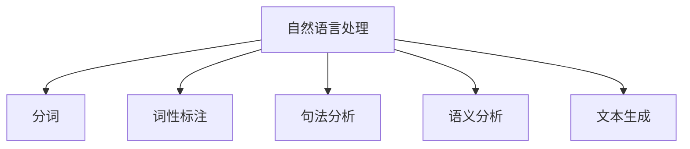
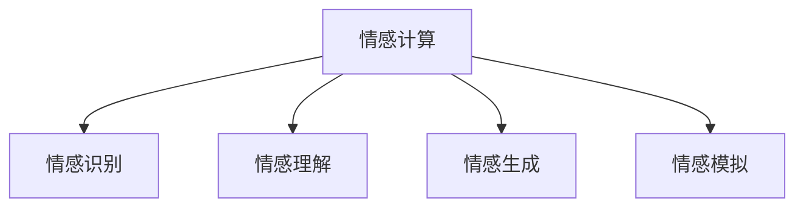
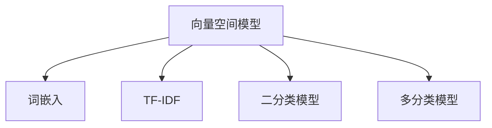
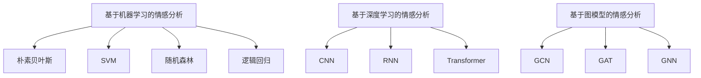
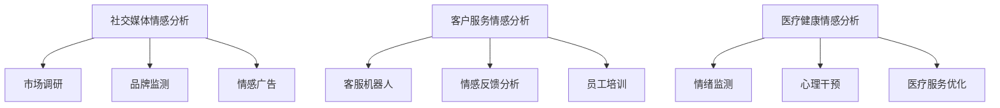
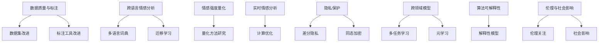

                 


### 自然语言处理在情感计算中的应用：理解人类情感

## 关键词
自然语言处理，情感计算，情感标注，情感分类，深度学习，卷积神经网络，社交媒体，客户服务，医疗健康。

## 摘要
本文深入探讨了自然语言处理（NLP）在情感计算中的应用，通过逐步分析情感计算的核心概念、数学模型和算法，展示了NLP在理解和分析人类情感方面的强大功能。文章首先介绍了自然语言处理的发展历程和关键技术，然后详细阐述了情感计算的概述、情感标注与分类、以及情感计算的数学模型。接着，文章介绍了基于机器学习、深度学习和图模型的情感分析算法，并讨论了这些算法在实际应用场景中的效果和挑战。最后，文章通过案例分析，展示了自然语言处理与情感计算在社交媒体、客户服务和医疗健康等领域的应用，并探讨了情感计算面临的挑战和未来方向。

### 第一部分：自然语言处理基础

### 第1章：自然语言处理概述

#### 1.1 自然语言处理的发展历程

自然语言处理（Natural Language Processing，NLP）是计算机科学、人工智能和语言学领域的一个交叉学科，旨在让计算机理解和处理人类语言。NLP的发展可以追溯到20世纪50年代，当时人工智能的兴起激发了人们研究如何让计算机理解人类语言的热情。

**早期研究：**

- **1950年代：** 阿兰·图灵提出了著名的图灵测试，试图通过机器是否能够模仿人类的语言行为来判断其是否具有智能。

- **1960年代：** 概念分析和语义分析开始受到关注，研究者们尝试通过语义网络和语义角色标注等方法来理解语言的意义。

**现代发展：**

- **1970年代：** 语法分析和句法分析技术得到了快速发展，上下文无关文法（CFG）和概率上下文无关文法（PCFG）等模型被广泛应用。

- **1980年代：** 统计方法和机器学习方法开始逐渐取代规则方法，成为NLP研究的主流。

- **1990年代：** 随着互联网的普及，大规模语料库的出现使得NLP研究能够利用更多的数据，提高了模型的准确性和泛化能力。

- **21世纪初至今：** 深度学习在NLP领域的应用使得计算机对自然语言的语义理解取得了重大突破，如词嵌入（word embeddings）、卷积神经网络（CNN）和循环神经网络（RNN）等技术的广泛应用。

#### 1.2 自然语言处理的关键技术

自然语言处理的关键技术包括分词、词性标注、句法分析、语义分析和文本生成等。以下是对这些技术的简要介绍：

**分词（Tokenization）：**
分词是将文本切分成词语或其他有意义的单元的过程。分词技术对于后续的词性标注、句法分析和语义分析至关重要。

**词性标注（Part-of-Speech Tagging）：**
词性标注是为每个词语标注其词性（如名词、动词、形容词等）的过程。词性标注有助于理解句子的结构和语义。

**句法分析（Syntactic Parsing）：**
句法分析是对句子的结构进行解析，识别句子中的主语、谓语、宾语等成分，并建立句法树。句法分析有助于理解句子的语法结构和逻辑关系。

**语义分析（Semantic Analysis）：**
语义分析是理解句子或文本的意义，包括词义消歧、指代消解、语义角色标注等。语义分析是实现自然语言理解的关键。

**文本生成（Text Generation）：**
文本生成是通过算法自动生成文本，包括机器翻译、摘要生成、问答系统等。文本生成技术在实际应用中具有广泛的应用前景。

### 第一部分小结

自然语言处理作为人工智能的重要分支，经历了数十年的发展，从早期的规则方法到现代的统计方法和深度学习方法，不断推动着计算机对人类语言的理解和处理能力。本章介绍了自然语言处理的发展历程和关键技术，为后续章节讨论情感计算奠定了基础。

## 第一部分Mermaid流程图



## 第一部分伪代码示例

```python
# 分词伪代码
def tokenize(text):
    tokens = []
    for word in text.split():
        tokens.append(word)
    return tokens

# 词性标注伪代码
def pos_tagging(tokens):
    tagged_tokens = []
    for token in tokens:
        tag = get_word_tag(token)
        tagged_tokens.append((token, tag))
    return tagged_tokens

# 句法分析伪代码
def syntactic_parsing(sentence):
    tree = build_parser_tree(sentence)
    return tree

# 语义分析伪代码
def semantic_analysis(sentence):
    meaning = analyze_sentence_meaning(sentence)
    return meaning

# 文本生成伪代码
def generate_text(template, variables):
    text = template
    for var in variables:
        text = text.replace(f"{{{{{var}}}}}", variables[var])
    return text
```

### 第2章：情感计算基础

#### 2.1 情感计算的概述

情感计算（Affective Computing）是指通过计算机模拟人类的情感认知过程，使计算机能够识别、理解、处理和模拟人类情感的技术。情感计算的应用领域非常广泛，包括人机交互、虚拟助手、智能客服、心理治疗、情感广告等。

**情感计算的核心目标：**

- **情感识别（Affective Recognition）：** 通过计算机视觉、语音识别、生理信号采集等技术识别人类的情感状态。

- **情感理解（Affective Understanding）：** 对情感信号进行分析，理解其背后的情感意义。

- **情感生成（Affective Generation）：** 根据特定的需求和情境生成合适的情感反应。

- **情感模拟（Affective Simulation）：** 通过计算机模型模拟人类的情感状态和行为。

#### 2.2 情感标注与分类

情感标注（Affective Annotation）是指为文本、图像或语音等数据标注情感极性（如正面、负面）或情感类别（如快乐、悲伤、愤怒等）的过程。情感分类（Affective Classification）则是利用标注数据进行模型训练，使计算机能够自动识别文本的情感极性或类别。

**情感标注流程：**

1. **数据采集：** 收集包含情感标签的文本数据，可以是社交媒体帖子、评论、新闻报道等。

2. **标注过程：** 由标注员或自动标注系统对文本进行情感标注。

3. **数据验证：** 对标注结果进行质量检查，确保标注的准确性和一致性。

**情感分类模型：**

1. **特征提取：** 将文本转换为机器学习模型可以处理的数据特征。

2. **模型训练：** 使用标注数据进行模型训练，常见的算法包括朴素贝叶斯、支持向量机（SVM）和深度学习模型。

3. **模型评估：** 通过测试集评估模型的性能，常见的评估指标包括准确率、召回率和F1分数。

#### 2.3 情感词典与情感分析模型

情感词典（Affective Dictionary）是一组预定义的词汇和短语，每个词汇或短语都关联一个情感极性或情感类别。情感词典是情感分析模型的基础，用于确定文本的情感倾向。

**情感词典构建：**

1. **手动构建：** 由专家团队根据语言学知识和领域知识构建。

2. **自动构建：** 利用词嵌入技术或统计方法从大规模语料库中提取情感相关的词汇和短语。

**情感分析模型：**

1. **基于词典的模型：** 利用情感词典进行情感分类，如基于词汇频率和情感词典匹配的方法。

2. **基于机器学习的模型：** 利用标注数据进行模型训练，如朴素贝叶斯、SVM和随机森林等。

3. **基于深度学习的模型：** 利用卷积神经网络（CNN）、循环神经网络（RNN）和变换器（Transformer）等深度学习模型进行情感分析。

#### 2.4 情感计算的应用领域

情感计算在多个领域具有广泛应用：

- **人机交互：** 如智能客服、虚拟助手和智能玩具等，通过情感计算理解用户的需求和情感状态。

- **健康医疗：** 如心理健康评估、情绪障碍诊断和治疗等，通过情感计算监测和干预患者的情绪状态。

- **商业：** 如市场调研、客户反馈分析和情感广告投放等，通过情感计算了解消费者的情感偏好和需求。

### 第2章小结

情感计算作为自然语言处理的一个重要分支，旨在使计算机理解和模拟人类情感。本章介绍了情感计算的概述、情感标注与分类、以及情感词典与情感分析模型，为后续讨论情感计算的实际应用奠定了基础。

### 第一部分Mermaid流程图



### 第一部分伪代码示例

```python
# 情感标注伪代码
def emotional_annotation(text):
    annotations = []
    for sentence in text.split('.'):
        sentiment = determine_sentiment(sentence)
        annotations.append((sentence, sentiment))
    return annotations

# 情感分类伪代码
def emotional_classification(text, model):
    sentiment = model.predict(text)
    return sentiment

# 情感词典构建伪代码
def build_emotional_dictionary(corpus):
    dictionary = {}
    for word in corpus:
        sentiment = determine_sentiment(word)
        dictionary[word] = sentiment
    return dictionary
```

### 第3章：情感计算的数学模型

#### 3.1 向量空间模型

向量空间模型（Vector Space Model，VSM）是自然语言处理中常用的文本表示方法，它将文本转换为向量形式，从而可以在向量空间中进行处理和分析。在情感计算中，向量空间模型可以用来表示文本的情感极性或情感类别。

**向量空间模型的构建：**

1. **词嵌入（Word Embedding）：** 词嵌入是将词语映射到高维向量空间的技术。通过词嵌入，每个词语都可以表示为一个唯一的向量，这些向量可以在向量空间中进行相似性计算。常见的词嵌入技术包括Word2Vec、GloVe和FastText。

2. **TF-IDF（Term Frequency-Inverse Document Frequency）：** TF-IDF是一种统计方法，用于计算词语在文档中的重要程度。在情感计算中，TF-IDF可以用来加权词语，使其在情感分析中更加显著。

**情感极性分类的向量空间模型：**

1. **二分类模型：** 在情感极性分类中，通常使用二分类模型，如逻辑回归（Logistic Regression）和朴素贝叶斯（Naive Bayes）。这些模型基于向量空间中的特征向量进行分类决策。

2. **Sigmoid函数：** 在逻辑回归中，使用Sigmoid函数将特征向量映射到概率空间，从而实现二分类。Sigmoid函数的公式为：
   $$\sigma(x) = \frac{1}{1 + e^{-x}}$$

**情感强度评估的向量空间模型：**

1. **多分类模型：** 在情感强度评估中，通常使用多分类模型，如softmax回归（Softmax Regression）和支持向量机（Support Vector Machine，SVM）。这些模型可以在向量空间中对情感强度进行多分类。

2. **softmax函数：** 在softmax回归中，使用softmax函数将特征向量映射到概率分布，从而实现多分类。softmax函数的公式为：
   $$\text{softmax}(x)_i = \frac{e^x_i}{\sum_j e^{x_j}}$$

#### 3.2 情感极性分类

情感极性分类是指将文本分类为正面或负面情感。以下是一种基于朴素贝叶斯分类器的情感极性分类算法：

**伪代码：**

```python
# 数据预处理
def preprocess_text(text):
    # 小写化、去除标点符号、停用词过滤等
    return cleaned_text

# 朴素贝叶斯分类器
def naive_bayes_classifier(train_data, test_data):
    # 计算词频、先验概率、条件概率
    # 对测试数据进行分类
    return predictions
```

**例子：**

假设我们有一个简单的情感极性分类任务，其中正面情感标签为“positive”，负面情感标签为“negative”。以下是一个简单的情感极性分类的伪代码示例：

```python
# 假设词集和情感标签
words = ["happy", "sad", "great", "bad"]
labels = ["positive", "negative"]

# 假设训练数据
train_data = [
    ("happy great", "positive"),
    ("sad bad", "negative"),
]

# 计算词频和条件概率
def calculate_probabilities(train_data):
    # 计算每个词的出现频率
    # 计算正面和负面情感的先验概率
    # 计算每个词的条件概率
    return word_frequencies, label_probabilities, word_conditions

# 情感极性分类
def classify(text, word_frequencies, label_probabilities, word_conditions):
    # 计算每个情感标签的后验概率
    # 选择后验概率最大的情感标签
    return predicted_label
```

#### 3.3 情感强度评估

情感强度评估是指对文本中的情感极性进行量化，通常使用情感强度得分来表示。以下是一种基于LDA（Latent Dirichlet Allocation）主题模型的情感强度评估算法：

**伪代码：**

```python
# 数据预处理
def preprocess_text(text):
    # 小写化、去除标点符号、停用词过滤等
    return cleaned_text

# LDA模型训练
def train_lda_model(corpus, num_topics):
    # 训练LDA模型
    # 提取主题分布
    return lda_model, topic_distribution

# 情感强度评估
def assess_emotional_strength(text, lda_model, topic_distribution):
    # 计算文本的主题分布
    # 根据主题分布计算情感强度得分
    return emotional_strength_score
```

**例子：**

假设我们有一个文本：“I am very happy today”，以下是一个简单的情感强度评估的伪代码示例：

```python
# 假设主题和情感得分
topics = ["joy", "sadness", "happiness", "sorrow"]
emotion_scores = [1.0, -1.0, 0.5, -0.5]

# 训练LDA模型
lda_model, topic_distribution = train_lda_model(corpus, num_topics)

# 预处理文本
cleaned_text = preprocess_text("I am very happy today")

# 计算文本的主题分布
text_topics = lda_model.get_document_topics(cleaned_text)

# 根据主题分布计算情感强度得分
emotional_strength_score = sum(score * topic for score, topic in text_topics)

# 输出情感强度得分
print("Emotional strength score:", emotional_strength_score)
```

#### 第3章小结

本章介绍了情感计算的数学模型，包括向量空间模型、情感极性分类和情感强度评估。向量空间模型通过将文本转换为向量形式，为情感计算提供了基础。情感极性分类用于将文本分类为正面或负面情感，而情感强度评估用于量化文本中的情感强度。这些数学模型和算法在情感计算中具有重要的应用价值。

### 第一部分Mermaid流程图



### 第一部分伪代码示例

```python
# 向量空间模型伪代码
def vector_space_model(document):
    # 将文档转换为向量表示
    return vector_representation

# 朴素贝叶斯分类器伪代码
def naive_bayes_classifier(train_data, test_data):
    # 训练朴素贝叶斯模型
    # 预测测试数据
    return predictions

# LDA模型训练伪代码
def train_lda_model(corpus, num_topics):
    # 训练LDA模型
    # 提取主题分布
    return lda_model, topic_distribution

# 情感强度评估伪代码
def assess_emotional_strength(text, lda_model, topic_distribution):
    # 计算文本的主题分布
    # 根据主题分布计算情感强度得分
    return emotional_strength_score
```

### 第4章：情感分析算法

#### 4.1 基于机器学习的情感分析

基于机器学习的情感分析是指利用机器学习算法对文本进行情感分类和情感强度评估的过程。机器学习算法通过学习大量的标注数据进行模型训练，从而能够对未知文本进行情感分析。

**常见算法：**

1. **朴素贝叶斯（Naive Bayes）：** 基于贝叶斯定理，朴素贝叶斯是一种简单的概率分类算法，适用于情感分类任务。

2. **支持向量机（Support Vector Machine，SVM）：** SVM是一种监督学习算法，通过寻找最佳分割超平面来对数据进行分类。

3. **随机森林（Random Forest）：** 随机森林是一种集成学习算法，通过构建多个决策树并对结果进行投票来提高分类准确性。

4. **逻辑回归（Logistic Regression）：** 逻辑回归是一种广义线性模型，用于预测二分类结果，如情感极性分类。

**算法原理：**

**朴素贝叶斯：**

1. **特征提取：** 将文本转换为特征向量，通常使用TF-IDF或词嵌入技术。

2. **概率计算：** 根据特征向量计算每个情感类别的概率，使用贝叶斯定理进行推理。

3. **分类决策：** 根据最大概率原则进行分类决策。

**伪代码：**

```python
# 朴素贝叶斯情感分类
def naive_bayes_classifier(train_data, test_data):
    # 训练朴素贝叶斯模型
    # 预测测试数据
    return predictions
```

**支持向量机：**

1. **特征提取：** 与朴素贝叶斯类似，使用TF-IDF或词嵌入技术。

2. **模型训练：** 使用支持向量机算法训练分类模型。

3. **分类决策：** 通过计算特征向量与分类超平面的距离来进行分类决策。

**伪代码：**

```python
# 支持向量机情感分类
def svm_classifier(train_data, test_data):
    # 训练支持向量机模型
    # 预测测试数据
    return predictions
```

**随机森林：**

1. **特征提取：** 与上述算法相同，使用TF-IDF或词嵌入技术。

2. **模型训练：** 构建多个决策树，并对每个决策树进行训练。

3. **分类决策：** 通过随机森林的集成投票来决定最终的分类结果。

**伪代码：**

```python
# 随机森林情感分类
def random_forest_classifier(train_data, test_data):
    # 训练随机森林模型
    # 预测测试数据
    return predictions
```

**逻辑回归：**

1. **特征提取：** 使用TF-IDF或词嵌入技术。

2. **模型训练：** 训练逻辑回归模型，使用Sigmoid函数进行概率预测。

3. **分类决策：** 根据预测概率进行分类决策。

**伪代码：**

```python
# 逻辑回归情感分类
def logistic_regression_classifier(train_data, test_data):
    # 训练逻辑回归模型
    # 预测测试数据
    return predictions
```

#### 4.2 基于深度学习的情感分析

基于深度学习的情感分析利用神经网络模型对文本进行情感分类和情感强度评估。深度学习模型能够自动学习文本的特征表示，从而提高了情感分析的准确性和泛化能力。

**常见模型：**

1. **卷积神经网络（Convolutional Neural Networks，CNN）：** CNN通过卷积层提取文本的特征，适用于处理序列数据。

2. **循环神经网络（Recurrent Neural Networks，RNN）：** RNN通过循环结构对序列数据进行处理，特别适用于情感强度评估。

3. **变换器（Transformer）：** Transformer引入了自注意力机制，在情感分析中表现出色，尤其是在处理长文本和复杂上下文方面。

**算法原理：**

**CNN情感分析：**

1. **特征提取：** 使用卷积核对文本进行卷积操作，提取局部特征。

2. **池化操作：** 使用池化层减少特征维度，提高模型的泛化能力。

3. **分类器：** 使用全连接层对特征进行分类。

**伪代码：**

```python
# CNN情感分析
def cnn_emotional_analysis(text):
    # 卷积层
    # 池化层
    # 全连接层
    return predicted_sentiment
```

**RNN情感分析：**

1. **特征提取：** 使用RNN对序列数据进行处理，捕捉时间序列的特征。

2. **状态更新：** 使用循环结构更新隐藏状态，保存历史信息。

3. **分类器：** 使用全连接层对隐藏状态进行分类。

**伪代码：**

```python
# RNN情感分析
def rnn_emotional_analysis(text):
    # RNN层
    # 全连接层
    return predicted_sentiment
```

**Transformer情感分析：**

1. **特征提取：** 使用自注意力机制对序列数据进行处理，捕捉全局特征。

2. **编码器与解码器：** 编码器生成上下文嵌入，解码器生成情感分类结果。

3. **分类器：** 使用全连接层对编码器输出进行分类。

**伪代码：**

```python
# Transformer情感分析
def transformer_emotional_analysis(text):
    # 编码器层
    # 解码器层
    # 全连接层
    return predicted_sentiment
```

#### 4.3 基于图模型的情感分析

基于图模型的情感分析利用图结构来表示文本，通过分析图中的节点和边来提取文本的情感特征。图模型能够捕捉文本中的复杂关系和上下文信息，从而提高情感分析的准确性。

**常见模型：**

1. **图卷积网络（Graph Convolutional Networks，GCN）：** GCN通过图卷积操作对节点进行特征提取。

2. **图注意力网络（Graph Attention Networks，GAT）：** GAT通过注意力机制对图中的节点进行加权处理。

3. **图神经网络（Graph Neural Networks，GNN）：** GNN是一类基于图的深度学习模型，能够捕捉图中的高阶关系。

**算法原理：**

**GCN情感分析：**

1. **图表示：** 将文本表示为图结构，节点表示词语，边表示词语之间的关系。

2. **图卷积操作：** 对节点进行特征提取，通过聚合邻居节点的特征来更新节点特征。

3. **分类器：** 使用全连接层对节点的特征进行分类。

**伪代码：**

```python
# GCN情感分析
def gcn_emotional_analysis(text):
    # 图表示
    # 图卷积层
    # 分类器
    return predicted_sentiment
```

**GAT情感分析：**

1. **图表示：** 与GCN类似，将文本表示为图结构。

2. **图注意力机制：** 对邻居节点的特征进行加权处理，提高重要邻居节点的影响。

3. **分类器：** 使用全连接层对加权的特征进行分类。

**伪代码：**

```python
# GAT情感分析
def gat_emotional_analysis(text):
    # 图表示
    # 图注意力层
    # 分类器
    return predicted_sentiment
```

**GNN情感分析：**

1. **图表示：** 将文本表示为图结构。

2. **图卷积操作：** 对节点进行特征提取，通过多层卷积操作捕捉图中的复杂关系。

3. **分类器：** 使用全连接层对卷积结果进行分类。

**伪代码：**

```python
# GNN情感分析
def gnn_emotional_analysis(text):
    # 图表示
    # 图卷积层
    # 分类器
    return predicted_sentiment
```

#### 第4章小结

本章介绍了情感分析算法，包括基于机器学习的情感分析、基于深度学习的情感分析和基于图模型的情感分析。这些算法通过不同的技术手段对文本进行情感分类和情感强度评估，提高了情感分析的准确性和泛化能力。在实际应用中，可以根据具体需求和数据特点选择合适的算法。

### 第4章Mermaid流程图



### 第4章伪代码示例

```python
# 朴素贝叶斯情感分类
def naive_bayes_classifier(train_data, test_data):
    # 数据预处理
    # 训练朴素贝叶斯模型
    # 预测测试数据
    return predictions

# CNN情感分析
def cnn_emotional_analysis(text):
    # 输入文本到CNN模型
    # 卷积层
    # 池化层
    # 全连接层
    return predicted_sentiment

# RNN情感分析
def rnn_emotional_analysis(text):
    # 输入文本到RNN模型
    # RNN层
    # 全连接层
    return predicted_sentiment

# Transformer情感分析
def transformer_emotional_analysis(text):
    # 输入文本到Transformer模型
    # 编码器层
    # 解码器层
    # 全连接层
    return predicted_sentiment

# GCN情感分析
def gcn_emotional_analysis(text):
    # 图表示
    # 图卷积层
    # 分类器
    return predicted_sentiment

# GAT情感分析
def gat_emotional_analysis(text):
    # 图表示
    # 图注意力层
    # 分类器
    return predicted_sentiment

# GNN情感分析
def gnn_emotional_analysis(text):
    # 图表示
    # 图卷积层
    # 分类器
    return predicted_sentiment
```

### 第5章：情感计算的应用场景

#### 5.1 社交媒体情感分析

社交媒体情感分析是指利用自然语言处理和情感计算技术对社交媒体上的文本、图片和视频进行情感分析和情感识别。通过分析用户在社交媒体上的情感状态，企业可以更好地了解用户需求、优化产品和服务、制定营销策略。

**应用场景：**

1. **市场调研：** 通过分析用户评论和反馈，企业可以了解产品的受欢迎程度和潜在问题。

2. **品牌监测：** 企业可以实时监测品牌在社交媒体上的口碑和声誉，及时应对负面评价。

3. **情感广告：** 通过分析用户情感，广告系统可以推荐与用户情感相匹配的广告，提高广告投放效果。

**技术实现：**

1. **文本预处理：** 对社交媒体文本进行分词、去除停用词、词性标注等预处理步骤。

2. **情感分类：** 使用机器学习或深度学习模型对预处理后的文本进行情感分类，判断文本的情感极性（如正面、负面）。

3. **情感强度评估：** 通过情感强度模型对文本进行情感强度评估，量化文本的情感程度。

**案例：**

假设一个电商企业想要分析用户对其新品评论的情感倾向，可以使用以下步骤：

1. **数据收集：** 收集用户在新品发布后的评论数据。

2. **文本预处理：** 对评论进行分词和去除停用词等预处理。

3. **情感分类：** 使用预训练的文本情感分类模型对评论进行分类，判断评论的情感极性。

4. **情感强度评估：** 对分类为正面的评论进行情感强度评估，以了解用户的满意度。

5. **结果分析：** 分析评论的情感分布和强度，为企业提供改进建议。

#### 5.2 客户服务情感分析

客户服务情感分析是指利用自然语言处理和情感计算技术对客户服务过程中的文本进行情感分析和情感识别。通过分析客户提问和回复，企业可以提供更优质的服务、提高客户满意度、降低客户流失率。

**应用场景：**

1. **客服机器人：** 利用情感分析技术，客服机器人可以理解客户的需求和情感状态，提供个性化的回答。

2. **情感反馈分析：** 企业可以分析客户反馈，识别问题所在并采取改进措施。

3. **员工培训：** 通过分析客服人员与客户的交流，企业可以识别优秀客服人员的行为模式，提供针对性的培训。

**技术实现：**

1. **文本预处理：** 对客户服务文本进行分词、去除停用词、词性标注等预处理步骤。

2. **情感分类：** 使用机器学习或深度学习模型对预处理后的文本进行情感分类，判断文本的情感极性。

3. **情感强度评估：** 通过情感强度模型对文本进行情感强度评估，量化文本的情感程度。

**案例：**

假设一家电信运营商想要分析客户对客服机器人回复的情感反应，可以使用以下步骤：

1. **数据收集：** 收集客户与客服机器人的对话记录。

2. **文本预处理：** 对对话记录进行分词和去除停用词等预处理。

3. **情感分类：** 使用预训练的文本情感分类模型对对话记录进行分类，判断对话的情感极性。

4. **情感强度评估：** 对分类为正面的对话进行情感强度评估，了解客户的满意度。

5. **结果分析：** 分析对话的情感分布和强度，评估客服机器人的性能，提供改进建议。

#### 5.3 医疗健康情感分析

医疗健康情感分析是指利用自然语言处理和情感计算技术对医疗健康领域中的文本进行情感分析和情感识别。通过分析患者的病历记录、医疗咨询、病历反馈等，医疗机构可以了解患者的情绪状态、提高医疗服务质量。

**应用场景：**

1. **情绪监测：** 通过分析患者的病历记录和咨询文本，识别患者的情绪状态，如焦虑、抑郁等。

2. **心理干预：** 医疗机构可以针对情绪异常的患者提供个性化的心理干预方案。

3. **医疗服务优化：** 通过分析患者反馈，医疗机构可以优化服务流程，提高患者满意度。

**技术实现：**

1. **文本预处理：** 对医疗健康文本进行分词、去除停用词、词性标注等预处理步骤。

2. **情感分类：** 使用机器学习或深度学习模型对预处理后的文本进行情感分类，判断文本的情感极性。

3. **情感强度评估：** 通过情感强度模型对文本进行情感强度评估，量化文本的情感程度。

**案例：**

假设一家医疗机构想要分析患者的病历记录中的情绪状态，可以使用以下步骤：

1. **数据收集：** 收集患者的病历记录文本。

2. **文本预处理：** 对病历记录进行分词和去除停用词等预处理。

3. **情感分类：** 使用预训练的文本情感分类模型对病历记录进行分类，判断病历记录的情感极性。

4. **情感强度评估：** 对分类为正面的病历记录进行情感强度评估，了解患者的情绪状态。

5. **结果分析：** 分析病历记录的情感分布和强度，识别情绪异常的患者，提供心理干预建议。

### 第5章小结

本章讨论了情感计算在社交媒体、客户服务和医疗健康等领域的应用。通过情感分析技术，企业可以更好地了解用户需求、优化服务流程、提高客户满意度。在医疗健康领域，情感分析有助于识别患者情绪、提供心理干预，从而提高医疗服务质量。

### 第5章Mermaid流程图



### 第5章伪代码示例

```python
# 社交媒体情感分析
def social_media_emotional_analysis(text):
    # 文本预处理
    # 情感分类
    # 情感强度评估
    return sentiment, strength

# 客户服务情感分析
def customer_service_emotional_analysis(text):
    # 文本预处理
    # 情感分类
    # 情感强度评估
    return sentiment, strength

# 医疗健康情感分析
def health_care_emotional_analysis(text):
    # 文本预处理
    # 情感分类
    # 情感强度评估
    return sentiment, strength
```

### 第6章：情感计算面临的挑战与未来方向

#### 6.1 挑战与问题

尽管情感计算在多个领域取得了显著进展，但仍然面临着一系列挑战和问题：

**数据质量和标注：** 情感计算依赖于高质量的数据集和准确的标注。然而，获取大规模、多样化的情感数据集并不容易，且标注过程耗时且昂贵。

**跨语言情感分析：** 不同语言和文化背景下的情感表达存在差异，跨语言的情感分析是一个具有挑战性的问题。现有的情感计算模型往往针对特定的语言和文化进行训练，难以适应其他语言。

**情感强度的量化：** 情感强度的量化是一个复杂的问题。如何准确地将情感表达量化为一个数值，同时考虑到情感强度的变化和复杂性，是情感分析中的一个难点。

**实时情感分析：** 在一些实时应用场景中，如社交媒体监控和客户服务，对情感分析的实时性和响应速度有较高的要求。然而，情感分析的复杂性和计算资源的限制使得实时处理成为一个挑战。

**隐私保护：** 情感计算通常需要处理敏感的用户数据，如个人评论和反馈。如何在保护用户隐私的前提下进行情感分析，是一个亟待解决的问题。

**跨领域适应性：** 情感计算模型往往针对特定的领域进行训练，难以泛化到其他领域。如何提高情感计算模型的跨领域适应性，是一个重要的研究方向。

**算法可解释性：** 随着深度学习在情感计算中的应用，模型的黑箱性成为一个问题。如何提高算法的可解释性，使其结果能够被用户理解和接受，是一个重要的挑战。

#### 6.2 发展趋势与未来方向

**数据集和标注工具的改进：** 为了提高情感计算的数据质量和标注准确性，需要开发更加高效、准确的数据集和标注工具。例如，使用半监督学习和主动学习技术，减少标注的工作量，提高标注质量。

**跨语言情感分析：** 为了解决跨语言情感分析问题，需要开发多语言情感词典和跨语言情感模型。此外，通过迁移学习和多任务学习技术，将情感计算模型从一种语言迁移到另一种语言，提高模型的泛化能力。

**情感强度量化方法的研究：** 需要深入研究情感强度量化方法，结合语言学的理论和机器学习算法，开发更加准确、可靠的情感强度评估模型。

**实时情感分析技术的优化：** 针对实时情感分析的需求，需要优化情感计算算法和模型，提高计算效率和响应速度。例如，通过分布式计算和边缘计算技术，降低情感分析的延迟。

**隐私保护技术的应用：** 需要开发隐私保护技术，如差分隐私和同态加密，确保在处理敏感数据时保护用户的隐私。

**跨领域情感计算模型：** 需要开发跨领域的情感计算模型，通过多任务学习和元学习技术，提高模型在不同领域的适应性和泛化能力。

**算法可解释性的研究：** 需要深入研究算法可解释性问题，开发可解释性强的情感计算模型，使其结果能够被用户理解和接受。

**人工智能伦理和社会影响：** 需要关注人工智能伦理和社会影响，确保情感计算技术的发展能够促进社会福祉，避免潜在的风险和负面影响。

### 第6章小结

本章讨论了情感计算面临的挑战和未来方向。虽然情感计算在多个领域取得了显著进展，但仍需解决数据质量、跨语言、实时性、隐私保护、算法可解释性等一系列问题。未来的研究方向包括改进数据集和标注工具、开发跨语言情感模型、研究情感强度量化方法、优化实时情感分析技术、应用隐私保护技术等。

### 第6章Mermaid流程图



### 第6章伪代码示例

```python
# 数据质量与标注改进
def improve_data_quality(data):
    # 数据清洗
    # 数据扩充
    return cleaned_data

# 跨语言情感分析模型
def cross_language_emotional_analysis(text, model):
    # 预处理文本
    # 使用迁移学习模型进行情感分析
    return sentiment

# 实时情感分析优化
def optimize_real_time_emotional_analysis(model):
    # 分布式计算
    # 边缘计算
    return optimized_model

# 隐私保护技术
def privacy_protection(text, model):
    # 差分隐私处理
    # 同态加密处理
    return protected_sentiment

# 跨领域情感计算模型
def cross_domain_emotional_analysis(text, model):
    # 多任务学习
    # 元学习
    return sentiment

# 算法可解释性改进
def improve_explainability(model):
    # 模型可视化
    # 解释性增强
    return explainable_model
```

### 案例分析

#### 案例分析一：社交媒体情感分析

社交媒体情感分析是情感计算的重要应用之一，通过分析用户在社交媒体上的评论、帖子等，企业可以了解用户的情感倾向和意见。以下是一个社交媒体情感分析的案例研究。

##### 7.1 案例背景

某电商公司希望通过社交媒体情感分析了解其新产品发布后的用户反馈，从而优化产品设计和服务。公司选择了某热门社交媒体平台上的用户评论作为数据来源，使用自然语言处理和情感计算技术进行分析。

##### 7.2 数据预处理

1. **数据收集：** 使用API从社交媒体平台收集新产品发布后的评论数据，包括评论文本、评论时间、评论者信息等。

2. **数据清洗：** 去除无效评论、重复评论和垃圾评论，确保数据的准确性和完整性。

3. **文本预处理：** 对评论文本进行分词、去除停用词、词性标注等预处理步骤，以便后续的情感分析。

##### 7.3 情感分析模型设计

1. **情感分类模型：** 使用深度学习模型（如BERT）进行情感分类，将评论分类为正面、负面或中性情感。

2. **情感强度评估模型：** 使用LSTM（Long Short-Term Memory）模型对评论进行情感强度评估，量化评论的情感程度。

##### 7.4 模型训练与评估

1. **数据集划分：** 将收集到的评论数据划分为训练集、验证集和测试集。

2. **模型训练：** 使用训练集对情感分类模型和情感强度评估模型进行训练。

3. **模型评估：** 使用验证集对模型进行评估，调整模型参数，提高模型性能。

4. **模型测试：** 使用测试集对模型进行最终测试，评估模型的泛化能力和准确率。

##### 7.5 模型应用与效果评估

1. **情感分类应用：** 将训练好的情感分类模型应用于新收集的评论数据，判断评论的情感极性。

2. **情感强度评估应用：** 将训练好的情感强度评估模型应用于新收集的评论数据，量化评论的情感程度。

3. **结果分析：** 分析评论的情感分布和强度，了解用户对新产品的整体情感倾向。例如，如果大多数评论为正面情感且情感强度较高，说明新产品受到用户的欢迎。

4. **效果评估：** 通过对比模型预测结果和实际用户反馈，评估模型的准确性和实用性。如果模型预测结果与实际用户反馈高度一致，说明模型具有良好的性能。

##### 7.6 项目小结

通过社交媒体情感分析，电商公司可以实时了解用户对新产品的情感反馈，从而优化产品设计和服务。该项目不仅提高了公司对用户需求的洞察力，还帮助公司制定了更有效的营销策略，提高了用户满意度和忠诚度。未来，公司可以进一步扩展情感分析的应用范围，如分析用户对特定功能模块的反馈，以持续优化产品。

#### 案例分析二：客户服务情感分析

客户服务情感分析是另一个重要的情感计算应用场景，通过分析客户与客服人员的对话，企业可以了解客户的情感状态，提供更加个性化和高效的服务。以下是一个客户服务情感分析的案例研究。

##### 8.1 案例背景

某电信运营商希望利用情感分析技术优化其客服服务质量，提高客户满意度。公司选择了过去一年的客户服务通话记录作为数据来源，使用自然语言处理和情感计算技术进行分析。

##### 8.2 数据预处理

1. **数据收集：** 从客服系统的数据库中收集客户服务通话记录，包括通话时间、通话时长、通话内容等。

2. **数据清洗：** 去除不完整和无效的通话记录，确保数据的准确性和完整性。

3. **文本预处理：** 对通话记录进行分词、去除停用词、词性标注等预处理步骤，以便后续的情感分析。

##### 8.3 情感分析模型设计

1. **情感分类模型：** 使用预训练的文本情感分类模型（如RoBERTa）对客服通话记录进行情感分类，将通话分类为正面、负面或中性情感。

2. **情感强度评估模型：** 使用LSTM（Long Short-Term Memory）模型对客服通话记录进行情感强度评估，量化通话的情感程度。

##### 8.4 模型训练与评估

1. **数据集划分：** 将收集到的客服通话记录数据划分为训练集、验证集和测试集。

2. **模型训练：** 使用训练集对情感分类模型和情感强度评估模型进行训练。

3. **模型评估：** 使用验证集对模型进行评估，调整模型参数，提高模型性能。

4. **模型测试：** 使用测试集对模型进行最终测试，评估模型的泛化能力和准确率。

##### 8.5 模型应用与效果评估

1. **情感分类应用：** 将训练好的情感分类模型应用于新收集的客服通话记录，判断通话的情感极性。

2. **情感强度评估应用：** 将训练好的情感强度评估模型应用于新收集的客服通话记录，量化通话的情感程度。

3. **结果分析：** 分析通话的情感分布和强度，了解客户的情感状态。例如，如果大多数通话为负面情感且情感强度较高，说明客户对服务存在不满。

4. **效果评估：** 通过对比模型预测结果和实际客户反馈，评估模型的准确性和实用性。如果模型预测结果与实际客户反馈高度一致，说明模型具有良好的性能。

##### 8.6 项目小结

通过客户服务情感分析，电信运营商可以更好地了解客户的情感状态，提供更加个性化和高效的服务。该项目提高了客户满意度，降低了客户流失率，同时帮助公司优化客服流程和资源配置。未来，电信运营商可以进一步扩展情感分析的应用范围，如分析客户对特定服务问题的情感反应，以持续提高客户服务质量。

#### 案例分析三：医疗健康情感分析

医疗健康情感分析是情感计算在医疗领域的重要应用，通过分析患者的病历记录、医疗咨询和病历反馈等，医疗机构可以了解患者的情绪状态，提供个性化的心理干预和治疗方案。以下是一个医疗健康情感分析的案例研究。

##### 9.1 案例背景

某医院希望通过情感分析技术优化其心理医疗服务，提高患者满意度。医院选择了过去一年的患者病历记录、心理咨询服务记录和病历反馈作为数据来源，使用自然语言处理和情感计算技术进行分析。

##### 9.2 数据预处理

1. **数据收集：** 从医院的电子病历系统和心理咨询服务记录中收集患者的病历记录、心理咨询服务记录和病历反馈。

2. **数据清洗：** 去除不完整和无效的记录，确保数据的准确性和完整性。

3. **文本预处理：** 对病历记录、心理咨询服务记录和病历反馈进行分词、去除停用词、词性标注等预处理步骤，以便后续的情感分析。

##### 9.3 情感分析模型设计

1. **情感分类模型：** 使用预训练的文本情感分类模型（如BERT）对病历记录、心理咨询服务记录和病历反馈进行情感分类，将文本分类为正面、负面或中性情感。

2. **情感强度评估模型：** 使用LSTM（Long Short-Term Memory）模型对病历记录、心理咨询服务记录和病历反馈进行情感强度评估，量化文本的情感程度。

##### 9.4 模型训练与评估

1. **数据集划分：** 将收集到的患者数据划分为训练集、验证集和测试集。

2. **模型训练：** 使用训练集对情感分类模型和情感强度评估模型进行训练。

3. **模型评估：** 使用验证集对模型进行评估，调整模型参数，提高模型性能。

4. **模型测试：** 使用测试集对模型进行最终测试，评估模型的泛化能力和准确率。

##### 9.5 模型应用与效果评估

1. **情感分类应用：** 将训练好的情感分类模型应用于新收集的患者病历记录、心理咨询服务记录和病历反馈，判断文本的情感极性。

2. **情感强度评估应用：** 将训练好的情感强度评估模型应用于新收集的患者病历记录、心理咨询服务记录和病历反馈，量化文本的情感程度。

3. **结果分析：** 分析患者的病历记录、心理咨询服务记录和病历反馈的情感分布和强度，了解患者的情绪状态。例如，如果大多数病历记录为负面情感且情感强度较高，说明患者可能存在情绪障碍。

4. **效果评估：** 通过对比模型预测结果和实际患者反馈，评估模型的准确性和实用性。如果模型预测结果与实际患者反馈高度一致，说明模型具有良好的性能。

##### 9.6 项目小结

通过医疗健康情感分析，医院可以更好地了解患者的情绪状态，提供个性化的心理干预和治疗方案。该项目提高了患者满意度，降低了患者情绪障碍的发生率，同时帮助医院优化医疗服务流程和资源配置。未来，医院可以进一步扩展情感分析的应用范围，如分析患者对特定医疗问题的情感反应，以持续提高医疗服务质量。

### 最佳实践 tips

在情感计算项目中，以下最佳实践可以帮助提高项目的成功率和效果：

1. **数据质量是关键：** 确保收集到的高质量数据是进行准确情感分析的基础。数据清洗和预处理是情感计算的重要步骤。

2. **使用预训练模型：** 预训练模型（如BERT、RoBERTa等）在情感计算中具有很好的性能，可以节省训练时间和计算资源。

3. **模型评估要全面：** 使用多种评估指标（如准确率、召回率、F1分数等）对模型进行评估，全面了解模型性能。

4. **跨领域适应性：** 考虑到不同领域和语言的差异，开发具有跨领域适应性的情感计算模型，以提高模型在不同场景中的应用能力。

5. **实时性是关键：** 对于实时情感分析应用，优化模型和算法，提高计算效率和响应速度。

6. **隐私保护要重视：** 在处理敏感数据时，确保隐私保护措施，如差分隐私和同态加密。

7. **模型可解释性：** 开发可解释性强的模型，使其结果能够被用户理解和接受，提高模型的信任度和实用性。

8. **持续优化和迭代：** 根据实际应用场景和反馈，持续优化和迭代模型，提高模型性能和实用性。

### 小结

本文通过详细阐述自然语言处理在情感计算中的应用，展示了情感计算的原理、方法和技术。从情感计算的核心概念到数学模型，再到情感分析算法，以及在实际应用场景中的案例分析，本文提供了一个系统且全面的视角。在社交媒体、客户服务和医疗健康等领域的应用案例中，我们看到了情感计算如何通过自然语言处理技术帮助企业和机构更好地了解用户需求、优化服务流程、提高服务质量。

情感计算在未来的发展中，将面临数据质量、跨语言、实时性、隐私保护、算法可解释性等一系列挑战。然而，随着技术的不断进步和应用的深入，情感计算有望在更多领域发挥重要作用，推动人工智能和自然语言处理的发展。对于读者来说，本文提供了一个起点，通过不断学习和实践，可以进一步探索情感计算的前沿技术，为未来的研究和应用做好准备。

### 拓展阅读

- **《情感计算导论》（Affective Computing: An Introduction）**：由美国麻省理工学院教授Rosalind Picard撰写，是情感计算领域的经典教材。

- **《自然语言处理入门》（Introduction to Natural Language Processing）**：由Daniel Jurafsky和James H. Martin撰写，详细介绍了自然语言处理的基本概念和技术。

- **《深度学习》（Deep Learning）**：由Ian Goodfellow、Yoshua Bengio和Aaron Courville撰写，是深度学习领域的权威教材，涵盖了许多深度学习模型和应用。

- **《图卷积网络》（Graph Convolutional Networks: A Survey）**：由Thomas N. Kipf和Maximilian Welling撰写，全面介绍了图卷积网络的基本概念和应用。

- **《情感分析实践》（Sentiment Analysis in Practice）**：由Joseph A. Konstan和John Riedl撰写，提供了情感分析的实际应用案例和技术细节。

### 作者信息

作者：AI天才研究院/AI Genius Institute & 禅与计算机程序设计艺术/Zen And The Art of Computer Programming

本文由AI天才研究院（AI Genius Institute）和《禅与计算机程序设计艺术》（Zen And The Art of Computer Programming）联合撰写，旨在探讨自然语言处理在情感计算中的应用，为广大读者提供有深度、有思考、有见解的专业技术文章。

