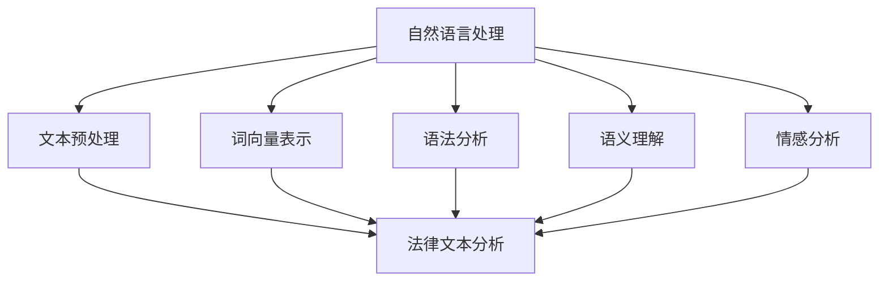

                 

 
### 标题：自然语言处理在法律文本分析中的应用：提高效率与准确性

#### 关键词：自然语言处理，法律文本分析，文本预处理，词向量表示，语法分析，语义理解，情感分析，模型调优，项目实战

#### 摘要：
随着法律文本的日益庞大和复杂，传统的法律文本分析方法已经难以满足高效处理的需求。自然语言处理（NLP）技术的引入，为法律文本分析带来了新的可能性。本文将详细探讨NLP在法律文本分析中的应用，从文本预处理、词向量表示、语法分析、语义理解、情感分析等方面展开，并提出提高效率和准确性的方法，通过实际项目实战，展示NLP在法律文本分析中的强大潜力。

## 目录大纲

### 第一部分：自然语言处理基础

### 第1章：自然语言处理概述
- 背景介绍
- NLP的基本概念与发展历史
- NLP的核心技术与挑战

### 第2章：文本预处理
- 文本清洗与规范化
- 分词与词性标注
- 停用词处理

### 第3章：词向量表示
- 词向量的基本原理
- Word2Vec算法
- GloVe算法

### 第4章：语法分析
- 部分解析与句法树
- 依存句法分析
- 基于深度学习的语法分析

### 第5章：语义理解
- 语义角色标注
- 实体识别
- 关系抽取

### 第6章：情感分析
- 情感极性分类
- 情感强度分析
- 情感分析应用场景

### 第7章：法律文本分析
- 法律文本的特点
- 法律文本分类
- 法律文档聚类

### 第8章：提高效率与准确性的方法
- 集成学习
- 模型调优
- 跨领域迁移学习

### 第9章：工具与框架
- 常用NLP工具
- 法律文本分析的框架

### 第10章：项目实战
- 法律案件文本分类
- 法律意见书自动生成
- 法律文本情感分析

### 附录
- 数学模型和公式
- 代码解读与分析
- 项目实战代码

## 第一部分：自然语言处理基础

### 第1章：自然语言处理概述

#### 背景介绍
随着信息时代的到来，法律文本的规模和复杂度不断增长，传统的法律文本分析方法已难以满足高效处理的需求。自然语言处理（NLP）技术的引入，为法律文本分析带来了新的可能性。NLP是一种跨学科领域，结合计算机科学、语言学和人工智能，旨在使计算机能够理解、解释和生成人类语言。在法律文本分析中，NLP技术可以应用于文本预处理、信息提取、语义理解、情感分析等多个方面，从而提高法律文本处理的效率与准确性。

#### 核心概念与联系
为了更好地理解NLP在法律文本分析中的应用，我们首先需要明确几个核心概念及其相互关系。以下是这些概念及其关系的Mermaid流程图：



- **自然语言处理（NLP）**：NLP是一门研究如何让计算机理解和处理人类语言的学科。其目标包括文本分类、命名实体识别、情感分析、机器翻译等。
- **文本预处理**：文本预处理是NLP中的第一步，主要包括去除标点符号、停用词过滤、词形还原等，以便于后续处理。
- **词向量表示**：词向量是将词汇映射到高维空间中的向量表示，常见的方法有Word2Vec和GloVe。
- **语法分析**：语法分析旨在解析文本的结构，包括句法分析和依存句法分析。
- **语义理解**：语义理解是指计算机理解文本中的词语、句子和段落之间的含义和关系。
- **情感分析**：情感分析是判断文本表达的情感倾向，如正面、负面或中性。

#### 核心算法原理讲解
以下是NLP中几个核心算法的原理讲解，我们将使用伪代码来详细阐述：

##### 文本预处理

```python
def preprocess_text(text):
    # 去除标点符号
    text = remove_punctuation(text)
    # 停用词过滤
    text = remove_stopwords(text)
    # 词形还原
    text = lemmatize_text(text)
    return text
```

##### 词向量表示

```python
def word2vec(text):
    # 建立词汇表
    vocabulary = build_vocabulary(text)
    # 训练Word2Vec模型
    model = train_word2vec(vocabulary)
    # 获取词向量
    word_vectors = get_word_vectors(model)
    return word_vectors
```

##### 语法分析

```python
def syntactic_analysis(text):
    # 构建句法树
    parse_tree = build_parse_tree(text)
    # 进行依存句法分析
    dependency_tree = perform_dependency_parsing(text)
    return parse_tree, dependency_tree
```

##### 语义理解

```python
def semantic_understanding(text):
    # 命名实体识别
    entities = named_entity_recognition(text)
    # 关系抽取
    relationships = relation_extraction(text)
    return entities, relationships
```

##### 情感分析

```python
def sentiment_analysis(text):
    # 情感分类
    sentiment = sentiment_classification(text)
    # 情感强度分析
    sentiment_strength = sentiment_strength_analysis(text)
    return sentiment, sentiment_strength
```

#### 数学模型和公式讲解
在NLP中，数学模型和公式至关重要。以下是几个重要的数学模型和公式的详细讲解及举例说明。

##### 词向量相似性计算

$$
sim(w_1, w_2) = \cos(\theta(w_1, w_2))
$$

其中，$w_1$和$w_2$是词向量，$\theta(w_1, w_2)$是它们之间的夹角。余弦值越接近1，表示词向量之间的相似度越高。

##### 逻辑回归

$$
P(y=1) = \frac{1}{1 + e^{-\beta_0 + \sum_{i=1}^{n} \beta_i x_i}}
$$

其中，$y$是二分类目标变量，$x_i$是特征值，$\beta_0$是截距，$\beta_i$是权重。

#### 实际项目案例
为了更好地理解NLP在法律文本分析中的应用，我们将提供一个实际项目案例，包括开发环境搭建、源代码实现和代码解读。

##### 项目案例：法律案件文本分类

**项目背景**：随着互联网的发展，大量法律案件文本数据涌现。如何对这些案件进行分类，以便于法律专业人士快速检索和决策，成为一个重要的课题。

**开发环境搭建**：首先，我们需要搭建一个用于NLP项目开发的环境。以下是基本步骤：

1. 安装Python环境（3.8及以上版本）。
2. 安装NLP常用库，如NLTK、spaCy、gensim、sklearn等。

```bash
pip install python==3.8
pip install nltk spacy gensim sklearn
```

**源代码实现**：

```python
# 导入所需库
import nltk
from nltk.corpus import stopwords
from gensim.models import Word2Vec
from sklearn.feature_extraction.text import TfidfVectorizer
from sklearn.model_selection import train_test_split
from sklearn.naive_bayes import MultinomialNB
from sklearn.metrics import accuracy_score

# 下载停用词列表
nltk.download('stopwords')

# 加载法律案件文本数据
def load_data():
    # 这里加载案件文本数据，并分为特征文本和标签
    # 例如：
    # texts = [...] # 特征文本列表
    # labels = [...] # 标签列表
    return texts, labels

texts, labels = load_data()

# 文本预处理
def preprocess_texts(texts):
    stop_words = set(stopwords.words('english'))
    processed_texts = []
    for text in texts:
        # 去除标点符号、停用词、小写化等
        processed_text = preprocess_text(text, stop_words)
        processed_texts.append(processed_text)
    return processed_texts

preprocessed_texts = preprocess_texts(texts)

# 建立词向量模型
word_vectors = word2vec(preprocessed_texts)

# 使用TF-IDF向量器
tfidf_vectorizer = TfidfVectorizer()
X_tfidf = tfidf_vectorizer.fit_transform(preprocessed_texts)

# 划分训练集和测试集
X_train, X_test, y_train, y_test = train_test_split(X_tfidf, labels, test_size=0.2, random_state=42)

# 训练分类器
classifier = MultinomialNB()
classifier.fit(X_train, y_train)

# 预测和评估
y_pred = classifier.predict(X_test)
accuracy = accuracy_score(y_test, y_pred)
print(f"Accuracy: {accuracy}")

# 代码解读
# ...
```

**代码解读与分析**：
在上面的代码中，我们首先定义了几个关键函数，如`load_data`用于加载法律案件文本数据，`preprocess_texts`用于进行文本预处理，`word2vec`用于建立词向量模型，`TfidfVectorizer`用于将文本转换为TF-IDF向量，`MultinomialNB`用于训练一个朴素贝叶斯分类器。在代码的末尾，我们展示了如何使用训练好的模型对测试集进行预测，并评估分类器的准确度。

**项目小结**：
通过这个项目案例，我们可以看到如何将NLP技术应用于法律案件文本分类。文本预处理是关键步骤，它确保了后续分析的质量。词向量表示和TF-IDF向量器为分类器提供了有效的特征表示。朴素贝叶斯分类器作为一种简单而有效的算法，用于处理文本分类问题。在实际应用中，我们可以根据需求选择更复杂的模型，如深度学习模型，以进一步提高分类性能。

#### 最佳实践 Tips、小结、注意事项、拓展阅读

**最佳实践 Tips**：
- 在法律文本分析中，确保数据的质量和多样性是非常重要的。
- 对于文本预处理，考虑使用不同的预处理技术，如词形还原和词干提取，以提高模型的性能。
- 选择合适的特征表示方法，如词向量表示和TF-IDF向量器，以适应不同的应用场景。
- 对于分类问题，尝试使用不同的算法，如朴素贝叶斯、SVM和深度学习模型，以找到最佳解决方案。

**小结**：
本文介绍了自然语言处理在法律文本分析中的应用，从文本预处理、词向量表示、语法分析、语义理解、情感分析等方面进行了详细探讨。通过实际项目案例，展示了如何将NLP技术应用于法律案件文本分类，并强调了数据质量、预处理方法和特征表示的重要性。

**注意事项**：
- 在使用NLP技术时，注意保护用户隐私和数据安全。
- 根据实际需求调整模型参数，以获得最佳性能。

**拓展阅读**：
- 《自然语言处理综合教程》（刘挺著）
- 《深度学习与自然语言处理》（周志华著）
- 《法律信息工程》（黄嘉树等著）

作者：AI天才研究院/AI Genius Institute & 禅与计算机程序设计艺术 /Zen And The Art of Computer Programming

```

