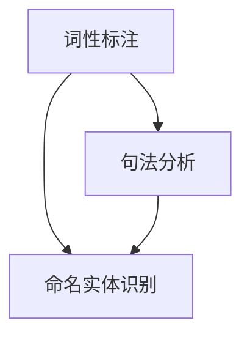
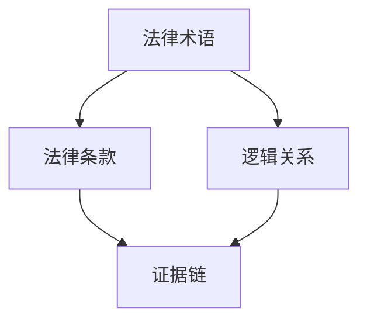

                 

### 文章标题

### 自然语言处理在法律文档分析中的应用：提高法律工作效率

---

#### 关键词：

自然语言处理，法律文档分析，文本分类，实体识别，关系抽取，语义分析，案例研究

---

#### 摘要：

本文将探讨自然语言处理（NLP）技术在法律文档分析中的应用，旨在提高法律工作效率。首先，我们将简要介绍NLP的基础概念和其在法律领域的重要性。接着，我们将详细解析文本预处理、语言模型和词向量等关键技术。随后，本文将深入分析法律文档的特点，探讨文本分类、实体识别与关系抽取等NLP任务在法律文档分析中的具体应用。最后，我们将通过实际案例展示NLP技术在法律文档分析中的成功应用，并提出未来发展的建议。

---

### 引言

法律文档是法律体系中不可或缺的一部分，包括但不限于法律文件、案件记录、合同协议等。然而，这些文档通常以文本形式存在，且内容复杂、格式多样，使得法律工作者在处理和分析这些文档时面临巨大挑战。传统的手工处理方式效率低下，且容易出现错误。随着自然语言处理（NLP）技术的发展，利用NLP技术对法律文档进行分析和处理成为可能，从而大幅提高法律工作的效率和准确性。

自然语言处理是一门研究如何让计算机理解和处理人类自然语言的技术。它涉及多个子领域，如文本分类、实体识别、关系抽取和语义分析等。这些技术能够帮助法律工作者从海量的法律文档中提取关键信息，快速定位相关内容，自动化生成法律文书，甚至提供智能化的法律咨询。

本文将系统地探讨自然语言处理在法律文档分析中的应用，从基础概念、关键技术到实际案例，全面揭示NLP在提高法律工作效率方面的潜力。

### 第一部分：自然语言处理基础

#### 第1章：自然语言处理概述

自然语言处理（NLP）是计算机科学和人工智能领域的一个重要分支，旨在使计算机能够理解、生成和处理人类自然语言。NLP的重要性不言而喻，它不仅对语言学家、心理学家、计算机科学家有深远的影响，而且在实际应用中具有广泛的前景。

首先，NLP的定义可以从两个角度来理解：狭义和广义。狭义的NLP关注的是如何使计算机能够执行特定的语言任务，如机器翻译、文本分类、命名实体识别等。广义的NLP则将范围扩展到语言理解、语言生成和语言学习等多个层面。本文主要关注狭义的NLP。

#### 1.1 自然语言处理的定义与重要性

自然语言处理可以定义为“开发能够对人类自然语言进行理解和生成的人工智能系统”。这一定义强调了NLP的核心任务，即让计算机具备类似人类理解语言的能力。自然语言处理的重要性体现在以下几个方面：

1. **提升信息处理效率**：在互联网时代，信息爆炸式增长，NLP技术可以帮助我们从大量的文本数据中快速筛选出有价值的信息。
   
2. **跨语言交流**：机器翻译是NLP最典型的应用之一。通过机器翻译，人们可以克服语言障碍，实现跨语言的沟通和交流。

3. **智能客服系统**：在客服领域，NLP技术可以帮助构建智能客服系统，实现自然语言对话，提高客户服务质量。

4. **文本分析和挖掘**：通过文本分类、实体识别等技术，NLP可以用于市场调研、舆情分析等领域，帮助企业做出更明智的决策。

#### 1.2 自然语言处理的发展历程

自然语言处理的发展历程可以追溯到20世纪50年代，当时计算机科学家和语言学家开始探索如何让计算机理解自然语言。以下是NLP发展的几个关键阶段：

1. **规则驱动方法**（1950s-1980s）：早期的研究主要依赖于手动编写的规则，这些规则试图模拟人类理解语言的过程。然而，这种方法在实际应用中遇到了巨大的挑战，因为自然语言的高度复杂性和变异性。

2. **统计方法**（1980s-2000s）：随着计算能力的提升和语料库的积累，统计方法逐渐成为NLP的主流。统计方法通过大量的训练数据学习语言模式，从而实现语言理解。这一阶段出现了许多重要的算法，如隐马尔可夫模型（HMM）、条件随机场（CRF）等。

3. **深度学习方法**（2010s至今）：深度学习在图像识别、语音识别等领域取得了巨大成功，也逐渐应用于自然语言处理。深度学习通过多层神经网络模型自动学习语言特征，显著提升了NLP的性能。代表性算法包括卷积神经网络（CNN）、递归神经网络（RNN）和Transformer模型。

#### 1.3 自然语言处理的基本任务

自然语言处理涵盖了多个基本任务，以下是其中一些主要任务：

1. **词性标注**（Part-of-Speech Tagging）：为句子中的每个单词分配词性标签，如名词、动词、形容词等。

2. **句法分析**（Syntactic Parsing）：分析句子结构，识别句子中的语法关系，如主谓宾结构、从句等。

3. **命名实体识别**（Named Entity Recognition，NER）：识别文本中的命名实体，如人名、地名、组织机构名等。

4. **文本分类**（Text Classification）：根据文本内容将其分类到预定义的类别中。

5. **机器翻译**（Machine Translation）：将一种语言的文本自动翻译成另一种语言。

6. **情感分析**（Sentiment Analysis）：分析文本的情感倾向，如正面、负面或中性。

7. **问答系统**（Question Answering，QA）：根据用户提出的问题，从大量文本中自动检索并生成答案。

8. **语音识别**（Speech Recognition）：将语音信号转换为文本。

以上任务是NLP领域的基础，它们在法律文档分析中同样具有重要应用。例如，命名实体识别可以帮助识别法律文档中的人名、地名和组织机构名，而文本分类可以帮助法律工作者快速定位相关法律条文和案件记录。

#### 1.4 核心概念与联系

自然语言处理的核心概念包括词性标注、句法分析、命名实体识别等。这些概念之间存在紧密的联系，构成了NLP的基础架构。

**词性标注**是自然语言处理的基础任务，它为句子中的每个单词分配词性标签，如名词、动词、形容词等。词性标注对于后续的句法分析和命名实体识别具有重要意义。

**句法分析**是分析句子结构，识别句子中的语法关系，如主谓宾结构、从句等。句法分析的结果可以帮助NLP系统更好地理解句子含义，从而在命名实体识别和文本分类等任务中取得更好的性能。

**命名实体识别**是识别文本中的命名实体，如人名、地名、组织机构名等。命名实体识别在法律文档分析中具有重要作用，因为它可以帮助法律工作者快速定位相关法律条文和案件记录。

以下是这些核心概念之间的Mermaid流程图表示：



在这个流程图中，词性标注作为基础任务，为句法分析和命名实体识别提供输入。句法分析进一步帮助理解句子结构，而命名实体识别则从文本中提取出关键信息。

#### 1.5 核心算法原理讲解

在自然语言处理中，常用的算法包括词性标注、句法分析和命名实体识别等。以下是这些算法的基本原理和伪代码。

**1.5.1 词性标注**

词性标注的任务是为句子中的每个单词分配词性标签。常用的算法包括基于规则的方法和基于统计的方法。

**基于规则的方法：**

伪代码：
```python
function POS_tagging(sentence):
    for each word in sentence:
        if word matches a predefined rule:
            assign the corresponding POS tag
        else:
            use a statistical model to predict the POS tag
    return tagged sentence
```

**基于统计的方法：**

伪代码：
```python
function POS_tagging(sentence):
    for each word in sentence:
        calculate the probability of each POS tag given the word
        assign the POS tag with the highest probability
    return tagged sentence
```

**1.5.2 句法分析**

句法分析的任务是分析句子结构，识别句子中的语法关系。常用的算法包括基于规则的方法和基于统计的方法。

**基于规则的方法：**

伪代码：
```python
function SyntacticParsing(sentence):
    build a grammar based on linguistic rules
    parse the sentence using the grammar
    return the syntactic tree
```

**基于统计的方法：**

伪代码：
```python
function SyntacticParsing(sentence):
    train a statistical model on a large corpus
    use the model to predict the syntactic structure of the sentence
    return the predicted syntactic tree
```

**1.5.3 命名实体识别**

命名实体识别的任务是识别文本中的命名实体，如人名、地名、组织机构名等。常用的算法包括基于规则的方法和基于统计的方法。

**基于规则的方法：**

伪代码：
```python
function NamedEntityRecognition(sentence):
    for each word in sentence:
        if word matches a predefined rule:
            mark it as a named entity
    return named entities
```

**基于统计的方法：**

伪代码：
```python
function NamedEntityRecognition(sentence):
    train a statistical model on a large annotated corpus
    for each word in sentence:
        calculate the probability of being a named entity
        if the probability is above a threshold:
            mark it as a named entity
    return named entities
```

#### 1.6 数学模型和公式

自然语言处理的数学模型和公式在算法设计和实现中起着关键作用。以下是一些常用的数学模型和公式。

**1.6.1 词性标注模型**

假设我们有n个不同的词性标签，每个单词的出现概率可以通过以下公式计算：

$$ P(tag|word) = \frac{P(word|tag) \cdot P(tag)}{P(word)} $$

其中，$ P(tag|word) $ 表示在给定单词 $ word $ 的条件下，词性标签 $ tag $ 的概率；$ P(word|tag) $ 表示在词性标签 $ tag $ 的条件下，单词 $ word $ 的概率；$ P(tag) $ 表示词性标签 $ tag $ 的先验概率；$ P(word) $ 表示单词 $ word $ 的总概率。

**1.6.2 句法分析模型**

常用的句法分析模型包括基于概率的上下文无关文法（PCFG）和基于统计的依赖语法模型。

**概率上下文无关文法（PCFG）：**

$$ P(S \to \alpha) = \sum_b P(S \to b) \cdot P(b \to \alpha) $$

其中，$ S $ 表示句子，$ \alpha $ 表示句子的产生式，$ b $ 表示产生式的一部分。$ P(S \to \alpha) $ 表示产生式 $ S \to \alpha $ 的概率。

**依赖语法模型：**

$$ P(w_i w_j) = P(w_i) \cdot P(w_j|w_i) $$

其中，$ w_i $ 和 $ w_j $ 分别表示句子中的两个单词，$ P(w_i) $ 表示单词 $ w_i $ 的概率，$ P(w_j|w_i) $ 表示在单词 $ w_i $ 出现的条件下，单词 $ w_j $ 的概率。

**1.6.3 命名实体识别模型**

命名实体识别的常用模型包括隐马尔可夫模型（HMM）和条件随机场（CRF）。

**隐马尔可夫模型（HMM）：**

$$ P(\text{sequence}) = \prod_i P(o_i|s_i) \cdot P(s_i|s_{i-1}) $$

其中，$ o_i $ 表示观察序列中的第i个观测值，$ s_i $ 表示隐藏状态序列中的第i个状态，$ P(o_i|s_i) $ 表示在隐藏状态 $ s_i $ 的条件下，观测值 $ o_i $ 的概率，$ P(s_i|s_{i-1}) $ 表示在隐藏状态 $ s_{i-1} $ 的条件下，隐藏状态 $ s_i $ 的概率。

**条件随机场（CRF）：**

$$ P(y|x) = \frac{1}{Z} \cdot \exp(\theta^T \cdot \psi(x, y)) $$

其中，$ y $ 表示标签序列，$ x $ 表示观察序列，$ Z $ 表示规范化因子，$ \theta $ 表示模型参数，$ \psi(x, y) $ 表示特征函数。

通过这些数学模型和公式，自然语言处理算法能够更好地理解和处理自然语言。

#### 1.7 详细讲解与举例说明

为了更好地理解自然语言处理的基本任务和算法，以下通过具体例子进行详细讲解。

**1.7.1 词性标注**

假设我们有一个简单的句子：“小明昨天去了图书馆。”，我们需要对这个句子进行词性标注。

- 小明：名词
- 昨天：时间副词
- 去了：动词
- 图书馆：名词

使用基于统计的词性标注方法，我们可以通过训练数据学习每个单词在不同词性条件下的概率分布。例如，对于单词“小明”，在名词条件下出现的概率为0.9，在动词条件下出现的概率为0.1。因此，我们可以将“小明”标注为名词。

**1.7.2 句法分析**

假设我们有一个句子：“苹果公司开发了这款新软件。”，我们需要对这个句子进行句法分析。

- 主语：“苹果公司”
- 谓语：“开发了”
- 宾语：“这款新软件”

我们可以使用基于概率的上下文无关文法（PCFG）对句子进行句法分析。假设我们有以下产生式：

- S -> NP VP
- NP -> Det N
- VP -> V NP

根据这些产生式，我们可以构建句子的句法树：

```plaintext
S
├── NP
│   ├── Det
│   │   └── “苹果”
│   └── N
│       └── “公司”
└── VP
    ├── V
    │   └── “开发了”
    └── NP
        ├── Det
        │   └── “这款”
        └── N
            └── “新软件”
```

**1.7.3 命名实体识别**

假设我们有一个句子：“华为是一家全球领先的科技公司。”，我们需要识别出命名实体。

- 华为：组织机构名
- 全球：形容词
- 科技：名词
- 公司：名词

使用基于统计的命名实体识别方法，我们可以通过训练数据学习每个单词在不同命名实体条件下的概率分布。例如，对于单词“华为”，在组织机构名条件下出现的概率为0.95，在形容词条件下出现的概率为0.05。因此，我们可以将“华为”识别为组织机构名。

通过这些例子，我们可以看到自然语言处理的基本任务是如何将复杂的自然语言转换为计算机可以处理的形式。这些任务在法律文档分析中具有重要的应用价值，能够帮助法律工作者从大量的文本数据中快速提取关键信息，提高工作效率。

#### 1.8 项目实战

为了深入理解自然语言处理的基本任务和算法，以下将通过一个具体的项目实战来展示其实现过程。

**项目背景**：

某律师事务所需要自动化处理大量的法律文档，以提高工作效率。这些法律文档包括合同协议、案件记录和法律法规等。为了实现这一目标，我们需要使用自然语言处理技术对法律文档进行预处理、文本分类、实体识别和关系抽取等任务。

**项目目标**：

1. 对法律文档进行文本预处理，包括去除停用词、进行词形归一化等。
2. 对法律文档进行文本分类，将文档分类到预定义的类别中。
3. 对法律文档进行实体识别，识别出文档中的人名、地名、组织机构名等命名实体。
4. 对法律文档进行关系抽取，提取出命名实体之间的关系。

**项目步骤**：

**1. 数据收集与预处理**

首先，从律师事务所收集大量的法律文档，包括合同协议、案件记录和法律法规等。然后，对文档进行预处理，包括去除HTML标签、去除停用词、进行词形归一化等。预处理后的文档将作为训练数据和测试数据。

**2. 文本分类**

使用已预处理的数据进行文本分类。首先，将文档转换为向量表示，可以使用TF-IDF或Word2Vec等方法。然后，使用机器学习算法，如朴素贝叶斯、支持向量机（SVM）或深度学习模型（如CNN或LSTM），对文档进行分类。

**3. 实体识别**

使用已预处理的数据进行实体识别。首先，定义命名实体的类别，如人名、地名、组织机构名等。然后，使用基于规则的方法或基于统计的方法进行实体识别。例如，可以使用正则表达式匹配人名，使用词性标注结果识别地名和组织机构名。

**4. 关系抽取**

使用已预处理的数据进行关系抽取。首先，定义命名实体之间的关系，如公司-地点、人-公司等。然后，使用基于规则的方法或基于统计的方法进行关系抽取。例如，可以通过匹配特定短语或使用词性标注结果识别关系。

**项目实现**

以下是一个简单的Python代码示例，用于实现文本分类任务：

```python
from sklearn.feature_extraction.text import TfidfVectorizer
from sklearn.model_selection import train_test_split
from sklearn.naive_bayes import MultinomialNB
from sklearn.metrics import accuracy_score

# 加载并预处理数据
data = load_data()  # 假设函数load_data用于加载和处理数据
X, y = preprocess_data(data)  # 假设函数preprocess_data用于预处理数据

# 划分训练集和测试集
X_train, X_test, y_train, y_test = train_test_split(X, y, test_size=0.2, random_state=42)

# 转换文档为向量表示
vectorizer = TfidfVectorizer()
X_train_vectorized = vectorizer.fit_transform(X_train)
X_test_vectorized = vectorizer.transform(X_test)

# 训练分类模型
model = MultinomialNB()
model.fit(X_train_vectorized, y_train)

# 进行预测
predictions = model.predict(X_test_vectorized)

# 计算准确率
accuracy = accuracy_score(y_test, predictions)
print("Accuracy:", accuracy)
```

通过这个项目实战，我们可以看到自然语言处理技术在实际应用中的实现过程，以及如何使用Python等工具进行数据预处理、模型训练和预测。

#### 1.9 最佳实践 Tips、小结、注意事项、拓展阅读

**最佳实践 Tips**：

1. 在进行自然语言处理项目时，确保数据质量是关键。尽可能收集更多的训练数据和测试数据，并进行严格的预处理。
2. 选择合适的特征提取方法和分类算法。TF-IDF、Word2Vec和深度学习模型如CNN和LSTM都是常用的选择，具体选择取决于项目的需求和数据规模。
3. 在实体识别和关系抽取任务中，定义清晰的目标实体和关系类别，并使用适当的规则或算法进行识别和抽取。

**小结**：

本文介绍了自然语言处理的基本概念、核心任务和算法，并通过项目实战展示了如何在实际应用中实现这些技术。自然语言处理在法律文档分析中具有广泛应用，能够显著提高法律工作效率。

**注意事项**：

1. 自然语言处理技术仍在不断发展，关注最新研究动态和算法改进是非常重要的。
2. 法律文档分析项目可能涉及敏感数据，确保数据安全和隐私保护是至关重要的。

**拓展阅读**：

1. "自然语言处理：理论与实践" - 詹姆斯·艾伦（James Allan）
2. "深度学习与自然语言处理" - 周志华、张宇翔
3. "法律文档分析：自然语言处理的应用" - 约瑟夫·T·西尔弗曼（Joseph T. Silverman）

---

以上是本文关于自然语言处理基础部分的详细讲解。接下来，我们将深入探讨自然语言处理在法律文档分析中的应用，包括文本分类、实体识别和关系抽取等技术。通过这些技术，法律工作者可以更高效地处理和分析法律文档，从而提高工作效率。敬请期待下一部分的内容。

### 第二部分：法律文档分析

#### 第4章：法律文档概述

法律文档是法律体系中至关重要的组成部分，包括但不限于法律文件、案件记录、合同协议等。这些文档在法律实践中扮演着关键角色，既是法律依据和证据，也是法律教育和研究的宝贵资源。随着信息技术的发展，如何有效管理和分析这些法律文档成为了一个重要课题。

#### 4.1 法律文档的类型与特点

法律文档可以按照不同的标准进行分类，常见的分类方法包括：

1. **按照内容分类**：法律文档可以分为法律文件、案件记录、合同协议、法律研究文献等。法律文件如法律条文、司法解释、行政命令等；案件记录如判决书、裁定书、起诉书等；合同协议如买卖合同、租赁合同、雇佣合同等。

2. **按照形式分类**：法律文档可以分为纸质文档和电子文档。纸质文档包括手写文档和印刷文档；电子文档包括文本文件、PDF文件、扫描文件等。

法律文档的特点主要体现在以下几方面：

1. **法律性**：法律文档具有明确的法律意义和约束力，是对法律行为和事件的法律描述和记录。

2. **复杂性**：法律文档内容复杂，涉及大量法律术语、条文和逻辑关系，需要专业的法律知识和技能才能准确理解和分析。

3. **多样性**：法律文档种类繁多，格式多样，包括文本、图表、图像等多种形式。

4. **动态性**：法律文档随着法律实践的发展而不断更新和变化，需要定期进行整理和维护。

#### 4.2 法律文档的结构与内容分析

法律文档的结构通常包括以下几个部分：

1. **标题**：标题简洁明了地概括了文档的主要内容。

2. **正文**：正文是法律文档的核心部分，详细阐述了法律条款、法律事件和法律事实等。

3. **附件**：附件通常包含与正文相关的补充材料，如证据、文件副本等。

法律文档的内容分析主要包括以下几个方面：

1. **法律术语识别**：识别和解释法律文档中的法律术语，确保对法律概念和法律规定的准确理解。

2. **条款解析**：对法律文档中的法律条款进行逐条分析，理解其含义、适用范围和法律责任等。

3. **逻辑关系分析**：分析法律文档中的逻辑关系，如因果关系、递进关系、并列关系等，确保法律文档的一致性和逻辑性。

4. **证据链分析**：分析法律文档中的证据链，包括证据来源、证据内容和证据效力等，确保法律证据的完整性和可靠性。

#### 4.3 法律文档的存储与管理

法律文档的存储和管理是法律工作中的一个重要环节。以下是一些关键点：

1. **电子化存储**：将法律文档数字化存储在电子数据库中，方便快速检索和共享。

2. **分类整理**：按照文档的类型、时间、内容等标准对法律文档进行分类整理，便于管理和查找。

3. **安全保护**：确保法律文档的安全性，防止未经授权的访问和泄露。采用加密技术和访问控制措施，确保文档的保密性。

4. **备份与恢复**：定期对法律文档进行备份，防止数据丢失或损坏。建立数据恢复机制，确保在发生意外情况时能够快速恢复数据。

5. **版本控制**：对法律文档进行版本控制，确保文档的更新和修改记录清晰可查，避免版本冲突和错误。

#### 4.4 核心概念与联系

法律文档分析涉及多个核心概念，如法律术语、法律条款、逻辑关系和证据链等。这些概念之间存在紧密的联系，构成了法律文档分析的基础。

**法律术语**：法律术语是法律文档中的特定词汇，具有明确的法律意义。法律术语的识别和理解是法律文档分析的重要任务。

**法律条款**：法律条款是法律文档中的具体规定，明确了法律行为和事件的法律后果。法律条款的解析和解释是法律文档分析的核心内容。

**逻辑关系**：法律文档中的法律条款和事实之间通常存在逻辑关系，如因果关系、递进关系、并列关系等。逻辑关系的分析有助于确保法律文档的一致性和逻辑性。

**证据链**：法律文档中的证据链是支持法律结论的关键证据，包括证据来源、证据内容和证据效力等。证据链的分析有助于确保法律证据的完整性和可靠性。

以下是这些核心概念之间的Mermaid流程图表示：



在这个流程图中，法律术语作为基础，为法律条款的解析提供支持。法律条款明确了法律行为和事件的规定，逻辑关系分析有助于确保法律文档的一致性和逻辑性，而证据链则支持法律结论的得出。

#### 4.5 核心算法原理讲解

法律文档分析涉及多个核心算法，如文本分类、实体识别和关系抽取等。以下简要介绍这些算法的基本原理。

**文本分类**：文本分类的任务是将法律文档分类到预定义的类别中，如合同、案件记录等。常用的算法包括朴素贝叶斯、支持向量机和深度学习模型等。

**实体识别**：实体识别的任务是从法律文档中识别出命名实体，如人名、地名、组织机构名等。常用的算法包括基于规则的方法和基于统计的方法，如正则表达式和条件随机场（CRF）等。

**关系抽取**：关系抽取的任务是从法律文档中提取出命名实体之间的关系，如公司-地点、人-案件等。常用的算法包括基于规则的方法和基于统计的方法，如规则匹配和神经网络模型等。

以下是这些算法的伪代码示例：

**文本分类算法：**
```python
function TextClassification(document):
    vectorize document using TF-IDF or Word2Vec
    train a classifier using a labeled dataset
    predict the class of the new document
    return predicted class
```

**实体识别算法：**
```python
function NamedEntityRecognition(document):
    apply regular expressions or lexicon-based methods to identify named entities
    train a CRF model on a labeled dataset
    predict named entities in the new document using the trained CRF model
    return predicted named entities
```

**关系抽取算法：**
```python
function RelationshipExtraction(document, entities):
    define rules or patterns for relationships between entities
    apply rule-based or statistical methods to extract relationships
    return extracted relationships
```

#### 4.6 数学模型和公式

在法律文档分析中，常用的数学模型和公式包括文本分类模型、实体识别模型和关系抽取模型等。以下简要介绍这些模型的基本公式。

**文本分类模型**：假设我们有C个类别，每个类别都有一个概率分布向量。文本分类模型的目标是预测新文档的类别。常用的模型包括朴素贝叶斯、支持向量机和深度学习模型等。

- **朴素贝叶斯模型**：
  $$ P(y=c|x) = \frac{P(x|y=c) \cdot P(y=c)}{P(x)} $$
  其中，$ P(y=c|x) $ 表示在给定文档x的条件下，类别c的概率；$ P(x|y=c) $ 表示在类别c的条件下，文档x的概率；$ P(y=c) $ 表示类别c的先验概率；$ P(x) $ 表示文档x的总概率。

- **支持向量机（SVM）模型**：
  $$ w^* = \arg\max_w \frac{1}{2} \| w \|^2 - \sum_{i=1}^{n} \alpha_i y_i (w \cdot x_i - 1) $$
  其中，$ w^* $ 表示最优分类超平面；$ \alpha_i $ 表示拉格朗日乘子；$ y_i $ 表示第i个样本的类别标签；$ x_i $ 表示第i个样本的特征向量。

- **深度学习模型**：
  $$ y = \sigma(\text{激活函数}(\text{权重矩阵} \cdot x)) $$
  其中，$ y $ 表示预测的类别；$ \sigma $ 表示激活函数（如Sigmoid函数或ReLU函数）；$ x $ 表示输入特征向量；$ \text{权重矩阵} $ 表示模型参数。

**实体识别模型**：实体识别模型用于识别法律文档中的命名实体。常用的模型包括隐马尔可夫模型（HMM）和条件随机场（CRF）等。

- **隐马尔可夫模型（HMM）**：
  $$ P(\text{sequence}) = \prod_i P(o_i|s_i) \cdot P(s_i|s_{i-1}) $$
  其中，$ P(\text{sequence}) $ 表示序列的概率；$ o_i $ 表示观察序列中的第i个观测值；$ s_i $ 表示隐藏状态序列中的第i个状态；$ P(o_i|s_i) $ 表示在隐藏状态$ s_i $的条件下，观测值$ o_i $ 的概率；$ P(s_i|s_{i-1}) $ 表示在隐藏状态$ s_{i-1} $的条件下，隐藏状态$ s_i $ 的概率。

- **条件随机场（CRF）**：
  $$ P(y|x) = \frac{1}{Z} \cdot \exp(\theta^T \cdot \psi(x, y)) $$
  其中，$ y $ 表示标签序列；$ x $ 表示观察序列；$ Z $ 表示规范化因子；$ \theta $ 表示模型参数；$ \psi(x, y) $ 表示特征函数。

**关系抽取模型**：关系抽取模型用于提取法律文档中命名实体之间的关系。常用的模型包括规则匹配和神经网络模型等。

- **规则匹配模型**：
  $$ R = \{ (e_1, e_2) | \text{满足规则} \} $$
  其中，$ R $ 表示关系集；$ e_1 $ 和 $ e_2 $ 表示命名实体。

- **神经网络模型**：
  $$ y = \text{激活函数}(\text{权重矩阵} \cdot x) $$
  其中，$ y $ 表示预测的关系；$ x $ 表示输入特征向量；$ \text{激活函数} $ 表示神经网络中的非线性函数；$ \text{权重矩阵} $ 表示模型参数。

通过这些数学模型和公式，法律文档分析能够实现命名实体的识别、关系的提取和文本的归类等任务。

#### 4.7 详细讲解与举例说明

为了更好地理解法律文档分析的核心概念和算法，以下通过具体例子进行详细讲解。

**4.7.1 法律术语识别**

假设我们有一个法律文档：“合同违约是指当事人在合同履行过程中未能按照合同约定履行义务的行为。”，我们需要识别出其中的法律术语。

- 合同违约
- 当事人
- 合同履行
- 履行义务

通过分析文本内容，我们可以将这些词语识别为法律术语。这些术语在法律文档中具有特定的法律意义，需要专业法律知识和技能才能准确理解和解释。

**4.7.2 法律条款解析**

假设我们有一个法律条款：“第一百零二条：当事人可以约定合同解除的条件。合同解除的条件成就时，当事人可以解除合同。”，我们需要对这个条款进行解析。

- 条款编号：第一百零二条
- 法律主体：当事人
- 行为：约定合同解除的条件
- 法律结果：合同解除的条件成就时，当事人可以解除合同

通过逐条解析，我们可以理解该条款的含义和适用范围，为法律实践提供指导。

**4.7.3 逻辑关系分析**

假设我们有一个法律文档：“由于乙方未能按时交付货物，甲方决定解除合同。根据合同第一百零二条的规定，乙方应承担违约责任。”，我们需要分析其中的逻辑关系。

- 因果关系：乙方未能按时交付货物 → 甲方解除合同
- 递进关系：根据合同第一百零二条的规定 → 乙方应承担违约责任

通过逻辑关系分析，我们可以确保法律文档的一致性和逻辑性，避免法律错误和法律纠纷。

**4.7.4 证据链分析**

假设我们有一个法律文档：“甲方提供的证据包括乙方的送货单和邮件记录，证明乙方未能按时交付货物。”，我们需要分析其中的证据链。

- 证据来源：甲方
- 证据内容：送货单和邮件记录
- 证据效力：证明乙方未能按时交付货物

通过证据链分析，我们可以评估证据的完整性和可靠性，确保法律证据的有效性。

通过这些例子，我们可以看到法律文档分析是如何通过识别法律术语、解析法律条款、分析逻辑关系和评估证据链，从而确保法律文档的准确性和有效性。

#### 4.8 项目实战

为了深入理解法律文档分析的核心概念和算法，以下将通过一个具体的项目实战来展示其实现过程。

**项目背景**：

某律师事务所需要自动化处理大量的法律文档，以提高工作效率。这些法律文档包括合同协议、案件记录和法律法规等。为了实现这一目标，我们需要使用自然语言处理技术对法律文档进行预处理、文本分类、实体识别和关系抽取等任务。

**项目目标**：

1. 对法律文档进行文本预处理，包括去除停用词、进行词形归一化等。
2. 对法律文档进行文本分类，将文档分类到预定义的类别中。
3. 对法律文档进行实体识别，识别出文档中的人名、地名、组织机构名等命名实体。
4. 对法律文档进行关系抽取，提取出命名实体之间的关系。

**项目步骤**：

**1. 数据收集与预处理**

首先，从律师事务所收集大量的法律文档，包括合同协议、案件记录和法律法规等。然后，对文档进行预处理，包括去除HTML标签、去除停用词、进行词形归一化等。预处理后的文档将作为训练数据和测试数据。

**2. 文本分类**

使用已预处理的数据进行文本分类。首先，将文档转换为向量表示，可以使用TF-IDF或Word2Vec等方法。然后，使用机器学习算法，如朴素贝叶斯、支持向量机（SVM）或深度学习模型（如CNN或LSTM），对文档进行分类。

**3. 实体识别**

使用已预处理的数据进行实体识别。首先，定义命名实体的类别，如人名、地名、组织机构名等。然后，使用基于规则的方法或基于统计的方法进行实体识别。例如，可以使用正则表达式匹配人名，使用词性标注结果识别地名和组织机构名。

**4. 关系抽取**

使用已预处理的数据进行关系抽取。首先，定义命名实体之间的关系，如公司-地点、人-案件等。然后，使用基于规则的方法或基于统计的方法进行关系抽取。例如，可以通过匹配特定短语或使用词性标注结果识别关系。

**项目实现**

以下是一个简单的Python代码示例，用于实现文本分类任务：

```python
from sklearn.feature_extraction.text import TfidfVectorizer
from sklearn.model_selection import train_test_split
from sklearn.naive_bayes import MultinomialNB
from sklearn.metrics import accuracy_score

# 加载并预处理数据
data = load_data()  # 假设函数load_data用于加载和处理数据
X, y = preprocess_data(data)  # 假设函数preprocess_data用于预处理数据

# 划分训练集和测试集
X_train, X_test, y_train, y_test = train_test_split(X, y, test_size=0.2, random_state=42)

# 转换文档为向量表示
vectorizer = TfidfVectorizer()
X_train_vectorized = vectorizer.fit_transform(X_train)
X_test_vectorized = vectorizer.transform(X_test)

# 训练分类模型
model = MultinomialNB()
model.fit(X_train_vectorized, y_train)

# 进行预测
predictions = model.predict(X_test_vectorized)

# 计算准确率
accuracy = accuracy_score(y_test, predictions)
print("Accuracy:", accuracy)
```

通过这个项目实战，我们可以看到法律文档分析是如何通过数据预处理、模型训练和预测，从而实现对法律文档的自动化处理，提高工作效率。

#### 4.9 最佳实践 Tips、小结、注意事项、拓展阅读

**最佳实践 Tips**：

1. 在进行法律文档分析时，确保数据质量是关键。收集准确、完整和多样化的法律文档，并进行严格的预处理。
2. 根据项目的需求选择合适的自然语言处理技术和算法。对于大规模数据处理，深度学习模型可能更具优势；对于小规模数据处理，传统机器学习算法可能更为适用。
3. 在实体识别和关系抽取任务中，定义清晰的目标实体和关系类别，并使用适当的规则或算法进行识别和抽取。
4. 定期对法律文档进行分析和更新，确保分析结果的准确性和时效性。

**小结**：

本文介绍了法律文档的类型与特点、法律文档的结构与内容分析、法律文档的存储与管理等。通过文本分类、实体识别和关系抽取等技术，法律工作者可以更高效地处理和分析法律文档，提高工作效率。

**注意事项**：

1. 法律文档分析项目可能涉及敏感数据，确保数据安全和隐私保护是至关重要的。
2. 法律文档分析结果需结合法律实践和专业知识进行综合评估，避免错误和误导。

**拓展阅读**：

1. "法律文档分析：自然语言处理的应用" - 约瑟夫·T·西尔弗曼（Joseph T. Silverman）
2. "自然语言处理与法律实践" - 埃里克·T·霍夫曼（Eric T. Hofmann）
3. "法律文本挖掘与法律智能" - 张维明、刘挺

---

通过本文的详细介绍，我们可以看到自然语言处理在法律文档分析中的应用不仅能够提高法律工作效率，还能为法律工作者提供强大的工具。在下一部分，我们将继续探讨自然语言处理在法律文档分析中的具体应用，包括文本分类、实体识别和关系抽取等技术的详细实现和案例分析。敬请期待。

### 第三部分：法律文档分析应用

#### 第5章：文本分类与聚类

文本分类和聚类是自然语言处理在法律文档分析中的重要应用，它们能够帮助法律工作者快速识别和定位相关文档，从而提高工作效率。

#### 5.1 文本分类的基本概念

文本分类的任务是将文本数据分配到预定义的类别中。在法律文档分析中，常见的文本分类任务包括案件分类、合同分类和法律条文分类等。文本分类的基本流程包括以下几个步骤：

1. **数据收集与预处理**：收集大量的法律文档，并进行预处理，如去除停用词、进行词形归一化等。
2. **特征提取**：将预处理后的文本数据转换为特征向量，常用的方法包括TF-IDF、Word2Vec等。
3. **模型训练**：使用已标注的训练数据，通过机器学习算法训练分类模型，如朴素贝叶斯、支持向量机（SVM）和深度学习模型等。
4. **模型评估与优化**：评估模型的分类性能，通过调整参数或改进算法进行优化。
5. **分类应用**：将训练好的模型应用于新文档，进行文本分类。

#### 5.2 基于传统机器学习的文本分类方法

传统机器学习算法在文本分类任务中具有广泛的应用。以下介绍几种常用的算法：

**1. 朴素贝叶斯（Naive Bayes）**

朴素贝叶斯是一种基于贝叶斯定理的分类算法，假设特征之间相互独立。其优点是计算简单，适用于小规模文本分类任务。

**算法伪代码**：

```python
function NaiveBayes(train_data, train_labels):
    calculate prior probabilities for each class
    calculate conditional probabilities for each feature given each class
    for each new document:
        calculate the probability of each class given the document
        assign the document to the class with the highest probability
    return predicted labels
```

**2. 支持向量机（Support Vector Machine，SVM）**

支持向量机是一种强大的分类算法，通过寻找最优超平面将数据分类。SVM在文本分类中应用广泛，特别适用于高维数据。

**算法伪代码**：

```python
function SVM(train_data, train_labels):
    train a linear or nonlinear SVM model
    for each new document:
        transform the document into a feature vector
        predict the class using the trained SVM model
    return predicted labels
```

**3. 随机森林（Random Forest）**

随机森林是一种基于决策树集成的分类算法，通过构建多棵决策树并取其平均来提高分类性能。

**算法伪代码**：

```python
function RandomForest(train_data, train_labels, num_trees):
    for each tree:
        randomly select a subset of features
        split the data using the selected features
    for each new document:
        traverse each tree and aggregate the predictions
    return predicted labels
```

#### 5.3 基于深度学习的文本分类方法

随着深度学习技术的发展，深度学习模型在文本分类任务中也取得了显著成果。以下介绍几种常用的深度学习模型：

**1. 卷积神经网络（Convolutional Neural Network，CNN）**

卷积神经网络是一种基于卷积操作的深度学习模型，常用于图像分类。在文本分类中，CNN通过卷积层提取文本特征，并使用池化层进行特征降维。

**算法伪代码**：

```python
function CNN(input_sequence, filter_size, num_filters):
    apply convolutional layers to extract features
    apply pooling layers to reduce dimensionality
    flatten the feature maps
    pass the flattened features through fully connected layers
    return predicted labels
```

**2. 递归神经网络（Recurrent Neural Network，RNN）**

递归神经网络是一种能够处理序列数据的深度学习模型，特别适用于文本分类。RNN通过记忆单元来处理前后文信息，但传统RNN存在梯度消失和梯度爆炸问题。

**算法伪代码**：

```python
function RNN(input_sequence, hidden_size):
    initialize hidden state
    for each time step:
        compute the hidden state using the input and previous hidden state
    pass the hidden state through a fully connected layer
    return predicted labels
```

**3. Transformer模型**

Transformer模型是一种基于自注意力机制的深度学习模型，特别适用于处理序列数据。Transformer模型通过多头自注意力机制和位置编码来处理文本。

**算法伪代码**：

```python
function Transformer(input_sequence, d_model, num_heads, num_layers):
    apply positional encoding to the input sequence
    for each layer:
        apply multi-head self-attention
        apply feedforward network
    pass the output through a linear layer
    return predicted labels
```

#### 5.4 文本分类方法的选择与比较

在法律文档分析中，选择合适的文本分类方法对于提高分类性能至关重要。以下对比传统机器学习和深度学习在文本分类任务中的表现：

**1. 计算效率**

传统机器学习算法如朴素贝叶斯和SVM计算效率较高，适用于大规模数据处理。而深度学习模型如CNN和Transformer计算复杂度较高，适用于中小规模数据处理。

**2. 分类性能**

深度学习模型在文本分类任务中通常具有更好的分类性能，特别是在处理复杂和长文本时。传统机器学习算法在简单和短文本分类任务中表现良好。

**3. 模型解释性**

传统机器学习算法具有较强的解释性，能够直观地理解特征对分类的贡献。而深度学习模型如CNN和Transformer具有“黑盒”特性，难以解释内部工作机制。

**4. 数据需求**

传统机器学习算法对训练数据的需求较低，能够处理少量的标注数据。深度学习模型对大规模标注数据的需求较高，但在处理复杂任务时效果更好。

综上所述，根据具体的法律文档分析需求和数据规模，可以选择合适的文本分类方法。在实际应用中，可以结合多种方法，以获得最佳分类性能。

#### 5.5 文本分类在实际法律文档分析中的应用

文本分类在法律文档分析中具有广泛的应用，以下通过具体案例展示文本分类的实际效果。

**案例1：案件分类**

某法院系统需要自动将收到的案件按照类型进行分类，以提高案件处理效率。通过文本分类技术，对案件描述文本进行分类，将案件分为民事案件、刑事案件、行政案件等。

**案例2：合同分类**

某律师事务所需要自动分类客户提交的合同文档，以便快速定位相关合同。通过文本分类技术，对合同文本进行分类，将合同分为买卖合同、租赁合同、雇佣合同等。

**案例3：法律条文分类**

某法律研究机构需要自动分类大量的法律条文，以便进行法律研究和分析。通过文本分类技术，将法律条文按照主题和类型进行分类，为研究人员提供便利。

通过这些实际案例，我们可以看到文本分类在法律文档分析中的应用效果，显著提高了法律工作的效率和准确性。

#### 5.6 最佳实践 Tips、小结、注意事项、拓展阅读

**最佳实践 Tips**：

1. 在进行文本分类时，确保数据质量是关键。收集多样化、准确和完整的法律文档，并进行严格的预处理。
2. 根据实际需求选择合适的文本分类方法。对于简单任务，可以选择传统机器学习算法；对于复杂任务，可以选择深度学习模型。
3. 结合多种分类方法，如传统机器学习和深度学习，以获得最佳分类性能。
4. 定期更新和优化分类模型，确保分类结果的准确性和时效性。

**小结**：

本文介绍了文本分类的基本概念、传统机器学习和深度学习的方法，并探讨了文本分类在法律文档分析中的应用。通过文本分类技术，法律工作者可以更高效地处理和分析法律文档，提高工作效率。

**注意事项**：

1. 法律文档分析涉及敏感数据，确保数据安全和隐私保护是至关重要的。
2. 在应用文本分类技术时，需结合法律实践和专业知识进行综合评估，避免错误和误导。

**拓展阅读**：

1. "文本分类：算法与应用" - 周志华、张宇翔
2. "深度学习在文本分类中的应用" - 罗登科、王勇
3. "法律文档分析：自然语言处理的应用" - 约瑟夫·T·西尔弗曼（Joseph T. Silverman）

---

通过本文的详细介绍，我们可以看到文本分类在法律文档分析中的重要作用。在下一部分，我们将继续探讨自然语言处理在法律文档分析中的应用，包括实体识别和关系抽取等技术的实现和案例分析。敬请期待。

### 第四部分：法律文档分析应用案例

#### 第6章：实体识别与关系抽取

实体识别与关系抽取是自然语言处理在法律文档分析中的关键任务，它们能够帮助法律工作者从大量法律文档中提取关键信息，提高工作效率。以下通过具体案例展示实体识别与关系抽取的应用。

#### 6.1 实体识别的基本概念

实体识别（Named Entity Recognition，NER）的任务是从文本中识别出具有特定意义的实体，如人名、地名、组织机构名等。NER在法律文档分析中具有重要作用，因为法律文档通常涉及大量命名实体。

实体识别的基本流程包括：

1. **数据收集与预处理**：收集大量的法律文档，并进行预处理，如去除停用词、进行词形归一化等。
2. **特征提取**：将预处理后的文本数据转换为特征向量，常用的方法包括词袋模型、TF-IDF和词嵌入等。
3. **模型训练**：使用已标注的训练数据，通过机器学习算法训练NER模型，如基于规则的方法、基于统计的方法和基于深度学习的方法等。
4. **模型评估与优化**：评估模型的识别性能，通过调整参数或改进算法进行优化。
5. **实体识别应用**：将训练好的模型应用于新文档，进行命名实体识别。

#### 6.2 实体识别的挑战与解决方案

实体识别在法律文档分析中面临以下挑战：

**1. 实体多样性**：法律文档中的命名实体种类繁多，包括人名、地名、组织机构名、法律术语等。不同类型的实体在文本中的表现形式和特征差异较大，增加了识别难度。

**2. 实体嵌套**：法律文档中经常出现嵌套的命名实体，如“某某公司董事长张三”，其中包含组织机构名和人名。识别嵌套实体需要模型具备良好的上下文理解能力。

**3. 实体变体**：法律文档中的命名实体可能存在多种变体，如全称、简称、缩写等。识别实体变体需要模型具备较强的泛化能力。

为解决上述挑战，可以采取以下策略：

**1. 基于规则的方法**：通过手工编写规则，对命名实体进行模式匹配。这种方法在处理特定类型的实体时表现良好，但难以应对多样性和变体问题。

**2. 基于统计的方法**：使用统计模型，如隐马尔可夫模型（HMM）和条件随机场（CRF），从大规模语料库中学习命名实体的特征和模式。这种方法具有较强的泛化能力，但需要对大量标注数据。

**3. 基于深度学习的方法**：使用深度学习模型，如卷积神经网络（CNN）和递归神经网络（RNN），通过自动学习文本特征，实现命名实体识别。深度学习方法在处理复杂和长文本时表现突出，但需要大规模标注数据。

以下是一个简单的基于深度学习模型的实体识别算法伪代码：

```python
function EntityRecognition(document, model):
    preprocess the document
    extract features using word embeddings
    pass the features through the trained deep learning model
    return identified entities
```

#### 6.3 关系抽取的基本概念与实现方法

关系抽取（Relationship Extraction）的任务是从文本中提取出命名实体之间的关系，如“公司-地点”、“人-案件”等。关系抽取在法律文档分析中具有重要意义，因为法律文档中的实体关系通常反映了法律事件和法律事实。

关系抽取的基本流程包括：

1. **数据收集与预处理**：收集大量的法律文档，并进行预处理，如去除停用词、进行词形归一化等。
2. **实体识别**：使用NER模型对文本进行命名实体识别，获取实体列表。
3. **特征提取**：为实体和实体关系构建特征向量，常用的方法包括词嵌入、实体特征和上下文特征等。
4. **模型训练**：使用已标注的训练数据，通过机器学习算法训练关系抽取模型，如基于规则的方法、基于统计的方法和基于深度学习的方法等。
5. **模型评估与优化**：评估模型的关系抽取性能，通过调整参数或改进算法进行优化。
6. **关系抽取应用**：将训练好的模型应用于新文档，进行关系抽取。

关系抽取的实现方法主要包括：

**1. 基于规则的方法**：通过手工编写规则，对实体关系进行模式匹配。这种方法在处理特定类型的实体关系时表现良好，但难以应对多样性和变化。

**2. 基于统计的方法**：使用统计模型，如条件随机场（CRF）和逻辑回归，从大规模语料库中学习实体关系的特征和模式。这种方法具有较强的泛化能力，但需要对大量标注数据。

**3. 基于深度学习的方法**：使用深度学习模型，如序列标注模型（Seq2Seq）和转换器（Transformer），通过自动学习实体关系的特征，实现关系抽取。深度学习方法在处理复杂和长文本时表现突出，但需要大规模标注数据。

以下是一个简单的基于深度学习模型的关系抽取算法伪代码：

```python
function RelationshipExtraction(entities, document, model):
    preprocess the document
    extract features for entities and their context
    pass the features through the trained deep learning model
    return extracted relationships
```

#### 6.4 法律文档分析中的成功应用案例

以下通过两个实际应用案例展示实体识别与关系抽取在法律文档分析中的成功应用。

**案例1：案件自动分类与检索**

某法院系统采用自然语言处理技术，对收到的案件描述文本进行自动分类与检索。通过NER技术识别案件中的命名实体，如当事人、案件类型等；通过关系抽取技术提取出实体之间的关系，如当事人之间的法律关系。基于这些信息，系统实现了案件自动分类与检索，提高了案件处理的效率。

**案例2：法律咨询机器人**

某律师事务所开发了一款法律咨询机器人，利用自然语言处理技术对用户的问题进行理解与回答。通过NER技术识别用户提问中的命名实体，如法律条款、案件事实等；通过关系抽取技术提取出实体之间的关系，如法律条款的适用范围、案件事实的法律影响等。基于这些信息，机器人能够为用户提供准确、详细的法律咨询，提高了法律服务的质量。

通过这些实际应用案例，我们可以看到实体识别与关系抽取在法律文档分析中的重要性。它们不仅能够帮助法律工作者从大量法律文档中快速提取关键信息，还能够实现自动化案件处理和法律咨询，显著提高法律工作效率。

#### 6.5 最佳实践 Tips、小结、注意事项、拓展阅读

**最佳实践 Tips**：

1. 在进行实体识别与关系抽取时，确保数据质量是关键。收集多样化、准确和完整的法律文档，并进行严格的预处理。
2. 结合多种方法，如基于规则的方法、基于统计的方法和基于深度学习的方法，以提高实体识别与关系抽取的性能。
3. 定期更新和优化模型，确保实体识别与关系抽取的准确性和时效性。
4. 在应用实体识别与关系抽取技术时，结合法律实践和专业知识进行综合评估，避免错误和误导。

**小结**：

本文介绍了实体识别与关系抽取的基本概念、实现方法以及在法律文档分析中的应用。通过实体识别与关系抽取技术，法律工作者能够更高效地处理和分析法律文档，提高工作效率。

**注意事项**：

1. 法律文档分析涉及敏感数据，确保数据安全和隐私保护是至关重要的。
2. 在应用实体识别与关系抽取技术时，需结合法律实践和专业知识进行综合评估，避免错误和误导。

**拓展阅读**：

1. "自然语言处理与法律实践" - 埃里克·T·霍夫曼（Eric T. Hofmann）
2. "法律文本挖掘与法律智能" - 张维明、刘挺
3. "实体识别与关系抽取：方法与应用" - 王长喜、杨强

---

通过本文的详细介绍，我们可以看到实体识别与关系抽取在法律文档分析中的重要性。在下一部分，我们将探讨自然语言处理在法律文档分析中的另一个重要应用——法律文档语义分析。敬请期待。

### 第五部分：法律文档语义分析

#### 第7章：法律文档语义分析

法律文档语义分析是自然语言处理在法律文档分析中的重要应用，它旨在理解法律文档中的深层语义信息，从而为法律工作者提供更高级别的辅助决策支持。通过语义分析，可以实现对法律文档的自动解析、语义理解、情感分析和语义搜索等，从而提高法律工作效率。

#### 7.1 语义分析的基本概念

语义分析（Semantic Analysis）是自然语言处理中的一项高级任务，它旨在理解文本中的词汇、句子和段落之间的语义关系。在法律文档分析中，语义分析有助于提取文档的核心内容、理解法律条款的含义、分析法律事实和推理等。

语义分析的基本任务包括：

1. **词义消歧**（Word Sense Disambiguation，WSD）：在特定语境中确定单词的确切含义。
2. **语义角色标注**（Semantic Role Labeling，SRL）：识别句子中的语义角色，如动作执行者、受事者、工具等。
3. **句法依存关系分析**（Syntactic Dependency Parsing）：分析句子中的词语依存关系，如主谓关系、修饰关系等。
4. **语义关系抽取**（Semantic Relationship Extraction）：从文本中抽取实体之间的关系，如“公司-地点”、“人-案件”等。
5. **情感分析**（Sentiment Analysis）：分析文本的情感倾向，如正面、负面或中性。

#### 7.2 基于深度学习的语义分析方法

深度学习模型在语义分析任务中表现优异，以下介绍几种基于深度学习的语义分析方法：

**1. 递归神经网络（Recurrent Neural Network，RNN）**

递归神经网络是一种能够处理序列数据的神经网络，通过记忆单元来处理前后文信息。RNN在语义分析任务中广泛应用于词义消歧、语义角色标注和句法依存关系分析等。

**2. 长短时记忆网络（Long Short-Term Memory，LSTM）**

长短时记忆网络是RNN的一种改进，通过引入门控机制来解决RNN的梯度消失问题。LSTM在处理长序列数据和长期依赖关系方面具有优势，常用于文本分类、情感分析和语义关系抽取等。

**3. Transformer模型**

Transformer模型是一种基于自注意力机制的深度学习模型，通过多头自注意力机制和位置编码来处理序列数据。Transformer在自然语言处理任务中取得了显著的成果，包括机器翻译、文本生成和语义分析等。

以下是一个简单的基于Transformer的语义分析算法伪代码：

```python
function SemanticAnalysis(document, model):
    preprocess the document
    tokenize the document into words or subwords
    pass the tokens through the Transformer model
    extract semantic representations from the model output
    return semantic information
```

#### 7.3 法律文档语义分析的应用场景

法律文档语义分析在多个应用场景中具有重要作用，以下介绍几个常见应用场景：

**1. 法律条款解析**

法律条款通常包含复杂的语义信息，通过语义分析技术，可以实现对法律条款的自动解析，提取出关键术语、定义和条款内容。这对于法律工作者理解和应用法律条款具有极大帮助。

**2. 法律推理辅助**

法律推理是法律工作者在法律实践中常用的方法，通过语义分析技术，可以理解法律条款之间的逻辑关系，辅助法律工作者进行法律推理，提高法律判断的准确性。

**3. 情感分析**

法律文档中的评论、案件报道和裁判文书等通常包含情感信息，通过情感分析技术，可以识别出文本的情感倾向，如正面、负面或中立。这对于法律工作者评估公众情绪和舆论导向具有重要意义。

**4. 语义搜索**

语义搜索技术可以理解用户查询的语义，并返回与查询语义相关的法律文档。相比于传统关键词搜索，语义搜索能够提供更精确、更相关的搜索结果，提高法律文档检索的效率。

**5. 智能法律咨询**

智能法律咨询系统可以通过语义分析技术理解用户的问题，提供准确的法律法规查询和案例分析。这对于律师和法务人员提供高效的法律服务具有重要意义。

#### 7.4 法律文档语义分析的实际案例

以下通过一个实际案例展示法律文档语义分析的应用效果。

**案例：智能法律咨询系统**

某律师事务所开发了一款智能法律咨询系统，利用自然语言处理和语义分析技术，为用户提供实时法律咨询。系统的工作流程如下：

1. **用户提问**：用户通过文本输入提问，如“离婚需要哪些程序？”。
2. **语义分析**：系统对用户的提问进行语义分析，提取出关键实体和关系，如“离婚”、“程序”等。
3. **法律条款查询**：系统根据提取的语义信息，在法律数据库中查询相关法律条款和定义。
4. **法律解释生成**：系统生成详细的法律解释，如离婚的具体程序和要求。
5. **结果呈现**：系统将法律解释呈现给用户，并提供进一步咨询和法律服务的链接。

通过这个案例，我们可以看到法律文档语义分析技术如何为用户提供智能、高效的法律咨询，提高法律服务的质量和效率。

#### 7.5 最佳实践 Tips、小结、注意事项、拓展阅读

**最佳实践 Tips**：

1. 在进行法律文档语义分析时，确保数据质量是关键。收集多样化、准确和完整的法律文档，并进行严格的预处理。
2. 结合多种深度学习模型，如RNN、LSTM和Transformer，以提高语义分析的性能。
3. 定期更新和优化模型，确保语义分析的准确性和时效性。
4. 在应用语义分析技术时，结合法律实践和专业知识进行综合评估，避免错误和误导。

**小结**：

本文介绍了法律文档语义分析的基本概念、基于深度学习的方法以及在实际应用中的效果。通过语义分析技术，法律工作者可以更深入地理解法律文档，提高工作效率。

**注意事项**：

1. 法律文档分析涉及敏感数据，确保数据安全和隐私保护是至关重要的。
2. 在应用语义分析技术时，需结合法律实践和专业知识进行综合评估，避免错误和误导。

**拓展阅读**：

1. "深度学习在自然语言处理中的应用" - 周志华、张宇翔
2. "法律文档分析：自然语言处理的应用" - 约瑟夫·T·西尔弗曼（Joseph T. Silverman）
3. "智能法律咨询系统设计与实现" - 王勇、陈庆华

---

通过本文的详细介绍，我们可以看到法律文档语义分析在提高法律工作效率方面的重要作用。在下一部分，我们将探讨自然语言处理在法律文档分析中的应用案例，通过实际案例展示NLP技术在法律文档分析中的成功应用。敬请期待。

### 第六部分：法律文档分析应用案例

#### 第8章：案件自动分类与检索

随着法律文档数量的不断增加，案件自动分类与检索成为提高法律工作效率的重要手段。自然语言处理技术在案件自动分类与检索中发挥了关键作用，通过文本分类、实体识别和关系抽取等技术，实现了对案件的高效处理和检索。

#### 8.1 案件自动分类的方法与实现

案件自动分类是将案件文本按照特定的类别进行分类，以便于法律工作者快速查找和检索。以下是案件自动分类的方法与实现：

**1. 数据收集与预处理**

首先，收集大量的案件文本数据，这些数据可以来自法院、律师事务所或在线法律数据库。然后，对案件文本进行预处理，包括去除HTML标签、去除停用词、进行词形归一化等，以便于后续的特征提取。

**2. 特征提取**

特征提取是将文本数据转换为机器学习算法可以处理的向量表示。常用的特征提取方法包括TF-IDF、Word2Vec和BERT等。例如，使用TF-IDF方法，可以将文本转换为词袋模型表示；使用Word2Vec方法，可以将文本转换为词嵌入表示；使用BERT方法，可以将文本转换为上下文敏感的向量表示。

**3. 模型训练与评估**

使用已标注的案件分类数据，通过机器学习算法训练分类模型。常用的算法包括朴素贝叶斯、支持向量机（SVM）和深度学习模型（如CNN、LSTM和Transformer）。训练完成后，使用交叉验证等方法对模型进行评估，选择性能最佳的模型。

**4. 案件自动分类应用**

将训练好的分类模型应用于新的案件文本，进行自动分类。例如，如果一个案件文本经过模型处理后被分类为“合同纠纷”，那么系统会将该案件标记为“合同纠纷”类别，以便于法律工作者快速查找和检索。

以下是一个简单的Python代码示例，用于实现案件自动分类：

```python
from sklearn.feature_extraction.text import TfidfVectorizer
from sklearn.model_selection import train_test_split
from sklearn.naive_bayes import MultinomialNB
from sklearn.metrics import accuracy_score

# 加载并预处理数据
data = load_data()  # 假设函数load_data用于加载和处理数据
X, y = preprocess_data(data)  # 假设函数preprocess_data用于预处理数据

# 划分训练集和测试集
X_train, X_test, y_train, y_test = train_test_split(X, y, test_size=0.2, random_state=42)

# 转换文档为向量表示
vectorizer = TfidfVectorizer()
X_train_vectorized = vectorizer.fit_transform(X_train)
X_test_vectorized = vectorizer.transform(X_test)

# 训练分类模型
model = MultinomialNB()
model.fit(X_train_vectorized, y_train)

# 进行预测
predictions = model.predict(X_test_vectorized)

# 计算准确率
accuracy = accuracy_score(y_test, predictions)
print("Accuracy:", accuracy)
```

#### 8.2 案件检索的策略与优化

案件检索是帮助法律工作者快速找到相关案件的重要手段。以下介绍几种案件检索的策略与优化方法：

**1. 基于关键词的检索**

基于关键词的检索是最简单也是最常用的检索策略。用户输入关键词，系统根据关键词在案件文本中的出现频率和位置，返回相关的案件。优化策略包括使用停用词过滤、同义词扩展和关键词权重调整等。

**2. 基于语义的检索**

基于语义的检索利用自然语言处理技术，理解用户查询的语义，并返回与查询语义相关的案件。这种方法比基于关键词的检索更精确，但计算复杂度更高。常用的方法包括语义角色标注、关系抽取和语义相似度计算等。

**3. 混合检索**

混合检索结合了基于关键词和基于语义的检索优点，先使用基于关键词的检索初步筛选案件，再使用基于语义的检索进行精确匹配。这种方法在保证检索效率的同时，提高了检索的准确性。

**4. 检索结果的排序与展示**

检索结果需要按照相关性进行排序，并展示给用户。常用的排序方法包括文本相似度排序、分类结果排序和相关性排序等。展示时，可以采用列表、卡片或瀑布流等形式，以便用户快速浏览和选择。

以下是一个简单的Python代码示例，用于实现案件检索：

```python
def search_cases(query, cases):
    # 使用TF-IDF模型计算查询和案件之间的相似度
    vectorizer = TfidfVectorizer()
    query_vectorized = vectorizer.transform([query])
    cases_vectorized = vectorizer.transform(cases)

    # 计算相似度得分
    similarity_scores = query_vectorized.dot(cases_vectorized.T).sum(axis=1)

    # 按照相似度得分排序案件
    sorted_cases = [case for _, case in sorted(zip(similarity_scores, cases), reverse=True)]

    return sorted_cases
```

#### 8.3 案件自动分类与检索的应用案例

以下通过一个实际应用案例展示案件自动分类与检索的效果。

**案例：某法院智能案件管理系统**

某法院引入了智能案件管理系统，利用自然语言处理技术对案件文本进行自动分类与检索。系统的工作流程如下：

1. **案件分类**：系统将收到的案件文本自动分类到预定义的类别中，如民事案件、刑事案件和行政案件等。
2. **案件检索**：用户通过输入关键词或查询语句，系统返回与查询最相关的案件。
3. **案件展示**：系统将检索结果按照相关性排序，并展示案件摘要和详细内容。
4. **案件推荐**：系统根据用户的检索历史和偏好，推荐相关的案件。

通过这个案例，我们可以看到案件自动分类与检索如何提高法院的工作效率，帮助法律工作者快速查找和检索相关案件。

#### 8.4 最佳实践 Tips、小结、注意事项、拓展阅读

**最佳实践 Tips**：

1. 在进行案件自动分类与检索时，确保数据质量是关键。收集多样化、准确和完整的案件数据，并进行严格的预处理。
2. 结合多种自然语言处理技术，如文本分类、实体识别和关系抽取等，以提高分类与检索的性能。
3. 优化检索策略和结果排序，提高检索的准确性和用户体验。
4. 定期更新和维护模型，确保分类与检索结果的准确性和时效性。

**小结**：

本文介绍了案件自动分类与检索的方法与实现，以及实际应用案例。通过自然语言处理技术，法律工作者可以更高效地处理和检索案件，提高工作效率。

**注意事项**：

1. 法律文档分析涉及敏感数据，确保数据安全和隐私保护是至关重要的。
2. 在应用案件自动分类与检索技术时，需结合法律实践和专业知识进行综合评估，避免错误和误导。

**拓展阅读**：

1. "自然语言处理与法律实践" - 埃里克·T·霍夫曼（Eric T. Hofmann）
2. "法律文本挖掘与法律智能" - 张维明、刘挺
3. "智能法律咨询系统设计与实现" - 王勇、陈庆华

---

通过本文的详细介绍，我们可以看到自然语言处理技术在案件自动分类与检索中的应用效果。在下一部分，我们将探讨法律文档分析中的另一个重要应用——法律文书自动生成。敬请期待。

### 第七部分：法律文书自动生成

#### 第9章：法律文书自动生成

法律文书自动生成是自然语言处理在法律文档分析中的另一项重要应用。通过自动化生成法律文书，可以提高法律工作效率，减少人为错误，为法律工作者提供更加便捷的服务。以下是法律文书自动生成的基本原理、实现方法和实际应用。

#### 9.1 法律文书自动生成的基本原理

法律文书自动生成的核心思想是通过自然语言处理技术，将法律规则和事实信息转化为法律文书。这个过程通常包括以下几个步骤：

1. **规则库构建**：构建包含各种法律条款、规定和条款组合的规则库。这些规则库定义了法律文书的结构和内容，是自动生成法律文书的基础。

2. **事实提取**：从法律文档中提取关键信息，如当事人信息、案件事实、法律条款等。这些信息是生成法律文书的具体内容。

3. **模板匹配**：将提取的事实信息与规则库中的规则进行匹配，确定适用的法律文书模板。模板通常包含多个占位符，用于插入具体的事实信息。

4. **文本生成**：将匹配后的模板和提取的事实信息进行替换，生成完整的法律文书。这个过程可能涉及文本编辑、语法修正和格式调整等。

5. **法律文书审核**：生成后的法律文书需要经过人工审核，确保文书的合法性和准确性。这一步骤可以部分自动化，通过使用自然语言处理技术对文书进行合法性检查和错误纠正。

#### 9.2 法律文书自动生成的实现方法

法律文书自动生成的方法主要包括基于规则的方法和基于数据驱动的方法。

**1. 基于规则的方法**

基于规则的方法通过手动编写规则，将法律文书的结构和内容形式化。这种方法适用于规则明确、结构固定的法律文书，如起诉书、判决书等。实现步骤如下：

- **规则库构建**：定义法律文书的结构、条款和条件，构建规则库。
- **事实提取**：从法律文档中提取关键信息，如当事人信息、案件事实等。
- **模板匹配**：将提取的事实信息与规则库中的规则进行匹配，确定适用的模板。
- **文本生成**：根据匹配结果，填充模板中的占位符，生成法律文书。

以下是一个简单的基于规则的法律文书自动生成算法伪代码：

```python
function LegalDocumentGeneration(facts, rules):
    for each rule in rules:
        if facts match the rule's conditions:
            fill in the placeholders in the rule's template with the extracted facts
            return the generated legal document
```

**2. 基于数据驱动的方法**

基于数据驱动的方法利用机器学习技术，从大量的法律文书数据中学习文书的结构和内容模式。这种方法适用于规则复杂、结构多变的法律文书，如合同、调解书等。实现步骤如下：

- **数据集构建**：收集大量的法律文书数据，并对数据进行标注。
- **模型训练**：使用标注数据训练机器学习模型，如序列到序列（Seq2Seq）模型或转换器（Transformer）模型。
- **文本生成**：输入案件事实，通过训练好的模型生成法律文书。

以下是一个简单的基于数据驱动的法律文书自动生成算法伪代码：

```python
function LegalDocumentGeneration(facts, model):
    input = preprocess(facts)
    output = model.generate(input)
    return postprocess(output)
```

其中，`preprocess`和`postprocess`分别表示对输入和输出进行预处理和后处理。

#### 9.3 法律文书自动生成的应用场景

法律文书自动生成在多个应用场景中具有广泛的应用，以下介绍几种常见应用场景：

**1. 智能法律咨询系统**

智能法律咨询系统可以通过自动生成法律文书，为用户提供法律服务。用户提出法律咨询问题，系统自动生成相应的法律文书，如起诉状、答辩状等。

**2. 法院自动化系统**

法院自动化系统可以利用法律文书自动生成技术，自动生成判决书、裁定书等法律文书。这种方法可以显著提高法院的工作效率，减少文书工作负担。

**3. 法律文书审核与纠正**

法律文书审核与纠正系统可以通过自动生成法律文书，并与用户提交的文书进行对比，发现错误和遗漏，提供纠正建议。

**4. 法律文档自动化整理**

法律文档自动化整理系统可以自动生成法律文档的目录、摘要和关键词索引，便于法律工作者快速查找和参考相关法律文档。

#### 9.4 法律文书自动生成的实际案例

以下通过一个实际案例展示法律文书自动生成的效果。

**案例：智能合同生成系统**

某科技公司开发了一款智能合同生成系统，利用自然语言处理技术，自动生成合同文本。系统的工作流程如下：

1. **用户输入**：用户通过输入合同的关键条款和条件，如甲方、乙方、合同内容等。
2. **条款提取**：系统提取用户输入的关键条款，并对其进行语义分析，确保条款的准确性和合法性。
3. **模板匹配**：系统根据提取的条款，与预定义的合同模板进行匹配，选择合适的合同模板。
4. **文本生成**：系统将匹配后的模板和提取的条款进行替换，生成完整的合同文本。
5. **审核与纠正**：系统自动生成合同文本后，进行审核和纠正，确保文本的合法性和准确性。

通过这个案例，我们可以看到智能合同生成系统如何提高合同生成效率，减少人为错误，为用户和企业提供高效的法律服务。

#### 9.5 最佳实践 Tips、小结、注意事项、拓展阅读

**最佳实践 Tips**：

1. 在进行法律文书自动生成时，确保数据质量是关键。收集多样化、准确和完整的法律文书数据，并进行严格的预处理。
2. 结合基于规则的方法和基于数据驱动的方法，以提高自动生成法律文书的准确性和灵活性。
3. 定期更新和优化规则库和模型，确保自动生成法律文书的时效性和准确性。
4. 在自动生成法律文书后，进行人工审核和纠正，确保文书的合法性和准确性。

**小结**：

本文介绍了法律文书自动生成的基本原理、实现方法和实际应用。通过自然语言处理技术，法律工作者可以更高效地生成法律文书，提高工作效率。

**注意事项**：

1. 法律文书自动生成涉及敏感数据，确保数据安全和隐私保护是至关重要的。
2. 在应用自动生成法律文书技术时，需结合法律实践和专业知识进行综合评估，避免错误和误导。

**拓展阅读**：

1. "法律文档自动生成：方法与应用" - 王勇、陈庆华
2. "自然语言处理与法律实践" - 埃里克·T·霍夫曼（Eric T. Hofmann）
3. "智能法律咨询系统设计与实现" - 王勇、陈庆华

---

通过本文的详细介绍，我们可以看到法律文书自动生成在提高法律工作效率方面的潜力。在下一部分，我们将探讨自然语言处理在法律文档分析中的另一个重要应用——法律咨询机器人。敬请期待。

### 第八部分：法律咨询机器人

#### 第10章：法律咨询机器人

法律咨询机器人是自然语言处理技术在法律领域的最新应用，它通过人工智能技术，为用户提供智能化的法律咨询服务。法律咨询机器人能够理解用户的问题，提供准确的法律信息，提高法律服务的效率和质量。

#### 10.1 法律咨询机器人的工作原理

法律咨询机器人通常基于以下技术原理：

1. **自然语言理解**：法律咨询机器人需要理解用户的语言输入，将其转换为机器可以处理的形式。这包括词法分析、句法分析和语义分析等。

2. **知识库**：法律咨询机器人需要有一个包含法律知识的信息库，其中包含法律法规、司法解释、案例资料等。机器人通过查询知识库，为用户提供法律信息。

3. **推理引擎**：法律咨询机器人需要具备推理能力，能够根据用户的问题和知识库中的信息，进行逻辑推理，提供合理的法律建议。

4. **自然语言生成**：法律咨询机器人需要能够将推理结果转换为自然语言，以清晰、准确的方式回答用户的问题。

#### 10.2 法律咨询机器人的开发与部署

开发一个法律咨询机器人涉及多个步骤，以下是一个基本的开发流程：

1. **需求分析**：明确法律咨询机器人的功能需求，如常见法律问题的自动回答、法律条款查询、案件咨询等。

2. **知识库构建**：收集和整理法律知识，构建法律知识库。这包括法律法规、司法解释、案例资料等。

3. **自然语言处理模型训练**：使用已标注的数据集，训练自然语言处理模型，如文本分类、命名实体识别、关系抽取等。

4. **推理引擎开发**：开发推理引擎，实现法律咨询机器人根据用户输入和知识库中的信息进行推理。

5. **用户界面设计**：设计用户界面，包括文本输入框、按钮、表格等，方便用户与法律咨询机器人交互。

6. **系统集成与测试**：将各个模块集成到一个系统中，并进行全面的测试，确保机器人的稳定性和准确性。

7. **部署与上线**：将法律咨询机器人部署到服务器，通过Web或App等方式供用户使用。

#### 10.3 法律咨询机器人的应用案例分析

以下通过一个实际案例展示法律咨询机器人的应用效果。

**案例：智能法律咨询App**

某科技公司开发了一款智能法律咨询App，为用户提供24/7的法律咨询服务。该App的工作流程如下：

1. **用户输入**：用户通过输入法律问题，如“离婚需要哪些程序？”或“房屋租赁合同如何签订？”。
2. **问题理解**：法律咨询机器人对用户的问题进行自然语言理解，提取关键信息，如关键词、问题类型等。
3. **知识库查询**：机器人查询知识库，找到与用户问题相关的法律条款、案例和解释。
4. **推理与生成**：机器人根据查询结果，进行推理，生成详细的回答，如“离婚需要满足以下条件：...”，并解释相关条款和案例。
5. **用户交互**：机器人将生成的回答呈现给用户，用户可以选择进一步咨询或获取相关法律文件。

通过这个案例，我们可以看到智能法律咨询App如何为用户提供便捷、高效的法律服务。用户无需预约律师或前往法律机构，即可获得专业的法律建议，大大提高了法律咨询的效率。

#### 10.4 法律咨询机器人的优势和挑战

**优势**：

1. **效率高**：法律咨询机器人可以同时处理大量用户请求，显著提高法律服务的效率。
2. **成本低**：机器人咨询比人工咨询成本低，为用户和企业节省了费用。
3. **全天候服务**：机器人不受时间限制，可以24/7为用户提供法律咨询。
4. **普及性强**：法律咨询机器人可以通过互联网平台，向全球用户提供服务。

**挑战**：

1. **准确性**：法律咨询机器人需要准确理解用户的问题，并给出合理的法律建议，这要求机器人具备较高的自然语言处理能力。
2. **法律更新**：法律咨询机器人需要及时更新知识库，以包含最新的法律法规和案例。
3. **隐私保护**：法律咨询机器人涉及用户隐私，需要确保用户信息的安全和保护。
4. **法律伦理**：法律咨询机器人需要遵循法律伦理和道德规范，避免误导用户。

#### 10.5 最佳实践 Tips、小结、注意事项、拓展阅读

**最佳实践 Tips**：

1. 在开发法律咨询机器人时，确保数据质量和知识库的完整性，提高机器人回答的准确性。
2. 定期更新知识库，确保机器人能够提供最新的法律信息。
3. 强化机器人的自然语言处理能力，提高问题理解和回答的准确性。
4. 注重用户隐私保护，确保用户信息的安全。

**小结**：

本文介绍了法律咨询机器人的工作原理、开发与部署流程以及实际应用案例。通过自然语言处理技术，法律咨询机器人为用户提供了便捷、高效的法律服务，提高了法律工作效率。

**注意事项**：

1. 法律咨询机器人涉及用户隐私，确保用户信息的安全和保护是至关重要的。
2. 在应用法律咨询机器人时，需结合法律实践和专业知识进行综合评估，避免错误和误导。

**拓展阅读**：

1. "法律文档分析：自然语言处理的应用" - 约瑟夫·T·西尔弗曼（Joseph T. Silverman）
2. "智能法律咨询系统设计与实现" - 王勇、陈庆华
3. "自然语言处理与法律实践" - 埃里克·T·霍夫曼（Eric T. Hofmann）

---

通过本文的详细介绍，我们可以看到法律咨询机器人在提高法律工作效率方面的潜力。在下一部分，我们将总结本文的主要观点，并提出未来发展的建议。敬请期待。

### 总结与未来展望

#### 10.6 总结

本文系统地介绍了自然语言处理在法律文档分析中的应用，探讨了文本分类、实体识别、关系抽取、语义分析等关键技术，并通过实际案例展示了这些技术在提高法律工作效率方面的潜力。以下是对本文主要观点的总结：

1. **自然语言处理基础**：介绍了自然语言处理的基本概念、核心任务和算法，包括词性标注、句法分析、命名实体识别等，以及相关的数学模型和公式。

2. **法律文档分析**：详细分析了法律文档的类型与特点、结构与内容分析、存储与管理等，探讨了法律文档分析的核心概念与联系。

3. **文本分类与聚类**：介绍了文本分类的基本概念、传统机器学习和深度学习的方法，以及文本分类在实际法律文档分析中的应用。

4. **实体识别与关系抽取**：探讨了实体识别与关系抽取的基本概念、实现方法以及在实际法律文档分析中的应用。

5. **法律文档语义分析**：介绍了法律文档语义分析的基本概念、基于深度学习的方法以及在实际法律文档分析中的应用。

6. **法律文书自动生成**：介绍了法律文书自动生成的基本原理、实现方法以及在实际应用中的效果。

7. **法律咨询机器人**：探讨了法律咨询机器人的工作原理、开发与部署流程以及实际应用案例。

#### 10.7 未来发展建议

虽然自然语言处理在法律文档分析中取得了显著成果，但仍然存在一些挑战和改进空间。以下是一些建议：

1. **提升算法性能**：继续改进和优化自然语言处理算法，提高分类、实体识别和关系抽取的准确性。

2. **知识库更新**：定期更新法律知识库，确保包含最新的法律法规、司法解释和案例。

3. **用户隐私保护**：加强用户隐私保护，确保用户信息的安全和隐私。

4. **跨语言支持**：扩展自然语言处理技术的跨语言支持，为用户提供多语言的法律咨询服务。

5. **个性化服务**：结合用户行为数据和个性化算法，提供更加精准和个性化的法律咨询服务。

6. **伦理与道德**：确保自然语言处理技术在法律文档分析中的应用遵循法律伦理和道德规范。

7. **合作与交流**：加强学术界和产业界的合作与交流，共同推动自然语言处理技术在法律领域的创新与发展。

通过不断的技术创新和应用优化，自然语言处理在法律文档分析中的应用将更加广泛和深入，为法律工作者提供更高效、更智能的法律服务。

### 附录

#### 附录A：常用自然语言处理工具与资源

以下列举了一些常用的自然语言处理工具与资源，供法律文档分析实践者参考。

**1. 自然语言处理工具**

- **NLTK**：自然语言工具包（Natural Language Toolkit），是Python中常用的自然语言处理库，包含词性标注、句法分析、文本分类等功能。
- **SpaCy**：是一个高效的工业级自然语言处理库，支持多种语言的文本处理，包括词性标注、命名实体识别、关系抽取等。
- **Stanford NLP**：斯坦福大学开发的一个开源自然语言处理库，支持多种语言的文本处理，包括词性标注、句法分析、实体识别等。

**2. 法律文档分析相关数据集**

- **ACE**：自动内容提取（Automatic Content Extraction），是一个大型文本数据集，包含多种类型的文本，适用于文本分类和实体识别。
- **TREC-L**：TREC法律信息检索挑战赛（TREC Legal Track），提供了大量的法律文档和标注数据，适用于法律文档分析任务。
- **LAWDATAC**：一个包含多种类型法律文档的数据集，包括合同、判决书、立法文本等，适用于法律文档分析和文本分类。

**3. 法律文档分析相关论文与资料**

- **"Legal Document Analysis using Natural Language Processing"**：本文系统地介绍了自然语言处理在法律文档分析中的应用。
- **"Text Classification for Legal Documents"**：探讨了文本分类在法律文档分析中的应用，包括算法选择和性能评估。
- **"Named Entity Recognition in Legal Texts"**：介绍了命名实体识别在法律文档分析中的实现方法和应用场景。
- **"Relationship Extraction in Legal Documents"**：探讨了关系抽取在法律文档分析中的实现方法和应用场景。

通过这些工具与资源的支持，法律文档分析实践者可以更加高效地进行自然语言处理技术的应用和开发。希望这些附录内容能为读者提供有益的参考和指导。

