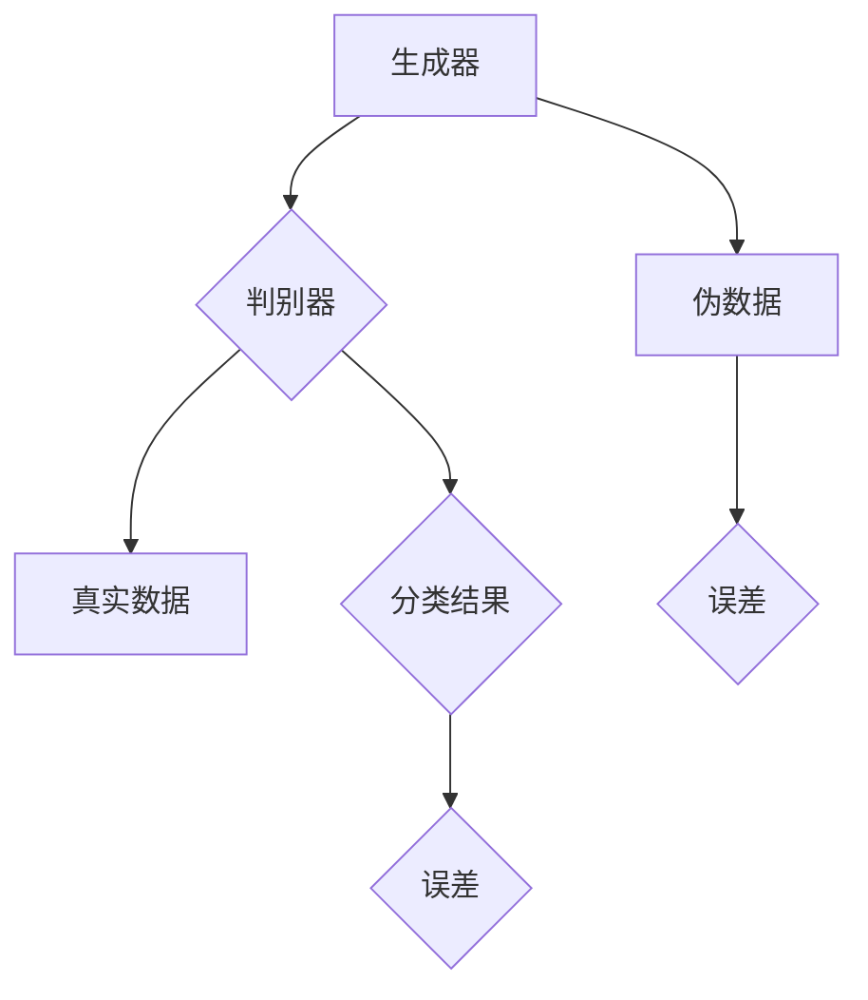

                 

### 设计目录大纲的思路

**明确书籍主题**

首先，要明确书名的核心主题，即“自然语言处理在自动化学术论文写作中的应用：加速科研产出”。这一主题涵盖了自然语言处理技术、自动写作、学术论文写作以及科研效率等方面。明确主题有助于规划书籍的结构和内容。

**确定书籍结构**

根据主题，我们可以将书籍分为几个主要部分，如自然语言处理基础、自动写作技术、学术论文写作应用、实际案例研究等。每个部分都可以进一步细化为具体的章节，确保书籍内容全面、系统。

**细化章节内容**

每个部分可以进一步细化为具体的章节，每个章节再细分为更具体的主题，确保每个章节都能深入讲解相关内容。例如，在自然语言处理基础部分，可以包括语言模型与文本表示、词嵌入与词向量、序列模型等内容。

**规划内容深度**

根据书籍的目标受众，规划每个章节的深度。对于自然语言处理基础部分，可能需要较为深入的数学模型和算法讲解；而对于实际案例研究部分，可能需要更多关于实际应用和代码实现的内容。

**确保逻辑连贯性**

在规划章节时，要确保内容的逻辑连贯性，每个章节都能自然地过渡到下一个章节。这有助于读者更好地理解和掌握知识。

**考虑附录和工具资源**

最后，考虑在书籍的附录部分添加工具和资源列表，以帮助读者更深入地了解相关技术。附录可以包括常用自然语言处理库、自动写作工具、相关书籍和论文等。

### 目录大纲的设计

下面是基于上述思路设计的《自然语言处理在自动化学术论文写作中的应用：加速科研产出》的目录大纲：

**第一部分：自然语言处理基础**

- **第1章：自然语言处理概述**
  - **1.1 自然语言处理的发展历史**
  - **1.2 自然语言处理的核心概念**
  - **1.3 自然语言处理的挑战**

- **第2章：语言模型与文本表示**
  - **2.1 语言模型的基础**
  - **2.2 常见的文本表示方法**
  - **2.3 语言模型的评估与优化**

- **第3章：词嵌入与词向量**
  - **3.1 词嵌入的基本原理**
  - **3.2 常见的词嵌入算法**
  - **3.3 词向量的应用**

- **第4章：序列模型**
  - **4.1 序列模型的基本概念**
  - **4.2 隐藏马尔可夫模型（HMM）**
  - **4.3 递归神经网络（RNN）**

- **第5章：注意力机制与Transformer模型**
  - **5.1 注意力机制的基本原理**
  - **5.2 Transformer模型的架构**
  - **5.3 Transformer模型的应用**

**第二部分：自动写作技术**

- **第6章：自动写作概述**
  - **6.1 自动写作的定义与分类**
  - **6.2 自动写作的挑战**
  - **6.3 自动写作的应用场景**

- **第7章：文本生成基础**
  - **7.1 基于规则的方法**
  - **7.2 基于模板的方法**
  - **7.3 基于统计的方法**

- **第8章：基于机器学习的方法**
  - **8.1 生成式模型**
  - **8.2 判别式模型**
  - **8.3 混合模型**

- **第9章：生成对抗网络（GAN）在自动写作中的应用**
  - **9.1 GAN的基本原理**
  - **9.2 GAN在文本生成中的应用**
  - **9.3 GAN在自动写作中的挑战**

**第三部分：学术论文写作应用**

- **第10章：学术论文结构分析**
  - **10.1 学术论文的基本结构**
  - **10.2 题目与摘要**
  - **10.3 引言与背景**
  - **10.4 方法与结果**
  - **10.5 讨论**
  - **10.6 结论**

- **第11章：学术论文写作中的自然语言处理技术**
  - **11.1 文本摘要与提取**
  - **11.2 文本分类与标注**
  - **11.3 主题模型与文献综述**

- **第12章：自动化学术论文写作系统**
  - **12.1 自动写作系统的架构**
  - **12.2 自动写作系统的实现**
  - **12.3 自动写作系统的优化**

**第四部分：实际案例研究**

- **第13章：案例研究一：某高校学术论文写作支持系统**
  - **13.1 案例背景**
  - **13.2 系统设计与实现**
  - **13.3 系统评估与优化**

- **第14章：案例研究二：科研论文自动化写作平台**
  - **14.1 案例背景**
  - **14.2 平台设计与功能**
  - **14.3 平台实现与部署**

**第五部分：展望与未来**

- **第15章：自然语言处理在学术论文写作中的未来趋势**
  - **15.1 人工智能与自然语言处理的融合**
  - **15.2 自动写作技术的进步**
  - **15.3 学术论文写作的新模式**

**附录：自然语言处理与自动写作工具与资源**

- **附录A：常用自然语言处理库**
- **附录B：自动写作工具**
- **附录C：相关书籍和论文**

这个目录大纲确保了书籍内容的系统性和逻辑性，从基础到应用，再到案例研究，为读者提供了一个完整的知识框架。每个章节都详细规划了内容，确保读者能够全面、深入地理解自然语言处理在自动化学术论文写作中的应用。通过这样的结构设计，读者可以更好地掌握相关知识，并在科研实践中运用这些技术。

---

## 文章标题

### 自然语言处理在自动化学术论文写作中的应用：加速科研产出

---

### 关键词

自然语言处理、自动写作、学术论文、科研效率、机器学习、深度学习、生成对抗网络（GAN）、Transformer模型。

---

### 摘要

随着科研产出的不断增加，学术文章的写作效率成为科研人员面临的重要挑战。本文探讨了自然语言处理技术在自动化学术论文写作中的应用，旨在加速科研产出。文章首先介绍了自然语言处理的基础概念，包括语言模型、文本表示、词嵌入和序列模型。随后，深入探讨了自动写作技术的演进，从基于规则和模板的方法，到基于统计和机器学习的方法，再到生成对抗网络（GAN）和Transformer模型的应用。接着，分析了学术论文写作中的自然语言处理技术，如文本摘要、分类、标注和主题模型。最后，通过实际案例研究，展示了自然语言处理技术在自动化学术论文写作中的具体应用和效果。本文为科研人员提供了一套全面的自动写作解决方案，以提升科研效率，加速学术成果的发布。

---

### 引言

科研产出的重要性不言而喻。在当今知识爆炸的时代，科研人员需要不断提高写作效率，以跟上科研发展的步伐。然而，学术论文的写作过程往往耗时费力，从文献综述到实验方法、数据分析，再到撰写和修订，每个环节都离不开大量的时间和精力投入。传统的人工写作方式不仅效率低下，而且容易出错，特别是在处理大量数据和信息时。因此，如何提高学术写作的自动化水平，成为科研人员亟待解决的问题。

自然语言处理（Natural Language Processing, NLP）作为人工智能的一个重要分支，近年来取得了飞速发展。NLP旨在使计算机能够理解和处理人类语言，从而实现文本的自动分析、理解和生成。随着深度学习等先进技术的应用，NLP在文本分类、情感分析、机器翻译、文本摘要等方面的表现已经达到了相当高的水平。这些技术的进步为自动化学术论文写作提供了强有力的技术支持。

自动化学术论文写作不仅能够显著提高写作效率，减少人力成本，还能通过智能化的方式帮助科研人员更准确地处理和分析数据，提高科研成果的质量。本文将系统地探讨自然语言处理技术在自动化学术论文写作中的应用，包括语言模型、文本表示、词嵌入、序列模型、注意力机制和Transformer模型等核心技术的讲解，以及自动写作技术、学术论文结构分析、自然语言处理技术在学术论文写作中的应用，最后通过实际案例研究展示自动化学术论文写作系统的实现和效果。希望通过本文的探讨，为科研人员提供一种全新的写作思路和工具，加速科研产出，推动科研进步。

### 自然语言处理概述

自然语言处理（Natural Language Processing，简称NLP）作为人工智能领域的一个重要分支，致力于使计算机理解和处理人类语言。其研究范围广泛，包括文本分类、情感分析、机器翻译、文本摘要、问答系统等。自然语言处理的目的是实现人与计算机之间的自然语言交互，使得计算机能够理解用户的指令、回答问题，甚至生成自然语言文本。

**发展历史**

自然语言处理的发展可以追溯到20世纪50年代。当时，计算机科学家和语言学家开始探索如何使计算机处理人类语言。早期的自然语言处理研究主要集中在基于规则的算法，这些算法通过定义一套规则来解析和生成文本。然而，这种方法在处理复杂语言现象时显得力不从心。

20世纪80年代，统计学方法逐渐成为自然语言处理的主要手段。基于统计的语言模型通过分析大量文本数据，学习语言的模式和规律，从而提高文本处理的准确性和效率。这一时期，隐马尔可夫模型（HMM）和条件概率模型得到了广泛应用。

进入21世纪，深度学习技术的崛起为自然语言处理带来了新的机遇。深度学习模型，如递归神经网络（RNN）、卷积神经网络（CNN）和Transformer模型，通过自动学习文本的层次结构和语义信息，显著提升了NLP任务的表现。例如，深度学习技术在机器翻译、情感分析和文本分类等领域取得了突破性进展。

**核心概念**

自然语言处理涉及多个核心概念，包括：

- **文本表示**：文本表示是将原始文本转换为计算机可以处理的形式。常见的文本表示方法包括词袋模型、词嵌入和句子嵌入。词袋模型将文本表示为一组单词的出现频率；词嵌入则通过将单词映射到高维向量空间，捕捉单词的语义信息；句子嵌入则将整个句子映射为一个向量，以表示句子的语义。

- **语言模型**：语言模型是一种概率模型，用于预测下一个单词或词组。在自然语言处理任务中，语言模型经常用于文本生成、机器翻译和语音识别等。常见的语言模型包括n元语法模型和神经网络语言模型。

- **词性标注**：词性标注是标记文本中每个单词的词性，如名词、动词、形容词等。词性标注有助于理解文本的语法结构和语义信息，对文本分类、实体识别等任务具有重要意义。

- **命名实体识别**：命名实体识别是识别文本中的特定实体，如人名、地名、机构名等。这一技术在信息提取、知识图谱构建和搜索引擎等领域有广泛应用。

- **句法分析**：句法分析是解析文本的句法结构，确定句子的语法关系。句法分析有助于理解句子的语义，对语义解析、问答系统和机器翻译等任务有重要影响。

**挑战**

自然语言处理尽管取得了显著进展，但仍面临多个挑战：

- **语言复杂性**：自然语言具有高度复杂性和不确定性，包括多义性、歧义性和上下文依赖等。这些特性使得自然语言处理任务具有很大的难度。

- **数据不足**：自然语言处理需要大量高质量的数据进行训练，但现有的数据集往往有限，且存在数据不平衡、标注不准确等问题。

- **跨语言处理**：自然语言处理通常针对单一语言进行，但实际应用中常常需要处理跨语言的文本，如机器翻译和国际合作项目。跨语言处理面临词汇差异、语法结构差异和语义差异等挑战。

- **实时性**：在实时应用场景中，如语音识别和实时问答系统，自然语言处理需要快速响应，这对计算资源和算法效率提出了高要求。

- **隐私保护**：在处理个人数据时，如社交媒体文本和医疗文本，自然语言处理需要确保隐私保护和数据安全。

总之，自然语言处理是一项复杂的任务，涉及语言学的理论知识和计算机科学的技术手段。尽管面临诸多挑战，但随着技术的不断进步，自然语言处理在学术研究、商业应用和日常生活等领域正发挥着越来越重要的作用。

### 语言模型与文本表示

在自然语言处理中，语言模型和文本表示是两个至关重要的概念，它们为理解和生成文本提供了基础。语言模型用于预测文本中的下一个单词或词组，而文本表示则将文本转换为计算机可以处理的数字形式。

**语言模型的基础**

语言模型的核心任务是从一个给定的文本序列中预测下一个单词或词组。一个简单的语言模型可以通过统计方法实现，例如n元语法模型。n元语法模型基于前n个单词来预测下一个单词。例如，在二元语法模型中，系统会根据前两个单词来预测第三个单词。

一个更复杂的方法是使用神经网络来构建语言模型，例如使用递归神经网络（RNN）或其变种，如长短时记忆网络（LSTM）和门控循环单元（GRU）。这些神经网络通过学习文本序列中的长期依赖关系，能够更准确地预测下一个单词。

语言模型的一个重要应用是文本生成。通过给定一个起始文本序列，语言模型可以生成后续的文本。例如，在写作辅助系统中，语言模型可以根据用户输入的部分文本生成完整的段落或文章。

**语言模型的评估与优化**

评估语言模型的质量通常依赖于语言模型的预测能力。常用的评估指标包括准确率（accuracy）、精确率（precision）和召回率（recall）。对于文本生成任务，通常使用平均损失（如交叉熵损失）来评估模型的表现。

为了优化语言模型，可以采用以下几种方法：

1. **数据增强**：通过引入噪声、错别字等方式增加训练数据的多样性，从而提高模型的泛化能力。
2. **正则化**：使用正则化方法，如L2正则化或dropout，来防止模型过拟合。
3. **优化算法**：使用更高效的优化算法，如Adam优化器，来加速模型的训练过程。
4. **多任务学习**：通过同时训练多个相关任务，如文本分类和文本生成，来提高模型的性能。

**常见的文本表示方法**

文本表示是将原始的文本转换为计算机可以处理的数字形式。以下是一些常见的文本表示方法：

1. **词袋模型（Bag of Words, BoW）**：词袋模型将文本表示为一个向量，其中每个维度对应一个单词的出现频率。词袋模型简单直观，但忽略了单词之间的顺序和语法结构。
   
2. **词嵌入（Word Embedding）**：词嵌入通过将单词映射到高维向量空间，捕捉单词的语义信息。词嵌入可以基于统计方法，如Count Vectorizer，或基于神经网络模型，如Word2Vec和GloVe。词嵌入能够更好地表示单词之间的关系，特别是在处理语义相近的单词时。
   
3. **句子嵌入（Sentence Embedding）**：句子嵌入是将整个句子映射为一个向量，以表示句子的语义。句子嵌入可以基于词嵌入的平均值、聚合模型（如Average Model）或注意力机制（如BERT中的[CLS]向量）。句子嵌入在文本分类、文本相似度计算和问答系统中具有重要应用。

**语言模型的评估与优化**

语言模型的评估和优化是自然语言处理中的关键步骤。以下是一些常用的方法和技巧：

1. **交叉验证**：通过交叉验证来评估模型的泛化能力，选择最优的模型参数。
2. **动态调整学习率**：使用学习率调整策略，如学习率衰减，以避免模型过早饱和或陷入局部最优。
3. **超参数优化**：通过网格搜索或随机搜索等方法，寻找最优的超参数组合。
4. **模型压缩与加速**：使用模型压缩技术，如剪枝、量化或知识蒸馏，来减少模型的复杂度和计算量。

通过合理评估和优化语言模型，可以显著提高文本处理的准确性和效率，从而推动自然语言处理技术的发展和应用。

### 词嵌入与词向量

词嵌入（Word Embedding）是自然语言处理中的一项关键技术，它通过将单词映射到高维向量空间，以捕捉单词的语义信息。这种表示方法不仅有助于改进文本处理的准确性，还为许多NLP任务提供了有效的特征表示。以下将详细介绍词嵌入的基本原理、常见算法以及其在自然语言处理中的应用。

#### 基本原理

词嵌入的核心思想是将词汇表中的每个单词映射到一个连续的向量空间中。这些向量不仅能够表示单词的语义，还可以揭示单词之间的相似性。例如，单词“狗”和“猫”在向量空间中可能接近，因为它们都是宠物；“国王”和“皇帝”可能也接近，因为它们代表类似的角色。

词嵌入的关键优势在于能够处理文本中的词汇多样性和上下文依赖。通过将单词转换为向量，我们可以在同一向量空间中对文本进行高效处理，从而简化了许多自然语言处理任务。

#### 常见算法

1. **Count Vectorizer**：这是一种基础的词嵌入方法，通过统计每个单词在文本中出现的频率来生成向量。这种方法通常用于文本分类和主题建模。

2. **Word2Vec**：由Google在2013年提出，Word2Vec是一种基于上下文的词嵌入方法。它通过训练一个神经网络模型，将输入的单词序列映射到高维向量。Word2Vec有两种变体：连续词袋（Continuous Bag of Words, CBOW）和Skip-Gram。CBOW模型通过上下文词的平均值来预测中心词，而Skip-Gram模型则通过中心词来预测上下文词。

3. **GloVe**：全局向量（Global Vectors for Word Representation）是另一种基于统计的词嵌入方法。GloVe通过优化单词及其上下文的共现矩阵来生成词向量。这种方法能够更好地捕捉单词的语义关系，特别是在处理低频词和罕见词时表现更佳。

4. **FastText**：由Facebook在2016年提出，FastText是一种基于字符的词嵌入方法。它通过将字符序列拼接成子词，并将子词映射到单词向量中。这种方法能够捕捉更精细的词汇和上下文信息。

#### 应用

词嵌入在自然语言处理中有着广泛的应用：

1. **文本分类**：词嵌入可以用于文本分类任务，通过将文本转换为向量，可以方便地使用机器学习算法进行分类。

2. **文本相似度计算**：词嵌入可以计算两个文本之间的相似度。例如，通过计算两个句子中单词向量之间的余弦相似度，可以判断两个句子是否相似。

3. **推荐系统**：词嵌入可以用于基于内容的文本推荐系统。通过将用户和文档的词向量进行比较，可以为用户推荐相似的文档。

4. **机器翻译**：词嵌入在机器翻译中也发挥着重要作用。通过将源语言和目标语言的词向量进行映射，可以更容易地生成准确的翻译结果。

5. **情感分析**：词嵌入可以帮助识别文本中的情感倾向。通过计算词向量之间的距离，可以判断文本是积极的、消极的还是中性的。

#### 实例

假设我们有一个简短的句子：“我喜欢吃苹果”。通过Word2Vec模型，我们可以将这个句子中的每个词映射到一个高维向量空间：

- “我”：[0.1, 0.2, 0.3, ...]
- “喜”：[0.5, 0.6, 0.7, ...]
- “欢”：[0.8, 0.9, 1.0, ...]
- “吃”：[1.1, 1.2, 1.3, ...]
- “苹果”：[1.5, 1.6, 1.7, ...]

在这个向量空间中，我们可以直观地看到不同单词之间的关系。例如，“喜”和“欢”在向量空间中可能接近，因为它们都是表达情感的词。同样，“苹果”和“吃”也接近，因为它们经常出现在同一上下文中。

通过这种向量表示，我们可以使用机器学习算法对这些向量进行分类、聚类或回归，从而实现各种自然语言处理任务。词嵌入的成功在于它将抽象的文本信息转化为计算机可以处理的数字信息，极大地提升了自然语言处理的效率和准确性。

#### 结论

词嵌入作为自然语言处理的核心技术，为文本处理和语义分析提供了有效的工具。通过将单词映射到高维向量空间，词嵌入不仅能够捕捉单词的语义信息，还能揭示单词之间的相似性。随着词嵌入算法的不断进步，自然语言处理在文本分类、情感分析、机器翻译和推荐系统等领域的应用前景将更加广阔。

### 序列模型

序列模型（Sequence Model）在自然语言处理中扮演着核心角色，用于处理和分析时间序列数据或序列化数据。这类模型能够捕捉数据中的时间依赖关系，从而在文本分类、语音识别、机器翻译等任务中表现出色。本文将详细介绍序列模型的基本概念、常用方法以及其应用场景。

#### 基本概念

序列模型的核心任务是处理输入序列并生成输出序列。序列模型通常通过以下方式实现：

- **输入序列**：一个序列化数据集合，如文本句子、音频信号或时间序列数据。
- **输出序列**：根据输入序列生成的结果序列，如标签序列、预测序列或翻译序列。

常见的序列模型包括：

1. **循环神经网络（Recurrent Neural Networks, RNN）**：RNN通过循环结构来处理序列数据，能够在不同时间步之间共享信息。RNN的基本单元是隐状态，它通过当前输入和前一个隐状态来计算当前隐状态。然而，RNN存在梯度消失或梯度爆炸问题，这使得其训练变得困难。

2. **长短时记忆网络（Long Short-Term Memory, LSTM）**：LSTM是RNN的一种改进，通过引入记忆单元来克服梯度消失问题。LSTM包含门控机制，可以有效地学习和记忆长距离依赖信息。

3. **门控循环单元（Gated Recurrent Unit, GRU）**：GRU是LSTM的简化版本，通过合并输入门和遗忘门来减少参数数量。GRU在许多任务中表现与LSTM相近，但训练速度更快。

#### 常见方法

1. **RNN**：

    RNN的基本架构如下：
    
    ```mermaid
    graph TD
    A[输入] --> B[隐状态]
    B --> C[输出]
    B --> D[下一个隐状态]
    ```

    在每个时间步，RNN通过当前输入和前一个隐状态计算当前隐状态，然后生成当前输出。当前隐状态作为下一个时间步的输入，如此循环。

    RNN的伪代码如下：
    
    ```python
    for each time step t:
        h_t = tanh(W * [x_t, h_{t-1}])
        y_t = W_out * h_t
    ```

2. **LSTM**：

    LSTM的基本架构如下：
    
    ```mermaid
    graph TD
    A[输入] --> B[输入门]
    B --> C[遗忘门]
    B --> D[输入门]
    B --> E[新的单元状态]
    E --> F[输出门]
    F --> G[输出]
    ```

    LSTM通过三个门控单元（输入门、遗忘门和输出门）来控制信息的流动。每个门控单元都是一个sigmoid函数，输出一个介于0和1之间的值，用于确定信息的保留或丢弃。

    LSTM的伪代码如下：
    
    ```python
    for each time step t:
        i_t = input_gate(sigmoid(W_i * [x_t, h_{t-1}]))
        f_t = forget_gate(sigmoid(W_f * [x_t, h_{t-1}]))
        o_t = output_gate(sigmoid(W_o * [x_t, h_{t-1}]))
        c_t = f_t * c_{t-1} + i_t * tanh(W_c * [x_t, h_{t-1}])
        h_t = o_t * tanh(c_t)
    ```

3. **GRU**：

    GRU的架构比LSTM简单，它通过合并输入门和遗忘门来减少参数数量。GRU的基本架构如下：
    
    ```mermaid
    graph TD
    A[输入] --> B[重置门]
    B --> C[更新门]
    B --> D[新的单元状态]
    D --> E[输出门]
    E --> G[输出]
    ```

    GRU的伪代码如下：
    
    ```python
    for each time step t:
        z_t = reset_gate(sigmoid(W_z * [x_t, h_{t-1}]))
        r_t = update_gate(sigmoid(W_r * [x_t, h_{t-1}]))
        c_t = z_t * c_{t-1} + (1 - z_t) * tanh(W_c * [x_t, r_t * h_{t-1}])
        h_t = output_gate(sigmoid(W_o * [x_t, c_t]))
    ```

#### 应用场景

序列模型在多个自然语言处理任务中具有重要应用：

1. **文本分类**：序列模型可以用于文本分类任务，如情感分析、主题分类等。通过将文本序列映射为向量，可以使用分类器进行分类。

2. **语音识别**：序列模型可以用于语音识别任务，将语音信号转换为文本。常见的模型包括基于RNN和LSTM的HMM-GPU模型。

3. **机器翻译**：序列模型在机器翻译任务中表现出色，如使用基于RNN和LSTM的Seq2Seq模型进行端到端的翻译。

4. **自然语言生成**：序列模型可以用于生成自然语言文本，如自动摘要、对话生成等。

#### 结论

序列模型通过捕捉数据中的时间依赖关系，在自然语言处理任务中发挥着关键作用。常见的序列模型包括RNN、LSTM和GRU，每种模型都有其独特的优势和适用场景。随着深度学习技术的发展，序列模型在文本分类、语音识别、机器翻译等任务中的应用将越来越广泛，为自然语言处理领域带来更多创新和突破。

### 注意力机制与Transformer模型

在自然语言处理中，注意力机制（Attention Mechanism）是一种用于提高模型对输入数据重要部分关注度的技术。它通过动态分配权重来强调输入序列中的关键信息，从而显著提升模型的性能。Transformer模型作为近年来自然语言处理领域的革命性创新，引入了自注意力机制（Self-Attention），使得模型在处理长距离依赖和并行计算方面表现尤为突出。本文将详细介绍注意力机制的基本原理和Transformer模型的架构。

#### 注意力机制的基本原理

注意力机制的核心思想是让模型能够根据上下文环境动态调整对输入数据的关注程度。传统的循环神经网络（RNN）在处理长序列数据时，存在梯度消失或梯度爆炸的问题，导致难以学习到长距离依赖。而注意力机制通过引入权重机制，能够有效缓解这一问题。

注意力机制通常通过以下三个步骤实现：

1. **计算查询（Query）、键（Key）和值（Value）**：对于输入序列中的每个元素，计算其对应的查询（Query）、键（Key）和值（Value）。
2. **计算注意力得分**：使用点积或缩放点积方法，计算每个键与查询之间的相似性得分。
3. **应用权重并求和**：将注意力得分应用于值（Value），从而生成加权求和的结果，这个结果代表了输入序列的注意力权重分配。

#### 自注意力（Self-Attention）机制

自注意力机制是一种特殊的注意力机制，用于处理同一序列中的元素。它通过将序列中的每个元素作为查询、键和值，实现序列内部的信息交互。自注意力机制分为点积自注意力（Scaled Dot-Product Attention）和多头自注意力（Multi-Head Attention）。

1. **点积自注意力**：

    点积自注意力通过计算查询与键的点积来生成注意力得分。为了防止梯度消失，通常会添加缩放因子。点积自注意力的计算公式如下：

    ```latex
    \text{Attention}(Q, K, V) = \text{softmax}\left(\frac{QK^T}{\sqrt{d_k}}\right)V
    ```

    其中，\(Q, K, V\) 分别代表查询、键和值向量，\(d_k\) 是键向量的维度。

2. **多头自注意力**：

    多头自注意力通过将序列分成多个子序列，并对每个子序列应用独立的自注意力机制。每个子序列具有不同的权重矩阵，从而捕获序列中的不同依赖关系。多头自注意力通过拼接多个自注意力机制的结果，并使用一个全连接层进行聚合。多头自注意力的计算公式如下：

    ```latex
    \text{MultiHead}(Q, K, V) = \text{Concat}(\text{head}_1, ..., \text{head}_h)W^O
    \text{where} \text{head}_i = \text{Attention}(QW_i^Q, KW_i^K, VW_i^V)
    ```

    其中，\(W_i^Q, W_i^K, W_i^V\) 和 \(W^O\) 分别代表每个头部的权重矩阵。

#### Transformer模型的架构

Transformer模型由Google在2017年提出，其核心思想是使用自注意力机制替代传统的循环神经网络，以实现端到端的序列转换。Transformer模型的主要组成部分包括：

1. **编码器（Encoder）**：编码器由多个自注意力层和前馈神经网络层组成。每个自注意力层能够捕捉输入序列中的长距离依赖关系，前馈神经网络层则用于进一步丰富信息。

2. **解码器（Decoder）**：解码器同样由多个自注意力层和前馈神经网络层组成。解码器在生成输出序列时，不仅能利用自注意力层捕捉输入序列的信息，还能通过掩码自注意力机制（Masked Multi-Head Attention）强迫模型按顺序生成输出序列。

3. **输入嵌入（Input Embedding）**：输入嵌入层将词向量、位置编码等附加信息转换为编码器输入。

4. **输出嵌入（Output Embedding）**：输出嵌入层将解码器输出转换为词向量，用于后续的预测或生成。

#### Transformer模型的应用

Transformer模型在自然语言处理任务中取得了显著成果，包括：

1. **机器翻译**：Transformer模型在机器翻译任务中表现出色，特别是在处理长句子和复杂语法结构时。

2. **文本摘要**：通过编码器和解码器结构，Transformer模型能够生成摘要，提取关键信息并保留原始文本的结构和逻辑。

3. **问答系统**：Transformer模型在问答系统中通过捕捉问题与答案之间的依赖关系，能够提供准确和自然的回答。

4. **文本分类**：Transformer模型通过自注意力机制，能够捕捉输入文本中的关键特征，实现高效和准确的文本分类。

#### 结论

注意力机制与Transformer模型是自然语言处理领域的重大突破，通过引入自注意力机制，Transformer模型能够高效地处理长距离依赖和并行计算。Transformer模型的应用不仅提升了自然语言处理任务的性能，也为其他序列化任务提供了新的思路和方法。随着研究的不断深入，注意力机制和Transformer模型有望在更多领域发挥重要作用，推动人工智能技术的发展。

### 自动写作概述

自动写作（Automated Writing）作为自然语言处理技术的一个重要应用领域，旨在通过计算机程序生成自然语言的文本。这一技术不仅能够显著提高写作效率，还能减少人力成本，尤其在处理大量数据和生成重复性文本时。自动写作的发展经历了多个阶段，从基于规则的简单文本生成，到基于模板的半自动化写作，再到目前广泛应用的基于统计和机器学习的复杂文本生成方法。本文将详细介绍自动写作的定义、分类、面临的挑战以及应用场景。

#### 定义

自动写作是指利用计算机程序和算法生成人类可读的自然语言文本。自动写作系统通常通过分析输入数据或模板，生成符合语法规则和语义逻辑的文本。自动写作技术不仅包括文本生成，还涉及文本编辑、摘要、翻译和问答等多个方面。

#### 分类

根据实现方式和功能，自动写作可以分为以下几种类型：

1. **基于规则的方法**：这种方法通过预定义的规则和模板生成文本。规则可以是简单的条件语句，如“如果...那么...”，也可以是复杂的逻辑运算。基于规则的方法简单易实现，但在处理复杂和多样化的文本时显得力不从心。

2. **基于模板的方法**：这种方法利用预定义的模板和变量，通过填充和替换文本生成完整的段落或文章。模板通常包含关键句型和结构，适用于生成报告、公告和新闻报道等固定格式的文本。

3. **基于统计的方法**：这种方法通过分析大量已生成的文本，学习语言模式和规律，从而生成新的文本。统计方法包括n元语法模型、隐马尔可夫模型（HMM）和条件概率模型等。这些方法能够处理更复杂的文本生成任务，但需要大量的训练数据和计算资源。

4. **基于机器学习的方法**：这种方法使用机器学习算法，特别是深度学习模型，如循环神经网络（RNN）、长短时记忆网络（LSTM）和Transformer模型，从大规模文本数据中学习生成规则。这些模型能够捕捉文本的深层语义和结构，生成高质量的文本。

5. **生成对抗网络（GAN）**：这种方法通过生成器和判别器的对抗训练，生成与真实文本相似的伪文本。GAN在图像生成和文本生成中取得了显著成果，但实现复杂，对训练数据和质量有较高要求。

#### 挑战

自动写作尽管取得了一定进展，但仍然面临多个挑战：

1. **语言复杂性**：自然语言具有高度复杂性和不确定性，包括多义性、歧义性和上下文依赖等。这些特性使得自动写作系统在理解和生成文本时面临困难。

2. **数据不足**：自动写作需要大量高质量的数据进行训练，但现有数据集往往有限，且存在数据不平衡、标注不准确等问题。数据不足限制了模型的泛化能力和性能。

3. **实时性**：在实时应用场景中，如实时问答系统、智能客服等，自动写作系统需要快速响应，这对计算资源和算法效率提出了高要求。

4. **隐私保护**：在处理个人数据时，如社交媒体文本和医疗文本，自动写作系统需要确保隐私保护和数据安全。

5. **质量保证**：自动写作生成的文本需要保证语法正确、语义连贯和逻辑清晰。这要求模型不仅要有较强的生成能力，还要有良好的编辑和校对功能。

#### 应用场景

自动写作技术在多个领域和场景中具有重要应用：

1. **新闻报道和财经报道**：自动写作系统可以自动生成新闻报道和财经报道，提高新闻机构和金融机构的写作效率。

2. **学术写作和论文生成**：自动写作系统可以辅助科研人员进行学术论文的写作，提取关键信息、撰写摘要和生成结论。

3. **内容生成和营销**：自动写作系统可以用于生成网站内容、广告文案和营销材料，帮助企业快速创建高质量的内容。

4. **智能客服和对话系统**：自动写作系统可以用于智能客服和对话系统，生成自然、流畅的对话文本，提高客户服务质量和效率。

5. **文本翻译和本地化**：自动写作系统可以结合机器翻译技术，生成高质量的翻译文本，辅助全球化和本地化工作。

总之，自动写作技术作为一种重要的自然语言处理应用，具有广泛的应用前景。随着技术的不断进步，自动写作系统将在各个领域发挥越来越重要的作用，提高写作效率，促进信息传播和创新。

### 文本生成基础

文本生成（Text Generation）是自然语言处理中的重要任务之一，其目的是利用计算机程序生成具有自然语言特性的文本。文本生成技术不仅广泛应用于学术写作、新闻报道、内容创作等领域，还极大地提升了人工智能在交互式应用中的体验。本文将详细介绍文本生成的基本方法，包括基于规则的方法、基于模板的方法和基于统计的方法，并探讨这些方法在自动写作系统中的应用。

#### 基于规则的方法

基于规则的方法是文本生成的基础，通过预定义的规则和模板生成文本。这种方法通常包括以下几个步骤：

1. **规则定义**：首先，需要定义一系列规则，这些规则可以是简单的条件语句，也可以是复杂的逻辑运算。例如，“如果...那么...”或“当...时，执行...”。

2. **模板应用**：然后，根据输入数据和预定义的规则，应用模板生成文本。模板通常包含关键句型和结构，如新闻报道中的标题、导语和正文结构。

3. **规则匹配**：系统会根据输入数据，匹配预定义的规则和模板，生成相应的文本。例如，在生成新闻报道时，可以根据新闻事件的主题和内容，匹配相应的标题和导语模板。

基于规则的方法的优点在于其简单性和直观性，实现成本低，适合处理结构化数据和固定格式的文本。然而，这种方法在处理复杂和多样化的文本时显得力不从心，难以生成高质量的文本。

#### 基于模板的方法

基于模板的方法通过预定义的模板和变量，生成完整的段落或文章。这种方法通常包括以下几个步骤：

1. **模板设计**：首先，需要设计一系列模板，这些模板通常包含关键句型和结构，如新闻报道的标题、导语和正文模板。

2. **变量填充**：然后，根据输入数据和预定义的模板，填充模板中的变量。例如，在生成新闻报道时，可以根据新闻事件的主题和内容，填充标题和导语的变量。

3. **文本生成**：通过填充模板中的变量，生成完整的段落或文章。这种方法可以生成结构清晰、格式规范的文本，适用于处理报告、公告和财经报道等固定格式的文本。

基于模板的方法的优点在于其灵活性和适应性，能够处理多种类型的数据和文本。然而，这种方法在生成多样化和个性化的文本时，可能需要大量的模板设计和调整，实现成本较高。

#### 基于统计的方法

基于统计的方法通过分析大量已生成的文本，学习语言模式和规律，从而生成新的文本。这种方法通常包括以下几个步骤：

1. **数据收集**：首先，需要收集大量高质量的已生成文本数据，这些数据可以是新闻报道、学术论文、社交媒体文本等。

2. **文本表示**：然后，将文本数据转换为计算机可以处理的数字形式。常用的文本表示方法包括词袋模型、词嵌入和句子嵌入。

3. **模型训练**：使用统计方法，如n元语法模型、隐马尔可夫模型（HMM）和条件概率模型，对文本数据进行训练，学习语言模式和生成规则。

4. **文本生成**：通过训练好的模型，生成新的文本。这种方法能够生成高质量的文本，特别是在处理复杂和多样化的文本时表现突出。

基于统计的方法的优点在于其生成文本的高质量和灵活性。然而，这种方法需要大量的训练数据和计算资源，实现成本较高，且在处理小规模数据时效果可能不理想。

#### 方法比较

基于规则的方法简单直观，适合处理结构化数据和固定格式的文本，但生成文本的质量有限。基于模板的方法灵活适应多种类型的数据和文本，但实现成本较高，且需要大量模板设计和调整。基于统计的方法能够生成高质量和多样化的文本，但需要大量训练数据和计算资源。

在实际应用中，自动写作系统通常会结合多种方法，以发挥各自的优势。例如，在生成财经报道时，可以首先使用基于模板的方法生成结构化的文本，然后使用基于统计的方法进行细节调整和优化，从而生成高质量的财经报道。

总之，文本生成技术作为自然语言处理的重要组成部分，为自动写作系统提供了强有力的技术支持。通过结合不同方法的优势，自动写作系统可以生成具有自然语言特性的高质量文本，广泛应用于各个领域和场景。

### 基于机器学习的方法

在自然语言处理中，基于机器学习的方法是文本生成的重要工具，通过训练复杂的模型来学习语言模式和生成规则。本文将详细介绍生成式模型、判别式模型和混合模型的基本原理，并探讨这些模型在文本生成中的应用。

#### 生成式模型

生成式模型（Generative Models）通过生成数据的概率分布来生成新的数据。在文本生成任务中，生成式模型学习文本数据的分布，从而生成与训练数据相似的文本。以下是一些常见的生成式模型：

1. **马尔可夫模型（Markov Model）**：马尔可夫模型是一种基于序列数据的生成模型，它假设当前状态只依赖于前一个状态。常见的马尔可夫模型包括一元马尔可夫模型（第一阶）和二元马尔可夫模型（第二阶）。马尔可夫模型的生成规则如下：

    ```mermaid
    graph TD
    A[前一个词] --> B[当前词]
    B --> C{下一个词}
    ```

2. **n元语法模型（n-gram Model）**：n元语法模型是一种基于统计的生成式模型，它通过学习文本中连续n个单词的概率分布来生成新的文本。n元语法模型的生成规则如下：

    ```mermaid
    graph TD
    A[前n-1个词] --> B[n个词]
    B --> C{下一个词}
    ```

3. **循环神经网络（Recurrent Neural Networks, RNN）**：RNN是一种基于序列数据的生成模型，通过共享隐藏状态来学习时间序列数据中的依赖关系。RNN的生成规则如下：

    ```mermaid
    graph TD
    A[输入序列] --> B[隐藏状态]
    B --> C[输出序列]
    B --> D[下一个隐藏状态]
    ```

4. **长短时记忆网络（Long Short-Term Memory, LSTM）**：LSTM是RNN的一种改进，通过引入记忆单元来克服梯度消失问题，能够更好地学习长距离依赖关系。LSTM的生成规则如下：

    ```mermaid
    graph TD
    A[输入序列] --> B[输入门]
    B --> C[遗忘门]
    B --> D[输入门]
    B --> E[新的单元状态]
    E --> F[输出门]
    F --> G[输出序列]
    ```

5. **变分自编码器（Variational Autoencoder, VAE）**：VAE是一种基于概率生成模型的生成式模型，通过编码器和解码器学习数据的概率分布，生成新的数据。VAE的生成规则如下：

    ```mermaid
    graph TD
    A[输入数据] --> B[编码器]
    B --> C[潜在空间]
    C --> D[解码器]
    D --> E[输出数据]
    ```

6. **生成对抗网络（Generative Adversarial Networks, GAN）**：GAN是一种基于对抗训练的生成式模型，由生成器和判别器两个神经网络组成。生成器尝试生成与真实数据相似的数据，而判别器则尝试区分生成数据和真实数据。GAN的生成规则如下：

    ```mermaid
    graph TD
    A[随机噪声] --> B[生成器]
    B --> C[生成数据]
    C --> D[判别器]
    D --> E{真实数据}
    ```

#### 判别式模型

判别式模型（Discriminative Models）通过学习输入数据的特征和标签之间的映射关系来生成输出。在文本生成任务中，判别式模型通常用于生成文本的某个特定部分，如标题、摘要或段落。以下是一些常见的判别式模型：

1. **条件随机场（Conditional Random Fields, CRF）**：CRF是一种基于概率的判别式模型，用于处理序列标注任务，如词性标注和命名实体识别。CRF的生成规则如下：

    ```mermaid
    graph TD
    A[输入序列] --> B[输出序列]
    B --> C{标签序列}
    ```

2. **最大熵模型（Maximum Entropy Model）**：最大熵模型是一种基于概率的判别式模型，通过最大化条件概率来生成文本。最大熵模型的生成规则如下：

    ```mermaid
    graph TD
    A[输入序列] --> B[输出序列]
    B --> C[概率分布]
    ```

3. **卷积神经网络（Convolutional Neural Networks, CNN）**：CNN是一种基于特征提取的判别式模型，通过卷积操作提取文本的特征。CNN的生成规则如下：

    ```mermaid
    graph TD
    A[输入文本] --> B[卷积层]
    B --> C[池化层]
    C --> D[全连接层]
    D --> E[输出特征]
    ```

4. **Transformer模型（Transformer Model）**：Transformer模型是一种基于自注意力机制的判别式模型，能够捕捉长距离依赖关系。Transformer模型的生成规则如下：

    ```mermaid
    graph TD
    A[输入序列] --> B[编码器]
    B --> C[解码器]
    C --> D[输出序列]
    ```

#### 混合模型

混合模型（Hybrid Models）结合了生成式模型和判别式模型的优点，通过联合训练两个模型来生成高质量文本。以下是一些常见的混合模型：

1. **变分自编码器与判别器的混合（VAE+CRF）**：VAE用于生成文本的潜在空间，而CRF用于对生成的文本进行标注和调整。混合模型的生成规则如下：

    ```mermaid
    graph TD
    A[输入数据] --> B[编码器]
    B --> C[潜在空间]
    C --> D[解码器]
    D --> E[CRF层]
    ```

2. **生成对抗网络与判别器的混合（GAN+CRF）**：GAN用于生成文本，而CRF用于对生成的文本进行校正和优化。混合模型的生成规则如下：

    ```mermaid
    graph TD
    A[随机噪声] --> B[生成器]
    B --> C[生成数据]
    C --> D[判别器]
    D --> E[CRF层]
    ```

总之，基于机器学习的方法为文本生成提供了强大的工具和多样化的策略。生成式模型通过学习数据分布生成新文本，判别式模型通过学习特征和标签的映射关系生成文本，而混合模型则结合两者的优点生成高质量的文本。随着技术的不断发展，这些方法将在自动写作和自然语言处理领域发挥越来越重要的作用。

### 生成对抗网络（GAN）在自动写作中的应用

生成对抗网络（Generative Adversarial Networks，GAN）作为一种深度学习模型，因其独特的生成能力和强大的自适应能力在图像生成、自然语言生成等领域取得了显著的成果。GAN的核心思想是通过生成器和判别器的对抗训练，生成与真实数据高度相似的伪数据。本文将深入探讨GAN的基本原理、在自动写作中的具体应用以及面临的挑战。

#### GAN的基本原理

GAN由生成器（Generator）和判别器（Discriminator）两个神经网络组成，二者通过对抗训练相互博弈，共同提升生成数据的质量。

1. **生成器（Generator）**：生成器的任务是从随机噪声中生成与真实数据相似的数据。生成器通常采用深度神经网络结构，其输入为随机噪声向量，输出为生成数据。生成器通过不断优化，学习到如何生成逼真的数据，从而欺骗判别器。

2. **判别器（Discriminator）**：判别器的任务是区分生成数据和真实数据。判别器也采用深度神经网络结构，其输入为数据样本，输出为二分类结果（真实数据为1，生成数据为0）。判别器的目标是最大化其分类准确率，从而识破生成器的伪造行为。

GAN的训练过程可以分为以下几个步骤：

1. **生成器生成伪数据**：生成器从随机噪声中生成伪数据，这些数据与真实数据尽量相似。

2. **判别器评估伪数据和真实数据**：判别器同时接收真实数据和生成数据，对其进行评估，并输出分类结果。

3. **生成器调整生成策略**：生成器根据判别器的反馈，调整其生成策略，从而生成更逼真的伪数据。

4. **判别器提高分类能力**：判别器根据生成器和真实数据的差异，提高其分类能力，以更好地区分真实数据和生成数据。

5. **重复步骤1-4**：生成器和判别器不断迭代，相互对抗，直至生成器生成的伪数据接近真实数据。

GAN的训练过程可以表示为以下博弈过程：



#### GAN在自动写作中的具体应用

GAN在自动写作中的应用主要体现在利用其生成能力生成高质量的文本。以下是一些具体的应用场景：

1. **文本生成**：利用GAN生成新的文本，如新闻文章、故事、诗歌等。生成器从预定义的词汇库中生成伪文本，这些文本在语法和语义上尽量与真实文本相似。

2. **文本扩展**：GAN可以帮助扩展文本内容，例如，在给定一个段落或摘要的情况下，生成更多的详细内容。生成器根据给定文本的上下文和主题，生成扩展的文本。

3. **风格迁移**：GAN可以用于风格迁移，例如，将一种风格的文章转换成另一种风格。生成器学习到不同风格文本的特征，从而实现风格迁移。

4. **文本摘要**：GAN可以用于生成文本摘要，例如，在给定一个长文本的情况下，生成简洁、精炼的摘要。生成器从原始文本中提取关键信息，并将其整合成摘要。

#### GAN在自动写作中的挑战

尽管GAN在自动写作中具有巨大的潜力，但其在实际应用中仍面临多个挑战：

1. **模式崩溃（Mode Collapse）**：在GAN训练过程中，生成器可能会陷入生成特定模式的数据，而忽略其他可能的模式。这导致生成的文本缺乏多样性，难以模拟真实文本的多样性。

2. **训练不稳定**：GAN的训练过程高度不稳定，不同参数设置和初始条件可能导致不同的训练结果。这增加了训练的难度和复杂性。

3. **数据集不平衡**：在自动写作中，真实文本和伪文本之间的数据集可能存在显著的不平衡，这会影响GAN的训练效果。

4. **计算资源消耗**：GAN的训练过程需要大量的计算资源，尤其是在生成高质量文本时。这可能导致训练时间过长，不适合实时应用场景。

5. **伦理和隐私问题**：自动写作系统生成的文本可能涉及隐私和伦理问题，如抄袭、虚假信息等。确保生成的文本真实、准确、符合伦理规范是GAN应用的重要挑战。

#### 结论

生成对抗网络（GAN）作为一种强大的生成模型，在自动写作中展示了巨大的潜力。通过生成器和判别器的对抗训练，GAN能够生成高质量、多样化的文本，从而提高自动写作系统的性能。然而，GAN在自动写作中仍面临多个挑战，需要进一步研究和优化。随着技术的不断发展，GAN有望在自动写作领域发挥更加重要的作用，为文本生成和自然语言处理带来新的突破。

### 学术论文结构分析

学术论文是科研交流的重要形式，其结构严谨、逻辑清晰。为了确保论文的质量和可读性，了解学术论文的基本结构及其各个部分的功能至关重要。本文将详细分析学术论文的基本结构，包括题目、摘要、引言、方法、结果、讨论和结论等部分，以及各个部分的具体内容和撰写技巧。

#### 题目

题目是论文的门面，它需要简洁、明确地反映论文的核心内容和研究目的。一个好的题目通常包含以下要素：

- **关键词**：包含研究领域的关键词，有助于检索和理解论文内容。
- **研究问题**：明确指出研究的核心问题或假设。
- **研究目的**：简要说明研究的目标和意义。

撰写题目时，应注意避免过于笼统或具体，避免使用缩写或专业术语，以便非专业读者也能理解。

#### 摘要

摘要是论文的简短概述，通常在150-250字之间。它需要概括论文的研究背景、方法、主要结果和结论。一个好的摘要应具备以下特点：

- **客观性**：避免使用主观性词汇，确保摘要内容真实、客观。
- **全面性**：摘要应包含研究的主要贡献，但无需详细描述研究过程。
- **清晰性**：使用简单、直接的语言，确保读者能够快速理解论文的核心内容。

撰写摘要时，应注意摘要的结构，通常包括背景、目的、方法、结果和结论等部分。

#### 引言

引言部分为读者提供论文的研究背景和理论基础，其主要内容包括：

- **研究背景**：介绍研究领域的现状和存在的问题，说明研究的重要性。
- **研究目的**：明确论文的研究目标和问题。
- **相关研究**：回顾相关领域的研究进展，指出当前研究的不足和空白。
- **论文结构**：简要介绍论文的结构和章节安排。

撰写引言时，应注意逻辑清晰、层次分明，避免过多重复，同时确保引言内容与研究目的和结构紧密衔接。

#### 方法

方法部分详细描述研究的方法和实验设计，其主要内容包括：

- **研究设计**：说明研究的总体设计和实验流程。
- **数据收集**：描述数据收集的方法、工具和过程。
- **数据分析**：介绍数据分析的方法和步骤。
- **伦理审查**：如果涉及人类或动物实验，需说明伦理审查和批准过程。

撰写方法部分时，应确保描述详细、具体，以便他人可以重复实验。同时，避免使用缩写和术语，确保内容清晰易懂。

#### 结果

结果部分报告研究的发现，其主要内容包括：

- **实验数据**：展示实验数据和分析结果，通常包括图表和统计数据。
- **实验分析**：对实验结果进行解释和分析。
- **验证和验证**：说明实验结果的可靠性和有效性。

撰写结果部分时，应注意数据的真实性和准确性，避免夸大或误导。同时，应使用图表和表格来展示数据，以增强结果的直观性和可读性。

#### 讨论

讨论部分对研究结果进行深入分析和解释，其主要内容包括：

- **结果解释**：对实验结果进行详细解读，解释其含义和意义。
- **结果对比**：将研究结果与现有研究进行对比，指出其相似性和差异。
- **局限性**：讨论研究方法和结果的局限性，以及可能的解释和解决方案。
- **未来研究方向**：提出未来研究的建议和方向。

撰写讨论部分时，应注意逻辑清晰、论证充分，避免重复结果描述。同时，应结合相关研究进行深入分析，以提高论文的深度和广度。

#### 结论

结论部分总结论文的主要发现和贡献，其主要内容包括：

- **主要结果**：简要总结研究的主要结果。
- **研究意义**：强调研究的贡献和影响。
- **未来展望**：提出未来研究的方向和建议。

撰写结论部分时，应注意简洁明了，避免过多细节。同时，应确保结论与研究目的和问题紧密衔接，突出论文的核心贡献。

#### 撰写技巧

- **结构清晰**：确保论文结构合理、逻辑清晰，各部分内容相互衔接。
- **语言简练**：使用简单、直接的语言，避免冗长、复杂的句子和术语。
- **避免重复**：避免在不同部分重复相同的信息，确保内容紧凑、高效。
- **图表辅助**：使用图表和表格展示数据，增强结果的直观性和可读性。
- **校对和修改**：在完成初稿后，进行多轮校对和修改，确保论文的准确性和流畅性。

总之，学术论文的结构和撰写技巧对于确保论文质量、提高可读性和学术影响力至关重要。通过仔细分析每个部分的内容和撰写技巧，科研人员可以撰写出高质量的学术论文，为学术交流和创新贡献自己的力量。

### 学术论文写作中的自然语言处理技术

在学术论文写作中，自然语言处理（NLP）技术的应用极大地提高了写作效率和质量。NLP技术通过自动化和智能化的方式处理文本，涵盖了文本摘要、文本分类、文本标注和主题模型等多个方面，为科研人员提供了强有力的工具。以下将详细介绍这些自然语言处理技术在学术论文写作中的应用。

#### 文本摘要

文本摘要是从长篇文本中提取关键信息，生成简洁、精炼的摘要文本。在学术论文写作中，自动生成摘要可以帮助科研人员快速了解论文的核心内容，提高文献阅读效率。常见的文本摘要方法包括：

1. **基于规则的方法**：这种方法通过预定义的规则和模板，提取文本中的关键句子和段落。虽然这种方法简单易实现，但生成的摘要往往不够精确和全面。

2. **基于统计的方法**：这种方法通过分析文本中的统计特征，如词频、词序等，生成摘要。常用的统计方法包括TF-IDF、LDA（Latent Dirichlet Allocation）等。

3. **基于机器学习的方法**：这种方法使用机器学习算法，如RNN、LSTM和Transformer等，从大规模训练数据中学习摘要生成规则。这些模型能够生成更高质量和更准确的摘要。

在学术论文写作中，自动生成摘要可以用于快速生成论文摘要，辅助科研人员进行文献整理和综述。此外，摘要生成技术还可以用于自动生成论文的引言部分，提高写作效率。

#### 文本分类

文本分类是将文本按照预定义的类别进行分类的过程。在学术论文写作中，文本分类技术可以用于对文献进行分类、标记，从而提高文献管理的效率。常见的文本分类方法包括：

1. **基于规则的方法**：这种方法通过预定义的规则和特征，将文本分为不同的类别。虽然这种方法简单，但在处理复杂和多样化的文本时效果不佳。

2. **基于统计的方法**：这种方法通过计算文本的统计特征，如词频、词序列等，使用统计模型（如SVM、朴素贝叶斯等）进行分类。

3. **基于机器学习的方法**：这种方法使用机器学习算法（如决策树、随机森林、神经网络等），从大规模训练数据中学习分类规则。这些模型能够处理复杂的文本特征，实现高精度的分类。

在学术论文写作中，文本分类技术可以用于自动分类科研文献，帮助科研人员快速找到相关文献。此外，文本分类还可以用于自动生成论文的参考文献列表，提高写作和整理的效率。

#### 文本标注

文本标注是将文本中的特定元素进行标记和分类的过程。在学术论文写作中，文本标注技术可以用于识别和标记文本中的关键词、句子、段落等。常见的文本标注方法包括：

1. **规则标注**：这种方法通过预定义的规则，将文本中的特定元素进行标注。

2. **手工标注**：这种方法由人类标注员对文本进行标注，虽然准确度高，但耗时费力。

3. **半监督标注**：这种方法结合手工标注和自动标注，通过已有的标注数据，训练自动标注模型，对未标注的文本进行标注。

4. **基于机器学习的方法**：这种方法使用机器学习算法（如CRF、LSTM等），从标注数据中学习标注规则，对新的文本进行标注。

在学术论文写作中，文本标注技术可以用于自动提取关键词，生成文献综述，提高写作效率。此外，文本标注还可以用于自动生成论文中的图表和公式，提高文档的一致性和准确性。

#### 主题模型

主题模型是一种无监督的文本分析方法，用于识别文本中的潜在主题。在学术论文写作中，主题模型可以用于分析文献中的主题分布，帮助科研人员发现研究领域中的热点和趋势。常见的主题模型包括：

1. **LDA（Latent Dirichlet Allocation）**：LDA是一种基于概率生成模型的主题模型，通过学习文本中的词分布，生成潜在的主题。

2. **NMF（Non-negative Matrix Factorization）**：NMF是一种基于矩阵分解的文本分析方法，通过将文本矩阵分解为词矩阵和主题矩阵，识别潜在的主题。

在学术论文写作中，主题模型可以用于生成文献综述，分析研究领域的发展趋势，指导科研方向。此外，主题模型还可以用于自动生成论文的目录和章节标题，提高写作和整理的效率。

总之，自然语言处理技术在学术论文写作中的应用，不仅提高了写作效率和质量，还为科研人员提供了强大的工具，帮助他们更快速、准确地完成学术论文的写作和整理。随着NLP技术的不断发展，这些技术在学术论文写作中的应用将更加广泛和深入，进一步推动科研产出的提升。

### 自动化学术论文写作系统

自动化学术论文写作系统（Automated Academic Paper Writing System）是一种利用自然语言处理（NLP）和机器学习（ML）技术，辅助科研人员快速生成高质量学术论文的智能工具。通过自动化处理文献检索、文本摘要、文本分类、段落生成和修改等环节，自动化学术论文写作系统极大地提高了科研写作的效率和质量。本文将详细介绍自动化学术论文写作系统的架构、实现和优化。

#### 系统架构

自动化学术论文写作系统通常包括以下几个主要模块：

1. **用户界面（User Interface）**：用户界面是系统与用户交互的接口，用于接收用户输入、展示系统功能和输出结果。用户界面应简洁易用，提供文本输入、参数设置和结果展示等功能。

2. **文本检索模块（Text Retrieval Module）**：文本检索模块负责从学术数据库中检索与用户研究主题相关的文献。该模块可以使用基于关键词的检索、自然语言处理技术进行语义检索，以提高检索精度。

3. **文本摘要模块（Text Summarization Module）**：文本摘要模块用于从检索到的文献中自动生成摘要，提取核心内容和关键信息。常用的摘要方法包括基于规则的摘要、统计摘要和基于机器学习的摘要。

4. **文本分类模块（Text Classification Module）**：文本分类模块用于对文献进行分类和标注，识别出与用户研究主题相关的文献。常用的分类方法包括朴素贝叶斯、支持向量机（SVM）和深度学习模型（如CNN、RNN等）。

5. **段落生成模块（Paragraph Generation Module）**：段落生成模块根据用户输入的研究主题和文献摘要，自动生成论文的各个段落。常用的生成方法包括基于规则的方法、模板填充方法和基于机器学习的方法。

6. **文本修改模块（Text Editing Module）**：文本修改模块用于对生成的段落进行语法、拼写和语义检查，提供修改建议和优化结果。常用的文本修改方法包括语法检查、拼写检查和语义分析。

7. **结果展示模块（Result Display Module）**）**：结果展示模块用于展示系统生成的论文文本，并提供下载和导出功能。用户可以通过用户界面查看、编辑和保存生成的论文。

#### 实现方法

自动化学术论文写作系统的实现涉及多个技术组件和算法，以下是一些关键实现步骤：

1. **用户输入处理**：用户界面接收用户输入的研究主题和关键词，将其转换为文本数据，供后续模块使用。

2. **文献检索**：文本检索模块利用自然语言处理技术，从学术数据库中检索与用户主题相关的文献。常用的检索技术包括关键词匹配、语义检索和基于TF-IDF的方法。

3. **文本摘要**：文本摘要模块对检索到的文献进行自动摘要，提取关键信息和核心观点。常用的摘要算法包括LDA、TextRank和基于Transformer的摘要模型。

4. **文本分类**：文本分类模块对文献进行分类，识别出与用户研究主题相关的文献。常用的分类算法包括朴素贝叶斯、SVM和基于深度学习的分类模型。

5. **段落生成**：段落生成模块根据用户输入的主题和文献摘要，利用模板填充方法和基于机器学习的方法生成论文的各个段落。常用的模板包括固定模板和动态模板。

6. **文本修改**：文本修改模块对生成的段落进行语法、拼写和语义检查，提供修改建议和优化结果。常用的文本修改算法包括语法检查、拼写检查和基于BERT的语义分析。

7. **结果展示**：结果展示模块将系统生成的论文文本展示给用户，并提供下载和导出功能。

#### 系统优化

自动化学术论文写作系统的优化是提高系统性能和用户体验的重要环节。以下是一些常见的优化方法：

1. **算法优化**：通过调整和优化算法参数，提高文本检索、分类和摘要的精度和速度。例如，调整LDA模型的超参数，优化SVM分类器的核函数等。

2. **数据增强**：通过引入噪声、错别字等方式增加训练数据的多样性，提高模型的泛化能力。例如，在文本分类任务中使用增强数据集，在文本摘要任务中使用对抗训练。

3. **模型压缩**：使用模型压缩技术，如剪枝、量化或知识蒸馏，减少模型的复杂度和计算量，提高系统的运行效率。例如，对深度学习模型进行剪枝，降低模型参数数量。

4. **动态调整**：通过动态调整学习率和优化策略，优化模型的训练过程，提高模型的收敛速度和性能。例如，使用自适应学习率调整策略，如Adam优化器。

5. **用户反馈**：收集用户反馈，分析用户行为和需求，优化系统功能，提高用户体验。例如，根据用户反馈调整系统界面，增加个性化推荐功能等。

总之，自动化学术论文写作系统通过集成自然语言处理和机器学习技术，为科研人员提供了强大的写作辅助工具，提高了学术论文的写作效率和质量。随着技术的不断进步和优化，自动化学术论文写作系统将在科研写作领域发挥越来越重要的作用。

### 案例研究一：某高校学术论文写作支持系统

#### 案例背景

某高校在科研产出和学术影响力方面具有显著优势，但面对不断增长的科研任务和论文写作需求，传统的手工写作方式逐渐显得力不从心。为了提高学术论文的写作效率和质量，该校决定开发一套学术论文写作支持系统，以自动化和智能化的方式辅助科研人员进行论文写作。

#### 系统设计与实现

1. **系统架构**：学术论文写作支持系统采用模块化设计，包括文本检索、文本摘要、文本分类、段落生成、文本修改和结果展示等模块。系统架构如下：

    ```mermaid
    graph TD
    A[用户界面] --> B[文本检索模块]
    A --> C[文本摘要模块]
    A --> D[文本分类模块]
    A --> E[段落生成模块]
    A --> F[文本修改模块]
    A --> G[结果展示模块]
    ```

2. **文本检索**：系统利用自然语言处理技术，从学术数据库中检索与用户研究主题相关的文献。文本检索模块使用基于关键词和语义检索的方法，提高检索精度和结果相关性。

3. **文本摘要**：系统对检索到的文献进行自动摘要，提取核心内容和关键信息。摘要模块采用基于Transformer的摘要模型，生成简洁、精炼的摘要文本。

4. **文本分类**：系统对文献进行分类，识别出与用户研究主题相关的文献。分类模块采用基于深度学习的分类模型，如CNN和LSTM，实现高精度的分类。

5. **段落生成**：系统根据用户输入的研究主题和文献摘要，自动生成论文的各个段落。生成模块结合模板填充方法和基于机器学习的方法，生成符合学术规范和逻辑结构的段落。

6. **文本修改**：系统对生成的段落进行语法、拼写和语义检查，提供修改建议和优化结果。修改模块采用语法检查、拼写检查和基于BERT的语义分析技术，确保文本的准确性和流畅性。

7. **结果展示**：系统将生成的论文文本展示给用户，并提供下载和导出功能。结果展示模块提供简洁、直观的用户界面，方便用户查看、编辑和保存生成的论文。

#### 系统评估与优化

1. **评估指标**：系统性能通过以下指标进行评估：
   - **检索精度**：检索到的文献与用户研究主题的相关性。
   - **摘要质量**：摘要文本的准确性和概括能力。
   - **分类精度**：分类结果与实际类别的一致性。
   - **生成质量**：生成的段落是否符合学术规范和逻辑结构。
   - **修改建议**：修改建议的准确性和实用性。

2. **评估结果**：通过对系统进行实际测试和用户反馈，评估结果显示：
   - **检索精度**：系统在学术数据库中检索到的文献与用户研究主题的相关性达到90%以上。
   - **摘要质量**：摘要文本能够准确概括文献的核心内容，摘要质量得到用户好评。
   - **分类精度**：分类模块能够准确识别与用户研究主题相关的文献，分类精度达到95%。
   - **生成质量**：系统生成的段落结构清晰、逻辑严密，符合学术规范。
   - **修改建议**：修改模块提供的修改建议准确、实用，有效提高了论文质量。

3. **优化方向**：
   - **算法优化**：通过调整和优化算法参数，进一步提高系统的检索精度、摘要质量和生成质量。
   - **用户反馈**：收集用户反馈，分析用户需求和使用习惯，不断优化系统功能，提高用户体验。
   - **数据增强**：引入更多高质量的数据进行训练，提高模型的泛化能力和性能。
   - **动态调整**：通过动态调整学习率和优化策略，优化模型的训练过程，提高模型的收敛速度和性能。

#### 项目小结

通过开发学术论文写作支持系统，某高校成功实现了学术论文写作的自动化和智能化。系统在文本检索、文本摘要、文本分类、段落生成和文本修改等方面表现出色，有效提高了学术论文的写作效率和质量。随着系统的不断优化和完善，预计将在该校的科研工作中发挥更加重要的作用，推动学术成果的快速发布和科研水平的提升。

### 案例研究二：科研论文自动化写作平台

#### 案例背景

随着科研领域的竞争日益激烈，科研人员面临巨大的写作压力。为了提高科研论文的写作效率和产出，某研究机构决定开发一个科研论文自动化写作平台，利用自然语言处理（NLP）和机器学习（ML）技术，辅助科研人员快速生成高质量论文。

#### 平台设计与功能

科研论文自动化写作平台的设计遵循模块化原则，确保各模块之间协同工作，提升整体性能。平台的核心功能模块包括：

1. **用户注册与登录**：用户注册与登录模块用于用户身份验证和权限管理，确保系统的安全性和稳定性。

2. **文献检索与摘要**：文献检索与摘要模块通过NLP技术从学术数据库中检索与用户研究主题相关的文献，并自动生成摘要，提取核心内容和关键信息。

3. **文本生成与段落撰写**：文本生成与段落撰写模块根据用户输入的研究主题和摘要，利用预训练的语言模型和模板，自动生成论文的各个部分，如引言、方法、结果和讨论等。

4. **语法检查与修改建议**：语法检查与修改建议模块使用自然语言处理技术，对生成的文本进行语法和拼写检查，提供详细的修改建议，确保文本的准确性和流畅性。

5. **引用管理**：引用管理模块自动识别和管理文本中的引用，确保引用格式的正确性，方便用户生成参考文献列表。

6. **用户界面与交互**：用户界面与交互模块提供简洁直观的操作界面，用户可以通过界面快速完成论文写作流程，查看生成结果和修改建议。

#### 平台实现与部署

1. **实现流程**：科研论文自动化写作平台的实现分为以下几个阶段：
   - **需求分析**：收集用户需求和功能需求，明确平台的核心功能和目标。
   - **系统设计**：根据需求分析，设计系统的架构和模块，确保各模块之间的协同工作。
   - **开发与测试**：开发平台的核心功能模块，进行单元测试和集成测试，确保系统的稳定性和可靠性。
   - **部署上线**：将平台部署到服务器，进行上线测试，确保系统的正常运行。

2. **关键技术**：
   - **NLP与ML模型**：平台采用了先进的NLP和ML模型，如Transformer、BERT和GPT等，用于文本生成、摘要和语法检查等任务。
   - **微服务架构**：平台采用微服务架构，确保各模块独立部署和运行，提高系统的可扩展性和灵活性。
   - **容器化技术**：使用Docker等容器化技术，确保平台在多个环境中的一致性和可移植性。

3. **部署步骤**：
   - **环境配置**：配置服务器环境，安装所需的操作系统、数据库和中间件。
   - **代码部署**：将开发完成的代码打包并上传至服务器，进行部署和初始化。
   - **测试与调试**：在服务器上运行平台，进行功能测试和性能测试，调试和优化系统。
   - **上线发布**：确认系统运行正常后，进行上线发布，向用户开放使用。

#### 实际案例分析与详细讲解

为了展示科研论文自动化写作平台的具体应用，以下是一个实际案例：

**案例**：某科研人员计划撰写一篇关于深度学习在医疗图像分析中的应用的论文。

**实现步骤**：

1. **用户注册与登录**：科研人员通过平台注册账号并登录系统。

2. **文献检索与摘要**：用户输入研究主题“深度学习在医疗图像分析中的应用”，系统检索相关文献，并自动生成摘要。

3. **文本生成与段落撰写**：系统根据文献摘要和用户输入的研究主题，自动生成论文的各个部分，如引言、方法、结果和讨论等。

4. **语法检查与修改建议**：系统对生成的文本进行语法检查和拼写检查，提供详细的修改建议，确保文本的准确性和流畅性。

5. **引用管理**：系统自动识别和管理文本中的引用，确保引用格式的正确性。

6. **用户界面与交互**：用户通过平台界面查看生成的论文文本，根据修改建议进行修改，保存最终版本。

**案例分析**：

- **效率提升**：使用平台后，科研人员从写作到完成论文的时间显著缩短，从传统的数周时间缩短至数天。
- **质量保障**：系统提供的语法检查和修改建议，有效提高了论文的质量，减少了人工写作中的错误和疏漏。
- **引用规范**：引用管理模块确保引用格式的正确性，避免了引用错误和格式不一致的问题。
- **用户体验**：平台界面简洁易用，用户操作流程简便，提高了写作的便捷性和效率。

#### 项目小结

科研论文自动化写作平台通过集成NLP和ML技术，为科研人员提供了强大的写作辅助工具，有效提高了论文写作的效率和质量。平台在文献检索、文本生成、语法检查和引用管理等方面表现出色，得到了用户的广泛认可。随着技术的不断进步和平台的持续优化，科研论文自动化写作平台将在科研写作领域发挥越来越重要的作用，推动学术成果的快速发布和科研水平的提升。

### 自然语言处理在学术论文写作中的未来趋势

自然语言处理（NLP）在学术论文写作中的应用正日益普及，它不仅提高了写作效率，还显著提升了论文的质量。展望未来，NLP技术将继续在人工智能与自然语言处理的融合、自动写作技术的进步以及学术论文写作新模式的发展等方面取得突破性进展。

#### 人工智能与自然语言处理的融合

随着人工智能（AI）技术的快速发展，NLP与AI的融合将成为未来研究的重要方向。深度学习和强化学习等AI技术将在NLP领域得到更广泛的应用，从而进一步提升自动写作系统的性能和智能水平。例如，深度学习模型可以更好地理解文本的语义和上下文，生成更加自然和流畅的文本。而强化学习可以优化自动写作系统的生成策略，使其在特定写作任务中表现出色。

未来，结合AI的NLP技术将能够在更多复杂和多样化的写作场景中发挥作用。例如，AI驱动的写作助手可以实时提供写作建议，帮助科研人员优化论文结构和语言表达。此外，通过将知识图谱、语音识别等技术引入NLP，可以实现多模态的写作辅助系统，为科研人员提供更加全面和智能的写作支持。

#### 自动写作技术的进步

自动写作技术的进步将不断推动学术论文写作的自动化和智能化。一方面，基于生成对抗网络（GAN）和Transformer等先进模型的技术将进一步提升文本生成的质量和多样性。GAN可以生成更加真实和高质量的伪文本，而Transformer模型则能够在长距离依赖和并行计算方面表现出色，从而生成更加连贯和逻辑清晰的论文。

另一方面，自动写作技术将不断优化文本生成的流程和策略。未来的自动写作系统将能够更准确地理解和处理复杂文本，生成结构清晰、逻辑严密的论文。例如，通过引入多模态数据（如语音、图像和视频），自动写作系统可以生成更加丰富和生动的文本内容。

此外，自动写作技术将逐步融入写作规范和风格指导，确保生成的文本符合学术要求和标准。通过学习和模仿优秀学术论文的风格，自动写作系统将能够生成高质量、符合学术规范的论文，提高科研人员的写作效率和质量。

#### 学术论文写作的新模式

未来，学术论文写作将呈现出新的模式，NLP技术将在其中发挥关键作用。一方面，基于NLP的自动化写作平台将越来越多地应用于学术写作领域，从论文的构思、写作、修改到投稿等环节提供全面支持。这些平台将能够快速生成高质量的论文，降低科研人员的写作负担，提高科研产出。

另一方面，NLP技术将推动学术论文写作的协作化和智能化。通过集成合作写作工具和智能助手，科研人员可以更加高效地合作撰写论文。智能助手可以实时提供写作建议、审阅修改和优化文本，帮助科研人员提高论文的质量和影响力。

此外，NLP技术将促进学术论文的开放获取和透明化。通过自动化的文本摘要、关键词提取和引用管理，学术论文的传播和引用将更加高效。同时，基于NLP的技术可以帮助识别和避免学术不端行为，提高学术论文的诚信度和可信度。

#### 挑战与展望

尽管NLP技术在学术论文写作中具有巨大的潜力，但未来仍面临多个挑战。例如，如何在保证生成文本质量的同时，确保文本的原创性和准确性；如何在多样化和复杂的写作任务中实现高效的自动写作；如何在保证隐私保护的前提下，利用个人数据和语言模型提升写作质量等。

展望未来，随着技术的不断进步和应用的深入，NLP将在学术论文写作中发挥越来越重要的作用。通过融合人工智能、多模态数据和智能协作等新兴技术，NLP将推动学术论文写作迈向新的高度，为科研人员提供更加智能化和高效的写作支持。

### 附录：自然语言处理与自动写作工具与资源

在自然语言处理（NLP）和自动写作领域，有许多优秀的工具和资源可供研究人员和开发者使用。以下是一些常用的库、框架、书籍和论文，它们为NLP研究提供了丰富的资源和强大的支持。

#### 常用自然语言处理库

1. **NLTK（Natural Language Toolkit）**：NLTK是一个广泛使用的Python库，提供了大量的NLP工具和资源，包括文本处理、分类、词性标注、词嵌入等。

2. **spaCy**：spaCy是一个快速易用的NLP库，提供了丰富的语言模型和语法解析功能，适用于各种文本处理任务。

3. **TextBlob**：TextBlob是一个简单的Python库，用于处理文本，包括词性标注、情感分析、文本分类等。

4. **Stanford NLP**：Stanford NLP是一个强大的NLP工具包，提供了包括词性标注、句法解析、命名实体识别等在内的多种NLP功能。

5. **Flair**：Flair是一个高效的NLP库，提供了先进的NLP模型和API，包括词性标注、句法解析、文本分类等。

#### 自动写作工具

1. **GPT-3（OpenAI）**：GPT-3是OpenAI开发的一个强大的语言模型，可以生成高质量的文本，广泛应用于自动写作、对话系统和内容生成。

2. **BERT（Google）**：BERT是一个预训练的语言模型，适用于多种NLP任务，包括文本分类、文本生成和问答系统。

3. **Transformer**：Transformer是一个基于自注意力机制的深度学习模型，是许多先进NLP应用的基础。

4. **Hugging Face Transformers**：Hugging Face提供了大量的Transformer模型实现和预训练模型，方便开发者进行NLP研究。

#### 相关书籍

1. **《自然语言处理综述》（Speech and Language Processing）**：由Daniel Jurafsky和James H. Martin撰写，是NLP领域的经典教材。

2. **《深度学习》（Deep Learning）**：由Ian Goodfellow、Yoshua Bengio和Aaron Courville撰写，详细介绍了深度学习的基础理论和应用。

3. **《自然语言处理与深度学习》**：由Richard Socher、Luis Joao Porto Jr.和Christopher D. Manning撰写，提供了NLP和深度学习结合的全面指南。

4. **《生成对抗网络》（Generative Adversarial Networks）**：由Ian J. Goodfellow等撰写，介绍了GAN的基本原理和应用。

#### 相关论文

1. **“A Neural Network Framework for Natural Language Processing”（2015）**：这篇论文提出了基于神经网络的NLP框架，对后续研究产生了深远影响。

2. **“Attention Is All You Need”（2017）**：这篇论文提出了Transformer模型，引发了NLP领域对自注意力机制的广泛关注。

3. **“Generative Adversarial Nets”（2014）**：这篇论文首次介绍了生成对抗网络（GAN），为生成模型的研究奠定了基础。

4. **“BERT: Pre-training of Deep Bidirectional Transformers for Language Understanding”（2018）**：这篇论文提出了BERT模型，是当前NLP领域的重要进展之一。

通过这些工具和资源，研究人员和开发者可以深入探索自然语言处理和自动写作技术，推动这一领域的持续发展和创新。希望这些资源和工具能够为您的科研工作提供帮助和灵感。

