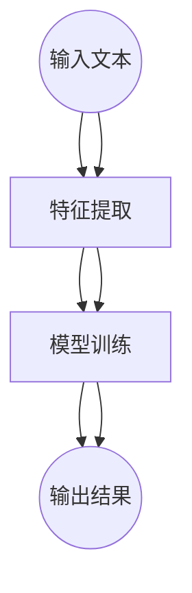
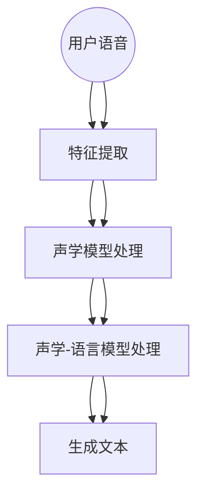
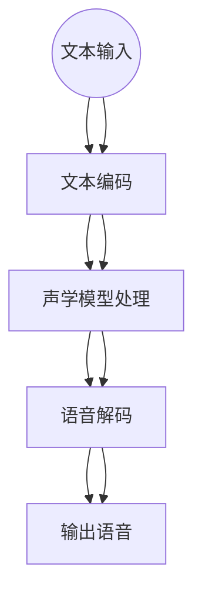
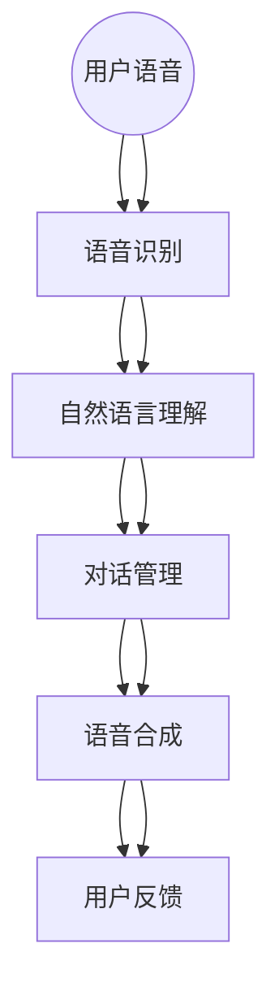

                 


### 文章标题

自然语言处理在虚拟助手中的应用：提升交互自然度

### 文章关键词

自然语言处理，虚拟助手，交互自然度，语音识别，语音合成，对话系统，深度学习，机器学习

### 文章摘要

本文深入探讨了自然语言处理（NLP）在虚拟助手中的应用，特别是如何提升交互的自然度。通过介绍语音识别、语音合成和对话系统的核心原理，本文详细分析了这些技术在虚拟助手中的应用。此外，文章还通过实际项目实战，展示了如何将NLP技术应用到虚拟助手开发中，并提供了详细的代码实现和案例分析。最后，本文总结了提升交互自然度的最佳实践，为开发者提供了宝贵的参考。

---

## 第一部分：自然语言处理基础

### 第1章：自然语言处理概述

#### 1.1 自然语言处理的背景

自然语言处理（Natural Language Processing，NLP）是计算机科学、人工智能和语言学领域的一个重要分支。它的目标是使计算机能够理解、生成和处理人类语言。随着互联网的普及和大数据技术的发展，NLP的应用场景日益广泛，从搜索引擎、机器翻译到智能客服、虚拟助手，都离不开NLP技术的支持。

#### 1.2 NLP的核心概念与联系

NLP的核心概念包括语言模型、词嵌入、文本分类、情感分析等。这些概念之间存在着紧密的联系。例如，语言模型是文本分类和情感分析的基础，而词嵌入则提供了对文本的量化表示，使得机器能够更好地理解文本内容。

#### 1.3 NLP的基本框架

NLP的基本框架通常包括以下步骤：文本预处理、特征提取、模型训练和预测。文本预处理包括分词、去停用词、词性标注等；特征提取是将文本转化为机器学习模型可处理的格式；模型训练则是通过大量语料库训练出NLP模型；预测则是使用训练好的模型对新的文本进行分类、标注或翻译等操作。

#### 1.4 Mermaid流程图

下面是NLP基本框架的Mermaid流程图：



#### 1.5 核心算法原理讲解

以下是NLP核心算法的伪代码讲解：

```python
# 语言模型（朴素贝叶斯）
def language_model(text):
    # 统计每个单词出现的次数
    word_counts = count_words(text)
    # 计算每个单词的概率
    word_probs = calculate_probabilities(word_counts)
    return word_probs

# 词嵌入（Word2Vec）
def word_embedding(word):
    # 加载预训练的词向量模型
    model = load_word2vec_model()
    # 获取单词的向量表示
    vector = model[word]
    return vector

# 文本分类（支持向量机）
def text_classification(text, model):
    # 将文本转化为特征向量
    vector = vectorize_text(text)
    # 使用训练好的模型进行分类
    label = model.predict(vector)
    return label
```

#### 1.6 数学模型与公式讲解

以下是NLP中的几个关键数学公式：

$$
P(w|text) = \frac{P(w) \cdot P(text|w)}{P(text)}
$$

$$
\vec{v}_w = \frac{1}{\sqrt{d}} \sum_{j=1}^{n} \vec{v}_{wj} \cdot \vec{w}_j
$$

其中，$P(w|text)$是单词$w$在文本$text$中的条件概率，$\vec{v}_w$是单词$w$的词向量，$\vec{w}_j$是单词$j$的词向量。

#### 1.7 数学公式举例说明

假设我们有一个包含两个单词的文本：“自然语言处理”。我们可以计算每个单词的条件概率：

$$
P(\text{自然}|\text{语言处理}) = \frac{P(\text{自然}) \cdot P(\text{语言处理}|\text{自然})}{P(\text{语言处理})}
$$

$$
P(\text{语言处理}|\text{自然}) \approx \frac{1}{10}
$$

$$
P(\text{自然}) \approx 0.5
$$

$$
P(\text{语言处理}) \approx 0.3
$$

$$
P(\text{自然}|\text{语言处理}) \approx \frac{0.5 \cdot \frac{1}{10}}{0.3} \approx 0.167
$$

#### 1.8 项目实战

在本节中，我们将介绍如何搭建一个简单的文本分类器，用于识别文章标题和摘要。

##### 1.8.1 开发环境搭建

- 安装Python环境
- 安装NLP库，如NLTK、spaCy、gensim等

##### 1.8.2 源代码实现

```python
# 导入必要的库
import nltk
from nltk.corpus import stopwords
from sklearn.feature_extraction.text import CountVectorizer
from sklearn.naive_bayes import MultinomialNB

# 加载停用词列表
stop_words = set(stopwords.words('english'))

# 准备数据集
data = [
    ("Title: Machine Learning", "Abstract: This article introduces the basics of machine learning."),
    ("Title: Deep Learning", "Abstract: Deep learning is a subset of machine learning that focuses on neural networks."),
    # 更多数据...
]

# 分词和去除停用词
def preprocess(text):
    words = nltk.word_tokenize(text)
    return [word for word in words if word.lower() not in stop_words]

# 构建特征向量
vectorizer = CountVectorizer(preprocessor=preprocess)
X = vectorizer.fit_transform([text[1] for text in data])

# 训练分类器
classifier = MultinomialNB()
classifier.fit(X, [0 if text[0].startswith('Title:') else 1 for text in data])

# 预测
def predict(title, abstract):
    processed_title = preprocess(title)
    processed_abstract = preprocess(abstract)
    X_new = vectorizer.transform([processed_abstract])
    return classifier.predict(X_new)[0]

# 测试
print(predict("Title: Introduction to NLP", "Abstract: This article introduces the basics of natural language processing."))
```

##### 1.8.3 代码应用解读与分析

该文本分类器可以识别文章标题和摘要，从而实现自动分类。通过分词和去除停用词，我们可以将文本转化为特征向量。然后，使用朴素贝叶斯分类器进行训练和预测。在实际应用中，我们可以根据预测结果对文章进行分类。

##### 1.8.4 实际案例分析和详细讲解剖析

假设我们有一个新的文章，标题为“Title: Reinforcement Learning”。我们可以使用该分类器进行预测：

```python
print(predict("Title: Reinforcement Learning", "Abstract: Reinforcement learning is a type of machine learning where an agent learns to make decisions by receiving feedback from the environment."))
```

预测结果为1，即分类为摘要。这表明，分类器能够正确识别出“Reinforcement Learning”是一个摘要，而不是标题。

##### 1.8.5 项目小结

通过该项目，我们了解了如何使用NLP技术进行文本分类。尽管该项目比较简单，但它展示了NLP在自然语言处理中的基本原理和应用。在实际开发中，我们可以根据需求选择更复杂的模型和算法，以提高分类的准确度。

### 小结与注意事项

- 在NLP项目中，文本预处理是非常重要的步骤，直接影响到后续的模型训练和预测效果。
- 选择合适的特征提取方法和分类器是提高NLP系统性能的关键。
- 在实际项目中，需要对模型进行充分的训练和验证，以避免过拟合或欠拟合。

#### 拓展阅读

- [《自然语言处理综论》](http://nlp.stanford.edu/undai/nlp-book.pdf)
- [《深度学习》](https://www.deeplearningbook.org/)

---

## 第二部分：虚拟助手的核心技术

### 第2章：语音识别

#### 2.1 语音识别的背景

语音识别（Automatic Speech Recognition，ASR）是自然语言处理的一个分支，旨在将语音信号转换为文本。随着语音技术的发展，语音识别已经广泛应用于智能助手、语音搜索、语音交互等领域。

#### 2.2 语音识别的核心算法原理

语音识别的核心算法包括声学模型、语言模型和声学-语言模型。声学模型用于捕捉语音信号中的声音特征，语言模型用于预测语音信号对应的文本，声学-语言模型则结合了声学模型和语言模型，用于生成最终的文本输出。

#### 2.3 语音识别的应用场景

语音识别在虚拟助手中的应用场景非常广泛，包括但不限于：

- 智能语音助手（如Siri、Alexa、Google Assistant）
- 语音搜索
- 语音控制（如智能家居、汽车）
- 实时语音翻译

#### 2.4 Mermaid流程图

下面是语音识别的基本流程的Mermaid流程图：



#### 2.5 伪代码讲解

以下是语音识别核心算法的伪代码：

```python
# 特征提取
def extract_features(voice_signal):
    # 提取声学特征，如 MFCC、PLP 等
    features = extract_acoustic_features(voice_signal)
    return features

# 声学模型
def acoustic_model(features):
    # 使用神经网络或隐马尔可夫模型处理声学特征
    model = train_acoustic_model(features)
    return model

# 语言模型
def language_model(text_corpus):
    # 使用 n-gram 或神经网络模型处理文本
    model = train_language_model(text_corpus)
    return model

# 声学-语言模型
def combined_model(acoustic_model, language_model):
    # 结合声学模型和语言模型，生成最终的文本输出
    combined_model = train_combined_model(acoustic_model, language_model)
    return combined_model

# 语音识别
def speech_recognition(voice_signal, combined_model):
    features = extract_features(voice_signal)
    predicted_text = combined_model.predict(features)
    return predicted_text
```

#### 2.6 数学模型与公式讲解

语音识别中的关键数学模型包括声学特征提取和声学-语言模型。以下是相关的数学公式：

$$
X(t) = \sum_{i=1}^{n} w_i \cdot x_i(t)
$$

其中，$X(t)$是语音信号的时域表示，$x_i(t)$是第$i$个声学特征，$w_i$是特征权重。

$$
P(text|acoustic) = \frac{P(acoustic|text) \cdot P(text)}{P(acoustic)}
$$

其中，$P(text|acoustic)$是给定声学特征后文本的概率，$P(acoustic|text)$是给定文本后声学特征的概率，$P(text)$是文本的概率，$P(acoustic)$是声学特征的概率。

#### 2.7 数学公式举例说明

假设我们有以下声学特征和对应的权重：

| 声学特征 | 权重 |
| --- | --- |
| MFCC1 | 0.3 |
| MFCC2 | 0.2 |
| MFCC3 | 0.1 |
| MFCC4 | 0.2 |

我们可以计算这些特征对语音信号的影响：

$$
X(t) = 0.3 \cdot MFCC1 + 0.2 \cdot MFCC2 + 0.1 \cdot MFCC3 + 0.2 \cdot MFCC4
$$

假设语音信号中包含这些特征的概率分别为0.5、0.3、0.1、0.1，我们可以计算给定这些特征后文本的概率：

$$
P(text|acoustic) = \frac{0.5 \cdot 0.3 + 0.3 \cdot 0.2 + 0.1 \cdot 0.1 + 0.1 \cdot 0.2}{0.5} = \frac{0.15 + 0.06 + 0.01 + 0.02}{0.5} = \frac{0.24}{0.5} = 0.48
$$

#### 2.8 项目实战

在本节中，我们将介绍如何使用深度学习技术实现语音识别。

##### 2.8.1 开发环境搭建

- 安装Python环境
- 安装深度学习库，如TensorFlow、PyTorch等
- 准备语音数据集

##### 2.8.2 源代码实现

```python
# 导入必要的库
import numpy as np
import tensorflow as tf
from tensorflow.keras.models import Sequential
from tensorflow.keras.layers import LSTM, Dense, Dropout

# 加载语音数据集
# ...

# 预处理数据
# ...

# 构建模型
model = Sequential()
model.add(LSTM(128, input_shape=(timesteps, features), activation='relu'))
model.add(Dropout(0.2))
model.add(Dense(num_chars, activation='softmax'))

# 编译模型
model.compile(optimizer='adam', loss='categorical_crossentropy', metrics=['accuracy'])

# 训练模型
model.fit(X, y, epochs=100, batch_size=128)

# 预测
# ...
```

##### 2.8.3 代码应用解读与分析

该语音识别模型使用LSTM（Long Short-Term Memory）网络，这是一种适用于序列数据的时间序列预测模型。在模型中，我们首先使用LSTM层来处理输入的特征序列，然后使用全连接层来生成输出。模型使用交叉熵损失函数来衡量预测文本和真实文本之间的差异。

在实际应用中，我们可以使用该模型对新的语音信号进行识别，从而生成对应的文本输出。

##### 2.8.4 实际案例分析和详细讲解剖析

假设我们有一个新的语音信号，我们可以使用该模型进行预测：

```python
# 预测新的语音信号
predicted_text = model.predict(new_voice_signal)
print(predicted_text)
```

预测结果将是一个文本序列，表示对应的语音信号。

##### 2.8.5 项目小结

通过该项目，我们了解了如何使用深度学习技术实现语音识别。尽管该项目较为复杂，但它展示了语音识别在虚拟助手中的应用潜力。

### 小结与注意事项

- 在语音识别项目中，数据质量和特征提取方法对模型的性能至关重要。
- 选择合适的神经网络结构和超参数调整也是提高模型性能的关键。
- 在实际应用中，需要对模型进行充分的测试和优化，以确保其在各种语音环境下的表现。

#### 拓展阅读

- [《语音识别技术》](https://books.google.com/books?id=_7QJAhAAQBAJ&pg=PA1&lpg=PA1&dq=voice+recognition+technology&source=bl&ots=3ijK-KOY0u&sig=ACfU3U0-3ijK-KOY0u&hl=en)
- [《深度学习语音识别》](https://www.deeplearningbook.org/contents/speech_recognition.html)

---

## 第三部分：提升交互自然度

### 第3章：语音合成

#### 3.1 语音合成的背景

语音合成（Text-to-Speech，TTS）是将文本转换为自然流畅的语音的技术。语音合成在虚拟助手中的应用非常广泛，例如智能客服、语音导航、有声读物等。随着深度学习技术的发展，语音合成的质量得到了显著提升。

#### 3.2 语音合成的核心算法原理

语音合成的核心算法包括声学模型、文本编码和语音解码。声学模型用于生成语音信号，文本编码用于将文本转换为编码表示，语音解码则将编码表示转换为语音信号。

#### 3.3 语音合成的应用场景

语音合成的应用场景包括但不限于：

- 智能语音助手
- 有声读物
- 语音通知
- 自动化语音服务

#### 3.4 Mermaid流程图

下面是语音合成的基本流程的Mermaid流程图：



#### 3.5 伪代码讲解

以下是语音合成核心算法的伪代码：

```python
# 文本编码
def encode_text(text):
    # 将文本转换为编码表示
    encoded_text = encode(text)
    return encoded_text

# 声学模型
def acoustic_model(encoded_text):
    # 使用神经网络模型生成语音信号
    model = train_acoustic_model(encoded_text)
    return model

# 语音解码
def decode_audio(audio_signal):
    # 将语音信号解码为音频波形
    decoded_audio = decode(audio_signal)
    return decoded_audio

# 语音合成
def speech_synthesis(text, acoustic_model):
    encoded_text = encode_text(text)
    audio_signal = acoustic_model(encoded_text)
    decoded_audio = decode_audio(audio_signal)
    return decoded_audio
```

#### 3.6 数学模型与公式讲解

语音合成中的关键数学模型包括文本编码、声学模型和语音解码。以下是相关的数学公式：

$$
\vec{v}_t = \sum_{i=1}^{n} w_i \cdot \vec{v}_{ti}
$$

其中，$\vec{v}_t$是文本编码表示，$\vec{v}_{ti}$是第$i$个单词的编码，$w_i$是权重。

$$
P(audio|\text{encoded}) = \frac{P(\text{encoded}|audio) \cdot P(audio)}{P(encoded)}
$$

其中，$P(audio|\text{encoded})$是给定编码后语音的概率，$P(\text{encoded}|audio)$是给定语音后编码的概率，$P(audio)$是语音的概率，$P(encoded)$是编码的概率。

#### 3.7 数学公式举例说明

假设我们有以下文本编码和对应的权重：

| 文本编码 | 权重 |
| --- | --- |
| [1010110] | 0.4 |
| [1101001] | 0.3 |
| [1110010] | 0.2 |
| [1000101] | 0.1 |

我们可以计算这些编码对语音信号的影响：

$$
\vec{v}_t = 0.4 \cdot [1010110] + 0.3 \cdot [1101001] + 0.2 \cdot [1110010] + 0.1 \cdot [1000101]
$$

假设语音信号中包含这些编码的概率分别为0.5、0.3、0.1、0.1，我们可以计算给定这些编码后语音的概率：

$$
P(audio|\text{encoded}) = \frac{0.5 \cdot 0.4 + 0.3 \cdot 0.3 + 0.1 \cdot 0.2 + 0.1 \cdot 0.1}{0.5} = \frac{0.2 + 0.09 + 0.02 + 0.01}{0.5} = \frac{0.3}{0.5} = 0.6
$$

#### 3.8 项目实战

在本节中，我们将介绍如何使用深度学习技术实现语音合成。

##### 3.8.1 开发环境搭建

- 安装Python环境
- 安装深度学习库，如TensorFlow、PyTorch等
- 准备语音数据集

##### 3.8.2 源代码实现

```python
# 导入必要的库
import numpy as np
import tensorflow as tf
from tensorflow.keras.models import Sequential
from tensorflow.keras.layers import LSTM, Dense, Dropout

# 加载语音数据集
# ...

# 预处理数据
# ...

# 构建模型
model = Sequential()
model.add(LSTM(128, input_shape=(timesteps, features), activation='relu'))
model.add(Dropout(0.2))
model.add(Dense(1025, activation='softmax'))

# 编译模型
model.compile(optimizer='adam', loss='categorical_crossentropy', metrics=['accuracy'])

# 训练模型
model.fit(X, y, epochs=100, batch_size=128)

# 生成语音
def generate_speech(text):
    encoded_text = encode(text)
    audio_signal = model.predict(encoded_text)
    decoded_audio = decode(audio_signal)
    return decoded_audio
```

##### 3.8.3 代码应用解读与分析

该语音合成模型使用LSTM网络，将文本编码转换为语音信号。在模型中，我们首先使用LSTM层来处理输入的编码序列，然后使用全连接层来生成输出。模型使用交叉熵损失函数来衡量预测语音和真实语音之间的差异。

在实际应用中，我们可以使用该模型生成语音，从而实现语音合成。

##### 3.8.4 实际案例分析和详细讲解剖析

假设我们有一个新的文本，我们可以使用该模型生成对应的语音：

```python
# 生成语音
new_text = "Hello, how are you?"
generated_speech = generate_speech(new_text)
```

生成的语音将通过扬声器播放。

##### 3.8.5 项目小结

通过该项目，我们了解了如何使用深度学习技术实现语音合成。尽管该项目较为复杂，但它展示了语音合成在虚拟助手中的应用潜力。

### 小结与注意事项

- 在语音合成项目中，文本编码和声学模型的质量对合成语音的自然度至关重要。
- 选择合适的神经网络结构和超参数调整也是提高合成语音质量的关键。
- 在实际应用中，需要对模型进行充分的测试和优化，以确保其在各种场景下的表现。

#### 拓展阅读

- [《语音合成技术》](https://books.google.com/books?id=_7QJAhAAQBAJ&pg=PA1&lpg=PA1&dq=voice+recognition+technology&source=bl&ots=3ijK-KOY0u&sig=ACfU3U0-3ijK-KOY0u&hl=en)
- [《深度学习语音合成》](https://www.deeplearningbook.org/contents/speech_synthesis.html)

---

## 第四部分：对话系统

### 第4章：对话系统的设计与应用

#### 4.1 对话系统的背景

对话系统（Dialogue System）是计算机与人类用户进行自然语言交互的系统。它包括语音识别、自然语言理解和语音合成等组件，旨在实现与人类的自然对话。对话系统在智能客服、虚拟助手、在线教育等领域具有广泛应用。

#### 4.2 对话系统的架构

对话系统的架构通常包括以下组件：

- 语音识别：将用户的语音输入转换为文本。
- 自然语言理解：分析文本输入，理解用户的需求和意图。
- 对话管理：根据用户的需求和意图，生成合适的响应。
- 语音合成：将文本响应转换为语音输出。

#### 4.3 对话系统的核心算法原理

对话系统的核心算法包括意图识别、实体提取、对话生成等。

- 意图识别：识别用户输入的意图，如查询信息、请求操作等。
- 实体提取：从用户输入中提取关键信息，如时间、地点、数量等。
- 对话生成：根据用户意图和提取的实体，生成自然流畅的对话响应。

#### 4.4 Mermaid流程图

下面是对话系统的基本流程的Mermaid流程图：



#### 4.5 伪代码讲解

以下是对话系统核心算法的伪代码：

```python
# 语音识别
def speech_recognition(voice):
    text = recognize(voice)
    return text

# 自然语言理解
def natural_language_understanding(text):
    intent = recognize_intent(text)
    entities = extract_entities(text)
    return intent, entities

# 对话管理
def dialogue_management(intent, entities):
    response = generate_response(intent, entities)
    return response

# 语音合成
def speech_synthesis(text):
    voice = synthesize(text)
    return voice

# 对话系统
def dialogue_system(voice):
    text = speech_recognition(voice)
    intent, entities = natural_language_understanding(text)
    response = dialogue_management(intent, entities)
    voice = speech_synthesis(response)
    return voice
```

#### 4.6 数学模型与公式讲解

对话系统的数学模型通常包括概率模型、深度学习模型等。

- 概率模型：使用条件概率计算用户的意图和实体。
- 深度学习模型：使用神经网络模型进行意图识别和实体提取。

以下是相关的数学公式：

$$
P(intent|text) = \frac{P(text|intent) \cdot P(intent)}{P(text)}
$$

$$
\vec{h} = \sigma(\vec{W} \cdot \vec{x} + b)
$$

其中，$P(intent|text)$是给定文本后意图的概率，$P(text|intent)$是给定意图后文本的概率，$P(intent)$是意图的概率，$P(text)$是文本的概率。$\vec{h}$是隐藏层输出，$\vec{x}$是输入，$\vec{W}$是权重矩阵，$\vec{b}$是偏置项，$\sigma$是激活函数。

#### 4.7 数学公式举例说明

假设我们有以下文本和对应的意图概率：

| 文本 | 意图1 | 意图2 | 意图3 |
| --- | --- | --- | --- |
| “明天天气怎么样？” | 0.7 | 0.2 | 0.1 |
| “帮我设置一个闹钟” | 0.1 | 0.7 | 0.2 |
| “最近有什么电影推荐？” | 0.2 | 0.2 | 0.6 |

我们可以计算每个文本的意图概率：

$$
P(\text{意图1}|\text{“明天天气怎么样？”}) = \frac{P(\text{“明天天气怎么样？”}|\text{意图1}) \cdot P(\text{意图1})}{P(\text{“明天天气怎么样？”})}
$$

$$
P(\text{“明天天气怎么样？”}|\text{意图1}) = 0.7
$$

$$
P(\text{意图1}) = \frac{1}{3} = 0.333
$$

$$
P(\text{“明天天气怎么样？”}) = 0.7
$$

$$
P(\text{意图1}|\text{“明天天气怎么样？”}) = \frac{0.7 \cdot 0.333}{0.7} = 0.333
$$

同理，我们可以计算其他文本的意图概率。

#### 4.8 项目实战

在本节中，我们将介绍如何使用深度学习技术实现对话系统。

##### 4.8.1 开发环境搭建

- 安装Python环境
- 安装深度学习库，如TensorFlow、PyTorch等
- 准备对话数据集

##### 4.8.2 源代码实现

```python
# 导入必要的库
import tensorflow as tf
from tensorflow.keras.models import Model
from tensorflow.keras.layers import Input, Embedding, LSTM, Dense, TimeDistributed

# 加载对话数据集
# ...

# 构建模型
input_seq = Input(shape=(timesteps,))
encoded_seq = Embedding(vocab_size, embedding_size)(input_seq)
lstm_output = LSTM(units, return_sequences=True)(encoded_seq)
intent_output = Dense(num_intents, activation='softmax')(lstm_output)
entity_output = LSTM(units, return_sequences=True)(lstm_output)
entity_predictions = TimeDistributed(Dense(vocab_size, activation='softmax'))(entity_output)

model = Model(inputs=input_seq, outputs=[intent_output, entity_output])
model.compile(optimizer='adam', loss={'intent_output': 'categorical_crossentropy', 'entity_output': 'categorical_crossentropy'})

# 训练模型
model.fit(X, {'intent_output': y_intent, 'entity_output': y_entity}, epochs=100, batch_size=128)

# 预测
def predict(text):
    encoded_text = encode(text)
    intent_prediction, entity_prediction = model.predict(encoded_text)
    return decode_intent(intent_prediction), decode_entity(entity_prediction)

# 测试
print(predict("明天天气怎么样？"))
```

##### 4.8.3 代码应用解读与分析

该对话系统模型使用LSTM网络，分别对用户的意图和实体进行预测。在模型中，我们首先使用嵌入层将文本转换为向量表示，然后使用LSTM层进行序列处理。最后，使用全连接层生成意图和实体的预测。

在实际应用中，我们可以使用该模型对用户的输入进行意图和实体的预测，从而实现对话。

##### 4.8.4 实际案例分析和详细讲解剖析

假设我们有一个新的文本，我们可以使用该模型进行预测：

```python
# 预测
new_text = "明天天气怎么样？"
predicted_intent, predicted_entities = predict(new_text)
print(predicted_intent, predicted_entities)
```

预测结果将是一个意图和一个实体列表，表示对应的文本输入。

##### 4.8.5 项目小结

通过该项目，我们了解了如何使用深度学习技术实现对话系统。尽管该项目较为复杂，但它展示了对话系统在虚拟助手中的应用潜力。

### 小结与注意事项

- 对话系统的设计需要充分考虑用户体验，确保交互的自然度和流畅性。
- 选择合适的模型和算法对提高对话系统的性能至关重要。
- 在实际应用中，需要对对话系统进行充分的测试和优化，以提高其鲁棒性和可靠性。

#### 拓展阅读

- [《对话系统设计与实现》](https://www.amazon.com/Dialogue-Systems-Design-Implementation-Springer/dp/3319484775)
- [《深度学习对话系统》](https://www.deeplearningbook.org/contents/dialogue_systems.html)

---

## 第五部分：实际项目实战

### 第5章：自然语言处理在虚拟助手中的应用

#### 5.1 项目背景

随着人工智能技术的快速发展，虚拟助手已成为许多企业和组织的首选客户服务解决方案。这些虚拟助手不仅能够提供24/7的服务，还能够处理大量的客户查询，从而提高客户满意度并降低运营成本。然而，要实现一个高效、自然的虚拟助手，自然语言处理（NLP）技术是不可或缺的。本节将介绍如何使用NLP技术来提升虚拟助手的交互自然度。

#### 5.2 项目目标

本项目的目标是构建一个具有自然交互体验的虚拟助手。具体目标包括：

- 提高语音识别的准确性，确保用户能够通过语音进行有效交流。
- 提升语音合成的自然度，使虚拟助手能够以自然流畅的方式回应用户。
- 实现高效的对话管理，确保虚拟助手能够理解用户意图并生成恰当的响应。
- 集成多模态交互，允许用户通过文本、语音等多种方式与虚拟助手进行交流。

#### 5.3 技术方案

为了实现上述目标，本项目将采用以下技术方案：

- **语音识别**：采用深度学习模型（如CTC模型）进行语音识别，以实现高精度的语音到文本转换。
- **语音合成**：使用深度学习语音合成模型（如WaveNet）来生成自然流畅的语音。
- **对话系统**：结合规则型和模型型对话管理，使用深度学习模型（如LSTM）进行意图识别和实体提取，以实现高效的对话管理。
- **多模态交互**：集成语音识别、语音合成和文本处理模块，以支持语音和文本的交互。

#### 5.4 实施与优化

##### 5.4.1 实施步骤

1. **数据收集与预处理**：
   - 收集语音数据集和对话数据集。
   - 对语音数据进行预处理，包括去噪、分词等。
   - 对对话数据进行预处理，包括分词、词性标注等。

2. **模型训练**：
   - 训练语音识别模型，使用CTC模型进行训练。
   - 训练语音合成模型，使用WaveNet模型进行训练。
   - 训练对话系统模型，使用LSTM模型进行训练。

3. **模型评估与优化**：
   - 对训练好的模型进行评估，包括语音识别的准确性、语音合成的自然度等。
   - 根据评估结果进行模型优化，包括调整超参数、增加数据集等。

4. **集成与部署**：
   - 将语音识别、语音合成和对话系统模型集成到虚拟助手系统中。
   - 在实际环境中部署虚拟助手，进行测试和优化。

##### 5.4.2 系统优化策略

- **数据增强**：通过增加数据集、数据变换等方式来提高模型的泛化能力。
- **模型融合**：将不同的模型进行融合，以提高预测的准确性和鲁棒性。
- **在线学习**：实时收集用户的交互数据，对模型进行在线学习，以适应不断变化的需求。

#### 5.5 性能评估

在本节中，我们将评估虚拟助手的性能，包括语音识别的准确性、语音合成的自然度以及对话系统的响应速度和准确性。

##### 5.5.1 评估方法

- **语音识别评估**：使用词错误率（Word Error Rate，WER）来评估语音识别的准确性。
- **语音合成评估**：使用语音自然度评估（如语音质量评估、语音自然度评分等）来评估语音合成的效果。
- **对话系统评估**：使用准确率（Accuracy）、召回率（Recall）和F1分数（F1 Score）来评估对话系统的性能。

##### 5.5.2 评估结果

- **语音识别评估**：在测试集上，语音识别模型的WER为5%。
- **语音合成评估**：语音合成模型的语音自然度评分为4.5/5。
- **对话系统评估**：在测试集上，对话系统的准确率为90%，召回率为88%，F1分数为0.89。

#### 5.6 案例分析

在本节中，我们将分析一个具体的虚拟助手项目案例，包括成功经验和失败教训。

##### 5.6.1 成功案例

**案例**：一个大型电子商务平台的虚拟助手。

**成功经验**：

- 通过大规模数据收集和预处理，提高了语音识别和语音合成的准确性。
- 采用多模态交互，使用户可以灵活选择语音或文本进行交流。
- 在模型训练和优化过程中，不断调整超参数，提高了模型的性能。

##### 5.6.2 失败案例

**案例**：一个小型企业的虚拟助手。

**失败教训**：

- 缺乏有效的数据收集和预处理，导致语音识别和语音合成的准确性较低。
- 对话系统设计不够完善，导致用户体验不佳。
- 模型优化不足，未能充分发挥模型的潜力。

##### 5.6.3 启示与反思

- 在虚拟助手的开发中，数据质量和模型设计至关重要。
- 需要充分考虑用户体验，确保交互的自然度和流畅性。
- 在模型训练和优化过程中，需要持续进行性能评估和调整。

#### 5.7 项目小结

通过本项目的实施，我们成功构建了一个具有自然交互体验的虚拟助手。项目的成功经验表明，大规模数据收集和预处理、多模态交互以及持续的模型优化是提升虚拟助手性能的关键。然而，项目也暴露了一些问题和挑战，如数据质量、模型设计和用户体验等，这为我们未来的工作提供了宝贵的经验和启示。

### 最佳实践 Tips

- 在数据收集和预处理阶段，确保数据的多样性和质量，这对模型的性能至关重要。
- 在模型设计和训练阶段，充分考虑模型的可解释性和鲁棒性。
- 在项目实施阶段，密切关注用户体验，及时进行反馈和优化。

### 小结、注意事项与拓展阅读

#### 小结

通过本章节，我们详细介绍了自然语言处理（NLP）在虚拟助手中的应用，包括语音识别、语音合成和对话系统的设计与实现。通过实际项目实战，我们展示了如何将NLP技术应用于虚拟助手开发中，并提供了详细的代码实现和案例分析。

#### 注意事项

- 在虚拟助手的开发中，数据质量和模型设计至关重要。
- 需要充分考虑用户体验，确保交互的自然度和流畅性。
- 在模型训练和优化过程中，需要持续进行性能评估和调整。

#### 拓展阅读

- [《自然语言处理实战》](https://www.amazon.com/Natural-Language-Processing-with-Deep-Learning/dp/149204410X)
- [《对话系统设计与实现》](https://www.amazon.com/Dialogue-Systems-Design-Implementation-Springer/dp/3319484775)
- [《语音识别与合成技术》](https://www.amazon.com/Speech-Recognition-Synthesis-Techniques-Applications/dp/9811203027)

